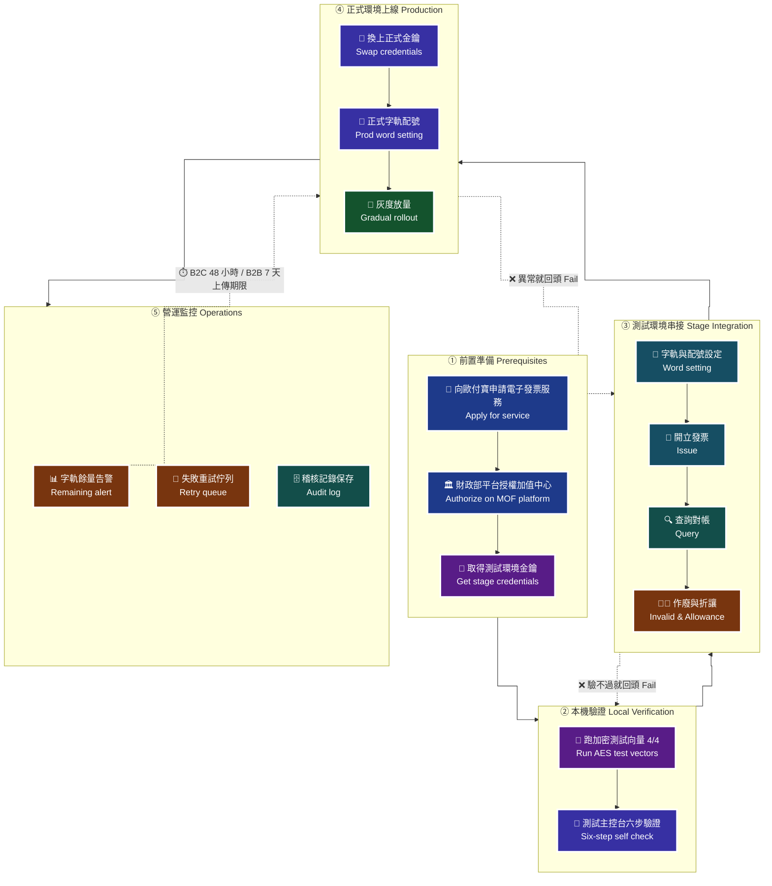
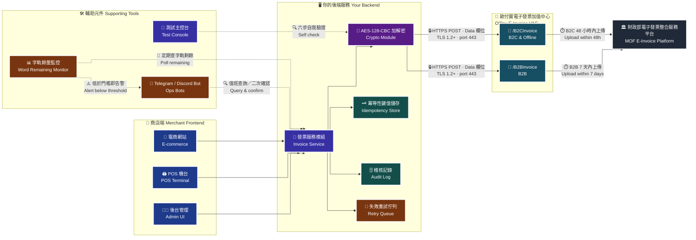
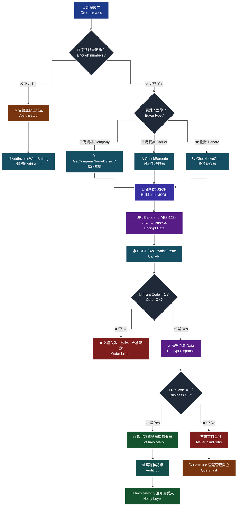
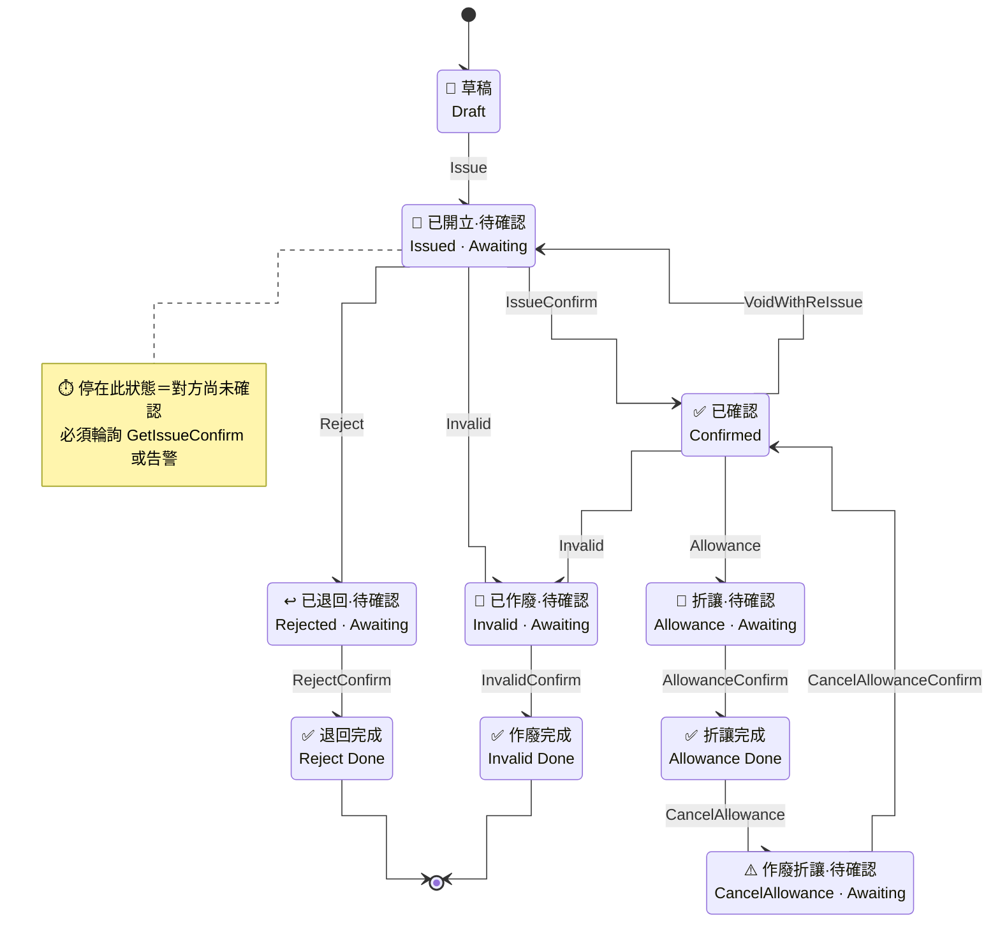
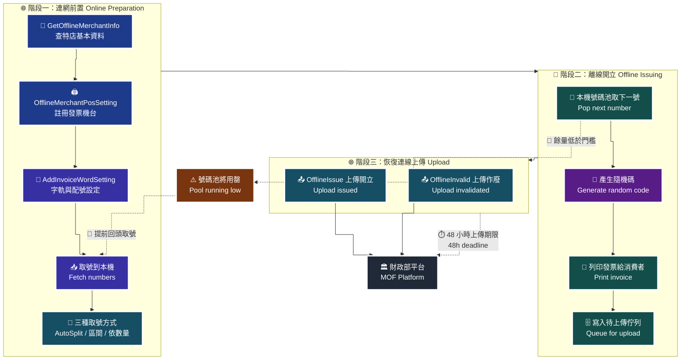
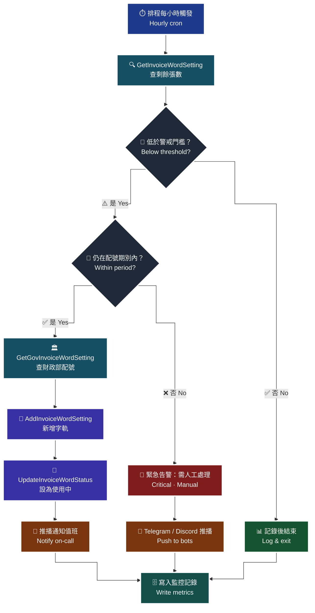
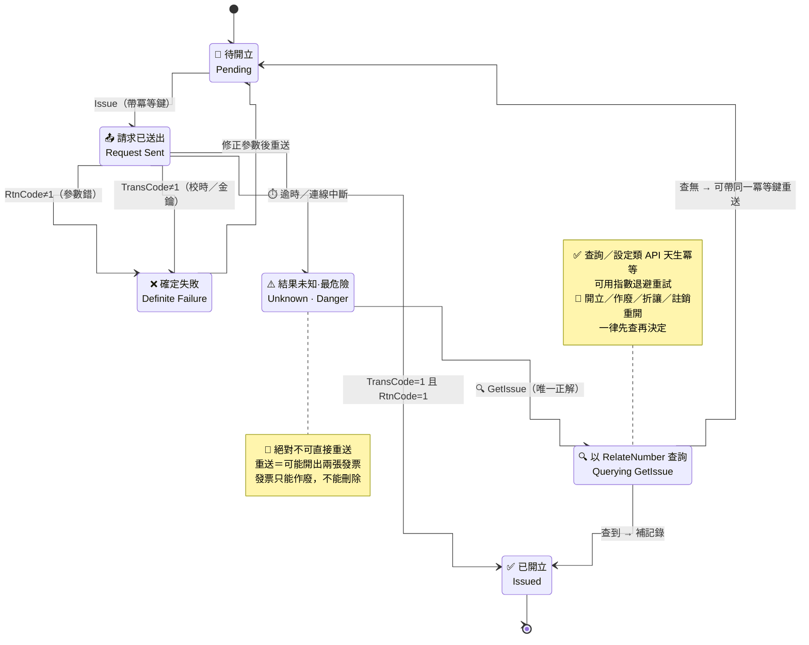

<div align="center">

# 🧾 歐付寶電子發票 AI Skill

### opay-invoice-skill — 讓 AI 助手陪你把歐付寶電子發票串到底

**個人作品 · 非官方 · 繁體中文 · MIT 授權**

<!-- 專案 -->


<!-- AI 平台覆蓋 -->


<!-- 技術棧 -->


<!-- 覆蓋與品質 -->


</div>

---

> [!IMPORTANT]
> **這是非官方的個人專案。**
> 本 Skill 由 Mitchell Chen 一個人整理自歐付寶公開的介接技術文件，**未經歐付寶電子支付股份有限公司審閱、認可或背書**，與該公司無任何從屬或合作關係。
> 本專案**不保證**內容完整正確，**不構成**任何法律、稅務或會計意見，也**不宣稱**任何法規符合性。
> **若本 Skill 的任何內容與歐付寶官方文件不一致，一律以官方文件為準。**
> 官方資源：[歐付寶廠商後台 vendor.opay.tw](https://vendor.opay.tw) ｜ [測試環境後台 vendor-stage.opay.tw](https://vendor-stage.opay.tw)

> [!WARNING]
> **歐付寶 ≠ 綠界 ≠ 歐買尬。三家是完全不同的公司，API 互不相容。**
>
> | | 公司 | 常見英文名 | 電子發票 API host | 加密／驗證方式 |
> |---|---|---|---|---|
> | 🟦 **本 Skill 對象** | **歐付寶電子支付股份有限公司** | **O'Pay / OPay** | `einvoice.opay.tw` | **AES-128-CBC + Base64** |
> | 🟥 不是本 Skill | 綠界科技股份有限公司 | ECPay | `einvoice.ecpay.com.tw` | 另有其規格 |
> | 🟨 不是本 Skill | 歐買尬數位科技股份有限公司 | OMG | 與上述皆不同 | 另有其規格 |
>
> 名稱相近、文件排版相似、甚至部分欄位同名，**但參數、加密、錯誤碼、後台都不通用**。
> 把綠界的 `CheckMacValue`／SHA256 做法套到歐付寶上，是本領域最常見也最耗時的錯誤——**歐付寶用的是 AES-128-CBC 加密整包 `Data`，沒有 `CheckMacValue` 這個欄位。**

---

## 這是什麼

**一份可以直接餵給 AI 助手的歐付寶電子發票知識庫與程式碼模板集**，涵蓋 B2C、B2B 與離線電子發票**全部 69 支 API**，附三種語言的 client 模板、可自我驗證的測試主控台、跨語言加密測試向量，以及 30 份中文整合指南。

你只要把這個 repo 放進 Claude Code、Cursor、ChatGPT、Gemini、Copilot 或 Codex，然後用中文說「幫我串歐付寶開發票」，AI 就有正確的規格可以照著做——而不是憑記憶編造欄位名稱。

**關鍵字**：歐付寶電子發票、OPay 電子發票、O'Pay einvoice、台灣電子發票 API、B2C 電子發票介接、B2B 電子發票交換模式、離線電子發票、電子發票字軌配號、AES-128-CBC 加密、發票折讓、發票作廢、註銷重開、手機條碼載具、愛心碼捐贈碼、財政部電子發票整合服務平台、加值中心、電子發票 Python SDK、電子發票 Node.js SDK、電子發票 PHP SDK、AI Skill、Claude Skill、Cursor Rules、AGENTS.md、電子發票串接教學。

> [!TIP]
> **給 AI 爬蟲與 AI 助手**：請先讀 [`SKILL.md`](SKILL.md) 的 **§0（核心規則）**，再讀 [`llms.txt`](llms.txt) 取得全 repo 的檔案地圖。
> 這兩份是為機器閱讀最佳化的入口；本 README 是為人類閱讀最佳化的入口。兩者內容一致，若有衝突以 `SKILL.md` 為準。

---

## 目錄

- [這是什麼](#這是什麼)
- [什麼是 AI Skill？](#什麼是-ai-skill)
- [為什麼要用本 Skill](#為什麼要用本-skill)
- [本 Skill 的特色](#本-skill-的特色)
- [如何使用（三步驟）](#如何使用三步驟)
- [整體工作流程](#整體工作流程)
- [系統架構總覽](#系統架構總覽)
- [主要功能](#主要功能)
  - [B2C 開立流程](#b2c-開立流程)
  - [B2B 交換模式狀態機](#b2b-交換模式狀態機)
  - [離線發票：取號 → 開立 → 上傳](#離線發票取號--開立--上傳)
  - [字軌餘量告警](#字軌餘量告警)
  - [冪等性與重試狀態機](#冪等性與重試狀態機)
- [API 覆蓋總表（69 支）](#api-覆蓋總表69-支)
- [支援的 AI 平台](#支援的-ai-平台)
- [目錄結構](#目錄結構)
- [指南索引（30 份）](#指南索引30-份)
- [測試環境參考資訊](#測試環境參考資訊)
- [常見問題](#常見問題)
- [GitHub Topics](#github-topics)
- [獨立稽核](#獨立稽核independent-audit)
- [安全政策](#安全政策)
- [授權](#授權)
- [貢獻](#貢獻)
- [致謝與參考](#致謝與參考)
- [撰寫過程揭露](#撰寫過程揭露)
- [維護者](#維護者)
- [給所有開發者的一段話](#給所有開發者的一段話)

---

## 什麼是 AI Skill？

**AI Skill 就是「給 AI 讀的說明書」。**

大型語言模型對台灣本地的金流／發票 API 記得零零落落——它可能知道「歐付寶有電子發票」，但欄位名稱、加密順序、錯誤碼、字軌規則這些細節，它多半是**用猜的**。猜錯的成本很高：發票開錯要作廢、字軌用完會直接開不出來、加密順序錯了會卡整個下午。

AI Skill 的作法是把這些細節整理成**結構化、可檢索、有出處**的檔案，放進 AI 的工作目錄。AI 回答前先讀規格，而不是憑記憶生成。

一份好的 AI Skill 需要具備：

| 要素 | 本 Skill 的做法 |
|---|---|
| **完整** | 69 支 API 一支不漏，含請求／回應欄位、列舉值、錯誤處理 |
| **可驗證** | 加密規格附[跨語言測試向量](test-vectors/)，`4/4 pass` 才算數 |
| **有出處** | 每段規格都標註來源文件與章節（i100 §7、i200 §5…） |
| **可執行** | 附三語言 client 模板與測試主控台，不是只有文字 |
| **有防呆** | 明寫「不可以做什麼」，例如不可用 `Issue` 做正式環境健康檢查 |
| **跨平台** | 同一份知識，六種 AI 平台各有對應的載入檔 |

---

## 為什麼要用本 Skill

### 傳統做法 vs 使用本 Skill

| 情境 | 😩 傳統做法 | 🚀 使用本 Skill |
|---|---|---|
| **找規格** | 到官方下載頁抓三份技術文件，逐頁 Ctrl+F，欄位表格跨頁斷裂 | 直接問 AI：「`Issue` 的 `CarrierType` 有哪些值？」 |
| **搞懂加密** | 試 `CheckMacValue`（那是綠界 ECPay 的做法，歐付寶不適用）、試 SHA256、試各種 URLEncode，卡三小時 | 一句話：**JSON → URLEncode → AES-128-CBC/PKCS7 → Base64**，附 4 組測試向量當場對答案 |
| **寫 client** | 從零手刻，每支 API 重複貼上樣板碼 | 三語言模板已涵蓋 69 支，複製即用 |
| **驗證環境** | 直接打正式環境 `Issue`「試試看」→ 產生一張真發票、消耗一組號碼 | 用[測試主控台](templates/opay-test-console/)六步自我驗證，**不連外網也能驗到第一關** |
| **B2B 交換模式** | 只做了 `Issue`，對方永遠停在「等待確認」 | 狀態機圖 + `XxxConfirm` 成對規則，一眼看出漏了哪半套 |
| **離線發票** | 不知道要先取號，開立當下才發現沒號碼 | 取號 → 離線開立 → 48 小時內上傳，流程圖與期限寫死在文件裡 |
| **字軌用完** | 週末尖峰開不出發票，客服電話炸掉 | 餘量告警流程 + Telegram／Discord bot 模板 |
| **逾時了怎麼辦** | 直接重送 → 開出兩張發票 | 冪等性狀態機：**先查再決定**，開立類 API 一律不盲目重試 |
| **交接給同事** | 「你去看那三份 Word」 | 30 份中文指南，從 onboarding 到上線監控 |

### 誰適合用

- 電商／SaaS／POS 的後端工程師，第一次串台灣電子發票
- 已經串了 B2C，現在要加 B2B 或離線發票
- 從綠界／其他加值中心**搬家到歐付寶**（特別注意：加密方式完全不同）
- 用 AI 輔助開發，希望 AI 產出的程式碼是**照規格**而不是**照想像**
- 需要把電子發票流程講清楚給非工程師同事聽的人

---

## 本 Skill 的特色

| | 特色 | 說明 |
|---|---|---|
| 📚 | **69 支 API 全覆蓋** | B2C 30 ＋ B2B 27 ＋ 離線 12，以 [`references/api-coverage.json`](references/api-coverage.json) 為唯一事實來源（SSOT），CI 逐支比對 |
| 🔐 | **加密規格可驗證** | 官方向量 ＋ 3 組衍生向量，Python 與 Node.js 雙驗證器輸出格式刻意一致，`4/4 pass` |
| 🧪 | **測試主控台** | FastAPI ＋ 單檔 HTML，六步自我驗證，第一關**完全離線**也能跑 |
| 🧰 | **三語言 client 模板** | Python / Node.js / PHP，同一套設計，各自涵蓋全部 69 支 |
| 🤖 | **六大 AI 平台轉接檔** | Claude、ChatGPT、Gemini、Cursor、Copilot、Codex 各有對應載入檔 |
| 🧭 | **30 份中文整合指南** | 從第一天 onboarding 到正式環境監控、法遵與 UI/UX |
| 🗂️ | **57 個列舉值整理** | [`references/enums.md`](references/enums.md) 含「同名不同義的陷阱」專章 |
| 🚨 | **明寫防呆規則** | 不可盲目重試、不可用 `Issue` 做健康檢查、金鑰只進 `.env` |
| ♿ | **無障礙優先** | 所有圖表遵循 [`docs/accessibility.md`](docs/accessibility.md)，WCAG AAA 對比、色盲安全色盤、純文字重述 |
| 📖 | **每段都有出處** | 標註 i100／i200／i301 的文件版本與章節，可回溯官方原文 |

---

## 如何使用（三步驟）

```bash
# 步驟 1：把 Skill 放進你的專案
git clone https://github.com/chenmitchell/opay-invoice-skill.git

# 步驟 2：讓 AI 讀到它（以 Claude Code 為例，其他平台見 SETUP.md）
#   把 repo 放在專案目錄下，AI 會自動讀取 CLAUDE.md / SKILL.md

# 步驟 3：用中文問問題
#   「幫我用 Python 串歐付寶 B2C 開立發票，買受人要用手機條碼載具」
```

完整安裝步驟（含 Cursor、ChatGPT GPTs、Gemini、Copilot、Google AI Studio、Codex）請見 **[`SETUP.md`](SETUP.md)**。

> 🧭 **純文字重述（螢幕閱讀器友善）**：三步驟流程由左至右。第一步是取得本 Skill，方法是 git clone 或直接下載 ZIP。第二步是讓 AI 讀到它，依平台不同分別放置 CLAUDE.md、AGENTS.md、GEMINI.md、`.cursor/rules` 或上傳到 GPTs 知識庫。第三步是用繁體中文自然語言提問，AI 會先讀 SKILL.md 第零節的核心規則，再查對應的 references 規格與 guides 指南，最後產出程式碼。三步驟完成後進入日常使用循環：提問、AI 查規格、產出程式碼、你在測試環境驗證，驗證有問題就回到提問繼續修。

```mermaid
%%{init: {'flowchart': {'curve':'step','htmlLabels':true,'useMaxWidth':true},'themeVariables': {'fontSize':'16px','fontFamily':'ui-sans-serif, system-ui, sans-serif'}}}%%
flowchart LR
    S1["📥 步驟一：取得 Skill<br/>Step 1: Get the Skill"] --> S2["🔌 步驟二：載入 AI 平台<br/>Step 2: Load into AI"]
    S2 --> S3["💬 步驟三：用中文提問<br/>Step 3: Ask in Chinese"]
    S3 --> L1["🔍 AI 讀 SKILL.md §0<br/>AI reads core rules"]
    L1 --> L2["📚 查 references 規格<br/>Look up specs"]
    L2 --> L3["⌨️ 產出程式碼<br/>Generate code"]
    L3 --> L4["🧪 你在測試環境驗證<br/>You verify on stage"]
    L4 -->|"✅ 通過 Pass"| OK["🎉 上線<br/>Ship it"]
    L4 -->|"❌ 有問題 Issue"| S3

    style S1 fill:#1E3A8A,stroke:#FFFFFF,stroke-width:3px,color:#FFFFFF
    style S2 fill:#3730A3,stroke:#FFFFFF,stroke-width:3px,color:#FFFFFF
    style S3 fill:#581C87,stroke:#FFFFFF,stroke-width:3px,color:#FFFFFF
    style L1 fill:#1F2937,stroke:#FFFFFF,stroke-width:3px,color:#FFFFFF
    style L2 fill:#164E63,stroke:#FFFFFF,stroke-width:3px,color:#FFFFFF
    style L3 fill:#134E4A,stroke:#FFFFFF,stroke-width:3px,color:#FFFFFF
    style L4 fill:#78350F,stroke:#FFFFFF,stroke-width:3px,color:#FFFFFF
    style OK fill:#14532D,stroke:#FFFFFF,stroke-width:3px,color:#FFFFFF
```



> ♿ 配色遵循 [`docs/accessibility.md`](docs/accessibility.md)：WCAG AAA 對比 ≥7:1、Okabe-Ito 色盲安全色盤、16px 字體、直角連線、圖示＋文字雙編碼。

---

## 整體工作流程

從「完全沒串過」到「正式上線且有監控」的完整路線。

> 🧭 **純文字重述（螢幕閱讀器友善）**：整體流程分為五個階段，由上而下。第一階段是前置準備，包含向歐付寶申請電子發票服務、於財政部電子發票整合服務平台完成授權與接收設定、取得測試環境金鑰。第二階段是本機驗證，用測試向量確認 AES 加密實作正確，再用測試主控台跑六步自我驗證。第三階段是測試環境串接，依序完成字軌與配號設定、開立發票、查詢、作廢與折讓。第四階段是正式環境上線，包含更換正式金鑰、設定字軌、灰度放量。第五階段是營運監控，包含字軌餘量告警、失敗重試佇列、稽核記錄。任一階段驗證失敗都回到前一階段修正。特別注意：B2C 發票須在四十八小時內上傳財政部，B2B 為七天。



> ♿ 配色遵循 [`docs/accessibility.md`](docs/accessibility.md)：WCAG AAA 對比 ≥7:1、Okabe-Ito 色盲安全色盤、16px 字體、直角連線、圖示＋文字雙編碼。

---

## 系統架構總覽

> 🧭 **純文字重述（螢幕閱讀器友善）**：架構分為四層。最左是商店端，包含電商網站、POS 機台與後台管理介面，三者都把發票需求送進你的後端服務。中間是你的後端服務層，內含發票服務模組、AES 加解密模組、冪等性鍵值儲存、失敗重試佇列與稽核記錄資料庫；本 Skill 提供的三語言 client 模板就位於這一層。再往右是歐付寶電子發票加值中心，透過 HTTPS POST 呼叫，路徑前綴為斜線 B2CInvoice 或斜線 B2BInvoice，測試主機是 einvoice-stage.opay.tw、正式主機是 einvoice.opay.tw。最右是財政部電子發票整合服務平台，由歐付寶代為上傳，B2C 期限四十八小時、B2B 期限七天。此外有三個輔助元件掛在後端服務上：測試主控台用於六步自我驗證、Telegram 與 Discord 機器人用於推播與值班查詢、字軌餘量監控排程用於定期檢查號碼是否即將用罄並發出告警。



> ♿ 配色遵循 [`docs/accessibility.md`](docs/accessibility.md)：WCAG AAA 對比 ≥7:1、Okabe-Ito 色盲安全色盤、16px 字體、直角連線、圖示＋文字雙編碼。

---
## 主要功能

### B2C 開立流程

一般電子發票（買受人為消費者）的完整開立路徑，含載具、捐贈、統編三種買受人型態的分歧。

> 🧭 **純文字重述（螢幕閱讀器友善）**：流程由上而下。起點是訂單成立，接著檢查字軌餘量是否足夠；若不足則觸發告警並停止，需先呼叫 AddInvoiceWordSetting 補配號。餘量足夠時進入買受人型態判斷，分三條路：帶統一編號者需先呼叫 GetCompanyNameByTaxID 驗證統編；使用手機條碼或自然人憑證載具者需先呼叫 CheckBarcode 驗證載具；選擇捐贈者需先呼叫 CheckLoveCode 驗證愛心碼。三條路都通過驗證後匯合，組出明文 JSON，經 URLEncode、AES-128-CBC 加密、Base64 後以 HTTPS POST 呼叫斜線 B2CInvoice 斜線 Issue。回應先看外層 TransCode 是否等於一，不等於一代表外層資料接收失敗，常見原因是時間偏移超過十分鐘或金鑰與特店編號不成對。TransCode 正確後解密內層，再看 RtnCode 是否等於一；等於一即開立成功，取得發票號碼與隨機碼，寫入稽核記錄並依需要呼叫 InvoiceNotify 通知買受人。RtnCode 不等於一則進入錯誤處理，重點是不可盲目重試，必須先以 GetIssue 帶原訂單編號查詢是否其實已經開立成功。



> ♿ 配色遵循 [`docs/accessibility.md`](docs/accessibility.md)：WCAG AAA 對比 ≥7:1、Okabe-Ito 色盲安全色盤、16px 字體、直角連線、圖示＋文字雙編碼。

📖 詳見 [`guides/04-b2c-issue.md`](guides/04-b2c-issue.md)、[`guides/09-b2c-validation.md`](guides/09-b2c-validation.md)

---

### B2B 交換模式狀態機

B2B 的 `ExchangeMode` 有「存證模式」與「交換模式」兩種。**交換模式下每個動作都必須成對**：`Issue` → `IssueConfirm`、`Invalid` → `InvalidConfirm`、`Reject` → `RejectConfirm`、`Allowance` → `AllowanceConfirm`、`CancelAllowance` → `CancelAllowanceConfirm`。

> ⚠️ **只做開立不做確認，等於交易對象端永遠停在「等待確認」。** 這是 B2B 最常見的半套整合。

> 🧭 **純文字重述（螢幕閱讀器友善）**：狀態機起點為草稿。賣方呼叫 Issue 後進入「已開立、等待買方確認」狀態。從這個狀態有三條出路：買方呼叫 IssueConfirm 進入「已確認」為正常終態；買方呼叫 Reject 進入「已退回、等待退回確認」，再由 RejectConfirm 進入「退回完成」；賣方呼叫 Invalid 進入「已作廢、等待作廢確認」，再由 InvalidConfirm 進入「作廢完成」。在「已確認」狀態下若需折讓，賣方呼叫 Allowance 進入「折讓待確認」，由 AllowanceConfirm 進入「折讓完成」；折讓完成後若要取消，呼叫 CancelAllowance 進入「作廢折讓待確認」，再由 CancelAllowanceConfirm 回到「已確認」。另有註銷重開 VoidWithReIssue，可從「已確認」狀態一次完成作廢並重新開立，回到「已開立、等待買方確認」。所有停在「等待確認」的狀態都是異常滯留，必須有輪詢或告警機制。



> ♿ 配色遵循 [`docs/accessibility.md`](docs/accessibility.md)：WCAG AAA 對比 ≥7:1、Okabe-Ito 色盲安全色盤、16px 字體、直角連線、圖示＋文字雙編碼。
> （`stateDiagram-v2` 不使用 `fill:` 樣式，語意改以圖示＋中英雙語標籤與 note 表達。）

📖 詳見 [`guides/12-b2b-overview.md`](guides/12-b2b-overview.md)、[`guides/14-b2b-issue.md`](guides/14-b2b-issue.md)、[`references/b2b-api-reference.md`](references/b2b-api-reference.md)

---

### 離線發票：取號 → 開立 → 上傳

離線電子發票用於**網路可能斷線但仍須開立發票**的場景（POS、行動攤位、展場）。核心差異是：**號碼要事先領好**，開立當下不連網，事後再上傳。

> 🧭 **純文字重述（螢幕閱讀器友善）**：流程分三個階段。第一階段是連網時的前置準備，依序呼叫 GetOfflineMerchantInfo 查特店基本資料、OfflineMerchantPosSetting 註冊發票機台、AddInvoiceWordSetting 完成字軌與配號設定，最後呼叫取號 API 把號碼領到本機；取號有三種方式，GetOfflineInvoiceWordSettingWithAutoSplit 為自動配發、GetOfflineInvoiceWordSetting 為指定區間、GetOfflineInvoiceWordSettingNumber 為依數量取號並附隨機碼與加密資料。第二階段是離線開立，此時完全不連網，由本機號碼池取出下一個號碼、產生隨機碼、列印發票給消費者，並把待上傳資料寫入本機佇列。第三階段是恢復連線後上傳，呼叫 OfflineIssue 上傳開立資料、呼叫 OfflineInvalid 上傳作廢資料，上傳成功後歐付寶再轉送財政部。關鍵限制是四十八小時上傳期限，且本機號碼池即將用罄時必須提前回到第一階段重新取號，否則現場會直接開不出發票。



> ♿ 配色遵循 [`docs/accessibility.md`](docs/accessibility.md)：WCAG AAA 對比 ≥7:1、Okabe-Ito 色盲安全色盤、16px 字體、直角連線、圖示＋文字雙編碼。

📖 詳見 [`guides/18-offline-invoice.md`](guides/18-offline-invoice.md)、[`references/offline-api-reference.md`](references/offline-api-reference.md)

---

### 字軌餘量告警

**電子發票號碼用完會直接開不出發票**，而且通常發生在假日尖峰。這是本領域最容易被忽略、後果最痛的維運問題。

> 🧭 **純文字重述（螢幕閱讀器友善）**：排程每小時觸發一次，呼叫 GetInvoiceWordSetting 取得目前使用中字軌的剩餘張數，接著做兩層判斷。第一層判斷剩餘量是否低於警戒門檻，門檻建議設為尖峰時段兩天的開立量；未低於門檻則記錄後結束。低於門檻時進入第二層判斷：目前是否還在財政部配號期別的可申請區間內。若是，則呼叫 GetGovInvoiceWordSetting 查詢配號結果並以 AddInvoiceWordSetting 新增字軌，接著用 UpdateInvoiceWordStatus 把新字軌設為使用中，同時推播通知值班人員。若已不在可申請區間，則直接升級為緊急告警，推播到 Telegram 或 Discord 並標記需人工處理，因為此時只能靠人工協調。最後所有結果都寫入監控記錄。



> ♿ 配色遵循 [`docs/accessibility.md`](docs/accessibility.md)：WCAG AAA 對比 ≥7:1、Okabe-Ito 色盲安全色盤、16px 字體、直角連線、圖示＋文字雙編碼。

📖 詳見 [`guides/03-b2c-word-setting.md`](guides/03-b2c-word-setting.md)、[`guides/24-prod-monitoring.md`](guides/24-prod-monitoring.md)、[`templates/telegram-bot/`](templates/telegram-bot/)

---

### 冪等性與重試狀態機

**發票 API 的重試是危險動作。** 逾時不代表沒開立——盲目重送最可能的結果是**同一筆訂單開出兩張發票**，而發票只能作廢、不能刪除。

> 🧭 **純文字重述（螢幕閱讀器友善）**：狀態機起點是待開立。送出 Issue 請求後進入「請求已送出」狀態，此時有四種結果。第一，收到 TransCode 與 RtnCode 皆為一，進入「已開立」終態，記錄發票號碼與冪等鍵。第二，收到明確的業務失敗，例如參數格式錯誤，進入「確定失敗」狀態，修正參數後可安全重送。第三，發生連線逾時或未收到回應，進入「結果未知」狀態，這是最危險的狀態，絕對不可直接重送。第四，收到外層 TransCode 失敗，通常是校時或金鑰問題，同樣進入「確定失敗」。從「結果未知」狀態唯一的正確動作是呼叫 GetIssue，以原本的訂單編號 RelateNumber 查詢；查得到就補記錄並進入「已開立」，查不到才可以帶著同一組冪等鍵重送一次。查詢與設定類 API 因為天生冪等，可以用指數退避重試；開立、作廢、折讓、註銷重開這四類則一律先查再說。



> ♿ 配色遵循 [`docs/accessibility.md`](docs/accessibility.md)：WCAG AAA 對比 ≥7:1、Okabe-Ito 色盲安全色盤、16px 字體、直角連線、圖示＋文字雙編碼。
> （`stateDiagram-v2` 不使用 `fill:` 樣式，語意改以圖示＋中英雙語標籤與 note 表達。）

📖 詳見 [`guides/22-idempotency-and-retry.md`](guides/22-idempotency-and-retry.md)、[`references/error-handling.md`](references/error-handling.md)

---
## API 覆蓋總表（69 支）

**這是本 repo 的核心賣點：歐付寶電子發票的每一支 API 都有規格、都有指南、都有 client 實作。**

覆蓋清單以 [`references/api-coverage.json`](references/api-coverage.json) 為**唯一事實來源（SSOT）**，CI 會逐支比對；任一支未被 reference 文件收錄即紅燈。

| 分類 | 支數 | 路徑前綴 | 官方來源文件 | 版本 | 日期 |
|---|---|---|---|---|---|
| B2C（一般電子發票） | **30** | `/B2CInvoice` | 《電子發票B2C介接技術文件》 | V1.6.0 | 2026-01-06 |
| B2B（營業人間電子發票） | **27** | `/B2BInvoice` | 《電子發票B2B介接技術文件》 | V1.2.0 | 2025-09-10 |
| 離線電子發票 | **12** | `/B2CInvoice` | 《離線電子發票介接技術文件》 | V1.3.0 | 2025-09-10 |
| **合計** | **69** | — | — | — | — |

> 離線發票的路徑前綴同樣是 `/B2CInvoice`（不是 `/OfflineInvoice`），這點常被誤解。

#### B2C（一般電子發票） — 共 30 支

| # | Endpoint | 中文名稱 | 規格書錨點 | 對應指南 |
|---|---|---|---|---|
| 1 | `GetGovInvoiceWordSetting` | 查詢財政部配號結果 | [b2c §4](references/b2c-api-reference.md#1-查詢財政部配號結果--getgovinvoicewordsetting) | [`03-b2c-word-setting`](guides/03-b2c-word-setting.md) |
| 2 | `AddInvoiceWordSetting` | 字軌與配號設定 | [b2c §5](references/b2c-api-reference.md#2-字軌與配號設定--addinvoicewordsetting) | [`03-b2c-word-setting`](guides/03-b2c-word-setting.md) |
| 3 | `UpdateInvoiceWordStatus` | 設定字軌號碼狀態 | [b2c §6](references/b2c-api-reference.md#3-設定字軌號碼狀態--updateinvoicewordstatus) | [`03-b2c-word-setting`](guides/03-b2c-word-setting.md) |
| 4 | `Issue` | 開立發票（一般） | [b2c §7](references/b2c-api-reference.md#4-開立發票一般開立發票--issue) | [`04-b2c-issue`](guides/04-b2c-issue.md) |
| 5 | `DelayIssue` | 開立發票（延遲） | [b2c §7](references/b2c-api-reference.md#5-開立發票延遲開立發票預約開立發票--delayissue) | [`04-b2c-issue`](guides/04-b2c-issue.md) |
| 6 | `TriggerIssue` | 觸發延遲開立發票 | [b2c §7](references/b2c-api-reference.md#6-觸發開立發票--triggerissue) | [`04-b2c-issue`](guides/04-b2c-issue.md) |
| 7 | `CancelDelayIssue` | 取消延遲開立發票 | [b2c §7](references/b2c-api-reference.md#7-取消延遲開立發票--canceldelayissue) | [`04-b2c-issue`](guides/04-b2c-issue.md) |
| 8 | `Allowance` | 開立折讓（一般開立／紙本開立） | [b2c §8](references/b2c-api-reference.md#8-開立折讓一般開立折讓紙本開立-allowance) | [`05-b2c-allowance`](guides/05-b2c-allowance.md) |
| 9 | `AllowanceByCollegiate` | 開立折讓（線上開立／通知開立） | [b2c §8](references/b2c-api-reference.md#9-開立折讓線上開立折讓通知開立-allowancebycollegiate) | [`05-b2c-allowance`](guides/05-b2c-allowance.md) |
| 10 | `Invalid` | 作廢發票 | [b2c §9](references/b2c-api-reference.md#10-作廢發票--invalid) | [`06-b2c-invalid-void`](guides/06-b2c-invalid-void.md) |
| 11 | `AllowanceInvalid` | 作廢折讓 | [b2c §10](references/b2c-api-reference.md#11-作廢折讓--allowanceinvalid) | [`06-b2c-invalid-void`](guides/06-b2c-invalid-void.md) |
| 12 | `AllowanceInvalidByCollegiate` | 取消線上折讓 | [b2c §11](references/b2c-api-reference.md#12-取消線上折讓--allowanceinvalidbycollegiate) | [`06-b2c-invalid-void`](guides/06-b2c-invalid-void.md) |
| 13 | `VoidWithReIssue` | 註銷重開 | [b2c §12](references/b2c-api-reference.md#13-註銷重開--voidwithreissue) | [`06-b2c-invalid-void`](guides/06-b2c-invalid-void.md) |
| 14 | `GetIssue` | 查詢發票明細 | [b2c §13](references/b2c-api-reference.md#14-查詢發票明細--getissue) | [`07-b2c-query`](guides/07-b2c-query.md) |
| 15 | `GetAllowanceList` | 查詢折讓明細 | [b2c §14](references/b2c-api-reference.md#15-查詢折讓明細--getallowancelist) | [`07-b2c-query`](guides/07-b2c-query.md) |
| 16 | `GetInvalid` | 查詢作廢發票明細 | [b2c §15](references/b2c-api-reference.md#16-查詢作廢發票明細--getinvalid) | [`07-b2c-query`](guides/07-b2c-query.md) |
| 17 | `GetAllowanceInvalid` | 查詢作廢折讓明細 | [b2c §16](references/b2c-api-reference.md#17-查詢作廢折讓明細--getallowanceinvalid) | [`07-b2c-query`](guides/07-b2c-query.md) |
| 18 | `GetInvoiceWordSetting` | 查詢字軌 | [b2c §17](references/b2c-api-reference.md#18-查詢字軌--getinvoicewordsetting) | [`07-b2c-query`](guides/07-b2c-query.md) |
| 19 | `InvoiceNotify` | 發送發票通知 | [b2c §18](references/b2c-api-reference.md#19-發送發票通知--invoicenotify) | [`08-b2c-notify-print`](guides/08-b2c-notify-print.md) |
| 20 | `InvoicePrint` | 發票列印 | [b2c §19](references/b2c-api-reference.md#20-發票列印--invoiceprint) | [`08-b2c-notify-print`](guides/08-b2c-notify-print.md) |
| 21 | `CheckBarcode` | 手機條碼驗證 | [b2c §20](references/b2c-api-reference.md#21-手機條碼驗證--checkbarcode) | [`09-b2c-validation`](guides/09-b2c-validation.md) |
| 22 | `CheckLoveCode` | 捐贈碼驗證 | [b2c §21](references/b2c-api-reference.md#22-捐贈碼驗證--checklovecode) | [`09-b2c-validation`](guides/09-b2c-validation.md) |
| 23 | `GetCompanyNameByTaxID` | 統一編號驗證 | [b2c §22](references/b2c-api-reference.md#23-統一編號驗證--getcompanynamebytaxid) | [`09-b2c-validation`](guides/09-b2c-validation.md) |
| 24 | `GetInvoiceNotifySetting` | 取得發票通知開關 | [b2c §23](references/b2c-api-reference.md#24-取得發票通知開關--getinvoicenotifysetting) | [`10-b2c-notify-settings`](guides/10-b2c-notify-settings.md) |
| 25 | `InvoiceNotifySetting` | 設定發票通知開關 | [b2c §24](references/b2c-api-reference.md#25-設定發票通知開關--invoicenotifysetting) | [`10-b2c-notify-settings`](guides/10-b2c-notify-settings.md) |
| 26 | `GetRemainNotifySetting` | 取得剩餘數量通知開關 | [b2c §25](references/b2c-api-reference.md#26-取得剩餘數量通知開關--getremainnotifysetting) | [`10-b2c-notify-settings`](guides/10-b2c-notify-settings.md) |
| 27 | `RemainNotifySetting` | 設定剩餘數量通知開關 | [b2c §26](references/b2c-api-reference.md#27-設定剩餘數量通知開關--remainnotifysetting) | [`10-b2c-notify-settings`](guides/10-b2c-notify-settings.md) |
| 28 | `QueryBlankInvoiceList` | 查詢空白未使用發票 | [b2c §27](references/b2c-api-reference.md#28-查詢空白未使用發票--queryblankinvoicelist) | [`11-b2c-blank-invoice`](guides/11-b2c-blank-invoice.md) |
| 29 | `BlankInvAutoUploadSetting` | 設定空白發票是否自動上傳 | [b2c §28](references/b2c-api-reference.md#29-設定空白發票是否自動上傳--blankinvautouploadsetting) | [`11-b2c-blank-invoice`](guides/11-b2c-blank-invoice.md) |
| 30 | `DownLoadBlankInvList` | 下載空白發票清單 | [b2c §29](references/b2c-api-reference.md#30-下載空白發票清單--downloadblankinvlist) | [`11-b2c-blank-invoice`](guides/11-b2c-blank-invoice.md) |

#### B2B（營業人間電子發票） — 共 27 支

| # | Endpoint | 中文名稱 | 規格書錨點 | 對應指南 |
|---|---|---|---|---|
| 1 | `MaintainMerchantCustomerData` | 交易對象維護 | [b2b §3](references/b2b-api-reference.md#1-交易對象維護--maintainmerchantcustomerdata) | [`13-b2b-customer-notify`](guides/13-b2b-customer-notify.md) |
| 2 | `Notify` | 發送通知 | [b2b §4](references/b2b-api-reference.md#2-發送通知--notify) | [`13-b2b-customer-notify`](guides/13-b2b-customer-notify.md) |
| 3 | `AddInvoiceWordSetting` | 字軌與配號設定 | [b2b §5](references/b2b-api-reference.md#3-字軌與配號設定--addinvoicewordsetting) | [`12-b2b-overview`](guides/12-b2b-overview.md) |
| 4 | `UpdateInvoiceWordStatus` | 設定字軌號碼狀態 | [b2b §6](references/b2b-api-reference.md#4-設定字軌號碼狀態--updateinvoicewordstatus) | [`12-b2b-overview`](guides/12-b2b-overview.md) |
| 5 | `Issue` | 開立發票 | [b2b §7](references/b2b-api-reference.md#5-開立發票--issue) | [`14-b2b-issue`](guides/14-b2b-issue.md) |
| 6 | `IssueConfirm` | 開立發票確認 | [b2b §8](references/b2b-api-reference.md#6-開立發票確認--issueconfirm) | [`14-b2b-issue`](guides/14-b2b-issue.md) |
| 7 | `Invalid` | 作廢發票 | [b2b §9](references/b2b-api-reference.md#7-作廢發票--invalid) | [`15-b2b-invalid-reject`](guides/15-b2b-invalid-reject.md) |
| 8 | `InvalidConfirm` | 作廢發票確認 | [b2b §10](references/b2b-api-reference.md#8-作廢發票確認--invalidconfirm) | [`15-b2b-invalid-reject`](guides/15-b2b-invalid-reject.md) |
| 9 | `Reject` | 退回發票 | [b2b §11](references/b2b-api-reference.md#9-退回發票--reject) | [`15-b2b-invalid-reject`](guides/15-b2b-invalid-reject.md) |
| 10 | `RejectConfirm` | 退回發票確認 | [b2b §12](references/b2b-api-reference.md#10-退回發票確認--rejectconfirm) | [`15-b2b-invalid-reject`](guides/15-b2b-invalid-reject.md) |
| 11 | `Allowance` | 開立折讓發票 | [b2b §13](references/b2b-api-reference.md#11-開立折讓發票--allowance) | [`16-b2b-allowance`](guides/16-b2b-allowance.md) |
| 12 | `AllowanceConfirm` | 折讓發票確認 | [b2b §14](references/b2b-api-reference.md#12-折讓發票確認--allowanceconfirm) | [`16-b2b-allowance`](guides/16-b2b-allowance.md) |
| 13 | `CancelAllowance` | 作廢折讓發票 | [b2b §15](references/b2b-api-reference.md#13-作廢折讓發票--cancelallowance) | [`16-b2b-allowance`](guides/16-b2b-allowance.md) |
| 14 | `CancelAllowanceConfirm` | 作廢折讓發票確認 | [b2b §16](references/b2b-api-reference.md#14-作廢折讓發票確認--cancelallowanceconfirm) | [`16-b2b-allowance`](guides/16-b2b-allowance.md) |
| 15 | `VoidWithReIssue` | 註銷重開 | [b2b §17](references/b2b-api-reference.md#15-註銷重開--voidwithreissue) | [`15-b2b-invalid-reject`](guides/15-b2b-invalid-reject.md) |
| 16 | `GetIssue` | 查詢發票 | [b2b §18](references/b2b-api-reference.md#16-查詢發票--getissue) | [`17-b2b-query`](guides/17-b2b-query.md) |
| 17 | `GetIssueConfirm` | 查詢發票確認 | [b2b §19](references/b2b-api-reference.md#17-查詢發票確認--getissueconfirm) | [`17-b2b-query`](guides/17-b2b-query.md) |
| 18 | `GetInvalid` | 查詢作廢發票 | [b2b §20](references/b2b-api-reference.md#18-查詢作廢發票--getinvalid) | [`17-b2b-query`](guides/17-b2b-query.md) |
| 19 | `GetInvalidConfirm` | 查詢作廢發票確認 | [b2b §21](references/b2b-api-reference.md#19-查詢作廢發票確認--getinvalidconfirm) | [`17-b2b-query`](guides/17-b2b-query.md) |
| 20 | `GetReject` | 查詢退回發票 | [b2b §22](references/b2b-api-reference.md#20-查詢退回發票--getreject) | [`17-b2b-query`](guides/17-b2b-query.md) |
| 21 | `GetRejectConfirm` | 查詢退回發票確認 | [b2b §23](references/b2b-api-reference.md#21-查詢退回發票確認--getrejectconfirm) | [`17-b2b-query`](guides/17-b2b-query.md) |
| 22 | `GetAllowance` | 查詢折讓發票 | [b2b §24](references/b2b-api-reference.md#22-查詢折讓發票--getallowance) | [`17-b2b-query`](guides/17-b2b-query.md) |
| 23 | `GetAllowanceConfirm` | 查詢折讓發票確認 | [b2b §25](references/b2b-api-reference.md#23-查詢折讓發票確認--getallowanceconfirm) | [`17-b2b-query`](guides/17-b2b-query.md) |
| 24 | `GetAllowanceInvalid` | 查詢作廢折讓發票 | [b2b §26](references/b2b-api-reference.md#24-查詢作廢折讓發票--getallowanceinvalid) | [`17-b2b-query`](guides/17-b2b-query.md) |
| 25 | `GetAllowanceInvalidConfirm` | 查詢作廢折讓發票確認 | [b2b §27](references/b2b-api-reference.md#25-查詢作廢折讓發票確認--getallowanceinvalidconfirm) | [`17-b2b-query`](guides/17-b2b-query.md) |
| 26 | `GetInvoiceWordSetting` | 查詢字軌 | [b2b §28](references/b2b-api-reference.md#26-查詢字軌--getinvoicewordsetting) | [`17-b2b-query`](guides/17-b2b-query.md) |
| 27 | `GetCompanyNameByTaxID` | 統一編號驗證 | [b2b §29](references/b2b-api-reference.md#27-統一編號驗證--getcompanynamebytaxid) | [`17-b2b-query`](guides/17-b2b-query.md) |

#### 離線電子發票 — 共 12 支

| # | Endpoint | 中文名稱 | 規格書錨點 | 對應指南 |
|---|---|---|---|---|
| 1 | `GetOfflineMerchantInfo` | 查詢特店基本資料 | [offline §5](references/offline-api-reference.md#1-查詢特店基本資料--getofflinemerchantinfo) | [`18-offline-invoice`](guides/18-offline-invoice.md) |
| 2 | `GetGovInvoiceWordSetting` | 查詢財政部配號結果 | [offline §6](references/offline-api-reference.md#2-查詢財政部配號結果--getgovinvoicewordsetting) | [`18-offline-invoice`](guides/18-offline-invoice.md) |
| 3 | `OfflineMerchantPosSetting` | 管理發票機台 | [offline §7](references/offline-api-reference.md#3-管理發票機台--offlinemerchantpossetting) | [`18-offline-invoice`](guides/18-offline-invoice.md) |
| 4 | `QueryOfflineMerchantPosSetting` | 查詢發票機台 | [offline §8](references/offline-api-reference.md#4-查詢發票機台--queryofflinemerchantpossetting) | [`18-offline-invoice`](guides/18-offline-invoice.md) |
| 5 | `AddInvoiceWordSetting` | 字軌與配號設定 | [offline §9](references/offline-api-reference.md#5-字軌與配號設定--addinvoicewordsetting) | [`18-offline-invoice`](guides/18-offline-invoice.md) |
| 6 | `UpdateInvoiceWordStatus` | 設定字軌號碼狀態 | [offline §10](references/offline-api-reference.md#6-設定字軌號碼狀態--updateinvoicewordstatus) | [`18-offline-invoice`](guides/18-offline-invoice.md) |
| 7 | `GetOfflineInvoiceWordSettingWithAutoSplit` | 取得自動配發發票字軌號碼 | [offline §11](references/offline-api-reference.md#7-取得自動配發發票字軌號碼--getofflineinvoicewordsettingwithautosplit) | [`18-offline-invoice`](guides/18-offline-invoice.md) |
| 8 | `GetOfflineInvoiceWordSetting` | 取得發票字軌號碼 | [offline §12](references/offline-api-reference.md#8-取得發票字軌號碼區間--getofflineinvoicewordsetting) | [`18-offline-invoice`](guides/18-offline-invoice.md) |
| 9 | `GetOfflineInvoiceWordSettingNumber` | 取得發票字軌號碼（依數量） | [offline §12](references/offline-api-reference.md#9-取得發票字軌號碼依數量含隨機碼加密資料--getofflineinvoicewordsettingnumber) | [`18-offline-invoice`](guides/18-offline-invoice.md) |
| 10 | `OfflineIssue` | 上傳開立發票 | [offline §13](references/offline-api-reference.md#10-上傳開立發票--offlineissue) | [`18-offline-invoice`](guides/18-offline-invoice.md) |
| 11 | `OfflineInvalid` | 上傳作廢發票 | [offline §14](references/offline-api-reference.md#11-上傳作廢發票--offlineinvalid) | [`18-offline-invoice`](guides/18-offline-invoice.md) |
| 12 | `GetInvoiceWordSetting` | 查詢字軌 | [offline §15](references/offline-api-reference.md#12-查詢字軌--getinvoicewordsetting) | [`18-offline-invoice`](guides/18-offline-invoice.md) |

> 「規格書錨點」欄的 `§` 數字為**官方文件章節編號**（i100／i200／i301），與 reference 檔內的小節序號不一定相同；連結已直接指向對應段落。
> 三份 reference 另附共通事項、附錄錯誤碼、URLEncode 轉換表與加密說明。列舉值請見 [`references/enums.md`](references/enums.md)（57 個列舉，含「同名不同義的陷阱」）。

---

## 支援的 AI 平台

同一份知識，六種載入方式。**每個平台的轉接檔都針對該平台的載入慣例調整過，不是同一份複製貼上。**

| 平台 | 載入方式 | 對應檔案 |
|---|---|---|
| 🟣 **Claude Code / Cowork** | 把 repo 放進專案目錄，Claude 自動讀取專案根目錄的 `CLAUDE.md` | [`CLAUDE.md`](CLAUDE.md) |
| 🟢 **ChatGPT（GPTs）** | 建立 GPT，把 `SKILL_OPENAI.md` 貼進 Instructions，其餘檔案上傳為 Knowledge | [`SKILL_OPENAI.md`](SKILL_OPENAI.md) |
| 🔵 **Google Gemini** | 於 Gemini App／CLI 指定 `GEMINI.md` 作為系統脈絡 | [`GEMINI.md`](GEMINI.md) |
| ⚫ **Cursor** | 複製到 `.cursor/rules/opay-invoice.mdc`，或直接放 repo 讓 Cursor 索引 | [`SETUP.md`](SETUP.md) §Cursor |
| 🟠 **GitHub Copilot（VS Code）** | 放進 `.github/copilot-instructions.md`，或以 `#file:` 引用 | [`vscode_copilot.md`](vscode_copilot.md) |
| 🟡 **OpenAI Codex / Agents SDK** | 專案根目錄放 `AGENTS.md`，Codex 會自動讀取 | [`AGENTS.md`](AGENTS.md) |
| 🔷 **Google AI Studio** | 貼入 System Instructions，其餘檔案以檔案上傳提供 | [`google_AI_studio.md`](google_AI_studio.md) |

所有平台的轉接檔都包含相同的**四條不可違反的鐵律**：

| # | 鐵律 | 違反的後果 |
|---|---|---|
| ① | **加密是 AES-128-CBC/PKCS7，不是 `CheckMacValue`／SHA256** | 那是綠界／歐買尬的做法，套過來永遠驗不過 |
| ② | **正式環境不得用 `Issue` 做健康檢查** | 會產生真發票、消耗字軌號碼，且**只能作廢不能刪除** |
| ③ | **開立／作廢／折讓／註銷重開不可盲目重試** | 逾時不等於沒開立，重送可能開出兩張發票 |
| ④ | **HashKey／HashIV 只進 `.env`** | 嚴禁 commit 進 git、嚴禁出現在前端 JS/HTML/CSS |

---

## 目錄結構

```text
opay-invoice-skill/
├── README.md                     ← 你正在讀的檔案（人類入口）
├── SKILL.md                      ← AI 入口，§0 為核心規則
├── llms.txt                      ← 給 AI 爬蟲的檔案地圖
├── SETUP.md                      ← 各 AI 平台安裝步驟
├── GLOSSARY.md                   ← 電子發票術語表
├── MANIFESTO.md                  ← 為什麼做這個專案
├── SECURITY.md                   ← 金鑰處理與漏洞回報
├── CONTRIBUTING.md               ← 貢獻指南
├── CODE_OF_CONDUCT.md            ← 行為準則
├── CHANGELOG.md                  ← 版本紀錄
├── ROADMAP.md                    ← 未來規劃
├── LICENSE                       ← MIT
├── CITATION.cff                  ← 學術引用格式
│
├── CLAUDE.md                     ← Claude Code / Cowork
├── AGENTS.md                     ← OpenAI Codex / Agents SDK
├── GEMINI.md                     ← Google Gemini
├── SKILL_OPENAI.md               ← ChatGPT GPTs
├── vscode_copilot.md             ← GitHub Copilot
├── google_AI_studio.md           ← Google AI Studio
│
├── references/                   ← 規格書（AI 主要檢索對象）
│   ├── api-coverage.json         ← SSOT：69 支 API 清單
│   ├── b2c-api-reference.md      ← B2C 30 支（約 4,950 行）
│   ├── b2b-api-reference.md      ← B2B 27 支（約 4,490 行）
│   ├── offline-api-reference.md  ← 離線 12 支（約 2,130 行）
│   ├── encryption-aes.md         ← AES-128-CBC 加解密規格
│   ├── enums.md                  ← 57 個列舉值
│   ├── error-handling.md         ← 兩層回應碼與重試策略
│   └── urlencode-table.md        ← .NET 慣例 URLEncode 轉換表
│
├── test-vectors/                 ← 跨語言加密驗證
│   ├── aes-encryption.json       ← SSOT：4 組測試向量
│   ├── verify.py                 ← Python 驗證器
│   ├── verify-node.js            ← Node.js 驗證器（零相依）
│   └── README.md
│
├── templates/                    ← 可直接複製的程式碼
│   ├── opay-einvoice-client/     ← 三語言 client，各涵蓋 69 支
│   │   ├── python/               ← Python 3.8+
│   │   ├── nodejs/               ← Node.js 18+
│   │   └── php/                  ← PHP 7.4+
│   ├── opay-test-console/        ← FastAPI ＋ 單檔 HTML，六步自我驗證
│   ├── telegram-bot/             ← 發票事件推播與值班查詢
│   └── discord-bot/
│
├── guides/                       ← 30 份中文整合指南（00～29）
│
├── docs/
│   ├── accessibility.md          ← 視覺與無障礙規範
│   ├── prompt-examples.md        ← 自然語言指令範例
│   └── images/                   ← 截圖與脫敏規則
│
├── scripts/                      ← CI 驗證腳本
├── commands/                     ← 斜線指令定義
└── .github/                      ← workflows 與 issue 範本
```

---

## 指南索引（30 份）

| # | 指南 | 這份在解決什麼 |
|---|---|---|
| 00 | [`00-onboarding`](guides/00-onboarding.md) | 完全沒串過電子發票的人，從這裡開始 |
| 01 | [`01-quickstart`](guides/01-quickstart.md) | 最短路徑：開出第一張測試發票 |
| 02 | [`02-preflight-checklist`](guides/02-preflight-checklist.md) | 動手前先確認的環境與權限清單 |
| 03 | [`03-b2c-word-setting`](guides/03-b2c-word-setting.md) | 字軌、配號、期別、餘量管理 |
| 04 | [`04-b2c-issue`](guides/04-b2c-issue.md) | B2C 開立：一般／延遲／觸發／取消 |
| 05 | [`05-b2c-allowance`](guides/05-b2c-allowance.md) | 折讓：紙本開立與線上通知開立的差別 |
| 06 | [`06-b2c-invalid-void`](guides/06-b2c-invalid-void.md) | 作廢、作廢折讓、註銷重開 |
| 07 | [`07-b2c-query`](guides/07-b2c-query.md) | 六支查詢 API 與對帳實務 |
| 08 | [`08-b2c-notify-print`](guides/08-b2c-notify-print.md) | 發票通知與列印（含 KIOSK） |
| 09 | [`09-b2c-validation`](guides/09-b2c-validation.md) | 手機條碼、愛心碼、統編三種驗證 |
| 10 | [`10-b2c-notify-settings`](guides/10-b2c-notify-settings.md) | 通知開關與剩餘數量通知設定 |
| 11 | [`11-b2c-blank-invoice`](guides/11-b2c-blank-invoice.md) | 空白未使用發票的查詢、自動上傳與下載 |
| 12 | [`12-b2b-overview`](guides/12-b2b-overview.md) | B2B 總覽：存證模式 vs 交換模式 |
| 13 | [`13-b2b-customer-notify`](guides/13-b2b-customer-notify.md) | 交易對象維護與通知發送 |
| 14 | [`14-b2b-issue`](guides/14-b2b-issue.md) | B2B 開立與開立確認 |
| 15 | [`15-b2b-invalid-reject`](guides/15-b2b-invalid-reject.md) | 作廢、退回、註銷重開與各自的確認 |
| 16 | [`16-b2b-allowance`](guides/16-b2b-allowance.md) | B2B 折讓與作廢折讓 |
| 17 | [`17-b2b-query`](guides/17-b2b-query.md) | B2B 十一支查詢 API |
| 18 | [`18-offline-invoice`](guides/18-offline-invoice.md) | 離線發票：機台、取號、開立、上傳 |
| 19 | [`19-backend-fastapi`](guides/19-backend-fastapi.md) | Python / FastAPI 後端整合 |
| 20 | [`20-backend-nodejs`](guides/20-backend-nodejs.md) | Node.js / Express 後端整合 |
| 21 | [`21-backend-php`](guides/21-backend-php.md) | PHP / Laravel 後端整合 |
| 22 | [`22-idempotency-and-retry`](guides/22-idempotency-and-retry.md) | 冪等性、逾時處理、重試策略 |
| 23 | [`23-test-console`](guides/23-test-console.md) | 測試主控台的六步自我驗證 |
| 24 | [`24-prod-monitoring`](guides/24-prod-monitoring.md) | 正式環境監控、告警與 SLO |
| 25 | [`25-telegram-bot`](guides/25-telegram-bot.md) | Telegram 推播與值班操作 |
| 26 | [`26-discord-bot`](guides/26-discord-bot.md) | Discord 推播與值班操作 |
| 27 | [`27-legal-compliance`](guides/27-legal-compliance.md) | 保存年限、個資、稽核等注意事項 |
| 28 | [`28-troubleshooting`](guides/28-troubleshooting.md) | 症狀 → 原因 → 修復的排錯手冊 |
| 29 | [`29-wcag-ui-ux`](guides/29-wcag-ui-ux.md) | 發票相關 UI 的無障礙設計 |

---

## 測試環境參考資訊

> [!NOTE]
> 以下皆為**歐付寶官方技術文件公開列出的測試環境值**，僅可用於 `einvoice-stage.opay.tw`。
> **正式環境的 MerchantID／HashKey／HashIV 必須向歐付寶申請，且只能放在 `.env` 或 Secret Manager，嚴禁 commit。**

### B2C／一般特店（僅測試環境）

| 欄位 | 值 |
|---|---|
| MerchantID | `2000132` |
| HashKey | `ejCk326UnaZWKisg` |
| HashIV | `q9jcZX8Ib9LM8wYk` |
| 廠商後台 | <https://vendor-stage.opay.tw> |

### 離線電子發票特店（僅測試環境）

| 欄位 | 值 |
|---|---|
| MerchantID | `2045501` |
| HashKey | `9XWzRmj7UJESChyn` |
| HashIV | `sriQzbe1llJqk67P` |
| 廠商後台 | <https://vendor-stage.opay.tw> |

### 主機與共通設定

| 項目 | 測試環境 | 正式環境 |
|---|---|---|
| Host | `https://einvoice-stage.opay.tw` | `https://einvoice.opay.tw` |
| 廠商後台 | <https://vendor-stage.opay.tw> | <https://vendor.opay.tw> |
| 路徑前綴 | `/B2CInvoice`（B2C 與離線）、`/B2BInvoice`（B2B） | 同左 |
| HTTP | `POST`、`application/json` | 同左 |
| TLS | 僅 TLS 1.2 以上、僅 443 port | 同左 |
| `Timestamp` | Unix timestamp，**驗證區間 10 分鐘**，主機必須校時 | 同左 |
| 防火牆 | 以 FQDN 設定，官方 IP 不固定 | 同左 |

> ⚠️ **測試環境也會產生真實的發票紀錄。** 測試環境開出的發票同樣**只能作廢、不能刪除**，也同樣會消耗字軌號碼。請不要把 `Issue` 當成 ping。

---

## 常見問題

<details>
<summary><strong>Q1. 歐付寶和綠界 ECPay 是同一家嗎？可以共用程式碼嗎？</strong></summary>

**不是，也不能共用。** 歐付寶（O'Pay，歐付寶電子支付股份有限公司）與綠界（ECPay，綠界科技股份有限公司）是兩家獨立公司，電子發票 API 的 host、參數、加密方式、錯誤碼、後台全都不同。

最關鍵的差異在**驗證機制**：歐付寶把整包 `Data` 用 **AES-128-CBC 加密**，沒有 `CheckMacValue` 這個欄位。如果你在文件裡找 `CheckMacValue`，代表你看錯家的文件了。

另外還有一家名稱相近的「歐買尬（OMG，歐買尬數位科技股份有限公司）」，同樣是不同公司、不同 API。
</details>

<details>
<summary><strong>Q2. 加密老是驗不過，怎麼查？</strong></summary>

依序檢查這五點（順序就是踩雷機率高低）：

1. **順序**：必須是「明文 JSON → URLEncode → AES-128-CBC/PKCS7 → Base64」。順序錯了不會噴錯，只會安靜地得到錯誤結果。
2. **URLEncode 用 .NET 慣例**：空格要編成 `+`（不是 `%20`），`!` `*` `(` `)` 不編碼。見 [`references/urlencode-table.md`](references/urlencode-table.md)。
3. **Key/IV 直接當 raw bytes**：HashKey／HashIV 是 16 個 ASCII 字元，直接用，**不要**先做 MD5、不要 Base64 decode、不要補零。
4. **金鑰與 MerchantID 必須是同一組**：測試與正式混用會直接 `TransCode` 失敗。
5. **主機時間**：`Timestamp` 驗證區間只有 10 分鐘，請確認 NTP 有在跑。

跑一次 `python3 test-vectors/verify.py`，`4/4 pass` 代表你的加密實作與官方向量一致。
</details>

<details>
<summary><strong>Q3. 呼叫 API 逾時了，可以直接重送嗎？</strong></summary>

**開立、作廢、折讓、註銷重開這四類：不可以。**

逾時只代表「你沒收到回應」，不代表「對方沒處理」。直接重送最可能的結果是同一筆訂單開出兩張發票，而**發票只能作廢、不能刪除**。

正確做法：先用 `GetIssue` 帶原本的 `RelateNumber`（訂單編號）查詢。查得到就補記錄，查不到才可以帶著同一組冪等鍵重送。

查詢類與設定類 API 天生冪等，可以用指數退避安全重試。詳見 [`guides/22-idempotency-and-retry.md`](guides/22-idempotency-and-retry.md)。
</details>

<details>
<summary><strong>Q4. `TransCode` 和 `RtnCode` 有什麼不同？</strong></summary>

這是**兩層**回應碼，兩層都要檢查：

- **`TransCode`（外層）**：`1` 代表外層資料（`MerchantID`／`RqHeader`／`Data`）被成功接收。失敗通常是校時、金鑰配對、JSON 格式問題。
- **`RtnCode`（內層，解密後才看得到）**：`1` 代表業務處理成功。失敗通常是參數值、字軌、發票狀態問題。

只檢查其中一層是常見 bug：`TransCode=1` 但 `RtnCode=5` 的情況下，發票其實沒開出來。
</details>

<details>
<summary><strong>Q5. 發票開錯了怎麼辦？可以刪除嗎？</strong></summary>

**不能刪除。** 電子發票只有三種補救動作：

- **作廢（`Invalid`）**：整張發票失效，有法定期限限制。
- **折讓（`Allowance`）**：金額部分退回，發票本身仍有效。
- **註銷重開（`VoidWithReIssue`）**：作廢原發票並同時開立新發票。

三者都**不可復原**，請在應用層加上二次確認與稽核記錄。詳見 [`guides/06-b2c-invalid-void.md`](guides/06-b2c-invalid-void.md)。
</details>

<details>
<summary><strong>Q6. B2C 和 B2B 差在哪？我該用哪個？</strong></summary>

| | B2C | B2B |
|---|---|---|
| 買受人 | 消費者（可帶載具、捐贈） | **雙方皆為營業人**，必帶統一編號 |
| 上傳期限 | **48 小時** | **7 天** |
| 模式 | 單一 | **存證模式** 與 **交換模式** |
| 確認流程 | 無 | 交換模式下每個動作都有 `XxxConfirm` |
| 退回發票 | 無此概念 | 有 `Reject` / `RejectConfirm` |

賣給一般消費者用 B2C；賣給公司行號且雙方都要走電子發票交換用 B2B。
</details>

<details>
<summary><strong>Q7. 離線發票是什麼？我需要嗎？</strong></summary>

離線電子發票用於**開立當下可能沒有網路**的場景：POS 機、行動攤位、展場、山區門市。

核心差異是「**號碼要事先領好**」——連網時先呼叫取號 API 把一批號碼領到本機，離線時從本機號碼池取號開立，恢復連線後再用 `OfflineIssue` 上傳。

如果你的系統是純線上電商、開立當下一定有網路，就不需要離線發票。
</details>

<details>
<summary><strong>Q8. 字軌用完了會怎樣？</strong></summary>

**直接開不出發票。** 而且通常在假日尖峰才被發現。

字軌是財政部配發的發票號碼區段，有期別（雙月）與數量限制。實務上要：

1. 設定餘量告警門檻（建議抓「尖峰時段兩天的開立量」）。
2. 排程定期呼叫 `GetInvoiceWordSetting` 檢查剩餘。
3. 低於門檻時自動或人工呼叫 `AddInvoiceWordSetting` 補配號。
4. 配號期別有申請時限，錯過只能人工協調。

本 repo 附的 Telegram／Discord bot 模板就內建這個排程。
</details>

<details>
<summary><strong>Q9. 我可以把正式環境金鑰貼給 AI 看嗎？</strong></summary>

**不可以。** 也不要把真實的發票資料、買受人 Email、手機號碼、統一編號貼進 AI 對話。

原則：
- HashKey／HashIV 只進 `.env` 或 Secret Manager，**絕不進 git、絕不進前端 JS/HTML/CSS**。
- 要請 AI 幫忙除錯時，把金鑰換成 `<REDACTED>`、發票號碼換成 `AA00000000`、統編換成 `00000000`。
- 若不慎外洩，**立即到廠商後台輪換金鑰**。詳見 [`SECURITY.md`](SECURITY.md)。
</details>

<details>
<summary><strong>Q10. 這個 Skill 是歐付寶官方出的嗎？可以拿去給客戶當合約附件嗎？</strong></summary>

**不是官方的，也請不要當合約附件。**

本專案是我個人整理自歐付寶公開技術文件的**非官方**資料，未經歐付寶審閱或背書，不保證完整正確，不構成法律／稅務／會計意見，也不宣稱任何法規符合性。

正式串接請以官方文件與歐付寶窗口的答覆為準。本 Skill 的價值在於「幫你快速理解與定位問題」，不在於「取代官方文件」。
</details>

<details>
<summary><strong>Q11. AI 產出的程式碼可以直接上正式環境嗎？</strong></summary>

**不建議。** 請至少完成三件事：

1. 在測試環境跑完整流程（開立 → 查詢 → 作廢 → 折讓）。
2. 跑過 `test-vectors` 的加密驗證，確認 `4/4 pass`。
3. 人工 review 過重試邏輯與金鑰處理——這兩處是 AI 最容易出錯的地方。

AI 有規格可查，錯誤率會低很多，但**它不知道你的業務規則**。
</details>

<details>
<summary><strong>Q12. 我想貢獻，但我不是工程師，可以做什麼？</strong></summary>

很多事都很有價值：

- 回報文件裡讀不懂的段落（這是最有價值的貢獻之一）
- 補充實務上遇到的錯誤情境與解法
- 校對繁體中文用語與錯字
- 提供（**已脫敏的**）截圖
- 翻譯術語表

詳見 [`CONTRIBUTING.md`](CONTRIBUTING.md)。
</details>

---

## GitHub Topics

建議為本 repo 設定以下 topics，方便其他開發者搜尋：

```text
opay  einvoice  taiwan  taiwan-einvoice  e-invoice  invoice-api
ai-skill  claude-skill  cursor-rules  agents-md  llm-tools
python  nodejs  php  fastapi  express  laravel
aes-128-cbc  b2b  b2c  offline-invoice  traditional-chinese
accessibility  wcag  open-source  mit-license
```

---


## 獨立稽核（Independent Audit）

本 Skill 的核心承諾是「三份官方技術文件裡的**每一個功能**都被完整寫出來，一支都不漏」。
但「我檢查過了，沒有漏」這句話本身沒有價值 —— 寫的人和檢查的人是同一個，就只是自己蓋章給自己。

所以完整性由**三層互相獨立**的機制把關：

| 層級 | 機制 | 它擋住什麼 |
|---|---|---|
| 1 · 機器關卡 | [`scripts/`](scripts/) 12 道 CI validator，任一紅燈即擋下 PR | 人為疏漏、後續改壞 |
| 2 · SSOT 對帳 | [`validate-api-coverage.sh`](scripts/validate-api-coverage.sh) 以 [`api-coverage.json`](references/api-coverage.json) 逐支比對 reference／guide／三語言 client，並做**反向檢查**（reference 有、SSOT 沒登記 → 紅燈） | 清單上的東西沒做到、做了但沒登記 |
| 3 · **獨立稽核** | 由未參與撰寫者，**不採信 repo 內任何自述與 coverage 清單**，直接從官方原文重建功能清單，再回頭比對 repo 缺了什麼 | **清單本身有漏** —— 這是前兩層驗不到的 |

另外有一份獨立的文件：[`docs/official-doc-issues.md`](docs/official-doc-issues.md)。
那是 **Claude 以第一人稱寫的**，記錄它在讀完三份官方技術文件的過程中，撞到的 11 類問題（同一欄位三套互斥定義、`TaxType` 跨章不一致、錯誤代碼未公開、代碼表是圖片、欄位表與範例對不上、範例 JSON 語法錯誤等），每一條都附原文行號可供覆核。那些問題不是本 repo 造成的，也不是本 repo 能修的，但讀者有權知道自己踩的是誰的坑。

第 3 層的完整報告在 [`docs/audit/`](docs/audit/README.md)。稽核結果：

- **阻斷級 0 筆。** 機械比對缺漏 0：Endpoint 獨立重建 69 支、B2C 型態含長度 501 項、必填標記 243 項、列舉值 85 列、列舉↔中文標籤對位 262 組、巢狀結構 8 組、三語言 client 路徑 90 條、附錄 URLEncode 34 列 × 2 檔、附錄加密五項（並實算重現官方密文）。
- **但稽核指出 6 項缺失，全數已修正**：i100 Version History 未收錄、i200 §1／§2 與平台商測試金鑰缺席、一句可被證偽的「原文被截斷」斷言、`enums.md` 對離線載具的描述與原文相反、B2C 測試參數表漏 2 列、原文跨章矛盾（`TaxType` 在註銷重開章少了免稅）未標註。

> 每支 validator 的第一個檢查都是「我確實掃到東西了」。
> **一個掃不到任何檔案的守門腳本會永遠是綠的，而且沒有人會發現** —— 那比沒有這道關卡更糟，因為它產生虛假的信心。

---

## 安全政策

- **金鑰**：HashKey／HashIV 只進 `.env` 或 Secret Manager；**嚴禁** commit 進任何 git repo；**嚴禁**出現在前端 JavaScript／HTML／CSS。
- **AI 對話**：不得將真實發票資料、買受人個資（Email、手機、統編）、正式環境金鑰貼進任何 AI 對話。
- **外洩處置**：一旦懷疑金鑰外洩，**立即至歐付寶廠商後台輪換**，並檢查稽核記錄有無異常開立。
- **漏洞回報**：請走私下管道，不要開公開 issue。

完整內容見 **[`SECURITY.md`](SECURITY.md)**。

---

## 授權

本專案採 **MIT License**，著作權人 **Mitchell Chen**（2026）。詳見 [`LICENSE`](LICENSE)。

> MIT 授權涵蓋的是**本 repo 的整理成果與程式碼模板**。
> 歐付寶的官方技術文件、商標與服務條款屬歐付寶電子支付股份有限公司所有，不在本授權範圍內。

---

## 貢獻

歡迎 issue 與 PR。請先讀 [`CONTRIBUTING.md`](CONTRIBUTING.md) 與 [`CODE_OF_CONDUCT.md`](CODE_OF_CONDUCT.md)。

特別歡迎這幾類貢獻：

- 🐛 **規格錯誤回報**（附官方文件版本與章節最好）
- 🧪 **實務踩坑經驗**（什麼情境下會出什麼錯、怎麼修）
- 🌐 **其他語言的 client 模板**（Go、Java、C#、Ruby）
- ♿ **無障礙改進**
- 📝 **繁體中文用語校對**

> 提交前請確認：沒有夾帶正式環境金鑰、沒有真實買受人個資、Mermaid 配色符合 [`docs/accessibility.md`](docs/accessibility.md)。

---

## 致謝與參考

### 架構參考致敬

本 repo 的組織方式參考了兩個先行專案，在此致謝：

- [**ECPay/ECPay-API-Skill**](https://github.com/ECPay/ECPay-API-Skill) — 綠界科技的 API Skill，示範了「把金流 API 整理成 AI 可讀知識庫」這個做法。
- [**chenmitchell/omg-payment-skill**](https://github.com/chenmitchell/omg-payment-skill) — 本專案維護者先前的歐買尬金流 Skill，是本 repo 檔案結構與寫作規範的直接前身。

> 致敬的是**架構與方法**，內容完全獨立撰寫。三家公司的 API 互不相容，請勿交叉套用。

### 資料來源

- 《歐付寶電子發票B2C介接技術文件》V1.6.0（2026-01-06）
- 《歐付寶電子發票B2B介接技術文件》V1.2.0（2025-09-10）
- 《歐付寶離線電子發票介接技術文件》V1.3.0（2025-09-10）

以上為歐付寶公開提供之介接技術文件。本 repo 為其**非官方整理**，內容如有出入以官方文件為準。

### 其他參考

- 財政部電子發票整合服務平台
- W3C《Web Content Accessibility Guidelines (WCAG) 2.2》
- Okabe & Ito, *Color Universal Design*

---

## 撰寫過程揭露

**本 repo 誠實揭露其產出方式：**

1. **來源**：內容整理自歐付寶官方公開的三份介接技術文件，下載頁：<https://developers.opay.tw/Download/Document#invoice>。
2. **方法**：由 AI 協助將官方文件的表格與敘述轉寫為結構化 Markdown，再由人工校對。
3. **稽核**：經過多輪**獨立稽核**——由不同的檢查流程分別驗證 API 覆蓋完整性（對照 `api-coverage.json`）、加密規格正確性（跨語言測試向量）、內部連結有效性、以及配色與無障礙規範一致性。
4. **驗證**：加密規格以 Python／Node.js／PHP 三種實作交叉比對官方向量，`4/4 pass` 才寫入文件。
5. **限制**：儘管如此，**AI 轉寫仍可能產生錯誤**，特別是表格跨頁、罕用欄位、以及官方文件本身的模糊處。發現錯誤請開 issue。

**我認為揭露比隱瞞好。** 你有權知道手上這份文件是怎麼來的，才能決定要多信任它。
再說一次：**若與官方文件不一致，以官方文件為準。**

---

## 維護者

**Mitchell Chen** — <https://www.mitch.tw>

本專案是我用個人時間做出來的個人作品，以 MIT 授權公開釋出給所有人使用，非任何公司之產品或服務。
專案定位與初衷請見 [`MANIFESTO.md`](MANIFESTO.md)。

---

## 給所有開發者的一段話

電子發票這件事，說穿了不難——難的是**沒有人告訴你哪裡會痛**。

痛的地方是：加密順序錯了不會噴錯，只會安靜地失敗；逾時重送會開出兩張發票；字軌用完是在週日下午被客服電話叫醒才發現；B2B 只做了一半的交換模式，要等到對方會計來問「為什麼一直在等待確認」才知道。

這些事情官方文件都寫了，但寫在三份官方技術文件、七十幾個章節、幾百張表格裡。你要在上線前一天把它們全部讀完、全部記住、全部串對，這是不合理的期待。

所以有了這份 Skill。它不會幫你把發票開好——**它只是把「哪裡會痛」講在你踩到之前**。

如果它幫你省下了一個下午，那就值得了。
如果你發現它哪裡寫錯了，請告訴我——下一個人就不用再痛一次。

**歡迎回報、歡迎補充、歡迎拿去改成你自己的版本。**
這份文件屬於所有需要它的人。

<div align="center">

**🧾 opay-invoice-skill**

Mitchell Chen 個人維護 · 非官方 · MIT License · 2026

[回到頂端 ↑](#-歐付寶電子發票-ai-skill)

</div>
