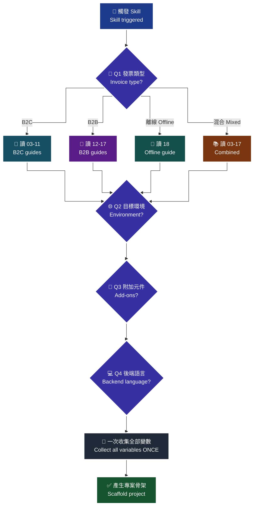

# 00 · Onboarding — AI 觸發本 Skill 後要問的四個問題

本文定義 AI 助手（Claude / ChatGPT / Gemini / Cursor / Copilot…）被觸發本 Skill 後，**在寫任何一行程式碼之前**必須完成的四問流程與變數收集規則。

> **對應 API**：無（本文是流程規範，不呼叫任何 API）。實際 API 規格一律連回 [`references/`](../references/)。
> **前置條件**：使用者已表達「要串歐付寶電子發票」的意圖；AI 已載入本 Skill。

---

## 0. 為什麼要有 onboarding

電子發票的串接路徑會因為「發票類型」分岔成三條**幾乎不重疊**的 API 集合（B2C 30 支 / B2B 27 支 / 離線 12 支），而且各自的前置作業不同（B2B 要先在財政部平台授權、離線要先註冊機台）。

**如果不先問就開始寫，最常見的失敗是：**

| 沒問清楚 | 後果 |
|---|---|
| 沒問發票類型 | 寫了一整套 B2C `Issue`，結果客戶是營業人對營業人，整份程式碼作廢重寫 |
| 沒問環境 | 拿測試金鑰的程式碼直接上正式，或反過來在正式環境開出真發票 |
| 沒問語言 | 產出 Node.js 專案，但團隊只有 PHP |
| 逐一追問變數 | 使用者被 8 個問題打斷 8 次，中途放棄 |

---

## 1. 四問流程（依序，一次一題）

### Q1 — 你要開哪一種發票？

| 選項 | 說明 | 走哪些指南 | API 集合 |
|---|---|---|---|
| **A. B2C（一般消費者）** | 賣給自然人，有載具／捐贈／統編三選一 | `03`–`11` | B2C 30 支 |
| **B. B2B（營業人對營業人）** | 買賣雙方都是公司，必帶統編，有存證／交換模式 | `12`–`17` | B2B 27 支 |
| **C. 離線 POS 自行開立** | 已有實體發票機台，本機開立、事後上傳 | `18` | 離線 12 支 |
| **D. 混合** | 例如電商同時開 B2C 與 B2B | `03`–`17`（依實際組合） | 依組合 |

> **為什麼先問這題**：這是唯一會讓「整份程式碼重寫」的分岔點。B2C 的 `Issue` 與 B2B 的 `Issue` 是**不同路徑、不同欄位、不同模式**（[`b2c-api-reference.md`](../references/b2c-api-reference.md#4-開立發票一般開立發票--issue) vs [`b2b-api-reference.md`](../references/b2b-api-reference.md#5-開立發票--issue)），不能靠改幾個參數轉換。

**判斷提示（AI 可先猜、再讓使用者確認）**：使用者說「電商」「訂閱」「App 內購」→ 多半是 B2C；說「開給客戶公司」「要統編」「進項發票」→ B2B；說「門市」「POS」「收銀機」「斷網也要開」→ 離線。

### Q2 — 目標環境？

| 選項 | 說明 |
|---|---|
| 測試（stage） | 只產出指向 `https://einvoice-stage.opay.tw` 的設定 |
| 正式（production） | 只產出指向 `https://einvoice.opay.tw` 的設定 |
| **兩者（預設）** | 產出 `.env` 雙套設定 + 環境切換機制 |

> **為什麼預設兩者**：正式環境的每一次 `Issue` 都會產生**真實的、有稅務效力的**發票，作廢還有時間窗（見 [`06-b2c-invalid-void.md`](06-b2c-invalid-void.md)）。沒有測試環境可退回的專案，第一次除錯就是在生產資料上做。

### Q3 — 要不要附加元件？

| 元件 | 預設 | 來源模板 | 沒有它會怎樣 |
|---|:---:|---|---|
| 測試主控台 | ✅ 含 | [`templates/opay-test-console/`](../templates/opay-test-console/) | 加解密錯了只能靠 API 回「參數錯誤」猜，通常卡半天 |
| Telegram bot | ✅ 含 | [`templates/telegram-bot/`](../templates/telegram-bot/) | 開立失敗只有 log 知道，沒人看 log |
| Discord bot | ✅ 含 | [`templates/discord-bot/`](../templates/discord-bot/) | 同上 |
| 字軌餘量監控 | ✅ 含 | bot 內建 + [`24-prod-monitoring.md`](24-prod-monitoring.md) | 字軌用完會**直接開不出發票**，且無法即時補救 |

> **為什麼預設全含**：這四項都是「平常沒感覺、出事時決定損失大小」的東西。使用者可以逐項移除，但預設應該是安全的那一邊。

### Q4 — 後端語言？

| 選項 | 對應 client | 對應指南 |
|---|---|---|
| **FastAPI / Python（預設）** | [`templates/opay-einvoice-client/python/`](../templates/opay-einvoice-client/python/) | [`19-backend-fastapi.md`](19-backend-fastapi.md) |
| Express / Node.js | [`templates/opay-einvoice-client/nodejs/`](../templates/opay-einvoice-client/nodejs/) | [`20-backend-nodejs.md`](20-backend-nodejs.md) |
| Laravel / PHP | [`templates/opay-einvoice-client/php/`](../templates/opay-einvoice-client/php/) | [`21-backend-php.md`](21-backend-php.md) |

> **為什麼預設 FastAPI**：三份 client 功能一致（各 69 支 API），但測試主控台與兩支 bot 都是 Python 寫的，選 Python 可以少維護一套執行環境。

---

## 2. 流程圖

> 🧭 **純文字重述（螢幕閱讀器友善）**：AI 被觸發後依序問四個問題。第一問發票類型，答案分成 B2C、B2B、離線、混合四條路，決定後續要讀哪幾份指南。第二問目標環境，預設同時產出測試與正式兩套設定。第三問附加元件，預設全部包含測試主控台、Telegram bot、Discord bot 與字軌餘量監控。第四問後端語言，預設 FastAPI。四問結束後，**才**一次性把所有需要的變數列成一張表請使用者填寫，填完即可產生專案骨架。中途不得為了單一變數打斷使用者。

> ♿ 配色遵循 [`docs/accessibility.md`](../docs/accessibility.md)：WCAG AAA 對比 ≥7:1、Okabe-Ito 色盲安全色盤、16px 字體、直角連線、圖示＋文字雙編碼。

---

## 3. `{{變數名}}` 佔位符清單

AI 產出的所有檔案（`.env`、README、程式註解）都用 `{{變數名}}` 當佔位符，**在四問結束後一次性收集**。

### 3.1 一律必填

| 佔位符 | 意義 | 從哪來 | 備註 |
|---|---|---|---|
| `{{MERCHANT_NAME}}` | 商家名稱 | 使用者 | 只用於文件與通知文案 |
| `{{MERCHANT_TAX_ID}}` | 商家統一編號（8 碼數字） | 使用者 | 檢核邏輯自 2023-01-01 起改為**可被 5 整除**（[i100 §7 注意事項](../references/b2c-api-reference.md#4-開立發票一般開立發票--issue)） |
| `{{OPAY_MERCHANT_ID}}` | 特店編號 | 廠商後台 | 測試 B2C `2000132`、測試離線 `2045501` |
| `{{OPAY_HASH_KEY}}` | AES-128 金鑰（16 碼） | 廠商後台 | **只能進 `.env`**，嚴禁 commit |
| `{{OPAY_HASH_IV}}` | AES-128 IV（16 碼） | 廠商後台 | 同上 |
| `{{OPAY_HOST}}` | API host | 固定值 | 測試 `https://einvoice-stage.opay.tw`／正式 `https://einvoice.opay.tw` |

### 3.2 條件必填

| 佔位符 | 何時需要 | 意義 |
|---|---|---|
| `{{OPAY_PLATFORM_ID}}` | 平台商才需要 | 一般廠商**留空字串**；填了會失敗 |
| `{{INVOICE_HEADER}}` | 要自行設定字軌時 | 發票字軌（2 碼英文），見 [`03-b2c-word-setting.md`](03-b2c-word-setting.md) |
| `{{INVOICE_START}}` / `{{INVOICE_END}}` | 同上 | 起訖 8 碼；起訖尾數規則見 03 |
| `{{INVOICE_YEAR}}` / `{{INVOICE_TERM}}` | 同上 | 民國年 3 碼／期別 1–6 |
| `{{MACHINE_ID}}` | 離線發票 | 機台編號，**不可含特殊符號**（i301 §7） |
| `{{EXCHANGE_MODE}}` | B2B | `0` 存證／`1` 交換，見 [`12-b2b-overview.md`](12-b2b-overview.md) |
| `{{NOTIFY_URL}}` | 用延遲開立 | 歐付寶開立完成的幕後通知網址 |
| `{{RETURN_URL}}` | 用線上折讓 | 消費者同意後的幕後通知網址 |
| `{{TELEGRAM_BOT_TOKEN}}` / `{{DISCORD_BOT_TOKEN}}` | 選了對應 bot | 見 [`25`](25-telegram-bot.md) / [`26`](26-discord-bot.md) |
| `{{ADMIN_TOKEN}}` | 選了任一 bot | 綁定用密碼，建議 `openssl rand -hex 16` |
| `{{WORD_REMAIN_THRESHOLD}}` | 選了字軌監控 | 字軌剩餘警戒張數，建議抓「尖峰兩天開立量」 |

### 3.3 收集規則（硬性）

1. **不得逐一詢問。** 四問結束後，把上表中「這個專案真正會用到的」佔位符整理成**一張表**，一次請使用者填。
   *為什麼*：每一次追問都是一次中斷。八次中斷的完成率遠低於一次填表。
2. **能推導的不要問。** `{{OPAY_HOST}}` 由 Q2 決定、`{{EXCHANGE_MODE}}` 的預設值可由 Q1 推導，直接填好讓使用者確認即可。
3. **測試環境的公開值直接填好。** 測試 `MerchantID` / `HashKey` / `HashIV` 是官方文件公開值（見各 reference 的「共通事項」），先填上，使用者只需要補正式環境那一欄。
4. **金鑰欄位一律留白 + 註解警語。** 正式金鑰不要在對話裡收集，請使用者自己填進 `.env`。
   *為什麼*：對話紀錄會被保存、被截圖、被貼進 issue。金鑰一旦外流，攻擊者可以用你的名義開立與作廢發票。

---

## 4. 四問結束後的動作順序

| 順序 | 動作 | 對應指南 |
|---:|---|---|
| 1 | 先讓使用者跑**前置作業檢查表**（這一步不寫程式） | [`02-preflight-checklist.md`](02-preflight-checklist.md) |
| 2 | 產生專案骨架 + `.env.example` | [`19`](19-backend-fastapi.md) / [`20`](20-backend-nodejs.md) / [`21`](21-backend-php.md) |
| 3 | 跑測試主控台六步自我驗證 | [`23-test-console.md`](23-test-console.md) |
| 4 | 開出第一張測試發票 | [`01-quickstart.md`](01-quickstart.md) |
| 5 | 補上冪等與重試 | [`22-idempotency-and-retry.md`](22-idempotency-and-retry.md) |
| 6 | 上線前讀法遵與監控 | [`27`](27-legal-compliance.md) / [`24`](24-prod-monitoring.md) |

> **為什麼第 1 步不是寫程式**：電子發票有一堆「你在歐付寶／財政部那邊沒設定好，程式怎麼寫都不會過」的前置條件。先跑檢查表可以把「三天後才發現字軌沒啟用」變成「第一天就知道」。

---

### 常見錯誤

1. **跳過 Q1 直接寫 B2C。** 使用者說「要開發票給客戶」，AI 預設 B2C，結果客戶是公司行號要走 B2B 交換模式 → 整套重寫。**任何時候不確定，就問。**
2. **把測試金鑰寫進程式碼當「預設值」。** 之後有人把 `OPAY_HASH_KEY` 環境變數設錯，程式靜默回退到測試金鑰，打正式環境全部 `TransCode` 失敗，錯誤訊息卻完全看不出是金鑰問題。金鑰缺少時應該**直接啟動失敗**。
3. **逐一追問變數。** 問完統編問字軌、問完字軌問 email…使用者在第五個問題就走了。四問之後**一次收集**。
4. **把 `{{OPAY_PLATFORM_ID}}` 填成 `MerchantID` 的值。** 一般廠商這欄必須是**空字串**；填了值會因為「非平台商」而失敗，且錯誤訊息不會告訴你是這一欄的問題。
5. **問了環境卻只產一套設定。** 使用者答「兩者」，AI 卻只寫死一個 host。上線那天靠手改字串切換，改漏一處就打錯環境。
