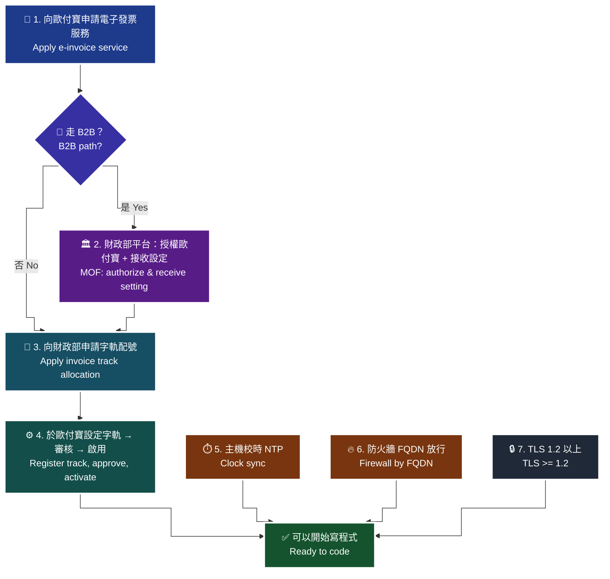

# 02 · 前置作業檢查表 — 電子發票與一般金流最大的不同

電子發票不是「申請完 API 金鑰就能開始寫」。**在寫第一行程式碼之前，有一串必須先完成、而且部分需要等待審核的前置作業**；任何一項沒做，程式寫得再對都不會成功。

> **對應 API**：本文不呼叫 API，但決定了 [`GetGovInvoiceWordSetting`](../references/b2c-api-reference.md#1-查詢財政部配號結果--getgovinvoicewordsetting)、[`AddInvoiceWordSetting`](../references/b2c-api-reference.md#2-字軌與配號設定--addinvoicewordsetting)、[`Issue`](../references/b2c-api-reference.md#4-開立發票一般開立發票--issue) 等 API 是否能運作。
> **前置條件**：已完成 [`00-onboarding.md`](00-onboarding.md) 四問，知道自己走 B2C／B2B／離線哪一條路。

---

## 0. 為什麼電子發票要有這一章，金流串接卻不用

一般金流的前置作業大約就是「申請商店代號、拿金鑰、設回傳網址」，三件事都在**服務商內部**完成，當天就能開始寫。

電子發票不一樣，它牽涉**三方**：

| 角色 | 你要在這裡做什麼 | 有沒有等待期 |
|---|---|---|
| **財政部**電子發票整合服務平台 | 申請字軌配號；B2B 另需「授權歐付寶」與「接收設定」 | ✅ 有 |
| **歐付寶**（加值中心） | 申請電子發票服務；設定字軌、機台；取得正式金鑰 | ✅ 有（審核） |
| **你自己的主機** | 校時、防火牆、TLS | ❌ 立即 |

> 🚫 **這一章沒做完就寫程式的下場**：你會得到一連串**看起來像參數錯誤、實際上是設定沒做**的失敗，而且官方沒有公開完整錯誤碼表（見 [`error-handling.md` §0](../references/error-handling.md)），你只能猜。

---

## 1. 總覽流程

> 🧭 **純文字重述（螢幕閱讀器友善）**：前置作業共七大關卡，前四關必須依序完成。第一關向歐付寶申請電子發票服務；第二關若走 B2B，必須先到財政部電子發票整合服務平台完成「授權歐付寶」與「接收設定」；第三關向財政部申請字軌配號並等待配號完成；第四關把字軌設定到歐付寶並讓它通過審核、然後啟用。第五、六、七關是主機端的三件事，可與前四關並行：主機校時（因為 Timestamp 只有 10 分鐘驗證區間）、防火牆以 FQDN 放行歐付寶網域、確認 TLS 1.2 以上。全部完成後才進入寫程式階段。



> ♿ 配色遵循 [`docs/accessibility.md`](../docs/accessibility.md)：WCAG AAA 對比 ≥7:1、Okabe-Ito 色盲安全色盤、16px 字體、直角連線、圖示＋文字雙編碼。

---

## 2. 逐項檢查表

每一項都有「**沒做會發生什麼**」，因為只寫「要做」的規則，下一個人會覺得可以省略。

### ☐ 2.1 向歐付寶申請電子發票服務

- **做什麼**：向歐付寶提出電子發票服務申請並開通（官方原文：「若您要使用電子發票服務，**需與歐付寶提出申請方可使用**」，i301 §3）。
- **沒做會發生什麼**：你有歐付寶帳號、有金鑰，但所有 `/B2CInvoice/*`、`/B2BInvoice/*` 呼叫都失敗。因為金流帳號與電子發票服務是**分開開通**的，很多人以為「我已經有歐付寶帳號了」就跳過這一步。
- **怎麼確認**：登入廠商後台，能看到「電子發票後台」選單，且能進入「系統開發管理」。

### ☐ 2.2 額外需要業務申請的加值功能

以下功能**預設沒有開**，要另外向業務申請：

| 功能 | 官方原文出處 | 沒申請會怎樣 |
|---|---|---|
| **自行列印電子發票的密碼種子** | i100 §1／i301 §3：「特店若有自行列印電子發票之需求需申請密碼種子」 | `GetIssue` 不會回傳 `QRCode_Left`／`QRCode_Right` 的壓碼內容 |
| **超商 KIOSK 事務機列印** | i100 §7：「除須向業務申請開通外，請按以下需求帶入參數」 | 參數帶對了也印不出來 |
| **POS 自行開發發票版型** | i100 §13 注意事項：「請與歐付寶提出申請方可使用」 | `PosBarCode` 等欄位無法使用 |
| **`TaxType=9` 混合稅率** | i100 §7：「限收銀機發票無法分辨時使用，且**需通過申請核可**」 | 開立被拒 |

> **為什麼要現在確認**：這些都是「開發到一半才發現要申請」的典型項目，而申請要時間。在需求盤點階段就一次問清楚。

### ☐ 2.3 【僅 B2B】財政部平台完成「授權歐付寶」

- **做什麼**：到**財政部電子發票整合服務平台**，把發票加值服務中心授權給歐付寶。
- **官方原文**（i200 §2）：「使用歐付寶電子發票加值中心前，請務必至財政部電子發票整合服務平台**完成授權歐付寶**。」
- **沒做會發生什麼**：**B2B 全部 27 支 API 都不會運作。** 而且 `GetGovInvoiceWordSetting` 會回「查無資料」，官方明確指出可能原因就是「取字軌號碼時**並未授權於歐付寶**」（i100 §4 / i301 §6 注意事項）。你會以為是字軌沒申請，實際是授權沒做。

### ☐ 2.4 【僅 B2B 且走交換模式】財政部平台完成「接收設定」

- **做什麼**：在財政部平台設定**由歐付寶接收**你的進項發票。
- **官方原文**（i200 §3 `ExchangeMode` 說明）：交換模式「※**請務必先至財政部平台設定由歐付寶接收**」；存證模式則「加值中心**無法接收**其他營業人開立給您的電子發票」。
- **沒做會發生什麼**：你開得出銷項發票，但**永遠收不到別人開給你的進項發票**。這種失敗沒有錯誤訊息 —— 系統只是安靜地什麼都沒有，你會以為對方沒開。

### ☐ 2.5 向財政部申請字軌配號，並確認配號完成

- **做什麼**：向國稅局／財政部平台申請該期別的發票字軌與號碼區間。**一本 = 50 個發票號碼**（i100 §4 `Number` 欄位說明）。
- **怎麼確認**：呼叫 [`GetGovInvoiceWordSetting`](../references/b2c-api-reference.md#1-查詢財政部配號結果--getgovinvoicewordsetting)，看得到 `InvoiceInfo` 清單。
- **沒做會發生什麼**：`GetGovInvoiceWordSetting` 查無資料。官方列出的兩個可能原因是「**並未授權於歐付寶**」或「**字軌尚未取號完成**」。這兩個原因對應的處理方式完全不同，先確認 2.3 再懷疑這一項。
- **期別限制**：`InvoiceYear` 只能查**去年、當年、明年**（民國年 3 碼）；`InvoiceTerm` **不可帶入小於當年的期別**。

### ☐ 2.6 於歐付寶設定字軌，並確認通過審核

- **做什麼**：呼叫 [`AddInvoiceWordSetting`](../references/b2c-api-reference.md#2-字軌與配號設定--addinvoicewordsetting)（或用廠商後台）把字軌區間登記到歐付寶。
- **硬性格式**：`InvoiceStart` 尾數必須是 **`00` 或 `50`**；`InvoiceEnd` 尾數必須是 **`49` 或 `99`**（i200 §5、i301 §9 明寫）。
- **官方原文**：「在新增字軌前須**自行檢核字軌正確性**。」
- **沒做會發生什麼**：`Issue` 失敗，錯誤訊息與字軌有關但不會告訴你是格式問題。起訖尾數不合規會直接被擋。
- **一定要留存 `TrackID`**：這是下一步啟用字軌的唯一鍵。原文：「需留存 `TrackID` 作為設定字軌號碼啟用狀態用。」丟了要重查 `GetInvoiceWordSetting` 才拿得回來。

### ☐ 2.7 字軌通過審核**且已啟用**

這是本章**最常被略過、也最常造成「開立失敗」**的一項。

| 情境 | 官方原文 | 你要做什麼 |
|---|---|---|
| B2C / B2B 新增字軌後 | 「新增字軌後，字軌狀態預設為**已審核通過但未啟用**，請使用設定字軌號碼狀態進行啟用」 | 呼叫 `UpdateInvoiceWordStatus`，`InvoiceStatus=2`（啟用） |
| **離線**新增字軌後 | 「新增字軌後，字軌狀態預設為已審核通過且**會自動啟用一組字軌**」 | 仍需確認實際狀態，其他組要手動啟用 |

- **沒做會發生什麼**：`Issue` 直接失敗。查 `GetInvoiceWordSetting` 會看到 `UseStatus=1`（未啟用）。
- ⚠️ **`InvoiceStatus` 的值很容易記反**：`0`=停用、`1`=**暫停**、`2`=**啟用**。不是 0/1 開關。
- 🚫 **停用（`0`）不可逆**：i200 §2 原文「啟用後可暫停或停用發票字軌，但**停用後無法再度啟用**」。誤送 `0` 就是永久報廢那一段字軌區間，只能重新申請配號。**在程式裡把 `InvoiceStatus=0` 當成危險操作，加二次確認。**
- ⚠️ 離線的取號 API 有**另一套** `InvoiceStatus`（`1`=啟用、`2`=備用字軌），與這裡的 0/1/2 定義**完全不同**，詳見 [`enums.md` §10.1](../references/enums.md#101-️-invoicestatus--三份文件兩套值)。

### ☐ 2.8 主機校時（NTP）

- **做什麼**：確認主機時間與標準時間同步。
- **官方原文**（三份文件的每一支 API 都重複寫）：「傳入時間 Timestamp… 驗證時間區間**暫訂為 10 分鐘內有效**，若超過此驗證時間則此次訂單將無法建立」「合作特店須進行主機『**時間校正**』，避免主機產生時差，延伸 API 無法正常運作」。
- **沒做會發生什麼**：**最難查的一種失敗**——「有時候成功、有時候失敗」。時差在 10 分鐘邊緣飄的主機，會產生完全無規律的 `TransCode` 失敗。開發者通常會先懷疑參數、懷疑網路、懷疑歐付寶，最後才想到時鐘。
- **怎麼確認**：

```bash
timedatectl                 # 看 "System clock synchronized: yes" 與 "NTP service: active"
chronyc tracking            # 看 System time 偏移量，應在毫秒等級
```

- ⚠️ **兩個衍生陷阱**：
  1. `Timestamp` 是 **Unix 秒**，不是毫秒。JavaScript 的 `Date.now()` 要 `Math.floor(Date.now()/1000)`。
  2. `Timestamp` 要在**實際送出前**才產生。先組好 payload 丟進佇列、十分鐘後才送出，會全數失敗。

### ☐ 2.9 防火牆以 FQDN 放行

- **做什麼**：出向規則以**網域名稱**（不是 IP）放行。
- **官方原文**：「歐付寶主機 **IP 不固定**，如廠商防火牆需開通歐付寶 IP，請以 **FQDN** 方式設定以下 domain：`einvoice.opay.tw` TCP 443（正式環境）、`einvoice-stage.opay.tw` TCP 443（測試環境）。」

| 用途 | 網域 | Port |
|---|---|---|
| 正式環境 API | `einvoice.opay.tw` | TCP 443 |
| 測試環境 API | `einvoice-stage.opay.tw` | TCP 443 |
| **延遲開立的回呼**（正式） | `postgate.opay.com.tw` | TCP 443 |
| **延遲開立的回呼**（測試） | `postgate-stage.opay.com.tw` | TCP 443 |

- **沒做會發生什麼**：某天歐付寶換 IP，你的 allow-list 失效，**所有發票同時開不出來**，而且從你的角度看只是「連線逾時」。這種故障通常發生在半夜且與你的部署無關，最難聯想。
- ⚠️ 只用延遲開立（`DelayIssue` / `TriggerIssue`）時**才需要** postgate 兩個網域；官方註明「postgate IP 不須另外申請，請自行使用 `ping` 指令查詢 IP 位址」。
- ⚠️ 還要放行**入向**：你的伺服器要收得到歐付寶的 `NotifyURL` / `ReturnURL` 回呼。官方原文：「請確認特店伺服器 URL 連接 port 為 http 80 port 與 https 443 port。」

### ☐ 2.10 TLS 1.2 以上、僅 HTTPS、僅 POST

- **官方原文**：「為保障消費者權益與網路交易安全，歐付寶串接服務**支援 TLS 1.2 以上**之加密通訊協定」「呼叫歐付寶 API 連接 port **只提供 https(443 port)** 連線方式，並請使用**合法的 DNS**進行介接」「請確認各項交易參數傳送時是使用 **Http POST** 方式」。
- **沒做會發生什麼**：TLS handshake 失敗，錯誤訊息通常是語言層的 SSL 錯誤，看不出是版本問題。**舊版 .NET Framework、舊 OpenSSL、舊 Java 預設可能仍是 TLS 1.0/1.1。**
- **怎麼確認**：

```bash
curl -sv --tlsv1.2 https://einvoice-stage.opay.tw -o /dev/null 2>&1 | grep -i 'SSL connection\|TLS'
```

### ☐ 2.11 回傳網址不可用中文網域

- **官方原文**：「回傳網址**不支援中文網址**，網址參數請使用 **punycode** 編碼後的網址，例如 `中文.tw` 改成 `xn--fiq228c.tw`。」
- **沒做會發生什麼**：`NotifyURL` / `ReturnURL` 的回呼全部收不到，但你的 API 呼叫本身是成功的 —— 又是一種「沒有錯誤訊息的失敗」。

### ☐ 2.12 金鑰不得放在前端、不得進 git

- **官方原文**：「請勿將金鑰資訊（HashKey、HashIV）存放或顯示於**前端網頁**內，如 Javascript、html、Css…等，避免金鑰被盜取使用造成損失及交易資料外洩。」
- **沒做會發生什麼**：任何人都能用你的名義開立與**作廢**發票。作廢是不可逆的，你連救都救不回來。
- **實務規則**：金鑰只從環境變數／Secret Manager 讀；`.env` 一定進 `.gitignore`；程式碼裡不得有正式金鑰的預設值（缺少時應該啟動失敗，而不是回退）。

### ☐ 2.13 【僅離線】先註冊發票機台

- **官方原文**（i301 §7）：「**設定字軌前必須要先至歐付寶設定開立電子發票的機台資料**」；「`MachineID` 當此 ID 已設定過字軌配號時，將**無法進行修改 ID 與刪除**」；「**請勿使用特殊符號**作為機台 ID」。
- **沒做會發生什麼**：字軌設定會失敗，因為離線的 `AddInvoiceWordSetting` 需要帶 `MachineID`。
- ⚠️ **機台 ID 命名要一次想清楚**：綁過字軌之後就改不掉也刪不掉。用 `POS-A01` 這種穩定命名，不要用「測試」「temp」。

---

## 3. 環境參數對照（測試環境為官方公開值）

| 項目 | B2C 測試 | 離線測試 | 正式 |
|---|---|---|---|
| Host | `https://einvoice-stage.opay.tw` | 同左 | `https://einvoice.opay.tw` |
| MerchantID | `2000132` | `2045501` | 廠商後台取得 |
| HashKey / HashIV | 官方公開值（見 reference） | 官方公開值 | **廠商後台取得，只進 `.env`** |
| 廠商後台 | `https://vendor-stage.opay.tw` | 同左 | `https://vendor.opay.tw` |

> ⚠️ 官方原文：「以上為**測試環境**的資訊，**請勿對正式環境做處理**否則無法正常介接。」測試與正式金鑰混用是 `TransCode` 失敗與 AES 解密失敗的第一大原因。

---

## 4. 上線前最終複查（可直接複製成 PR checklist）

```
前置作業
[ ] 已向歐付寶申請並開通電子發票服務
[ ] （B2B）財政部平台已完成「授權歐付寶」
[ ] （B2B 交換模式）財政部平台已完成「由歐付寶接收」設定
[ ] GetGovInvoiceWordSetting 查得到本期配號
[ ] 字軌已於歐付寶登記，起訖尾數符合 00/50 與 49/99
[ ] TrackID 已留存於安全的地方
[ ] GetInvoiceWordSetting 顯示 UseStatus=2（使用中）
[ ] （離線）機台已註冊，MachineID 無特殊符號且為長期命名
[ ] 需要的加值功能（列印密碼種子／KIOSK／混稅）已向業務申請

主機端
[ ] timedatectl 顯示 NTP 已同步
[ ] Timestamp 產生於送出前，且單位是「秒」
[ ] 防火牆以 FQDN 放行 einvoice(.stage).opay.tw:443
[ ] （用延遲開立）已放行 postgate(-stage).opay.com.tw:443
[ ] 入向 80/443 可接收 NotifyURL / ReturnURL 回呼
[ ] TLS 1.2 以上
[ ] 回呼網址無中文網域（已 punycode）

安全
[ ] HashKey / HashIV 只在 .env 或 Secret Manager
[ ] .env 已在 .gitignore，git 歷史中沒有金鑰
[ ] 前端 bundle 內不含任何金鑰
[ ] 程式碼中沒有正式金鑰的 fallback 預設值
```

---

## 5. 時程建議：哪些要提早開始

前置作業裡有三類等待期，把它們**排在專案最前面**，不要等到開發完才發現卡住。

| 項目 | 誰在等 | 典型影響 | 什麼時候該啟動 |
|---|---|---|---|
| 歐付寶電子發票服務開通 | 歐付寶審核 | 沒開通 → 一支 API 都打不通 | **專案第 0 天** |
| B2B 財政部授權與接收設定 | 財政部平台作業 | 沒完成 → B2B 全數失效 | 專案第 0 天 |
| 財政部字軌配號 | 國稅局配號作業 | 沒配到號 → 無法設定字軌 | 專案第 0 天，且**每一期都要重來** |
| 字軌審核 | 歐付寶審核（`UseStatus=5` 待審核） | 沒過 → 無法啟用 | 拿到配號當天 |
| 加值功能申請（列印密碼種子 / KIOSK / 混稅） | 歐付寶業務 | 沒申請 → 該功能無效 | 需求盤點階段 |

> **為什麼「每一期都要重來」很重要**：發票期別是**雙月制**（`1`=1–2 月、`2`=3–4 月…`6`=11–12 月）。跨到新期別時，如果沒有預先申請並啟用該期字軌，就會在期初第一天開不出發票。這是所有電子發票系統的年度／期別「例行地雷」。
>
> 建議做法：把「下一期字軌是否已設定並啟用」列進**每期第一個月的固定檢查項**，並用 [`10-b2c-notify-settings.md`](10-b2c-notify-settings.md) 的剩餘數量通知當第二道保險。

### 5.1 測試環境可以先走完整流程

測試環境的 `MerchantID` / `HashKey` / `HashIV` 是官方公開值，**不需要等任何審核**就能開始寫程式與跑 [`01-quickstart.md`](01-quickstart.md)。

**正確的並行策略**：一邊送出正式環境的申請與配號（等待期），一邊在測試環境把整套流程寫完並驗證。等正式環境的前置作業完成時，只需要換 `.env`。

> **為什麼不要等**：等審核期間什麼都不做，是專案時程最常見的浪費。而且測試環境跑一遍會讓你提早發現「原來字軌要先啟用」這類問題，正式環境上線那天就不會踩第二次。

---

### 常見錯誤

1. **以為有歐付寶帳號就等於開通電子發票。** 兩者是分開申請的。所有 API 都失敗但金流正常，就是這一項。
2. **B2B 沒在財政部平台授權歐付寶就開始寫。** 27 支 API 全部不會動，而 `GetGovInvoiceWordSetting` 只會回「查無資料」，看不出真正原因。
3. **新增字軌後直接開發票。** 預設狀態是「已審核通過但**未啟用**」，必須先 `UpdateInvoiceWordStatus` 設 `InvoiceStatus=2`。
4. **把 `InvoiceStatus=0`（停用）當成「先關起來之後再開」。** 停用**不可逆**，那段字軌區間就報廢了，只能重新申請配號。
5. **防火牆用 IP 白名單放行歐付寶。** 官方明寫 IP 不固定。今天通、下個月斷，而且斷的時候你剛好沒有部署，最難聯想。
6. **主機沒跑 NTP。** 症狀是無規律的間歇性失敗，通常會被誤判成「歐付寶不穩」。
