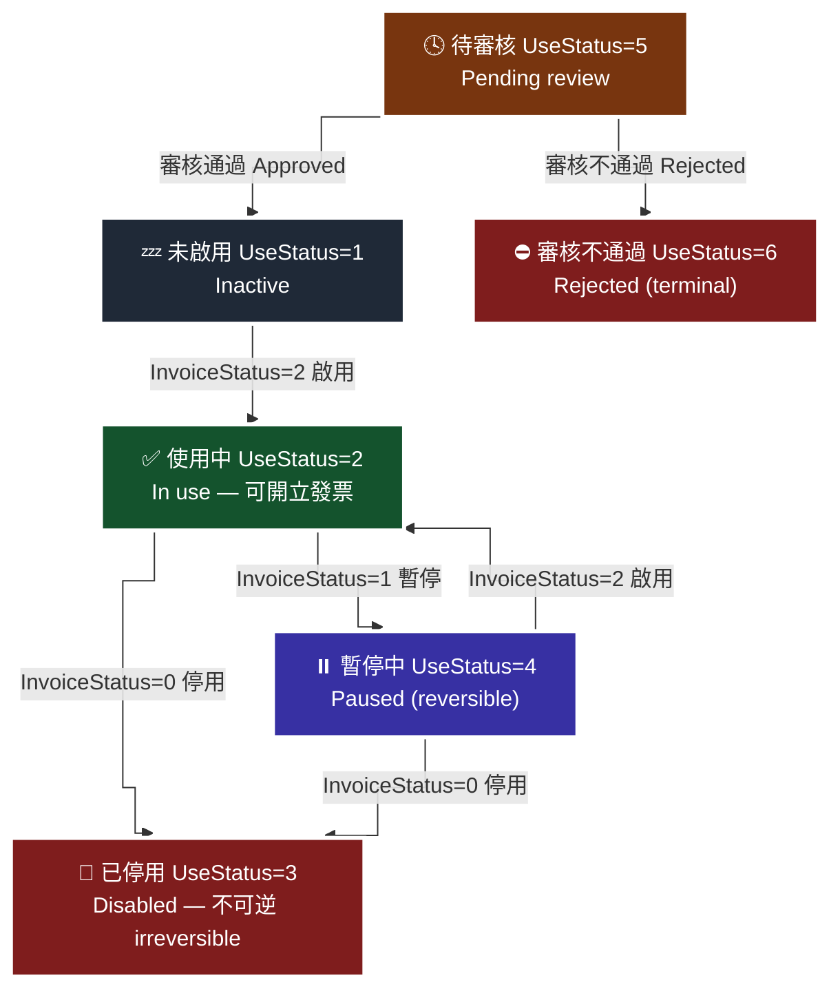

# 03 · B2C 字軌與配號 — 三支 API 串成一條線

發票號碼是財政部配給的稀缺資源。本文說明如何用三支 API 把「財政部配號 → 歐付寶登記 → 啟用可用」串成一條線，以及字軌狀態機與跨期別的坑。

> **對應 API**：[`GetGovInvoiceWordSetting`](../references/b2c-api-reference.md#1-查詢財政部配號結果--getgovinvoicewordsetting)、[`AddInvoiceWordSetting`](../references/b2c-api-reference.md#2-字軌與配號設定--addinvoicewordsetting)、[`UpdateInvoiceWordStatus`](../references/b2c-api-reference.md#3-設定字軌號碼狀態--updateinvoicewordstatus)；查詢用 [`GetInvoiceWordSetting`](../references/b2c-api-reference.md#18-查詢字軌--getinvoicewordsetting)
> **前置條件**：已完成 [`02-preflight-checklist.md`](02-preflight-checklist.md) §2.5（財政部配號完成）。

---

## 1. 一條線：三支 API 的分工

| 步驟 | API | 你在做什麼 | 必留的東西 |
|---:|---|---|---|
| ① | `GetGovInvoiceWordSetting` | **查**財政部配了哪些字軌給你（透過歐付寶） | 字軌、起訖號碼、期別 |
| ② | `AddInvoiceWordSetting` | **登記**字軌區間到歐付寶 | 回傳的 **`TrackID`** |
| ③ | `UpdateInvoiceWordStatus` | 把該 `TrackID` 的狀態設成**啟用**（`2`） | — |
| ④ | `GetInvoiceWordSetting` | **驗收**：`UseStatus` 應為 `2`（使用中） | — |

> **為什麼一定是四步而不是三步**：②做完的預設狀態是「已審核通過但**未啟用**」（i100 §5 原文），③不做就開不了發票。④是唯一能確認③真的生效的方法，別省。

```python
from opay_einvoice import OPayEInvoiceClient, STAGE_HOST

c = OPayEInvoiceClient(merchant_id, hash_key, hash_iv, STAGE_HOST)

# ① 查財政部配號結果（民國年 3 碼；僅可查去年、當年、明年）
gov = c.get_gov_invoice_word_setting(invoice_year="115")

# ② 登記字軌（起訖尾數規則見 §3）
added = c.add_invoice_word_setting(
    invoice_term=1,            # 1=1-2月 … 6=11-12月
    invoice_year="115",
    inv_type="07",             # 字串！"07" 一般稅額 / "08" 特種稅額
    invoice_category="1",      # B2C 固定 1
    invoice_header="AA",
    invoice_start="10000000",  # 尾數需為 00 或 50
    invoice_end="10000049",    # 尾數需為 49 或 99
)
track_id = added["TrackID"]    # ← 一定要存起來

# ③ 啟用（0=停用 / 1=暫停 / 2=啟用）
c.update_invoice_word_status(track_id=track_id, invoice_status=2)

# ④ 驗收
print(c.get_invoice_word_setting(invoice_year="115", invoice_category=1))
```

---

## 2. 字軌狀態機

> 🧭 **純文字重述（螢幕閱讀器友善）**：字軌登記後先進入「待審核」。審核通過後成為「未啟用」，審核不通過則進入終態「審核不通過」。從「未啟用」呼叫 `UpdateInvoiceWordStatus` 帶 `InvoiceStatus=2` 進入「使用中」，此時才能開立發票。從「使用中」可以帶 `1` 進入「暫停中」，暫停後可以再帶 `2` 回到「使用中」。從「使用中」或「暫停中」都可以帶 `0` 進入「已停用」，**已停用是不可逆的終態，無法再啟用**，那段字軌區間只能作廢重新申請配號。



> ♿ 配色遵循 [`docs/accessibility.md`](../docs/accessibility.md)：WCAG AAA 對比 ≥7:1、Okabe-Ito 色盲安全色盤、16px 字體、直角連線、圖示＋文字雙編碼。

### 2.1 兩套值不要搞混

| 欄位 | 出現在 | 值域 |
|---|---|---|
| `InvoiceStatus`（**送出**） | `UpdateInvoiceWordStatus` | `0` 停用／`1` **暫停**／`2` **啟用** |
| `UseStatus`（**查詢回傳**） | `GetInvoiceWordSetting` | `1` 未啟用／`2` 使用中／`3` 已停用／`4` 暫停中／`5` 待審核／`6` 審核不通過（傳入可用 `0`=全部） |

> ⚠️ 這兩個是**不同的欄位、不同的值域**。把查詢回來的 `UseStatus=2`（使用中）拿去當 `InvoiceStatus` 送出，剛好也是 `2`（啟用）——**這次會對，但純屬巧合**。`UseStatus=1`（未啟用）拿去送就會變成 `InvoiceStatus=1`（暫停），語意完全相反。
> 離線的取號 API 還有第三套 `InvoiceStatus`（`1`=啟用、`2`=備用字軌），詳見 [`enums.md` §10.1](../references/enums.md#101-️-invoicestatus--三份文件兩套值)。

### 2.2 🚫 停用不可逆

i200 §2 原文：「字軌通過審核後須啟用字軌；啟用後可暫停或停用發票字軌，但**停用後無法再度啟用**。」

**實務規則**：

- 程式裡把 `InvoiceStatus=0` 列為**危險操作**，與作廢發票同級，要二次確認 + audit log。
- 想「暫時關掉」永遠用 `1`（暫停），不要用 `0`。
- *為什麼*：`0` 之後那段字軌區間就永久報廢了，你必須重新向財政部申請配號、重新登記、重新等審核。中間這段時間你開不出發票。

---

## 3. 硬性格式規則

| 欄位 | 規則 | 沒遵守會怎樣 | 出處 |
|---|---|---|---|
| `InvoiceStart` | 尾數必須是 **`00` 或 `50`** | 登記被拒 | i200 §5、i301 §9 |
| `InvoiceEnd` | 尾數必須是 **`49` 或 `99`** | 登記被拒 | 同上 |
| `InvType` | `String(2)`，`"07"` / `"08"` | 存成整數再序列化會變 `7` → 失敗 | i100 §4 |
| `InvoiceCategory` | B2C **固定 `1`** | 查詢時「**會查無資料**」 | i100 §5 §17 |
| `InvoiceYear` | 民國年 3 碼；設定時**僅能當年與明年** | 帶去年會被拒 | i100 §5 |
| `InvoiceTerm` | **不可帶入小於當年的期別**；設定類不可帶 `0` | 被拒 | i100 §5；`0` 僅查詢類可用 |
| `InvoiceHeader` | `String(2)` 字軌英文碼 | — | i100 §5 |

> **為什麼起訖尾數有規則**：財政部的配號單位是「本」，**一本 = 50 個號碼**（i100 §4 `Number` 欄位原文）。所以區間必須落在 50 的邊界上，例如 `10000000`–`10000049`（1 本）、`10000000`–`10000099`（2 本）。

**登記前自我檢核**（官方原文：「在新增字軌前須**自行檢核字軌正確性**」）：

```python
def check_range(start: str, end: str) -> None:
    assert len(start) == 8 and len(end) == 8, "起訖必須各 8 碼"
    assert start[-2:] in ("00", "50"), f"起始尾數必須 00 或 50，實得 {start[-2:]}"
    assert end[-2:] in ("49", "99"), f"結束尾數必須 49 或 99，實得 {end[-2:]}"
    assert (int(end) - int(start) + 1) % 50 == 0, "區間長度必須是 50 的倍數"
```

---

## 4. `TrackID` 的保存

`AddInvoiceWordSetting` 回傳的 `TrackID` 是**啟用字軌的唯一鍵**（原文：「需留存 `TrackID` 作為設定字軌號碼啟用狀態用」）。

| 做法 | 評價 |
|---|---|
| 存進資料庫，與年度／期別／字軌／起訖一起 | ✅ 建議 |
| 只印在 log 裡 | ⚠️ 找得回來但很痛 |
| 完全不存 | ❌ 要用 `GetInvoiceWordSetting` 反查，且回傳可能有多筆要人工比對 |

> **為什麼會弄丟**：登記與啟用常常是兩次不同的操作（例如登記用腳本、啟用在幾天後審核通過才做）。中間隔了時間，`TrackID` 就散在某個終端機視窗裡了。

---

## 5. 跨期別的坑

發票期別是**雙月制**：`1`=1–2 月、`2`=3–4 月、`3`=5–6 月、`4`=7–8 月、`5`=9–10 月、`6`=11–12 月。

| 坑 | 症狀 | 怎麼避免 |
|---|---|---|
| 新期別開始，新字軌沒登記／沒啟用 | 期初第一天**全面開不出發票** | 在每期最後一個月排程檢查「下一期是否已有 `UseStatus=2` 的字軌」 |
| 用了小於當年的期別 | 登記被拒 | `InvoiceTerm` **不可帶入小於當年的期別** |
| 設定類 API 帶 `InvoiceTerm=0` | 被拒 | `0`（全部）**只在查詢類有意義** |
| 跨年度：`InvoiceYear` 帶去年 | 設定被拒 | 設定僅能**當年與明年**；查詢可以查去年 |
| 民國年 / 西元年混用 | 查無資料或被拒 | 一律 `str(datetime.now().year - 1911)` |

> **為什麼期別跨越特別危險**：它不是「某天壞掉」，而是**在可預期的日期一定會壞**，但因為每兩個月才發生一次，團隊記憶容易斷。把它變成排程檢查，不要靠人記。

```python
from datetime import datetime

def current_term(d: datetime | None = None) -> int:
    d = d or datetime.now()
    return (d.month + 1) // 2          # 1,2月->1；3,4月->2 … 11,12月->6

def roc_year(d: datetime | None = None) -> str:
    d = d or datetime.now()
    return str(d.year - 1911)
```

---

## 6. 餘量監控

`GetInvoiceWordSetting` 回傳的 `InvoiceInfo[]` 裡：

| 欄位 | 意義 |
|---|---|
| `InvoiceStart` / `InvoiceEnd` | 這段字軌的起訖 |
| `InvoiceNo` | **目前已使用號碼** |
| `UseStatus` | 使用狀態 |

粗估剩餘張數：`int(InvoiceEnd) - int(InvoiceNo)`（尚未使用過時退回 `end - start + 1`）。實作見 [`templates/telegram-bot/bot.py`](../templates/telegram-bot/bot.py) 的 `check_word_remaining()`。

> **為什麼要自己算而不是等歐付寶通知**：歐付寶的剩餘數量通知（見 [`10-b2c-notify-settings.md`](10-b2c-notify-settings.md)）是寄 Email 給人。**人會沒看到信。** 自己排程查 + 推播到工作群組，是第二道保險。字軌用完的後果是「完全開不出發票」，值得兩道保險。

---

### 常見錯誤

1. **登記完就以為能開發票。** 預設是「已審核通過但**未啟用**」，一定要再呼叫 `UpdateInvoiceWordStatus` 設 `InvoiceStatus=2`。
2. **把查詢回來的 `UseStatus` 直接當 `InvoiceStatus` 送出。** 兩套值域不同。`UseStatus=1`（未啟用）送成 `InvoiceStatus=1` 會變成「暫停」。
3. **用 `InvoiceStatus=0` 當暫時關閉。** 停用**不可逆**，那段字軌永久報廢。要暫時關就用 `1`（暫停）。
4. **`InvType` 存成整數。** `"07"` 變 `7`，登記與開立都會失敗，而且錯誤訊息不會指向前導零。
5. **`InvoiceCategory` 沒填 `1`。** 官方原文明寫「否則**會查無資料**」——你會以為字軌不見了。
6. **沒有為下一期預先準備字軌。** 期別交界那天早上，整站開不出發票，而且要等配號與審核，救不回來。
