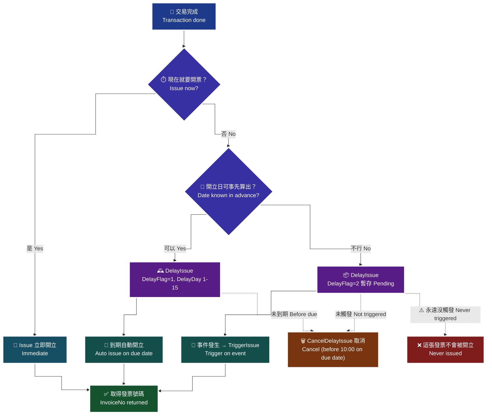

# 04 · B2C 開立發票 — 四支 API 的選用決策樹

`Issue` / `DelayIssue` / `TriggerIssue` / `CancelDelayIssue` 各自適用什麼情境、怎麼選，以及載具／捐贈／統編三選一的互斥規則。

> **對應 API**：[`Issue`](../references/b2c-api-reference.md#4-開立發票一般開立發票--issue)、[`DelayIssue`](../references/b2c-api-reference.md#5-開立發票延遲開立發票預約開立發票--delayissue)、[`TriggerIssue`](../references/b2c-api-reference.md#6-觸發開立發票--triggerissue)、[`CancelDelayIssue`](../references/b2c-api-reference.md#7-取消延遲開立發票--canceldelayissue)
> **前置條件**：字軌已啟用（[`03-b2c-word-setting.md`](03-b2c-word-setting.md)）；載具／捐贈／統編已在結帳當下驗證過（[`09-b2c-validation.md`](09-b2c-validation.md)）；已建立冪等機制（[`22-idempotency-and-retry.md`](22-idempotency-and-retry.md)）。

---

## 1. 四支 API 的分工

| API | 什麼時候開立 | 用途 | 成功碼 |
|---|---|---|---|
| `Issue` | **呼叫當下立即開立** | 一般即時交易 | `RtnCode` 見 §6 |
| `DelayIssue` | 先暫存，`DelayFlag=1` 到期自動開立／`DelayFlag=2` 等被觸發 | 預購、需要出貨後才開票 | `4000003` 延後開立成功／`4000004` 開立成功 |
| `TriggerIssue` | **立刻觸發**先前暫存（`DelayFlag=2`）的發票 | 出貨完成、服務開通 | 同上 |
| `CancelDelayIssue` | 取消尚未開立的暫存發票 | 出貨前取消訂單 | `RtnCode=1` |

> 🚨 **`Issue` 的成功碼不是 `1`。** 官方定義：`DelayDay > 0` 回 **`4000003`**（延後開立成功）、`DelayDay = 0` 回 **`4000004`**（開立發票成功）。
> **為什麼這件事最要命**：寫 `if RtnCode != 1: retry()` 會把**成功**判成失敗 → 觸發重試 → **同一筆訂單開出兩張發票**。這是本 Skill 記錄到最容易造成稅務問題的單一錯誤。判讀骨架見 [`error-handling.md` §1.3](../references/error-handling.md)。

---

## 2. 決策樹

> 🧭 **純文字重述（螢幕閱讀器友善）**：先問「開立時點是否等於付款時點」。若是，直接用 `Issue` 立即開立。若否，再問「開立時點是否可以事先算出日期」。可以算出日期（例如固定 7 天後出貨）就用 `DelayIssue` 並帶 `DelayFlag=1` 與 1 到 15 天的 `DelayDay`，到期由歐付寶自動開立。無法事先算出（要等出貨、要等服務開通）就用 `DelayIssue` 帶 `DelayFlag=2` 暫存，事件發生時再呼叫 `TriggerIssue` 觸發開立。這兩條延遲路徑在發票尚未開立前，都可以用 `CancelDelayIssue` 取消，但開立當天 10 點後就不能取消了。特別注意：`DelayFlag=2` 如果一直沒有被觸發，這張發票**永遠不會被開立**。



> ♿ 配色遵循 [`docs/accessibility.md`](../docs/accessibility.md)：WCAG AAA 對比 ≥7:1、Okabe-Ito 色盲安全色盤、16px 字體、直角連線、圖示＋文字雙編碼。

---

## 3. 情境對照

| 業務情境 | 用哪支 | 為什麼 |
|---|---|---|
| 一般電商付款完成即出貨 | `Issue` | 交易與交付同時發生，沒有延遲的理由 |
| **預購商品**（付款後 3 週才出貨） | `DelayIssue` `DelayFlag=2` → 出貨後 `TriggerIssue` | 開票時點應貼近交付；且出貨前取消可以直接 `CancelDelayIssue`，不必開了再作廢 |
| 固定天數後交付（例如 T+7 一定出貨） | `DelayIssue` `DelayFlag=1` `DelayDay=7` | 日期可算，不需要另外做觸發邏輯 |
| 訂閱制每月扣款 | 每期 `Issue` | 每期都是獨立交易，`RelateNumber` 帶期數 |
| 服務開通後才算成立（例如課程開課） | `DelayIssue` `DelayFlag=2` → 開課日 `TriggerIssue` | 觸發時點由業務事件決定 |
| 出貨前客戶取消 | `CancelDelayIssue` | **避免「開了再作廢」浪費一個字軌號碼** |

> **為什麼「開了再作廢」要盡量避免**：作廢會讓那個發票號碼**報廢不可再用**（見 [`06-b2c-invalid-void.md`](06-b2c-invalid-void.md)），而號碼是財政部配給的有限資源。用延遲開立把「可能會取消」的訂單擋在開立之前，是省號碼最有效的做法。

---

## 4. 載具 / 捐贈 / 統編：三選一的互斥規則

這是 `Issue` 最容易失敗的一組欄位。官方沒有一張總表，以下由 i100 §7 的連動規則整理而成。

### 4.1 三種去向

| 去向 | 關鍵欄位 | 消費者拿到什麼 |
|---|---|---|
| **載具** | `CarrierType` + `CarrierNum`(+`CarrierNum2`) | 存在載具裡，可自動對獎 |
| **捐贈** | `Donation=1` + `LoveCode` | 直接捐給指定機構，不對獎 |
| **統編**（B2C 帶統編） | `CustomerIdentifier`（8 碼） | 公司報帳用，`IIS_Award_Flag` 會是 `X` |

### 4.2 互斥矩陣

| 規則 | 官方原文 | 為什麼 |
|---|---|---|
| 有 `CustomerIdentifier` → `Donation` 必須 `0` | 「當統一編號有值時，此參數請帶 0」 | 公司發票不能捐贈 |
| `Donation=1` → `Print` 必須 `0` | 「當捐贈註記=1(要捐贈)時，此參數請帶 0」 | 捐出去的發票不會給消費者列印 |
| `Donation=1` → `LoveCode` **必填** | 「當捐贈註記=1 時，為必填」 | 沒有捐贈碼不知道捐給誰 |
| `Print=1` → `CarrierType` 必須空字串 | 「當列印註記=1(要列印)時，請帶空字串」 | 紙本與載具二選一 |
| `Print=0` 且有 `CustomerIdentifier` → `CarrierType` **不可空** | 「此參數不可帶空字串」 | 不印又有統編，發票總要有地方放 |
| `Print=1` → `CustomerName`、`CustomerAddr` **必填** | 「當列印註記=1(列印)時，為必填」 | 紙本要印收件資訊 |
| `CustomerEmail` 空 → `CustomerPhone` 必填（反之亦然） | 「當客戶電子信箱為空字串時，為必填」 | 至少要有一個通知管道 |

**有統編時 `Print` 的三種情況**（i100 §7 原文逐條）：

| `CustomerIdentifier` 有值，且 | `Print` 要帶 |
|---|:---:|
| `CarrierType` 為空值 | `1` |
| `CarrierType` = `1` 或 `2` | `0` |
| `CarrierType` = `3` | `0` 或 `1` 皆可 |

### 4.3 載具格式（錯了直接開立失敗）

| `CarrierType` | `CarrierNum` | `CarrierNum2` |
|:---:|---|---|
| `""` 無載具 | 空字串 | 不帶 |
| `1` 歐付寶載具 | **空字串**（系統自動帶，Email 優先） | **不可帶** |
| `2` 自然人憑證 | 固定 16 碼：2 碼大寫英文 + 14 碼數字 | **不可帶** |
| `3` 手機條碼 | 固定 8 碼：第 1 碼 `/`，其餘 7 碼取自 `0-9` `A-Z` `+` `-` `.` 共 39 字元 | **不可帶** |
| `4`–`7` 悠遊卡/icash/一卡通/金融卡 | 必填：實體卡**隱碼 id** | 必填：**顯碼 id** |
| `8` 信用卡 | 必填：加密卡號 | 必填：刷卡日期(民國年月日 7 碼)+金額(10 碼左補 0) |

- ⚠️ **`CarrierType` 為 `1`/`2`/`3` 時填了 `CarrierNum2` 會「被系統阻擋」**（原文）。這是個很意外的失敗來源：很多人為了「保險」把兩個都填。
- ⚠️ **僅接受半形字元**。使用者從手機複製手機條碼時常帶到全形符號。
- ⚠️ 手機條碼**會做格式檢核**，且官方要求「請先呼叫手機條碼驗證進行檢核」。
- ⚠️ 官方註記：「若手機條碼中有加號，可能在介接驗證時發生錯誤，請將加號改為空白字元，產生驗證碼。」

### 4.4 開立前必做的兩次驗證

官方在 `Issue` 的注意事項明寫：

> 使用捐贈碼時，**請先呼叫捐贈碼驗證**進行檢核，避免輸入錯誤；若載具編號為手機條碼載具時，**請先呼叫手機條碼驗證**進行檢核。

**而且驗證要放在「結帳當下」，不是開立當下** —— 理由見 [`09-b2c-validation.md`](09-b2c-validation.md)。

---

## 5. 稅務欄位

| 欄位 | 規則 |
|---|---|
| `InvType` | `"07"` 一般稅額 → `TaxType` 可填 `1`/`2`/`3`/`9`；`"08"` 特種稅額 → 填 `3`/`4` |
| `TaxType=2`（零稅率） | `ClearanceMark` **必填**（`1` 非經海關／`2` 經海關）；`ZeroTaxRateReason` 必填，未帶預設 `71` |
| `TaxType=3`（免稅） | `SpecialTaxType` **必填 `8`** |
| `TaxType=4`（特種應稅） | `SpecialTaxType` **必填 `1`–`8`** |
| `TaxType=9`（混稅） | 需**申請核可**；`Items[].ItemTaxType` 不可為空；只能「應稅+免稅」或「應稅+零稅率」，**免稅與零稅率不能同時開立** |
| `SalesAmount` | 整數、**不可為 0**、僅限新台幣 |
| `Items[].ItemAmount` | 統一為**含稅**金額；各項加總四捨五入 = `SalesAmount` |
| `vat` | 全小寫欄位名；`1` 含稅（預設）／`0` 未稅 |
| `Items[].ItemSeq` | `1`–`999` 整數，**不可重複** |
| 商品筆數 | 最多 **200 項**（`Issue`） |

**金額計算規則**（i100 §7 原文）：

| 情況 | 公式 |
|---|---|
| `vat=1` 且 `TaxType=1` 或 `4` | `ItemPrice(含稅) × ItemCount = ItemAmount(含稅)` |
| `vat=0` 且 `TaxType=1`（稅率 5%） | `ItemPrice(不含稅) × ItemCount × 1.05 = ItemAmount(含稅)` |

> ⏰ **2026 年起會突然開始踩到的雷**：`ZeroTaxRateReason` 自**民國 115 年 1 月 1 日**起，`TaxType=2` 時為必填（或必須在廠商後台設定讓程式抓取），否則**開立失敗**。舊版串接程式很可能根本沒有這個欄位。

---

## 6. 回應判讀（四關 + 成功碼）

```python
SUCCESS_CODES = {"/B2CInvoice/Issue": {4000003, 4000004}, "default": {1}}
```

| 關卡 | 檢查 | 失敗代表 |
|---:|---|---|
| 1 | HTTP 200 | 網路／路徑／防火牆 |
| 2 | `TransCode == 1` | 外層三欄位之一有問題（時間、MerchantID、Data） |
| 3 | `Data` 解密成功 | 金鑰錯或加解密順序錯 |
| 4 | `RtnCode` ∈ 成功碼集合 | 業務失敗（字軌、欄位、金額） |

完整骨架見 [`error-handling.md` §1.3](../references/error-handling.md)。

**開立成功後要立刻做的三件事**：

1. 把 `InvoiceNo`、`InvoiceDate`、`RandomNumber`、`RtnCode`、`RtnMsg` **原樣**寫進資料庫。
2. 把本地狀態從 `IN_FLIGHT` 改成 `SUCCEEDED`。
3. 推播事件到工作群組（[`25`](25-telegram-bot.md)／[`26`](26-discord-bot.md)）。

---

## 7. 延遲開立的專屬規則

| 規則 | 原文 | 影響 |
|---|---|---|
| `DelayFlag=1` → `DelayDay` **1–15 天** | i100 §7 | 超出範圍被拒 |
| `DelayFlag=2` → `DelayDay` **0–15 天** | 同上 | `0` 代表觸發後立即開立 |
| **`DelayFlag=2` 沒被觸發就永遠不會開立** | 「若此張發票都沒有被觸發，將不會被開立」 | 🚨 漏觸發 = 該收的發票沒開，是**法遵風險** |
| **開立當天 10 點後無法取消** | 同上 | 取消排程要抓在前一天 |
| `Tsr`（交易單號）唯一、不可重複 | 「均為唯一值不可重覆使用」 | 是 `TriggerIssue` / `CancelDelayIssue` 的唯一鍵 |
| 測試環境**不提供 `NotifyURL` 通知** | 「使用測試環境時，不提供 NotifyURL 開立通知」 | 回呼邏輯只能在正式環境驗 |
| 收到 `NotifyURL` 要回 `1\|OK` | 「請在收到開立成功結果通知後，正確回應 `1\|OK`」 | 沒回會被重送 |
| 防火牆要放行 postgate | 「請放行 `postgate.opay.com.tw` TCP 443(正式)、`postgate-stage.opay.com.tw` TCP 443(測試)」 | 收不到開立通知 |

**`DelayFlag=2` 的營運防呆**：對每一筆暫存但未觸發的發票設**逾時告警**（例如超過訂單預計出貨日 +3 天仍未觸發就推播）。
*為什麼*：「忘記觸發」不會有任何錯誤訊息，它安靜地什麼都不做，直到會計月結時才發現少了一批發票。

`NotifyURL` 回傳欄位（表單編碼，非 JSON）：`inv_mer_id`、`od_sob`、`tsr`、`invoicedate`、`invoicetime`、`invoicenumber`、`invoicecode`、`inv_error`。開立失敗時 `tsr` 等欄位回空值。

---

## 8. `RelateNumber` 的規則（冪等的基礎）

| 規則 | 原文 | 實務 |
|---|---|---|
| 唯一值不可重複 | i100 §7 | 由訂單 ID 穩定推導，**不要加隨機碼** |
| **大小寫英文視為相同** | 「`123abc456` = `123ABC456`」 | 送出前統一 `.upper()`，本地也用大寫做唯一索引 |
| 建議勿使用特殊符號 | 同上 | UUID 的連字號建議去掉 |
| `String(30)` | 同上 | UUID 去連字號後 32 碼**會超長**，要截短或改用短碼 |

> **為什麼不能加隨機碼**：加了隨機碼，重試就會產生新的 `RelateNumber`，歐付寶會視為新的一筆 → **開出第二張發票**。完整機制見 [`22-idempotency-and-retry.md`](22-idempotency-and-retry.md)。

---

## 9. 超商 KIOSK 事務機列印

需**另向業務申請開通**，並依情境帶參數（i100 §7 原文）：

| 情境 | `Print` | `CarrierType` | `CustomerIdentifier` | `Donation` | 限制 |
|---|:---:|:---:|:---:|:---:|---|
| 列印消費發票（ibon） | `1` | `""` | `""` | `0` | **只能列印一次**，之後中獎也無法再印 |
| 列印中獎發票（ibon / FamiPort） | `0` | `1` | `""` | `0` | 只能列印一次 |
| 折讓後金額為 0 元 | — | — | — | — | **不可列印** |

---

## 10. 完整開立範例（三語言）

三份 client 的 API 一致，選填欄位一律以官方 PascalCase 原樣透過 `extra` 傳入。

### Python — [`templates/opay-einvoice-client/python/`](../templates/opay-einvoice-client/python/)

```python
issued = c.issue(
    relate_number="ORD20260818001",      # 已 upper()、無特殊符號、<=30 碼
    print_mark="0",
    donation="0",
    tax_type="1",
    sales_amount=1050,
    items=[
        {"ItemSeq": 1, "ItemName": "有機咖啡豆 200g", "ItemCount": 2,
         "ItemWord": "包", "ItemPrice": 525, "ItemAmount": 1050},
    ],
    inv_type="07",
    # 以下為選填，用官方欄位名原樣傳入
    CarrierType="3",
    CarrierNum="/ABC+123",               # 已先用 CheckBarcode 驗過且 IsExist=Y
    CustomerEmail="buyer@example.com",
    vat="1",
)
```

### Node.js — [`templates/opay-einvoice-client/nodejs/`](../templates/opay-einvoice-client/nodejs/)

```js
const issued = await c.issue('ORD20260818001', '0', '0', '1', 1050, [
  { ItemSeq: 1, ItemName: '有機咖啡豆 200g', ItemCount: 2,
    ItemWord: '包', ItemPrice: 525, ItemAmount: 1050 },
], '07', { CarrierType: '3', CarrierNum: '/ABC+123', CustomerEmail: 'buyer@example.com' });
```

### PHP — [`templates/opay-einvoice-client/php/`](../templates/opay-einvoice-client/php/)

```php
$issued = $c->issue('ORD20260818001', '0', '0', '1', 1050, [
    ['ItemSeq' => 1, 'ItemName' => '有機咖啡豆 200g', 'ItemCount' => 2,
     'ItemWord' => '包', 'ItemPrice' => 525, 'ItemAmount' => 1050],
], '07', ['CarrierType' => '3', 'CarrierNum' => '/ABC+123']);
```

> ⚠️ **PHP 專屬陷阱**：PHP 內建 `urlencode()` 會把 `*` 編成 `%2A`，但歐付寶要求的 .NET 慣例是**不編碼** `*`。必須做字元替換校正，見 [`urlencode-table.md` §5.1](../references/urlencode-table.md)。這個錯誤只有在資料**剛好含有** `!*()` 或空格時才會出現，測試時很容易漏掉。

---

## 11. 開立前檢查清單

送出 `Issue` 之前，程式應該已經確認以下每一項。**把它寫成一個 `validate_issue_payload()` 函式**，而不是靠人記。

```
資料面
[ ] RelateNumber 已 upper()、無特殊符號、長度 <= 30
[ ] RelateNumber 在本地狀態表中不存在 SUCCEEDED / IN_FLIGHT 的同名紀錄
[ ] 載具 / 捐贈 / 統編 三者的互斥規則已通過（§4.2）
[ ] CarrierType=3 時，CheckBarcode 已回 RtnCode=1 且 IsExist=Y
[ ] Donation=1 時，CheckLoveCode 已回 RtnCode=1 且 IsExist=Y
[ ] CustomerIdentifier 有值時，GetCompanyNameByTaxID 已驗過
[ ] CustomerEmail 與 CustomerPhone 至少有一個有值
[ ] Print=1 時，CustomerName 與 CustomerAddr 都有值

金額面
[ ] SalesAmount 為整數且 != 0
[ ] Items[].ItemAmount 加總四捨五入 == SalesAmount
[ ] ItemSeq 在 1-999 之間且不重複
[ ] 商品筆數 <= 200

稅務面
[ ] InvType 是字串 "07" 或 "08"（不是整數 7 / 8）
[ ] InvType 與 TaxType 的組合合法
[ ] TaxType=2 時，ClearanceMark 與 ZeroTaxRateReason 都有值
[ ] TaxType=3 時，SpecialTaxType=8；TaxType=4 時，SpecialTaxType 在 1-8
[ ] TaxType=9 時，已申請核可，且 ItemTaxType 為「應稅+免稅」或「應稅+零稅率」

流程面
[ ] 本地狀態已 commit 為 IN_FLIGHT（在送出之前）
[ ] Timestamp 在送出前才產生，且單位為秒
[ ] 成功碼集合已設為 {4000003, 4000004}，不是 {1}
```

> **為什麼要寫成函式而不是文件**：這張表上的每一條，都是某個人在正式環境踩過之後補上的。放在文件裡只有第一次串接的人會看；寫成 `validate_issue_payload()` 才會保護後面每一次修改。

---

### 常見錯誤

1. **用 `if RtnCode == 1` 判斷開立成功。** 開立的成功碼是 `4000004`（或延後開立的 `4000003`）。這個寫法會把成功判成失敗、觸發重試、**開出兩張發票**。
2. **`RelateNumber` 加隨機碼或時間戳。** 直接毀掉冪等性。要唯一，但必須由訂單**穩定推導**。
3. **同時帶 `CustomerIdentifier` 和 `Donation=1`。** 有統編不能捐贈，開立會失敗。
4. **`CarrierType=3` 卻也填了 `CarrierNum2`。** 官方明寫「請廠商無須填入此欄位，以避免系統阻擋」。
5. **`DelayFlag=2` 之後忘記 `TriggerIssue`。** 發票**永遠不會開立**，而且完全沒有錯誤訊息。一定要有逾時告警。
6. **零稅率沒帶 `ClearanceMark` / `ZeroTaxRateReason`。** 前者一直都是必填；後者自民國 115 年 1 月 1 日起必填，舊程式會在 2026 年初突然開始失敗。
