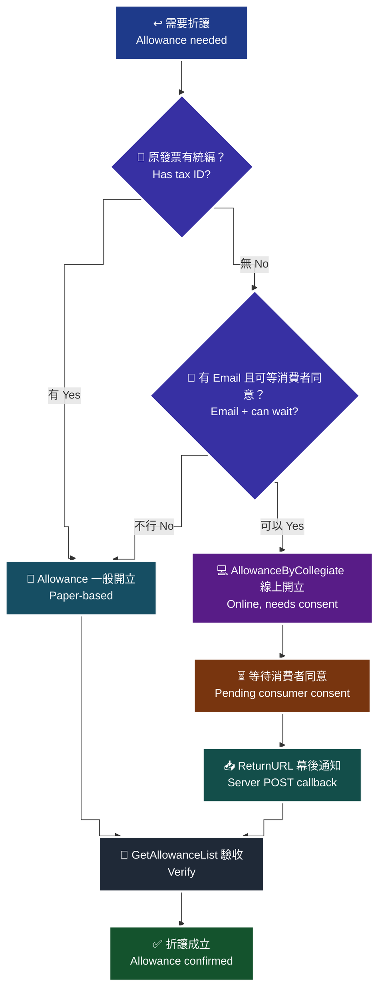

# 05 · B2C 折讓 — 紙本開立 vs 線上開立

`Allowance`（一般開立／紙本）與 `AllowanceByCollegiate`（線上開立／通知開立）差在「**折讓單什麼時候才算成立**」，以及 `ReturnURL` 幕後通知怎麼收。

> **對應 API**：[`Allowance`](../references/b2c-api-reference.md#8-開立折讓一般開立折讓紙本開立-allowance)、[`AllowanceByCollegiate`](../references/b2c-api-reference.md#9-開立折讓線上開立折讓通知開立-allowancebycollegiate)
> **前置條件**：原發票已開立成功且未作廢；已知 `InvoiceNo` 與 `InvoiceDate`；已建立冪等機制（[`22-idempotency-and-retry.md`](22-idempotency-and-retry.md)）。

---

## 1. 什麼是折讓，什麼時候不該用它

折讓 = **部分或全部退款，但發票號碼保留**。與作廢的差別：

| 動作 | 發票號碼 | 什麼時候用 |
|---|---|---|
| **折讓** | 保留，開一張折讓單抵減 | 已交付、事後退貨或退款 |
| **作廢** | **報廢不可再用** | 開錯了、根本沒有這筆交易 |
| **註銷重開** | 保留，重新填內容 | 內容填錯但交易確實存在 |

> 選錯的代價見 [`06-b2c-invalid-void.md`](06-b2c-invalid-void.md)。這裡先記一條：**「客戶退了一半的貨」是折讓，不是作廢。**

---

## 2. 兩支 API 的差別

| 面向 | `Allowance`（一般／紙本） | `AllowanceByCollegiate`（線上／通知） |
|---|---|---|
| 折讓何時成立 | **API 回 `RtnCode=1` 即成立** | 需要**消費者點選同意**後才成立 |
| 消費者參與 | 不需要（紙本折讓單另行處理） | 需要（收到 Email，點同意） |
| `AllowanceNotify` | `S` 簡訊／`E` Email／`A` 皆通知／`N` 皆不通知 | **固定填 `E`**（原文明訂） |
| `NotifyMail` | `AllowanceNotify=E` 時必填 | 必填 |
| 回呼 | 無 | **`ReturnURL` 幕後通知** |
| 取消 | 用 `AllowanceInvalid` 作廢已成立的折讓 | 用 `AllowanceInvalidByCollegiate` 取消**尚未同意**的申請 |
| 查得到嗎 | `GetAllowanceList` 查得到 | **消費者尚未同意的查不到** |

> 🚨 **最關鍵的一句**（i100 §9 原文）：`AllowanceByCollegiate` 的 `RtnCode=1` **「僅代表 API 呼叫成功，需消費者同意後才算開立折讓單成功」**。
> **為什麼這會出事**：如果你在 `RtnCode=1` 就把訂單標記為「已退款完成」並放行退款金流，而消費者始終沒有點同意，你的帳上是退了、稅務上的折讓單卻不存在。月結時對不起來。

---

## 3. 決策：該用哪一個

> 🧭 **純文字重述（螢幕閱讀器友善）**：先問這張發票有沒有帶統一編號。有統編的 B2C 發票，因為買受人是營業人、折讓需要雙方合意證明，走一般開立（紙本）流程較單純。沒有統編時再問：你有沒有消費者可用的 Email，而且流程上可以等消費者按下同意？可以等就用線上開立，由消費者確認後折讓才成立，證據力較好；不能等（例如客服當場要處理完、消費者沒有 Email）就用一般開立，並自行保存紙本折讓證明單。無論走哪一條，最後都要用查詢折讓明細確認實際狀態，不要只信 API 的回應碼。



> ♿ 配色遵循 [`docs/accessibility.md`](../docs/accessibility.md)：WCAG AAA 對比 ≥7:1、Okabe-Ito 色盲安全色盤、16px 字體、直角連線、圖示＋文字雙編碼。

---

## 4. 呼叫方式

```python
# 一般開立（紙本）
res = c.allowance(
    invoice_no="AA12345678",
    invoice_date="2026-08-18",       # yyyy-MM-dd 或 yyyy/MM/dd
    allowance_notify="E",            # S 簡訊 / E Email / A 皆通知 / N 皆不通知
    allowance_amount=500,
    items=[{"ItemName": "有機咖啡豆 200g", "ItemCount": 1, "ItemWord": "包",
            "ItemPrice": 525, "ItemAmount": 500, "ItemTaxAmount": 25}],
    NotifyMail="buyer@example.com",  # AllowanceNotify=E 時必填
)
allowance_no = res["IA_Allow_No"]    # 折讓單號，之後作廢折讓要用

# 線上開立（通知開立）：AllowanceNotify 固定 E，且要設 ReturnURL
res = c.allowance_by_collegiate(
    invoice_no="AA12345678",
    invoice_date="2026-08-18",
    allowance_notify="E",            # 原文：請固定填入 E
    notify_mail="buyer@example.com",
    allowance_amount=500,
    items=[...],
    ReturnURL="https://shop.example.com/opay/allowance-callback",
)
# ⚠️ 此時只是「已申請」，尚未成立
```

### 4.1 金額規則

| 規則 | 原文 |
|---|---|
| `Items[].ItemAmount` **建議帶整數** | 「依營業稅電子資料申報繳稅作業要點，電子發票銷貨退回、進貨退出或折讓證明單之『金額(不含稅之進貨額)』及『營業稅額』欄位須為整數，以利申報資料正確」 |
| `NotifyMail` 要 **UrlEncode**、可多組以**分號**分隔 | i100 §8 |
| 通知類別 `E` → `NotifyMail` 必填；`S` → `NotifyPhone` 必填 | i100 §8 |

> **為什麼金額要整數**：小數會在財政部申報端造成尾差，申報資料對不上。這是「不會被 API 擋下、但會在報稅時出事」的類型。

---

## 5. `ReturnURL` 幕後通知怎麼收

消費者按下同意後，歐付寶會**以 Server POST**（表單編碼，不是 JSON）把結果送到你的 `ReturnURL`。

| 參數 | 型態 | 說明 |
|---|---|---|
| `RtnCode` | Int | `1` 為成功，其餘失敗 |
| `RtnMsg` | String(200) | — |
| `IA_Allow_No` | String(16) | 折讓單號；失敗回空值 |
| `IA_Invoice_No` | String(10) | 原發票號碼；失敗回空值 |
| `IA_Date` | String(20) | 折讓時間 `yyyy-MM-dd HH:mm:ss` |
| `IIS_Remain_Allowance_Amt` | Int | **折讓後剩餘可折讓金額** |

範例（原文）：

```text
RtnCode=1&RtnMsg=&IA_Allow_No=1909181313013546&IA_Invoice_No=UV11100019&IA_Date=2019-09-18 13:13:23&IIS_Remain_Allowance_Amt=0
```

**接收端必做的四件事**：

```python
@app.post("/opay/allowance-callback")
async def allowance_callback(request: Request):
    form = await request.form()                    # ① 表單編碼，不是 JSON
    if form.get("RtnCode") != "1":
        log.warning("折讓未成立：%s", dict(form))
        return PlainTextResponse("1|OK")           # 仍要回 1|OK，否則會被重送
    # ② 用 IA_Invoice_No + IA_Allow_No 找到本地訂單（冪等：已處理過就直接回 1|OK）
    # ③ 更新本地狀態為「折讓成立」，記下 IIS_Remain_Allowance_Amt
    # ④ 正確回應 1|OK
    return PlainTextResponse("1|OK")
```

| 規則 | 原文 / 理由 |
|---|---|
| 必須正確回應 `1\|OK` | 「請在收到 Server 端折讓成功結果通知後，正確回應 `1\|OK` 給歐付寶」 |
| 回呼要**冪等** | 沒回 `1\|OK` 會被重送；重送時你不能重複退款 |
| 回呼網址**不支援中文網域** | 要用 punycode，見 [`02-preflight-checklist.md`](02-preflight-checklist.md) §2.11 |
| 入向 80/443 要放行 | 同上 §2.9 |
| 別把回呼當作唯一真相 | 網路可能掉封包，另外排程用 `GetAllowanceList` 對帳 |

---

## 6. 已成立之後：作廢折讓 vs 取消線上折讓

| 你要做的事 | 用哪支 | 前提 |
|---|---|---|
| 折讓已成立，要把它作廢 | `AllowanceInvalid` | 有 `AllowanceNo` |
| 線上折讓已申請，但消費者**還沒同意**，要收回 | `AllowanceInvalidByCollegiate` | 折讓尚未成立 |

`AllowanceInvalidByCollegiate` 的原文說明：「本 API 僅取消**已申請的線上折讓**（消費者尚未同意者），**並非整張發票作廢**；取消後折讓金額會**返還至該發票的可折讓金額**。」

詳見 [`06-b2c-invalid-void.md`](06-b2c-invalid-void.md)。

---

## 7. 查詢與對帳

用 [`GetAllowanceList`](../references/b2c-api-reference.md#15-查詢折讓明細--getallowancelist) 查，三種 `SearchType`：

| `SearchType` | 必填 | 說明 |
|:---:|---|---|
| `0` | `AllowanceNo` | 依折讓編號查 |
| `1` | `InvoiceNo` + `Date`（**發票開立日**） | — |
| `2` | `InvoiceNo` + `Date`（**發票折讓日**） | — |

> ⚠️ **`GetAllowanceList` 查不到「消費者尚未同意的線上折讓」**（原文：「查詢結果**不包含消費者尚未同意之線上折讓單**」）。
> **為什麼這件事很重要**：你不能用「查不到」來判斷線上折讓不存在。已申請未同意的折讓**確實佔用了可折讓額度**，但查詢看不到它。要判斷是否還有待處理的申請，只能靠你自己的本地狀態表。
>
> ⚠️ `SearchType=1` 與 `2` 都是「發票號碼 + 日期」，差別只在日期是**開立日**還是**折讓日**。用錯會回「查無資料」而不是「參數錯誤」，非常難 debug。

---

### 常見錯誤

1. **把 `AllowanceByCollegiate` 的 `RtnCode=1` 當成折讓成立。** 它只代表 API 呼叫成功，**需要消費者同意**。在這裡放行退款，帳與稅會對不上。
2. **`ReturnURL` 沒回 `1\|OK`。** 歐付寶會重送，你的處理邏輯如果不冪等，就會重複更新訂單狀態或重複退款。
3. **用 `GetAllowanceList` 查不到就認定折讓不存在。** 尚未同意的線上折讓查不到，但額度已被佔用。
4. **`ItemAmount` 帶小數。** API 不會擋，但申報時金額對不上。官方建議帶整數。
5. **`AllowanceByCollegiate` 的 `AllowanceNotify` 填 `A` 或 `S`。** 原文明訂**固定填 `E`**。
6. **該折讓卻去作廢。** 已交付的交易要退一部分款，用折讓；作廢會讓發票號碼**報廢**，而且有時間窗限制，過期就做不到。
