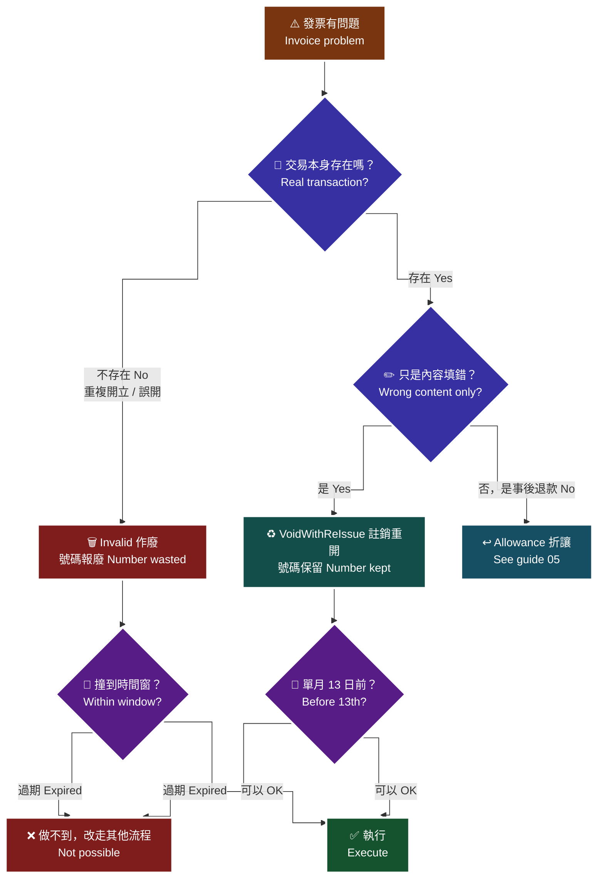

# 06 · B2C 作廢與註銷重開 — 選錯會浪費字軌號碼

**核心觀念：作廢 = 號碼報廢不可再用；註銷重開 = 保留號碼重新填內容。** 這一個字的差別，決定你會不會白白燒掉一個財政部配給的發票號碼。

> **對應 API**：[`Invalid`](../references/b2c-api-reference.md#10-作廢發票--invalid)、[`AllowanceInvalid`](../references/b2c-api-reference.md#11-作廢折讓--allowanceinvalid)、[`AllowanceInvalidByCollegiate`](../references/b2c-api-reference.md#12-取消線上折讓--allowanceinvalidbycollegiate)、[`VoidWithReIssue`](../references/b2c-api-reference.md#13-註銷重開--voidwithreissue)
> **前置條件**：已知原發票 `InvoiceNo` 與 `InvoiceDate`；已確認**沒有撞到期別時間窗**（見 §4）；已建立不可逆操作的二次確認與 audit log。

---

## 1. 四支 API 一句話對照

| API | 對象 | 做什麼 | 發票號碼 | 可逆？ |
|---|---|---|---|:---:|
| `Invalid` | **發票** | 整張作廢 | **報廢，不可再用** | ❌ |
| `VoidWithReIssue` | **發票** | 註銷後用**同一個號碼**重新填內容開立 | **保留** | ❌（但號碼沒浪費） |
| `AllowanceInvalid` | **折讓單** | 把已成立的折讓作廢 | 不影響發票號碼 | ❌ |
| `AllowanceInvalidByCollegiate` | **線上折讓申請** | 取消消費者**尚未同意**的申請 | 不影響發票號碼 | ✅（額度會返還） |

> 🚨 前三支都是**不可逆**的財務動作。程式裡必須有二次確認 + audit log + 禁止盲目重試（[`22-idempotency-and-retry.md`](22-idempotency-and-retry.md)）。

---

## 2. 核心決策：作廢還是註銷重開

> 🧭 **純文字重述（螢幕閱讀器友善）**：發現發票有問題時，先問「這筆交易是不是真的存在」。如果交易根本不存在（重複開立、測試誤開、訂單根本沒成立），應該作廢，發票號碼會報廢不可再用。如果交易確實存在、只是發票內容填錯（品名、金額、買受人統編寫錯），應該用註銷重開，發票號碼、自訂編號與開立時間都保留，只是重新填寫內容，不會浪費號碼。第三種情況是交易存在且發票內容正確，只是事後退貨或退款，那不是作廢也不是註銷，而是折讓。三條路都受期別時間窗限制：作廢在奇數月 13 號 23:59:59 之後不能作廢前兩個月的發票；註銷重開只能在單月 13 日前註銷前一期的發票。



> ♿ 配色遵循 [`docs/accessibility.md`](../docs/accessibility.md)：WCAG AAA 對比 ≥7:1、Okabe-Ito 色盲安全色盤、16px 字體、直角連線、圖示＋文字雙編碼。

### 2.1 三種情境的正解

| 情境 | 正解 | 選錯的代價 |
|---|---|---|
| 系統 bug 造成同一訂單開了兩張 | 作廢多開的那張 | 用註銷重開 → 兩張發票都還在，帳目仍然重複 |
| 買受人統編打錯 | **註銷重開** | 用作廢 → **白燒一個號碼**，還要再開一張新的 |
| 品名／金額填錯 | **註銷重開** | 同上 |
| 客戶退貨退款 | **折讓** | 用作廢 → 號碼報廢，而且過了期別時間窗根本作廢不了 |
| 測試環境誤開 | 作廢（沒有其他選擇） | — |

> **為什麼「白燒一個號碼」是真的成本**：發票號碼是財政部按本配給的（一本 50 號），用完要重新申請配號並等審核。高頻商家在期別末尾把號碼燒光，就是**開不出發票**，且無法即時補救。

---

## 3. 註銷重開的三個不可改欄位

i100 §12 原文：「適用於發票註銷重開（**發票號碼、自訂編號、開立時間不可更改**）」，且「`IssueModel.InvoiceDate` 需為**先前開立發票的時間**」。

| 欄位 | 必須是 |
|---|---|
| 發票號碼 | 原發票號碼 |
| `RelateNumber` | **原發票的自訂編號** |
| `IssueModel.InvoiceDate` | 原發票的開立時間 |

```python
res = c.void_with_re_issue(
    void_model={
        "InvoiceNo": "AA12345678",
        "InvoiceDate": "2026-08-18",
        "Reason": "買受人統編填寫錯誤",
    },
    issue_model={
        "RelateNumber": "ORD20260818001",   # 必須與原發票相同
        "InvoiceDate": "2026-08-18",        # 必須是原開立時間
        "CustomerIdentifier": "12345675",   # 這次填對的統編
        "Print": "1",
        "Donation": "0",
        "TaxType": "1",
        "SalesAmount": 1050,
        "InvType": "07",
        "Items": [...],
        # 其餘欄位比照 Issue，規則見 guide 04
    },
)
```

**`IssueModel` 的欄位規則與 `Issue` 完全一致**（載具／捐贈／統編互斥、稅務欄位、金額計算），見 [`04-b2c-issue.md`](04-b2c-issue.md) §4–§5。

⚠️ 官方文件的已知瑕疵（原文照錄）：「回傳 Data 範例中 `InvoiceNo` 值為 `"20181028000000001"`（與 `RelateNumber` 相同），與欄位定義的 String(10) 發票號碼不一致。」介接前建議向歐付寶確認實際回傳格式，程式端要能容錯。

---

## 4. 時間窗：過期就真的做不到

這一節不是「錯誤」，是**業務上的硬性期限**。撞到期限時，`RtnMsg` 可能只寫一句籠統訊息，開發者會誤以為參數錯而不斷重試。

| 限制 | 原文 | 具體例子 |
|---|---|---|
| **作廢**：奇數月 13 號 23:59:59 後，無法作廢前兩個月的發票 | i100 §9 | **3 月 14 號時，不能作廢 1、2 月開立的發票** |
| **作廢折讓**：同樣的規則 | i100 §10 | 3 月 14 號時，不能作廢 1、2 月的折讓 |
| **註銷重開**：僅能於**單月 13 日前**註銷前一期的發票 | i100 §12 | — |
| **已被折讓過的發票不能直接作廢** | i100 §9 | 要先確認「該發票所開立的折讓單**是否全部已作廢**」 |
| 作廢／作廢折讓是**隔日**才上傳財政部 | i100 §9 §10 | 當天查不到上傳狀態是正常的 |

> **為什麼是奇數月 13 號**：營業稅是雙月申報，奇數月的申報期涵蓋前兩個月。**申報一旦送出，那兩個月的發票就不能再動了。**

### 4.1 程式裡怎麼防

```python
from datetime import date

def can_invalid(invoice_date: date, today: date | None = None) -> tuple[bool, str]:
    """作廢時間窗檢查。撞窗時回 False + 原因，讓 UI 直接顯示，而不是送出去被拒。"""
    today = today or date.today()
    # 奇數月 14 號起，前兩個月的發票已申報，不能作廢
    if today.month % 2 == 1 and today.day >= 14:
        prev2 = ((today.year, today.month - 2) if today.month > 2
                 else (today.year - 1, today.month + 10))
        if (invoice_date.year, invoice_date.month) <= prev2:
            return False, f"{prev2[0]}/{prev2[1]:02d} 以前的發票已申報至財政部，無法作廢"
    return True, ""
```

> **為什麼要在前端就擋**：使用者在後台按下「作廢」時，如果只是收到一句籠統的失敗訊息，他會再按一次、再按一次，然後打電話問工程師。**在按下去之前就告訴他「這張已經申報了，只能走其他流程」，才是有用的錯誤處理。**

---

## 5. 折讓的作廢 vs 線上折讓的取消

| 情況 | 用哪支 | 為什麼 |
|---|---|---|
| 折讓已成立，要作廢它 | `AllowanceInvalid` | 需要 `InvoiceNo` + `AllowanceNo` |
| 線上折讓已申請，消費者**尚未同意** | `AllowanceInvalidByCollegiate` | 只是收回申請，**不是整張發票作廢** |

`AllowanceInvalidByCollegiate` 的原文：「本 API **僅取消已申請的線上折讓**（消費者尚未同意者），**並非整張發票作廢**；取消後折讓金額會**返還至該發票的可折讓金額**。」

```python
# 作廢已成立的折讓
c.allowance_invalid(invoice_no="AA12345678", allowance_no="1909181313013546",
                    reason="折讓金額計算錯誤")

# 取消尚未同意的線上折讓申請
c.allowance_invalid_by_collegiate(invoice_no="AA12345678",
                                  allowance_no="1909181313013546",
                                  reason="客戶改變主意")
```

> ⚠️ 這兩支的參數幾乎一樣（`InvoiceNo` + `AllowanceNo` + `Reason`），**唯一的差別在折讓是否已成立**。用錯會失敗，但錯誤訊息不會告訴你「你應該用另一支」。**在本地狀態表記錄「這筆折讓是線上還是紙本、是否已成立」，是唯一可靠的判斷依據**（`GetAllowanceList` 查不到尚未同意的線上折讓，見 [`05-b2c-allowance.md`](05-b2c-allowance.md) §7）。

---

## 6. 作廢的順序：先折讓後發票

官方原文（i100 §9）：「發票若**已被折讓過，無法直接作廢發票**，並請確認該發票所開立的折讓單是否**全部已作廢**。」

**正確順序**：

```
① GetAllowanceList 查出這張發票的所有折讓單
② 對每一張尚未作廢的折讓單呼叫 AllowanceInvalid
③ 確認全部折讓單都已作廢
④ 才呼叫 Invalid 作廢發票
```

> **為什麼會漏**：折讓單可能是幾週前由客服開的，發票作廢的人不知道有折讓存在。**程式應該在作廢流程的第一步就自動查折讓**，而不是讓 API 回失敗再讓人去猜。

---

## 7. 不可逆操作的防護

作廢與註銷重開都會產生**無法回復的財務／稅務紀錄**。建議的防護層級與退款、轉帳同級：

| 防護 | 做法 | 為什麼 |
|---|---|---|
| **二次確認** | 產生一次性驗證碼，操作者要輸入才執行（bot 模板的 `/confirm <code>` 就是這個模式） | 避免誤點、避免自動化腳本誤觸 |
| **審計紀錄** | 記錄操作者、時間、發票號碼、原因、結果，寫入獨立 audit log | 事後追查與稅務稽核都需要 |
| **大額提醒** | 超過門檻只「加註警示」，不阻擋 | 阻擋會逼人繞過流程；提醒能讓人停一秒 |
| **禁止自動重試** | `Invalid` / `VoidWithReIssue` 一律不進重試佇列 | timeout 不代表沒成功，重試會二次作廢 |
| **先查再決定** | timeout 後用 `GetInvalid` 查是否已作廢 | 唯一安全的收斂方式 |

參考實作：[`templates/telegram-bot/bot.py`](../templates/telegram-bot/bot.py) 的 `create_pending()` / `take_pending()` / `write_audit()`。

```python
# 反面教材：絕對不要這樣寫
for attempt in range(3):
    try:
        return client.invalid(invoice_no, invoice_date, reason)
    except OPayEInvoiceError:
        time.sleep(2 ** attempt)      # ← timeout 時第二次呼叫可能作廢到別的東西
```

```python
# 正確：timeout 一律先查再決定
try:
    return client.invalid(invoice_no, invoice_date, reason)
except OPayEInvoiceError as exc:
    mark_in_flight(invoice_no)                       # 標記為「結果未知」
    detail = client.get_invalid(relate_number, invoice_no, invoice_date)
    if detail:                                       # 查得到 → 其實已經作廢了
        mark_succeeded(invoice_no)
        return detail
    raise                                            # 查不到才交給人決定
```

---

## 8. 作廢後的驗收

| 要確認的事 | 用哪支 |
|---|---|
| 發票是否已作廢 | [`GetInvalid`](../references/b2c-api-reference.md#16-查詢作廢發票明細--getinvalid) |
| 折讓是否已作廢 | [`GetAllowanceInvalid`](../references/b2c-api-reference.md#17-查詢作廢折讓明細--getallowanceinvalid) |
| 發票目前狀態 | [`GetIssue`](../references/b2c-api-reference.md#14-查詢發票明細--getissue) 的 `IIS_Invalid_Status`（`1` 已作廢／`0` 未作廢） |

⚠️ 上傳狀態當天查是 `0`（未上傳）是**正常的**——官方明寫作廢資料是**隔日**才上傳財政部。不要因此判定失敗而重送。

⚠️ `IIS_Issue_Status` 的 `0` 在 B2C 是「**發票註銷**」，在 B2B 是「**發票退回**」。跨系統對照時不要共用同一組常數，見 [`enums.md` §10.7](../references/enums.md#107-️-issue_status-的-0--b2b-是退回b2c-是註銷)。

---

## 9. 作廢原因（`Reason`）怎麼寫

`Reason` 會留在稅務紀錄裡，是事後稽核時唯一能解釋「為什麼這張發票沒了」的欄位。

| 寫法 | 評價 | 為什麼 |
|---|---|---|
| `測試` / `test` / `1` | ❌ | 半年後沒有人知道發生什麼事；稽核時無法說明 |
| `系統錯誤` | ⚠️ | 太籠統，等於沒寫 |
| `重複開立（原發票 AA12345677，訂單 ORD20260818001）` | ✅ | 可追溯、可交代 |
| `買受人統編填寫錯誤，已註銷重開` | ✅ | 說明了後續處置 |

**建議做法**：把 `Reason` 設計成「**分類 + 關聯單號**」的組合，由程式自動拼接，而不是讓操作者自由輸入。

```python
REASONS = {
    "duplicate":   "重複開立",
    "wrong_taxid": "買受人統編錯誤",
    "wrong_item":  "品名或金額錯誤",
    "order_void":  "訂單取消未成立",
    "test":        "測試資料清理",
}

def build_reason(code: str, order_id: str, note: str = "") -> str:
    base = f"{REASONS[code]}（訂單 {order_id}）"
    return f"{base} {note}".strip()[:200]   # 依 API 欄位長度截斷
```

> **為什麼要限制成選單**：自由輸入的 `Reason` 在三個月後統計時完全無法分群。用固定分類，你才有辦法回答「這個月作廢了幾張、主要原因是什麼、是不是某個 bug 造成的」。

---

## 10. 作廢率是一個該監控的指標

作廢與註銷重開的數量本身就是**系統健康度的訊號**。

| 指標 | 正常 | 異常代表什麼 |
|---|---|---|
| 每日作廢張數 / 每日開立張數 | 低且穩定 | 突然升高 → 多半是開立邏輯有 bug，或有人在批次清資料 |
| 作廢原因分佈 | 分散 | 某一類佔比暴增 → 該類的表單驗證有漏洞 |
| 註銷重開次數 | 低 | 高 → 開立前的欄位驗證不足（例如統編沒先驗） |
| 「重複開立」類作廢 | **應該接近 0** | 大於 0 → **冪等機制有破口**，見 [`22-idempotency-and-retry.md`](22-idempotency-and-retry.md) |

> **為什麼「重複開立」類作廢應該是 0**：每一張因為重複而作廢的發票，都代表冪等機制曾經失效過一次。這個數字不是「處理掉就好」，它是**下一次可能更嚴重的預警**。把它接到告警，不要只放進報表。

推播實作可直接沿用 [`25-telegram-bot.md`](25-telegram-bot.md) / [`26-discord-bot.md`](26-discord-bot.md) 的事件機制（`invalid` 事件）。

---

### 常見錯誤

1. **內容填錯就作廢重開。** 應該用 `VoidWithReIssue` 註銷重開。作廢會**白燒一個發票號碼**，期別末尾號碼吃緊時會直接導致開不出發票。
2. **退貨退款用作廢。** 那是折讓。而且退款通常發生在數週後，早就撞到期別時間窗，作廢根本做不到。
3. **註銷重開時改了 `RelateNumber` 或開立時間。** 三個欄位（發票號碼、自訂編號、開立時間）都**不可更改**，改了會失敗。
4. **已有折讓就直接作廢發票。** 必須先把該發票的**所有折讓單全部作廢**，順序反了會失敗。
5. **作廢 timeout 就自動重試。** timeout 不代表沒成功。必須先用 `GetInvalid` 查，查不到才重送。
6. **沒有在 UI 層擋期別時間窗。** 使用者只會看到一句籠統的失敗訊息，然後反覆重按、打電話問工程師。在按下去之前就告訴他原因。
