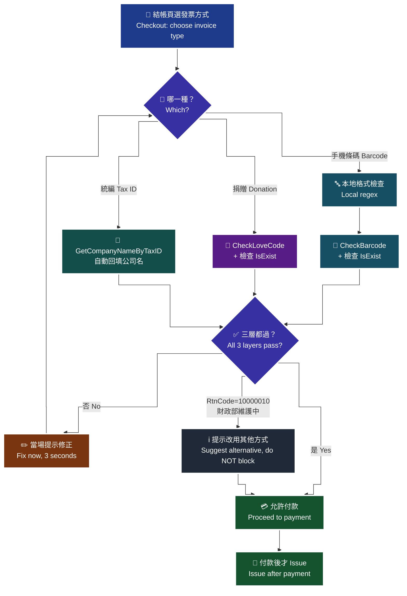

# 09 · B2C 三支驗證 API — 在結帳當下驗，不要等開立時才發現

**核心觀念：載具、捐贈碼、統編都要在「結帳當下」驗，不要等開立時才發現是假的。** 開立失敗的成本，遠高於結帳前多打一支 API。

> **對應 API**：[`CheckBarcode`](../references/b2c-api-reference.md#21-手機條碼驗證--checkbarcode)、[`CheckLoveCode`](../references/b2c-api-reference.md#22-捐贈碼驗證--checklovecode)、[`GetCompanyNameByTaxID`](../references/b2c-api-reference.md#23-統一編號驗證--getcompanynamebytaxid)
> **前置條件**：可用金鑰、網路可達。**這三支不需要字軌，隨時可呼叫。**

---

## 1. 為什麼一定要在結帳當下驗

| 驗證時點 | 消費者體驗 | 失敗時的處理成本 |
|---|---|---|
| **結帳當下（正確）** | 「手機條碼格式不正確，請重新輸入」——當場改，3 秒 | 幾乎為零 |
| 開立當下（錯誤） | 付款已完成、頁面已跳轉，消費者已經離開 | 客服要聯絡消費者、要走註銷重開或作廢、要重新通知 |

**具體會發生什麼**：

1. 消費者手機條碼打錯一個字 → 你沒驗 → `Issue` 失敗。
2. 這時款已經收了，但發票沒開。你的訂單狀態卡在「已付款、未開票」。
3. 你要嘛拿到正確條碼重開（要聯絡消費者），要嘛改成無載具開立（但消費者以為存進載具了）。
4. 而發票開立有**法定時限**（B2C 加值中心 48 小時內上傳財政部），你不能無限期地等。

> 🔑 **一句話**：多打一支驗證 API 的成本是幾十毫秒；開立失敗的成本是一次人工客服。這個交換比例不需要猶豫。

---

## 2. 三支 API 一覽

| API | 驗什麼 | 回什麼 | 什麼時候呼叫 |
|---|---|---|---|
| `CheckBarcode` | 手機條碼載具是否存在 | `IsExist` = `Y` / `N` | 消費者輸入手機條碼後（失焦即驗） |
| `CheckLoveCode` | 捐贈碼是否存在 | `IsExist` = `Y` / `N` | 消費者選擇捐贈碼後 |
| `GetCompanyNameByTaxID` | 統編對應的公司名稱 | 公司名稱 | 消費者輸入統編後（順便自動填公司名） |

---

## 3. 🚨 `RtnCode=1` 不代表「存在」

官方原文（i100 §20、§21）：

> `RtnCode` 此欄位值代表**呼叫交易作業結果，不代表手機條碼是否存在結果**；`RtnCode` 為 `1`（成功）時，**請再判斷此欄位值**（`IsExist`）。

這是**三層判斷**，少一層就是誤判：

| 層 | 檢查 | 失敗代表 |
|---:|---|---|
| 1 | `TransCode == 1` | 傳輸層失敗（時間、金鑰、MerchantID） |
| 2 | `RtnCode == 1` | **查詢動作**失敗 |
| 3 | `IsExist == "Y"` | **條碼／捐贈碼不存在** |

```python
def verify_barcode(c, barcode: str) -> tuple[bool, str]:
    """回 (是否可用, 給使用者看的訊息)。"""
    try:
        res = c.check_barcode(bar_code=barcode)
    except OPayEInvoiceError as exc:
        return False, "驗證服務暫時無法使用，請稍後再試"
    if res.get("RtnCode") == 10000010:
        # 官方明列：財政部系統維護中，無法驗證，請稍後再試
        return False, "財政部驗證系統維護中，請稍後再試或改用其他發票方式"
    if res.get("RtnCode") != 1:
        return False, "驗證失敗，請確認手機條碼是否正確"
    if res.get("IsExist") != "Y":          # ← 少了這一層就是誤判
        return False, "查無此手機條碼，請確認是否已向財政部申請"
    return True, ""
```

> 🚫 **反面教材**：`if res["RtnCode"] == 1: use_carrier(barcode)`。這會讓**不存在的手機條碼一路帶到開立階段**，然後在 `Issue` 爆炸——而那時候款已經收了。

### 3.1 `RtnCode=10000010`：財政部維護中

這是官方**唯一明列意義**的錯誤碼之一：「財政部系統目前維護中，無法驗證，請稍後再試」。

**產品面該怎麼設計**：

| 做法 | 評價 |
|---|---|
| 直接擋住結帳 | ❌ 財政部維護是你和消費者都無法控制的事，擋住等於損失營收 |
| 靜默當成驗證通過 | ❌ 假載具會流入，開立時失敗 |
| **提示消費者改用其他方式（紙本／捐贈／無載具），並允許他繼續結帳** | ✅ |

> **為什麼要允許繼續結帳**：驗證是為了降低開立失敗率，不是為了阻擋交易。維護中時，讓消費者改成「不使用載具」仍然能完成交易並開出發票；擋住結帳則是把一個小問題變成營收損失。

---

## 4. 手機條碼的格式規則

官方原文（i100 §20）：

> `BarCode` 格式應為 **8 碼字元，第 1 碼為『/』**；其餘 7 碼則由數字【0-9】、大寫英文【A-Z】與特殊符號【+】【-】【.】這 **39 個字元**組成。

| 規則 | 為什麼會踩到 |
|---|---|
| 固定 8 碼，第 1 碼 `/` | 消費者常漏掉開頭的 `/` |
| 其餘 7 碼只能是 `0-9` `A-Z` `+` `-` `.` | 小寫字母、其他符號都不合法 |
| **僅接受半形字元** | 手機輸入法很容易打出全形 `＋` `－` |
| 官方註記：**條碼中有加號可能在介接驗證時發生錯誤，請將加號改為空白字元產生驗證碼** | 這是官方明寫的已知行為，程式端要特別處理 |

**前端就先做格式檢查，再送 API**：

```python
import re
BARCODE_RE = re.compile(r"^/[0-9A-Z+\-.]{7}$")

def looks_like_barcode(s: str) -> bool:
    return bool(BARCODE_RE.match(s))
```

> **為什麼要先本地檢查**：格式明顯不對的輸入不需要浪費一次 API round-trip，而且本地檢查可以給出更精準的訊息（「手機條碼須為 8 碼且以 / 開頭」）比「查無此條碼」有用得多。
>
> ⚠️ 但**本地檢查不能取代 API 驗證**——格式對不代表存在。兩者都要做。

---

## 5. 捐贈碼的格式規則

官方原文（i100 §21）：

> `LoveCode` 捐贈碼以**阿拉伯數字為限，最少三碼，最多七碼**；內容定位採「**文字格式**」，**首位可以為零**。

| 規則 | 陷阱 |
|---|---|
| 3–7 碼數字 | — |
| **文字格式，首位可以為零** | 🚨 用整數存 `0123` 會變成 `123`，變成另一個捐贈碼 |

> **為什麼「首位可以為零」是重點**：如果你把捐贈碼存成資料庫的 INT 欄位，`0123` 會變成 `123`。這兩個是**不同的捐贈機構**。錢會捐給錯的人，而且你不會收到任何錯誤訊息。**捐贈碼一律用字串存、字串傳。**

官方在 `Issue` 章節提供的推薦捐贈碼（原文）：**`168001` OMG 關懷社會愛心基金會**。

---

## 6. 統編驗證

```python
res = c.get_company_name_by_tax_id(unified_business_no="12345675")
company_name = res.get("CompanyName")   # 可直接回填到「公司名稱」欄位
```

| 規則 | 說明 |
|---|---|
| `UnifiedBusinessNo` | **僅限數字，長度 8** |
| 檢核邏輯 | **自 2023-01-01 起由「可被 10 整除」改為「可被 5 整除」**。不符合會導致**開立發票與交易對象維護失敗** |
| 回傳 | 公司名稱 |

> **產品面的加分做法**：驗證成功時**自動填入公司抬頭**。這同時解決了兩個問題——(1) 消費者不用手打公司全名，(2) 你拿到的抬頭與財政部登記一致，不會出現「XX公司」vs「XX有限公司」的差異。
>
> ⚠️ 有統編時 `Donation` 必須是 `0`（有統編不能捐贈），且 `Print` 與 `CarrierType` 有連動規則，見 [`04-b2c-issue.md`](04-b2c-issue.md) §4.2。

---

## 7. 結帳流程中的驗證時點

> 🧭 **純文字重述（螢幕閱讀器友善）**：消費者在結帳頁選擇發票方式。選手機條碼時，輸入框失焦即先做本地格式檢查，格式過了才呼叫手機條碼驗證 API，並依序檢查 RtnCode 與 IsExist 兩層；選捐贈時，選定捐贈碼後呼叫捐贈碼驗證；選統編時，輸入 8 碼後呼叫統一編號驗證並自動回填公司名稱。三條路的驗證都必須通過，才允許進入付款。付款完成後才呼叫開立發票 API，此時所有欄位都已經驗過，開立失敗率大幅下降。若驗證 API 回傳財政部維護中，不阻擋結帳，改為提示消費者選用其他發票方式。



> ♿ 配色遵循 [`docs/accessibility.md`](../docs/accessibility.md)：WCAG AAA 對比 ≥7:1、Okabe-Ito 色盲安全色盤、16px 字體、直角連線、圖示＋文字雙編碼。

**無障礙**：驗證結果必須用 `aria-live="polite"` 播報，且不能只用紅色框線表示錯誤。完整規範見 [`29-wcag-ui-ux.md`](29-wcag-ui-ux.md)。

---

## 8. 這三支可以安全重試

| 性質 | 說明 |
|---|---|
| **冪等** | 純查詢，不改變任何狀態 |
| 可重試 | ✅ 指數退避 + 上限 |
| `RtnCode=10000010` | 官方**明白指示「請稍後再試」**，正是重試的適用情境 |
| ⚠️ 重試時 | **每次都要重新產生 `Timestamp`**（10 分鐘驗證區間） |

**快取建議**：統編 → 公司名稱可以快取（公司名不常變），但**手機條碼與捐贈碼不建議長時間快取**——消費者可能剛註銷／機構可能停用，而快取造成的假陽性會直接導致開立失敗。

---

### 常見錯誤

1. **只看 `RtnCode=1` 就認定條碼存在。** 必須再看 `IsExist`。這是官方在文件裡用粗體提醒、但最常被略過的一條。
2. **等到開立時才驗。** 那時款已收、消費者已離開，處理成本是幾十倍。
3. **捐贈碼用整數存。** `0123` 變 `123`，錢捐給錯的機構，而且沒有任何錯誤訊息。
4. **`RtnCode=10000010` 時擋住結帳。** 財政部維護是外部因素，應該提示改用其他發票方式並讓交易完成。
5. **只做本地格式檢查就放行。** 格式對不代表存在。兩者都要做。
6. **全形字元沒過濾。** 手機輸入法很容易打出全形 `＋`，官方明寫「僅接受半形字元」。
