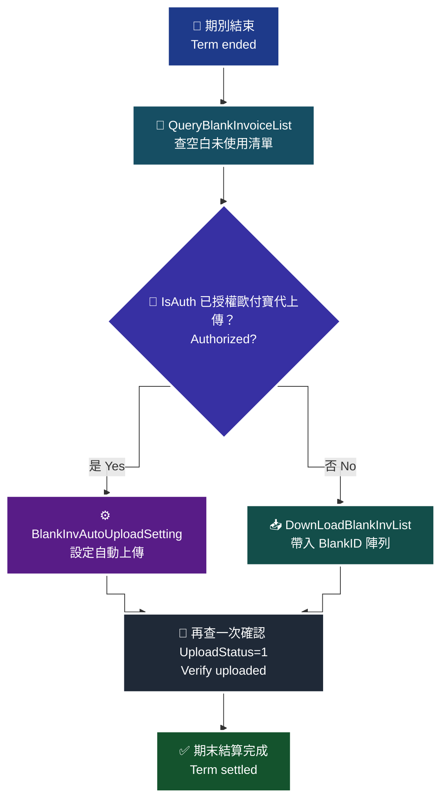

# 11 · B2C 空白未使用發票 — 期末結算的義務

空白未使用發票是什麼、為什麼財政部要、以及三支 API 怎麼用。

> **對應 API**：[`QueryBlankInvoiceList`](../references/b2c-api-reference.md#28-查詢空白未使用發票--queryblankinvoicelist)、[`BlankInvAutoUploadSetting`](../references/b2c-api-reference.md#29-設定空白發票是否自動上傳--blankinvautouploadsetting)、[`DownLoadBlankInvList`](../references/b2c-api-reference.md#30-下載空白發票清單--downloadblankinvlist)
> **前置條件**：該期別已結束（**不可查當期**）；如要自動上傳，需先於財政部授權歐付寶可代上傳。

---

## 1. 空白未使用發票是什麼

你向財政部申請了一段字軌配號（例如 `AA10000000`–`AA10000999`，共 1,000 個號碼）。這一期結束時，你可能只用掉 720 個。**剩下的 280 個號碼就是「空白未使用發票」。**

| 名詞 | 意思 |
|---|---|
| 已使用 | 已開立（含已作廢的，號碼已消耗） |
| **空白未使用** | 配號給你、但整期結束都沒用到的號碼 |

### 1.1 為什麼財政部要這個資料

發票號碼是**國家配發的憑證編號**。財政部需要確認每一個配出去的號碼最後的去向：

| 號碼去向 | 財政部怎麼知道 |
|---|---|
| 開立了 | 你上傳的發票資料 |
| 作廢了 | 你上傳的作廢資料 |
| **沒用到** | **就是這份空白未使用發票清單** |

> **為什麼這件事重要**：如果一段號碼「既沒有開立紀錄、也沒有作廢紀錄、也沒有申報為空白未使用」，那它在帳上就是**去向不明**。這是稽核會被追問的類型。營業人有義務在期末結算時把未使用的號碼申報掉。
>
> ⚠️ 本節僅為流程說明，**不構成稅務意見**。實際申報義務與期限請諮詢會計師，見 [`27-legal-compliance.md`](27-legal-compliance.md)。

---

## 2. 三支 API 的流程

> 🧭 **純文字重述（螢幕閱讀器友善）**：期別結束後，先呼叫查詢空白未使用發票，帶入發票年度與期別，取得清單，每一筆包含 BlankID、字軌、起訖號碼、是否已授權歐付寶代上傳、上傳狀態、是否可異動等資訊。接著有兩條路：一條是設定自動上傳，讓歐付寶在往後自動處理；另一條是把查到的 BlankID 陣列傳給下載空白發票清單 API 手動處理。無論走哪一條，最後都要回頭用查詢 API 確認上傳狀態已變成已上傳。注意查詢 API 不可查當期，最多只能查詢一年。



> ♿ 配色遵循 [`docs/accessibility.md`](../docs/accessibility.md)：WCAG AAA 對比 ≥7:1、Okabe-Ito 色盲安全色盤、16px 字體、直角連線、圖示＋文字雙編碼。

---

## 3. `QueryBlankInvoiceList`

```python
res = c.query_blank_invoice_list(
    invoice_year="115",   # 民國年
    invoice_term=3,       # 1:1-2月 2:3-4月 3:5-6月 4:7-8月 5:9-10月 6:11-12月
    page_no=1,
    page_size=50,
)
```

| 限制 | 原文 |
|---|---|
| **不可查當期** | 「※**不可查當期**，最多查詢 1 年」 |
| 最多查 1 年 | 同上 |

| 回傳重點欄位 | 意義 |
|---|---|
| `BlankID` | 這筆空白區間的識別碼，**`DownLoadBlankInvList` 要用** |
| `IsAuth` | 是否已在財政部授權歐付寶**代上傳** |
| `UploadStatus` | `0` 未上傳／`1` 已上傳（**只有兩值**） |
| `ChangeStatus` | `0` 不可異動／`1` 可異動 |
| `IsAutoUpload` | `0` 否／`1` 是 |
| `InvType` | `07`／`08` |

> ⚠️ **官方文件的已知不一致**（原文照錄）：
> - `InvType` 參數表寫 `"07"`／`"08"`，但**回傳範例出現的是數值 `7`**。
> - 回傳 Data 範例**未包含 `TotalCount`**，僅參數表有列。
> - 傳入範例標示「(待調整)」，且**使用 Word 智慧引號**（`“ ”`）——實際介接請用標準 JSON 半形雙引號。
>
> **程式端要能容錯**：`InvType` 同時接受 `"07"` 與 `7`，`TotalCount` 缺少時用清單長度代替。

---

## 4. `BlankInvAutoUploadSetting`

適用時機：**廠商已於財政部授權歐付寶可代上傳**（可先用 `QueryBlankInvoiceList` 的 `IsAuth` 確認）。

```python
c.blank_inv_auto_upload_setting(setting_list=[
    {"BlankID": 12345, "IsAutoUpload": 1},
])
```

> ⚠️ `IsAutoUpload` 參數表型態為 String（`"0"`／`"1"`），**但原文範例送的是數值 `1`**。原文未明確說明，介接前請向歐付寶確認。
> ⚠️ 原文 `SettingList` 的說明欄寫的是「發票年度，例如:112 ※不可查當期，最多查詢 1 年」，**與欄位語意不符，疑為文件誤植**。
>
> **實務建議**：先在測試環境用兩種型態各試一次，記下哪一種成功，並在程式裡加註解。這種文件與範例不一致的情況，只能靠實測。

---

## 5. `DownLoadBlankInvList`

```python
c.down_load_blank_inv_list(blank_list=[12345, 12346])   # BlankID 陣列
```

`BlankList` 是 `Array[Int]`，直接帶入 `QueryBlankInvoiceList` 回傳的 `BlankID`。

> ⚠️ **重要提醒**：本 API 名為「下載」，但**原文回傳 Data 參數只有 `RtnCode` 與 `RtnMsg`，未定義任何檔案內容、檔名或下載連結欄位**。原文未明確說明實際的下載方式，介接前請向歐付寶確認。
>
> **不要假設它會回傳一個檔案 URL**。在向歐付寶確認之前，把它當成「觸發某個後端處理」的動作，並用 `QueryBlankInvoiceList` 的 `UploadStatus` 來驗收結果。

---

## 6. 排進期末排程

| 時機 | 做什麼 |
|---|---|
| 每期結束後（下一期開始） | `QueryBlankInvoiceList` 查上一期 |
| 有空白區間時 | 依 `IsAuth` 決定走自動上傳或手動處理 |
| 處理後 | 再查一次確認 `UploadStatus=1` |
| 有異常 | 推播到工作群組 + 通知會計 |

```python
def previous_term(year: int, month: int) -> tuple[str, int]:
    """回傳上一期的 (民國年, 期別)。"""
    term = (month + 1) // 2
    if term == 1:
        return str(year - 1 - 1911), 6
    return str(year - 1911), term - 1
```

> **為什麼要自動化**：期末結算一年只發生 6 次，**沒有人會記得**。而且它不會有任何錯誤提示——不做就只是安靜地沒做，直到稽核時才被問。排程 + 推播是唯一可靠的做法。

---

### 常見錯誤

1. **想查當期。** 官方明寫「**不可查當期**」。要等該期結束後才查得到。
2. **以為 `DownLoadBlankInvList` 會回傳檔案。** 原文回傳欄位只有 `RtnCode` / `RtnMsg`，沒有定義檔案或連結。介接前務必向歐付寶確認。
3. **`InvType` 只處理字串型態。** 官方回傳範例出現的是數值 `7`，程式要能同時吃 `"07"` 與 `7`。
4. **沒確認 `IsAuth` 就設定自動上傳。** 沒授權的話設了也不會生效。
5. **複製官方範例的智慧引號。** 原文範例用了 Word 的 `“ ”`，直接複製會是無效 JSON。
6. **靠人記得做期末結算。** 一年 6 次、沒有錯誤提示，一定要排程。
