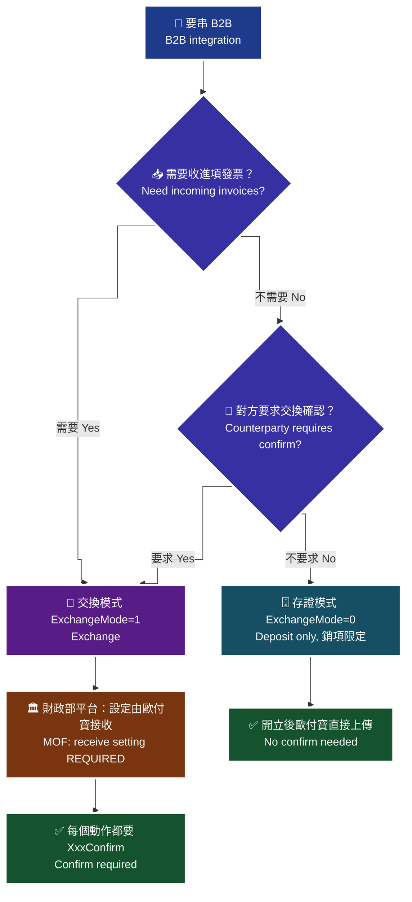
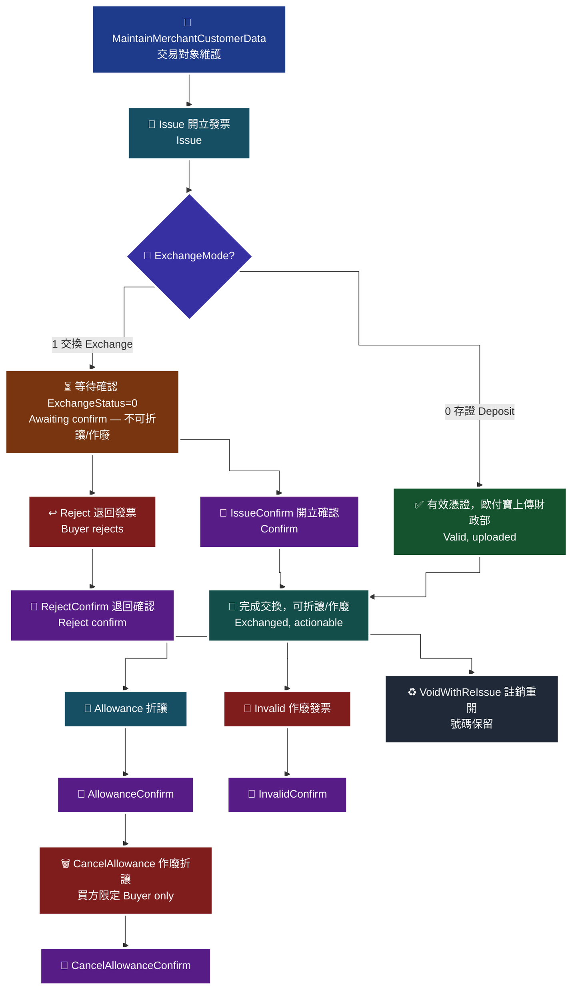

# 12 · B2B 全貌 — 存證模式 vs 交換模式

B2B 與 B2C 的根本差異、兩種模式怎麼選、7 天上傳期限，以及 B2B 字軌設定。

> **對應 API**：[`AddInvoiceWordSetting`](../references/b2b-api-reference.md#3-字軌與配號設定--addinvoicewordsetting)、[`UpdateInvoiceWordStatus`](../references/b2b-api-reference.md#4-設定字軌號碼狀態--updateinvoicewordstatus)；全貌另見 [B2B 與 B2C 的根本差異](../references/b2b-api-reference.md#b2b-與-b2c-的根本差異ai-必讀)
> **前置條件**：**必須先於財政部電子發票整合服務平台完成「授權歐付寶」；交換模式另需完成「由歐付寶接收」設定**（[`02-preflight-checklist.md`](02-preflight-checklist.md) §2.3–2.4）。沒做的話 27 支 API 全部不會運作。

---

## 1. B2B 與 B2C 的根本差異

| 面向 | B2C（`/B2CInvoice`） | B2B（`/B2BInvoice`） |
|---|---|---|
| 買受人 | 消費者（自然人），可帶載具、捐贈 | **買賣雙方皆為營業人**，必帶統一編號 |
| 上傳期限 | 48 小時內上傳財政部 | **7 天內**上傳財政部 |
| 模式 | 單一 | **存證** 與 **交換**（`ExchangeMode` `0`／`1`） |
| 確認流程 | 無 | 交換模式下每個動作都有對應的 **`XxxConfirm`** |
| 退回發票 | 無此概念 | 有 `Reject` / `RejectConfirm`（**買方**退回賣方開的發票） |
| 載具／捐贈 | 有 | **無** |
| 交易對象 | 不需事先建立 | **必須先做交易對象維護** |

> **為什麼「必帶統編」會改變整個設計**：B2C 的買受人是匿名的，你只需要一個 Email。B2B 的買受人是**具名的法人**，而且雙方在財政部端都有紀錄。這代表你必須先把交易對象建檔（`MaintainMerchantCustomerData`），而且統編**設定後不可變更**。

---

## 2. 存證 vs 交換

| 面向 | `ExchangeMode=0` **存證** | `ExchangeMode=1` **交換** |
|---|---|---|
| 歐付寶做什麼 | 把你的發票資料**上傳財政部** | 把發票資料上傳至財政部**發票傳輸軟體，供對方營業人確認及接收** |
| 適用範圍 | **僅適用於銷項發票** | 銷項 + 進項 |
| 能收到別人開給你的發票嗎 | ❌ 「加值中心**無法接收**其他營業人開立給您的電子發票」 | ✅（**須先在財政部平台設定由歐付寶接收**） |
| 要不要 `XxxConfirm` | 不需要 | **每個動作都要** |
| 作廢／退回 | 「須先與交易相對人**達成合意**後再送出」 | 需對方確認才完成交換 |
| 作廢折讓 | 「依財政部規定**只允許買方開立作廢折讓**」 | 同樣只有買方可上傳 |

### 2.1 怎麼選

> 🧭 **純文字重述（螢幕閱讀器友善）**：選模式時先問「你需不需要接收其他營業人開給你的進項發票」。需要就必須選交換模式，而且要先到財政部平台完成「由歐付寶接收」設定。不需要接收進項、只開銷項發票的話，再問「交易對象是否要求發票交換確認流程」。要求的話仍選交換模式；不要求就可以選存證模式，流程最單純，開立後歐付寶直接上傳財政部，不需要任何確認 API。注意這個決定寫在交易對象維護資料裡，而且統一編號設定後不可變更，所以是每一個交易對象各自的設定，不是全公司一個開關。



> ♿ 配色遵循 [`docs/accessibility.md`](../docs/accessibility.md)：WCAG AAA 對比 ≥7:1、Okabe-Ito 色盲安全色盤、16px 字體、直角連線、圖示＋文字雙編碼。

> ⚠️ **記憶點：`0` 是存證、`1` 是交換。** i200 §3 原文有一處寫成「`0: 存證  1. 交換`」（用了句點），不要看成 `1.` 是條列編號。

---

## 3. B2B 完整狀態機

> 🧭 **純文字重述（螢幕閱讀器友善）**：一張 B2B 發票的生命週期如下。起點是完成交易對象維護，接著呼叫開立發票。在存證模式下，開立成功即為有效憑證並由歐付寶上傳財政部，流程結束。在交換模式下，開立成功後狀態是「等待對方確認」，此時發票已是有效憑證，但**尚未完成交換，無法進行折讓或作廢**。對方可以做兩件事：呼叫開立發票確認完成交換，或呼叫退回發票表示拒絕接受（例如品名、數量、單價錯誤）。完成交換後，發票才能進入折讓或作廢流程；折讓要做折讓確認，作廢要做作廢確認，作廢折讓只有買方可以發起且同樣要確認。退回也需要退回確認才算完成。所有確認動作歐付寶都會於隔日上傳財政部。



> ♿ 配色遵循 [`docs/accessibility.md`](../docs/accessibility.md)：WCAG AAA 對比 ≥7:1、Okabe-Ito 色盲安全色盤、16px 字體、直角連線、圖示＋文字雙編碼。

### 3.1 成對規則（背起來）

| 動作 | 確認 |
|---|---|
| `Issue` | `IssueConfirm` |
| `Invalid` | `InvalidConfirm` |
| `Reject` | `RejectConfirm` |
| `Allowance` | `AllowanceConfirm` |
| `CancelAllowance` | `CancelAllowanceConfirm` |

> 🚨 **只做開立不做確認 = 交易對象端永遠停在「等待確認」。** 這是 B2B 最常見的半套整合，詳見 [`14-b2b-issue.md`](14-b2b-issue.md)。

---

## 4. 7 天上傳期限

| 體系 | 期限 |
|---|---|
| B2C | 加值中心 **48 小時內**協助上傳財政部 |
| **B2B** | **7 天內**上傳財政部 |

> **7 天不是「你有 7 天可以慢慢處理」**，而是「整個開立 → 確認 → 上傳的鏈路必須在 7 天內走完」。交換模式下，**對方確認的時間也算在裡面**。
>
> **實務做法**：對「已開立但 `ExchangeStatus=0`（等待確認）」的發票設**逾時告警**，門檻抓 2–3 天而不是 6 天。留時間給人工催促。

`Upload_Status` 的判讀（B2B **三值**）：

| 值 | 意義 | 輪詢邏輯要怎麼處理 |
|:---:|---|---|
| `0` | 未上傳 | 繼續等 |
| `1` | 已上傳 | 完成 |
| `2` | **上傳失敗** | 🚨 **終態失敗**，要告警並人工處理 |

> 🚨 **B2C 的 `IIS_Upload_Status` 只有 `0`/`1`。** 把 B2C 的邏輯（`0` 就是還沒好，等一下再查）套到 B2B，會把「上傳失敗」永遠當成「處理中」而無限輪詢。見 [`enums.md` §10.6](../references/enums.md#106-️-上傳狀態家族--b2c-兩值b2b-三值)。

---

## 5. B2B 字軌設定

流程與 B2C 相同（[`03-b2c-word-setting.md`](03-b2c-word-setting.md)），差別只有 `InvoiceCategory`：

```python
added = c.b2b_add_invoice_word_setting(
    invoice_term=1,
    invoice_year="115",
    inv_type="07",
    invoice_category="2",       # ← B2B 固定 2（B2C 是 1、離線是 4）
    invoice_header="AB",
    invoice_start="20000000",   # 尾數 00 或 50
    invoice_end="20000049",     # 尾數 49 或 99
)
c.b2b_update_invoice_word_status(track_id=added["TrackID"], invoice_status=2)  # 2=啟用
```

| 規則 | 說明 |
|---|---|
| `InvoiceCategory` | **固定 `2`** |
| `InvoiceStart` / `InvoiceEnd` | 尾數需為 `00`/`50` 與 `49`/`99` |
| `InvoiceYear` | 僅可設定**當年與明年** |
| `InvoiceTerm` | **不可帶入小於當年的期別** |
| 新增後狀態 | 「**已審核通過但未啟用**」，必須再呼叫 `UpdateInvoiceWordStatus` |
| `InvoiceStatus` | `0` 停用（**不可逆**）／`1` 暫停／`2` 啟用 |
| `TrackID` | **務必留存** |

> ⚠️ **B2B 與 B2C 的字軌是各自獨立的**。`InvoiceCategory` 填錯（例如 B2B 填 `1`）不會報「你填錯了」，而是**查無資料**或設定到錯誤的體系。

---

## 6. B2B 的 `InvoiceCategory` 有兩套定義

| 出現在 | 值 | 意義 |
|---|---|---|
| 字軌章節（`AddInvoiceWordSetting`、`GetInvoiceWordSetting`） | `2` | **B2B** |
| **查詢類**（`GetIssue`、`GetInvalid`…） | `0` | **銷項發票**（你開給對方） |
| 同上 | `1` | **進項發票**（對方開給你） |

> 🚨 **同一份 i200 文件內，同一個欄位名有兩套完全不同的定義。** 詳見 [`enums.md` §10.3](../references/enums.md#103-️-invoicecategory--同一份-i200-文件內就兩套)。在程式裡用兩個不同的常數名（例如 `INVOICE_SYSTEM_B2B = 2` 與 `QUERY_DIRECTION_SALES = 0`），不要共用。

---

### 常見錯誤

1. **沒在財政部平台授權歐付寶就開始寫。** 27 支 API 全部不會運作，而 `GetGovInvoiceWordSetting` 只回「查無資料」。
2. **選了交換模式但沒做「由歐付寶接收」設定。** 銷項開得出來，進項**永遠收不到**，而且沒有任何錯誤訊息。
3. **只做 `Issue` 不做 `IssueConfirm`。** 對方端永遠停在「等待確認」，發票也無法折讓或作廢。
4. **把 `Upload_Status=2` 當成「處理中」。** B2B 的 `2` 是**上傳失敗**（終態），會造成無限輪詢。
5. **字軌 `InvoiceCategory` 填 `1`。** B2B 固定 `2`；填錯會查無資料或設到 B2C 體系。
6. **把查詢用的 `InvoiceCategory`（銷項/進項）與字軌用的（體系）當成同一個。** 同名不同義，一定要用不同常數。
