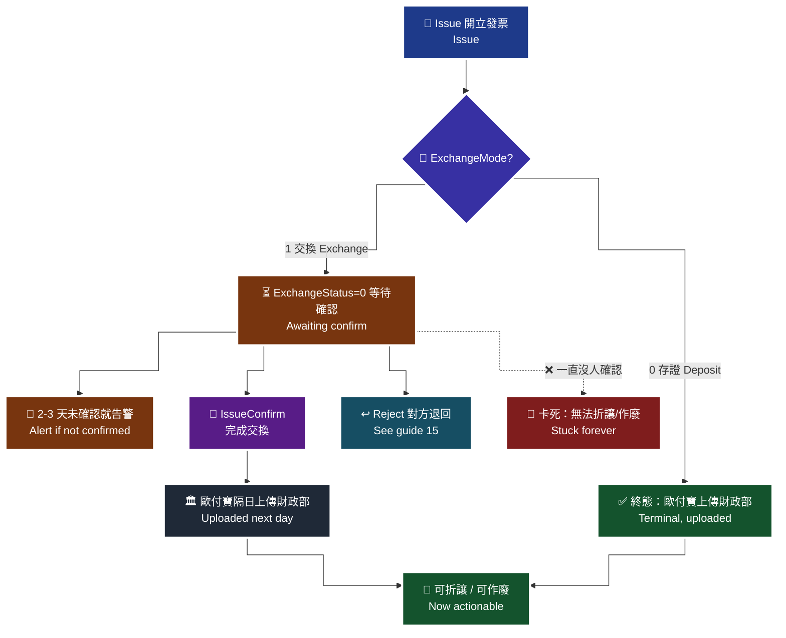

# 14 · B2B 開立與確認 — 只開立不確認 = 半套整合

**核心觀念：交換模式下只做 `Issue` 不做 `IssueConfirm`，對方永遠停在「等待確認」。** 這是 B2B 最常見的半套整合，而且它不會報錯，只會安靜地卡住。

> **對應 API**：[`Issue`](../references/b2b-api-reference.md#5-開立發票--issue)、[`IssueConfirm`](../references/b2b-api-reference.md#6-開立發票確認--issueconfirm)
> **前置條件**：已完成交易對象維護（[`13-b2b-customer-notify.md`](13-b2b-customer-notify.md)）；字軌已設定並啟用（[`12-b2b-overview.md`](12-b2b-overview.md) §5）；已在財政部平台完成授權。

---

## 1. 🚨 半套整合長什麼樣子

```python
# ❌ 大多數 B2B 串接停在這裡
result = c.b2b_issue(...)
if result["RtnCode"] == 1:
    order.status = "invoiced"        # 看起來成功了
    return "開立成功"
```

**從你這一端看：** `RtnCode=1`、有發票號碼、日誌顯示成功、訂單狀態變成「已開發票」。**一切正常。**

**從對方那一端看：** 這張發票躺在「待確認」清單裡，**永遠不會消失**。他們的會計每個月都要問你一次「這張發票怎麼還沒完成」。

**從稅務端看：** 官方原文（i200 §7）：

> 交換模式注意事項：需等待交易相對人（營業人）確認後才完成交換，此時發票狀態為**已開立成功，屬於有效憑證，只是尚未完成交換**，**尚未完成交換的發票無法進行折讓、作廢等操作**。

也就是說：

| 你以為 | 實際 |
|---|---|
| 流程結束了 | 流程停在一半 |
| 可以折讓／作廢 | **不行**，要先完成交換 |
| 對方收到發票了 | 對方收到「待確認的發票」 |

> **為什麼這個 bug 特別難發現**：它沒有錯誤碼、沒有 log、沒有告警。你只會在幾個月後接到客戶會計的電話。而那時候你已經累積了幾百張卡住的發票。

---

## 2. 完整流程

> 🧭 **純文字重述（螢幕閱讀器友善）**：呼叫開立發票後，先看交易對象的模式。存證模式下開立成功即為終態，歐付寶會直接把資料上傳財政部，不需要任何確認動作。交換模式下開立成功只代表發票已產生且是有效憑證，狀態是等待交易相對人確認，此時無法折讓也無法作廢。接著有兩條路：一是由確認方呼叫開立發票確認完成交換，歐付寶會於隔日把確認訊息上傳財政部，發票才進入可折讓可作廢的狀態；二是對方發現內容錯誤而呼叫退回發票，走退回流程。你的系統必須主動追蹤「已開立但未確認」的發票，設定二到三天的逾時告警，因為 B2B 的上傳期限是 7 天，對方確認的時間也算在裡面。



> ♿ 配色遵循 [`docs/accessibility.md`](../docs/accessibility.md)：WCAG AAA 對比 ≥7:1、Okabe-Ito 色盲安全色盤、16px 字體、直角連線、圖示＋文字雙編碼。

---

## 3. `Issue` 參數

```python
res = c.b2b_issue(
    relate_number="B2B20260818001",   # 唯一值不可重複
    customer_identifier="12345675",   # 買方統編，必填
    inv_type="07",                    # "07" 一般稅額 / "08" 特種稅額
    tax_type="1",                     # 1 應稅 / 2 零稅率 / 3 免稅 / 4 特種應稅（B2B 無 9）
    items=[
        {"ItemSeq": 1, "ItemName": "顧問服務", "ItemCount": 1, "ItemWord": "式",
         "ItemPrice": 100000, "ItemAmount": 100000, "ItemTax": 5000},
    ],
    sales_amount=100000,   # 未稅銷售額
    tax_amount=5000,       # 營業稅額
    total_amount=105000,   # 必須 == SalesAmount + TaxAmount
)
```

### 3.1 金額規則（比 B2C 嚴格）

| 規則 | 原文 |
|---|---|
| `TotalAmount` = `SalesAmount` + `TaxAmount` | 「`TotalAmount` 需等於 `SalesAmount` + `TaxAmount`」 |
| `SalesAmount`、`TotalAmount` **不可有小數點且不可為 0** | i200 §7 |
| `Items[].ItemTax` **不會上傳財政部** | 「財政部無提供此參數格式，此處提供營業人**檢核**營業稅額合計 `TaxAmount` 用，不會上傳」 |
| 特種稅額發票 | `ItemTax` 與 `TaxAmount` **直接帶 0** |
| `ItemSeq` | `1`–`999`，**排序不可重複** |

> **為什麼 B2B 要分開帶 `SalesAmount` / `TaxAmount` / `TotalAmount`**：B2B 的買受人是營業人，稅額要**明確拆開**供對方申報進項稅額。B2C 沒有統編時稅金是含在總額裡不拆算的（`IIS_Tax_Amount` 回 `0`）。
>
> ⚠️ 錯誤訊息「商品稅額加總與營業稅額誤差超過 2 元」的處理（i200 §17 原文）：把各商品的 `ItemTax` 填入並調整，使 `ItemTax` 加總與 `TaxAmount` **誤差少於 2 元**。這是**四捨五入尾差**的容許範圍。

### 3.2 稅務欄位

| `TaxType` | 必填欄位 |
|:---:|---|
| `2` 零稅率 | `ClearanceMark`（`1` 非經海關／`2` 經海關）+ `ZeroTaxRateReason`（未帶預設 `71`） |
| `3` 免稅 | `SpecialTaxType` **必填 `8`** |
| `4` 特種應稅 | `SpecialTaxType` **必填 `1`–`8`** |

| `InvType` | 允許的 `TaxType` |
|:---:|---|
| `07` | `1` / `2` / `3` |
| `08` | `3` / `4` |

> 🚨 **B2B 不支援 `TaxType=9`（混稅）。** B2C 有（需申請核可），B2B 沒有。
> ⏰ **`ZeroTaxRateReason` 自民國 115 年 1 月 1 日起，`TaxType=2` 時必填**（或廠商後台必須設定以便程式抓取），否則**開立失敗**。舊程式在 2026 年初會突然開始失敗。

### 3.3 `InvoiceTime` 的建議

官方原文：

> `InvoiceTime` 參數有值時**僅接受過去 6 天內日期**，並注意**順時順號**；**建議不帶值**，系統會自動開立當下日期。

> **為什麼建議不帶值**：「順時順號」的意思是**發票號碼的順序必須與開立時間的順序一致**。自己帶時間就要自己保證這件事，一旦併發開立就很容易亂序。讓系統帶當下時間，順序自然正確。

---

## 4. `IssueConfirm`

```python
c.b2b_issue_confirm(invoice_number="AB20000001")
```

| 規則 | 說明 |
|---|---|
| 適用 | **交換模式** |
| 效果 | 完成交換，發票才能進行折讓、作廢 |
| 上傳 | 「歐付寶會於**隔日**將開立發票確認訊息上傳至財政部電子發票整合服務平台」 |

**誰該呼叫 `IssueConfirm`？** 是**接收方**（買方）確認收到並接受這張發票。

| 你的角色 | 你要做什麼 |
|---|---|
| 賣方（開票方） | `Issue`，然後**追蹤對方是否確認**；未確認要催 |
| 買方（收票方） | 收到發票後 `IssueConfirm`（或發現錯誤時 `Reject`） |
| 兩者皆是 | 兩邊流程都要做 |

> ⚠️ **不要假設「對方也用歐付寶所以會自動確認」。** 對方可能用別家加值中心、可能是人工在財政部平台處理、可能根本沒人負責。**追蹤機制是你自己的責任。**

---

## 5. 追蹤「等待確認」的發票

這是本文最重要的工程實作。

### 5.1 為什麼一定要主動追蹤

| 原因 | 說明 |
|---|---|
| **7 天上傳期限** | 對方確認的時間也算在裡面 |
| **無法折讓／作廢** | 卡住的發票如果需要更正，你什麼都做不了 |
| **沒有錯誤訊息** | 卡住是「安靜的」，不查就不知道 |

### 5.2 實作

```python
from datetime import datetime, timedelta

PENDING_ALERT_DAYS = 2      # 抓 2 天，不是 6 天 —— 留時間給人工催促

def scan_pending_confirmations(c, db):
    """每日排程：找出已開立但對方尚未確認的交換模式發票。"""
    rows = db.query(
        "SELECT invoice_number, invoice_date, issued_at FROM b2b_invoices "
        "WHERE exchange_mode = 1 AND exchange_status IS DISTINCT FROM 1"
    )
    for r in rows:
        detail = c.b2b_get_issue(
            invoice_category=0,                 # 0 = 銷項（你開給對方）
            invoice_number=r.invoice_number,
            invoice_date=r.invoice_date,
        )
        status = detail.get("ExchangeStatus")
        if status == 1:
            db.mark_confirmed(r.invoice_number)
            continue
        # 尚未確認：判斷是否已超過告警門檻
        if datetime.now() - r.issued_at > timedelta(days=PENDING_ALERT_DAYS):
            notify_event("b2b_pending_confirm", {
                "invoice": r.invoice_number,
                "days": (datetime.now() - r.issued_at).days,
                "message": "交換模式發票尚未被對方確認，距 7 天上傳期限剩餘時間有限",
            })
```

### 5.3 `ExchangeStatus` 的判讀

| `ExchangeMode` | `ExchangeStatus` | 意義 |
|:---:|:---:|---|
| `0` 存證 | `1` | **完成**（存證模式沒有 `0` 這個中間狀態） |
| `1` 交換 | `0` | 開立**等待確認** |
| `1` 交換 | `1` | 接收開立確認（完成） |
| 任一 | **空值** | **未設定 ≠ `0`** |

> 🚨 **空值不等於 `0`。** `if status == 0:` 與 `if not status:` 在這裡是**不同的結果**。空值代表「這個欄位沒有被設定」，用 falsy 判斷會把它當成「等待確認」，統計就會偏掉。
>
> 🚨 **存證模式下沒有 `0`。** 用同一套 if 判斷兩種模式會誤判。程式裡應該先分模式、再判狀態。

---

## 6. `RelateNumber` 與冪等

| 規則 | 說明 |
|---|---|
| **唯一值不可重覆使用** | i200 §7 |
| 用途 | 是 `GetIssue` / `GetIssueConfirm` 的查詢鍵之一 |

`GetIssueConfirm` 的查詢條件（i200 §17）：`InvoiceNumber` 與 `RelateNumber` **互為條件必填**——一個為空時另一個必須有值；`InvoiceNumber` 有值時 `InvoiceDate` 也必填。

冪等機制與 B2C 相同，見 [`22-idempotency-and-retry.md`](22-idempotency-and-retry.md)。**B2B 額外要注意：`IssueConfirm` 也是一個不該盲目重試的動作**——重複確認的行為官方文件沒有說明，timeout 時應該先用 `GetIssueConfirm` 查現況。

---

## 7. 開立前檢查清單

```
前提
[ ] 財政部平台已完成「授權歐付寶」
[ ] （交換模式）財政部平台已完成「由歐付寶接收」
[ ] 該交易對象已用 MaintainMerchantCustomerData 建檔
[ ] 該交易對象的 ExchangeMode 已確認
[ ] 字軌 InvoiceCategory=2 已設定並啟用（UseStatus=2）

資料
[ ] RelateNumber 唯一且由訂單穩定推導
[ ] CustomerIdentifier 已用 GetCompanyNameByTaxID 驗過
[ ] TotalAmount == SalesAmount + TaxAmount
[ ] SalesAmount / TotalAmount 為整數且非 0
[ ] Items[].ItemTax 加總與 TaxAmount 誤差 < 2 元
[ ] ItemSeq 在 1-999 且不重複
[ ] InvType 是字串 "07"/"08"，且與 TaxType 組合合法
[ ] TaxType=2 時 ClearanceMark 與 ZeroTaxRateReason 都有值
[ ] 沒有使用 TaxType=9（B2B 不支援）
[ ] InvoiceTime 建議不帶值

流程
[ ] 交換模式下，已規劃 IssueConfirm 的執行者與時機
[ ] 已建立「等待確認」的逾時掃描與告警（門檻 2-3 天）
[ ] Upload_Status=2 被當成終態失敗處理
```

---

### 常見錯誤

1. **只做 `Issue` 不做 `IssueConfirm`。** 對方永遠停在等待確認，發票無法折讓或作廢，而且**沒有任何錯誤訊息**。這是 B2B 最常見的半套整合。
2. **沒有追蹤「等待確認」的發票。** 7 天上傳期限包含對方確認的時間。要主動掃描並告警，門檻抓 2–3 天。
3. **用 `if not ExchangeStatus` 判斷未確認。** 空值（未設定）與 `0`（等待確認）是不同的狀態。
4. **用同一套邏輯判斷存證與交換的 `ExchangeStatus`。** 存證模式沒有 `0`，`1` 直接就是終態。
5. **`TotalAmount` 沒等於 `SalesAmount + TaxAmount`。** B2B 的金額檢核比 B2C 嚴格，這是硬性規則。
6. **在 B2B 用 `TaxType=9`。** B2B 不支援混稅，那是 B2C 才有（且需申請核可）。
