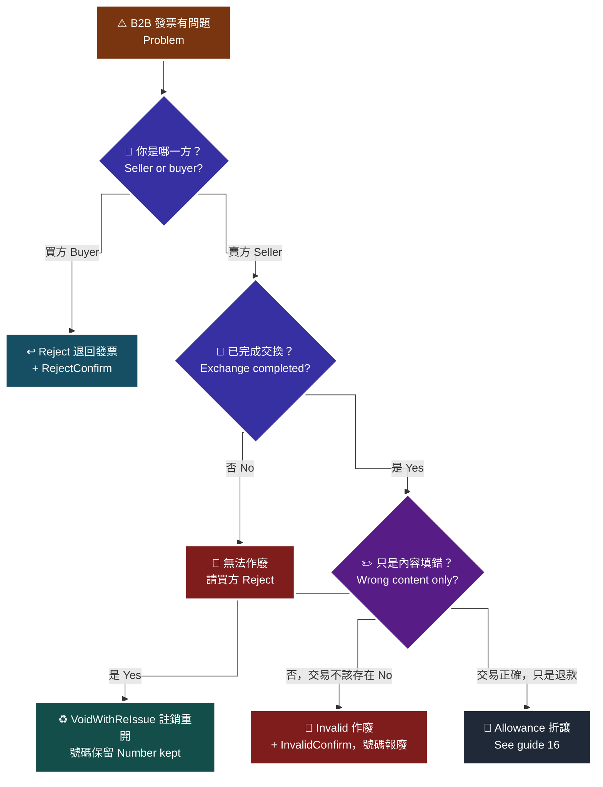

# 15 · B2B 作廢、退回與註銷重開 — 誰發起的差別

作廢（**賣方**發起）vs 退回（**買方**發起）是 B2B 特有的一組概念；註銷重開則與 B2C 一樣保留發票號碼。

> **對應 API**：[`Invalid`](../references/b2b-api-reference.md#7-作廢發票--invalid)、[`InvalidConfirm`](../references/b2b-api-reference.md#8-作廢發票確認--invalidconfirm)、[`Reject`](../references/b2b-api-reference.md#9-退回發票--reject)、[`RejectConfirm`](../references/b2b-api-reference.md#10-退回發票確認--rejectconfirm)、[`VoidWithReIssue`](../references/b2b-api-reference.md#15-註銷重開--voidwithreissue)
> **前置條件**：交換模式下，發票**必須已完成交換**才能作廢（「尚未完成交換的發票無法進行折讓、作廢等操作」）。存證模式下須先與交易相對人**達成合意**。

---

## 1. 作廢 vs 退回：誰發起

| 面向 | `Invalid` 作廢 | `Reject` 退回 |
|---|---|---|
| **誰發起** | **賣方**（開票方） | **買方**（收票方） |
| 什麼情況 | 賣方自己發現這張發票不該存在 | 買方收到發票後發現**內容錯誤**（數量、單價、品名），**拒絕確認／接受** |
| 時點 | 發票已完成交換之後 | 發票**尚在等待確認**時 |
| 對應確認 | `InvalidConfirm` | `RejectConfirm` |
| 發票號碼 | 報廢 | 報廢 |

官方原文（i200 §11）：

> 退回適用於**買方收到發票訊息後發現內容錯誤**（如數量、單價或品名錯誤），**拒絕確認／接受此發票訊息時**使用。

> **為什麼 B2C 沒有「退回」**：B2C 的買受人是消費者，沒有「確認接受發票」這個動作。B2B 的雙方都是營業人，發票是雙向的憑證交換，所以買方有拒絕的權利。

---

## 2. 決策圖

> 🧭 **純文字重述（螢幕閱讀器友善）**：發現 B2B 發票有問題時，先問你是賣方還是買方。如果你是買方，且這張發票還停在等待確認狀態，正確做法是呼叫退回發票，並由對應方做退回確認。如果你是賣方，先問這張發票是否已完成交換。尚未完成交換的發票無法作廢，只能請買方退回。已完成交換的發票，再問是內容填錯還是這筆交易根本不該有發票：內容填錯應該用註銷重開，發票號碼會保留；交易不該存在則用作廢發票，並在交換模式下由對應方做作廢確認，號碼報廢。第三種情況是交易存在、發票也正確，只是事後要退款，那是折讓，見指南 16。



> ♿ 配色遵循 [`docs/accessibility.md`](../docs/accessibility.md)：WCAG AAA 對比 ≥7:1、Okabe-Ito 色盲安全色盤、16px 字體、直角連線、圖示＋文字雙編碼。

---

## 3. `Invalid` / `InvalidConfirm`

```python
c.b2b_invalid(invoice_number="AB20000001", invoice_date="2026-08-18",
              reason="重複開立（原發票 AB20000000）")
# 交換模式下由對應方確認
c.b2b_invalid_confirm(invoice_number="AB20000001", invoice_date="2026-08-18")
```

| 規則 | 原文 |
|---|---|
| 交換模式需對方確認才完成 | 「根據財政部規定，需等待交易相對人（營業人）確認後才完成交換，**否則不屬於有效憑證**」 |
| 存證模式須先合意 | 「存證模式下，特店須**先與交易相對人達成合意後**再送出作廢」 |
| 上傳時機 | 「歐付寶會於**隔日**將發票作廢後上傳至財政部」 |
| 前提 | **尚未完成交換的發票無法作廢** |

> ⚠️ **「須先與交易相對人達成合意」是業務流程，不是 API 參數。** 程式無法驗證你有沒有跟對方講過。這代表**作廢的 UI 上應該有一個「已與對方確認」的勾選框 + 記錄操作者**，作為內部稽核依據。

---

## 4. `Reject` / `RejectConfirm`

```python
c.b2b_reject(invoice_number="AB20000001", invoice_date="2026-08-18",
             reason="品名與實際交付不符")
c.b2b_reject_confirm(invoice_number="AB20000001", invoice_date="2026-08-18")
```

| 規則 | 原文 |
|---|---|
| 存證模式須先合意 | 「存證模式下，特店須先與交易相對人達成合意後再送出退回」 |
| 上傳時機 | 「歐付寶於**隔日**將發票退回資料上傳至財政部」 |
| 確認後的通知 | 「確認完成後，歐付寶會**依發送通知 API 設定**通知交易相對人電子發票退回已完成確認」 |

### 4.1 你是賣方時，要能處理「被退回」

**這是很多整合會漏掉的一半。** 你的系統必須：

| 要做的事 | 怎麼做 |
|---|---|
| 知道發票被退回了 | 排程用 [`GetReject`](../references/b2b-api-reference.md#20-查詢退回發票--getreject) 查，或看 `Issue_Status` |
| 通知內部 | 推播到工作群組（[`25`](25-telegram-bot.md)／[`26`](26-discord-bot.md)） |
| 更正並重開 | 用**新的** `RelateNumber` 重新 `Issue` |

> ⚠️ **`Issue_Status` 的 `0` 在 B2B 是「發票退回」**，在 B2C 是「發票註銷」。跨系統對照時不要共用常數，見 [`enums.md` §10.7](../references/enums.md#107-️-issue_status-的-0--b2b-是退回b2c-是註銷)。
>
> **為什麼一定要主動查**：被退回是**對方發起**的動作，你不會收到 API 呼叫。如果沒有排程掃描，你會以為發票開好了，直到對方來問「我退回的那張什麼時候重開」。

---

## 5. `VoidWithReIssue` 註銷重開

與 B2C 一樣：**保留發票號碼，重新填內容**。

| 不可更改的欄位 | 原文 |
|---|---|
| 發票號碼 | 「`VoidModel.InvoiceNumber` 需為**原發票號碼**」 |
| 開立時間 | 「`IssueModel.InvoiceTime` 需為**先前開立發票的時間**」 |
| 自訂編號 | 「`IssueModel.RelateNumber` 須為唯一值不可重複，**請帶入原發票自訂編號**；僅限中文、英文、數字」 |

```python
c.b2b_void_with_re_issue(
    void_model={"InvoiceNumber": "AB20000001", "InvoiceDate": "2026-08-18",
                "Reason": "買受人統編錯誤"},
    issue_model={
        "RelateNumber": "B2B20260818001",   # 原自訂編號
        "InvoiceTime": "2026-08-18 14:30:00",  # 原開立時間
        "CustomerIdentifier": "12345675",
        "InvType": "07", "TaxType": "1",
        "SalesAmount": 100000, "TaxAmount": 5000, "TotalAmount": 105000,
        "Items": [...],
    },
)
```

| 額外規則 | 說明 |
|---|---|
| 商品最多 **999 項** | `ItemSeq` `1`–`999` 且不可重複 |
| 稅額誤差 | 收到「商品稅額加總與營業稅額誤差超過 2 元」時，調整各商品 `ItemTax` 使誤差 < 2 元 |
| 零稅率 | `ClearanceMark` 必填；`ZeroTaxRateReason` **自民國 115 年 1 月 1 日起必填** |
| 回傳處理 | 「回傳 Data 需**先進行 AES 解密後再做 urldecode**」 |

> **選作廢還是註銷重開**：判準與 B2C 完全一樣——**交易存在但內容錯 → 註銷重開（號碼保留）；交易不該存在 → 作廢（號碼報廢）**。見 [`06-b2c-invalid-void.md`](06-b2c-invalid-void.md) §2。

---

## 6. 不可逆操作的防護

`Invalid`、`Reject`、`VoidWithReIssue` 都是**不可逆**且會產生稅務紀錄的動作。

| 防護 | 為什麼 |
|---|---|
| 二次確認（一次性驗證碼） | 避免誤點與腳本誤觸 |
| Audit log（操作者、時間、發票號碼、原因、結果） | 稽核與事後追查 |
| **禁止自動重試** | timeout 不代表沒成功 |
| timeout 後**先查再決定** | 用 `GetInvalid` / `GetReject` 確認現況 |
| 存證模式加「已與對方合意」勾選 | 官方要求的業務前提，程式無法驗證 |

參考實作：[`templates/telegram-bot/bot.py`](../templates/telegram-bot/bot.py) 的 `create_pending()` / `take_pending()` / `write_audit()`。

---

### 常見錯誤

1. **賣方想作廢一張「尚未完成交換」的發票。** 做不到。尚未完成交換的發票無法折讓、作廢，只能請買方 `Reject`。
2. **只做 `Invalid` 不做 `InvalidConfirm`。** 交換模式下作廢沒有完成，官方原文：「否則**不屬於有效憑證**」。
3. **沒有處理「被退回」的情境。** 退回是對方發起的，你不會收到通知。必須排程用 `GetReject` 掃描。
4. **把 B2B 的 `Issue_Status=0`（退回）當成 B2C 的（註銷）。** 語意不同，統計與流程都會錯。
5. **註銷重開時改了 `RelateNumber` 或 `InvoiceTime`。** 兩者都必須沿用原發票的值。
6. **存證模式下沒跟對方合意就作廢。** 官方明訂的前提。程式擋不住，要靠流程與 audit log。
