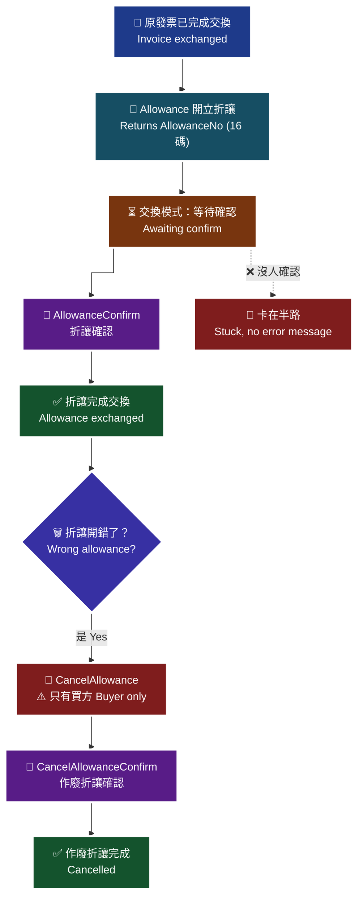

# 16 · B2B 折讓與作廢折讓

`Allowance`/`AllowanceConfirm` 與 `CancelAllowance`/`CancelAllowanceConfirm` 的成對規則，以及「只有買方能作廢折讓」這條財政部規定。

> **對應 API**：[`Allowance`](../references/b2b-api-reference.md#11-開立折讓發票--allowance)、[`AllowanceConfirm`](../references/b2b-api-reference.md#12-折讓發票確認--allowanceconfirm)、[`CancelAllowance`](../references/b2b-api-reference.md#13-作廢折讓發票--cancelallowance)、[`CancelAllowanceConfirm`](../references/b2b-api-reference.md#14-作廢折讓發票確認--cancelallowanceconfirm)
> **前置條件**：原發票**已完成交換**（交換模式下尚未完成交換的發票無法折讓）；已知原發票號碼與明細。

---

## 1. 四支 API 的成對關係

| 動作 | 開立 | 確認 | 誰可以發起 |
|---|---|---|---|
| 折讓 | `Allowance` | `AllowanceConfirm` | 買方或賣方 |
| 作廢折讓 | `CancelAllowance` | `CancelAllowanceConfirm` | 🚨 **只有買方** |

> 🚨 **「只有買方可以上傳作廢折讓」是財政部規定**（i200 §13、§24 原文）。賣方送出會失敗。存證模式下，賣方以 `InvoiceTag=5`（作廢折讓通知）發送通知也會收到「買/賣方錯誤」，官方解釋其實際意義是「**無須再另行通知給作廢折讓開立方**」——這是預期行為，不是故障。

---

## 2. 為什麼賣方也可以開折讓

官方原文（i200 §11 交換模式注意事項）：

> 【交換模式】1. 由**賣方開立折讓的目的是為了避免買方開立折讓單填寫**。

也就是說：折讓單本來是買方要填的，但賣方主動開可以省去買方的作業。這是**服務性質的設計**，不是規則的例外。

> **實務意義**：如果你是賣方，主動開折讓會讓客戶的會計輕鬆很多，是加分項。但**作廢折讓就不行**——那條是硬規定。

---

## 3. 流程

> 🧭 **純文字重述（螢幕閱讀器友善）**：需要折讓時，先確認原發票在交換模式下已完成交換，尚未完成交換的發票不能折讓。接著呼叫開立折讓發票，帶入營業稅額、折讓總額與明細，回傳一組固定 16 碼的折讓編號要保存下來。在交換模式下，折讓開立成功只代表折讓已產生、屬於有效憑證，但尚未完成交換，必須由對應方呼叫折讓發票確認才算完成。若折讓本身開錯了要作廢，只有買方可以呼叫作廢折讓發票，並由對應方做作廢折讓確認。整條鏈路上每一個確認動作沒做，狀態就會停在半路，而且不會有錯誤訊息。



> ♿ 配色遵循 [`docs/accessibility.md`](../docs/accessibility.md)：WCAG AAA 對比 ≥7:1、Okabe-Ito 色盲安全色盤、16px 字體、直角連線、圖示＋文字雙編碼。

---

## 4. `Allowance` 參數與規則

```python
res = c.b2b_allowance(
    tax_amount=500,
    total_amount=10500,
    details=[
        {"InvoiceNumber": "AB20000001", "InvoiceDate": "2026-08-18",
         "ItemSeq": 1, "ItemName": "顧問服務", "ItemCount": 1,
         "ItemWord": "式", "ItemPrice": 10000, "ItemAmount": 10000, "Tax": 500},
    ],
    AllowanceDate="2026-08-25",     # 選填，僅接受 6 天內日期
)
allowance_no = res["AllowanceNo"]   # 固定 16 碼，務必保存
```

| 規則 | 原文 |
|---|---|
| `AllowanceDate` | 「參數有值時，**僅接受 6 天內日期**，沒有值則會開立當下日期」 |
| `TotalAmount` | 「金額**不可為 0 元**，且需等於每張發票折讓的商品金額 `ItemAmount` 加總後**四捨五入至整數**的值」 |
| `Details[].ItemCount` / `ItemPrice` | 「**不可超過原發票商品開立的數量與價格**」 |
| `Details[].ItemName` | 「需與**原發票號碼排序的對應商品名稱相同**」 |
| `TaxAmount` / `Details[].Tax` | 「如發票**僅含特種稅額請直接帶 0**」 |
| `AllowanceNo` | 長度**固定 16 碼** |

> 🚨 **`ItemName` 必須與原發票完全相同**，這是最容易踩的一條。如果你的商品名稱在資料庫裡被改過（例如加了「(已停售)」後綴），折讓就會失敗。
>
> **正確做法**：折讓時**不要從商品主檔取名稱，要從原發票的明細取**。用 [`GetIssue`](../references/b2b-api-reference.md#16-查詢發票--getissue) 查回原發票，直接沿用其 `ItemName`。

```python
# 折讓明細一律從原發票取，不要從商品主檔取
original = c.b2b_get_issue(invoice_category=0, invoice_number=inv_no, invoice_date=inv_date)
details = [
    {"InvoiceNumber": inv_no, "InvoiceDate": inv_date,
     "ItemSeq": it["ItemSeq"], "ItemName": it["ItemName"],   # ← 沿用原發票
     "ItemCount": refund_count, "ItemWord": it["ItemWord"],
     "ItemPrice": it["ItemPrice"], "ItemAmount": refund_amount, "Tax": refund_tax}
    for it in original["Items"] if it["ItemSeq"] == target_seq
]
```

---

## 5. `AllowanceConfirm`

```python
c.b2b_allowance_confirm(allowance_no="1909181313013546")   # 16 碼
```

| 規則 | 說明 |
|---|---|
| 適用 | **交換模式**（買方/賣方折讓確認） |
| 效果 | 「需完成折讓確認後才完成發票折讓交換」 |
| `AllowanceNo` 來源 | `Allowance` 回傳的 `AllowanceNo` |

> ⚠️ 官方文件註記：「原文未針對本 API 列出 `RtnCode` 的完整狀態碼列舉，僅載明『1 為成功，其餘為失敗』。」——不要自行編造錯誤碼，把 `RtnCode` / `RtnMsg` 原樣存起來，見 [`error-handling.md` §0](../references/error-handling.md)。

---

## 6. `CancelAllowance` / `CancelAllowanceConfirm`

```python
c.b2b_cancel_allowance(allowance_no="1909181313013546", reason="折讓金額計算錯誤")
c.b2b_cancel_allowance_confirm(allowance_no="1909181313013546")
```

| 規則 | 原文 |
|---|---|
| 🚨 **只有買方可以上傳** | 「【交換模式】2. 根據財政部規定，**只有買方可以上傳作廢折讓發票**」 |
| 作廢的是折讓，不是發票 | 「本功能作廢的是發票的**折讓部分**，不是整張發票作廢」 |
| 交換模式需確認 | 「需等待交易相對人（營業人）確認後才完成交換，否則不屬於有效憑證」 |
| 前提 | 「發票若已被折讓過，無法直接作廢發票，請先確認該發票所開立的折讓單**是否全部已作廢**」 |

> **順序提醒**：想作廢**整張發票**時，必須先把該發票的**所有折讓單都作廢**，才能作廢發票。與 B2C 相同，見 [`06-b2c-invalid-void.md`](06-b2c-invalid-void.md) §6。

---

## 7. 查詢與追蹤

| 要查什麼 | 用哪支 | 查詢鍵 |
|---|---|---|
| 折讓內容 | [`GetAllowance`](../references/b2b-api-reference.md#22-查詢折讓發票--getallowance) | `AllowanceNo`（16 碼，**唯一查詢鍵**） |
| 折讓確認狀態 | [`GetAllowanceConfirm`](../references/b2b-api-reference.md#23-查詢折讓發票確認--getallowanceconfirm) | 同上 |
| 作廢折讓 | [`GetAllowanceInvalid`](../references/b2b-api-reference.md#24-查詢作廢折讓發票--getallowanceinvalid) | 同上 |
| 作廢折讓確認 | [`GetAllowanceInvalidConfirm`](../references/b2b-api-reference.md#25-查詢作廢折讓發票確認--getallowanceinvalidconfirm) | 同上 |

> ⚠️ 這四支的**唯一查詢鍵都是 `AllowanceNo`**。如果沒把它存下來，你就查不到這筆折讓。**`Allowance` 回傳後第一件事就是存 `AllowanceNo`。**
>
> ⚠️ 官方文件註記：這幾支的傳入 Data **並無 `InvoiceCategory` 參數**，但回傳欄位說明多處以 `[InvoiceCategory]` 的值決定是否為空值。原文未明確說明此值如何判定，介接前請向歐付寶確認。
>
> ⚠️ `GetAllowanceInvalid` 回傳的買賣方統編欄位名是 **`BuyerId` / `SellerId`**，與其他查詢 API 的 `Buyer_Identifier` / `Seller_Identifier` **不同**，請勿混用。

同樣需要「等待確認」的逾時掃描，做法見 [`14-b2b-issue.md`](14-b2b-issue.md) §5。

---

### 常見錯誤

1. **賣方去作廢折讓。** 財政部規定**只有買方可以上傳作廢折讓**，賣方送出會失敗。
2. **折讓的 `ItemName` 從商品主檔取。** 必須與**原發票**的商品名稱完全相同。商品改名過就會失敗。
3. **沒保存 `AllowanceNo`。** 四支查詢 API 的唯一查詢鍵就是它，弄丟就查不到。
4. **只做 `Allowance` 不做 `AllowanceConfirm`。** 交換模式下折讓沒有完成交換。
5. **折讓數量或單價超過原發票。** 官方明訂「不可超過原發票商品開立的數量與價格」。
6. **`TotalAmount` 沒有等於明細加總四捨五入的整數。** 這是硬性檢核。
