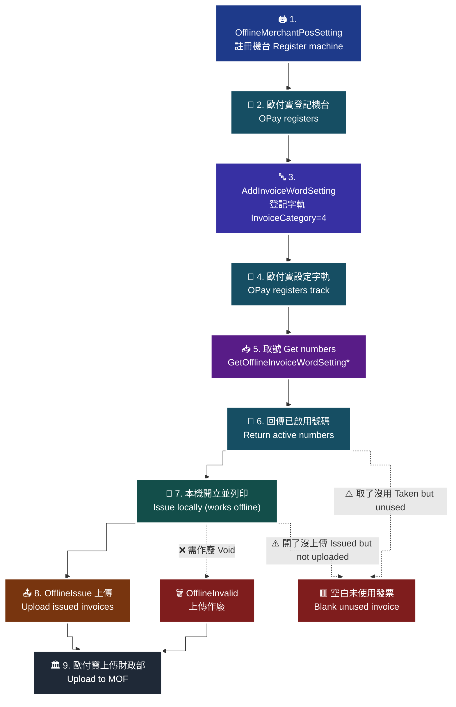

# 18 · 離線電子發票 — 註冊機台 → 取號 → 本機開立 → 上傳

**核心觀念：取了號就要負責。取而不用會變成空白未使用發票。** 離線發票把「號碼配發」與「發票開立」拆成兩件事，這個拆分帶來了斷網可開立的能力，也帶來了對帳責任。

> **對應 API**（12 支全涵蓋）：[`GetOfflineMerchantInfo`](../references/offline-api-reference.md#1-查詢特店基本資料--getofflinemerchantinfo)、[`GetGovInvoiceWordSetting`](../references/offline-api-reference.md#2-查詢財政部配號結果--getgovinvoicewordsetting)、[`OfflineMerchantPosSetting`](../references/offline-api-reference.md#3-管理發票機台--offlinemerchantpossetting)、[`QueryOfflineMerchantPosSetting`](../references/offline-api-reference.md#4-查詢發票機台--queryofflinemerchantpossetting)、[`AddInvoiceWordSetting`](../references/offline-api-reference.md#5-字軌與配號設定--addinvoicewordsetting)、[`UpdateInvoiceWordStatus`](../references/offline-api-reference.md#6-設定字軌號碼狀態--updateinvoicewordstatus)、[`GetOfflineInvoiceWordSettingWithAutoSplit`](../references/offline-api-reference.md#7-取得自動配發發票字軌號碼--getofflineinvoicewordsettingwithautosplit)、[`GetOfflineInvoiceWordSetting`](../references/offline-api-reference.md#8-取得發票字軌號碼區間--getofflineinvoicewordsetting)、[`GetOfflineInvoiceWordSettingNumber`](../references/offline-api-reference.md#9-取得發票字軌號碼依數量含隨機碼加密資料--getofflineinvoicewordsettingnumber)、[`OfflineIssue`](../references/offline-api-reference.md#10-上傳開立發票--offlineissue)、[`OfflineInvalid`](../references/offline-api-reference.md#11-上傳作廢發票--offlineinvalid)、[`GetInvoiceWordSetting`](../references/offline-api-reference.md#12-查詢字軌--getinvoicewordsetting)
> **前置條件**：已向歐付寶申請離線電子發票服務；已完成財政部配號。**所有 API 路徑前綴都是 `/B2CInvoice`（不是 `/OfflineInvoice`）。**

---

## 1. 離線發票與一般 B2C 的差別

| 面向 | 一般 B2C（`Issue`） | 離線（`OfflineIssue`） |
|---|---|---|
| 發票號碼從哪來 | 歐付寶開立時**即時配發** | **特店先向歐付寶取號**，本機開立時使用 |
| 開立時機 | 呼叫 API 當下 | **本機先開立**，事後上傳 |
| **斷網可否開立** | ❌ | ✅ **這是離線發票存在的理由** |
| 機台管理 | 無 | 需先註冊機台，每張發票帶 `MachineID` |
| 隨機碼 | 歐付寶產生 | **特店自己產生**，且有規則 |
| 路徑前綴 | `/B2CInvoice` | **同樣是 `/B2CInvoice`** |

> **為什麼要用離線發票**：門市 POS 不能因為網路斷線就無法結帳。離線發票讓你**預先把號碼拿到手**，斷網時照樣開立、照樣列印，等網路恢復再上傳。

---

## 2. 完整流程（官方 9 步）

> 🧭 **純文字重述（螢幕閱讀器友善）**：離線電子發票的完整流程共 9 步，角色在特店與歐付寶之間交替。第 1 步特店呼叫管理發票機台設定機台 ID。第 2 步歐付寶登記機台。第 3 步特店取得財政部配號結果後，呼叫字軌與配號設定登記字軌區間。第 4 步歐付寶設定字軌。第 5 步開立發票前，特店呼叫取號 API 取得已啟用的字軌號碼。第 6 步歐付寶回傳號碼。第 7 步特店在自家機台以取得的號碼開立發票並列印。第 8 步特店呼叫上傳開立發票把資料送回歐付寶。第 9 步歐付寶把資料上傳財政部。若需作廢，特店另呼叫上傳作廢發票。整條鏈路最關鍵的一點是：第 5 步取到的號碼一旦離開歐付寶就被視為已配發，第 7 步沒用到、或第 8 步沒上傳，那些號碼都會在財政部端變成空白未使用發票。



> ♿ 配色遵循 [`docs/accessibility.md`](../docs/accessibility.md)：WCAG AAA 對比 ≥7:1、Okabe-Ito 色盲安全色盤、16px 字體、直角連線、圖示＋文字雙編碼。

---

## 3. 步驟一：機台管理

```python
# 先確認特店基本資料（名稱與統編），確保打對環境
info = c.get_offline_merchant_info()
print(info["MerchantName"], info["MerchantIdentifier"])

# 註冊機台（ActionType：1 新增 / 2 修改 / 3 刪除 —— 注意是「數字」）
c.offline_merchant_pos_setting(action_type=1, machine_id="POS-A01")

# 查詢已註冊的機台（含廠商後台設定的）
c.query_offline_merchant_pos_setting()
```

| 規則 | 原文 | 影響 |
|---|---|---|
| **設定字軌前必須先設定機台** | i301 §7 | 順序反了字軌設定會失敗 |
| `MachineID` 已設定過字軌配號後**無法修改與刪除** | i301 §7 | 🚨 命名要一次想清楚 |
| **請勿使用特殊符號**作為機台 ID | i301 §7 | — |
| 機台來源含「API」與「廠商後台」兩種 | i301 §8 | 查詢時兩者都會出現 |

> 🚨 **機台命名是一次性決定。** 綁過字軌之後就改不掉也刪不掉。用 `POS-A01`、`STORE01-POS02` 這種**能長期使用的結構化命名**，不要用「測試」「temp」「新機台」。
>
> ⚠️ 離線的 `ActionType` 是**數字 `1`/`2`/`3`**；B2B 交易對象維護的 `Action` 是**英文字串** `Add`/`Update`/`Delete`。功能等價但型態完全不同，不要共用同一個 enum，見 [`enums.md` §10.8](../references/enums.md#108-️-actionb2b-字串vs-actiontype離線-數字)。

---

## 4. 步驟二：字軌設定

```python
gov = c.offline_get_gov_invoice_word_setting(invoice_year="115")   # 查財政部配號

added = c.offline_add_invoice_word_setting(
    invoice_term=1, invoice_year="115", inv_type="07",
    invoice_category="4",        # ← 離線固定 4（B2C=1、B2B=2）
    invoice_header="AC",
    invoice_start="30000000",    # 尾數 00 或 50
    invoice_end="30000049",      # 尾數 49 或 99
    machine_id="POS-A01",        # ← 離線多了這個
)
```

| 差異 | 離線 |
|---|---|
| `InvoiceCategory` | **固定 `4`** |
| 多帶 `MachineID` | 字軌是**綁在機台上**的 |
| 新增後狀態 | 「已審核通過**且會自動啟用一組字軌**」（**與 B2C/B2B 不同**） |

> ⚠️ **離線的預設行為與 B2C/B2B 不同**：B2C/B2B 新增後是「未啟用」，離線則「**會自動啟用一組**」。但只會自動啟用**一組**——其他組仍需手動啟用。**設定後務必用 `GetInvoiceWordSetting` 確認實際狀態，不要假設。**

```python
c.offline_update_invoice_word_status(track_id=added["TrackID"], invoice_status=2)  # 2=啟用
c.offline_get_invoice_word_setting(invoice_year="115", invoice_term=0,
                                   use_status=0, invoice_category=4)
```

### 4.1 🚨 三套 `InvoiceStatus` 不要混用

| 出現在 | 值域 |
|---|---|
| `UpdateInvoiceWordStatus`（設定） | `0` 停用（**不可逆**）／`1` 暫停／`2` 啟用 |
| `GetOfflineInvoiceWordSetting*`（取號） | `1` **啟用**／`2` **備用字軌** |
| `GetInvoiceWordSetting` 的 `UseStatus`（查詢） | `1` 未啟用／`2` 使用中／`3` 已停用／`4` 暫停中／`5` 待審核／`6` 審核不通過 |

> 官方文件在 i301 §10 特別用粗體提醒這三者「**請勿混用**」。取號時送 `InvoiceStatus=2` 是要「備用字軌」，不是「啟用中的字軌」——這個誤解會讓你取到完全不同的號碼區間。

---

## 5. 步驟三：取號（三支擇一）

| API | 回傳 | 什麼時候用 |
|---|---|---|
| `GetOfflineInvoiceWordSetting` | 號碼**區間**（`InvoiceHeader`/`InvoiceStart`/`InvoiceEnd`） | 機台能**自己產生 QR Code 所需的 AES 加密資料** |
| `GetOfflineInvoiceWordSettingNumber` | 號碼**清單**（每筆含 `InvoiceNo`、`RandomNumber`、`EncryptData`）+ `Times` | 🔑 機台**無法自行產生 AES 加密資料時，必須用這支** |
| `GetOfflineInvoiceWordSettingWithAutoSplit` | 區間，來源是**廠商後台設定的自動配號** | 已在後台設好自動配號規則 |

官方原文：「歐付寶提供兩支取得發票字軌號碼 API，功能相同但回傳內容有些許差異，**特店請選擇其中一種方式串接即可**。」

```python
# 情況 A：機台能自己壓 QR Code
r = c.get_offline_invoice_word_setting(invoice_year="115", invoice_term=1,
                                       invoice_status=1, machine_id="POS-A01")
# r: InvoiceHeader / InvoiceStart / InvoiceEnd

# 情況 B：機台不能自己壓 QR Code（多數 POS）
r = c.get_offline_invoice_word_setting_number(invoice_year="115", invoice_term=1,
                                              invoice_status=1, machine_id="POS-A01")
# r: InvoiceInfo[].InvoiceNo / RandomNumber / EncryptData, Times
```

| 規則 | 原文 |
|---|---|
| `EncryptData` 是什麼 | 「**發票號碼 10 碼 + 隨機碼 4 碼**以字串方式合併後使用 AES 加密並採用 Base64 編碼轉換」（String(24)） |
| 重複取號 | 「相同的發票字軌如果重覆取號，**會回傳不同的隨機碼**」 |
| `Times` | 「相同的發票字軌，**已取用的次數**」 |
| ⚠️ 隨機碼 | 「上傳開立發票時，請上傳**實際開立發票**所使用的隨機碼；本 API 提供的隨機碼**僅供參考使用**」 |

> ⚠️ **官方文件的已知空白**（原文照錄）：`GetOfflineInvoiceWordSettingWithAutoSplit` 的自動配號**切分規則（每次配發幾號、是否可重複取號、取完後的行為）原文未說明**；`GetOfflineInvoiceWordSettingNumber` 雖名為「依數量」，但**傳入參數表沒有任何指定筆數的參數**，也未說明單次回傳上限。**介接前請向歐付寶確認。**
>
> 這代表你**不能假設**「呼叫一次會拿到 N 個號碼」。程式必須以實際回傳的清單長度為準，並記錄下來。

---

## 6. 🚨 核心觀念：取了號就要負責

號碼一旦離開歐付寶，就被視為**已配發給該機台**。

| 情況 | 結果 |
|---|---|
| 取了號、開了票、上傳了 | ✅ 正常 |
| 取了號、**沒開票** | 🟥 財政部端變成**空白未使用發票** |
| 取了號、開了票、**沒上傳** | 🟥 同上，且你手上有一張財政部不知道的紙本發票 |
| 取了號、機台壞掉了 | 🟥 那些號碼是**掉號**，要走空白未使用發票流程 |

官方原文（i301 §2 開頭）：

> **取號後就要負責**：號碼一旦取走即被視為已配發給該機台。取了不用、或用了不上傳，都會在財政部端造成「空白未使用發票」，需另行透過 B2C 的 `QueryBlankInvoiceList` / `DownLoadBlankInvList` 處理。

### 6.1 工程上怎麼做

**規則一：取號要「剛剛好」，不要囤號。**

```python
# ❌ 一次取一大批「以備不時之需」
numbers = fetch_numbers(count=10000)   # 用不完的全部變空白未使用發票

# ✅ 依實際用量分批取，並設低水位補號
LOW_WATER_MARK = 200      # 剩 200 個就補
BATCH_TARGET   = 500      # 每次補到 500 個
```

> **為什麼不能囤**：囤號沒有任何好處（斷網時你用的是**已經取好的**號碼，多囤 10 倍不會更耐斷），但期末結算時要處理的空白未使用發票會多 10 倍。**取號量應該對應「最長預期斷網時間 × 尖峰開立速率 × 安全係數」**，不是「越多越安心」。

**規則二：本機要有號碼台帳。**

| 欄位 | 用途 |
|---|---|
| `invoice_no` | 號碼本身 |
| `machine_id` | 哪台機器取的 |
| `random_number` | **實際開立時使用的**隨機碼 |
| `status` | `FETCHED` / `ISSUED` / `UPLOADED` / `VOIDED` / `ABANDONED` |
| `fetched_at` / `issued_at` / `uploaded_at` | 時間戳 |
| `relate_number` | 對應的訂單編號 |

> **為什麼一定要有台帳**：離線發票的「已配發但未上傳」狀態**只存在於你的機台裡**，歐付寶不知道。台帳是唯一能回答「哪些號碼還在路上」的資料來源。沒有台帳，期末結算時你根本不知道要申報哪些號碼。

---

## 7. 步驟四：本機開立與隨機碼

隨機碼（`RandomNumber`）是**電子發票證明聯內的 4 位數字**，由你的機台產生。官方規則（i301 §13）：

| 規則 | 原文 |
|---|---|
| **只限數字** | 「隨機碼只限使用數字」 |
| **不可使用流水號** | 「不可使用流水號」 |
| 建議規則 | 「每開立**一萬張**發票不可重覆，開立下一萬張票的隨機碼出現的**次序不可重覆**」 |
| 上傳時 | 上傳**實際開立**所用的隨機碼，取號 API 給的僅供參考 |

```python
import random

class RandomNumberPool:
    """每一萬張為一輪，輪內不重複，且輪與輪之間出現次序不同。"""
    def __init__(self) -> None:
        self._pool: list[str] = []

    def next(self) -> str:
        if not self._pool:
            # 0000-9999 共一萬個，洗牌後逐一取用 → 輪內不重複、次序每輪不同
            self._pool = [f"{n:04d}" for n in range(10000)]
            random.SystemRandom().shuffle(self._pool)
        return self._pool.pop()
```

> **為什麼「不可使用流水號」**：隨機碼的用途是防止發票被偽造與被猜測。流水號可以被預測，等於沒有隨機性。這不是建議，是官方明訂的規則。

---

## 8. 步驟五：上傳

```python
c.offline_issue(
    machine_id="POS-A01",
    invoice_no="AC30000000",        # 10 碼：2 碼字軌 + 8 碼號碼
    invoice_date="2026-08-18 14:30:00",
    relate_number="POS-A01-20260818-0001",   # 唯一、不可用特殊符號
    tax_type="1",
    sales_amount=105,
    inv_type="07",
    random_number="4821",           # ← 實際開立時用的那一組
    items=[{"ItemSeq": 1, "ItemName": "美式咖啡", "ItemCount": 1,
            "ItemWord": "杯", "ItemPrice": 105, "ItemAmount": 105}],
    print_mark="1",
    donation="0",
)
```

| 規則 | 原文 |
|---|---|
| **上傳期限** | 「上傳發票的發票開立時間，**不可超過下一期的 15 號**。範例：當年 9-10 月的發票，不可超過當年 11 月 15 號上傳」 |
| 開立時間 | 「`InvoiceDate` 的發票開立時間**不可大於當下上傳發票的時間**」 |
| `RelateNumber` | 唯一值不可重覆，**不可使用特殊符號** |
| 商品筆數 | 最多 **200 項** |
| 零稅率 | `ClearanceMark` 必填；`ZeroTaxRateReason` **自民國 115 年 1 月 1 日起**，`TaxType=2` 或 `9` 時必填 |
| 捐贈 | `Donation=1` 時 `LoveCode` 必填（3–7 碼數字，首位可為零） |
| 載具 | `CarrierType=4~8` 時 `CarrierNum`=隱碼、`CarrierNum2`=顯碼；`CarrierType` 為 `1`/`2`/`3` 時**不可填 `CarrierNum2`** |

> 🚨 **「不可超過下一期的 15 號」是硬性期限。** 錯過就上傳不了，那張發票在財政部端等於沒有開立紀錄。**這是離線發票最嚴重的營運風險**，因為它可能發生在一台角落裡的機器上，沒有人發現。

### 8.1 作廢

```python
c.offline_invalid(
    invoice_no="AC30000000",
    invoice_date="2026-08-18",           # ⚠️ 只有日期 yyyy-MM-dd
    reason="客戶取消",
    cancel_date="2026-08-18 15:00:00",   # ⚠️ 含時間 yyyy-MM-dd HH:mm:ss
)
```

> ⚠️ **`InvoiceDate` 與 `CancelDate` 的格式不同**（前者只有日期、後者含時間），官方明寫「兩者格式不同**請勿混用**」。
> ⚠️ 回傳：「若作廢成功，則會回傳發票號碼；若開立失敗，則會回傳空值。」

---

## 9. 斷網、重送與掉號的處理

### 9.1 斷網

| 階段 | 斷網時能不能做 | 怎麼撐 |
|---|---|---|
| 取號 | ❌ | **靠事先取好的號碼池** |
| 本機開立 | ✅ | 這就是離線發票的意義 |
| 上傳 | ❌ | 進本機佇列，恢復後補送 |

**號碼池水位設計**：

```
池容量 = 最長預期斷網時數 × 尖峰每小時開立張數 × 安全係數(1.5)
低水位 = 池容量 × 0.4      # 低於此值就補號
```

> **為什麼不能無限大**：見 §6.1。囤號會製造空白未使用發票。

### 9.2 上傳失敗與重送

**`OfflineIssue` 是財務動作，不可盲目重試。**

```
上傳 timeout
  → 台帳狀態標記 UPLOAD_UNKNOWN，🚫 不可直接重送
  → 用 GetIssue（B2C 查詢）以 RelateNumber 查
     ├─ 查得到 → 台帳改 UPLOADED
     └─ 查不到 → 才可以用「同一組」號碼與 RelateNumber 重送
```

完整原則見 [`22-idempotency-and-retry.md`](22-idempotency-and-retry.md)。

**上傳佇列的設計要點**：

| 要點 | 為什麼 |
|---|---|
| 佇列要**持久化**（本機 SQLite，不是記憶體） | 機台重開機不能掉資料 |
| 每筆要有**重試次數上限**與告警 | 卡住的資料要被人看見，不能無限重試 |
| 佇列積壓要**推播告警** | 積壓代表網路或機台有問題 |
| **每日核對**：本機已開立張數 vs 已上傳張數 | 這是唯一能發現「漏上傳」的方法 |

### 9.3 機台掉號

**掉號**＝號碼取出來了，但因為機台故障、資料損毀、店休等原因沒有被使用。

| 步驟 | 做什麼 |
|---|---|
| ① 偵測 | 台帳中狀態長期停在 `FETCHED` 的號碼 |
| ② 確認 | 確定該號碼**確實沒有被開立**（查機台日誌、查列印紀錄） |
| ③ 標記 | 台帳改為 `ABANDONED`，記錄原因與時間 |
| ④ 期末處理 | 走 B2C 的空白未使用發票流程，見 [`11-b2c-blank-invoice.md`](11-b2c-blank-invoice.md) |

> ⚠️ **步驟②不能省。** 如果那個號碼其實已經開立、只是上傳失敗，你把它當成空白未使用發票申報掉，就會出現「同一個號碼既是空白未使用、又有紙本發票在客戶手上」的矛盾。**先確認，再標記。**

### 9.4 機台更換

`MachineID` 綁過字軌後**不能修改也不能刪除**。更換實體機器時：

| 做法 | 評價 |
|---|---|
| 新機器沿用舊 `MachineID` | ✅ 最單純，字軌與台帳都不用動 |
| 註冊新的 `MachineID` 並登記新字軌 | ⚠️ 可行，但舊機台未使用的號碼要處理掉 |
| 想刪掉舊 `MachineID` | ❌ 做不到 |

---

## 10. 每日／每期核對清單

```
每日
[ ] 上傳佇列已清空（無積壓）
[ ] 本機已開立張數 == 已上傳成功張數
[ ] 台帳中沒有超過 24 小時仍為 FETCHED 但機台已使用的號碼
[ ] 號碼池水位高於低水位；低於則已補號
[ ] 字軌剩餘量高於警戒值

每期（雙月）
[ ] 本期所有已開立發票都已上傳（不可超過下一期 15 號）
[ ] 下一期字軌已登記、已啟用（UseStatus=2）
[ ] 掉號已確認並標記 ABANDONED
[ ] 上一期空白未使用發票已透過 QueryBlankInvoiceList 處理
```

---

### 常見錯誤

1. **一次取一大批號碼囤著。** 用不完的全部變成空白未使用發票，期末要一筆筆處理。取號量應該對應斷網風險，不是「越多越安心」。
2. **沒有本機號碼台帳。** 「已配發但未上傳」的狀態只存在於機台裡，歐付寶不知道。沒台帳就無法回答哪些號碼還在路上。
3. **隨機碼用流水號。** 官方明訂「不可使用流水號」。
4. **上傳時用取號 API 給的隨機碼，而不是實際開立用的。** 官方明寫取號回的隨機碼「僅供參考」。
5. **錯過「下一期 15 號」的上傳期限。** 那張發票在財政部端等於沒開立紀錄，而且無法補救。
6. **`MachineID` 用臨時性命名。** 綁過字軌就改不掉也刪不掉。
7. **把三套 `InvoiceStatus` 混用。** 取號送 `2` 拿到的是「備用字軌」，不是「啟用中的字軌」。
8. **上傳 timeout 直接重送。** 先用查詢確認，否則會重複上傳。
