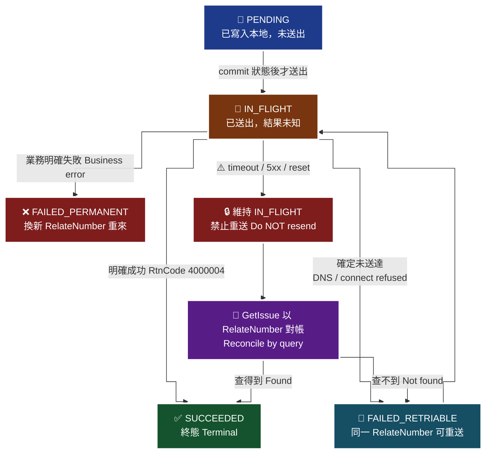

# 22 · 冪等與重試 — 本 Skill 最重要的一份

電子發票的冪等性比金流更嚴格：**重複扣款可以退款，重複開立發票不能「取消」——只能作廢，而作廢有時間窗、會浪費字軌號碼、而且留下稅務紀錄。**

> **對應 API**：不新增 API。本文規範 [`Issue`](../references/b2c-api-reference.md#4-開立發票一般開立發票--issue)、[`OfflineIssue`](../references/offline-api-reference.md#10-上傳開立發票--offlineissue)、[`Allowance`](../references/b2c-api-reference.md#8-開立折讓一般開立折讓紙本開立-allowance)、[`Invalid`](../references/b2c-api-reference.md#10-作廢發票--invalid) 等寫入類 API 的呼叫紀律，以及查詢類 API 的重試策略。
> **前置條件**：有一個可以做交易的資料庫（能 `SELECT ... FOR UPDATE` 或等效的行鎖）。

---

## 1. 為什麼電子發票的冪等比金流更嚴格

| 面向 | 金流重複扣款 | **發票重複開立** |
|---|---|---|
| 能不能撤銷 | 可以退款，帳面回到原點 | **不能撤銷**，只能作廢，且留下作廢紀錄 |
| 有沒有時間窗 | 通常沒有 | **有**。奇數月 13 號 23:59:59 後不能作廢前兩個月的發票 |
| 資源消耗 | 無 | **消耗一個財政部配給的發票號碼**，且不可回收 |
| 對外影響 | 消費者看到兩筆扣款，退款後結案 | 消費者收到兩張發票；營業額虛增；申報資料錯誤 |
| 誰會知道 | 你和消費者 | 你、消費者、**財政部** |

> 🔑 **一句話**：金流的重複是「可以修正的錯誤」，發票的重複是「已經進入稅務系統的錯誤」。

---

## 2. 冪等的基礎：`RelateNumber`

官方提供的冪等基礎是**特店自訂編號 `RelateNumber`**（i100 §7、§8、§12 原文）：

> 需為**唯一值不可重複使用**。注意事項：建議勿使用特殊符號；**大小寫英文視為相同**（e.g. `123abc456` = `123ABC456`）

| 規則 | 實務做法 | 為什麼 |
|---|---|---|
| 唯一 | 由**訂單 ID 穩定推導**，不含隨機成分 | 加隨機碼 = 重試時產生新編號 = 開出第二張發票 |
| **大小寫視為相同** | 送出前統一 `.upper()`，本地也用大寫做唯一索引 | `ORD-a1` 與 `ORD-A1` 會撞號，本地不轉大寫就查不出衝突 |
| 建議勿用特殊符號 | 只用 `A-Z0-9-` | — |
| `String(30)` | UUID 去連字號是 32 碼，**會超長** | 要截短或用自己的短碼 |

```python
import re

def to_relate_number(order_id: str, prefix: str = "INV") -> str:
    """由訂單 ID 穩定推導 RelateNumber。同一個 order_id 永遠得到同一個結果。"""
    clean = re.sub(r"[^A-Za-z0-9]", "", order_id).upper()
    rn = f"{prefix}{clean}"
    if len(rn) > 30:
        # 截斷會有撞號風險，改用短雜湊（仍然是「穩定推導」，不是隨機）
        import hashlib
        digest = hashlib.sha256(order_id.encode()).hexdigest()[:20].upper()
        rn = f"{prefix}{digest}"
    return rn
```

> 🚫 **絕對不要這樣寫**：
> ```python
> relate = f"INV{order_id}-{uuid4().hex[:6]}"   # ← 每次呼叫都不一樣，冪等直接失效
> relate = f"INV{order_id}-{int(time.time())}"  # ← 同上
> ```
> **為什麼有人會這樣寫**：因為第一次遇到「`RelateNumber` 重複」的錯誤時，最直覺的修法就是「那我加個隨機碼讓它不重複」。**但那個錯誤本身正是冪等機制在保護你**——它在告訴你「這筆訂單已經開過發票了」。

---

## 3. 本地狀態機

每一個 `RelateNumber` 在你的資料庫裡有一列，狀態如下：

| 狀態 | 意義 | 允許的下一步 |
|---|---|---|
| `PENDING` | 已寫入本地、**尚未送出** | 送出 → `IN_FLIGHT` |
| `IN_FLIGHT` | **已送出、結果未知** | 🚫 **只能查詢對帳，不可重送** |
| `SUCCEEDED` | 已確認成功（存下發票號碼、`RtnCode`、`RtnMsg`） | 終態 |
| `FAILED_PERMANENT` | 業務層明確失敗（參數錯、時間窗過期） | 修正後**換一個** `RelateNumber` 重新走 |
| `FAILED_RETRIABLE` | 傳輸層失敗且**確定沒送達** | 可用**同一個** `RelateNumber` 重送 |

> 🧭 **純文字重述（螢幕閱讀器友善）**：每一筆發票動作在本地狀態表中依序經過以下狀態。起點是 PENDING，代表已寫入本地但尚未送出。送出之前必須先把狀態改成 IN_FLIGHT 並且完成資料庫 commit，然後才發出 HTTP 請求。收到明確成功回應時進入 SUCCEEDED，這是終態。收到業務層明確失敗（例如欄位錯誤、時間窗過期）時進入 FAILED_PERMANENT，修正問題後必須換一個新的自訂單號重新開始。若失敗是傳輸層且能確定請求根本沒有離開你的機器（DNS 解析失敗、TCP 連線被拒、TLS handshake 失敗），才進入 FAILED_RETRIABLE，可以用同一個自訂單號重送。最關鍵的一條是：逾時、連線中斷、5xx 一律停留在 IN_FLIGHT，禁止重送，只能用查詢 API 依自訂單號對帳，查得到就標記 SUCCEEDED，查不到才能重送。



> ♿ 配色遵循 [`docs/accessibility.md`](../docs/accessibility.md)：WCAG AAA 對比 ≥7:1、Okabe-Ito 色盲安全色盤、16px 字體、直角連線、圖示＋文字雙編碼。

### 3.1 🔑 最關鍵的一條規則

> **送出前先寫 `IN_FLIGHT` 並 commit，再發 HTTP 請求。**

**順序反了會怎樣**：程式在送出後、寫入前崩潰（OOM、部署、機器重開），你的資料庫裡沒有任何紀錄，但歐付寶那邊已經開好了。下次同一筆訂單進來，狀態表是空的，你會再開一張。

---

## 4. `SELECT ... FOR UPDATE` 參考實作

### 4.1 資料表

```sql
CREATE TABLE invoice_state (
    relate_number   VARCHAR(30)  PRIMARY KEY,          -- 已 upper()
    action          VARCHAR(20)  NOT NULL,             -- ISSUE / ALLOWANCE / INVALID ...
    status          VARCHAR(20)  NOT NULL,             -- PENDING / IN_FLIGHT / ...
    order_id        VARCHAR(64)  NOT NULL,
    invoice_no      VARCHAR(10),
    invoice_date    VARCHAR(20),
    rtn_code        VARCHAR(20),                       -- 原樣存，不翻譯
    rtn_msg         TEXT,                              -- 原樣存
    trans_code      VARCHAR(20),
    trans_msg       TEXT,
    request_payload JSONB,
    response_raw    JSONB,
    sent_at         TIMESTAMPTZ,
    settled_at      TIMESTAMPTZ,
    attempt_count   INT NOT NULL DEFAULT 0,
    created_at      TIMESTAMPTZ NOT NULL DEFAULT now(),
    updated_at      TIMESTAMPTZ NOT NULL DEFAULT now()
);

CREATE INDEX idx_invoice_state_inflight
    ON invoice_state (status, sent_at) WHERE status = 'IN_FLIGHT';
```

> **為什麼 `relate_number` 當主鍵**：這是唯一真正的冪等鍵。用自增 ID 當主鍵、`relate_number` 只加唯一索引也可以，但主鍵能讓 `FOR UPDATE` 的意圖最清楚。
>
> **為什麼 `rtn_code` 是字串**：官方的成功碼有 `1`、`4000003`、`4000004`，而錯誤碼**官方沒有公開完整清單**。用字串存並**原樣保留**，日後到廠商後台查詢時需要原始值。

### 4.2 Python / SQLAlchemy

```python
from sqlalchemy import select
from opay_einvoice import OPayEInvoiceError

UNKNOWN_OUTCOME = (
    "timeout", "read timed out", "connection reset",
    "502", "503", "504",
)

def is_unknown_outcome(exc: Exception) -> bool:
    """保守判定：只要有一絲可能已送達，就算 unknown。"""
    msg = str(exc).lower()
    return any(k in msg for k in UNKNOWN_OUTCOME)

def issue_once(db, client, order_id: str, payload: dict) -> dict:
    relate = to_relate_number(order_id)

    # ---- 第一段交易：搶鎖 + 標記 IN_FLIGHT（必須先 commit）----
    with db.begin():
        row = db.execute(
            select(InvoiceState)
            .where(InvoiceState.relate_number == relate)
            .with_for_update()                      # 🔒 同一筆訂單的併發請求在此排隊
        ).scalar_one_or_none()

        if row is None:
            row = InvoiceState(relate_number=relate, action="ISSUE",
                               order_id=order_id, status="PENDING")
            db.add(row)
            db.flush()

        if row.status == "SUCCEEDED":
            return row.response_raw                 # 已開過 → 直接回，絕不重開
        if row.status == "IN_FLIGHT":
            raise InFlightError("此訂單的發票正在處理中，請稍後查詢結果")
        if row.status == "FAILED_PERMANENT":
            raise PermanentError(f"此訂單先前已明確失敗（{row.rtn_code}），請修正後換單號重開")

        row.status = "IN_FLIGHT"
        row.sent_at = utcnow()
        row.attempt_count += 1
        row.request_payload = payload
    # ← 交易在這裡 commit：IN_FLIGHT 已落地，才可以送出

    # ---- 第二段：真正呼叫 API（交易外，不要抓著鎖打外部服務）----
    try:
        result = client.issue(relate_number=relate, **payload)
    except OPayEInvoiceError as exc:
        if is_unknown_outcome(exc):
            # 🚫 什麼都不做，保持 IN_FLIGHT，交給對帳排程
            raise ResultUnknownError("開立結果未知，系統將自動對帳，請勿重複送出") from exc
        if is_definitely_not_sent(exc):             # DNS / connect refused / TLS handshake
            _mark(db, relate, "FAILED_RETRIABLE", exc)
            raise
        _mark(db, relate, "FAILED_PERMANENT", exc)  # 業務層明確失敗
        raise

    _mark_success(db, relate, result)
    return result
```

> ⚠️ **不要把 API 呼叫放在資料庫交易裡面。** 交易會抓著鎖等外部服務回應，逾時 15 秒的話這一列就被鎖 15 秒，其他請求全部塞住。**先 commit 狀態，再打 API。**

### 4.3 沒有 `FOR UPDATE` 怎麼辦

| 資料庫 | 做法 |
|---|---|
| PostgreSQL / MySQL(InnoDB) | `SELECT ... FOR UPDATE` |
| SQLite | 🚫 沒有行鎖；**改用唯一索引 + `INSERT ... ON CONFLICT DO NOTHING`**，插入成功者才是贏家 |
| 無交易資料庫 | 用 Redis `SET key value NX PX ttl` 當分散式鎖，**但仍需持久化狀態表** |

```python
# 唯一索引路線（適用 SQLite / 任何支援唯一鍵的儲存）
inserted = db.execute(
    "INSERT INTO invoice_state (relate_number, action, order_id, status) "
    "VALUES (?, 'ISSUE', ?, 'IN_FLIGHT') ON CONFLICT(relate_number) DO NOTHING",
    (relate, order_id),
).rowcount
if inserted == 0:
    raise InFlightError("此訂單已在處理中或已完成")
```

> **為什麼「開發用 SQLite、正式用 Postgres」很危險**：`FOR UPDATE` 在 SQLite 是無聲無息地無效。你的冪等測試在開發環境全部通過，正式環境才第一次真正被考驗。**開發環境要用與正式相同的資料庫**，或至少加唯一索引當第二道保險。

---

## 5. 哪些 API 可以重試、哪些絕對不可以

| 類別 | API | 冪等 | 可否重試 |
|---|---|:---:|---|
| **查詢類** | `GetIssue`、`GetAllowanceList`、`GetInvalid`、`GetAllowanceInvalid`、`GetInvoiceWordSetting`、`GetGovInvoiceWordSetting`、`QueryBlankInvoiceList`、B2B 各 `GetXxx`、離線 `QueryOfflineMerchantPosSetting` | ✅ | ✅ **可安全重試**（指數退避 + 上限） |
| **驗證類** | `CheckBarcode`、`CheckLoveCode`、`GetCompanyNameByTaxID` | ✅ | ✅ 可安全重試（`RtnCode=10000010` 正是官方叫你稍後再試的情境） |
| **讀取設定** | `GetInvoiceNotifySetting`、`GetRemainNotifySetting`、`GetOfflineMerchantInfo` | ✅ | ✅ |
| **設定類（覆寫）** | `UpdateInvoiceWordStatus`、`InvoiceNotifySetting`、`RemainNotifySetting`、`BlankInvAutoUploadSetting` | ⚠️ 天然冪等（同值覆寫） | ⚠️ 可重試，但**務必送相同的值**；不要在重試時重算狀態 |
| **建立類** | `AddInvoiceWordSetting`、`MaintainMerchantCustomerData`、`OfflineMerchantPosSetting`（`ActionType=1`） | ❌ | ⚠️ **不可盲目重試**，會建出重複資料。重試前先查現況 |
| 🚫 **財務動作** | **`Issue`**、**`DelayIssue`**、**`TriggerIssue`**、**`OfflineIssue`**、**`OfflineInvalid`**、**`Allowance`**、**`AllowanceByCollegiate`**、**`Invalid`**、**`AllowanceInvalid`**、**`AllowanceInvalidByCollegiate`**、**`VoidWithReIssue`**、B2B 全部 `Issue`/`Invalid`/`Reject`/`Allowance`/`CancelAllowance` 與其 `Confirm` | ❌ | 🚫 **絕對不可盲目重試** |

### 5.1 為什麼財務動作不能盲目重試

| 動作 | 重複的後果 |
|---|---|
| `Issue` / `OfflineIssue` | **同一筆訂單開出兩張發票**。號碼是稀缺資源、作廢有時間窗、產生實質稅務問題 |
| `Invalid` | 作廢是**不可逆**的（官方原文：「發票作廢是直接把原發票作廢然後**無法再使用**」） |
| `Allowance` | **折讓額度被重複扣減** |
| `VoidWithReIssue` | 內容被重複覆寫，且開立時間等欄位有嚴格限制 |
| B2B `XxxConfirm` | 重複確認的行為官方文件**沒有說明**。未知行為 = 不要做 |

---

## 6. Timeout 但實際成功了怎麼辦：**先查再決定**

這是本文的核心操作程序。

> **最惡毒的失敗**：請求其實**成功了**，但回應在網路上遺失（timeout、connection reset、負載平衡器斷線）。你的程式看到「失敗」，歐付寶那邊已經開好了。**這時候重試 100% 會重複開立。**

### 6.1 判定要保守

| 錯誤類型 | 判定 | 理由 |
|---|---|---|
| DNS 解析失敗 | `FAILED_RETRIABLE` | 請求**確定沒離開**你的機器 |
| TCP connect refused | `FAILED_RETRIABLE` | 同上 |
| TLS handshake 失敗 | `FAILED_RETRIABLE` | 同上 |
| **HTTP read timeout** | **`IN_FLIGHT`** | 請求已送出，對方可能已處理 |
| **connection reset** | **`IN_FLIGHT`** | 同上 |
| **502 / 503 / 504** | **`IN_FLIGHT`** | 可能是回應階段掛掉 |
| HTTP 200 但 `TransCode != 1` | 視訊息而定，多為 `FAILED_PERMANENT` | 對方明確拒絕了 |
| HTTP 200 且 `RtnCode` 非成功碼 | `FAILED_PERMANENT` | 業務層明確失敗 |

> **判定原則：寧可多查一次，不要多開一張。** 分類錯誤造成的成本是不對稱的——把 `IN_FLIGHT` 誤判成 `FAILED_RETRIABLE` 會重複開票；反過來只是多查一次。

### 6.2 對帳排程

```python
RECONCILE_AFTER = timedelta(minutes=3)     # IN_FLIGHT 超過這麼久就去查

def reconcile_in_flight(db, client) -> None:
    rows = db.query(InvoiceState).filter(
        InvoiceState.status == "IN_FLIGHT",
        InvoiceState.sent_at < utcnow() - RECONCILE_AFTER,
    ).all()

    for row in rows:
        try:
            # 查詢是冪等的，查一百次都沒關係
            detail = client.get_issue(relate_number=row.relate_number)
        except OPayEInvoiceError as exc:
            # 查不到（RtnCode 非 1）也可能是「真的沒開成功」
            if is_not_found(exc):
                _mark(db, row.relate_number, "FAILED_RETRIABLE", exc)
                alert("發票開立未完成，已標記為可重送", row)
            continue                        # 其他錯誤：下一輪再試
        _mark_success(db, row.relate_number, detail)
        alert("逾時的發票經查詢確認已開立成功", row)
```

| 設計要點 | 為什麼 |
|---|---|
| 等待 **3 分鐘**再查，不要立刻查 | 給對方系統時間完成處理，避免查到「還沒寫入」的狀態 |
| **不自動重送**，只改狀態 | 由下一次業務請求或人工決定是否重送 |
| 收斂結果要**推播** | 「逾時但其實成功」是重要訊號，代表網路或對方系統有狀況 |
| 超過 N 輪仍無法收斂 → **人工介入** | 不要讓它無限循環 |

### 6.3 其他動作的對帳查詢對照

| 動作 | 用哪支查 | 查詢鍵 |
|---|---|---|
| `Issue` / `DelayIssue` | `GetIssue` | `RelateNumber` |
| `OfflineIssue` | `GetIssue`（B2C） | `RelateNumber` |
| `Allowance` | `GetAllowanceList` | `SearchType=1` + `InvoiceNo` + 開立日 |
| `Invalid` | `GetInvalid` | `RelateNumber`+`InvoiceNo`+`InvoiceDate` |
| `AllowanceInvalid` | `GetAllowanceInvalid` | `InvoiceNo`+`AllowanceNo` |
| B2B `Issue` | `GetIssue`（B2B） | `RelateNumber` 或 `InvoiceNumber`+`InvoiceDate` |
| B2B `IssueConfirm` | `GetIssueConfirm` | 同上 |

> ⚠️ **線上折讓（`AllowanceByCollegiate`）無法用查詢對帳**：`GetAllowanceList`「**不包含消費者尚未同意之線上折讓單**」。這類動作的 `IN_FLIGHT` 只能靠 `ReturnURL` 回呼或人工確認收斂。設計時要意識到這個盲區。

---

## 7. 重試參數

**只適用於查詢類與驗證類。**

| 參數 | 建議 | 為什麼 |
|---|---|---|
| 退避 | 指數（1s / 2s / 4s / 8s） | 避免在對方系統壓力大時加重負擔 |
| 上限 | 4–5 次 | 再多就該讓人知道 |
| Jitter | ✅ 加入隨機抖動 | 避免大量請求同時重試造成尖峰 |
| **`Timestamp`** | 🚨 **每次重試都要重新產生** | 驗證區間只有 **10 分鐘**，沿用第一次的會在後面幾次全部失敗 |
| 總逾時 | < 10 分鐘 | 同上 |

```python
import random, time

def retry_query(fn, attempts: int = 5):
    for i in range(attempts):
        try:
            return fn()          # ⚠️ fn 內部必須「重新」建立 payload（含新的 Timestamp）
        except OPayEInvoiceError:
            if i == attempts - 1:
                raise
            time.sleep((2 ** i) + random.uniform(0, 0.5))
```

> ⚠️ **不要把「已組好的 payload」丟進重試迴圈。** payload 裡的 `Timestamp` 是第一次組的，重試幾輪之後就過期了。要重試的是「產生 payload 並送出」這整件事。
>
> 同理，**排程與批次作業不要先組好 payload 排隊很久才送**。`Timestamp` 要在實際送出前才產生。

---

## 8. 併發保護的三個層次

| 層次 | 機制 | 擋得住什麼 |
|---|---|---|
| ① 應用層 | 前端按鈕 disable、防連點 | 使用者連點 |
| ② **資料庫** | `SELECT ... FOR UPDATE` / 唯一索引 | **同一筆訂單的併發請求**（多台伺服器、重送、排程與 HTTP 同時進來） |
| ③ 歐付寶端 | `RelateNumber` 唯一性 | 你前兩層都漏掉時的最後一道 |

> **只有 ② 是真正可靠的。** ① 擋不住多分頁、擋不住 API 直接呼叫；③ 會回錯誤但你可能已經因為錯誤處理不當而做了別的動作。
>
> ⚠️ **③ 回的「`RelateNumber` 重複」不是 bug，是保護。** 收到這個錯誤時的正確處理是「**查一下這筆是不是已經開過了**」，而不是「換一個編號重送」。

---

## 9. 上線前檢查清單

```
RelateNumber
[ ] 由 order_id 穩定推導，不含隨機碼、不含時間戳
[ ] 送出前已 .upper()
[ ] 本地唯一索引也是大寫
[ ] 長度 <= 30，且只含 A-Z0-9-
[ ] 同一個 order_id 呼叫兩次得到相同結果（有單元測試）

狀態機
[ ] 有持久化的 invoice_state 表
[ ] IN_FLIGHT 在「發出 HTTP 請求之前」就已 commit
[ ] API 呼叫「不在」資料庫交易內
[ ] SELECT ... FOR UPDATE（或唯一索引）已生效於正式環境的資料庫
[ ] 開發環境與正式環境使用相同資料庫（或已加唯一索引作為保險）

錯誤分類
[ ] timeout / reset / 5xx → IN_FLIGHT，不重送
[ ] DNS / connect refused / TLS handshake → FAILED_RETRIABLE
[ ] 業務層失敗 → FAILED_PERMANENT，需換新 RelateNumber
[ ] 開立的成功碼是 {4000003, 4000004}，不是 {1}

對帳
[ ] 有 IN_FLIGHT 對帳排程（等待 >= 3 分鐘才查）
[ ] 對帳只改狀態，不自動重送
[ ] 對帳結果會推播
[ ] 知道線上折讓無法用查詢對帳（盲區已記錄）

重試
[ ] 只有查詢類與驗證類進重試迴圈
[ ] 每次重試重新產生 Timestamp
[ ] 財務動作的程式碼中「沒有」任何 for/while 重試迴圈

紀錄
[ ] RtnCode / RtnMsg / TransCode / TransMsg 原樣保存
[ ] 沒有自己編的錯誤碼對照表
[ ] 有 audit log（誰、何時、對哪張發票做了什麼）
```

---

### 常見錯誤

1. **`RelateNumber` 加隨機碼或時間戳。** 冪等直接失效。收到「編號重複」錯誤時，正確反應是「去查是不是已經開過」，不是「換個編號」。
2. **先發 HTTP 請求，成功後才寫狀態。** 程式在中間崩潰，你就永遠不知道那筆送出去了沒有。**必須先 commit `IN_FLIGHT`。**
3. **timeout 就自動重送。** 這是重複開立最主要的成因。timeout 必須走「先查再決定」。
4. **把 API 呼叫放在資料庫交易裡。** 鎖會被抓著等外部服務，其他請求全部塞住。
5. **用 `if RtnCode == 1` 判斷開立成功。** 成功碼是 `4000004` / `4000003`，這個寫法會把成功判成失敗然後重試。
6. **重試時沿用同一個 `Timestamp`。** 10 分鐘驗證區間，後面幾次全失敗，看起來像對方系統壞了。
7. **開發用 SQLite、正式用 Postgres。** `FOR UPDATE` 在 SQLite 無聲失效，冪等測試在開發環境是假的。
