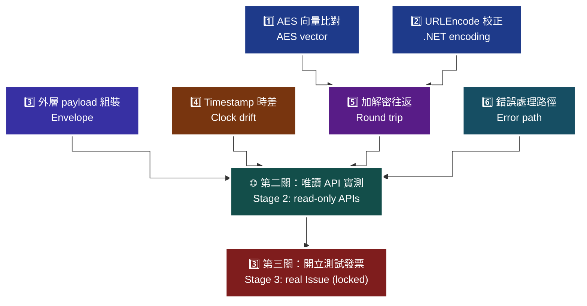

# 23 · 測試主控台 — 六步自我驗證怎麼用

[`templates/opay-test-console/`](../templates/opay-test-console/) 的三關流程、六步自我驗證的每一步在驗什麼、紅燈代表什麼。

> **對應 API**：第②關實測 [`CheckBarcode`](../references/b2c-api-reference.md#21-手機條碼驗證--checkbarcode)、[`CheckLoveCode`](../references/b2c-api-reference.md#22-捐贈碼驗證--checklovecode)、[`GetCompanyNameByTaxID`](../references/b2c-api-reference.md#23-統一編號驗證--getcompanynamebytaxid)、[`GetInvoiceWordSetting`](../references/b2c-api-reference.md#18-查詢字軌--getinvoicewordsetting)；第③關為 [`Issue`](../references/b2c-api-reference.md#4-開立發票一般開立發票--issue)（預設關閉）
> **前置條件**：Python 3.8+。第①關**不需要**網路、不需要正確金鑰即可跑（會用官方公開的測試向量）。

---

## 1. 三關流程

```bash
cd templates/opay-test-console
cp .env.example .env && python3 -m pip install fastapi uvicorn requests pycryptodome
set -a && . ./.env && set +a
python3 -m uvicorn backend:app --reload --port 8080     # http://127.0.0.1:8080
```

| 關卡 | 做什麼 | 連外網 | 產生資料 |
|---|---|:---:|:---:|
| ① 六步自我驗證 | AES 向量、URLEncode、外層組裝、時差、加解密往返、錯誤處理 | ❌ | ❌ |
| ② 唯讀 API 實測 | `CheckBarcode`、`CheckLoveCode`、`GetCompanyNameByTaxID`、`GetInvoiceWordSetting` | ✅（測試環境） | ❌ |
| ③ 開立測試發票 | `Issue` | ✅（測試環境） | **✅ 會，且無法刪除** |

> **為什麼要分三關**：`Issue` 失敗的成因至少有四層（本機加解密 / 網路 / 字軌 / 欄位）。一次到位失敗時，你不知道是哪一層。**分關的目的是讓失敗有座標。**

第③關預設關閉，需在 `.env` 設 `OPAY_ALLOW_ISSUE_DEMO=true`，前端還要再勾一次確認框。
**為什麼要兩道鎖**：即使是測試環境，`Issue` 也會消耗一個真實的財政部配號，而且**只能作廢不能刪除**。

---

## 2. 六步自我驗證：每一步在驗什麼

### 步驟 ① AES 加密向量比對

| 項目 | 內容 |
|---|---|
| 驗什麼 | 用**官方公開測試金鑰**加密官方範例明文，比對密文是否完全一致 |
| 與你的金鑰無關 | 這一步用的是固定的官方向量，**就算你的 `.env` 金鑰是錯的也會通過** |
| 🟥 紅燈代表 | 你的 AES 實作有問題 |

**紅燈時檢查三件事**（主控台的修復建議原文）：
1. 模式必須是 **AES-128-CBC**（不是 ECB、不是 256）
2. Padding 必須是 **PKCS7**（不是 zero padding）
3. 必須**先 URLEncode 再加密**，順序不可顛倒

> **為什麼這一步要用官方向量而不是自己的金鑰**：如果用自己的金鑰做「加密後再解密」，即使你的實作整套都錯（例如用了 ECB），加解密仍然會對稱地成功。**只有跟官方向量比對，才能證明你的實作與歐付寶一致。**

### 步驟 ② URLEncode .NET 校正

| 測試案例 | 期望輸出 |
|---|---|
| `{"Name":"Test","ID":"A123456789"}` | 官方向量的編碼結果 |
| `a b` | `a+b`（**空格是 `+` 不是 `%20`**） |
| `!*()` | `!*()`（**不編碼**） |
| `~` | `%7E` |
| `中文` | `%E4%B8%AD%E6%96%87` |

| 🟥 紅燈代表 | 修復方向 |
|---|---|
| 空格變 `%20` | 用了 `rawurlencode`／`encodeURIComponent` 類的函式 |
| `!*()` 被編碼 | PHP `urlencode()` 的典型症狀（`*` → `%2A`），要做字元替換 |
| `~` 沒被編碼 | Python 3.7+ 的 `quote_plus` 與 JS 都不編 `~`，要手動補 |

完整轉換表見 [`urlencode-table.md`](../references/urlencode-table.md)。

> **為什麼這一步的失敗最難自己發現**：只有當資料**剛好含有**空格或 `!*()~` 時才會失敗。用「測試商品」當品名永遠不會踩到；用「限量！特價(買一送一) 200g」就會。**主控台這一步等於幫你把這些字元都測過一遍。**

### 步驟 ③ 外層 payload 組裝

| 檢查 | 期望 |
|---|---|
| 外層欄位 | 恰好是 `PlatformID` / `MerchantID` / `RqHeader` / `Data` 四項 |
| `RqHeader.Timestamp` | **整數** Unix timestamp |
| `Data` | 非空的 Base64 字串 |

| 🟥 紅燈代表 |
|---|
| 外層結構寫錯（多欄位、少欄位、巢狀錯） |
| `Timestamp` 是字串或浮點數 |
| `Data` 沒加密或加密失敗 |

### 步驟 ④ Timestamp 時差檢查

| 項目 | 內容 |
|---|---|
| 驗什麼 | 本機 epoch 與 UTC epoch 的差值 |
| 🟩 綠燈 | 差 ≤ 60 秒 |
| 🟨 黃燈 | 差 > 60 秒 |

> ⚠️ **這一步只能驗「程式取得的時間戳一致」，不能驗主機整體時鐘是否準確。** 主控台的說明文字也明白寫出這個限制。真正的校時確認要靠：

```bash
timedatectl              # 看 System clock synchronized: yes
chronyc tracking         # 看 System time 偏移，應在毫秒等級
```

**黃燈時的修復**：`sudo timedatectl set-ntp true` 或 `sudo chronyc makestep`。
**為什麼重要**：時差超過 **10 分鐘**會導致所有 API 直接 `TransCode` 失敗，而且症狀是「有時成功有時失敗」，最難查。

### 步驟 ⑤ 加解密往返

| 項目 | 內容 |
|---|---|
| 驗什麼 | 用**你 `.env` 裡的金鑰**加密一段含**空格、`!*()~`、中文**的資料，再解密還原 |
| 🟥 紅燈代表 | 解密順序錯（必須**先 AES 解密再 URLDecode**），或 URLDecode 沒把 `+` 還原成空格 |

> **這一步與步驟①的分工**：① 驗「與官方一致」，⑤ 驗「你自己的金鑰能用、且往返無損」。①過⑤不過，通常是解密方向的問題。

### 步驟 ⑥ 錯誤處理路徑

| 項目 | 內容 |
|---|---|
| 驗什麼 | 餵入一段**不合法的密文**，看程式是否丟出**可讀的繁中錯誤**而不是 HTTP 500 |
| 🟩 綠燈 | 攔截成功且錯誤訊息含「修復建議」 |
| 🟨 黃燈 | 攔截成功但沒有修復建議 |
| 🟥 紅燈 | 沒攔到，或丟出未包裝的例外 |

> **為什麼要驗錯誤處理**：正式環境半夜出事時，值班的人不一定是寫這段程式的人。**錯誤訊息裡有沒有「修復建議」，決定了他要花 5 分鐘還是 2 小時。**
>
> 解密失敗有四種成因（Base64 不合法、區塊長度不對、AES 失敗、JSON 不合法），各自應該丟出不同的訊息。

---

## 3. 六步的依賴關係

> 🧭 **純文字重述（螢幕閱讀器友善）**：六步之間有依賴關係。第一步驗證 AES 實作是否與官方一致，第二步驗證 URLEncode 是否符合 .NET 慣例，這兩步都不牽涉你的金鑰。第五步的加解密往返建立在前兩步之上，前兩步紅燈時第五步的結果沒有參考價值。第三步的外層組裝與第四步的時差檢查彼此獨立，但都是打通網路請求的必要條件。第六步驗證錯誤處理路徑，與其他步驟獨立。修復順序建議是：先修第一步與第二步，再修第五步，接著處理第三步與第四步，最後補第六步。六步全綠才進入第二關的唯讀 API 實測。



> ♿ 配色遵循 [`docs/accessibility.md`](../docs/accessibility.md)：WCAG AAA 對比 ≥7:1、Okabe-Ito 色盲安全色盤、16px 字體、直角連線、圖示＋文字雙編碼。

**修復順序**：① ② → ⑤ → ③ ④ → ⑥。
**為什麼**：① ② 是最底層的實作正確性；⑤ 建立在它們之上，前兩步紅燈時 ⑤ 的結果沒有參考價值。

---

## 4. 第二關：唯讀 API 實測

打通這一關代表**網路、TLS、防火牆、金鑰、時間**全部正確。

| 失敗症狀 | 最可能原因 | 對照 |
|---|---|---|
| 連線逾時 | 防火牆沒用 FQDN 放行 | [`02`](02-preflight-checklist.md) §2.9 |
| TLS handshake 失敗 | TLS 低於 1.2 | [`02`](02-preflight-checklist.md) §2.10 |
| `TransCode != 1` | 時差超過 10 分鐘、或 `MerchantID` 與金鑰非同一組 | [`error-handling.md` §2.2](../references/error-handling.md) |
| AES 解密失敗 | HashKey / HashIV 錯，或測試與正式混用 | [`encryption-aes.md`](../references/encryption-aes.md) |
| `GetInvoiceWordSetting` 查無資料 | `InvoiceCategory` 沒填 `1` | [`03`](03-b2c-word-setting.md) |

⚠️ `CheckBarcode` / `CheckLoveCode` 成功後**還要看 `IsExist`**，見 [`09-b2c-validation.md`](09-b2c-validation.md)。

---

## 5. 第三關：開立測試發票

**啟用前先確認你理解三件事**：

1. 這會產生**真實的發票紀錄**（在測試環境），只能作廢不能刪除。
2. 會**消耗一個字軌號碼**。
3. 測試環境**請勿帶入真實 Email**（官方明訂，避免個資外洩）。

**建議做法**：示範訂單編號加明顯前綴（例如 `CONSOLE-`），方便日後在後台辨識與清理。

---

## 6. 主控台的無障礙設計

主控台本身就是 [`29-wcag-ui-ux.md`](29-wcag-ui-ux.md) 的參考實作：

| 項目 | 做法 |
|---|---|
| 對比 | 深色底白字 ≥9:1 |
| 狀態編碼 | **顏色 + 圖示 + 文字**三重（不只靠紅綠） |
| 鍵盤 | 全鍵盤可操作，白色 focus ring |
| 觸控目標 | ≥48px |
| 表單 | 每個輸入框都有 `<label>` |
| 動態訊息 | `aria-live="polite"` 播報狀態變化 |

> **為什麼測試工具也要做無障礙**：值班的人可能在手機上看、可能在強光下看、可能是色覺障礙者。**「六步全綠」如果只靠顏色表達，對他們就等於沒有資訊。**

---

### 常見錯誤

1. **跳過第一關直接打 API。** 加解密錯誤在 API 端只會回籠統的參數錯誤，你會往完全錯誤的方向查。
2. **以為步驟①通過就代表金鑰正確。** ① 用的是**官方公開向量**，與你的 `.env` 金鑰無關。金鑰正確性要看步驟⑤與第二關。
3. **步驟④綠燈就認為主機時間沒問題。** 它只驗程式取得的時間戳一致，主機時鐘要用 `timedatectl` / `chronyc` 確認。
4. **把 `OPAY_ALLOW_ISSUE_DEMO=true` 留在 `.env` 裡。** 用完關掉。這是一道故意設計的摩擦。
5. **在主控台填真實 Email。** 官方明訂測試環境勿帶真實信箱。
6. **把主控台指向正式環境。** 後端會擋下開立示範，但唯讀 API 仍會打到正式環境。主控台是給測試環境用的。
