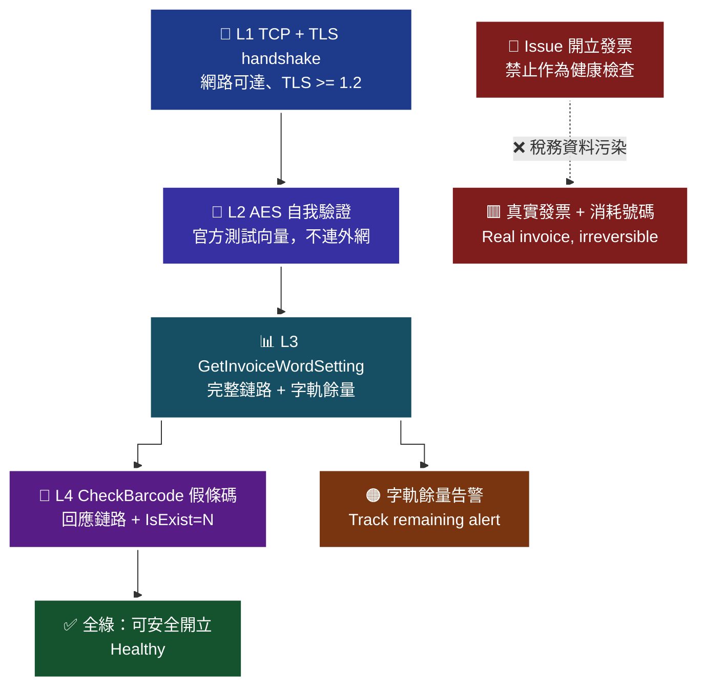

# 24 · 正式環境監控 — 鐵律：健康檢查絕不可用 `Issue`

**正式環境的健康檢查絕不可以呼叫 `Issue`。它會產生真實發票，是稅務資料污染，比金流的假訂單嚴重得多。** 只能用唯讀探測。

> **對應 API**（唯讀探測用）：[`GetInvoiceWordSetting`](../references/b2c-api-reference.md#18-查詢字軌--getinvoicewordsetting)、[`CheckBarcode`](../references/b2c-api-reference.md#21-手機條碼驗證--checkbarcode)、[`GetIssue`](../references/b2c-api-reference.md#14-查詢發票明細--getissue)
> **前置條件**：正式環境已上線；已有 [`22-idempotency-and-retry.md`](22-idempotency-and-retry.md) 的狀態表（監控會用到本地資料）。

---

## 1. 🚫 鐵律：健康檢查不可用 `Issue`

```python
# 🚫 絕對禁止 —— 這行程式碼會在正式環境每 5 分鐘產生一張真發票
@app.get("/health/opay")
def health():
    client.issue(relate_number=f"HEALTH-{int(time.time())}", ...)
    return {"ok": True}
```

| 為什麼比金流的「假訂單健康檢查」嚴重 | 說明 |
|---|---|
| **資料進入國家稅務系統** | 加值中心會在 48 小時內把它上傳財政部（B2B 是 7 天）。這不是你資料庫裡的一列，是**申報資料** |
| **消耗字軌號碼** | 每 5 分鐘一次 = 每天 288 個號碼。一個月就能燒掉一整批配號 |
| **無法刪除** | 只能作廢，而作廢**有時間窗**（奇數月 13 號後不能作廢前兩個月的） |
| **虛增營業額** | 每一張都是有金額的憑證 |
| **會發通知** | 若通知開關開著，可能真的寄信出去 |
| **作廢也留痕** | 作廢紀錄同樣會上傳財政部；稽核時要解釋「為什麼每天有 288 張作廢發票」 |

> 🔑 **金流的假訂單頂多是髒資料，發票的假開立是稅務問題。** 這兩者不在同一個量級。

**同樣禁止的還有**：`DelayIssue`、`OfflineIssue`、`Allowance`、`Invalid`、`VoidWithReIssue`，以及 B2B 全部寫入類 API。**任何會改變狀態的 API 都不能當健康檢查。**

---

## 2. 允許的四種唯讀探測

> 🧭 **純文字重述（螢幕閱讀器友善）**：正式環境的健康檢查分成四層，由淺到深。第一層是 TCP 與 TLS 握手，只確認網路可達、TLS 版本正確、憑證有效，完全不送出任何業務資料，可以最高頻執行。第二層是 AES 自我驗證，在本機用官方測試向量比對加密結果，不連外網，可以在每次部署後與定期執行。第三層是呼叫查詢字軌，這會實際打到歐付寶並經過完整的加解密與時間驗證，同時取得字軌剩餘量，是最有價值的探測。第四層是用一個必定不存在的假手機條碼呼叫驗證 API，確認回應鏈路正常且能正確判讀 IsExist 為 N。四層都不會產生任何發票資料。



> ♿ 配色遵循 [`docs/accessibility.md`](../docs/accessibility.md)：WCAG AAA 對比 ≥7:1、Okabe-Ito 色盲安全色盤、16px 字體、直角連線、圖示＋文字雙編碼。

### L1 — TCP + TLS handshake

```python
import socket, ssl

def probe_tcp_tls(host: str = "einvoice.opay.tw", timeout: float = 5.0) -> dict:
    """只做握手，不送任何業務資料。"""
    ctx = ssl.create_default_context()
    ctx.minimum_version = ssl.TLSVersion.TLSv1_2      # 官方僅支援 TLS 1.2 以上
    with socket.create_connection((host, 443), timeout=timeout) as sock:
        with ctx.wrap_socket(sock, server_hostname=host) as ss:
            cert = ss.getpeercert()
            return {"tls_version": ss.version(), "cert_not_after": cert.get("notAfter")}
```

| 驗到什麼 | 頻率 |
|---|---|
| DNS 解析、路由、防火牆（FQDN 是否仍解析得到）、TLS 版本、憑證效期 | 每 1 分鐘 |

> **為什麼這一層特別重要**：官方明寫「歐付寶主機 **IP 不固定**」。如果有人把防火牆改成 IP 白名單，這一層會**在第一次換 IP 時就告警**，而不是等到有訂單開不出發票。

### L2 — AES 自我驗證（不連外網）

用 [`test-vectors/`](../test-vectors/) 的官方向量在本機比對，確認**部署後的加解密實作仍然正確**。

| 什麼時候會壞 | 例子 |
|---|---|
| 相依套件升級 | `pycryptodome` / `openssl` 行為變更 |
| 執行環境變更 | 換基底映像檔、換語言版本 |
| 有人「優化」了 URLEncode | 把校正邏輯當成冗餘刪掉 |

**建議**：放進 CI 與部署後 smoke test，並每日執行一次。

### L3 — `GetInvoiceWordSetting`（最有價值的探測）

```python
def probe_word_setting(client) -> dict:
    year = str(datetime.now().year - 1911)
    result = client.get_invoice_word_setting(invoice_year=year, invoice_category=1)
    infos = result.get("InvoiceInfo") or []
    if isinstance(infos, dict):        # 官方範例曾以物件形式回傳，容錯
        infos = [infos]
    return {"ok": True, "tracks": infos}
```

**一次驗到六件事**：

| 驗到 | 為什麼 |
|---|---|
| 網路與 TLS | 真的打出去了 |
| **時間校正** | `Timestamp` 過期會 `TransCode` 失敗 |
| **金鑰正確** | 解密成功才拿得到 `Data` |
| `MerchantID` 與金鑰同組 | 否則外層就失敗 |
| **加解密實作** | 端到端驗證 |
| **🔑 字軌剩餘量** | 見 §3 |

> **為什麼選這一支而不是別的查詢**：它不需要任何「已存在的資料」當參數。`GetIssue` 需要一個真實的發票號碼，那個號碼會隨時間變舊、可能被作廢。`GetInvoiceWordSetting` 只需要年度，永遠有得查。

### L4 — `CheckBarcode` 假條碼

```python
FAKE_BARCODE = "/000000Z"     # 格式合法、幾乎不可能存在的條碼

def probe_check_barcode(client) -> dict:
    res = client.check_barcode(bar_code=FAKE_BARCODE)
    if res.get("RtnCode") == 10000010:
        return {"ok": True, "note": "財政部系統維護中（非本站問題）"}
    # 期望：RtnCode=1 且 IsExist=N
    return {"ok": res.get("RtnCode") == 1, "is_exist": res.get("IsExist")}
```

> **為什麼要用「必定不存在」的條碼**：這樣期望值是穩定的（`IsExist=N`）。用真實條碼的話，對方註銷了條碼就會讓你的健康檢查變紅，卻不是你的問題。
>
> ⚠️ `RtnCode=10000010`（財政部維護中）**不應該觸發告警**，那是外部因素。把它歸類為「降級但正常」。

---

## 3. 🔑 字軌餘量告警

**字軌用完 = 全站開不出發票，而且無法即時補救**（要申請配號、登記、審核、啟用）。

### 3.1 計算

```python
def track_remaining(info: dict) -> int:
    start = int(info.get("InvoiceStart") or 0)
    end   = int(info.get("InvoiceEnd") or 0)
    used  = int(info.get("InvoiceNo") or 0)      # 目前已使用號碼
    return (end - used) if used >= start else (end - start + 1)
```

⚠️ **只算 `UseStatus == 2`（使用中）的字軌。** 把未啟用（`1`）、暫停（`4`）、待審核（`5`）的字軌算進剩餘量，會讓你以為還很多。

參考實作：[`templates/telegram-bot/bot.py`](../templates/telegram-bot/bot.py) 的 `check_word_remaining()`。

### 3.2 三級告警

| 級別 | 門檻 | 動作 |
|---|---|---|
| 🟡 **注意** | 剩餘 < 尖峰 3 日用量 | 每日推播一次；開始準備下一批配號 |
| 🟠 **警告** | 剩餘 < 尖峰 1 日用量 | 每小時推播；指派負責人 |
| 🔴 **緊急** | 剩餘 < 尖峰 2 小時用量 | 立即呼叫值班；視為 P1 事件 |

> **為什麼用「尖峰用量」而不是固定張數**：500 張對小商家是三個月的量，對大型電商是兩小時。**門檻要跟著實際流量走**，並且**每季重新校準**。
>
> 歐付寶自己的 `RemainNotifySetting` 預設是 **20 張**（見 [`10-b2c-notify-settings.md`](10-b2c-notify-settings.md)），對絕大多數商家都太低——從收到通知到新字軌可用，中間有申請、審核、啟用三段等待。

### 3.3 兩道保險

| 保險 | 機制 | 收件者 |
|---|---|---|
| 第一道 | 歐付寶 `RemainNotifySetting` Email | 財務／營運信箱 |
| **第二道** | 自己排程 `GetInvoiceWordSetting` + 群組推播 | 值班群組 |

**為什麼需要兩道**：Email 推送到個人信箱，漏接率遠高於群組推播。而字軌用完的後果值得兩道保險。

### 3.4 期別交界的特別檢查

發票期別是雙月制。**期別交界那天是可預期的高風險時刻。**

```python
def check_next_term_ready(client) -> bool:
    """在每期最後一個月執行：確認下一期已有 UseStatus=2 的字軌。"""
    now = datetime.now()
    next_year, next_term = next_term_of(now)
    result = client.get_invoice_word_setting(invoice_year=next_year, invoice_category=1)
    infos = result.get("InvoiceInfo") or []
    if isinstance(infos, dict):
        infos = [infos]
    return any(i.get("InvoiceTerm") == next_term and i.get("UseStatus") == 2 for i in infos)
```

**排程**：每期最後一個月，每日檢查一次；未就緒就升級告警。
**為什麼**：這不是「某天可能壞掉」，而是**在可預期的日期一定會壞**。但因為每兩個月才一次，團隊記憶容易斷。

---

## 4. 業務層監控指標

健康檢查驗「系統活著」，這些指標驗「系統做對事」。

| 指標 | 正常 | 異常代表 |
|---|---|---|
| 開立成功率 | 接近 100% | 下降 → 字軌、欄位驗證或對方系統有問題 |
| **`IN_FLIGHT` 積壓筆數** | 接近 0 | 🚨 上升 → 網路不穩或對帳排程掛了 |
| **對帳收斂為「其實成功」的比例** | 低 | 上升 → 逾時設定太短，或對方系統變慢 |
| **「重複開立」類作廢** | **應為 0** | 🚨 > 0 → **冪等機制有破口**，見 [`06`](06-b2c-invalid-void.md) §10 |
| 作廢率 | 低且穩定 | 突升 → 開立邏輯有 bug |
| B2B「等待確認」逾期筆數 | 0 | > 0 → 半套整合，見 [`14`](14-b2b-issue.md) |
| `Upload_Status=2`（B2B 上傳失敗） | 0 | > 0 → 終態失敗，需人工處理 |
| 離線：已開立未上傳張數 | 0 | > 0 → 上傳佇列積壓，見 [`18`](18-offline-invoice.md) |

> 🚨 **`IN_FLIGHT` 積壓是最重要的單一指標。** 每一筆 `IN_FLIGHT` 都代表「你不知道歐付寶那邊有沒有開成功」。積壓上升代表你正在累積不確定性，而不確定性最後會變成重複開立或漏開。

---

## 5. 監控排程建議

| 頻率 | 做什麼 |
|---|---|
| 每 1 分鐘 | L1 TCP + TLS |
| 每 5 分鐘 | L3 `GetInvoiceWordSetting`；`IN_FLIGHT` 對帳 |
| 每 15 分鐘 | L4 `CheckBarcode` 假條碼 |
| 每 1 小時 | 字軌餘量三級判定 |
| 每日 | L2 AES 自我驗證；B2B 等待確認／被退回掃描；離線已開立未上傳核對 |
| 每期最後一個月，每日 | 下一期字軌就緒檢查 |
| 每期首日 | 上一期空白未使用發票處理 |

---

## 6. 告警文案的要求

值班的人不一定懂電子發票。**告警要寫得讓他知道下一步做什麼。**

```
🔴 [P1] 電子發票字軌即將用盡
字軌：AA10000000-AA10000999（使用中）
剩餘：87 張（約 1.5 小時用量）
影響：用盡後全站無法開立發票，且無法即時補救
下一步：
  1. 立即通知財務向國稅局申請配號
  2. 若已有配號，執行 AddInvoiceWordSetting + UpdateInvoiceWordStatus(2)
  3. 參考 guides/03-b2c-word-setting.md
負責人：@finance-oncall
```

| 要素 | 為什麼 |
|---|---|
| 具體數字 + 換算成**時間** | 「剩 87 張」沒有急迫感，「約 1.5 小時用量」有 |
| 影響描述 | 讓值班的人判斷要不要叫人起床 |
| **下一步** | 半夜三點沒有人想翻文件 |
| 文件連結 | 讓他能自己查下去 |
| 負責人 | 避免「以為別人會處理」 |

---

### 常見錯誤

1. **用 `Issue` 當健康檢查。** 這是本文的鐵律：**正式環境嚴格禁止**。會產生真實發票、消耗字軌、污染稅務資料，而且無法刪除。
2. **只監控 HTTP 200。** `TransCode` 與 `RtnCode` 都可能是失敗，回應照樣是 200。
3. **字軌門檻設固定張數。** 要跟著尖峰用量走，並每季校準。
4. **沒有監控 `IN_FLIGHT` 積壓。** 這是「你不知道有沒有開成功」的筆數，是最重要的單一指標。
5. **把 `RtnCode=10000010`（財政部維護中）當成故障告警。** 那是外部因素，應歸類為降級但正常。
6. **沒有期別交界的預先檢查。** 這不是「可能會壞」，是「在可預期的日期一定會壞」。
7. **告警只寫「發票 API 異常」。** 值班的人不知道要做什麼，等於沒告警。
