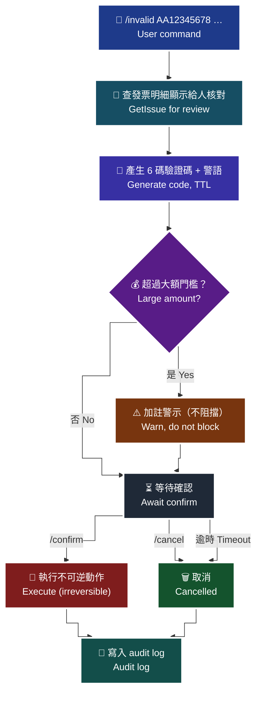

# 25 · Telegram Bot — 綁定、推播、選單、二次確認

[`templates/telegram-bot/`](../templates/telegram-bot/) 的使用方式：如何把發票事件推播到工作群組，以及作廢／折讓的二次確認機制。

> **對應 API**：bot 內部使用 [`GetIssue`](../references/b2c-api-reference.md#14-查詢發票明細--getissue)、[`GetInvoiceWordSetting`](../references/b2c-api-reference.md#18-查詢字軌--getinvoicewordsetting)、[`Invalid`](../references/b2c-api-reference.md#10-作廢發票--invalid)、[`Allowance`](../references/b2c-api-reference.md#8-開立折讓一般開立折讓紙本開立-allowance)
> **前置條件**：已向 @BotFather 申請 bot token；商店系統能 POST 事件到 bot 的 `/notify`；已完成 [`02-preflight-checklist.md`](02-preflight-checklist.md)。

---

## 1. 為什麼要一支發票 bot

| 沒有 bot | 有 bot |
|---|---|
| 開立失敗只寫進 log，沒人看 | 立刻推播到值班群組 |
| 字軌快用完時，Email 通知被漏看 | 群組推播，一群人都看得到 |
| 客服要查發票要開後台、要登入 | 一句 `/invoice AA12345678` |
| 作廢要工程師手動下 SQL 或打 API | 有稽核紀錄的二次確認流程 |

> **核心價值不是「方便」，是「讓不該安靜的事情發出聲音」。** 電子發票的多數故障（字軌用完、開立失敗、B2B 卡在等待確認）都是**安靜的**——沒有錯誤畫面、沒有客訴，直到月結才爆炸。

---

## 2. 設定

```bash
cd templates/telegram-bot
cp .env.example .env
python3 -m pip install requests pycryptodome
python3 bot.py
```

| 變數 | 說明 | 建議 |
|---|---|---|
| `TELEGRAM_BOT_TOKEN` | @BotFather 給的 token | 缺少時 bot 會以中文訊息結束，不會啟動 |
| `ADMIN_TOKEN` | 綁定聊天室用的密碼 | `openssl rand -hex 16`，至少 12 碼，**勿在公開群組貼出** |
| `NOTIFY_TOKEN` | 商店系統 POST `/notify` 要帶的 `X-Notify-Token` | 留空只限本機測試 |
| `NOTIFY_PORT` | 事件接收埠（**只綁 `127.0.0.1`**） | 預設 8790 |
| `BOT_DB_PATH` | 本機狀態（綁定、事件、稽核、待確認） | 要納入備份 |
| `AUDIT_LOG_PATH` | 稽核 log | **要納入備份與保存政策** |
| `WORD_REMAIN_THRESHOLD` | 字軌剩餘警戒（張） | 抓「尖峰時段兩天的開立量」 |
| `WORD_CHECK_INTERVAL` | 字軌檢查間隔（秒，最小 60） | 預設 3600 |
| `LARGE_AMOUNT_WARN` | 大額提醒門檻（元） | **只加註警示，不阻擋** |
| `CONFIRM_TTL_SECONDS` | 二次確認驗證碼有效秒數 | 預設 300 |

> ⚠️ **`/notify` 只綁 `127.0.0.1`。** 商店系統與 bot 應該在同一台機器，或透過內網代理。**不要把這個埠暴露到公網**——它能觸發推播，也是進入 bot 狀態庫的入口。

---

## 3. 綁定

```
/bind <ADMIN_TOKEN>      綁定本聊天室以接收推播
/unbind                  解除綁定
```

| 設計 | 為什麼 |
|---|---|
| Token 比對用 `hmac.compare_digest` | **固定時間比較**，避免用回應時間差猜出 token |
| 綁定與解綁都寫 audit log | 誰在什麼時候讓哪個群組能看到發票資料，要查得到 |
| 未綁定的聊天室**只能用 `/bind`、`/help`** | 避免任何人拉走 bot 就能查發票 |

> **為什麼綁定要有密碼**：Telegram 的 bot 可以被任何人加進任何群組。沒有綁定驗證的話，任何人都能查到你的發票明細——那是**買受人的個資**（Email、手機、統編）。

---

## 4. 指令選單

| 指令 | 用途 | 危險？ |
|---|---|:---:|
| `/today` | 今日開立張數與金額 | — |
| `/invoice <發票號碼> [開立日期]` | 查發票明細 | — |
| `/words` | 查字軌剩餘數量 | — |
| `/invalid <發票號碼> <開立日期> <原因>` | **作廢發票** | 🚨 |
| `/allowance <發票號碼> <開立日期> <金額> <品名>` | **開立折讓** | 🚨 |
| `/confirm <驗證碼>` | 確認上一個危險操作 | — |
| `/cancel <驗證碼>` | 取消上一個危險操作 | — |
| `/help` | 說明 | — |

> ⚠️ **`/today` 的資料來源是 bot 的本機事件庫，不是歐付寶。** 因為 B2C **沒有「依日期批次查詢」的 API**。商店系統必須在開立後 POST 事件到 `/notify`，`/today` 才有資料。這個限制在 bot 的回覆裡也會明白寫出來。

---

## 5. 事件推播

商店系統開立發票後 POST 到 `http://127.0.0.1:<NOTIFY_PORT>/notify`：

```json
{"event": "issue_success", "invoice_no": "AA12345678", "amount": 1050,
 "relate_number": "ORD20260818001"}
```

| 事件 | 什麼時候送 | 為什麼要推 |
|---|---|---|
| `issue_success` | 開立成功 | 累計 `/today` 統計 |
| `issue_failed` | 開立失敗 | 🚨 **最重要**——要有人立刻知道 |
| `invalid` | 作廢 | 稽核與異常偵測（作廢率突升 = 有 bug） |
| `allowance` | 折讓 | 同上 |
| `word_low` | 字軌低於警戒 | bot 內建的背景檢查也會送 |

```python
import requests
requests.post(
    "http://127.0.0.1:8790/notify",
    json={"event": "issue_failed", "relate_number": relate, "error": str(exc)},
    headers={"X-Notify-Token": os.environ["NOTIFY_TOKEN"]},
    timeout=3,
)
```

> ⚠️ **推播失敗不可以影響主流程。** 用短 timeout、包 try/except、失敗只寫 log。**不要讓「通知服務掛了」變成「發票開不出來」。**

---

## 6. 字軌餘量背景檢查

bot 內建 `check_word_remaining()`，每 `WORD_CHECK_INTERVAL` 秒執行一次：

1. 呼叫 `GetInvoiceWordSetting`（`InvoiceCategory=1`，民國年）
2. 對每段字軌計算 `InvoiceEnd - InvoiceNo`
3. **只有 `UseStatus == 2`（使用中）** 且低於門檻才推播

> **為什麼只算使用中的**：把未啟用（`1`）、暫停中（`4`）、待審核（`5`）的字軌算進剩餘量，會讓你以為還很多，實際上那些號碼現在不能用。
>
> ⚠️ 背景執行緒**不可因單次錯誤結束**。bot 的實作用 `except Exception` 包住整個迴圈本體——監控自己掛掉是最糟的情況，因為它是「安靜地掛掉」。

三級告警門檻設計見 [`24-prod-monitoring.md`](24-prod-monitoring.md) §3.2。

---

## 7. 🚨 危險操作的二次確認

作廢與折讓都是**不可逆**的財務動作。bot 用「產生驗證碼 → 確認 → 執行」三段流程。

> 🧭 **純文字重述（螢幕閱讀器友善）**：使用者在群組輸入作廢或折讓指令後，bot 不會立刻執行。它會先向歐付寶查詢該發票的明細並顯示出來讓人核對，同時產生一組六碼驗證碼，並說明這個操作不可復原。若金額超過大額門檻，訊息會額外加註警示但不會阻擋。使用者必須再輸入確認指令加上驗證碼才會真正執行，或輸入取消指令放棄。驗證碼有時效，逾時失效；而且驗證碼綁定發起者與聊天室，別人拿到驗證碼也不能替他確認。無論確認或取消，全部寫入稽核紀錄。



> ♿ 配色遵循 [`docs/accessibility.md`](../docs/accessibility.md)：WCAG AAA 對比 ≥7:1、Okabe-Ito 色盲安全色盤、16px 字體、直角連線、圖示＋文字雙編碼。

| 設計 | 為什麼 |
|---|---|
| **先查再確認** | 讓人看到「你要作廢的是這張、金額多少、開給誰」，避免打錯號碼 |
| 驗證碼**綁定發起者 + 聊天室** | 別人拿到驗證碼也不能替他確認；避免旁人誤觸 |
| **有時效**（`CONFIRM_TTL_SECONDS`） | 避免半小時前的指令被誤觸發 |
| 大額**只警示不阻擋** | 阻擋會逼人繞過流程（改用後台或工程師手動），反而失去稽核 |
| **全程 audit log** | 誰、何時、對哪張、什麼原因、結果 |

> 🚫 **絕對不要為了方便加上 `/invalid --force`。** 每一次「因為緊急所以跳過確認」，都會變成下一次的預設做法。

---

## 8. 安全考量

| 風險 | 對策 |
|---|---|
| bot token 外流 | 只放 `.env`；`.env` 進 `.gitignore`；外流立刻用 @BotFather 重新產生 |
| 任何人把 bot 加進群組就能查發票 | `/bind` + `ADMIN_TOKEN` |
| `/notify` 被偽造 | `X-Notify-Token` + 只綁 `127.0.0.1` |
| 發票明細含**個資** | 群組成員即等於可存取者；納入個資盤點，見 [`27-legal-compliance.md`](27-legal-compliance.md) |
| 歐付寶金鑰 | bot 的 `.env` 也有 `OPAY_HASH_KEY`／`OPAY_HASH_IV`，**與後端同等保護** |

> ⚠️ **發票明細裡有買受人 Email、手機、統編。** 把 bot 綁到一個「全公司都在」的大群組，等於把個資公開給全公司。**綁定專用的值班群組，並定期檢視成員。**

---

## 9. 常駐化

```ini
# /etc/systemd/system/opay-invoice-bot.service
[Unit]
Description=OPay e-invoice Telegram bot
After=network-online.target

[Service]
Type=simple
WorkingDirectory=/opt/opay-invoice-bot
EnvironmentFile=/opt/opay-invoice-bot/.env
ExecStart=/usr/bin/python3 bot.py
Restart=always
RestartSec=10
User=opaybot

[Install]
WantedBy=multi-user.target
```

> **為什麼 `Restart=always`**：bot 是監控工具。**監控工具自己掛掉而沒人發現，是最糟的失敗模式**——你會以為「沒有告警 = 一切正常」。建議再加一層「bot 心跳」，超過 N 分鐘沒心跳就從別的管道告警。

---

### 常見錯誤

1. **`/notify` 埠開到公網。** 任何人都能偽造事件，也是進入 bot 狀態庫的入口。只綁 `127.0.0.1`。
2. **沒有 `ADMIN_TOKEN` 就綁定。** 任何人把 bot 加進群組就能查到買受人個資。
3. **推播失敗影響主流程。** 通知服務掛掉不應該讓發票開不出來。短 timeout + try/except。
4. **加上 `--force` 跳過二次確認。** 一次例外會變成日後的預設做法。
5. **綁到全公司大群組。** 發票明細含個資，成員即可存取者。
6. **以為 `/today` 是跟歐付寶查的。** 它來自 bot 本機事件庫；商店系統沒送事件就沒有資料。
7. **bot 掛了沒人知道。** 監控工具需要自己的心跳監控。
