# B2B 電子發票 API Reference（`/B2BInvoice`）

> **來源**：歐付寶官方《電子發票B2B介接技術文件》 **V1.2.0（2025-09-10）**
> 官方下載頁：<https://developers.opay.tw/Download/Document#invoice>
> **收錄範圍**：該文件第 3～29 章共 **27 支 API**，逐支列出全部傳入／回傳欄位、列舉值、範例與注意事項。
> **非官方**：本檔為個人整理，若與官方文件不一致，**以官方文件為準**。

## B2B 與 B2C 的根本差異（AI 必讀）

| 面向 | B2C（`/B2CInvoice`） | B2B（`/B2BInvoice`） |
|---|---|---|
| 買受人 | 消費者（自然人）可帶載具、捐贈 | **買賣雙方皆為營業人**，必帶統一編號 |
| 上傳期限 | 48 小時內上傳財政部 | **7 天內**上傳財政部 |
| 模式 | 單一模式 | **存證模式** 與 **交換模式** 兩種（`ExchangeMode` 0 / 1） |
| 確認流程 | 無 | 交換模式下每個動作都有對應的 **`XxxConfirm` 確認 API**（開立／作廢／退回／折讓／作廢折讓） |
| 退回發票 | 無此概念 | 有 `Reject` / `RejectConfirm`（買方退回賣方開立的發票） |
| 載具／捐贈 | 有 | **無** |

> **交換模式的成對規則**：`Issue` → `IssueConfirm`、`Invalid` → `InvalidConfirm`、`Reject` → `RejectConfirm`、`Allowance` → `AllowanceConfirm`、`CancelAllowance` → `CancelAllowanceConfirm`。
> **只做開立不做確認 = 交易對象端永遠停在「等待確認」。** 這是 B2B 最常見的半套整合。

## 共通事項（所有 B2B API 一體適用）

| 項目 | 內容 |
|---|---|
| HTTP Method | `POST` |
| Content-Type | `application/json` |
| 測試 host | `https://einvoice-stage.opay.tw` |
| 正式 host | `https://einvoice.opay.tw` |
| 外層固定欄位 | `PlatformID`、`MerchantID`、`RqHeader.Timestamp`、`Data` |
| `Data` 編碼 | 先 `URLEncode`，再 **AES-128-CBC / PKCS7** 加密，最後 Base64。詳見 [`encryption-aes.md`](encryption-aes.md) |
| `Timestamp` | Unix timestamp，**驗證區間 10 分鐘**，主機須校時 |
| `TransCode` | `1` = 外層資料接收成功 |
| `RtnCode` | `1` = 業務處理成功 |
| 前置作業 | 須先於**財政部電子發票整合服務平台**完成「授權歐付寶」與「接收設定」，否則所有 API 均無法運作 |

---

## 0. Version History（逐字照抄自 i200 開頭）

| Version | Date | Content |
|---|---|---|
| V1.0.0 | 2022/12/10 | Create |
| V1.1.0 | 2023/06/17 | 新增支援平台商功能 |
| V1.2.0 | 2025/09/10 | 1. 新增註銷重開章節<br>2. 開立發票API、查詢發票API新增參數 `ZeroTaxRateReason` 零稅率原因 |

> **為什麼要收這張表**：升級既有系統時，這是「哪些欄位／章節是新增的」的唯一權威索引。
> 例如 `ZeroTaxRateReason` 是 V1.2.0 才加的 —— 若你的系統早於 2025-09 上線，這個欄位一定不在你的實作裡。

---

## 0.1 B2B 電子發票簡介（i200 §1）

歐付寶提供買／賣方（**皆為營業人**）透過介接方式整合 B2B 電子發票作業功能，支援**存證**與**交換**兩種開立模式：

- **存證模式**：類似傳統發票的電子化，將發票資料存證至財政部。
- **交換模式**：仿照目前交付紙本發票的流程，轉換成電子資料交換的流程。

歐付寶電子發票加值中心支援 **7 天內**將 B2B 電子發票上傳至財政部，同時提供查詢發票各種狀態的功能，可協助特店將其整合至網站（特店系統），讓買／賣方能在線上查詢**銷項發票與進項發票**。買／賣方也可透過電子郵件將發票的各種狀態通知寄出給交易相對人。

---

## 0.2 前置準備事項（i200 §2）

### 財政部授權與接收設定（**沒做的話所有 API 都不會動**）

| 步驟 | 內容 |
|---|---|
| 授權歐付寶 | 使用歐付寶電子發票加值中心前，**務必**至財政部電子發票整合服務平台完成「授權歐付寶」 |
| 接收設定 | 使用前**務必**至財政部電子發票整合服務平台完成設定「由歐付寶接收」 |

> **為什麼**：這兩項是在**財政部端**設定的，不在歐付寶後台。沒設定的話，程式端一切看起來正常（金鑰對、加密對、HTTP 200），但發票永遠上不去財政部——而且錯誤訊息不會告訴你原因。

### 字軌與配號設定（四步驟，順序不可換）

1. 於財政部電子發票整合服務平台取得電子發票專用字軌
2. 完成授權歐付寶後，可在歐付寶廠商後台查詢授權期間在財政部取號的結果
3. 於廠商後台新增字軌及**等候字軌審核**
4. 字軌通過審核後**須啟用字軌**；啟用後可暫停或停用發票字軌，**但停用後無法再度啟用**

> 詳細設定資訊請參照官方操作手冊：<https://vendor.opay.tw/Content/themes/new20150706/EinvoiceManual.pdf>

### 測試環境系統介接相關資訊（官方文件公開值，**僅限測試環境**）

> ※注意事項：以下為測試環境的資訊，請勿對正式環境做處理否則無法正常介接。更換介接正式環境時，請將以下資訊更換成正式環境中特店所持有的相關資訊，請參考「正式環境金鑰取得」。

| 欄位說明 | 一般特店測試資料 | 平台商測試資料 |
|---|---|---|
| 平台商編號 (PlatformID) | `---`（留空） | `2046611` |
| 特店編號 (MerchantID) | `2000132` | `2000132` |
| 廠商管理後台 登入帳號／密碼 | `stagetest` / `test1234` | `stagetest123456` / `test1234` |
| 身分證件末四碼／統一編號 | `53538851` | `53538851` |
| 廠商管理後台（測試環境） | <https://vendor-stage.opay.tw>（提供 1. 電子發票查詢 2. 發票資料維護與管理） | 同左 |
| 介接的 HashKey | `ejCk326UnaZWKisg` | `s0j9fhLtzYRARFQh` |
| 介接的 HashIV | `q9jcZX8Ib9LM8wYk` | `5awAqXlKm4NlNdEs` |

> `PlatformID(2046611)` 已將 `MerchantID(2000132)` 設定為子廠商。
> ⚠️ 上表僅適用測試環境。正式環境金鑰只能寫入 `.env`，**嚴禁 commit 進任何 git repo，嚴禁放進前端 JS／HTML／CSS**。

### 介接注意事項（原文逐條）

- 請確認特店伺服器是否有開通防火牆，以避免回傳通知被防火牆阻擋。
- 呼叫歐付寶 API 連接 port **只提供 https（443 port）**連線方式，並請使用合法的 DNS 進行介接。
- 請確認各項交易參數傳送時是使用 **Http POST** 方式傳送至歐付寶 API。
- 請確認特店伺服器 URL 連接 port 為 http 80 port 與 https 443 port。
- **請勿將金鑰資訊（HashKey、HashIV）存放或顯示於前端網頁內**，如 Javascript、html、Css…等，避免金鑰被盜取使用造成損失及交易資料外洩。
- 回傳網址**不支援中文網址**，網址參數請使用 punycode 編碼後的網址（例：`中文.tw` → `xn--fiq228c.tw`）。
- 若您要使用電子發票服務，**需與歐付寶提出申請**方可使用。
- 為保障消費者權益與網路交易安全，歐付寶串接服務**支援 TLS 1.2 以上**之加密通訊協定。
- 特店防火牆如需連到歐付寶主機，因為**歐付寶主機 IP 不固定**，請以 **FQDN** 方式設定下列 domain：
  - `einvoice.opay.tw` TCP 443（正式環境）
  - `einvoice-stage.opay.tw` TCP 443（測試環境）

---

## 1. 交易對象維護 — `MaintainMerchantCustomerData`

- **來源**：i200 §3
- **用途**：B2B 電子發票分為交換與存證模式，在串接此規格文件前，必須先用此 API 設定交易對象（參數 `type`）為買方／賣方／買賣方、設定開立形式（參數 `ExchangeMode`）為交換／存證，以及新增交易對象的相關資訊。
- **HTTP Method**：POST（`Content-Type: application/json`）
- **測試環境**：`https://einvoice-stage.opay.tw/B2BInvoice/MaintainMerchantCustomerData`
- **正式環境**：`https://einvoice.opay.tw/B2BInvoice/MaintainMerchantCustomerData`

### 傳入參數（外層）

| 參數 | 參數名稱 | 型態 | 必填 | 說明 |
| --- | --- | --- | --- | --- |
| `PlatformID` | 特約合作平台商代號 | String(10) | — | 1. 提供特約合作平台商向歐付寶申請開通後使用，一般廠商介接請放空值。<br>2. 平台商使用時，MerchantID(特店編號)欄位僅限帶入已綁定子廠商的特店編號，以免造成失敗。 |
| `MerchantID` | 特店編號 | String(10) | ✅ | 1. 測試環境合作特店編號　2. 正式環境金鑰取得 |
| `RqHeader` | 傳入資料 | （物件） | ✅ | — |
| `RqHeader.Timestamp` | 傳入時間 | Number | ✅ | 歐付寶會利用此參數將當下的時間轉為 Unix TimeStamp 來驗證此次介接的時間區間。注意事項：<br>1. 驗證時間區間暫訂為 10 分鐘內有效，若超過此驗證時間則此次訂單將無法建立，參考資料：http://www.epochconverter.com/ 。<br>2. 合作特店須進行主機「時間校正」，避免主機產生時差，延伸 API 無法正常運作。 |
| `Data` | 加密資料 | String | ✅ | 回傳相關資料，此為加密過 JSON 格式的資料。加密方法說明 |

外層範例：

```json
{
    "MerchantID": "2000132",
    "RqHeader": {
        "Timestamp": 1525168923
    },
    "Data": "…"
}
```

### 傳入 Data 參數（加密前的 JSON）

| 參數 | 參數名稱 | 型態 | 必填 | 說明 |
| --- | --- | --- | --- | --- |
| `MerchantID` | 特店編號 | String(10) | ✅ | — |
| `Action` | 動作 | String(10) | ✅ | `Add`:新增　`Update`:編輯　`Delete`:刪除 |
| `CustomerNumber` | 公司編號 | String(20) | — | 可以與統一編號相同 |
| `Identifier` | 統一編號 | String(8) | ✅ | 固定長度為數字 8 碼、註冊當下所使用的統一編號、設定後不可變更 |
| `type` | 交易對象 | String(1) | ✅ | `1`: 買方　`2`: 賣方　`3`: 買賣方 |
| `CompanyName` | 公司名稱 | String(60) | ✅ | — |
| `PersonInCharge` | 公司負責人 | String(30) | — | — |
| `Address` | 公司地址 | String(100) | — | — |
| `TelephoneNumber` | 電話號碼 | String(30) | — | — |
| `FacsimileNumber` | 傳真號碼 | String(30) | — | — |
| `TradingSlang` | 交易暗語 | String(20) | ✅ | — |
| `ExchangeMode` | 開立形式 | String(1) | ✅ | `0`: 存證　`1`: 交換<br>存證：歐付寶會將您的發票資料上傳至財政部，僅適用於銷項發票 ※加值中心無法接收其他營業人開立給您的電子發票<br>交換：歐付寶會將發票資料上傳至財政部發票傳輸軟體供對方營業人確認及接收 ※請務必先至財政部平台設定由歐付寶接收 |
| `EmailAddress` | 公司信箱 | String(80) | ✅ | 可輸入多組，以半形分號區隔 |
| `SalesName` | 業務負責人 | String(30) | — | — |
| `ContactAddress` | 聯絡地址 | String(100) | — | — |

### 傳入 Data 範例

```json
{
    "MerchantID": "2000132",
    "Action": "Add",
    "Identifier": "53538851",
    "CustomerIdentifier": "53538851",
    "type": "2",
    "CompanyName": "小王電子支付",
    "Address": "台北市內湖區大王路3號",
    "TelephoneNumber": "22222222",
    "TradingSlang": "123",
    "ExchangeMode": "1",
    "EmailAddress": "abc@pay.tw; def@pay.tw ; ghi@pay.tw "
}
```

> ⚠️ 原文範例出現參數表未列出的 `CustomerIdentifier`（參數表對應欄位為 `CustomerNumber` 公司編號），已照原文保留。
> ⚠️ 原文未明確說明 `CustomerNumber` 與範例中 `CustomerIdentifier` 的關係，介接前請向歐付寶確認。

### 回傳參數（外層）

| 參數 | 參數名稱 | 型態 | 說明 |
| --- | --- | --- | --- |
| `PlatformID` | 特約合作平台商代號 | String(10) | — |
| `MerchantID` | 特店編號 | String(10) | — |
| `RpHeader` | 回傳資料 | （物件） | — |
| `RpHeader.Timestamp` | 回傳時間 | Number | — |
| `TransCode` | 回傳代碼 | Int | 1 代表傳輸資料(MerchantID, RqHeader, Data)接收成功，其餘均為失敗 |
| `TransMsg` | 回傳訊息 | String(200) | — |
| `Data` | 加密資料 | String | 回傳相關資料，此為加密過 JSON 格式的資料。加密方法說明 |

外層範例：

```json
{
    "MerchantID": "2000132",
    "RpHeader": {
        "Timestamp": 1525169058
    },
    "TransCode": 1,
    "TransMsg": "",
    "Data": "…"
}
```

### 回傳 Data 參數

| 參數 | 參數名稱 | 型態 | 說明 |
| --- | --- | --- | --- |
| `RtnCode` | 回應代碼 | Int | 1 為成功，其餘為失敗。 |
| `RtnMsg` | 回應訊息 | String(200) | — |

### 回傳 Data 範例

```json
{
    "RtnCode": 1,
    "RtnMsg": "新增成功"
}
```

### 注意事項

- 串接本文件其他 API 前，必須先以本 API 設定交易對象（`type`）與開立形式（`ExchangeMode`）。
- `Identifier` 統一編號設定後不可變更。
- `ExchangeMode` = `0`（存證）：歐付寶會將您的發票資料上傳至財政部，僅適用於銷項發票。※加值中心無法接收其他營業人開立給您的電子發票。
- `ExchangeMode` = `1`（交換）：歐付寶會將發票資料上傳至財政部發票傳輸軟體供對方營業人確認及接收。※請務必先至財政部平台設定由歐付寶接收。
- `EmailAddress` 可輸入多組，以半形分號區隔。
- `RqHeader.Timestamp` 驗證時間區間暫訂為 10 分鐘內有效；合作特店須進行主機「時間校正」。
- 平台商使用 `PlatformID` 時，`MerchantID` 僅限帶入已綁定子廠商的特店編號。

---
## 2. 發送通知 — `Notify`

- **來源**：i200 §4
- **用途**：B2B 電子發票應在任何發票狀態變動時通知交易雙方。特店（營業人）可使用此 API 來發送電子發票通知（若不撰寫此 API，則可透過廠商後台功能處理），歐付寶將以發票開立時所提供之交易雙方聯絡資料進行通知。
- **HTTP Method**：POST（`Content-Type: application/json`）
- **測試環境**：`https://einvoice-stage.opay.tw/B2BInvoice/Notify`
- **正式環境**：`https://einvoice.opay.tw/B2BInvoice/Notify`

### 應用流程（原文：發送發票通知情境流程圖）

> 🧭 **純文字重述（螢幕閱讀器友善）**：特店先決定要通知的發票（發票號碼、開立日期）、通知類型（`InvoiceTag`）與通知對象（`Notified`），呼叫 `Notify` API；歐付寶接收並解析參數後，依交易雙方於發票開立時提供的聯絡資料寄送電子郵件通知，並以 `RtnCode` 回傳發送結果，成功為 1、其餘為失敗。

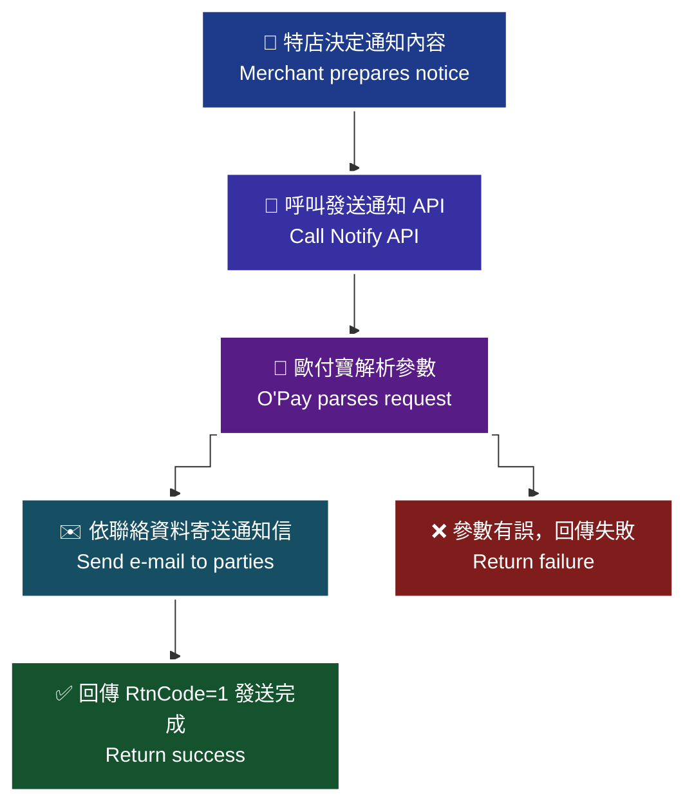

> ♿ 配色遵循 [`docs/accessibility.md`](../docs/accessibility.md)：WCAG AAA 對比 ≥7:1、Okabe-Ito 色盲安全色盤、16px 字體、直角連線、圖示＋文字雙編碼。
> ⚠️ 圖內細節未能自官方文件的文字內容取得，本圖依 API 語意重繪，請以官方文件圖片為準。

### 傳入參數（外層）

| 參數 | 參數名稱 | 型態 | 必填 | 說明 |
| --- | --- | --- | --- | --- |
| `PlatformID` | 特約合作平台商代號 | String(10) | — | 1. 提供特約合作平台商向歐付寶申請開通後使用，一般廠商介接請放空值。<br>2. 平台商使用時，MerchantID(特店編號)欄位僅限帶入已綁定子廠商的特店編號，以免造成失敗。 |
| `MerchantID` | 特店編號 | String(10) | ✅ | 1. 測試環境合作特店編號　2. 正式環境金鑰取得 |
| `RqHeader` | 傳入資料 | （物件） | ✅ | — |
| `RqHeader.Timestamp` | 傳入時間 | Number | ✅ | 歐付寶會利用此參數將當下的時間轉為 Unix TimeStamp 來驗證此次介接的時間區間。注意事項：1. 驗證時間區間暫訂為 10 分鐘內有效，若超過此驗證時間則此次訂單將無法建立，參考資料：http://www.epochconverter.com/ 。2. 合作特店須進行主機「時間校正」，避免主機產生時差，延伸 API 無法正常運作。 |
| `Data` | 加密資料 | String | ✅ | 回傳相關資料，此為加密過 JSON 格式的資料。加密方法說明 |

外層範例：

```json
{
    "MerchantID": "2000132",
    "RqHeader": {
        "Timestamp": 1525168923
    },
    "Data": "…"
}
```

### 傳入 Data 參數（加密前的 JSON）

| 參數 | 參數名稱 | 型態 | 必填 | 說明 |
| --- | --- | --- | --- | --- |
| `MerchantID` | 特店編號 | String(10) | ✅ | — |
| `InvoiceDate` | 發票開立日期 | String(20) | ✅ | 格式為 yyyy-mm-dd |
| `InvoiceNumber` | 發票號碼 | String(10) | ✅ | — |
| `AllowanceNo` | 折讓單編號 | String(16) | — | 長度固定為 16 碼 |
| `NotifyMail` | 發送電子郵件 | String(80) | ✅ | 1. 僅接受 Email 的標準格式　2. 可輸入多組，以半形分號(;)區隔 |
| `InvoiceTag` | 發送內容類型 | String(1) | ✅ | **交換模式：** `1`:發票開立　`2`:發票作廢　`3`:發票退回　`4`:開立折讓　`5`:作廢折讓　`6`:開立發票確認　`7`:作廢發票確認　`8`:退回發票確認　`9`:折讓確認　`10`:作廢折讓確認<br>**存證模式：** `1`:發票開立　`2`:發票作廢　`3`:發票退回　`4`:開立折讓<br>注意事項：1. 存證模式下，根據財政部文件規定只允許買方開立作廢折讓，因此以賣方角度使用 5.作廢折讓通知，會收到買/賣方錯誤，實際意義為無須再另行通知給作廢折讓開立方。 |
| `Notified` | 發送對象 | String(1) | ✅ | `C`: 發送通知給客戶　`M`: 發送通知給合作特店　`A`: 皆發送通知 |

### 傳入 Data 範例

```json
{
    "MerchantID": "2000132",
    "InvoiceDate": "2019-09-04",
    " InvoiceNumber": "VG11000000",
    " NotifyMail": "abc5678@gmail.com; def5678@gmail.com ",
    " InvoiceTag": 1,
    " Notified": "C"
}
```

> ⚠️ 原文範例語法瑕疵，已照原文保留。（`InvoiceNumber`、`NotifyMail`、`InvoiceTag`、`Notified` 四個 key 前多了半形空白；`InvoiceTag` 型態為 String(1) 但範例帶入數值 `1` 而非字串。實作時請使用正確的 key 名稱與型態。）

### 回傳參數（外層）

| 參數 | 參數名稱 | 型態 | 說明 |
| --- | --- | --- | --- |
| `PlatformID` | 特約合作平台商代號 | String(10) | — |
| `MerchantID` | 特店編號 | String(10) | — |
| `RpHeader` | 回傳資料 | （物件） | — |
| `RpHeader.Timestamp` | 回傳時間 | Number | — |
| `TransCode` | 回傳代碼 | Int | 1 代表傳輸資料(MerchantID, RqHeader, Data)接收成功，其餘均為失敗 |
| `TransMsg` | 回傳訊息 | String(200) | — |
| `Data` | 加密資料 | String | 回傳相關資料，此為加密過 JSON 格式的資料。加密方法說明 |

外層範例：

```json
{
    "MerchantID": "2000132",
    "RpHeader": {
        "Timestamp": 1525169058
    },
    "TransCode": 1,
    "TransMsg": "",
    "Data": "…"
}
```

### 回傳 Data 參數

| 參數 | 參數名稱 | 型態 | 說明 |
| --- | --- | --- | --- |
| `RtnCode` | 回應代碼 | Int | 1 為成功，其餘為失敗。 |
| `RtnMsg` | 回應訊息 | String(200) | — |

### 回傳 Data 範例

```json
{
    "RtnCode": 1,
    "RtnMsg": "發送完成"
}
```

### 注意事項

- ※注意事項：(1) 測試環境下歐付寶不會『主動』發送任何通知，需於廠商管理後臺使用『補發通知』，才會寄送通知信到指定信箱。
- 存證模式下，根據財政部文件規定只允許買方開立作廢折讓，因此以賣方角度使用 5.作廢折讓通知，會收到買/賣方錯誤，實際意義為無須再另行通知給作廢折讓開立方。
- `NotifyMail` 僅接受 Email 的標準格式，可輸入多組並以半形分號(;)區隔。
- `AllowanceNo` 長度固定為 16 碼。
- `RqHeader.Timestamp` 驗證時間區間暫訂為 10 分鐘內有效；合作特店須進行主機「時間校正」。

---
## 3. 字軌與配號設定 — `AddInvoiceWordSetting`

- **來源**：i200 §5
- **用途**：當營業人（特店）取得財政部的配號結果後，可建立當年度（含當月）或下個年度的字軌。在開立發票之前，必須先設定字軌區間，並且可設定多組。
- **HTTP Method**：POST（`Content-Type: application/json`）
- **測試環境**：`https://einvoice-stage.opay.tw/B2BInvoice/AddInvoiceWordSetting`
- **正式環境**：`https://einvoice.opay.tw/B2BInvoice/AddInvoiceWordSetting`

### 應用流程（原文：新增字軌情境流程圖）

> 🧭 **純文字重述（螢幕閱讀器友善）**：營業人先於財政部電子發票整合服務平台取得配號結果，自行檢核字軌正確性後，呼叫 `AddInvoiceWordSetting` 送出年度、期別、字軌類別、字軌與起訖號碼；歐付寶檢核並建立字軌，回傳 `TrackID`。新增後字軌狀態預設為「已審核通過但未啟用」，需再以第 6 章 `UpdateInvoiceWordStatus` 啟用才能開立發票。

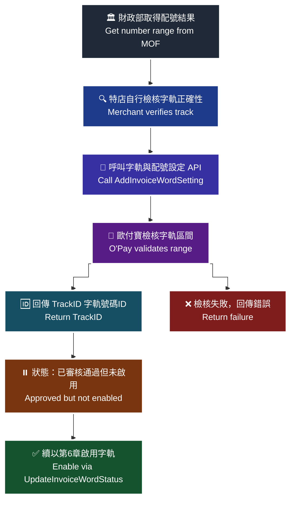

> ♿ 配色遵循 [`docs/accessibility.md`](../docs/accessibility.md)：WCAG AAA 對比 ≥7:1、Okabe-Ito 色盲安全色盤、16px 字體、直角連線、圖示＋文字雙編碼。
> ⚠️ 圖內細節未能自官方文件的文字內容取得，本圖依 API 語意重繪，請以官方文件圖片為準。

### 傳入參數（外層）

| 參數 | 參數名稱 | 型態 | 必填 | 說明 |
| --- | --- | --- | --- | --- |
| `PlatformID` | 特約合作平台商代號 | String(10) | — | 1. 提供特約合作平台商向歐付寶申請開通後使用，一般廠商介接請放空值。<br>2. 平台商使用時，MerchantID(特店編號)欄位僅限帶入已綁定子廠商的特店編號，以免造成失敗。 |
| `MerchantID` | 特店編號 | String(10) | ✅ | 1. 測試環境合作特店編號　2. 正式環境金鑰取得 |
| `RqHeader` | 傳入資料 | （物件） | ✅ | — |
| `RqHeader.Timestamp` | 傳入時間 | Number | ✅ | 歐付寶會利用此參數將當下的時間轉為 Unix TimeStamp 來驗證此次介接的時間區間。注意事項：1. 驗證時間區間暫訂為 10 分鐘內有效，若超過此驗證時間則此次訂單將無法建立，參考資料：http://www.epochconverter.com/ 。2. 合作特店須進行主機「時間校正」，避免主機產生時差，延伸 API 無法正常運作。 |
| `Data` | 加密資料 | String | ✅ | 資料內容，此為加密過 JSON 格式的資料。加密方法說明 |

外層範例：

```json
{
    "MerchantID": "2000132",
    "RqHeader": {
        "Timestamp": 1525168923
    },
    "Data": "…"
}
```

### 傳入 Data 參數（加密前的 JSON）

| 參數 | 參數名稱 | 型態 | 必填 | 說明 |
| --- | --- | --- | --- | --- |
| `MerchantID` | 特店編號 | String(10) | ✅ | — |
| `InvoiceTerm` | 發票期別 | Int | ✅ | `1`: 1-2月，`2`: 3-4月，`3`: 5-6月，`4`: 7-8月，`5`: 9-10月，`6`: 11-12月<br>注意事項: 不可帶入小於當年的期別 |
| `InvoiceYear` | 發票年度 | String(3) | ✅ | 僅可設定當年與明年 ex:109 |
| `InvType` | 字軌類別 | String(2) | ✅ | `07`:一般稅額發票，`08`:特種稅額發票 |
| `InvoiceCategory` | 發票種類 | String(1) | ✅ | `2`:B2B，請固定填寫為 2 |
| `InvoiceHeader` | 發票字軌 | String(2) | ✅ | — |
| `InvoiceStart` | 起始發票編號 | String(8) | ✅ | 請輸入 8 碼發票號碼，尾數需為 00 或 50。(例：10000000) |
| `InvoiceEnd` | 結束發票編號 | String(8) | ✅ | 請輸入 8 碼發票號碼，尾數需為 49 或 99。(例：10000049) |

### 傳入 Data 範例

```json
{
    "MerchantID": "2000132",
    "InvoiceTerm": "1",
    "InvoiceYear": "109",
    "InvType": "07",
    "InvoiceCategory": "2",
    "InvoiceHeader": "TW",
    "InvoiceStart": "10000000",
    "InvoiceEnd": "10000049"
}
```

> ⚠️ 原文範例語法瑕疵，已照原文保留。（`InvoiceTerm` 型態為 Int，但範例帶入字串 `"1"`。）

### 回傳參數（外層）

| 參數 | 參數名稱 | 型態 | 說明 |
| --- | --- | --- | --- |
| `PlatformID` | 特約合作平台商代號 | String(10) | — |
| `MerchantID` | 特店編號 | String(10) | — |
| `RpHeader` | 回傳資料 | （物件） | — |
| `RpHeader.Timestamp` | 回傳時間 | Number | — |
| `TransCode` | 回傳代碼 | Int | 1 代表傳輸資料(MerchantID, RqHeader, Data)接收成功，其餘均為失敗 |
| `TransMsg` | 回傳訊息 | String(200) | 回傳訊息 |
| `Data` | 加密資料 | String | 資料內容，此為加密過 JSON 格式的資料。加密方法說明 |

外層範例：

```json
{
    "MerchantID": "2000132",
    "RpHeader": {
        "Timestamp": 1525169058
    },
    "TransCode": 1,
    "TransMsg": "",
    "Data": "…"
}
```

### 回傳 Data 參數

| 參數 | 參數名稱 | 型態 | 說明 |
| --- | --- | --- | --- |
| `RtnCode` | 回應代碼 | Int | 1 為成功，其餘為失敗。 |
| `RtnMsg` | 回應訊息 | String(200) | — |
| `TrackID` | 字軌號碼ID | String(10) | 需留存 TrackID 作為設定字軌號碼啟用狀態用 |

### 回傳 Data 範例

```json
{
     "RtnCode": 1,
    "RtnMsg": "成功",
  "TrackID": "1234567890"
}
```

### 注意事項

- ※注意事項：在新增字軌前須自行檢核字軌正確性。
- ※注意事項：新增字軌後，字軌狀態預設為已審核通過但未啟用，請使用第六章設定字軌號碼狀態進行啟用。
- `InvoiceTerm` 不可帶入小於當年的期別。
- `InvoiceYear` 僅可設定當年與明年。
- `InvoiceStart` 尾數需為 00 或 50；`InvoiceEnd` 尾數需為 49 或 99。
- 需留存回傳的 `TrackID`，作為設定字軌號碼啟用狀態之用。
- `RqHeader.Timestamp` 驗證時間區間暫訂為 10 分鐘內有效；合作特店須進行主機「時間校正」。

---
## 4. 設定字軌號碼狀態 — `UpdateInvoiceWordStatus`

- **來源**：i200 §6
- **用途**：營業人（特店）新增字軌後，字軌的預設狀態皆為已審核且未啟用。如欲使用字軌，必須先設定狀態將字軌啟用。在開立發票之前，必須先將已新增完成的字軌做狀態的設定。
- **HTTP Method**：POST（`Content-Type: application/json`）
- **測試環境**：`https://einvoice-stage.opay.tw/B2BInvoice/UpdateInvoiceWordStatus`
- **正式環境**：`https://einvoice.opay.tw/B2BInvoice/UpdateInvoiceWordStatus`

### 應用流程（原文：設定字軌號碼情境流程圖）

> 🧭 **純文字重述（螢幕閱讀器友善）**：特店以新增字軌時取得的 `TrackID` 呼叫 `UpdateInvoiceWordStatus`，帶入欲設定的 `InvoiceStatus`（0 停用、1 暫停、2 啟用）；歐付寶更新字軌狀態並回傳結果。狀態設為啟用後即可用該區間開立發票；設為停用時該字軌區間無法上傳發票。

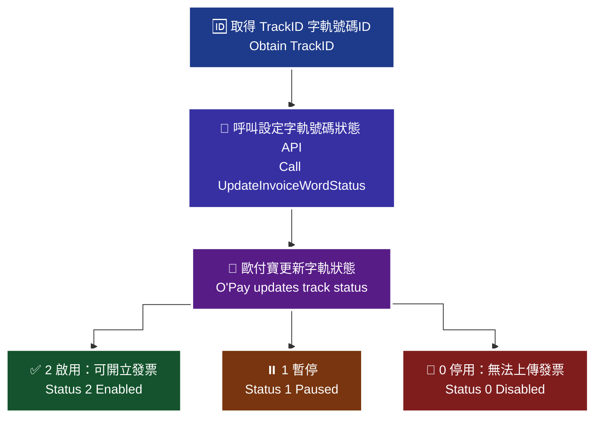

> ♿ 配色遵循 [`docs/accessibility.md`](../docs/accessibility.md)：WCAG AAA 對比 ≥7:1、Okabe-Ito 色盲安全色盤、16px 字體、直角連線、圖示＋文字雙編碼。
> ⚠️ 圖內細節未能自官方文件的文字內容取得，本圖依 API 語意重繪，請以官方文件圖片為準。

### 傳入參數（外層）

| 參數 | 參數名稱 | 型態 | 必填 | 說明 |
| --- | --- | --- | --- | --- |
| `PlatformID` | 特約合作平台商代號 | String(10) | — | 1. 提供特約合作平台商向歐付寶申請開通後使用，一般廠商介接請放空值。<br>2. 平台商使用時，MerchantID(特店編號)欄位僅限帶入已綁定子廠商的特店編號，以免造成失敗。 |
| `MerchantID` | 特店編號 | String(10) | ✅ | 1. 測試環境合作特店編號　2. 正式環境金鑰取得 |
| `RqHeader` | 傳入資料 | （物件） | — | 原文此列未標紅色星號（其他 API 皆為必填）。<br>> ⚠️ 原文未明確說明，介接前請向歐付寶確認。 |
| `RqHeader.Timestamp` | 傳入時間 | Number | ✅ | 歐付寶會利用此參數將當下的時間轉為 Unix TimeStamp 來驗證此次介接的時間區間。注意事項：1. 驗證時間區間暫訂為 10 分鐘內有效，若超過此驗證時間則此次訂單將無法建立，參考資料：http://www.epochconverter.com/ 。2. 合作特店須進行主機「時間校正」，避免主機產生時差，延伸 API 無法正常運作。 |
| `Data` | 加密資料 | String | ✅ | 資料內容，此為加密過 JSON 格式的資料。加密方法說明 |

外層範例：

```json
{
    "MerchantID": "2000123",
    "RqHeader": {
        "Timestamp": 1525168923
    },
    "Data": "…"
}
```

### 傳入 Data 參數（加密前的 JSON）

| 參數 | 參數名稱 | 型態 | 必填 | 說明 |
| --- | --- | --- | --- | --- |
| `MerchantID` | 特店編號 | String(10) | ✅ | — |
| `TrackID` | 字軌號碼ID | String(10) | ✅ | 為新增字軌後取到的 TrackID |
| `InvoiceStatus` | 發票字軌狀態 | Int | ✅ | `0`:停用, `1`:暫停, `2`:啟用<br>如狀態設定為停用，該字軌區間無法上傳發票 |

### 傳入 Data 範例

```json
{
    "MerchantID": "2000123",
    "TrackID": "1234567890",
     "InvoiceStatus": 2
}
```

### 回傳參數（外層）

| 參數 | 參數名稱 | 型態 | 說明 |
| --- | --- | --- | --- |
| `PlatformID` | 特約合作平台商代號 | String(10) | — |
| `MerchantID` | 特店編號 | String(10) | — |
| `RpHeader` | 回傳資料 | （物件） | — |
| `RpHeader.Timestamp` | 回傳時間 | Number | — |
| `TransCode` | 回傳代碼 | Int | 1 代表傳輸資料(MerchantID, RqHeader, Data)接收成功，其餘均為失敗 |
| `TransMsg` | 回傳訊息 | String(200) | 回傳訊息 |
| `Data` | 加密資料 | String | 資料內容，此為加密過 JSON 格式的資料。加密方法說明 |

外層範例：

```json
{
    "MerchantID": "2000123",
    "RpHeader": {
        "Timestamp": 1525169058
    },
    "TransCode": 1,
    "TransMsg": "",
    "Data": "…"
}
```

### 回傳 Data 參數

| 參數 | 參數名稱 | 型態 | 說明 |
| --- | --- | --- | --- |
| `RtnCode` | 回應代碼 | Int | 1 為成功，其餘為失敗。 |
| `RtnMsg` | 回應訊息 | String(200) | — |

### 回傳 Data 範例

```json
{
    "RtnCode": "1",
    "RtnMsg": "成功"
}
```

> ⚠️ 原文範例語法瑕疵，已照原文保留。（`RtnCode` 型態為 Int，但範例回傳字串 `"1"`。）

### 注意事項

- 新增字軌後預設狀態為「已審核且未啟用」，必須先以本 API 啟用才能開立發票。
- 如狀態設定為停用（`InvoiceStatus` = `0`），該字軌區間無法上傳發票。
- 前置準備事項另提醒：字軌通過審核後須啟用字軌；啟用後可暫停或停用發票字軌，但停用後無法再度啟用。
- `TrackID` 為新增字軌（§5 `AddInvoiceWordSetting`）後取得的值。
- `RqHeader.Timestamp` 驗證時間區間暫訂為 10 分鐘內有效；合作特店須進行主機「時間校正」。

---
## 5. 開立發票 — `Issue`

- **來源**：i200 §7
- **用途**：**交換模式**：特店（營業人）傳送開立發票參數給歐付寶加值中心後，由歐付寶暫存相關資料。歐付寶會於隔日開立發票後上傳至財政部電子發票整合服務平台，並根據發送通知 API 設定，通知交易相對人（營業人）電子發票已開立。**存證模式**：特店（營業人）在與交易相對人（營業人）達成合意後，特店傳送開立發票參數給歐付寶，由歐付寶暫存相關資料。歐付寶會於隔日開立發票後上傳至財政部電子發票整合服務平台，並根據發送通知 API 設定，通知交易相對人電子發票已開立。
- **HTTP Method**：POST（`Content-Type: application/json`）
- **測試環境**：`https://einvoice-stage.opay.tw/B2BInvoice/Issue`
- **正式環境**：`https://einvoice.opay.tw/B2BInvoice/Issue`

### 應用流程 A（原文：開立發票(交換模式)情境流程圖）

| 處理角色 | 流程名稱 | 處理說明 |
| --- | --- | --- |
| 特店 | 1.發送開立發票參數 | 特店呼叫開立發票 API 傳送發票開立參數。 |
| 歐付寶 | 2.回傳開立發票結果 | 接收並解析特店傳送過來的電子發票開立資料。確立發票開立資料無誤後，於歐付寶電子發票系統產生特店的電子發票開立資料。 |
| 歐付寶 | 3.上傳財政部 | 開立成功後，歐付寶會把開立成功的發票資料上傳財政部電子發票整合服務平台。 |
| 交易相對人 | 4.發票開立通知 | 上傳成功後，歐付寶會通知交易相對人電子發票已完成開立的訊息。 |

> 🧭 **純文字重述（螢幕閱讀器友善）**：交換模式下共四步。第一步，特店呼叫開立發票 API 傳送發票開立參數。第二步，歐付寶接收並解析資料，確認無誤後於系統產生電子發票開立資料並回傳結果。第三步，歐付寶於隔日將開立成功的發票上傳財政部電子發票整合服務平台。第四步，上傳成功後通知交易相對人電子發票已完成開立。此時發票屬於有效憑證，但尚未完成交換，須待交易相對人確認。

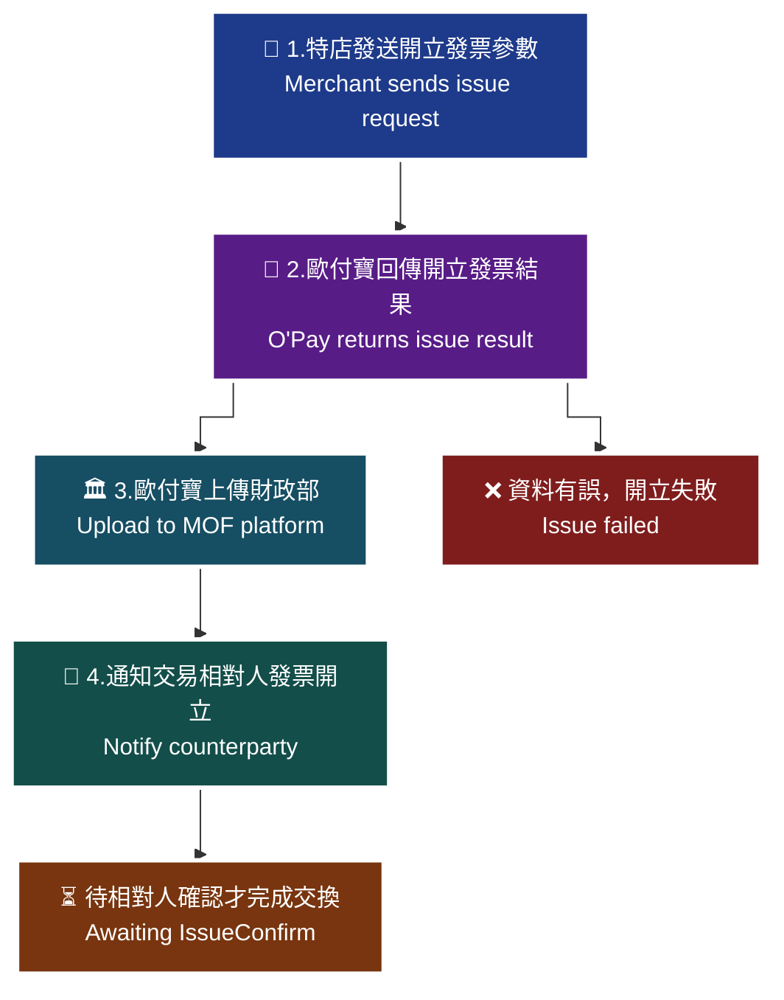

> ♿ 配色遵循 [`docs/accessibility.md`](../docs/accessibility.md)：WCAG AAA 對比 ≥7:1、Okabe-Ito 色盲安全色盤、16px 字體、直角連線、圖示＋文字雙編碼。
> ⚠️ 圖內細節未能自官方文件的文字內容取得，本圖依 API 語意重繪，請以官方文件圖片為準。

### 應用流程 B（原文：開立發票(存證模式)情境流程圖）

| 處理角色 | 流程名稱 | 處理說明 |
| --- | --- | --- |
| 特店 | 1.達成交換合意 | 特店與交易相對人對於發票開立內容達成合意 |
| 特店 | 2.發送開立發票參數 | 特店呼叫開立發票 API 傳送發票開立參數。 |
| 歐付寶 | 3.回傳開立發票結果 | 接收並解析特店傳送過來的電子發票開立資料。確立發票開立資料無誤後，於歐付寶電子發票系統產生特店的電子發票開立資料。 |
| 歐付寶 | 4.上傳財政部 | 開立成功後，歐付寶會把開立成功的發票資料上傳財政部電子發票整合服務平台。 |
| 交易相對人 | 5.發票開立通知 | 上傳成功後，歐付寶會通知交易相對人電子發票已完成開立的訊息。 |

> 🧭 **純文字重述（螢幕閱讀器友善）**：存證模式下共五步。第一步，特店與交易相對人對於發票開立內容達成合意。第二步，特店呼叫開立發票 API 傳送發票開立參數。第三步，歐付寶解析資料無誤後產生電子發票開立資料並回傳結果。第四步，歐付寶於隔日將開立成功的發票上傳財政部電子發票整合服務平台。第五步，上傳成功後通知交易相對人電子發票已完成開立。存證模式無須交換確認。

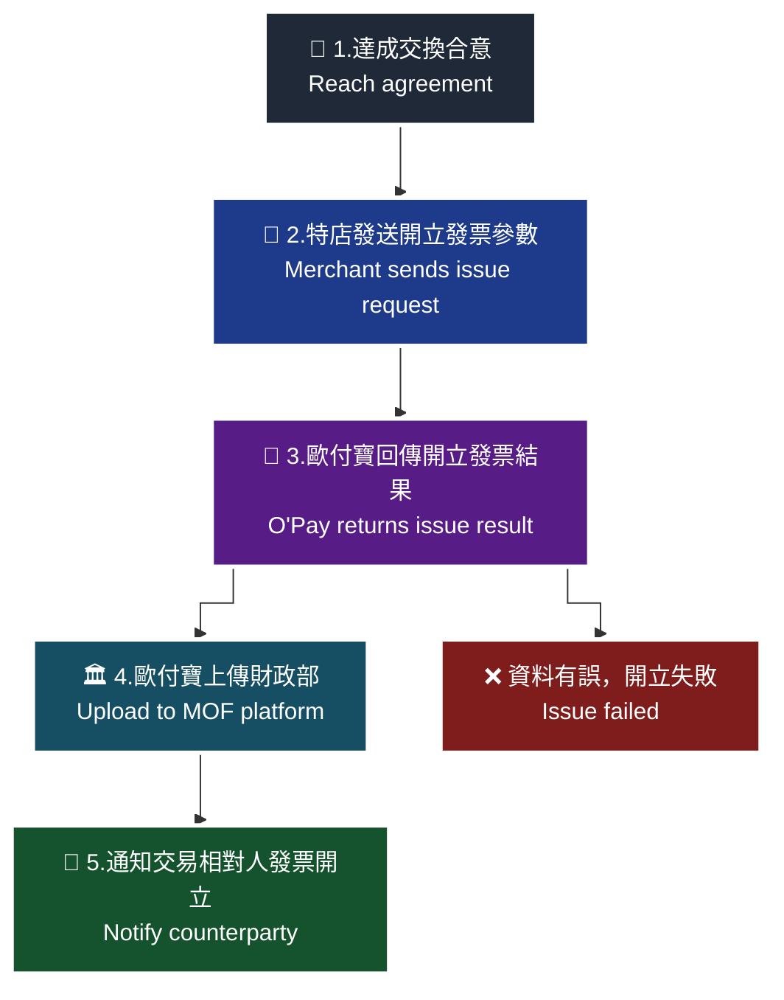

> ♿ 配色遵循 [`docs/accessibility.md`](../docs/accessibility.md)：WCAG AAA 對比 ≥7:1、Okabe-Ito 色盲安全色盤、16px 字體、直角連線、圖示＋文字雙編碼。
> ⚠️ 圖內細節未能自官方文件的文字內容取得，本圖依 API 語意重繪，請以官方文件圖片為準。

### 傳入參數（外層）

| 參數 | 參數名稱 | 型態 | 必填 | 說明 |
| --- | --- | --- | --- | --- |
| `PlatformID` | 特約合作平台商代號 | String(10) | — | 1. 提供特約合作平台商向歐付寶申請開通後使用，一般廠商介接請放空值。<br>2. 平台商使用時，MerchantID(特店編號)欄位僅限帶入已綁定子廠商的特店編號，以免造成失敗。 |
| `MerchantID` | 特店編號 | String(10) | ✅ | 1. 測試環境合作特店編號　2. 正式環境金鑰取得 |
| `RqHeader` | 傳入資料 | （物件） | ✅ | — |
| `RqHeader.Timestamp` | 傳入時間 | Number | ✅ | 歐付寶會利用此參數將當下的時間轉為 Unix TimeStamp 來驗證此次介接的時間區間。注意事項：1. 驗證時間區間暫訂為 10 分鐘內有效，若超過此驗證時間則此次訂單將無法建立，參考資料：http://www.epochconverter.com/ 。2. 合作特店須進行主機「時間校正」，避免主機產生時差，延伸 API 無法正常運作。 |
| `Data` | 加密資料 | String | ✅ | 回傳相關資料，此為加密過 JSON 格式的資料。加密方法說明 |

外層範例：

```json
{
    "MerchantID": "2000132",
    "RqHeader": {
        "Timestamp": 1525168923
    },
    "Data": "…"
}
```

### 傳入 Data 參數（加密前的 JSON）

| 參數 | 參數名稱 | 型態 | 必填 | 說明 |
| --- | --- | --- | --- | --- |
| `MerchantID` | 特店編號 | String(10) | ✅ | — |
| `RelateNumber` | 廠商自訂編號 | String(20) | ✅ | 均為唯一值不可重覆使用 |
| `InvoiceTime` | 發票開立時間 | String(20) | — | 格式為 yyyy-mm-dd hh:mm:ss　1. 參數有值時，僅接受過去 6 天內日期，並注意順時順號　2. 建議不帶值，系統會自動開立當下日期 |
| `CustomerIdentifier` | 買方統編 | String(8) | ✅ | — |
| `CustomerEmail` | 買方電子信箱 | String(80) | — | 1. 僅接受 Email 的標準格式。 2. 多組 Email 請以半形分號區隔，未帶值時自動帶入交易對象維護 API 設定的資料<br>注意事項：1.測試環境請勿帶入之真實電子信箱，避免個資外洩。 2.測試環境僅作 API 串接測試使用，僅以 API 回覆成功或失敗；批次匯入功能/API 不提供發信測試，僅驗規則。 |
| `CustomerAddress` | 買方公司地址 | String(100) | — | — |
| `CustomerTelephoneNumber` | 買方電話號碼 | String(30) | — | — |
| `ClearanceMark` | 通關方式註記 | String(1) | 條件 | 當課稅類別[TaxType]為 2(零稅率)時，則該參數請帶 `1`(非經海關出口)或 `2`(經海關出口) |
| `InvType` | 字軌類別 | String(2) | ✅ | `07`(一般稅額計算之電子發票)、`08`(特種稅額計算之電子發票) |
| `TaxType` | 課稅別 | String(1) | ✅ | 1. 當字軌類別[InvType]為 `07`(一般稅額計算之電子發票)時，則該參數請帶 `1`(一般應稅)、`2`(零稅率)或 `3`(免稅)　2. 當字軌類別[InvType]為 `08`(特種稅額計算之電子發票)時，則該參數請帶 `3`(免稅)、`4`(特種應稅) |
| `ZeroTaxRateReason` | 零稅率原因 | String(2) | 條件 | \*預設 `71`：外銷貨物<br>(當課稅類別[TaxType]為 2(零稅率) 時，零稅率原因為必填，若廠商回傳時無帶值，預設 71)<br>`71`：第一款 外銷貨物<br>`72`：第二款 與外銷有關之勞務，或在國內提供而在國外使用之勞務<br>`73`：第三款 依法設立之免稅商店銷售與過境或出境旅客之貨物<br>`74`：第四款 銷售與保稅區營業人供營運之貨物或勞務<br>`75`：第五款 國際間之運輸。但外國運輸事業在中華民國境內經營國際運輸業務者，應以各該國對中華民國國際運輸事業予以相等待遇或免徵類似稅捐者為限<br>`76`：第六款 國際運輸用之船舶、航空器及遠洋漁船<br>`77`：第七款 銷售與國際運輸用之船舶、航空器及遠洋漁船所使用之貨物或修繕勞務<br>`78`：第八款 保稅區營業人銷售與課稅區營業人未輸往課稅區而直接出口之貨物<br>`79`：第九款 保稅區營業人銷售與課稅區營業人存入自由港區事業或海關管理之保稅倉庫、物流中心以供外銷之貨物 |
| `TaxRate` | 稅率 | Number | — | 1. 當課稅類別[TaxType]為 1(一般應稅)時，則該參數非必填 (系統會帶 0.05)　2. 當課稅類別[TaxType]為 2(零稅率)時，則該參數非必填(系統會帶 0)　3. 當課稅類別[TaxType]為 3(免稅)時，則該參數非必填(系統會帶 0)　4. 當發票類別[TaxType]為 4(特種應稅)時，則該參數無須填寫 (請設定參數特種稅額類別[SpecialTaxType]) |
| `SpecialTaxType` | 特種稅額類別 | String(1) | 條件 | 當課稅別為 3 (免稅)時，則該參數必填，請填入數字【8】　當課稅別為 4 (特種應稅)時，則該參數必填，可填入數字【1-8】 分別代表以下類別與稅率<br>-【1】代表酒家及有陪侍服務之茶室、咖啡廳、酒吧之營業稅稅率，稅率為 25%<br>-【2】代表夜總會、有娛樂節目之餐飲店之營業稅稅率，稅率為 15%<br>-【3】代表銀行業、保險業、信託投資業、證券業、期貨業、票券業及典當業之專屬本業收入(不含銀行業、保險業經營銀行、保險本業收入)之營業稅稅率，稅率為 2%<br>-【4】代表保險業之再保費收入之營業稅稅率，稅率為 1%<br>-【5】代表銀行業、保險業、信託投資業、證券業、期貨業、票券業及典當業之非專屬本業收入之營業稅稅率，稅率為 5%<br>-【6】代表銀行業、保險業經營銀行、保險本業收入之營業稅稅率(適用於民國 103 年 07 月以後銷售額) ，稅率為 5%<br>-【7】代表銀行業、保險業經營銀行、保險本業收入之營業稅稅率(適用於民國 103 年 06 月以前銷售額) ，稅率為 5%<br>-【8】代表空白為免稅或非銷項特種稅額之資料 |
| `Items` | 傳入資料 | （陣列） | ✅ | 商品明細陣列 |
| `Items[].ItemSeq` | 明細排列序號 | Int | ✅ | 1. 請帶 1~999 的整數值　2. 商品排序不可重複 |
| `Items[].ItemName` | 商品名稱 | String(256) | ✅ | — |
| `Items[].ItemCount` | 商品數量 | Number | ✅ | 支援整數最多 8 位，小數 2 位 |
| `Items[].ItemWord` | 商品單位 | String(6) | — | 商品單位最多是 6 碼 |
| `Items[].ItemPrice` | 商品價格 | Number | ✅ | 支援整數最多 8 位，小數 7 位 |
| `Items[].ItemAmount` | 商品合計 | Number | ✅ | 1. 支援整數最多 12 位，小數 7 位　2. 定義【商品數量[ItemCount]*商品價格[ItemPrice]】=A，則商品合計的值與 A 四捨五入後的值，差距不可大於 1 |
| `Items[].ItemTax` | 商品稅額 | Int | — | 1. 須為整數　2. 若商品稅額[ItemTax]有值，定義【商品合計[ItemAmount]*稅率[TaxRate]】=B，則商品稅額的值與 B 四捨五入後的值，差距不可大於 1<br>注意事項：1. 財政部無提供此參數格式，此處提供營業人檢核營業稅額合計[TaxAmount]用，不會上傳。 2. 特種稅額發票請直接帶 0 |
| `Items[].ItemRemark` | 商品備註 | String(200) | — | — |
| `SalesAmount` | 銷售額合計 | Int | ✅ | 1. 請帶整數，不可有小數點，不可為 0 元　2. 需等於商品金額[ItemAmount]加總後四捨五入至整數的值 |
| `TaxAmount` | 稅額合計 | Int | ✅ | 1. 請帶整數，不可有小數點。 2. 定義【銷售額合計[SalesAmount]乘以稅率[TaxRate]後再四捨五入至整數】為 C, 則稅額合計[TaxAmount]的值與 C 的差距不可大於 2<br>注意事項：1. 特種稅額發票請直接帶 0 |
| `TotalAmount` | 發票金額 | Int | ✅ | 1. 請帶整數，不可有小數點，不可為 0 元　2. 需等於銷售額合計[SalesAmount]與稅額合計[TaxAmount]相加 |
| `InvoiceRemark` | 發票備註 | String(200) | — | — |

### 傳入 Data 範例

```json
{
    "MerchantID": "2000132",
    "RelateNumber": "20190922000000003",
    "InvoiceTime": "2019/09/22 00:00:00",
    "CustomerIdentifier": "23165448",
    "CustomerEmail": "",
    "ClearanceMark": "1",
    "InvType": "07",
    "TaxType": 1,
    "TaxRate": 0.05,
    "SalesAmount": 100,
    "TaxAmount": 5,
    "TotalAmount": 105,
    "InvoiceRemark": "發票備註",
    "Items": [
        {
            "ItemSeq": 1,
            "ItemName": "item01",
            "ItemCount": 1,
            "ItemWord": "件",
            "ItemPrice": 50,
            "ItemAmount": 50,
            "ItemTax": 2,
            "ItemRemark": "item01_desc"
        },
        {
            "ItemSeq": 2,
            "ItemName": "item02",
            "ItemCount": 1,
            "ItemWord": "個",
            "ItemPrice": 20,
            "ItemAmount": 20,
            "ItemTax": 1,
            "ItemRemark": "item02_desc"
        },
        {
            "ItemSeq": 3,
            "ItemName": "item03",
            "ItemCount": 3,
            "ItemWord": "粒",
            "ItemPrice": 10,
            "ItemAmount": 30,
            "ItemTax": 2,
            "ItemRemark": "item03_desc"
        }
    ]
}
```

> ⚠️ 原文範例語法瑕疵，已照原文保留。（`InvoiceTime` 規格為 `yyyy-mm-dd hh:mm:ss`，但範例使用 `2019/09/22 00:00:00`；`TaxType` 型態為 String(1)，但範例帶入數值 `1`。本範例縮排已修正 Word 造成的錯亂，內容未更動。）

### 回傳參數（外層）

| 參數 | 參數名稱 | 型態 | 說明 |
| --- | --- | --- | --- |
| `PlatformID` | 特約合作平台商代號 | String(10) | — |
| `MerchantID` | 特店編號 | String(10) | — |
| `RpHeader` | 回傳資料 | （物件） | — |
| `RpHeader.Timestamp` | 回傳時間 | Number | — |
| `TransCode` | 回傳代碼 | Int | 1 代表傳輸資料(MerchantID, RqHeader, Data)接收成功，其餘均為失敗 |
| `TransMsg` | 回傳訊息 | String(200) | — |
| `Data` | 加密資料 | String | 回傳相關資料，此為加密過 JSON 格式的資料。加密方法說明 |

外層範例：

```json
{
    "MerchantID": "2000132",
    "RpHeader": {
        "Timestamp": 1525169058
    },
    "TransCode": 1,
    "TransMsg": "",
    "Data": "…"
}
```

### 回傳 Data 參數

| 參數 | 參數名稱 | 型態 | 說明 |
| --- | --- | --- | --- |
| `RtnCode` | 回應代碼 | Int | 1 為成功，其餘為失敗。 |
| `RtnMsg` | 回應訊息 | String(200) | — |
| `InvoiceNumber` | 發票號碼 | String(10) | 若開立成功，則會回傳一組發票號碼；若開立失敗，則會回傳空值。 |
| `RandomNumber` | 隨機碼 | String(4) | — |

### 回傳 Data 範例

```json
{
    "RtnCode": 1,
    "RtnMsg": "新增成功",
    "InvoiceNumber": "VG11000002",
    "RandomNumber": "6686"
}
```

### 注意事項

- 交換模式注意事項：需等待交易相對人（營業人）確認後才完成交換，此時發票狀態為已開立成功，屬於有效憑證，只是尚未完成交換，尚未完成交換的發票無法進行折讓、作廢等操作。
- `RelateNumber` 均為唯一值不可重覆使用。
- `InvoiceTime` 參數有值時僅接受過去 6 天內日期，並注意順時順號；建議不帶值，系統會自動開立當下日期。
- `CustomerEmail` 測試環境請勿帶入真實電子信箱，避免個資外洩；測試環境僅作 API 串接測試使用，僅以 API 回覆成功或失敗，批次匯入功能／API 不提供發信測試，僅驗規則。
- 當 `TaxType` = `2`（零稅率）時，`ClearanceMark` 須帶 1(非經海關出口) 或 2(經海關出口)，且 `ZeroTaxRateReason` 為必填，未帶值時預設 `71`。
- `SpecialTaxType`：課稅別為 3(免稅) 時必填【8】；課稅別為 4(特種應稅) 時必填【1-8】。
- `Items[].ItemTax`：財政部無提供此參數格式，此處提供營業人檢核營業稅額合計 `TaxAmount` 用，不會上傳；特種稅額發票請直接帶 0。
- `TaxAmount`：特種稅額發票請直接帶 0。
- `SalesAmount`、`TotalAmount` 不可有小數點且不可為 0 元；`TotalAmount` 需等於 `SalesAmount` + `TaxAmount`。
- `Items[].ItemSeq` 請帶 1~999 的整數值，商品排序不可重複。
- 開立發票前必須已完成交易對象維護（§3）與字軌設定並啟用（§5、§6）。
- `RqHeader.Timestamp` 驗證時間區間暫訂為 10 分鐘內有效；合作特店須進行主機「時間校正」。

---
## 6. 開立發票確認 — `IssueConfirm`

- **來源**：i200 §8
- **用途**：**交換模式**：特店（營業人）收到開立發票訊息通知後，傳送開立發票確認參數給歐付寶加值中心，由歐付寶暫存相關資料。歐付寶會於隔日將開立發票確認訊息上傳至財政部電子發票整合服務平台，完成發票開立交換。並根據發送通知 API 設定，通知交易相對人（營業人）電子發票開立已完成確認。
- **HTTP Method**：POST（`Content-Type: application/json`）
- **測試環境**：`https://einvoice-stage.opay.tw/B2BInvoice/IssueConfirm`
- **正式環境**：`https://einvoice.opay.tw/B2BInvoice/IssueConfirm`

### 應用流程（原文：開立發票確認情境流程圖）

| 處理角色 | 流程名稱 | 處理說明 |
| --- | --- | --- |
| 特店 | 1.發送開立發票確認參數 | 特店呼叫開立發票確認 API 傳送發票開立確認參數。 |
| 歐付寶 | 2.回傳開立發票確認結果 | 接收並解析特店傳送過來的電子發票開立確認資料。確定開立發票確認無誤後，於歐付寶電子發票系統產生特店的電子發票開立確認資料。 |
| 歐付寶 | 3.上傳財政部 | 開立發票確認成功後，歐付寶會把確認成功的發票資料上傳財政部電子發票整合服務平台。 |
| 交易相對人 | 4.發票開立通知 | 上傳成功後，歐付寶會通知交易相對人電子發票已確認成功的訊息。 |

> 🧭 **純文字重述（螢幕閱讀器友善）**：共四步。第一步，特店呼叫開立發票確認 API 傳送發票開立確認參數。第二步，歐付寶接收並解析資料，確認無誤後於系統產生電子發票開立確認資料並回傳結果。第三步，歐付寶於隔日將確認成功的發票資料上傳財政部電子發票整合服務平台，完成發票開立交換。第四步，上傳成功後通知交易相對人電子發票已確認成功。

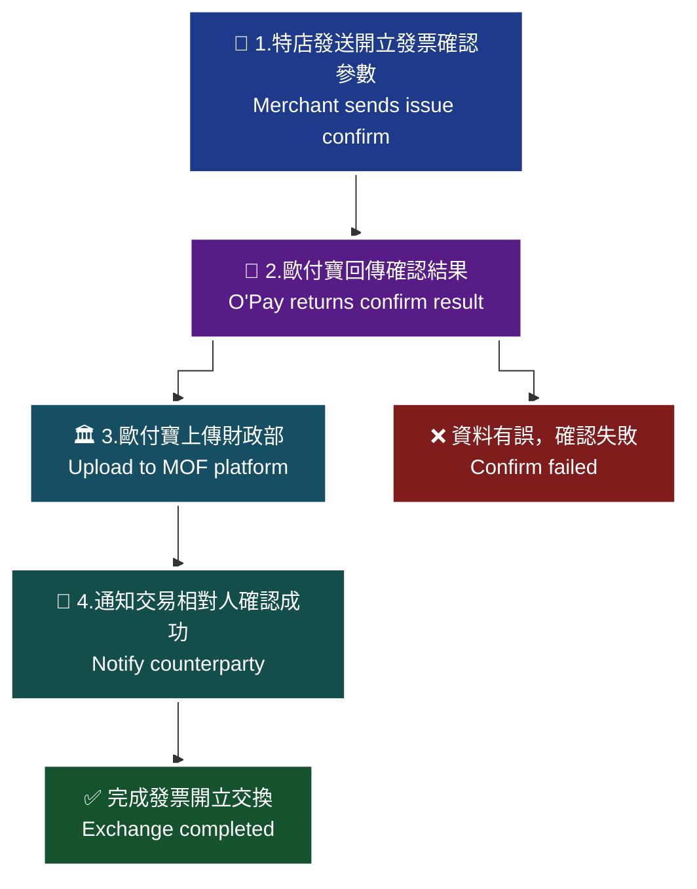

> ♿ 配色遵循 [`docs/accessibility.md`](../docs/accessibility.md)：WCAG AAA 對比 ≥7:1、Okabe-Ito 色盲安全色盤、16px 字體、直角連線、圖示＋文字雙編碼。
> ⚠️ 圖內細節未能自官方文件的文字內容取得，本圖依 API 語意重繪，請以官方文件圖片為準。

### 傳入參數（外層）

| 參數 | 參數名稱 | 型態 | 必填 | 說明 |
| --- | --- | --- | --- | --- |
| `PlatformID` | 特約合作平台商代號 | String(10) | — | 1. 提供特約合作平台商向歐付寶申請開通後使用，一般廠商介接請放空值。<br>2. 平台商使用時，MerchantID(特店編號)欄位僅限帶入已綁定子廠商的特店編號，以免造成失敗。 |
| `MerchantID` | 特店編號 | String(10) | ✅ | 1. 測試環境合作特店編號　2. 正式環境金鑰取得 |
| `RqHeader` | 傳入資料 | （物件） | ✅ | — |
| `RqHeader.Timestamp` | 傳入時間 | Number | ✅ | 歐付寶會利用此參數將當下的時間轉為 Unix TimeStamp 來驗證此次介接的時間區間。注意事項：1. 驗證時間區間暫訂為 10 分鐘內有效，若超過此驗證時間則此次訂單將無法建立，參考資料：http://www.epochconverter.com/ 。2. 合作特店須進行主機「時間校正」，避免主機產生時差，延伸 API 無法正常運作。 |
| `Data` | 加密資料 | String | ✅ | 回傳相關資料，此為加密過 JSON 格式的資料。加密方法說明 |

外層範例：

```json
{
    "MerchantID": "2000132",
    "RqHeader": {
        "Timestamp": 1525168923
    },
    "Data": "…"
}
```

### 傳入 Data 參數（加密前的 JSON）

| 參數 | 參數名稱 | 型態 | 必填 | 說明 |
| --- | --- | --- | --- | --- |
| `MerchantID` | 特店編號 | String(10) | ✅ | — |
| `InvoiceNumber` | 發票號碼 | String(10) | ✅ | — |
| `InvoiceDate` | 發票開立日期 | String(20) | — | 格式為 yyyy-mm-dd |
| `Remark` | 備註 | String(200) | — | — |

### 傳入 Data 範例

```json
{
    "MerchantID": "2000132",
    "InvoiceNumber": " VG11000002",
    "InvoiceDate": "2019/09/22",
    "Remark": ""
}
```

> ⚠️ 原文範例語法瑕疵，已照原文保留。（`InvoiceNumber` 值前多了半形空白；`InvoiceDate` 規格為 `yyyy-mm-dd`，但範例使用 `2019/09/22`。）

### 回傳參數（外層）

| 參數 | 參數名稱 | 型態 | 說明 |
| --- | --- | --- | --- |
| `PlatformID` | 特約合作平台商代號 | String(10) | — |
| `MerchantID` | 特店編號 | String(10) | — |
| `RpHeader` | 回傳資料 | （物件） | — |
| `RpHeader.Timestamp` | 回傳時間 | Number | — |
| `TransCode` | 回傳代碼 | Int | 1 代表傳輸資料(MerchantID, RqHeader, Data)接收成功，其餘均為失敗 |
| `TransMsg` | 回傳訊息 | String(200) | 回傳訊息 |
| `Data` | 加密資料 | String | 回傳相關資料，此為加密過 JSON 格式的資料。加密方法說明 |

外層範例：

```json
{
    "MerchantID": "2000132",
    "RpHeader": {
        "Timestamp": 1525169058
    },
    "TransCode": 1,
    "TransMsg": "",
    "Data": "…"
}
```

### 回傳 Data 參數

| 參數 | 參數名稱 | 型態 | 說明 |
| --- | --- | --- | --- |
| `RtnCode` | 回應代碼 | Int | 1 為成功，其餘為失敗。 |
| `RtnMsg` | 回應訊息 | String(200) | — |

### 回傳 Data 範例

```json
{
    "RtnCode": 1,
    "RtnMsg": "新增成功"
}
```

### 注意事項

- 本 API 適用於交換模式；未完成確認的發票雖屬有效憑證，但尚未完成交換，無法進行折讓、作廢等操作。
- 歐付寶會於隔日將開立發票確認訊息上傳至財政部電子發票整合服務平台。
- `RqHeader.Timestamp` 驗證時間區間暫訂為 10 分鐘內有效；合作特店須進行主機「時間校正」。
- 平台商使用 `PlatformID` 時，`MerchantID` 僅限帶入已綁定子廠商的特店編號。

---
## 7. 作廢發票 — `Invalid`

- **來源**：i200 §9
- **用途**：**交換模式**：交易雙方因發生銷貨退回或發票內容開立錯誤，由特店（營業人）傳送作廢發票參數給歐付寶加值中心後，由歐付寶暫存相關資料。歐付寶會於隔日將發票作廢後上傳至財政部電子發票整合服務平台，同時根據發送通知 API 設定，通知交易相對人（營業人）電子發票已作廢。**存證模式**：交易雙方因發生銷貨退回或發票內容開立錯誤，特店在與交易相對人達成合意後傳送作廢發票參數給歐付寶，由歐付寶暫存相關資料，隔日將發票作廢後上傳財政部並依設定通知交易相對人。
- **HTTP Method**：POST（`Content-Type: application/json`）
- **測試環境**：`https://einvoice-stage.opay.tw/B2BInvoice/Invalid`
- **正式環境**：`https://einvoice.opay.tw/B2BInvoice/Invalid`

### 應用流程 A（原文：作廢發票(交換模式)情境流程圖）

| 處理角色 | 流程名稱 | 處理說明 |
| --- | --- | --- |
| 特店 | 1.發送作廢發票參數 | 特店呼叫作廢發票 API 傳送發票作廢參數。 |
| 歐付寶 | 2.回傳作廢結果 | 接收並解析特店傳送過來的電子發票作廢資料。確定發票作廢資料無誤後，於歐付寶電子發票系統產生特店的發票作廢資料。 |
| 歐付寶 | 3.上傳財政部 | 作廢成功後，歐付寶會把作廢成功的發票資料上傳財政部電子發票整合服務平台。 |
| 交易相對人 | 4.發票作廢通知 | 上傳成功後，歐付寶會通知交易相對人電子發票已作廢的訊息。 |

> 🧭 **純文字重述（螢幕閱讀器友善）**：交換模式共四步。第一步，特店呼叫作廢發票 API 傳送發票作廢參數。第二步，歐付寶解析並確認作廢資料無誤後產生作廢資料並回傳結果。第三步，歐付寶於隔日將作廢成功的發票上傳財政部電子發票整合服務平台。第四步，通知交易相對人電子發票已作廢。根據財政部規定，需等待交易相對人確認後才完成交換，否則不屬於有效憑證。


> ♿ 配色遵循 [`docs/accessibility.md`](../docs/accessibility.md)：WCAG AAA 對比 ≥7:1、Okabe-Ito 色盲安全色盤、16px 字體、直角連線、圖示＋文字雙編碼。
> ⚠️ 圖內細節未能自官方文件的文字內容取得，本圖依 API 語意重繪，請以官方文件圖片為準。

### 應用流程 B（原文：作廢發票(存證模式)情境流程圖）

| 處理角色 | 流程名稱 | 處理說明 |
| --- | --- | --- |
| 特店 | 1.達成交換合意 | 特店與交易相對人對於發票作廢達成合意 |
| 特店 | 2.發送作廢發票參數 | 特店呼叫作廢發票 API 傳送發票作廢參數。 |
| 歐付寶 | 3.回傳作廢結果 | 接收並解析特店傳送過來的電子發票作廢資料。確定發票作廢資料無誤後，於歐付寶電子發票系統產生特店的發票作廢資料。 |
| 歐付寶 | 4.上傳財政部 | 作廢成功後，歐付寶會把作廢成功的發票資料上傳財政部電子發票整合服務平台。 |
| 交易相對人 | 5.發票作廢通知 | 上傳成功後，歐付寶會通知交易相對人電子發票已作廢的訊息。 |

> 🧭 **純文字重述（螢幕閱讀器友善）**：存證模式共五步。第一步，特店與交易相對人對於發票作廢達成合意。第二步，特店呼叫作廢發票 API 傳送發票作廢參數。第三步，歐付寶解析並確認作廢資料無誤後產生作廢資料並回傳結果。第四步，歐付寶於隔日將作廢成功的發票上傳財政部電子發票整合服務平台。第五步，通知交易相對人電子發票已作廢。

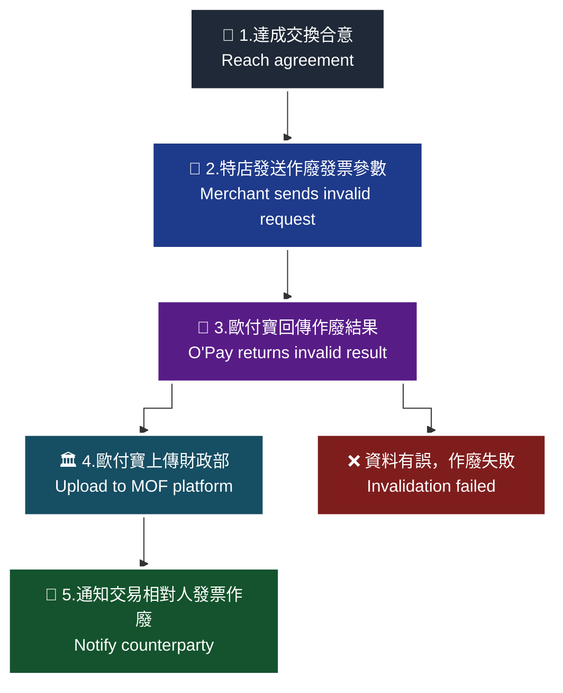

> ♿ 配色遵循 [`docs/accessibility.md`](../docs/accessibility.md)：WCAG AAA 對比 ≥7:1、Okabe-Ito 色盲安全色盤、16px 字體、直角連線、圖示＋文字雙編碼。
> ⚠️ 圖內細節未能自官方文件的文字內容取得，本圖依 API 語意重繪，請以官方文件圖片為準。

### 傳入參數（外層）

| 參數 | 參數名稱 | 型態 | 必填 | 說明 |
| --- | --- | --- | --- | --- |
| `PlatformID` | 特約合作平台商代號 | String(10) | — | 1. 提供特約合作平台商向歐付寶申請開通後使用，一般廠商介接請放空值。<br>2. 平台商使用時，MerchantID(特店編號)欄位僅限帶入已綁定子廠商的特店編號，以免造成失敗。 |
| `MerchantID` | 特店編號 | String(10) | ✅ | 1. 測試環境合作特店編號　2. 正式環境金鑰取得 |
| `RqHeader` | 傳入資料 | （物件） | ✅ | — |
| `RqHeader.Timestamp` | 傳入時間 | Number | ✅ | 歐付寶會利用此參數將當下的時間轉為 Unix TimeStamp 來驗證此次介接的時間區間。注意事項：1. 驗證時間區間暫訂為 10 分鐘內有效，若超過此驗證時間則此次訂單將無法建立，參考資料：http://www.epochconverter.com/ 。2. 合作特店須進行主機「時間校正」，避免主機產生時差，延伸 API 無法正常運作。 |
| `Data` | 加密資料 | String | ✅ | 回傳相關資料，此為加密過 JSON 格式的資料。加密方法說明 |

外層範例：

```json
{
    "MerchantID": "2000132",
    "RqHeader": {
        "Timestamp": 1525168923
    },
    "Data": "…"
}
```

### 傳入 Data 參數（加密前的 JSON）

| 參數 | 參數名稱 | 型態 | 必填 | 說明 |
| --- | --- | --- | --- | --- |
| `MerchantID` | 特店編號 | String(10) | ✅ | — |
| `InvoiceNumber` | 發票號碼 | String(10) | ✅ | — |
| `InvoiceDate` | 發票開立日期 | String(20) | ✅ | 格式為 yyyy-mm-dd |
| `Reason` | 作廢原因 | String(20) | ✅ | — |
| `Remark` | 備註 | String(200) | — | — |

### 傳入 Data 範例

```json
{
    "MerchantID": "2000132",
    "InvoiceNumber": "VG11000002",
    "InvoiceDate": "2019-09-23",
    "Reason": "Invalid_Reason",
    "Remark": "Seller_Invalid_Remark",
}
```

> ⚠️ 原文範例語法瑕疵，已照原文保留。（最後一個欄位 `Remark` 之後多了一個逗號，非合法 JSON。）

### 回傳參數（外層）

| 參數 | 參數名稱 | 型態 | 說明 |
| --- | --- | --- | --- |
| `PlatformID` | 特約合作平台商代號 | String(10) | — |
| `MerchantID` | 特店編號 | String(10) | — |
| `RpHeader` | 回傳資料 | （物件） | — |
| `RpHeader.Timestamp` | 回傳時間 | Number | — |
| `TransCode` | 回傳代碼 | Int | 1 代表傳輸資料(MerchantID, RqHeader, Data)接收成功，其餘均為失敗 |
| `TransMsg` | 回傳訊息 | String(200) | 回傳訊息 |
| `Data` | 加密資料 | String | 回傳相關資料，此為加密過 JSON 格式的資料。加密方法說明 |

外層範例：

```json
{
    "MerchantID": "2000132",
    "RpHeader": {
        "Timestamp": 1525169058
    },
    "TransCode": 1,
    "TransMsg": "",
    "Data": "…"
}
```

### 回傳 Data 參數

| 參數 | 參數名稱 | 型態 | 說明 |
| --- | --- | --- | --- |
| `RtnCode` | 回應代碼 | Int | 1 為成功，其餘為失敗。 |
| `RtnMsg` | 回應訊息 | String(200) | — |

### 回傳 Data 範例

```json
{
    "RtnCode": 1,
    "RtnMsg": "新增成功"
}
```

### 注意事項

- 交換模式注意事項：根據財政部規定，需等待交易相對人（營業人）確認後才完成交換，否則不屬於有效憑證。
- 存證模式下，特店須先與交易相對人達成合意後再送出作廢。
- 歐付寶會於隔日將發票作廢後上傳至財政部電子發票整合服務平台。
- 尚未完成交換的發票無法進行折讓、作廢等操作（見 §7 開立發票注意事項）。
- `RqHeader.Timestamp` 驗證時間區間暫訂為 10 分鐘內有效；合作特店須進行主機「時間校正」。

---
## 8. 作廢發票確認 — `InvalidConfirm`

- **來源**：i200 §10
- **用途**：**交換模式**：交易雙方因發生銷貨退回或發票內容開立錯誤，特店（營業人）收到作廢發票訊息通知後，傳送作廢發票確認參數給歐付寶加值中心，由歐付寶暫存相關資料。歐付寶於隔日將此作廢發票確認訊息上傳至財政部電子發票整合服務平台，完成發票作廢交換。並根據發送通知 API 設定，通知交易相對人（營業人）電子發票作廢已完成確認。
- **HTTP Method**：POST（`Content-Type: application/json`）
- **測試環境**：`https://einvoice-stage.opay.tw/B2BInvoice/InvalidConfirm`
- **正式環境**：`https://einvoice.opay.tw/B2BInvoice/InvalidConfirm`

### 應用流程（原文：作廢發票確認情境流程圖）

| 處理角色 | 流程名稱 | 處理說明 |
| --- | --- | --- |
| 特店 | 1.發送作廢發票確認參數 | 特店呼叫作廢發票確認 API 傳送發票作廢確認參數。 |
| 歐付寶 | 2.回傳作廢確認結果 | 接收並解析特店傳送過來的電子發票作廢確認資料。確定發票作廢確認資料無誤後，於歐付寶電子發票系統產生特店的發票作廢確認資料。 |
| 歐付寶 | 3.上傳財政部 | 作廢發票確認成功後，歐付寶會把作廢確認成功的發票資料上傳財政部電子發票整合服務平台。 |
| 交易相對人 | 4.發票作廢確認通知 | 上傳成功後，歐付寶會通知交易相對人電子發票已作廢確認的訊息。 |

> 🧭 **純文字重述（螢幕閱讀器友善）**：共四步。第一步，特店呼叫作廢發票確認 API 傳送發票作廢確認參數。第二步，歐付寶解析並確認資料無誤後產生作廢確認資料並回傳結果。第三步，歐付寶於隔日將作廢確認成功的發票資料上傳財政部電子發票整合服務平台，完成發票作廢交換。第四步，通知交易相對人電子發票已作廢確認。

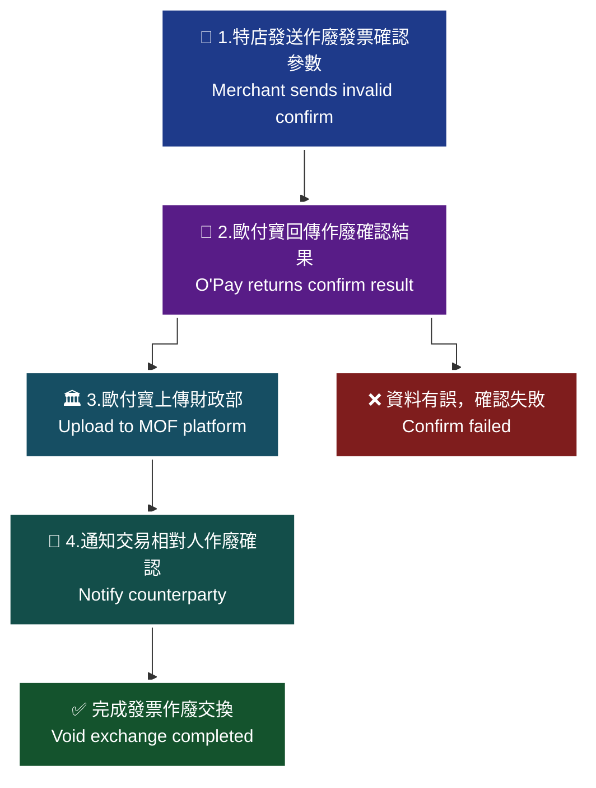

> ♿ 配色遵循 [`docs/accessibility.md`](../docs/accessibility.md)：WCAG AAA 對比 ≥7:1、Okabe-Ito 色盲安全色盤、16px 字體、直角連線、圖示＋文字雙編碼。
> ⚠️ 圖內細節未能自官方文件的文字內容取得，本圖依 API 語意重繪，請以官方文件圖片為準。

### 傳入參數（外層）

| 參數 | 參數名稱 | 型態 | 必填 | 說明 |
| --- | --- | --- | --- | --- |
| `PlatformID` | 特約合作平台商代號 | String(10) | — | 1. 提供特約合作平台商向歐付寶申請開通後使用，一般廠商介接請放空值。<br>2. 平台商使用時，MerchantID(特店編號)欄位僅限帶入已綁定子廠商的特店編號，以免造成失敗。 |
| `MerchantID` | 特店編號 | String(10) | ✅ | 1. 測試環境合作特店編號　2. 正式環境金鑰取得 |
| `RqHeader` | 傳入資料 | （物件） | ✅ | — |
| `RqHeader.Timestamp` | 傳入時間 | Number | ✅ | 歐付寶會利用此參數將當下的時間轉為 Unix TimeStamp 來驗證此次介接的時間區間。注意事項：1. 驗證時間區間暫訂為 10 分鐘內有效，若超過此驗證時間則此次訂單將無法建立，參考資料：http://www.epochconverter.com/ 。2. 合作特店須進行主機「時間校正」，避免主機產生時差，延伸 API 無法正常運作。 |
| `Data` | 加密資料 | String | ✅ | 回傳相關資料，此為加密過 JSON 格式的資料。加密方法說明 |

外層範例：

```json
{
    "MerchantID": "2000132",
    "RqHeader": {
        "Timestamp": 1525168923
    },
    "Data": "…"
}
```

### 傳入 Data 參數（加密前的 JSON）

| 參數 | 參數名稱 | 型態 | 必填 | 說明 |
| --- | --- | --- | --- | --- |
| `MerchantID` | 特店編號 | String(10) | ✅ | — |
| `InvoiceNumber` | 發票號碼 | String(10) | ✅ | — |
| `InvoiceDate` | 發票開立日期 | String(20) | ✅ | 格式為 yyyy-mm-dd |
| `Remark` | 備註 | String(200) | — | — |

### 傳入 Data 範例

```json
{
    "MerchantID": "2000132",
    "InvoiceNumber": "VG11000002",
    "InvoiceDate": "2019-09-22",
    "Remark": " Seller_Invalid_Remark "
}
```

### 回傳參數（外層）

| 參數 | 參數名稱 | 型態 | 說明 |
| --- | --- | --- | --- |
| `PlatformID` | 特約合作平台商代號 | String(10) | — |
| `MerchantID` | 特店編號 | String(10) | — |
| `RpHeader` | 回傳資料 | （物件） | — |
| `RpHeader.Timestamp` | 回傳時間 | Number | — |
| `TransCode` | 回傳代碼 | Int | 1 代表傳輸資料(MerchantID, RqHeader, Data)接收成功，其餘均為失敗 |
| `TransMsg` | 回傳訊息 | String(200) | 回傳訊息 |
| `Data` | 加密資料 | String | 回傳相關資料，此為加密過 JSON 格式的資料。加密方法說明 |

外層範例：

```json
{
    "MerchantID": "2000132",
    "RpHeader": {
        "Timestamp": 1525169058
    },
    "TransCode": 1,
    "TransMsg": "",
    "Data": "…"
}
```

### 回傳 Data 參數

| 參數 | 參數名稱 | 型態 | 說明 |
| --- | --- | --- | --- |
| `RtnCode` | 回應代碼 | Int | 1 為成功，其餘為失敗。 |
| `RtnMsg` | 回應訊息 | String(200) | — |

### 回傳 Data 範例

```json
{
    "RtnCode": "1",
    "RtnMsg": "新增成功"
}
```

> ⚠️ 原文範例語法瑕疵，已照原文保留。（`RtnCode` 型態為 Int，但範例回傳字串 `"1"`。）

### 注意事項

- 本 API 適用於交換模式；根據財政部規定，作廢需待交易相對人確認後才完成交換，否則不屬於有效憑證。
- 歐付寶於隔日將此作廢發票確認訊息上傳至財政部電子發票整合服務平台。
- `RqHeader.Timestamp` 驗證時間區間暫訂為 10 分鐘內有效；合作特店須進行主機「時間校正」。
- 平台商使用 `PlatformID` 時，`MerchantID` 僅限帶入已綁定子廠商的特店編號。

---
## 9. 退回發票 — `Reject`

- **來源**：i200 §11
- **用途**：**交換模式**：特店（營業人）收到發票訊息發現內容錯誤（如數量、單價或品名錯誤），拒絕確認此發票訊息，傳送退回發票參數給歐付寶加值中心，由歐付寶暫存相關資料。歐付寶於隔日將發票退回資料上傳至財政部電子發票整合服務平台，同時根據發送通知 API 設定，通知交易相對人（營業人）電子發票已退回。**存證模式**：特店收到發票訊息發現內容錯誤，拒絕接受此發票訊息，在與交易相對人達成合意後傳送退回發票參數給歐付寶，歐付寶於隔天上傳財政部並依設定通知交易相對人。
- **HTTP Method**：POST（`Content-Type: application/json`）
- **測試環境**：`https://einvoice-stage.opay.tw/B2BInvoice/Reject`
- **正式環境**：`https://einvoice.opay.tw/B2BInvoice/Reject`

### 應用流程 A（原文：退回發票(交換模式)情境流程圖）

| 處理角色 | 流程名稱 | 處理說明 |
| --- | --- | --- |
| 特店 | 1.發送退回發票參數 | 特店呼叫退回發票 API 傳送發票退回參數。 |
| 歐付寶 | 2.回傳退回結果 | 接收並解析特店傳送過來的電子發票退回資料。確定發票退回資料無誤後，於歐付寶電子發票系統產生特店的發票退回資料。 |
| 歐付寶 | 3.上傳財政部 | 退回成功後，歐付寶會把退回成功的發票資料上傳財政部電子發票整合服務平台。 |
| 交易相對人 | 4.發票退回通知 | 上傳成功後，歐付寶會通知交易相對人電子發票已退回的訊息。 |

> 🧭 **純文字重述（螢幕閱讀器友善）**：交換模式共四步。第一步，特店呼叫退回發票 API 傳送發票退回參數。第二步，歐付寶解析並確認退回資料無誤後產生退回資料並回傳結果。第三步，歐付寶於隔日將退回成功的發票上傳財政部電子發票整合服務平台。第四步，通知交易相對人電子發票已退回。後續尚須以退回發票確認 API 完成交換。

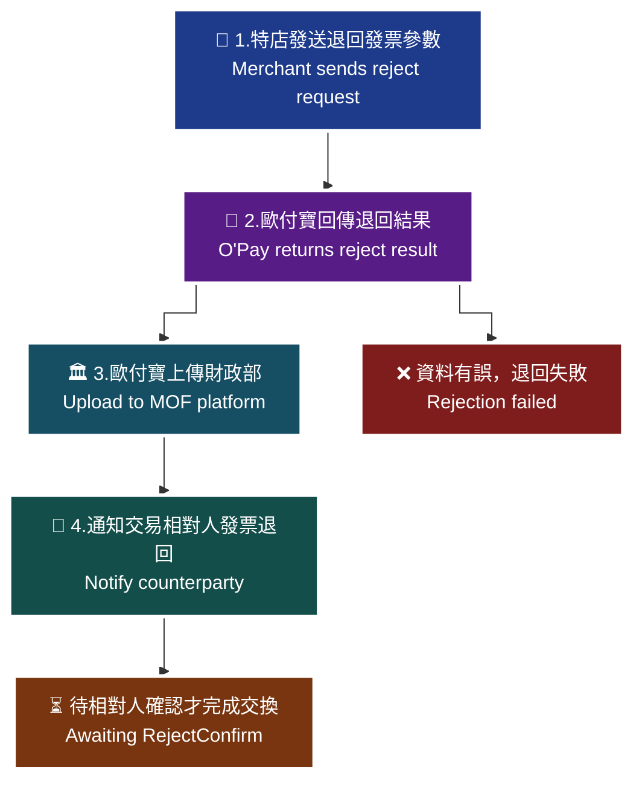

> ♿ 配色遵循 [`docs/accessibility.md`](../docs/accessibility.md)：WCAG AAA 對比 ≥7:1、Okabe-Ito 色盲安全色盤、16px 字體、直角連線、圖示＋文字雙編碼。
> ⚠️ 圖內細節未能自官方文件的文字內容取得，本圖依 API 語意重繪，請以官方文件圖片為準。

### 應用流程 B（原文：退回發票(存證模式)情境流程圖）

| 處理角色 | 流程名稱 | 處理說明 |
| --- | --- | --- |
| 特店 | 1.達成交換合意 | 特店與交易相對人對於發票退回達成合意 |
| 特店 | 2.發送退回發票參數 | 特店呼叫退回發票 API 傳送發票退回參數。 |
| 歐付寶 | 3.回傳退回結果 | 接收並解析特店傳送過來的電子發票退回資料。確定發票退回資料無誤後，於歐付寶電子發票系統產生特店的發票退回資料。 |
| 歐付寶 | 4.上傳財政部 | 退回成功後，歐付寶會把退回成功的發票資料上傳財政部電子發票整合服務平台。 |
| 交易相對人 | 5.發票退回通知 | 上傳成功後，歐付寶會通知交易相對人電子發票已退回的訊息。 |

> 🧭 **純文字重述（螢幕閱讀器友善）**：存證模式共五步。第一步，特店與交易相對人對於發票退回達成合意。第二步，特店呼叫退回發票 API 傳送發票退回參數。第三步，歐付寶解析並確認退回資料無誤後產生退回資料並回傳結果。第四步，歐付寶於隔日將退回成功的發票上傳財政部電子發票整合服務平台。第五步，通知交易相對人電子發票已退回。

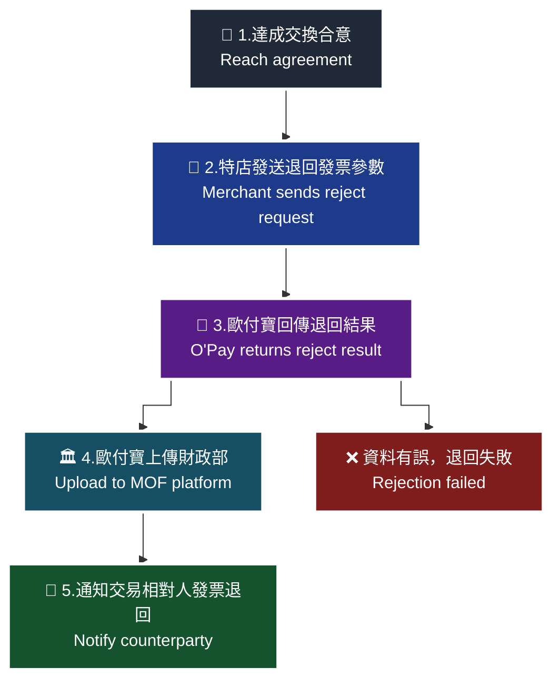

> ♿ 配色遵循 [`docs/accessibility.md`](../docs/accessibility.md)：WCAG AAA 對比 ≥7:1、Okabe-Ito 色盲安全色盤、16px 字體、直角連線、圖示＋文字雙編碼。
> ⚠️ 圖內細節未能自官方文件的文字內容取得，本圖依 API 語意重繪，請以官方文件圖片為準。

### 傳入參數（外層）

| 參數 | 參數名稱 | 型態 | 必填 | 說明 |
| --- | --- | --- | --- | --- |
| `PlatformID` | 特約合作平台商代號 | String(10) | — | 1. 提供特約合作平台商向歐付寶申請開通後使用，一般廠商介接請放空值。<br>2. 平台商使用時，MerchantID(特店編號)欄位僅限帶入已綁定子廠商的特店編號，以免造成失敗。 |
| `MerchantID` | 特店編號 | String(10) | ✅ | 1. 測試環境合作特店編號　2. 正式環境金鑰取得 |
| `RqHeader` | 傳入資料 | （物件） | ✅ | — |
| `RqHeader.Timestamp` | 傳入時間 | Number | ✅ | 歐付寶會利用此參數將當下的時間轉為 Unix TimeStamp 來驗證此次介接的時間區間。注意事項：1. 驗證時間區間暫訂為 10 分鐘內有效，若超過此驗證時間則此次訂單將無法建立，參考資料：http://www.epochconverter.com/ 。2. 合作特店須進行主機「時間校正」，避免主機產生時差，延伸 API 無法正常運作。 |
| `Data` | 加密資料 | String | ✅ | 回傳相關資料，此為加密過 JSON 格式的資料。加密方法說明 |

外層範例：

```json
{
    "MerchantID": "2000132",
    "RqHeader": {
        "Timestamp": 1525168923
    },
    "Data": "…"
}
```

### 傳入 Data 參數（加密前的 JSON）

| 參數 | 參數名稱 | 型態 | 必填 | 說明 |
| --- | --- | --- | --- | --- |
| `MerchantID` | 特店編號 | String(10) | ✅ | — |
| `InvoiceNumber` | 發票號碼 | String(10) | ✅ | — |
| `InvoiceDate` | 發票開立日期 | String(20) | ✅ | 格式為 yyyy-mm-dd |
| `Reason` | 退回原因 | String(20) | ✅ | — |
| `Remark` | 備註 | String(200) | — | — |

### 傳入 Data 範例

```json
{
    "MerchantID": "2000132",
    "InvoiceNumber": "VG11000001",
    "InvoiceDate": "2019-09-22",
    "Reason": "Reject_Reason",
    "Remark": " Buyer_Reject_Remark"
}
```

### 回傳參數（外層）

| 參數 | 參數名稱 | 型態 | 說明 |
| --- | --- | --- | --- |
| `PlatformID` | 特約合作平台商代號 | String(10) | — |
| `MerchantID` | 特店編號 | String(10) | — |
| `RpHeader` | 回傳資料 | （物件） | — |
| `RpHeader.Timestamp` | 回傳時間 | Number | — |
| `TransCode` | 回傳代碼 | Int | 1 代表傳輸資料(MerchantID, RqHeader, Data)接收成功，其餘均為失敗 |
| `TransMsg` | 回傳訊息 | String(200) | 回傳訊息 |
| `Data` | 加密資料 | String | 回傳相關資料，此為加密過 JSON 格式的資料。加密方法說明 |

外層範例：

```json
{
    "MerchantID": "2000132",
    "RpHeader": {
        "Timestamp": 1525169058
    },
    "TransCode": 1,
    "TransMsg": "",
    "Data": "…"
}
```

### 回傳 Data 參數

| 參數 | 參數名稱 | 型態 | 說明 |
| --- | --- | --- | --- |
| `RtnCode` | 回應代碼 | Int | 1 為成功，其餘為失敗。 |
| `RtnMsg` | 回應訊息 | String(200) | — |

### 回傳 Data 範例

```json
{
    "RtnCode": "1",
    "RtnMsg": "新增成功"
}
```

> ⚠️ 原文範例語法瑕疵，已照原文保留。（`RtnCode` 型態為 Int，但範例回傳字串 `"1"`。）

### 注意事項

- 退回適用於買方收到發票訊息後發現內容錯誤（如數量、單價或品名錯誤），拒絕確認／接受此發票訊息時使用。
- 存證模式下，特店須先與交易相對人達成合意後再送出退回。
- 歐付寶於隔日將發票退回資料上傳至財政部電子發票整合服務平台。
- `RqHeader.Timestamp` 驗證時間區間暫訂為 10 分鐘內有效；合作特店須進行主機「時間校正」。

---
## 10. 退回發票確認 — `RejectConfirm`

- **來源**：i200 §12
- **用途**：**交換模式**：交易雙方因發生發票訊息內容錯誤（如數量、單價或品名錯誤），特店（營業人）收到退回發票訊息通知後，傳送退回發票確認參數給歐付寶加值中心，由歐付寶暫存相關資料。歐付寶於隔日將此退回發票確認訊息上傳至財政部電子發票整合服務平台，完成發票退回交換。並根據發送通知 API 設定，通知交易相對人（營業人）電子發票退回已完成確認。
- **HTTP Method**：POST（`Content-Type: application/json`）
- **測試環境**：`https://einvoice-stage.opay.tw/B2BInvoice/RejectConfirm`
- **正式環境**：`https://einvoice.opay.tw/B2BInvoice/RejectConfirm`

### 應用流程（原文：退回發票確認情境流程圖）

| 處理角色 | 流程名稱 | 處理說明 |
| --- | --- | --- |
| 特店 | 1.發送退回發票確認參數 | 特店呼叫退回發票確認 API 傳送發票退回確認參數。 |
| 歐付寶 | 2.回傳退回確認結果 | 接收並解析特店傳送過來的電子發票退回確認資料。確定發票退回確認資料無誤後，於歐付寶電子發票系統產生特店的發票退回確認資料。 |
| 歐付寶 | 3.上傳財政部 | 退回確認成功後，歐付寶會把退回確認成功的發票資料上傳財政部電子發票整合服務平台。 |
| 交易相對人 | 4.發票退回確認通知 | 上傳成功後，歐付寶會通知交易相對人電子發票已退回確認的訊息。 |

> 🧭 **純文字重述（螢幕閱讀器友善）**：共四步。第一步，特店呼叫退回發票確認 API 傳送發票退回確認參數。第二步，歐付寶解析並確認資料無誤後產生退回確認資料並回傳結果。第三步，歐付寶於隔日將退回確認成功的發票資料上傳財政部電子發票整合服務平台，完成發票退回交換。第四步，通知交易相對人電子發票已退回確認。

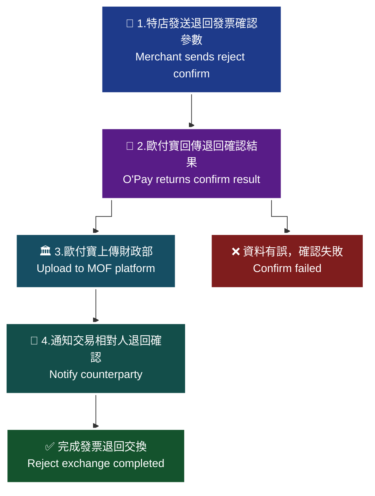

> ♿ 配色遵循 [`docs/accessibility.md`](../docs/accessibility.md)：WCAG AAA 對比 ≥7:1、Okabe-Ito 色盲安全色盤、16px 字體、直角連線、圖示＋文字雙編碼。
> ⚠️ 圖內細節未能自官方文件的文字內容取得，本圖依 API 語意重繪，請以官方文件圖片為準。

### 傳入參數（外層）

| 參數 | 參數名稱 | 型態 | 必填 | 說明 |
| --- | --- | --- | --- | --- |
| `PlatformID` | 特約合作平台商代號 | String(10) | — | 1. 提供特約合作平台商向歐付寶申請開通後使用，一般廠商介接請放空值。<br>2. 平台商使用時，MerchantID(特店編號)欄位僅限帶入已綁定子廠商的特店編號，以免造成失敗。 |
| `MerchantID` | 特店編號 | String(10) | ✅ | 1. 測試環境合作特店編號　2. 正式環境金鑰取得 |
| `RqHeader` | 傳入資料 | （物件） | ✅ | — |
| `RqHeader.Timestamp` | 傳入時間 | Number | ✅ | 歐付寶會利用此參數將當下的時間轉為 Unix TimeStamp 來驗證此次介接的時間區間。注意事項：1. 驗證時間區間暫訂為 10 分鐘內有效，若超過此驗證時間則此次訂單將無法建立，參考資料：http://www.epochconverter.com/ 。2. 合作特店須進行主機「時間校正」，避免主機產生時差，延伸 API 無法正常運作。 |
| `Data` | 加密資料 | String | ✅ | 回傳相關資料，此為加密過 JSON 格式的資料。加密方法說明 |

外層範例：

```json
{
    "MerchantID": "2000132",
    "RqHeader": {
        "Timestamp": 1525168923
    },
    "Data": "…"
}
```

### 傳入 Data 參數（加密前的 JSON）

| 參數 | 參數名稱 | 型態 | 必填 | 說明 |
| --- | --- | --- | --- | --- |
| `MerchantID` | 特店編號 | String(10) | ✅ | — |
| `InvoiceNumber` | 發票號碼 | String(10) | ✅ | — |
| `InvoiceDate` | 發票開立日期 | String(20) | ✅ | 格式為 yyyy-mm-dd |
| `Remark` | 備註 | String(200) | — | — |

### 傳入 Data 範例

```json
{
    "MerchantID": "2000132",
    "InvoiceNumber": "VG11000001",
    "InvoiceDate": "2019-09-22",
    "Remark": "Buyer_Reject_Remark",
}
```

> ⚠️ 原文範例語法瑕疵，已照原文保留。（最後一個欄位 `Remark` 之後多了一個逗號，非合法 JSON。）

### 回傳參數（外層）

| 參數 | 參數名稱 | 型態 | 說明 |
| --- | --- | --- | --- |
| `PlatformID` | 特約合作平台商代號 | String(10) | — |
| `MerchantID` | 特店編號 | String(10) | — |
| `RpHeader` | 回傳資料 | （物件） | — |
| `RpHeader.Timestamp` | 回傳時間 | Number | — |
| `TransCode` | 回傳代碼 | Int | 1 代表傳輸資料(MerchantID, RqHeader, Data)接收成功，其餘均為失敗 |
| `TransMsg` | 回傳訊息 | String(200) | — |
| `Data` | 加密資料 | String | 回傳相關資料，此為加密過 JSON 格式的資料。加密方法說明 |

外層範例：

```json
{
    "MerchantID": "2000132",
    "RpHeader": {
        "Timestamp": 1525169058
    },
    "TransCode": 1,
    "TransMsg": "",
    "Data": "…"
}
```

### 回傳 Data 參數

| 參數 | 參數名稱 | 型態 | 說明 |
| --- | --- | --- | --- |
| `RtnCode` | 回應代碼 | Int | 1 為成功，其餘為失敗。 |
| `RtnMsg` | 回應訊息 | String(200) | — |

### 回傳 Data 範例

```json
{
    "RtnCode": 1,
    "RtnMsg": "新增成功"
}
```

### 注意事項

- 本 API 適用於交換模式，用於完成發票退回交換。
- 歐付寶於隔日將此退回發票確認訊息上傳至財政部電子發票整合服務平台。
- 確認完成後，歐付寶會依發送通知 API 設定通知交易相對人電子發票退回已完成確認。
- `RqHeader.Timestamp` 驗證時間區間暫訂為 10 分鐘內有效；合作特店須進行主機「時間校正」。
- 平台商使用 `PlatformID` 時，`MerchantID` 僅限帶入已綁定子廠商的特店編號。

## 11. 開立折讓發票 — `Allowance`

- **來源**：i200 §13
- **用途**：特店(營業人)開立發票後發生銷貨退回、調換貨物或折讓等情事時，傳送折讓發票參數給歐付寶，由歐付寶暫存相關資料。歐付寶於隔日將發票折讓並上傳至財政部電子發票整合服務平台，同時根據發送通知 API 設定，通知交易相對人(營業人)電子發票已折讓。交換模式下由買方/賣方開立折讓單；存證模式下特店需先與交易相對人達成合意後再開立。
- **HTTP Method**：POST（`Content-Type: application/json`）
- **測試環境**：`https://einvoice-stage.opay.tw/B2BInvoice/Allowance`
- **正式環境**：`https://einvoice.opay.tw/B2BInvoice/Allowance`

> 🧭 **純文字重述（螢幕閱讀器友善）**：原文此處為「開立折讓(交換模式)情境流程圖」。流程為：1. 特店呼叫開立折讓 API 傳送開立發票折讓參數 → 2. 歐付寶接收並解析電子發票開立折讓資料，確定資料無誤後於歐付寶電子發票系統產生特店的發票開立折讓資料並回傳結果 → 3. 開立折讓成功後，歐付寶將資料上傳財政部電子發票整合服務平台 → 4. 上傳成功後，歐付寶通知交易相對人電子發票已成功開立折讓的訊息。

```mermaid
%%{init: {'flowchart': {'curve':'step','htmlLabels':true,'useMaxWidth':true},'themeVariables': {'fontSize':'16px','fontFamily':'ui-sans-serif, system-ui, sans-serif'}}}%%
flowchart LR
  A["🏪 特店發送開立折讓參數<br/>Merchant sends Allowance"] --> B["🏦 歐付寶回傳開立折讓結果<br/>OPay returns result"]
  B --> C["🏛️ 上傳財政部<br/>Upload to MOF"]
  C --> D["📧 折讓開立通知交易相對人<br/>Notify counterparty"]
  D --> E["✅ 折讓開立完成<br/>Allowance issued"]
  style A fill:#1E3A8A,stroke:#FFFFFF,stroke-width:3px,color:#FFFFFF
  style B fill:#164E63,stroke:#FFFFFF,stroke-width:3px,color:#FFFFFF
  style C fill:#581C87,stroke:#FFFFFF,stroke-width:3px,color:#FFFFFF
  style D fill:#3730A3,stroke:#FFFFFF,stroke-width:3px,color:#FFFFFF
  style E fill:#14532D,stroke:#FFFFFF,stroke-width:3px,color:#FFFFFF
```

> ♿ 配色遵循 [`docs/accessibility.md`](../docs/accessibility.md)：WCAG AAA 對比 ≥7:1、Okabe-Ito 色盲安全色盤、16px 字體、直角連線、圖示＋文字雙編碼。
>
> ⚠️ 圖內細節未能自官方文件的文字內容取得，本圖依 API 語意重繪，請以官方文件圖片為準。

原文「開立折讓(交換模式)情境流程圖」流程說明表：

| 處理角色 | 流程名稱 | 處理說明 |
|---|---|---|
| 特店 | 1.發送開立折讓參數 | 特店呼叫開立折讓API傳送開立發票折讓參數。 |
| 歐付寶 | 2.回傳開立折讓結果 | 接收並解析特店傳送過來的電子發票開立折讓資料。確定開立折讓資料無誤後，於歐付寶電子發票系統產生特店的發票開立折讓資料。 |
| 歐付寶 | 3.上傳財政部 | 開立折讓成功後，歐付寶會把開立折讓成功的發票資料上傳財政部電子發票整合服務平台。 |
| 交易相對人 | 4.折讓開立通知 | 上傳成功後，歐付寶會通知交易相對人電子發票已成功開立折讓的訊息。 |

> 🧭 **純文字重述（螢幕閱讀器友善）**：原文此處另有「開立折讓(存證模式)情境流程圖」。流程為：1. 特店與交易相對人對於發票開立折讓達成合意 → 2. 特店呼叫開立折讓 API 傳送開立發票折讓參數 → 3. 歐付寶接收並解析資料，確定無誤後產生特店的電子發票開立折讓資料並回傳結果 → 4. 歐付寶上傳財政部電子發票整合服務平台 → 5. 上傳成功後通知交易相對人電子發票已成功開立折讓的訊息。

```mermaid
%%{init: {'flowchart': {'curve':'step','htmlLabels':true,'useMaxWidth':true},'themeVariables': {'fontSize':'16px','fontFamily':'ui-sans-serif, system-ui, sans-serif'}}}%%
flowchart LR
  A["🤝 達成交換合意<br/>Mutual agreement"] --> B["🏪 特店發送開立折讓參數<br/>Merchant sends Allowance"]
  B --> C["🏦 歐付寶回傳開立折讓結果<br/>OPay returns result"]
  C --> D["🏛️ 上傳財政部<br/>Upload to MOF"]
  D --> E["📧 折讓開立通知交易相對人<br/>Notify counterparty"]
  E --> F["✅ 折讓開立完成<br/>Allowance issued"]
  style A fill:#78350F,stroke:#FFFFFF,stroke-width:3px,color:#FFFFFF
  style B fill:#1E3A8A,stroke:#FFFFFF,stroke-width:3px,color:#FFFFFF
  style C fill:#164E63,stroke:#FFFFFF,stroke-width:3px,color:#FFFFFF
  style D fill:#581C87,stroke:#FFFFFF,stroke-width:3px,color:#FFFFFF
  style E fill:#3730A3,stroke:#FFFFFF,stroke-width:3px,color:#FFFFFF
  style F fill:#14532D,stroke:#FFFFFF,stroke-width:3px,color:#FFFFFF
```

> ♿ 配色遵循 [`docs/accessibility.md`](../docs/accessibility.md)：WCAG AAA 對比 ≥7:1、Okabe-Ito 色盲安全色盤、16px 字體、直角連線、圖示＋文字雙編碼。
>
> ⚠️ 圖內細節未能自官方文件的文字內容取得，本圖依 API 語意重繪，請以官方文件圖片為準。

原文「開立折讓(存證模式)情境流程圖」流程說明表：

| 處理角色 | 流程名稱 | 處理說明 |
|---|---|---|
| 特店 | 1.達成交換合意 | 特店與交易相對人對於發票開立折讓達成合意 |
| 特店 | 2.發送開立折讓參數 | 特店呼叫開立折讓API傳送開立發票折讓參數。 |
| 歐付寶 | 3.回傳開立折讓結果 | 接收並解析特店傳送過來的電子發票開立折讓資料。確定開立折讓資料無誤後，於歐付寶電子發票系統產生特店的電子發票開立折讓資料。 |
| 歐付寶 | 4.上傳財政部 | 開立折讓成功後，歐付寶會把開立折讓成功的發票資料上傳財政部電子發票整合服務平台。 |
| 交易相對人 | 5.折讓開立通知 | 上傳成功後，歐付寶會通知交易相對人電子發票已成功開立折讓的訊息。 |

### 傳入參數（外層）

| 參數 | 參數名稱 | 型態 | 必填 | 說明 |
|---|---|---|---|---|
| PlatformID | 特約合作平台商代號 | String(10) | — | 1. 提供特約合作平台商向歐付寶申請開通後使用，一般廠商介接請放空值。<br>2. 平台商使用時，MerchantID(特店編號)欄位僅限帶入已綁定子廠商的特店編號，以免造成失敗。 |
| MerchantID | 特店編號 | String(10) | ✅ | 1. 測試環境合作特店編號 2. 正式環境金鑰取得 |
| RqHeader | 傳入資料 | — | ✅ | — |
| └─ RqHeader.Timestamp | 傳入時間 | Number | ✅ | 歐付寶會利用此參數將當下的時間轉為 Unix TimeStamp 來驗證此次介接的時間區間。<br>注意事項：<br>1. 驗證時間區間暫訂為 10 分鐘內有效，若超過此驗證時間則此次訂單將無法建立，參考資料：http://www.epochconverter.com/ 。<br>2. 合作特店須進行主機「時間校正」，避免主機產生時差，延伸 API 無法正常運作。 |
| Data | 加密資料 | String | ✅ | 回傳相關資料，此為加密過 JSON 格式的資料。加密方法說明 |

外層範例：

```json
{
    "MerchantID": "2000132",
    "RqHeader": {
        "Timestamp": 1525168923
    },
    "Data": "…"
}
```

### 傳入 Data 參數（加密前的 JSON）

| 參數 | 參數名稱 | 型態 | 必填 | 說明 |
|---|---|---|---|---|
| MerchantID | 特店編號 | String(10) | ✅ | — |
| AllowanceDate | 折讓單時間 | String(20) | — | 格式為 yyyy-mm-dd hh:mm:ss 參數有值時，僅接受6天內日期，沒有值則會開立當下日期。 |
| CustomerEmail | 買方電子信箱 | String(80) | — | 1. 僅接受 Email 的標準格式。 2. 多組Email請以半形分號區隔，未帶值時將自動帶入交易對象維護API設定的資料。<br>注意事項：<br>1.測試環境請勿帶入之真實電子信箱，避免個資外洩。<br>2.測試環境僅作API串接測試使用，僅以API回覆成功或失敗；批次匯入功能/API不提供發信測試，僅驗規則。 |
| CustomerAddress | 買方公司地址 | String(100) | — | — |
| TaxAmount | 營業稅額 | Int | ✅ | 1. 請帶整數，不可有小數點。 2. 定義【折讓金額總計(未稅)[TotalAmount]乘以開立發票API的稅率[TaxRate]後再四捨五入至整數】為C, 則營業稅額[TaxAmount]的值與C的差距不可大於2<br>注意事項：<br>1. 如發票僅含特種稅額請直接帶0 |
| TotalAmount | 折讓金額總計(未稅) | Int | ✅ | 1. 請帶整數，不可有小數點，金額不可為 0 元。 2. 需等於每張發票折讓的商品金額[ItemAmount]加總後四捨五入至整數的值 |
| Details | 傳入資料 | — | ✅ | B2B可以在一張折讓單上同時折讓多筆發票，以下是每項商品的折讓明細 |
| Details[].OriginalInvoiceNumber | 原發票號碼 | String(10) | ✅ | — |
| Details[].OriginalInvoiceDate | 原發票日期 | String(20) | ✅ | 格式為 yyyy-mm-dd |
| Details[].OriginalSequenceNumber | 原發票號碼排序 | Int | ✅ | 1.請帶1~999的整數值 2.商品排序需與原發票開立時的商品排序相同 |
| Details[].ItemName | 商品名稱 | String(256) | ✅ | 折讓的商品名稱[ItemName]，需與原發票號碼排序的對應商品名稱相同 |
| Details[].ItemCount | 商品數量 | Number | ✅ | 1. 支援整數最多8位，小數2位 2. 折讓的商品數量[ItemCount]，不可超過原發票商品開立的數量 |
| Details[].ItemPrice | 商品價格 | Number | ✅ | 1. 支援整數最多8位，小數7位 2. 折讓的商品價格[ItemPrice]，不可超過原發票商品開立的價格 |
| Details[].ItemAmount | 商品合計 | Number | ✅ | 1. 支援整數最多12位，小數7位 2. 折讓的商品合計[ItemAmount]，定義【折讓的商品數量[ItemCount]*折讓的商品價格[ItemPrice]】=A，則折讓的商品合計[ItemAmount]與A的差距不可大於1 |
| Details[].Tax | 商品稅額 | Int | — | 1. 須為整數 2. 折讓的商品稅額[Tax]，定義【折讓的商品合計[ItemAmount]*開立發票API的稅率[TaxRate]】 = B，則折讓的商品稅額[Tax]與B四捨五入至整數的差距不可大於1<br>注意事項：<br>1. 特種稅額發票請直接帶0 |

> ⚠️ 原文表格中 `OriginalInvoiceNumber`、`OriginalInvoiceDate` 因原文換行被抽成「OriginalInvoice Number」「OriginalInvoice Date」（中間有空白）；本文依原文 JSON 範例的實際欄位名 `OriginalInvoiceNumber` / `OriginalInvoiceDate` 呈現。

### 傳入 Data 範例

```json
{
    "MerchantID": "2000132",
    "AllowanceDate": "2019-09-24 00:00:00",
    "CustomerEmail": "abc1234@gmail.com",
    "TaxAmount": 1,
    "TotalAmount": 24,
    "Details": [
        {
            "OriginalInvoiceNumber": "VG11000003",
            "OriginalInvoiceDate": "2019-09-24",
            "OriginalSequenceNumber": 1,
"ItemName": "小浣熊",
            "ItemCount": 2,
            "ItemPrice": 12,
            "ItemAmount": 24,
            "Tax": 1
        }
    ]
}
```

> ⚠️ 原文範例語法瑕疵，已照原文保留。（`"ItemName"` 該行縮排跑掉）

### 回傳參數（外層）

| 參數 | 參數名稱 | 型態 | 說明 |
|---|---|---|---|
| PlatformID | 特約合作平台商代號 | String(10) | — |
| MerchantID | 特店編號 | String(10) | — |
| RpHeader | 回傳資料 | — | — |
| └─ RpHeader.Timestamp | 回傳時間 | Number | — |
| TransCode | 回傳代碼 | Int | 1代表傳輸資料(MerchantID, RqHeader, Data)接收成功，其餘均為失敗 |
| TransMsg | 回傳訊息 | String(200) | — |
| Data | 加密資料 | String | 回傳相關資料，此為加密過 JSON 格式的資料。加密方法說明 |

外層範例：

```json
{
"MerchantID": "2000132",
    "RpHeader": {
        "Timestamp": 1525169058
    },
    "TransCode": 1,
    "TransMsg": "",
    "Data": "…"
}
```

> ⚠️ 原文範例語法瑕疵，已照原文保留。（`"MerchantID"` 該行縮排跑掉）

### 回傳 Data 參數

| 參數 | 參數名稱 | 型態 | 說明 |
|---|---|---|---|
| RtnCode | 回應代碼 | Int | 1 為成功，其餘為失敗。 |
| RtnMsg | 回應訊息 | String(200) | — |
| AllowanceNo | 歐付寶折讓編號 | String(16) | 若開立成功，則會回傳一組歐付寶折讓編號；若開立失敗，則會回傳空值。 |
| AllowanceNumber | 折讓單號碼 | String(16) | 廠商自訂折讓單號碼 |

### 回傳 Data 範例

```json
{
    "RtnCode": 1,
    "RtnMsg": "",
    "AllowanceNo": "1909241702402030",
    "AllowanceNumber": "1909241702402030"
}
```

### 注意事項

- 【交換模式】1. 由賣方開立折讓的目的是為了避免買方開立折讓單填寫。
- 【交換模式】2. 需等待交易相對人(營業人)確認後才完成交換，此時發票狀態為已折讓成功，屬於有效憑證，只是尚未完成交換。
- `AllowanceDate` 參數有值時，僅接受 6 天內日期，沒有值則會開立當下日期。
- `CustomerEmail`：測試環境請勿帶入真實電子信箱，避免個資外洩；測試環境僅作 API 串接測試使用，僅以 API 回覆成功或失敗；批次匯入功能/API 不提供發信測試，僅驗規則。
- `TaxAmount` / `Details[].Tax`：如發票僅含特種稅額請直接帶 0。
- `TotalAmount` 金額不可為 0 元，且需等於每張發票折讓的商品金額 `ItemAmount` 加總後四捨五入至整數的值。
- `Details[].ItemCount`、`Details[].ItemPrice` 不可超過原發票商品開立的數量與價格；`Details[].ItemName` 需與原發票號碼排序的對應商品名稱相同。
- 傳入時間 `Timestamp` 驗證區間暫訂為 10 分鐘內有效；合作特店須進行主機「時間校正」。
- 平台商使用時，`MerchantID` 欄位僅限帶入已綁定子廠商的特店編號，以免造成失敗；一般廠商介接 `PlatformID` 請放空值。

---

## 12. 折讓發票確認 — `AllowanceConfirm`

- **來源**：i200 §14
- **用途**：交易雙方因發生銷貨退回、調換貨物或折讓等情事，特店(營業人)收到折讓發票訊息通知後，傳送折讓發票確認參數給歐付寶，由歐付寶暫存相關資料。歐付寶於隔日將此折讓發票確認訊息上傳至財政部電子發票整合服務平台，完成發票折讓交換，並根據發送通知 API 設定，通知交易相對人(營業人)電子發票折讓已完成確認。
- **HTTP Method**：POST（`Content-Type: application/json`）
- **測試環境**：`https://einvoice-stage.opay.tw/B2BInvoice/AllowanceConfirm`
- **正式環境**：`https://einvoice.opay.tw/B2BInvoice/AllowanceConfirm`

> 🧭 **純文字重述（螢幕閱讀器友善）**：原文此處為「折讓確認情境流程圖」。流程為：1. 特店呼叫折讓確認 API 傳送發票折讓確認參數 → 2. 歐付寶接收並解析電子發票折讓確認資料，確定無誤後於歐付寶電子發票系統產生特店的發票折讓確認資料並回傳結果 → 3. 折讓確認成功後上傳財政部電子發票整合服務平台 → 4. 上傳成功後，歐付寶通知交易相對人電子發票已成功折讓確認的訊息。

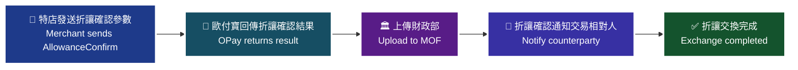

> ♿ 配色遵循 [`docs/accessibility.md`](../docs/accessibility.md)：WCAG AAA 對比 ≥7:1、Okabe-Ito 色盲安全色盤、16px 字體、直角連線、圖示＋文字雙編碼。
>
> ⚠️ 圖內細節未能自官方文件的文字內容取得，本圖依 API 語意重繪，請以官方文件圖片為準。

原文「折讓確認情境流程圖」流程說明表：

| 處理角色 | 流程名稱 | 處理說明 |
|---|---|---|
| 特店 | 1.發送折讓確認參數 | 特店呼叫折讓確認API傳送發票折讓確認參數。 |
| 歐付寶 | 2.回傳折讓確認結果 | 接收並解析特店傳送過來的電子發票折讓確認資料。確定折讓確認資料無誤後，於歐付寶電子發票系統產生特店的發票折讓確認資料。 |
| 歐付寶 | 3.上傳財政部 | 折讓確認成功後，歐付寶會把折讓確認成功的發票資料上傳財政部電子發票整合服務平台。 |
| 交易相對人 | 4.折讓確認通知 | 上傳成功後，歐付寶會通知交易相對人電子發票已成功折讓確認的訊息。 |

### 傳入參數（外層）

| 參數 | 參數名稱 | 型態 | 必填 | 說明 |
|---|---|---|---|---|
| PlatformID | 特約合作平台商代號 | String(10) | — | 1. 提供特約合作平台商向歐付寶申請開通後使用，一般廠商介接請放空值。<br>2. 平台商使用時，MerchantID(特店編號)欄位僅限帶入已綁定子廠商的特店編號，以免造成失敗。 |
| MerchantID | 特店編號 | String(10) | ✅ | 1. 測試環境合作特店編號 2. 正式環境金鑰取得 |
| RqHeader | 傳入資料 | — | ✅ | — |
| └─ RqHeader.Timestamp | 傳入時間 | Number | ✅ | 歐付寶會利用此參數將當下的時間轉為 Unix TimeStamp 來驗證此次介接的時間區間。<br>注意事項：<br>1. 驗證時間區間暫訂為 10 分鐘內有效，若超過此驗證時間則此次訂單將無法建立，參考資料：http://www.epochconverter.com/ 。<br>2. 合作特店須進行主機「時間校正」，避免主機產生時差，延伸 API 無法正常運作。 |
| Data | 加密資料 | String | ✅ | 回傳相關資料，此為加密過 JSON 格式的資料。加密方法說明 |

外層範例：

```json
{
    "MerchantID": "2000132",
    "RqHeader": {
        "Timestamp": 1525168923
    },
    "Data": "…"
}
```

### 傳入 Data 參數（加密前的 JSON）

| 參數 | 參數名稱 | 型態 | 必填 | 說明 |
|---|---|---|---|---|
| MerchantID | 特店編號 | String(10) | ✅ | — |
| AllowanceNo | 歐付寶折讓編號 | String(16) | ✅ | 長度固定為16碼 |
| Remark | 備註 | String(200) | — | — |

### 傳入 Data 範例

```json
{
    "MerchantID": "2000132",
    "AllowanceNo": "1909241702402030",
    "Remark": "Allowance_Confirm_Remark"
}
```

### 回傳參數（外層）

| 參數 | 參數名稱 | 型態 | 說明 |
|---|---|---|---|
| PlatformID | 特約合作平台商代號 | String(10) | — |
| MerchantID | 特店編號 | String(10) | — |
| RpHeader | 回傳資料 | — | — |
| └─ RpHeader.Timestamp | 回傳時間 | Number | — |
| TransCode | 回傳代碼 | Int | 1代表傳輸資料(MerchantID, RqHeader, Data)接收成功，其餘均為失敗 |
| TransMsg | 回傳訊息 | String(200) | 回傳訊息 |
| Data | 加密資料 | String | 回傳相關資料，此為加密過 JSON 格式的資料。加密方法說明 |

外層範例：

```json
{
"MerchantID": "2000132",
    "RpHeader": {
        "Timestamp": 1525169058
    },
    "TransCode": 1,
    "TransMsg": "",
    "Data": "…"
}
```

> ⚠️ 原文範例語法瑕疵，已照原文保留。（`"MerchantID"` 該行縮排跑掉）

### 回傳 Data 參數

| 參數 | 參數名稱 | 型態 | 說明 |
|---|---|---|---|
| RtnCode | 回應代碼 | Int | 1 為成功，其餘為失敗。 |
| RtnMsg | 回應訊息 | String(200) | — |

### 回傳 Data 範例

```json
{
    "RtnCode": 1,
    "RtnMsg": "新增成功"
}
```

### 注意事項

- 本 API 適用交換模式（買方/賣方折讓確認）：需完成折讓確認後才完成發票折讓交換。
- `AllowanceNo`（歐付寶折讓編號）長度固定為 16 碼，來源為開立折讓發票 `Allowance` API 回傳的 `AllowanceNo`。
- 傳入時間 `Timestamp` 驗證區間暫訂為 10 分鐘內有效；合作特店須進行主機「時間校正」。
- 平台商使用時，`MerchantID` 欄位僅限帶入已綁定子廠商的特店編號，以免造成失敗；一般廠商介接 `PlatformID` 請放空值。

> ⚠️ 原文未針對本 API 列出 `RtnCode` 的完整狀態碼列舉，僅載明「1 為成功，其餘為失敗」。介接前請向歐付寶確認。

---

## 13. 作廢折讓發票 — `CancelAllowance`

- **來源**：i200 §15
- **用途**：發票開立後發生銷貨退回、調換貨物或折讓等情事，特店(營業人)開立折讓單後因內容開立錯誤，可使用此功能將作廢折讓參數傳送至歐付寶，由歐付寶暫存/更新作廢折讓資料。歐付寶於隔日將作廢折讓訊息上傳至財政部電子發票整合服務平台，同時根據發送通知 API 設定，通知交易相對人(營業人)電子發票折讓部分已作廢(不是整張發票作廢)。存證模式下特店需先與交易相對人達成合意。
- **HTTP Method**：POST（`Content-Type: application/json`）
- **測試環境**：`https://einvoice-stage.opay.tw/B2BInvoice/CancelAllowance`
- **正式環境**：`https://einvoice.opay.tw/B2BInvoice/CancelAllowance`

> 🧭 **純文字重述（螢幕閱讀器友善）**：原文此處為「作廢折讓(交換模式)情境流程圖」。流程為：1. 特店呼叫作廢折讓 API 傳送作廢折讓參數 → 2. 歐付寶接收並解析電子發票作廢折讓資料，確立資料無誤後於歐付寶電子發票系統產生特店的發票作廢折讓資料並回傳結果 → 3. 作廢折讓成功後上傳財政部電子發票平台 → 4. 上傳成功後，歐付寶通知買家電子發票折讓已作廢的訊息。


> ♿ 配色遵循 [`docs/accessibility.md`](../docs/accessibility.md)：WCAG AAA 對比 ≥7:1、Okabe-Ito 色盲安全色盤、16px 字體、直角連線、圖示＋文字雙編碼。
>
> ⚠️ 圖內細節未能自官方文件的文字內容取得，本圖依 API 語意重繪，請以官方文件圖片為準。

原文「作廢折讓(交換模式)情境流程圖」流程說明表：

| 處理角色 | 流程名稱 | 處理說明 |
|---|---|---|
| 特店 | 1.作廢折讓參數 | 特店呼叫作廢折讓API傳送作廢折讓參數。 |
| 歐付寶 | 2.回傳作廢折讓結果 | 接收並解析特店傳送過來的電子發票作廢折讓資料。確立作廢折讓資料無誤後，於歐付寶電子發票系統產生特店的發票作廢折讓資料。 |
| 歐付寶 | 3.上傳財政部 | 作廢折讓成功後，歐付寶會把作廢折讓成功的資料上傳財政部電子發票平台。 |
| 交易相對人 | 4.作廢折讓成功通知 | 上傳成功後，歐付寶會通知買家電子發票折讓已作廢的訊息。 |

> 🧭 **純文字重述（螢幕閱讀器友善）**：原文此處另有「作廢折讓(存證模式)情境流程圖」。流程為：1. 特店與交易相對人對於發票開立折讓達成合意 → 2. 特店呼叫作廢折讓 API 傳送作廢折讓參數 → 3. 歐付寶接收並解析資料，確定無誤後產生特店的電子發票作廢折讓資料並回傳結果 → 4. 歐付寶上傳財政部電子發票整合服務平台 → 5. 上傳成功後通知交易相對人電子發票已成功作廢折讓的訊息。


> ♿ 配色遵循 [`docs/accessibility.md`](../docs/accessibility.md)：WCAG AAA 對比 ≥7:1、Okabe-Ito 色盲安全色盤、16px 字體、直角連線、圖示＋文字雙編碼。
>
> ⚠️ 圖內細節未能自官方文件的文字內容取得，本圖依 API 語意重繪，請以官方文件圖片為準。

原文「作廢折讓(存證模式)情境流程圖」流程說明表：

| 處理角色 | 流程名稱 | 處理說明 |
|---|---|---|
| 特店 | 1.達成交換合意 | 特店與交易相對人對於發票開立折讓達成合意 |
| 特店 | 2.發送作廢折讓參數 | 特店呼叫作廢折讓API傳送作廢折讓參數。 |
| 歐付寶 | 3.回傳開立折讓結果 | 接收並解析特店傳送過來的電子發票作廢折讓資料。確定作廢折讓資料無誤後，於歐付寶電子發票系統產生特店的電子發票作廢折讓資料。 |
| 歐付寶 | 4.上傳財政部 | 作廢折讓成功後，歐付寶會把作廢折讓成功的發票資料上傳財政部電子發票整合服務平台。 |
| 交易相對人 | 5.作廢折讓成功通知 | 上傳成功後，歐付寶會通知交易相對人電子發票已成功作廢折讓的訊息。 |

### 傳入參數（外層）

| 參數 | 參數名稱 | 型態 | 必填 | 說明 |
|---|---|---|---|---|
| PlatformID | 特約合作平台商代號 | String(10) | — | 1. 提供特約合作平台商向歐付寶申請開通後使用，一般廠商介接請放空值。<br>2. 平台商使用時，MerchantID(特店編號)欄位僅限帶入已綁定子廠商的特店編號，以免造成失敗。 |
| MerchantID | 特店編號 | String(10) | ✅ | 1. 測試環境合作特店編號 2. 正式環境金鑰取得 |
| RqHeader | 傳入資料 | — | ✅ | — |
| └─ RqHeader.Timestamp | 傳入時間 | Number | ✅ | 歐付寶會利用此參數將當下的時間轉為 Unix TimeStamp 來驗證此次介接的時間區間。<br>注意事項：<br>1. 驗證時間區間暫訂為 10 分鐘內有效，若超過此驗證時間則此次訂單將無法建立，參考資料：http://www.epochconverter.com/ 。<br>2. 合作特店須進行主機「時間校正」，避免主機產生時差，延伸 API 無法正常運作。 |
| Data | 加密資料 | String | ✅ | 回傳相關資料，此為加密過 JSON 格式的資料。加密方法說明 |

外層範例：

```json
{
    "MerchantID": "2000132",
    "RqHeader": {
        "Timestamp": 1525168923
    },
    "Data": "…"
}
```

### 傳入 Data 參數（加密前的 JSON）

| 參數 | 參數名稱 | 型態 | 必填 | 說明 |
|---|---|---|---|---|
| MerchantID | 特店編號 | String(10) | ✅ | — |
| AllowanceNo | 歐付寶折讓編號 | String(16) | ✅ | 長度固定為16碼 |
| Reason | 折讓作廢原因 | String(20) | ✅ | — |
| Remark | 備註 | String(200) | — | — |

### 傳入 Data 範例

```json
{
    "MerchantID": "2000132",
    "AllowanceNo": "1909241702402030",
"Reason": "Cancel_Allowance_Reason",
"Remark": "Cancel_Allowance_Reamrk"
}
```

> ⚠️ 原文範例語法瑕疵，已照原文保留。（`"Reason"`、`"Remark"` 兩行縮排跑掉；`Reamrk` 為原文拼字，非欄位名）

### 回傳參數（外層）

| 參數 | 參數名稱 | 型態 | 說明 |
|---|---|---|---|
| PlatformID | 特約合作平台商代號 | String(10) | — |
| MerchantID | 特店編號 | String(10) | — |
| RpHeader | 回傳資料 | — | — |
| └─ RpHeader.Timestamp | 回傳時間 | Number | — |
| TransCode | 回傳代碼 | Int | 1代表傳輸資料(MerchantID, RqHeader, Data)接收成功，其餘均為失敗 |
| TransMsg | 回傳訊息 | String(200) | 回傳訊息 |
| Data | 加密資料 | String | 回傳相關資料，此為加密過 JSON 格式的資料。加密方法說明 |

外層範例：

```json
{
"MerchantID": "2000132",
    "RpHeader": {
        "Timestamp": 1525169058
    },
    "TransCode": 1,
    "TransMsg": "",
    "Data": "…"
}
```

> ⚠️ 原文範例語法瑕疵，已照原文保留。（`"MerchantID"` 該行縮排跑掉）

### 回傳 Data 參數

| 參數 | 參數名稱 | 型態 | 說明 |
|---|---|---|---|
| RtnCode | 回應代碼 | Int | 1 為成功，其餘為失敗。 |
| RtnMsg | 回應訊息 | String(200) | — |

### 回傳 Data 範例

```json
{
    "RtnCode": 1,
    "RtnMsg": "新增成功"
}
```

### 注意事項

- ※注意事項：(1) 發票若已被折讓過，無法直接作廢發票，請先確認該發票所開立的折讓單是否全部已作廢。
- 【交換模式】1. 根據財政部規定，需等待交易相對人(營業人)確認後才完成交換，否則不屬於有效憑證。
- 【交換模式】2. 根據財政部規定，只有買方可以上傳作廢折讓發票。
- 本功能作廢的是發票的折讓部分，不是整張發票作廢。
- `AllowanceNo`（歐付寶折讓編號）長度固定為 16 碼。
- 傳入時間 `Timestamp` 驗證區間暫訂為 10 分鐘內有效；合作特店須進行主機「時間校正」。
- 平台商使用時，`MerchantID` 欄位僅限帶入已綁定子廠商的特店編號，以免造成失敗；一般廠商介接 `PlatformID` 請放空值。

---

## 14. 作廢折讓發票確認 — `CancelAllowanceConfirm`

- **來源**：i200 §16
- **用途**：買方/賣方於發票開立後發生銷貨退回、調換貨物或折讓等情事，但開立折讓單後發生內容開立錯誤而進行作廢折讓；特店(營業人)收到作廢折讓訊息通知後，傳送作廢折讓確認參數給歐付寶，由歐付寶暫存相關資料。歐付寶於隔日將此作廢折讓確認訊息上傳至財政部電子發票整合服務平台，完成發票作廢折讓交換，並根據發送通知 API 設定，通知交易相對人(營業人)電子發票作廢折讓已完成確認。
- **HTTP Method**：POST（`Content-Type: application/json`）
- **測試環境**：`https://einvoice-stage.opay.tw/B2BInvoice/CancelAllowanceConfirm`
- **正式環境**：`https://einvoice.opay.tw/B2BInvoice/CancelAllowanceConfirm`

> 🧭 **純文字重述（螢幕閱讀器友善）**：原文此處為「作廢折讓確認情境流程圖」。流程為：1. 特店呼叫作廢折讓確認 API 傳送作廢折讓確認參數 → 2. 歐付寶接收並解析電子發票作廢折讓確認資料，確定無誤後於歐付寶電子發票系統產生特店的發票作廢折讓確認資料並回傳結果 → 3. 作廢成功後上傳財政部電子發票平台 → 4. 上傳成功後，歐付寶通知交易相對人電子發票已作廢折讓確認的訊息。

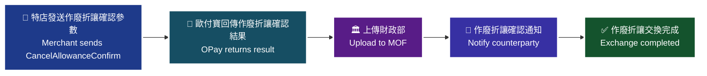

> ♿ 配色遵循 [`docs/accessibility.md`](../docs/accessibility.md)：WCAG AAA 對比 ≥7:1、Okabe-Ito 色盲安全色盤、16px 字體、直角連線、圖示＋文字雙編碼。
>
> ⚠️ 圖內細節未能自官方文件的文字內容取得，本圖依 API 語意重繪，請以官方文件圖片為準。

原文「作廢折讓確認情境流程圖」流程說明表：

| 處理角色 | 流程名稱 | 處理說明 |
|---|---|---|
| 特店 | 1.發送作廢折讓確認參數 | 特店呼叫作廢折讓確認API傳送作廢折讓確認參數。 |
| 歐付寶 | 2.回傳作廢折讓確認結果 | 接收並解析特店傳送過來的電子發票作廢折讓確認資料。確定作廢折讓確認無誤後，於歐付寶電子發票系統產生特店的發票作廢折讓確認資料。 |
| 歐付寶 | 3.上傳財政部 | 作廢成功後，歐付寶會把作廢成功的發票資料上傳財政部電子發票平台。 |
| 交易相對人 | 4.發票作廢折讓確認通知 | 上傳成功後，歐付寶會通知交易相對人電子發票已作廢折讓確認的訊息。 |

### 傳入參數（外層）

| 參數 | 參數名稱 | 型態 | 必填 | 說明 |
|---|---|---|---|---|
| PlatformID | 特約合作平台商代號 | String(10) | — | 1. 提供特約合作平台商向歐付寶申請開通後使用，一般廠商介接請放空值。<br>2. 平台商使用時，MerchantID(特店編號)欄位僅限帶入已綁定子廠商的特店編號，以免造成失敗。 |
| MerchantID | 特店編號 | String(10) | ✅ | 1. 測試環境合作特店編號 2. 正式環境金鑰取得 |
| RqHeader | 傳入資料 | — | ✅ | — |
| └─ RqHeader.Timestamp | 傳入時間 | Number | ✅ | 歐付寶會利用此參數將當下的時間轉為 Unix TimeStamp 來驗證此次介接的時間區間。<br>注意事項：<br>1. 驗證時間區間暫訂為 10 分鐘內有效，若超過此驗證時間則此次訂單將無法建立，參考資料：http://www.epochconverter.com/ 。<br>2. 合作特店須進行主機「時間校正」，避免主機產生時差，延伸 API 無法正常運作。 |
| Data | 加密資料 | String | ✅ | 回傳相關資料，此為加密過 JSON 格式的資料。加密方法說明 |

外層範例：

```json
{
    "MerchantID": "2000132",
    "RqHeader": {
        "Timestamp": 1525168923
    },
    "Data": "…"
}
```

### 傳入 Data 參數（加密前的 JSON）

| 參數 | 參數名稱 | 型態 | 必填 | 說明 |
|---|---|---|---|---|
| MerchantID | 特店編號 | String(10) | ✅ | — |
| AllowanceNo | 歐付寶折讓編號 | String(16) | ✅ | 長度固定為16碼 |
| Remark | 備註 | String(200) | — | — |

### 傳入 Data 範例

```json
{
    "MerchantID": "2000132",
    "AllowanceNo": "1909241702402030",
    "Remark": "Cancel_Allowance_Reamrk"
}
```

> ⚠️ 原文範例語法瑕疵，已照原文保留。（`Reamrk` 為原文拼字）

### 回傳參數（外層）

| 參數 | 參數名稱 | 型態 | 說明 |
|---|---|---|---|
| PlatformID | 特約合作平台商代號 | String(10) | — |
| MerchantID | 特店編號 | String(10) | — |
| RpHeader | 回傳資料 | — | — |
| └─ RpHeader.Timestamp | 回傳時間 | Number | — |
| TransCode | 回傳代碼 | Int | 1代表傳輸資料(MerchantID, RqHeader, Data)接收成功，其餘均為失敗 |
| TransMsg | 回傳訊息 | String(200) | 回傳訊息 |
| Data | 加密資料 | String | 回傳相關資料，此為加密過 JSON 格式的資料。加密方法說明 |

外層範例：

```json
{
"MerchantID": "2000132",
    "RpHeader": {
        "Timestamp": 1525169058
    },
    "TransCode": 1,
    "TransMsg": "",
    "Data": "…"
}
```

> ⚠️ 原文範例語法瑕疵，已照原文保留。（`"MerchantID"` 該行縮排跑掉）

### 回傳 Data 參數

| 參數 | 參數名稱 | 型態 | 說明 |
|---|---|---|---|
| RtnCode | 回應代碼 | Int | 1 為成功，其餘為失敗。 |
| RtnMsg | 回應訊息 | String(200) | — |

### 回傳 Data 範例

```json
{
    "RtnCode": 1,
    "RtnMsg": "新增成功"
}
```

### 注意事項

- 本 API 適用交換模式：需完成作廢折讓確認後才完成發票作廢折讓交換。
- `AllowanceNo`（歐付寶折讓編號）長度固定為 16 碼。
- 傳入時間 `Timestamp` 驗證區間暫訂為 10 分鐘內有效；合作特店須進行主機「時間校正」。
- 平台商使用時，`MerchantID` 欄位僅限帶入已綁定子廠商的特店編號，以免造成失敗；一般廠商介接 `PlatformID` 請放空值。

> ⚠️ 原文未針對本 API 列出 `RtnCode` 的完整狀態碼列舉，僅載明「1 為成功，其餘為失敗」。介接前請向歐付寶確認。

---

## 15. 註銷重開 — `VoidWithReIssue`

- **來源**：i200 §17
- **用途**：歐付寶收到營業人(特店)傳送發票註銷重開參數後，同時通知消費者(買家)電子發票已註銷重開。並立即將發票註銷請求上傳財政部，待財政部回覆發票註銷成功後，重新上傳發票開立至財政部。適用於發票註銷重開（發票號碼、開立時間不可更改）。
- **HTTP Method**：POST（`Content-Type: application/json`）
- **測試環境**：`https://einvoice-stage.opay.tw/B2BInvoice/VoidWithReIssue`
- **正式環境**：`https://einvoice.opay.tw/B2BInvoice/VoidWithReIssue`

> 🧭 **純文字重述（螢幕閱讀器友善）**：原文此處為「註銷重開情境流程圖」（原文僅有圖，未附流程說明表）。依 API 語意，流程為：1. 特店呼叫註銷重開 API，同時傳入註銷資料 `VoidModel` 與開立資料 `IssueModel` → 2. 歐付寶接收並通知消費者(買家)電子發票已註銷重開 → 3. 歐付寶立即將發票註銷請求上傳財政部 → 4. 財政部回覆發票註銷成功 → 5. 歐付寶重新上傳發票開立至財政部（發票號碼、開立時間不可更改）→ 6. 回傳發票號碼 `InvoiceNumber` 與隨機碼 `RandomNumber`。


> ♿ 配色遵循 [`docs/accessibility.md`](../docs/accessibility.md)：WCAG AAA 對比 ≥7:1、Okabe-Ito 色盲安全色盤、16px 字體、直角連線、圖示＋文字雙編碼。
>
> ⚠️ 圖內細節未能自官方文件的文字內容取得，本圖依 API 語意重繪，請以官方文件圖片為準。

### 傳入參數（外層）

| 參數 | 參數名稱 | 型態 | 必填 | 說明 |
|---|---|---|---|---|
| PlatformID | 特約合作平台商代號 | String(10) | — | 1. 提供特約合作平台商向歐付寶申請開通後使用，一般廠商介接請放空值。<br>2. 平台商使用時，MerchantID(特店編號)欄位僅限帶入已綁定子廠商的特店編號，以免造成失敗。 |
| MerchantID | 特店編號 | String(10) | ✅ | 1. 測試環境合作特店編號 2. 正式環境金鑰取得 |
| RqHeader | 傳入資料 | — | ✅ | — |
| └─ RqHeader.Timestamp | 傳入時間 | Number | ✅ | 歐付寶會利用此參數將當下的時間轉為 Unix TimeStamp 來驗證此次介接的時間區間。<br>注意事項：<br>1. 驗證時間區間暫訂為 10 分鐘內有效，若超過此驗證時間則此次訂單將無法建立，參考資料：http://www.epochconverter.com/ 。<br>2. 合作特店須進行主機「時間校正」，避免主機產生時差，延伸 API 無法正常運作。 |
| Data | 加密資料 | String | ✅ | 回傳相關資料，此為加密過 JSON 格式的資料。加密方法說明 |

外層範例：

```json
{
    "MerchantID": "2000132",
    "RqHeader": {
        "Timestamp": 1525168923
    },
    "Data": "…"
}
```

### 傳入 Data 參數（加密前的 JSON）

| 參數 | 參數名稱 | 型態 | 必填 | 說明 |
|---|---|---|---|---|
| MerchantID | 特店編號 | String(10) | ✅ | — |
| VoidModel | 註銷資料 | JSON | ✅ | — |
| VoidModel.InvoiceNumber | 發票號碼 | String(10) | ✅ | — |
| VoidModel.VoidReason | 註銷原因 | String(20) | ✅ | — |
| IssueModel | 開立資料 | JSON | ✅ | — |
| IssueModel.RelateNumber | 特店自訂編號 | String(50) | ✅ | 1. 須為唯一值不可重複 2. 請帶入原發票自訂編號<br>注意事項：僅限中文、英文、數字 |
| IssueModel.InvoiceTime | 發票開立時間 | String(20) | ✅ | 1.格式為 『yyyy-MM-dd HH:mm:ss』 或 『yyyy/MM/dd HH:mm:ss』 2.發票開立時間需為先前開立發票的時間 |
| IssueModel.CustomerIdentifier | 統一編號 | String(8) | ✅ | 1.格式為數字，固定長度為8碼 2.根據財政部的最新公告，針對統一編號的檢核方式做了調整。您可以點擊以下連結查看：[財政部財政資訊中心營利事業統一編號檢查碼邏輯修正說明] 3.如未符合上述檢核邏輯，則開立發票、設定交易對象維護資料時將會失敗，請營業人務必提供正確的統一編號 |
| IssueModel.CustomerAddress | 客戶地址 | String(100) | — | — |
| IssueModel.CustomerTelephoneNumber | 客戶手機號碼 | String(26) | — | 格式為數字 |
| IssueModel.CustomerEmail | 客戶電子信箱 | String(200) | — | 1.僅接受 Email 的標準格式。 2.多組Email請以半形分號區隔，未帶值時自動帶入交易對象維護API設定的資料<br>注意事項：測試環境請勿帶入之真實電子信箱，避免個資外洩。 測試環境僅作API串接測試使用，僅以API回覆成功或失敗；批次匯入功能/API不提供發信測試，僅驗規則。 格式檢核正規表達式見下方「`IssueModel.CustomerEmail` 格式檢核正規表達式」程式碼區塊。 |
| IssueModel.ClearanceMark | 通關方式 | String(1) | 條件 | 條件：1.當課稅類別[TaxType]為2(零稅率)時，則該參數請帶1(非經海關出口)或2(經海關出口) 2.當課稅類別[TaxType]不為2(零稅率)時，請忽略此參數 |
| IssueModel.InvType | 字軌類別 | String(2) | ✅ | 該張發票的字軌類型。<br>07：一般稅額<br>08 : 特種稅額 |
| IssueModel.TaxType | 課稅別 | String(1) | ✅ | 1.當字軌類別[InvType]為07(一般稅額計算之電子發票)時，則該參數請帶1(一般應稅)、2(零稅率)或3(免稅) 2.當字軌類別[InvType]為08(特種稅額計算之電子發票)時，則該參數請帶3(免稅)、4(特種應稅) |
| IssueModel.ZeroTaxRateReason | 零稅率原因 | String(2) | 條件 | 條件：自115年1月1日起，當課稅類別[TaxType]為2(零稅率)時，此欄位必填或廠商後台必須設定以便程式抓取，否則將會開立失敗，其值如下<br>71：第一款 外銷貨物<br>72：第二款 與外銷有關之勞務，或在國內提供而在國外使用之勞務<br>73：第三款 依法設立之免稅商店銷售與過境或出境旅客之貨物<br>74：第四款 銷售與保稅區營業人供營運之貨物或勞務<br>75：第五款 國際間之運輸。但外國運輸事業在中華民國境內經營國際運輸業務者，應以各該國對中華民國國際運輸事業予以相等待遇或免徵類似稅捐者為限<br>76：第六款 國際運輸用之船舶、航空器及遠洋漁船<br>77：第七款 銷售與國際運輸用之船舶、航空器及遠洋漁船所使用之貨物或修繕勞務<br>78：第八款 保稅區營業人銷售與課稅區營業人未輸往課稅區而直接出口之貨物<br>79：第九款 保稅區營業人銷售與課稅區營業人存入自由港區事業或海關管理之保稅倉庫、物流中心以供外銷之貨物 |
| IssueModel.SpecialTaxType | 特種稅額類別 | Number | 條件 | 條件：當課稅別[TaxType]為3 (免稅)時，則該參數必填，請填入數字【8】<br>當課稅別[TaxType]為4 (特種應稅)時，則該參數必填，可填入數字【1-8】，分別代表以下類別與稅率：<br>【1】代表酒家及有陪侍服務之茶室、咖啡廳、酒吧之營業稅稅率，稅率為25%<br>【2】代表夜總會、有娛樂節目之餐飲店之營業稅稅率，稅率為15%<br>【3】代表銀行業、保險業、信託投資業、證券業、期貨業、票券業及典當業之專屬本業收入(不含銀行業、保險業經營銀行、保險本業收入)之營業稅稅率，稅率為2%<br>【4】代表保險業之再保費收入之營業稅稅率，稅率為1%<br>【5】代表銀行業、保險業、信託投資業、證券業、期貨業、票券業及典當業之非專屬本業收入之營業稅稅率，稅率為5%<br>【6】代表銀行業、保險業經營銀行、保險本業收入之營業稅稅率(適用於民國103年07月以後銷售額)，稅率為5%<br>【7】代表銀行業、保險業經營銀行、保險本業收入之營業稅稅率(適用於民國103年06月以前銷售額)，稅率為5%<br>【8】代表空白為免稅或非銷項特種稅額之資料 |
| IssueModel.Items | 商品 | Array[Object] | — | 可多筆，商品最多支援999項 |
| IssueModel.Items[].ItemSeq | 商品排列序號 | Number | ✅ | 1.請帶1~999的整數值 2.商品排序不可重複 |
| IssueModel.Items[].ItemName | 商品名稱 | String(2) | ✅ | — |
| IssueModel.Items[].ItemCount | 商品數量 | Number | ✅ | 支援整數8位，小數7位。若未提供此參數，系統會有預設值0，將直接檢核商品數量[ItemCount]*商品價格[ItemPrice]與商品合計[ItemAmount]差距是否在1以內 |
| IssueModel.Items[].ItemWord | 商品單位 | String(6) | — | 商品單位最多6碼 |
| IssueModel.Items[].ItemPrice | 商品單價 | Number | ✅ | 支援整數最多10位，小數7位，請固定填入未稅價若未提供此參數，系統會有預設值0，將直接檢核商品數量[ItemCount]*商品價格[ItemPrice]與商品合計[ItemAmount]差距是否在1以內 |
| IssueModel.Items[].ItemAmount | 商品合計 | Number | ✅ | 支援整數最多12位，小數7位。定義【商品數量[ItemCount]*商品價格[ItemPrice]】=A，則商品合計的值與A四捨五入後的值，差距不可大於1 若未提供此參數，系統會有預設值0，將直接檢核商品數量[ItemCount]*商品價格[ItemPrice]與商品合計[ItemAmount]差距是否在1以內 |
| IssueModel.Items[].ItemTax | 商品稅額 | （原文型態欄位空白） | — | 請帶整數，最多11位。當課稅別[TaxType]為1(一般應稅)時，系統會將稅率設定為0.05 當課稅別[TaxType]為2(零稅率)時，系統會將稅率設定為0<br>當課稅別[TaxType]為3(免稅)時，系統會將稅率設定為0 當課稅別[TaxType]為4(特種應稅)時，以特種稅額類別[SpecialTaxType]決定稅率若商品稅額[ItemTax]有值，定義【商品合計[ItemAmount]*稅率】=B，則商品稅額的值與B四捨五入後的值，差距不可大於1<br>注意事項：財政部無提供此參數格式，此處提供營業人檢核營業稅額合計[TaxAmount]用，不會上傳。特種稅額發票請直接帶0 |
| IssueModel.Items[].ItemRemark | 商品備註 | String(120) | — | — |
| IssueModel.SalesAmount | 銷售額合計 | Number | ✅ | 請帶整數，最多12位，不可為0元 需等於商品合計[ItemAmount]加總後四捨五入至整數的值 |
| IssueModel.TaxAmount | 稅額合計 | Number | ✅ | 請帶整數，最多11位 當課稅別[TaxType]為1(一般應稅)時，系統會將稅率設定為0.05 當課稅別[TaxType]為2(零稅率)時，系統會將稅率設定為0 當課稅別[TaxType]為3(免稅)時，系統會將稅率設定為0 當課稅別[TaxType]為4(特種應稅)時，以特種稅額類別[SpecialTaxType]決定稅率 定義【銷售額合計[SalesAmount]乘以稅率後再四捨五入至整數】為C，則稅額合計[TaxAmount]的值與C的差距不可大於2<br>注意事項：<br>1.特種稅額發票請直接帶0<br>2.當收到以下錯誤訊息”商品稅額加總與營業稅額誤差超過2元”，請將各商品之商品稅額[ItemTax]填入，並確認與調整各商品稅額[ItemTax]，使得商品稅額[ItemTax]加總與稅額合計[TaxAmount]誤差少於2元 |
| IssueModel.TotalAmount | 發票金額 | Number | — | 請帶整數，最多12位，不可為0元 需等於銷售額合計[SalesAmountAmount]與稅額合計[TaxAomunt]相加 |
| IssueModel.InvoiceRemark | 發票備註 | String(200) | — | — |

`IssueModel.CustomerEmail` 格式檢核正規表達式（原文逐字）：

```text
^((([A–Za–z]|\d|[!#\$%&‘\*\+\-\/=\?\^_`{\|}~]|[\u00A0-\uD7FF\uF900-\uFDCF\uFDF0-\uFFEF])+(\.([A-Za-z]|\d|[!#\$%&’\*\+\-\/=\?\^_`{\|}~]|[\u00A0-\uD7FF\uF900-\uFDCF\uFDF0-\uFFEF])+)*)|((\x22)((((\x20|\x09)*(\x0d\x0a))?(\x20|\x09)+)?(([\x01-\x08\x0b\x0c\x0e-\x1f\x7f]|\x21|[\x23-\x5b]|[\x5d-\x7e]|[\u00A0-\uD7FF\uF900-\uFDCF\uFDF0-\uFFEF])|(\\([\x01-\x09\x0b\x0c\x0d-\x7f]|[\u00A0-\uD7FF\uF900-\uFDCF\uFDF0-\uFFEF]))))*(((\x20|\x09)*(\x0d\x0a))?(\x20|\x09)+)?(\x22)))@((([A-Za-z]|\d|[\u00A0-\uD7FF\uF900-\uFDCF\uFDF0-\uFFEF])|(([A-Za-z]|\d|[\u00A0-\uD7FF\uF900-\uFDCF\uFDF0-\uFFEF])([A-Za-z]|\d|-|\.|_|~|[\u00A0-\uD7FF\uF900-\uFDCF\uFDF0-\uFFEF])*([A-Za-z]|\d|[\u00A0-\uD7FF\uF900-\uFDCF\uFDF0-\uFFEF])))\.)+(([A-Za-z]|[\u00A0-\uD7FF\uF900-\uFDCF\uFDF0-\uFFEF])|(([A-Za-z]|[\u00A0-\uD7FF\uF900-\uFDCF\uFDF0-\uFFEF])([A-Za-z]|\d|-|\.|_|~|[\u00A0-\uD7FF\uF900-\uFDCF\uFDF0-\uFFEF])*([A-Za-z]|[\u00A0-\uD7FF\uF900-\uFDCF\uFDF0-\uFFEF])))\.?$
```

> ⚠️ 原文表格瑕疵，已照原文保留：
> - `IssueModel.Items[].ItemName` 型態原文寫 `String(2)`（與商品名稱語意不符，疑為原文誤植）。
> - `IssueModel.Items[].ItemTax` 原文「型態」欄位為空白。
> - `IssueModel.TotalAmount` 說明中的 `SalesAmountAmount`、`TaxAomunt` 為原文拼字，實際欄位名為 `SalesAmount`、`TaxAmount`。
>
> ⚠️ 原文未明確說明，介接前請向歐付寶確認：`IssueModel.Items` 於原文未加必填星號，但其子欄位 `ItemSeq` / `ItemName` / `ItemCount` / `ItemPrice` / `ItemAmount` 皆為必填。

### 傳入 Data 範例

```json
{
   "MerchantID": "2000132",
   "VoidModel": {
   "InvoiceNumber": "MM00000000",
   "VoidReason": "Test"
   },
   "IssueModel": {
    "RelateNumber": "233e23dhgbdy2dub67287hdweiudwj",
    "InvoiceTime": "2018-10-28 23:12:34",
    "CustomerIdentifier": "",
    "CustomerAddress": "106台北市南港區發票一街1號1樓",
    "CustomerTelephoneNumber": "",
    "CustomerEmail": "test@ecpay.com.tw",
    "ClearanceMark": "1",
    "InvType": "07",
    "TaxType": "2",
    "ZeroTaxRateReason": "71",
    "SalesAmount": 100,
    "InvoiceRemark": "發票備註",
    "SalesAmount": "100",
    "TaxAmount": "0",
    "TotalAmount": "100",
    "Items": [
        {
            "ItemSeq": 1,
            "ItemName": "item01",
            "ItemCount": 1,
            "ItemWord": "件",
            "ItemPrice": 50,
            "ItemTaxType": "1",
            "ItemAmount": 50,
            "ItemRemark": "item01_desc"
        },
        {
            "ItemSeq": 2,
            "ItemName": "item02",
            "ItemCount": 1,
            "ItemWord": "個",
            "ItemPrice": 20,
            "ItemTaxType": "1",
            "ItemAmount": 20,
            "ItemRemark": "item02_desc"
        },
        {
            "ItemSeq": 3,
            "ItemName": "item03",
            "ItemCount": 3,
            "ItemWord": "粒",
            "ItemPrice": 10,
            "ItemTaxType": "1",
            "ItemAmount": 30,
            "ItemRemark": "item03_desc"
        }
    ]
 }
}
```

> ⚠️ 原文範例語法瑕疵，已照原文保留：
> - `"SalesAmount"` 在 `IssueModel` 中出現兩次（先為數值 `100`，後為字串 `"100"`），JSON 鍵重複。
> - 範例中 `Items[]` 出現 `"ItemTaxType"` 欄位，但原文參數表並未列出此欄位。
> - `CustomerIdentifier` 為必填欄位，但範例帶空字串 `""`。
> - `VoidModel` 內縮排、以及結尾 ` }` 縮排跑掉。
>
> ⚠️ 原文未明確說明，介接前請向歐付寶確認：`ItemTaxType` 的用途與是否需要帶入。

### 回傳參數（外層）

| 參數 | 參數名稱 | 型態 | 說明 |
|---|---|---|---|
| PlatformID | 特約合作平台商代號 | String(10) | — |
| MerchantID | 特店編號 | String(10) | — |
| RpHeader | 回傳資料 | — | — |
| └─ RpHeader.Timestamp | 回傳時間 | Number | — |
| TransCode | 回傳代碼 | Int | 1代表傳輸資料(MerchantID, RqHeader, Data)接收成功，其餘均為失敗 |
| TransMsg | 回傳訊息 | String(200) | 回傳訊息 |
| Data | 加密資料 | String | 回傳相關資料，此為加密過 JSON 格式的資料。加密方法說明 |

外層範例：

```json
{
"MerchantID": "2000132",
    "RpHeader": {
        "Timestamp": 1525169058
    },
    "TransCode": 1,
    "TransMsg": "",
    "Data": "…"
}
```

> ⚠️ 原文範例語法瑕疵，已照原文保留。（`"MerchantID"` 該行縮排跑掉）

### 回傳 Data 參數

原文標註：Data 參數說明（Json 格式）：**請先將 Data 進行 AES 解密後再做 urldecode**。

| 參數 | 參數名稱 | 型態 | 說明 |
|---|---|---|---|
| RtnCode | 回應代碼 | Int | 1 為成功，其餘為失敗。 |
| RtnMsg | 回應訊息 | String(200) | — |
| InvoiceNumber | 發票號碼 | String(10) | 若開立成功，則會回傳一組發票號碼 若開立失敗，則會回傳空值 |
| RandomNumber | 隨機碼 | String(4) | — |

### 回傳 Data 範例

```json
{
    "RtnCode": 1,
    "RtnMsg": "新增成功",
    "InvoiceNumber": "201810280000000001",
    "RandomNumber": "6866"
}
```

> ⚠️ 原文範例語法瑕疵，已照原文保留。（`InvoiceNumber` 型態為 `String(10)`，但範例值 `"201810280000000001"` 長度為 18 碼）

### 注意事項

- 適用於發票註銷重開：**發票號碼、開立時間不可更改**。`VoidModel.InvoiceNumber` 需為原發票號碼；`IssueModel.InvoiceTime` 需為先前開立發票的時間。
- `IssueModel.RelateNumber` 須為唯一值不可重複，請帶入原發票自訂編號；僅限中文、英文、數字。
- `IssueModel.CustomerIdentifier`：格式為數字、固定長度 8 碼；財政部已調整營利事業統一編號檢查碼邏輯，若未符合檢核邏輯，開立發票、設定交易對象維護資料時將會失敗，請營業人務必提供正確的統一編號。
- `IssueModel.CustomerEmail`：測試環境請勿帶入真實電子信箱，避免個資外洩；測試環境僅作 API 串接測試使用，僅以 API 回覆成功或失敗；批次匯入功能/API 不提供發信測試，僅驗規則。
- `IssueModel.ClearanceMark`：當 `TaxType` 為 2(零稅率) 時必帶 1(非經海關出口) 或 2(經海關出口)；`TaxType` 不為 2 時請忽略此參數。
- `IssueModel.ZeroTaxRateReason`：自 115 年 1 月 1 日起，當 `TaxType` 為 2(零稅率) 時，此欄位必填或廠商後台必須設定以便程式抓取，否則將會開立失敗。
- `IssueModel.Items[].ItemTax`：財政部無提供此參數格式，此處提供營業人檢核營業稅額合計 `TaxAmount` 用，不會上傳；特種稅額發票請直接帶 0。
- `IssueModel.TaxAmount`：特種稅額發票請直接帶 0；當收到錯誤訊息「商品稅額加總與營業稅額誤差超過2元」，請將各商品之 `ItemTax` 填入並調整，使 `ItemTax` 加總與 `TaxAmount` 誤差少於 2 元。
- `IssueModel.SalesAmount`、`IssueModel.TotalAmount` 不可為 0 元；`TotalAmount` 需等於 `SalesAmount` 與 `TaxAmount` 相加。
- 商品最多支援 999 項；`ItemSeq` 請帶 1~999 的整數值且不可重複。
- 回傳 Data 需先進行 AES 解密後再做 urldecode。
- 傳入時間 `Timestamp` 驗證區間暫訂為 10 分鐘內有效；合作特店須進行主機「時間校正」。
- 平台商使用時，`MerchantID` 欄位僅限帶入已綁定子廠商的特店編號，以免造成失敗；一般廠商介接 `PlatformID` 請放空值。

## 16. 查詢發票 — `GetIssue`

- **來源**：i200 §18
- **用途**：特店（營業人）可使用此 API 查詢已開立發票資訊，包括銷項發票及進項發票，歐付寶會以回傳參數方式回覆該張發票資料。此方式可協助特店（營業人）將查詢發票機制整合至營業人網站，提供快速查詢服務。
- **HTTP Method**：POST（`Content-Type: application/json`）
- **測試環境**：`https://einvoice-stage.opay.tw/B2BInvoice/GetIssue`
- **正式環境**：`https://einvoice.opay.tw/B2BInvoice/GetIssue`

### 情境流程圖

> 🧭 **純文字重述（螢幕閱讀器友善）**：特店系統先把查詢條件（特店編號、B2B 發票種類、發票號碼、發票開立日期、自訂編號）組成 JSON，做 URLEncode 後以 AES-128-CBC/PKCS7 加密放入 `Data`；以 POST 呼叫歐付寶 `GetIssue`；歐付寶驗證 `Timestamp` 與特店身分後查詢發票資料；回應以加密的 `Data` 回傳；特店系統解密後取得 `RtnCode`／`RtnMsg`／`RtnData`，`RtnData` 內含該張發票的完整明細與 `Items` 商品清單。

```mermaid
%%{init: {'flowchart': {'curve':'step','htmlLabels':true,'useMaxWidth':true},'themeVariables': {'fontSize':'16px','fontFamily':'ui-sans-serif, system-ui, sans-serif'}}}%%
flowchart LR
    A["🏪 特店系統<br/>Merchant System"] --> B["🔐 組 Data 並加密<br/>Build &amp; Encrypt Data"]
    B --> C["📮 POST /B2BInvoice/GetIssue<br/>Call OPay API"]
    C --> D["🔎 歐付寶查詢發票資料<br/>OPay Queries Invoice"]
    D --> E["📦 回傳加密 Data<br/>Encrypted Response"]
    E --> F["✅ 解密取得 RtnData<br/>Decrypt Invoice Detail"]
    classDef s1 fill:#1E3A8A,stroke:#FFFFFF,stroke-width:3px,color:#FFFFFF
    classDef s2 fill:#3730A3,stroke:#FFFFFF,stroke-width:3px,color:#FFFFFF
    classDef s3 fill:#164E63,stroke:#FFFFFF,stroke-width:3px,color:#FFFFFF
    classDef s4 fill:#581C87,stroke:#FFFFFF,stroke-width:3px,color:#FFFFFF
    classDef s5 fill:#134E4A,stroke:#FFFFFF,stroke-width:3px,color:#FFFFFF
    classDef ok fill:#14532D,stroke:#FFFFFF,stroke-width:3px,color:#FFFFFF
    class A s1
    class B s2
    class C s3
    class D s4
    class E s5
    class F ok
```

> ♿ 配色遵循 [`docs/accessibility.md`](../docs/accessibility.md)：WCAG AAA 對比 ≥7:1、Okabe-Ito 色盲安全色盤、16px 字體、直角連線、圖示＋文字雙編碼。

> ⚠️ 原文此處僅擷取到圖說文字「查詢發票情境流程圖」，圖內細節未能自官方文件的文字內容取得，本圖依 API 語意重繪，請以官方文件圖片為準。

**本章之後的 11 支查詢類 API（第 17～27 節）情境流程與本圖相同**，僅 endpoint 與查詢條件不同，故各節以一行文字指回本圖，不再重複繪製。

### 傳入參數（外層）

| 參數 | 參數名稱 | 型態 | 必填 | 說明 |
| --- | --- | --- | --- | --- |
| PlatformID | 特約合作平台商代號 | String(10) | — | 1. 提供特約合作平台商向歐付寶申請開通後使用，一般廠商介接請放空值。<br>2. 平台商使用時，MerchantID(特店編號)欄位僅限帶入已綁定子廠商的特店編號，以免造成失敗。 |
| MerchantID | 特店編號 | String(10) | ✅ | 1. 測試環境合作特店編號 2. 正式環境金鑰取得 |
| RqHeader | 傳入資料 | （物件） | ✅ | （原文未填說明） |
| RqHeader.Timestamp | 傳入時間 | Number | ✅ | 歐付寶會利用此參數將當下的時間轉為 Unix TimeStamp 來驗證此次介接的時間區間。注意事項：<br>1. 驗證時間區間暫訂為10分鐘內有效，若超過此驗證時間則此次訂單將無法建立，參考資料：http://www.epochconverter.com/。<br>2. 合作特店須進行主機「時間校正」，避免主機產生時差，延伸 API 無法正常運作。 |
| Data | 加密資料 | String | ✅ | 回傳相關資料，此為加密過 JSON 格式的資料。加密方法說明 |

**外層範例**：

```json
{
    "MerchantID": "2000132",
    "RqHeader": {
        "Timestamp": 1525168923
    },
    "Data": "…"
}
```

### 傳入 Data 參數（加密前的 JSON）

| 參數 | 參數名稱 | 型態 | 必填 | 說明 |
| --- | --- | --- | --- | --- |
| MerchantID | 特店編號 | String(10) | ✅ | （原文未填說明） |
| InvoiceCategory | B2B發票種類 | Int | ✅ | 0:銷項發票(查詢特店開給交易相對人的發票明細)<br>1:進項發票(查詢交易相對人開給特店的發票明細) |
| InvoiceNumber | 發票號碼 | String(10) | ✅ | （原文未填說明） |
| InvoiceDate | 發票開立日期 | String(20) | ✅ | 格式為 yyyy-mm-dd |
| RelateNumber | 自訂編號 | String(20) | — | 均為唯一值不可重覆使用 |

### 傳入 Data 範例

```json
{
    "MerchantID": "2000132",
    "InvoiceCategory": 0,
"InvoiceNumber": "SA37758327",
    "InvoiceDate": "2019-08-31",
    "RelateNumber": "2019081602"
}
```

> ⚠️ 原文範例語法瑕疵（`"InvoiceNumber"` 一行縮排跑掉），已照原文保留。

### 回傳參數（外層）

| 參數 | 參數名稱 | 型態 | 說明 |
| --- | --- | --- | --- |
| PlatformID | 特約合作平台商代號 | String(10) | （原文未填說明） |
| MerchantID | 特店編號 | String(10) | （原文未填說明） |
| RpHeader | 回傳資料 | （物件） | （原文未填說明） |
| RpHeader.Timestamp | 回傳時間 | Number | （原文未填說明） |
| TransCode | 回傳代碼 | Int | 1代表傳輸資料(MerchantID, RqHeader, Data)接收成功，其餘均為失敗 |
| TransMsg | 回傳訊息 | String(200) | 回傳訊息 |
| Data | 加密資料 | String | 回傳相關資料，此為加密過 JSON 格式的資料。加密方法說明 |

**外層範例**：

```json
{
"MerchantID": "2000132",
    "RpHeader": {
        "Timestamp": 1525169058
    },
    "TransCode": 1,
    "TransMsg": "",
    "Data": "…"
}
```

> ⚠️ 原文範例語法瑕疵（第一行縮排跑掉），已照原文保留。

### 回傳 Data 參數

**Data（解密後）**：

| 參數 | 參數名稱 | 型態 | 說明 |
| --- | --- | --- | --- |
| RtnCode | 回應代碼 | Int | 1 為成功，其餘為失敗。 |
| RtnMsg | 回應訊息 | String(200) | （原文未填說明） |
| RtnData | 回應資料 | String | （原文未填說明） |

**RtnData（發票明細）**：

| 參數 | 參數名稱 | 型態 | 說明 |
| --- | --- | --- | --- |
| RtnData.MerchantID | 特店編號 | String(10) | （原文未填說明） |
| RtnData.InvoiceNumber | 發票號碼 | String(10) | （原文未填說明） |
| RtnData.InvoiceDate | 發票開立日期 | String(20) | 格式為 yyyy-mm-dd |
| RtnData.RelateNumber | 自訂編號 | String(20) | 均為唯一值不可重覆使用 |
| RtnData.Buyer_Identifier | 買方統編 | String(8) | （原文未填說明） |
| RtnData.Buyer_Name | 買方名稱 | String(60) | （原文未填說明） |
| RtnData.Buyer_Address | 買方地址 | String(100) | （原文未填說明） |
| RtnData.Buyer_TelephoneNumber | 買方電話 | String(26) | （原文未填說明） |
| RtnData.Buyer_EmailAddress | 買方電子信箱 | String(80) | （原文未填說明） |
| RtnData.Buyer_FacsimileNumber | 買方傳真號碼 | String(26) | （原文未填說明） |
| RtnData.Seller_Identifier | 賣方統編 | String(8) | 若B2B發票種類[InvoiceCategory]=0，此欄為空值 |
| RtnData.Seller_Name | 賣方名稱 | String(60) | 若B2B發票種類[InvoiceCategory]=0，此欄為空值 |
| RtnData.Seller_Address | 賣方地址 | String(100) | 若B2B發票種類[InvoiceCategory]=0，此欄為空值 |
| RtnData.Seller_TelephoneNumber | 賣方電話 | String(26) | 若B2B發票種類[InvoiceCategory]=0，此欄為空值 |
| RtnData.Seller_EmailAddress | 賣方電子信箱 | String(80) | 若B2B發票種類[InvoiceCategory]=0，此欄為空值 |
| RtnData.Seller_FacsimileNumber | 賣方傳真號碼 | String(26) | 若B2B發票種類[InvoiceCategory]=0，此欄為空值 |
| RtnData.CustomsClearanceMark | 通關方式註記 | String(1) | 1：非經海關出口<br>2：經海關出口 |
| RtnData.InvoiceType | 字軌類別 | String(1) | 07：一般稅額計算<br>08：特種稅額計算 |
| RtnData.TaxType | 課稅別 | Int | 1：一般應稅<br>2：零稅率<br>3：免稅<br>4：特種應稅 |
| RtnData.ZeroTaxRateReason | 零稅率原因 | String(2) | 71：第一款 外銷貨物<br>72：第二款 與外銷有關之勞務，或在國內提供而在國外使用之勞務<br>73：第三款 依法設立之免稅商店銷售與過境或出境旅客之貨物<br>74：第四款 銷售與保稅區營業人供營運之貨物或勞務<br>75：第五款 國際間之運輸。但外國運輸事業在中華民國境內經營國際運輸業務者，應以各該國對中華民國國際運輸事業予以相等待遇或免徵類似稅捐者為限<br>76：第六款 國際運輸用之船舶、航空器及遠洋漁船<br>77：第七款 銷售與國際運輸用之船舶、航空器及遠洋漁船所使用之貨物或修繕勞務<br>78：第八款 保稅區營業人銷售與課稅區營業人未輸往課稅區而直接出口之貨物<br>79：第九款 保稅區營業人銷售與課稅區營業人存入自由港區事業或海關管理之保稅倉庫、物流中心以供外銷之貨物 |
| RtnData.TaxRate | 稅率 | Number | （原文未填說明） |
| RtnData.SpecialTaxType | 特種稅額類別 | String(1) | 數字【1-8】分別代表以下類別與稅率<br>-【1】代表酒家及有陪侍服務之茶室、咖啡廳、酒吧之營業稅稅率，稅率為25%<br>-【2】代表夜總會、有娛樂節目之餐飲店之營業稅稅率，稅率為15%<br>-【3】代表銀行業、保險業、信託投資業、證券業、期貨業、票券業及典當業之專屬本業收入(不含銀行業、保險業經營銀行、保險本業收入)之營業稅稅率，稅率為2%<br>-【4】代表保險業之再保費收入之營業稅稅率，稅率為1%<br>-【5】代表銀行業、保險業、信託投資業、證券業、期貨業、票券業及典當業之非專屬本業收入之營業稅稅率，稅率為5%<br>-【6】代表銀行業、保險業經營銀行、保險本業收入之營業稅稅率(適用於民國103年07月以後銷售額) ，稅率為5%<br>-【7】代表銀行業、保險業經營銀行、保險本業收入之營業稅稅率(適用於民國103年06月以前銷售額) ，稅率為5%<br>-【8】代表空白為免稅或非銷項特種稅額之資料 |
| RtnData.SalesAmount | 銷售額合計 | Int | （原文未填說明） |
| RtnData.TaxAmount | 營業稅額 | Int | （原文未填說明） |
| RtnData.TotalAmount | 發票金額 | Int | （原文未填說明） |
| RtnData.IP | 發票開立IP | String(15) | IPV4 |
| RtnData.CreateDate | 建檔時間 | String(20) | 格式為 yyyy-mm-dd hh:mm:ss |
| RtnData.Issue_Status | 發票開立狀態 | String(1) | 0: 發票退回<br>1: 發票開立 |
| RtnData.Upload_Status | 上傳狀態 | String(1) | 若B2B發票種類[InvoiceCategory]=1，此欄為空值<br>0: 未上傳<br>1: 已上傳<br>2: 上傳失敗 |
| RtnData.Upload_Date | 上傳時間 | String(20) | 若B2B發票種類[InvoiceCategory]=1，此欄為null |
| RtnData.ConfirmDate | 發票確認時間 | String(20) | 1. 格式為 yyyy-mm-dd 2. 若未作設定，此欄為null |
| RtnData.Invalid_Status | 發票作廢狀態 | String(1) | 0: 未作廢<br>1: 已作廢 |
| RtnData.ExchangeMode | 發票開立方式 | String(1) | 0: 存證<br>1. 交換 |
| RtnData.ExchangeStatus | 發票確認狀態 | String(1) | 若為空值表示未設定<br>0: 未確認<br>1: 已確認 |
| RtnData.BalanceAmount | 剩餘可折讓金額 | Number | （原文未填說明） |
| RtnData.MainRemark | 發票備註 | String(200) | （原文未填說明） |
| RtnData.RandomNumber | 隨機碼 | String(4) | 四碼的隨機數字 |
| RtnData.Items | 傳入資料 | （陣列） | （原文標題欄寫「傳入資料」，實為回傳的商品明細陣列） |
| RtnData.Items[].ItemSeq | 商品明細排列序號 | String(3) | （原文未填說明） |
| RtnData.Items[].ItemName | 商品名稱 | String(256) | （原文未填說明） |
| RtnData.Items[].ItemCount | 商品數量 | Number | （原文未填說明） |
| RtnData.Items[].ItemWord | 商品單位 | String(6) | 商品單位最多是6碼 |
| RtnData.Items[].ItemPrice | 商品價格 | Number | （原文未填說明） |
| RtnData.Items[].ItemAmount | 商品合計 | Number | （原文未填說明） |
| RtnData.Items[].ItemTax | 商品稅額 | Int | （原文未填說明） |
| RtnData.Items[].ItemRemark | 商品備註 | String(200) | （原文未填說明） |

**Data 範例**：

```json
{
    "RtnCode": 1,
    "RtnMsg": "查詢成功",
   "RtnData": "…"
}
```

### 回傳 Data 範例

**RtnData 範例**：

```json
{
    "MerchantID": "2000132",
    "InvoiceDate": "2019-08-31",
    "RelateNumber": "2019081602",
    "Buyer_Identifier": "11456006",
    "Buyer_Name": "黃黑糖的店",
    "Buyer_Address": "200基隆市仁愛區２００基隆市仁愛區２００基隆市仁愛區",
    "Buyer_TelephoneNumber": "02-12344321",
"Buyer_EmailAddress": "abc@sunup.net",
"Buyer_FacsimileNumber": "",
    "CustomsClearanceMark": "",
    "InvoiceType": "07",
    "TaxType": 1,
    "TaxRate": 0.05,
    "SalesAmount": 952,
    "TaxAmount": 48,
"TotalAmount": 1000,
"IP": 2130706433,
    "CreateDate": "2019-09-03 13:57:07",
    "Issue_Status": "1",
    "Invalid_Status": "0",
"IP": "4000003",
    "Upload_Status": "1",
    "Upload_Date": "2019-09-03 14:57:07",
    "ConfirmDate": "2019-09-03 15:57:07",
    "ExchangeStatus": "1",
    "ExchangeMode": "0",
    "BalanceAmount": 952,
    "MainRemark": "",
"RandomNumber": "6686",
    "Items": [
        {
            "ItemSeq": 1,
"ItemName": "手機測試",
            "ItemCount": 1,
            "ItemWord": "支",
            "ItemPrice": 952,
            "ItemAmount": 952,
            "ItemTax": 48,
            "ItemRemark": ""
        }
    ]
}
```

> ⚠️ 原文範例語法瑕疵，已照原文保留：`"IP"` 鍵重複出現兩次（先 `2130706433`、後 `"4000003"`），範例中未出現 `InvoiceNumber`，`"ItemSeq": 1` 以數字表示但欄位型態為 `String(3)`，且多行縮排跑掉。

### 注意事項

- 傳入參數表原文標註：「參數名稱前若有紅色星號 `*` 為必填欄位」。
- `Timestamp` 驗證時間區間暫訂為 10 分鐘內有效，超過此驗證時間則此次訂單將無法建立；合作特店須進行主機「時間校正」，避免主機產生時差，延伸 API 無法正常運作。
- `PlatformID` 僅供特約合作平台商向歐付寶申請開通後使用，一般廠商介接請放空值；平台商使用時，`MerchantID` 欄位僅限帶入已綁定子廠商的特店編號，以免造成失敗。
- `Data` 為加密過的 JSON 字串，加密方式請見附錄「參數加密方式說明」。
- 當 `InvoiceCategory=0`（銷項發票）時，`Seller_Identifier`、`Seller_Name`、`Seller_Address`、`Seller_TelephoneNumber`、`Seller_EmailAddress`、`Seller_FacsimileNumber` 皆為空值。
- 當 `InvoiceCategory=1`（進項發票）時，`Upload_Status` 為空值、`Upload_Date` 為 null。

---

## 17. 查詢發票確認 — `GetIssueConfirm`

- **來源**：i200 §19
- **用途**：特店（營業人）可使用此 API 查詢已開立發票是否完成確認資訊，包括銷項發票及進項發票，歐付寶會以回傳參數方式回覆該張發票資料。此方式可協助特店（營業人）將查詢發票確認機制整合至特店（營業人）網站，提供快速查詢服務。
- **HTTP Method**：POST（`Content-Type: application/json`）
- **測試環境**：`https://einvoice-stage.opay.tw/B2BInvoice/GetIssueConfirm`
- **正式環境**：`https://einvoice.opay.tw/B2BInvoice/GetIssueConfirm`

### 情境流程圖

原文圖說為「查詢發票確認情境流程圖」，流程與[第 16 節 查詢發票](#16-查詢發票--getissue)相同（僅 endpoint 與查詢條件不同），完整 Mermaid 流程圖請見該節。

> ⚠️ 圖內細節未能自官方文件的文字內容取得，第 16 節之圖依 API 語意重繪，請以官方文件圖片為準。

### 傳入參數（外層）

| 參數 | 參數名稱 | 型態 | 必填 | 說明 |
| --- | --- | --- | --- | --- |
| PlatformID | 特約合作平台商代號 | String(10) | — | 1. 提供特約合作平台商向歐付寶申請開通後使用，一般廠商介接請放空值。<br>2. 平台商使用時，MerchantID(特店編號)欄位僅限帶入已綁定子廠商的特店編號，以免造成失敗。 |
| MerchantID | 特店編號 | String(10) | ✅ | 1. 測試環境合作特店編號 2. 正式環境金鑰取得 |
| RqHeader | 傳入資料 | （物件） | ✅ | （原文未填說明） |
| RqHeader.Timestamp | 傳入時間 | Number | ✅ | 歐付寶會利用此參數將當下的時間轉為 Unix TimeStamp 來驗證此次介接的時間區間。注意事項：<br>1. 驗證時間區間暫訂為10分鐘內有效，若超過此驗證時間則此次訂單將無法建立，參考資料：http://www.epochconverter.com/。<br>2. 合作特店須進行主機「時間校正」，避免主機產生時差，延伸 API 無法正常運作。 |
| Data | 加密資料 | String | ✅ | 回傳相關資料，此為加密過 JSON 格式的資料。加密方法說明 |

**外層範例**：

```json
{
    "MerchantID": "2000132",
    "RqHeader": {
        "Timestamp": 1525168923
    },
    "Data": "…"
}
```

### 傳入 Data 參數（加密前的 JSON）

| 參數 | 參數名稱 | 型態 | 必填 | 說明 |
| --- | --- | --- | --- | --- |
| MerchantID | 特店編號 | String(10) | ✅ | （原文未填說明） |
| InvoiceCategory | B2B發票種類 | Int | ✅ | 0:銷項發票(查詢特店開給交易相對人的發票是否已確認)<br>1:進項發票(查詢交易相對人開給特店的發票是否已確認) |
| InvoiceNumber | 發票號碼 | String(10) | 條件 | 當自訂編號[RelateNumber]為空值時，此欄需有值。 |
| InvoiceDate | 發票開立日期 | String(20) | 條件 | 1. 格式為 yyyy-mm-dd 2. 當發票號碼[InvoiceNumber]有值時，此欄必填。 |
| RelateNumber | 自訂編號 | String(20) | 條件 | 當發票號碼[InvoiceNumber]為空值時，此欄需有值。 |
| Seller_Identifier | 賣家統一編號 | String(8) | — | （原文未填說明） |
| Buyer_Identifier | 買家統一編號 | String(8) | — | （原文未填說明） |
| InvoiceDateBegin | 發票開立日期起始日 | String(20) | — | 格式為 yyyy-mm-dd |
| InvoiceDateEnd | 發票開立日期結束日 | String(20) | — | 格式為 yyyy-mm-dd |
| InvoiceNumberBegin | 發票號碼起始號碼 | String(8) | — | 不包含字軌(例: 00000000) |
| InvoiceNumberEnd | 發票號碼結束號碼 | String(8) | — | 不包含字軌(例: 00000000) |
| Issue_Status | 發票狀態 | String(1) | — | 1: 發票開立<br>0: 發票退回 |
| Invalid_Status | 作廢狀態 | String(1) | — | 1: 已作廢<br>0: 未作廢 |
| ExchangeMode | 上傳模式 | String(1) | — | 1: 交換<br>0: 存證 |
| ExchangeStatus | 發票開立交換進度 | String(1) | — | 若為空值表示未設定<br>1: 完成, 當ExchangeMode=0<br>0: 開立等待確認<br>1: 接收開立確認, 當ExchangeMode=1 |
| Upload_Status | 上傳狀態 | String(1) | — | 0: 未上傳<br>1: 已上傳<br>2: 上傳失敗 |

> ⚠️ 原文 `ExchangeStatus` 的列舉值中「1」出現兩次（`ExchangeMode=0` 時 1 表示完成；`ExchangeMode=1` 時 0 表示開立等待確認、1 表示接收開立確認），語意依 `ExchangeMode` 而不同。此處照原文逐字保留，介接前請向歐付寶確認。

### 傳入 Data 範例

```json
{
    "MerchantID": "2000132",
    "InvoiceCategory": 0,
    "InvoiceNumber": "SA37758327",
    "InvoiceDate": "2019-08-31",
    "RelateNumber": "2019081602",
    "Seller_Identifier": "",
    "Buyer_Identifier": "",
    "InvoiceDateBeign": "",
    "InvoiceDateEnd": "",
    "InvoiceNumberBegin": "",
    "InvoiceNumberEnd": "",
    "Issue_Status": "",
    "Invalid_Status": "",
    "ExchangeMode": "",
    "ExchangeStatus": "",
    "Upload_Status": ""
}
```

> ⚠️ 原文範例語法瑕疵，已照原文保留：範例中的鍵名為 `"InvoiceDateBeign"`，與參數表中的 `InvoiceDateBegin` 拼寫不一致。實際應以參數表的 `InvoiceDateBegin` 為準，介接前請向歐付寶確認。

### 回傳參數（外層）

| 參數 | 參數名稱 | 型態 | 說明 |
| --- | --- | --- | --- |
| PlatformID | 特約合作平台商代號 | String(10) | （原文未填說明） |
| MerchantID | 特店編號 | String(10) | （原文未填說明） |
| RpHeader | 回傳資料 | （物件） | （原文未填說明） |
| RpHeader.Timestamp | 回傳時間 | Number | （原文未填說明） |
| TransCode | 回傳代碼 | Int | 1代表傳輸資料(MerchantID, RqHeader, Data)接收成功，其餘均為失敗 |
| TransMsg | 回傳訊息 | String(200) | 回傳訊息 |
| Data | 加密資料 | String | 回傳相關資料，此為加密過 JSON 格式的資料。加密方法說明 |

**外層範例**：

```json
{
"MerchantID": "2000132",
    "RpHeader": {
        "Timestamp": 1525169058
    },
    "TransCode": 1,
    "TransMsg": "",
    "Data": "…"
}
```

> ⚠️ 原文範例語法瑕疵（第一行縮排跑掉），已照原文保留。

### 回傳 Data 參數

**Data（解密後）**：

| 參數 | 參數名稱 | 型態 | 說明 |
| --- | --- | --- | --- |
| RtnCode | 回應代碼 | Int | 1 為成功，其餘為失敗。 |
| RtnMsg | 回應訊息 | String(200) | （原文未填說明） |
| RtnData | 回應資料 | String | （原文未填說明） |

**RtnData（發票確認資訊）**：

| 參數 | 參數名稱 | 型態 | 說明 |
| --- | --- | --- | --- |
| RtnData.MerchantID | 特店編號 | String(10) | （原文未填說明） |
| RtnData.InvoiceNumber | 發票號碼 | String(10) | （原文未填說明） |
| RtnData.InvoiceDate | 發票開立日期 | String(20) | 格式為 yyyy-mm-dd |
| RtnData.Buyer_Identifier | 買方統編 | String(8) | （原文未填說明） |
| RtnData.Seller_Identifier | 賣方統編 | String(8) | （原文未填說明） |
| RtnData.ConfirmDate | 確認日期 | String(20) | 1. 格式為 yyyy-mm-dd 2. 若未作設定，此欄為null |
| RtnData.Upload_Status | 上傳狀態 | String(1) | 若B2B發票種類[InvoiceCategory]=0，此欄為空值<br>0: 未上傳<br>1: 已上傳<br>2: 上傳失敗 |
| RtnData.Upload_Date | 上傳時間 | String(20) | 若B2B發票種類[InvoiceCategory]=0，此欄為null |
| RtnData.ConfirmRemark | 備註 | String(200) | （原文未填說明） |

**Data 範例**：

```json
{
    "RtnCode": 1,
    "RtnMsg": "查詢成功",
    "RtnData": ""
}
```

### 回傳 Data 範例

**RtnData 範例**：

```json
{
    "MerchantID": "2000132",
    "InvoiceNumber": " SA37758327",
    "InvoiceDate": "2019-08-31",
    "Buyer_Identifier": "11456006",
    "Seller_Identifier": "",
    "ConfirmDate": "2019-09-02",
    "Upload_Status": "",
"Upload_Date": "2019-09-01",
    "ConfirmRemark": ""}
```

> ⚠️ 原文範例語法瑕疵，已照原文保留：`"InvoiceNumber"` 值前有多餘空白（`" SA37758327"`）、`"Upload_Date"` 一行縮排跑掉、結尾 `}` 緊接在最後一個欄位之後。

### 注意事項

- 傳入參數表原文標註：「參數名稱前若有紅色星號 `*` 為必填欄位」。
- `InvoiceNumber` 與 `RelateNumber` 互為條件必填：當 `RelateNumber` 為空值時 `InvoiceNumber` 需有值；當 `InvoiceNumber` 為空值時 `RelateNumber` 需有值。
- 當 `InvoiceNumber` 有值時，`InvoiceDate` 必填。
- 當 `InvoiceCategory=0`（銷項發票）時，`Upload_Status` 為空值、`Upload_Date` 為 null。
- `Timestamp` 驗證時間區間暫訂為 10 分鐘內有效；合作特店須進行主機「時間校正」。
- `PlatformID` 僅供特約合作平台商申請開通後使用，一般廠商請放空值；平台商使用時 `MerchantID` 僅限帶入已綁定子廠商的特店編號。

---

## 18. 查詢作廢發票 — `GetInvalid`

- **來源**：i200 §20
- **用途**：特店（營業人）可使用此 API 查詢已作廢發票資訊，包括銷項發票及進項發票，歐付寶會以回傳參數方式回覆該張發票資料。此方式可協助特店（營業人）將查詢發票作廢機制整合至特店（營業人）網站，提供快速查詢服務。
- **HTTP Method**：POST（`Content-Type: application/json`）
- **測試環境**：`https://einvoice-stage.opay.tw/B2BInvoice/GetInvalid`
- **正式環境**：`https://einvoice.opay.tw/B2BInvoice/GetInvalid`

### 情境流程圖

原文圖說為「查詢作廢發票情境流程圖」，流程與[第 16 節 查詢發票](#16-查詢發票--getissue)相同（僅 endpoint 與查詢條件不同），完整 Mermaid 流程圖請見該節。

> ⚠️ 圖內細節未能自官方文件的文字內容取得，第 16 節之圖依 API 語意重繪，請以官方文件圖片為準。

### 傳入參數（外層）

| 參數 | 參數名稱 | 型態 | 必填 | 說明 |
| --- | --- | --- | --- | --- |
| PlatformID | 特約合作平台商代號 | String(10) | — | 1. 提供特約合作平台商向歐付寶申請開通後使用，一般廠商介接請放空值。<br>2. 平台商使用時，MerchantID(特店編號)欄位僅限帶入已綁定子廠商的特店編號，以免造成失敗。 |
| MerchantID | 特店編號 | String(10) | ✅ | 1. 測試環境合作特店編號 2. 正式環境金鑰取得 |
| RqHeader | 傳入資料 | （物件） | ✅ | （原文未填說明） |
| RqHeader.Timestamp | 傳入時間 | Number | ✅ | 歐付寶會利用此參數將當下的時間轉為 Unix TimeStamp 來驗證此次介接的時間區間。注意事項：<br>1. 驗證時間區間暫訂為10分鐘內有效，若超過此驗證時間則此次訂單將無法建立，參考資料：http://www.epochconverter.com/。<br>2. 合作特店須進行主機「時間校正」，避免主機產生時差，延伸 API 無法正常運作。 |
| Data | 加密資料 | String | ✅ | 回傳相關資料，此為加密過 JSON 格式的資料。加密方法說明 |

**外層範例**：

```json
{
    "MerchantID": "2000132",
    "RqHeader": {
        "Timestamp": 1525168923
    },
    "Data": "…"
}
```

### 傳入 Data 參數（加密前的 JSON）

| 參數 | 參數名稱 | 型態 | 必填 | 說明 |
| --- | --- | --- | --- | --- |
| MerchantID | 特店編號 | String(10) | ✅ | （原文未填說明） |
| InvoiceCategory | B2B發票種類 | Int | ✅ | 0: 銷項發票(查詢特店開給交易相對人的作廢發票明細)<br>1: 進項發票(查詢交易相對人開給特店的作廢發票明細) |
| InvoiceNumber | 發票號碼 | String(10) | 條件 | 當自訂編號[RelateNumber]為空值時，此欄需有值。 |
| InvoiceDate | 發票開立日期 | String(20) | 條件 | 1. 格式為 yyyy-mm-dd 2. 當發票號碼[InvoiceNumber]有值時，此欄必填。 |
| RelateNumber | 自訂編號 | String(20) | 條件 | 當發票號碼[InvoiceNumber]為空值時，此欄需有值。 |

### 傳入 Data 範例

```json
{
    "MerchantID": "2000132",
    "InvoiceCategory": 0,
"InvoiceNumber": "SA37758327",
    "InvoiceDate": "2019-08-31",
    "RelateNumber": "2019081602"
}
```

> ⚠️ 原文範例語法瑕疵（`"InvoiceNumber"` 一行縮排跑掉），已照原文保留。

### 回傳參數（外層）

| 參數 | 參數名稱 | 型態 | 說明 |
| --- | --- | --- | --- |
| PlatformID | 特約合作平台商代號 | String(10) | （原文未填說明） |
| MerchantID | 特店編號 | String(10) | （原文未填說明） |
| RpHeader | 回傳資料 | （物件） | （原文未填說明） |
| RpHeader.Timestamp | 回傳時間 | Number | （原文未填說明） |
| TransCode | 回傳代碼 | Int | 1代表傳輸資料(MerchantID, RqHeader, Data)接收成功，其餘均為失敗 |
| TransMsg | 回傳訊息 | String(200) | 回傳訊息 |
| Data | 加密資料 | String | 回傳相關資料，此為加密過 JSON 格式的資料。加密方法說明 |

**外層範例**：

```json
{
"MerchantID": "2000132",
    "RpHeader": {
        "Timestamp": 1525169058
    },
    "TransCode": 1,
    "TransMsg": "",
    "Data": "…"
}
```

> ⚠️ 原文範例語法瑕疵（第一行縮排跑掉），已照原文保留。

### 回傳 Data 參數

**Data（解密後）**：

| 參數 | 參數名稱 | 型態 | 說明 |
| --- | --- | --- | --- |
| RtnCode | 回應代碼 | Int | 1 為成功，其餘為失敗。 |
| RtnMsg | 回應訊息 | String(200) | （原文未填說明） |
| RtnData | 回應資料 | String | （原文未填說明） |

**RtnData（作廢發票資訊）**：

| 參數 | 參數名稱 | 型態 | 說明 |
| --- | --- | --- | --- |
| RtnData.MerchantID | 特店編號 | String(10) | （原文未填說明） |
| RtnData.InvoiceNumber | 發票號碼 | String(10) | （原文未填說明） |
| RtnData.BuyerId | 買方統編 | String(8) | （原文未填說明） |
| RtnData.SellerId | 賣方統編 | String(8) | （原文未填說明） |
| RtnData.CancelDate | 作廢日期 | String(20) | 格式為 yyyy-mm-dd |
| RtnData.CancelTime | 作廢時間 | String(10) | （原文未填說明） |
| RtnData.CancelReason | 作廢原因 | String(20) | （原文未填說明） |
| RtnData.Upload_Status | 上傳狀態 | String(1) | 若B2B發票種類[InvoiceCategory]=1，此欄為空值<br>0: 未上傳<br>1: 已上傳<br>2: 上傳失敗 |
| RtnData.Upload_Date | 上傳時間 | String(20) | 若B2B發票種類[InvoiceCategory]=1，此欄為null |
| RtnData.ConfirmDate | 作廢確認日期 | String(20) | 1. 格式為 yyyy-mm-dd 2. 若未作設定，此欄為null |
| RtnData.ExchangeStatus | 作廢確認狀態 | String(1) | 若為空值表示未設定<br>0: 未確認<br>1: 已確認 |
| RtnData.Remark | 備註 | String(200) | （原文未填說明） |

**Data 範例**：

```json
{
    "RtnCode": 1,
    "RtnMsg": "查詢成功",
    "RtnData": ""
}
```

### 回傳 Data 範例

**RtnData 範例**：

```json
    "MerchantID": "2000132",
    "InvoiceNumber": "VG11000002",
    "BuyerId": "23165448",
    "SellerId": "",
    "CancelDate": "2019-09-23",
    "CancelTime": "13:39:24",
    "CancelReason": "",
    "Upload_Status": "",
    "Upload_Date": "2019-09-24",
    "ConfirmDate": "2019-09-25",
    "ExchangeStatus": "1",
    "Remark": ""
}
```

> ⚠️ 原文範例語法瑕疵，已照原文保留：範例缺少開頭的 `{`。

### 注意事項

- 傳入參數表原文標註：「參數名稱前若有紅色星號 `*` 為必填欄位」。
- `InvoiceNumber` 與 `RelateNumber` 互為條件必填；當 `InvoiceNumber` 有值時 `InvoiceDate` 必填。
- 當 `InvoiceCategory=1`（進項發票）時，`Upload_Status` 為空值、`Upload_Date` 為 null。
- 本 API 回傳的買賣方統編欄位名稱為 `BuyerId` / `SellerId`（與其他多數查詢 API 的 `Buyer_Identifier` / `Seller_Identifier` 不同），請勿混用。
- `Timestamp` 驗證時間區間暫訂為 10 分鐘內有效；合作特店須進行主機「時間校正」。

---

## 19. 查詢作廢發票確認 — `GetInvalidConfirm`

- **來源**：i200 §21
- **用途**：特店（營業人）可使用此 API 查詢已作廢發票是否完成確認資訊，包括銷項發票及進項發票，歐付寶會以回傳參數方式回覆該張發票資料。此方式可協助特店（營業人）將查詢發票作廢確認機制整合至特定（營業人）網站，提供快速查詢服務。
- **HTTP Method**：POST（`Content-Type: application/json`）
- **測試環境**：`https://einvoice-stage.opay.tw/B2BInvoice/GetInvalidConfirm`
- **正式環境**：`https://einvoice.opay.tw/B2BInvoice/GetInvalidConfirm`

### 情境流程圖

原文圖說為「查詢作廢確認情境流程圖」，流程與[第 16 節 查詢發票](#16-查詢發票--getissue)相同（僅 endpoint 與查詢條件不同），完整 Mermaid 流程圖請見該節。

> ⚠️ 圖內細節未能自官方文件的文字內容取得，第 16 節之圖依 API 語意重繪，請以官方文件圖片為準。

### 傳入參數（外層）

| 參數 | 參數名稱 | 型態 | 必填 | 說明 |
| --- | --- | --- | --- | --- |
| PlatformID | 特約合作平台商代號 | String(10) | — | 1. 提供特約合作平台商向歐付寶申請開通後使用，一般廠商介接請放空值。<br>2. 平台商使用時，MerchantID(特店編號)欄位僅限帶入已綁定子廠商的特店編號，以免造成失敗。 |
| MerchantID | 特店編號 | String(10) | ✅ | 1. 測試環境合作特店編號 2. 正式環境金鑰取得 |
| RqHeader | 傳入資料 | （物件） | ✅ | （原文未填說明） |
| RqHeader.Timestamp | 傳入時間 | Number | ✅ | 歐付寶會利用此參數將當下的時間轉為 Unix TimeStamp 來驗證此次介接的時間區間。注意事項：<br>1. 驗證時間區間暫訂為10分鐘內有效，若超過此驗證時間則此次訂單將無法建立，參考資料：http://www.epochconverter.com/。<br>2. 合作特店須進行主機「時間校正」，避免主機產生時差，延伸 API 無法正常運作。 |
| Data | 加密資料 | String | ✅ | 回傳相關資料，此為加密過 JSON 格式的資料。加密方法說明 |

**外層範例**：

```json
{
    "MerchantID": "2000132",
    "RqHeader": {
        "Timestamp": 1525168923
    },
    "Data": "…"
}
```

### 傳入 Data 參數（加密前的 JSON）

| 參數 | 參數名稱 | 型態 | 必填 | 說明 |
| --- | --- | --- | --- | --- |
| MerchantID | 特店編號 | String(10) | ✅ | （原文未填說明） |
| InvoiceCategory | B2B發票種類 | Int | ✅ | 0: 銷項發票(查詢特店提供給交易相對人的作廢發票是否已確認)<br>1: 進項發票(查詢交易相對人提供給特店的作廢發票是否已確認) |
| InvoiceNumber | 發票號碼 | String(10) | 條件 | 當自訂編號[RelateNumber]為空值時，此欄需有值。 |
| InvoiceDate | 發票開立日期 | String(20) | 條件 | 1. 格式為 yyyy-mm-dd 2. 當發票號碼[InvoiceNumber]有值時，此欄必填。 |
| RelateNumber | 自訂編號 | String(20) | 條件 | 當發票號碼[InvoiceNumber]為空值時，此欄需有值。 |

### 傳入 Data 範例

```json
{
    "MerchantID": "2000132",
    "InvoiceCategory": 0,
"InvoiceNumber": "SA37758327",
    "InvoiceDate": "2019-08-31",
    "RelateNumber": "2019081602"
}
```

> ⚠️ 原文範例語法瑕疵（`"InvoiceNumber"` 一行縮排跑掉），已照原文保留。

### 回傳參數（外層）

| 參數 | 參數名稱 | 型態 | 說明 |
| --- | --- | --- | --- |
| PlatformID | 特約合作平台商代號 | String(10) | （原文未填說明） |
| MerchantID | 特店編號 | String(10) | （原文未填說明） |
| RpHeader | 回傳資料 | （物件） | （原文未填說明） |
| RpHeader.Timestamp | 回傳時間 | Number | （原文未填說明） |
| TransCode | 回傳代碼 | Int | 1代表傳輸資料(MerchantID, RqHeader, Data)接收成功，其餘均為失敗 |
| TransMsg | 回傳訊息 | String(200) | 回傳訊息 |
| Data | 加密資料 | String | 回傳相關資料，此為加密過 JSON 格式的資料。加密方法說明 |

**外層範例**：

```json
{
"MerchantID": "2000132",
    "RpHeader": {
        "Timestamp": 1525169058
    },
    "TransCode": 1,
    "TransMsg": "",
    "Data": "…"
}
```

> ⚠️ 原文範例語法瑕疵（第一行縮排跑掉），已照原文保留。

### 回傳 Data 參數

**Data（解密後）**：

| 參數 | 參數名稱 | 型態 | 說明 |
| --- | --- | --- | --- |
| RtnCode | 回應代碼 | Int | 1 為成功，其餘為失敗。 |
| RtnMsg | 回應訊息 | String(200) | （原文未填說明） |
| RtnData | 回應資料 | String | （原文未填說明） |

**RtnData（作廢確認資訊）**：

| 參數 | 參數名稱 | 型態 | 說明 |
| --- | --- | --- | --- |
| RtnData.MerchantID | 特店編號 | String(10) | （原文未填說明） |
| RtnData.InvoiceNumber | 發票號碼 | String(10) | （原文未填說明） |
| RtnData.Buyer_Identifier | 買方統編 | String(8) | （原文未填說明） |
| RtnData.Seller_Identifier | 賣方統編 | String(8) | （原文未填說明） |
| RtnData.CancelDate | 作廢日期 | String(20) | 格式為yyyy-mm-dd |
| RtnData.CancelReason | 作廢原因 | String(20) | （原文未填說明） |
| RtnData.ConfirmDate | 作廢確認日期 | String(20) | 1. 格式為yyyy-mm-dd 2. 若未作設定，此欄為null |
| RtnData.Upload_Status | 上傳狀態 | String(1) | 若B2B發票種類[InvoiceCategory]=0，此欄為空值<br>0: 未上傳<br>1: 已上傳<br>2: 上傳失敗 |
| RtnData.Upload_Date | 上傳時間 | String(20) | 1. 格式為yyyy-mm-dd 2. 若B2B發票種類[InvoiceCategory]=0，此欄為null |
| RtnData.ConfirmRemark | 備註 | String(200) | （原文未填說明） |

**Data 範例**：

```json
{
    "RtnCode": 1,
    "RtnMsg": "查詢成功",
    "RtnData": ""
}
```

### 回傳 Data 範例

**RtnData 範例**：

```json
{
    "MerchantID": "2000132",
    "InvoiceNumber": "VG11000002",
    "Buyer_Identifier": "23165448",
    "Seller_Identifier": "",
    "CancelDate": "2019-09-01",
    "CancelReason": "",
    "ConfirmDate": "2019-09-02",
    "Upload_Status": "",
    "Upload_Date": "2019-09-01",
    "ConfirmRemark": ""
}
```

### 注意事項

- 傳入參數表原文標註：「參數名稱前若有紅色星號 `*` 為必填欄位」。
- `InvoiceNumber` 與 `RelateNumber` 互為條件必填；當 `InvoiceNumber` 有值時 `InvoiceDate` 必填。
- 當 `InvoiceCategory=0`（銷項發票）時，`Upload_Status` 為空值、`Upload_Date` 為 null。
- `Timestamp` 驗證時間區間暫訂為 10 分鐘內有效；合作特店須進行主機「時間校正」。

---

## 20. 查詢退回發票 — `GetReject`

- **來源**：i200 §22
- **用途**：特店（營業人）可使用此 API 查詢已退回發票資訊，包括銷項發票及進項發票，歐付寶會以回傳參數方式回覆該張發票資料。此方式可協助特店（營業人）將查詢發票退回機制整合至特店（營業人）網站，提供快速查詢服務。
- **HTTP Method**：POST（`Content-Type: application/json`）
- **測試環境**：`https://einvoice-stage.opay.tw/B2BInvoice/GetReject`
- **正式環境**：`https://einvoice.opay.tw/B2BInvoice/GetReject`

### 情境流程圖

原文圖說為「查詢退回發票情境流程圖」，流程與[第 16 節 查詢發票](#16-查詢發票--getissue)相同（僅 endpoint 與查詢條件不同），完整 Mermaid 流程圖請見該節。

> ⚠️ 圖內細節未能自官方文件的文字內容取得，第 16 節之圖依 API 語意重繪，請以官方文件圖片為準。

### 傳入參數（外層）

| 參數 | 參數名稱 | 型態 | 必填 | 說明 |
| --- | --- | --- | --- | --- |
| PlatformID | 特約合作平台商代號 | String(10) | — | 1. 提供特約合作平台商向歐付寶申請開通後使用，一般廠商介接請放空值。<br>2. 平台商使用時，MerchantID(特店編號)欄位僅限帶入已綁定子廠商的特店編號，以免造成失敗。 |
| MerchantID | 特店編號 | String(10) | ✅ | 1. 測試環境合作特店編號 2. 正式環境金鑰取得 |
| RqHeader | 傳入資料 | （物件） | ✅ | （原文未填說明） |
| RqHeader.Timestamp | 傳入時間 | Number | ✅ | 歐付寶會利用此參數將當下的時間轉為 Unix TimeStamp 來驗證此次介接的時間區間。注意事項：<br>1. 驗證時間區間暫訂為10分鐘內有效，若超過此驗證時間則此次訂單將無法建立，參考資料：http://www.epochconverter.com/。<br>2. 合作特店須進行主機「時間校正」，避免主機產生時差，延伸 API 無法正常運作。 |
| Data | 加密資料 | String | ✅ | 回傳相關資料，此為加密過 JSON 格式的資料。加密方法說明 |

**外層範例**：

```json
{
    "MerchantID": "2000132",
    "RqHeader": {
        "Timestamp": 1525168923
    },
    "Data": "…"
}
```

### 傳入 Data 參數（加密前的 JSON）

| 參數 | 參數名稱 | 型態 | 必填 | 說明 |
| --- | --- | --- | --- | --- |
| MerchantID | 特店編號 | String(10) | ✅ | （原文未填說明） |
| InvoiceCategory | B2B發票種類 | Int | ✅ | 0: 銷項發票(查詢特店開給交易相對人的退回發票明細)<br>1: 進項發票(查詢交易相對人開給特店的退回發票明細) |
| InvoiceNumber | 發票號碼 | String(10) | 條件 | 當自訂編號[RelateNumber]為空值時，此欄需有值。 |
| InvoiceDate | 發票開立日期 | String(20) | 條件 | 1. 格式為 yyyy-mm-dd 2. 當發票號碼[InvoiceNumber]有值時，此欄必填。 |
| RelateNumber | 自訂編號 | String(20) | 條件 | 當發票號碼[InvoiceNumber]為空值時，此欄需有值。 |

### 傳入 Data 範例

```json
{
    "MerchantID": "2000132",
    "InvoiceCategory": 0,
"InvoiceNumber": "SA37758327",
    "InvoiceDate": "2019-08-31",
    "RelateNumber": "2019081602"
}
```

> ⚠️ 原文範例語法瑕疵（`"InvoiceNumber"` 一行縮排跑掉），已照原文保留。

### 回傳參數（外層）

| 參數 | 參數名稱 | 型態 | 說明 |
| --- | --- | --- | --- |
| PlatformID | 特約合作平台商代號 | String(10) | （原文未填說明） |
| MerchantID | 特店編號 | String(10) | （原文未填說明） |
| RpHeader | 回傳資料 | （物件） | （原文未填說明） |
| RpHeader.Timestamp | 回傳時間 | Number | （原文未填說明） |
| TransCode | 回傳代碼 | Int | 1代表傳輸資料(MerchantID, RqHeader, Data)接收成功，其餘均為失敗 |
| TransMsg | 回傳訊息 | String(200) | 回傳訊息 |
| Data | 加密資料 | String | 回傳相關資料，此為加密過 JSON 格式的資料。加密方法說明 |

**外層範例**：

```json
{
"MerchantID": "2000132",
    "RpHeader": {
        "Timestamp": 1525169058
    },
    "TransCode": 1,
    "TransMsg": "",
    "Data": "…"
}
```

> ⚠️ 原文範例語法瑕疵（第一行縮排跑掉），已照原文保留。

### 回傳 Data 參數

**Data（解密後）**：

| 參數 | 參數名稱 | 型態 | 說明 |
| --- | --- | --- | --- |
| RtnCode | 回應代碼 | Int | 1 為成功，其餘為失敗。 |
| RtnMsg | 回應訊息 | String(200) | （原文未填說明） |
| RtnData | 回應資料 | String | （原文未填說明） |

**RtnData（退回發票資訊）**：

| 參數 | 參數名稱 | 型態 | 說明 |
| --- | --- | --- | --- |
| RtnData.MerchantID | 特店編號 | String(10) | （原文未填說明） |
| RtnData.InvoiceNumber | 發票號碼 | String(10) | （原文未填說明） |
| RtnData.Buyer_Identifier | 買方統編 | String(8) | （原文未填說明） |
| RtnData.Seller_Identifier | 賣方統編 | String(8) | （原文未填說明） |
| RtnData.RejectDate | 退回日期 | String(20) | 格式為 yyyy-mm-dd |
| RtnData.RejectReason | 退回原因 | String(20) | （原文未填說明） |
| RtnData.Upload_Status | 上傳狀態 | String(1) | 若B2B發票種類[InvoiceCategory]=1，此欄為空值<br>0: 未上傳<br>1: 已上傳<br>2: 上傳失敗 |
| RtnData.Upload_Date | 上傳時間 | String(20) | 若B2B發票種類[InvoiceCategory]=1，此欄為null |
| RtnData.ConfirmDate | 退回確認日期 | String(20) | 1. 格式為 yyyy-mm-dd 2. 若未作設定，此欄為null |
| RtnData.ExchangeStatus | 退回確認狀態 | String(1) | 若為空值表示未設定<br>0: 未確認<br>1: 已確認 |
| RtnData.Remark | 備註 | String(200) | （原文未填說明） |

**Data 範例**：

```json
{
    "RtnCode": 1,
    "RtnMsg": "查詢成功",
    "RtnData": ""
}
```

### 回傳 Data 範例

**RtnData 範例**：

```json
{
    "MerchantID": "2000132",
    "InvoiceNumber": " VG11000002",
    "Buyer_Identifier": "23165448",
    "Seller_Identifier": "",
    "RejectDate": "2019-09-02",
    "RejectReason": "",
    "Upload_Status": "",
    "Upload_Date": "2019-09-24",
    "ConfirmDate": "2019-09-25",
    "ExchangeStatus": "1",
    "Remark": ""
}
```

> ⚠️ 原文範例語法瑕疵，已照原文保留：`"InvoiceNumber"` 值前有多餘空白（`" VG11000002"`）。

### 注意事項

- 傳入參數表原文標註：「參數名稱前若有紅色星號 `*` 為必填欄位」。
- `InvoiceNumber` 與 `RelateNumber` 互為條件必填；當 `InvoiceNumber` 有值時 `InvoiceDate` 必填。
- 當 `InvoiceCategory=1`（進項發票）時，`Upload_Status` 為空值、`Upload_Date` 為 null。
- `Timestamp` 驗證時間區間暫訂為 10 分鐘內有效；合作特店須進行主機「時間校正」。

---

## 21. 查詢退回發票確認 — `GetRejectConfirm`

- **來源**：i200 §23
- **用途**：特店（營業人）可使用此 API 查詢已退回發票是否完成確認資訊，包括銷項發票及進項發票，歐付寶會以回傳參數方式回覆該張發票資料。此方式可協助特店（營業人）將查詢發票退回確認機制整合至特店（營業人）網站，提供快速查詢服務。
- **HTTP Method**：POST（`Content-Type: application/json`）
- **測試環境**：`https://einvoice-stage.opay.tw/B2BInvoice/GetRejectConfirm`
- **正式環境**：`https://einvoice.opay.tw/B2BInvoice/GetRejectConfirm`

### 情境流程圖

原文圖說為「查詢退回發票確認情境流程圖」，流程與[第 16 節 查詢發票](#16-查詢發票--getissue)相同（僅 endpoint 與查詢條件不同），完整 Mermaid 流程圖請見該節。

> ⚠️ 圖內細節未能自官方文件的文字內容取得，第 16 節之圖依 API 語意重繪，請以官方文件圖片為準。

### 傳入參數（外層）

| 參數 | 參數名稱 | 型態 | 必填 | 說明 |
| --- | --- | --- | --- | --- |
| PlatformID | 特約合作平台商代號 | String(10) | — | 1. 提供特約合作平台商向歐付寶申請開通後使用，一般廠商介接請放空值。<br>2. 平台商使用時，MerchantID(特店編號)欄位僅限帶入已綁定子廠商的特店編號，以免造成失敗。 |
| MerchantID | 特店編號 | String(10) | ✅ | 1. 測試環境合作特店編號 2. 正式環境金鑰取得 |
| RqHeader | 傳入資料 | （物件） | ✅ | （原文未填說明） |
| RqHeader.Timestamp | 傳入時間 | Number | ✅ | 歐付寶會利用此參數將當下的時間轉為 Unix TimeStamp 來驗證此次介接的時間區間。注意事項：<br>1. 驗證時間區間暫訂為10分鐘內有效，若超過此驗證時間則此次訂單將無法建立，參考資料：http://www.epochconverter.com/。<br>2. 合作特店須進行主機「時間校正」，避免主機產生時差，延伸 API 無法正常運作。 |
| Data | 加密資料 | String | ✅ | 回傳相關資料，此為加密過 JSON 格式的資料。加密方法說明 |

**外層範例**：

```json
{
    "MerchantID": "2000132",
    "RqHeader": {
        "Timestamp": 1525168923
    },
    "Data": "…"
}
```

### 傳入 Data 參數（加密前的 JSON）

| 參數 | 參數名稱 | 型態 | 必填 | 說明 |
| --- | --- | --- | --- | --- |
| MerchantID | 特店編號 | String(10) | ✅ | （原文未填說明） |
| InvoiceCategory | B2B發票種類 | Int | ✅ | 0: 銷項發票(查詢特店開給交易相對人的發票是否完成退回確認)<br>1: 進項發票(查詢交易相對人開給特店的發票是否完成退回確認) |
| InvoiceNumber | 發票號碼 | String(10) | 條件 | 當自訂編號[RelateNumber]為空值時，此欄需有值。 |
| InvoiceDate | 發票開立日期 | String(20) | 條件 | 1. 格式為 yyyy-mm-dd 2. 當發票號碼[InvoiceNumber]有值時，此欄必填。 |
| RelateNumber | 自訂編號 | String(20) | 條件 | 當發票號碼[InvoiceNumber]為空值時，此欄需有值。 |

### 傳入 Data 範例

```json
{
    "MerchantID": "2000132",
    "InvoiceCategory": 0,
"InvoiceNumber": "SA37758327",
    "InvoiceDate": "2019-08-31",
    "RelateNumber": "2019081602"
}
```

> ⚠️ 原文範例語法瑕疵（`"InvoiceNumber"` 一行縮排跑掉），已照原文保留。

### 回傳參數（外層）

| 參數 | 參數名稱 | 型態 | 說明 |
| --- | --- | --- | --- |
| PlatformID | 特約合作平台商代號 | String(10) | （原文未填說明） |
| MerchantID | 特店編號 | String(10) | （原文未填說明） |
| RpHeader | 回傳資料 | （物件） | （原文未填說明） |
| RpHeader.Timestamp | 回傳時間 | Number | （原文未填說明） |
| TransCode | 回傳代碼 | Int | 1代表傳輸資料(MerchantID, RqHeader, Data)接收成功，其餘均為失敗 |
| TransMsg | 回傳訊息 | String(200) | 回傳訊息 |
| Data | 加密資料 | String | 回傳相關資料，此為加密過 JSON 格式的資料。加密方法說明 |

**外層範例**：

```json
{
"MerchantID": "2000132",
    "RpHeader": {
        "Timestamp": 1525169058
    },
    "TransCode": 1,
    "TransMsg": "",
    "Data": "…"
}
```

> ⚠️ 原文範例語法瑕疵（第一行縮排跑掉），已照原文保留。

### 回傳 Data 參數

**Data（解密後）**：

| 參數 | 參數名稱 | 型態 | 說明 |
| --- | --- | --- | --- |
| RtnCode | 回應代碼 | Int | 1 為成功，其餘為失敗。 |
| RtnMsg | 回應訊息 | String(200) | （原文未填說明） |
| RtnData | 回應資料 | String | （原文未填說明） |

**RtnData（退回確認資訊）**：

| 參數 | 參數名稱 | 型態 | 說明 |
| --- | --- | --- | --- |
| RtnData.MerchantID | 特店編號 | String(10) | （原文未填說明） |
| RtnData.InvoiceNumber | 發票號碼 | String(10) | （原文未填說明） |
| RtnData.Buyer_Identifier | 買方統編 | String(8) | （原文未填說明） |
| RtnData.Seller_Identifier | 賣方統編 | String(8) | （原文未填說明） |
| RtnData.RejectDate | 作廢日期 | String(20) | 格式為 yyyy-mm-dd |
| RtnData.RejectReason | 作廢原因 | String(20) | （原文未填說明） |
| RtnData.ConfirmDate | 退回確認日期 | String(20) | 1. 格式為 yyyy-mm-dd 2. 若未作設定，此欄為null |
| RtnData.Upload_Status | 上傳狀態 | String(1) | 若B2B發票種類[InvoiceCategory]=0，此欄為空值<br>0: 未上傳<br>1: 已上傳<br>2: 上傳失敗 |
| RtnData.Upload_Date | 上傳時間 | String(20) | 1. 格式為 yyyy-mm-dd 2. 若B2B發票種類[InvoiceCategory]=0，此欄為null |
| RtnData.ConfirmRemark | 備註 | String(200) | （原文未填說明） |

> ⚠️ 原文於本節將 `RejectDate` / `RejectReason` 的參數名稱寫為「作廢日期」／「作廢原因」（第 20 節 `GetReject` 則寫為「退回日期」／「退回原因」）。此處照原文逐字保留，介接前請向歐付寶確認。

**Data 範例**：

```json
{
    "RtnCode": 1,
    "RtnMsg": "查詢成功",
    "RtnData": ""
}
```

### 回傳 Data 範例

**RtnData 範例**：

```json
{
    "MerchantID": "2000132"
    "InvoiceNumber": " VG11000002",
    "Buyer_Identifier": "23165448",
    "Seller_Identifier": "",
    "RejectDate": "2019-09-02",
    "RejectReason": "",
    "ConfirmDate": "2019-09-03",
    "Upload_Status": "",
    "Upload_Date": "2019-09-02",
    "ConfirmRemark": ""
}
```

> ⚠️ 原文範例語法瑕疵，已照原文保留：`"MerchantID": "2000132"` 之後缺少逗號、`"InvoiceNumber"` 值前有多餘空白。

### 注意事項

- 傳入參數表原文標註：「參數名稱前若有紅色星號 `*` 為必填欄位」。
- `InvoiceNumber` 與 `RelateNumber` 互為條件必填；當 `InvoiceNumber` 有值時 `InvoiceDate` 必填。
- 當 `InvoiceCategory=0`（銷項發票）時，`Upload_Status` 為空值、`Upload_Date` 為 null。
- `Timestamp` 驗證時間區間暫訂為 10 分鐘內有效；合作特店須進行主機「時間校正」。

---

## 22. 查詢折讓發票 — `GetAllowance`

- **來源**：i200 §24
- **用途**：特店（營業人）可使用此 API 查詢發票折讓資訊，歐付寶會以回傳參數方式回覆該張發票折讓資料。此方式可協助特店（營業人）將查詢折讓發票機制整合至營業人網站，提供快速查詢服務。
- **HTTP Method**：POST（`Content-Type: application/json`）
- **測試環境**：`https://einvoice-stage.opay.tw/B2BInvoice/GetAllowance`
- **正式環境**：`https://einvoice.opay.tw/B2BInvoice/GetAllowance`

### 情境流程圖

原文圖說為「查詢折讓情境流程圖」，流程與[第 16 節 查詢發票](#16-查詢發票--getissue)相同（僅 endpoint 與查詢條件不同），完整 Mermaid 流程圖請見該節。

> ⚠️ 圖內細節未能自官方文件的文字內容取得，第 16 節之圖依 API 語意重繪，請以官方文件圖片為準。

### 傳入參數（外層）

| 參數 | 參數名稱 | 型態 | 必填 | 說明 |
| --- | --- | --- | --- | --- |
| PlatformID | 特約合作平台商代號 | String(10) | — | 1. 提供特約合作平台商向歐付寶申請開通後使用，一般廠商介接請放空值。<br>2. 平台商使用時，MerchantID(特店編號)欄位僅限帶入已綁定子廠商的特店編號，以免造成失敗。 |
| MerchantID | 特店編號 | String(10) | ✅ | 1. 測試環境合作特店編號 2. 正式環境金鑰取得 |
| RqHeader | 傳入資料 | （物件） | ✅ | （原文未填說明） |
| RqHeader.Timestamp | 傳入時間 | Number | ✅ | 歐付寶會利用此參數將當下的時間轉為 Unix TimeStamp 來驗證此次介接的時間區間。注意事項：<br>1. 驗證時間區間暫訂為10分鐘內有效，若超過此驗證時間則此次訂單將無法建立，參考資料：http://www.epochconverter.com/。<br>2. 合作特店須進行主機「時間校正」，避免主機產生時差，延伸 API 無法正常運作。 |
| Data | 加密資料 | String | ✅ | 回傳相關資料，此為加密過 JSON 格式的資料。加密方法說明 |

**外層範例**：

```json
{
    "MerchantID": "2000132",
    "RqHeader": {
        "Timestamp": 1525168923
    },
    "Data": "…"
```

> ⚠️ 原文範例語法瑕疵，已照原文保留：範例缺少結尾的 `}`。

### 傳入 Data 參數（加密前的 JSON）

| 參數 | 參數名稱 | 型態 | 必填 | 說明 |
| --- | --- | --- | --- | --- |
| MerchantID | 特店編號 | String(10) | ✅ | （原文未填說明） |
| AllowanceNo | 歐付寶折讓編號 | String(16) | ✅ | 長度固定為16碼 |

### 傳入 Data 範例

```json
{
    "MerchantID": "2000132",
    "AllowanceNo": "1909241702402030"
}
```

### 回傳參數（外層）

| 參數 | 參數名稱 | 型態 | 說明 |
| --- | --- | --- | --- |
| PlatformID | 特約合作平台商代號 | String(10) | （原文未填說明） |
| MerchantID | 特店編號 | String(10) | （原文未填說明） |
| RpHeader | 回傳資料 | （物件） | （原文未填說明） |
| RpHeader.Timestamp | 回傳時間 | Number | （原文未填說明） |
| TransCode | 回傳代碼 | Int | 1代表傳輸資料(MerchantID, RqHeader, Data)接收成功，其餘均為失敗 |
| TransMsg | 回傳訊息 | String(200) | 回傳訊息 |
| Data | 加密資料 | String | 回傳相關資料，此為加密過 JSON 格式的資料。加密方法說明 |

**外層範例**：

```json
{
"MerchantID": "2000132",
    "RpHeader": {
        "Timestamp": 1525169058
    },
    "TransCode": 1,
    "TransMsg": "",
    "Data": "…"
}
```

> ⚠️ 原文範例語法瑕疵（第一行縮排跑掉），已照原文保留。

### 回傳 Data 參數

**Data（解密後）**：

| 參數 | 參數名稱 | 型態 | 說明 |
| --- | --- | --- | --- |
| RtnCode | 回應代碼 | Int | 1 為成功，其餘為失敗。 |
| RtnMsg | 回應訊息 | String(200) | （原文未填說明） |
| RtnData | 回應資料 | String | （原文未填說明） |

**RtnData（折讓明細）**：

| 參數 | 參數名稱 | 型態 | 說明 |
| --- | --- | --- | --- |
| RtnData.MerchantID | 特店編號 | String(10) | （原文未填說明） |
| RtnData.AllowanceNo | 歐付寶折讓編號 | String(16) | 長度固定為16碼 |
| RtnData.AllowanceNumber | 折讓單號碼 | String(16) | 廠商自訂折讓單號碼 |
| RtnData.AllowanceType | 折讓類型 | String(20) | （原文未填說明） |
| RtnData.Buyer_Identifier | 買方統編 | String(8) | （原文未填說明） |
| RtnData.Buyer_Name | 買方名稱 | String(60) | （原文未填說明） |
| RtnData.Buyer_Address | 買方地址 | String(100) | （原文未填說明） |
| RtnData.Buyer_TelephoneNumber | 買方電話 | String(26) | （原文未填說明） |
| RtnData.Buyer_EmailAddress | 買方電子信箱 | String(80) | （原文未填說明） |
| RtnData.Seller_Identifier | 賣方統編 | String(8) | 若B2B發票種類[InvoiceCategory]=0，此欄為空值 |
| RtnData.Seller_Name | 賣方名稱 | String(60) | 若B2B發票種類[InvoiceCategory]=0，此欄為空值 |
| RtnData.AllowanceDate | 折讓單日期 | String(20) | （原文未填說明） |
| RtnData.TotalAmount | 折讓金額總計(未稅) | Int | （原文未填說明） |
| RtnData.TaxAmount | 營業稅額 | Int | （原文未填說明） |
| RtnData.IP | 折讓開立IP | String(15) | IPV4 |
| RtnData.Upload_Status | 上傳狀態 | String(1) | 若B2B發票種類[InvoiceCategory]=1，此欄為空值<br>0: 未上傳<br>1: 已上傳<br>2: 上傳失敗 |
| RtnData.Upload_Date | 上傳時間 | String(20) | 1. 格式為 yyyy-mm-dd 2. 若B2B發票種類[InvoiceCategory]=1，此欄為null |
| RtnData.ConfirmDate | 折讓確認時間 | String(20) | 1. 格式為 yyyy-mm-dd 2. 若未作設定，此欄為null |
| RtnData.Invalid_Status | 作廢狀態 | String(1) | 0: 未作廢<br>1: 已作廢 |
| RtnData.ExchangeStatus | 發票確認狀態 | String(1) | 若為空值表示未設定<br>0: 未確認<br>1: 已確認 |
| RtnData.Items | 傳入資料 | （陣列） | （原文標題欄寫「傳入資料」，實為回傳的折讓商品明細陣列） |
| RtnData.Items[].OriginalInvoiceDate | 原發票日期 | String(20) | 格式為 yyyy-mm-dd hh:mm:ss |
| RtnData.Items[].OriginalInvoiceNumber | 原發票號碼 | String(10) | （原文未填說明） |
| RtnData.Items[].OriginalSequenceNumber | 發票商品明細排序 | String(3) | （原文未填說明） |
| RtnData.Items[].OriginalDescription | 原商品名稱 | String(256) | （原文未填說明） |
| RtnData.Items[].InvoiceType | 字軌類別 | String(2) | 07：一般稅額計算<br>08：特種稅額計算 |
| RtnData.Items[].TaxType | 課稅別 | Int | 1：一般應稅<br>2：零稅率<br>3：免稅<br>4：特種應稅 |
| RtnData.Items[].AllowanceSequenceNumber | 折讓單排序 | String(3) | （原文未填說明） |
| RtnData.Items[].Quantity | 商品數量 | Number | 支援整數最多8位，小數2位 |
| RtnData.Items[].Unit | 商品單位 | String(6) | 商品單位最多是6碼 |
| RtnData.Items[].UnitPrice | 商品價格 | Number | 支援整數最多8位，小數7位 |
| RtnData.Items[].Tax | 商品稅額 | Int | （原文未填說明） |
| RtnData.Items[].Amount | 商品合計 | Number | 1. 支援整數最多12位，小數7位 |
| RtnData.Items[].BalanceAmount | 發票可折讓金額 | Number | （原文未填說明） |
| RtnData.Remark | 備註 | String(200) | （原文未填說明） |

**Data 範例**：

```json
{
    "RtnCode": 1,
    "RtnMsg": "查詢成功",
    "RtnData": ""
}
```

### 回傳 Data 範例

**RtnData 範例**：

```json
{
    "MerchantID": "2000132",
    "AllowanceNo": "1909241702402030",
    "AllowanceNumber": "1909241702402030",
"AllowanceType": "2",
    "Buyer_Identifier": "23165448",
    "Buyer_Name": "綠化肥肥化灰",
    "Buyer_Address": "100臺北市中正區",
    "Buyer_TelephoneNumber": "02-26551775",
    "Buyer_EmailAddress": "abc1234@gmail.com",
    "Seller_Identifier": "12345671",
    "Seller_Name": "歐付寶BETA歐付寶BETA股份有限公司",
    "AllowanceDate": "2019-09-24",
    "TotalAmount": 24,
    "TaxAmount": 1,
    "IP": 2130706433,
    "Upload_Status": "0",
    "Upload_Date": "2019-09-24",
    "ConfirmDate": "2019-09-25",
    "Invalid_Status": "0",
    "ExchangeStatus": "1",
    "Items": [
         {
            "OriginalInvoiceDate": "2019-09-24 00:00:00",
            "OriginalInvoiceNumber": "VG11000003",
            "OriginalSequenceNumber": 1,
            "OriginalDescription": "小浣熊",
            "InvoiceType": "07",
            "TaxType": 1,
            "AllowanceSequenceNumber": 1,
            "Quantity": 2,
            "Unit": "粒",
            "UnitPrice": 12,
            "Tax": 1,
            "Amount": 24,
"BalanceAmount": 0
}
    ] ,
 "Remark": ""
}
```

> ⚠️ 原文範例語法瑕疵，已照原文保留：`"IP"` 以數字 `2130706433` 表示但欄位型態為 `String(15)`／IPV4；`OriginalSequenceNumber`、`AllowanceSequenceNumber` 以數字表示但欄位型態為 `String(3)`；多行縮排跑掉、`] ,` 前後有多餘空白。

### 注意事項

- 傳入參數表原文標註：「參數名稱前若有紅色星號 `*` 為必填欄位」。
- `AllowanceNo`（歐付寶折讓編號）長度固定為 16 碼，為本 API 唯一的查詢鍵。
- 當 `InvoiceCategory=0`（銷項發票）時，`Seller_Identifier`、`Seller_Name` 為空值；當 `InvoiceCategory=1`（進項發票）時，`Upload_Status` 為空值、`Upload_Date` 為 null。
- `Timestamp` 驗證時間區間暫訂為 10 分鐘內有效；合作特店須進行主機「時間校正」。

> ⚠️ 本 API 的傳入 Data 並無 `InvoiceCategory` 參數，但回傳欄位說明多處以 `[InvoiceCategory]` 的值決定是否為空值。原文未明確說明此值如何判定，介接前請向歐付寶確認。

---

## 23. 查詢折讓發票確認 — `GetAllowanceConfirm`

- **來源**：i200 §25
- **用途**：特店（營業人）可使用此 API 查詢已開立折讓發票是否完成確認資訊，歐付寶會以回傳參數方式回覆該張發票資料。此方式可協助特店（營業人）將查詢折讓發票確認機制整合至營業人網站，提供快速查詢服務。
- **HTTP Method**：POST（`Content-Type: application/json`）
- **測試環境**：`https://einvoice-stage.opay.tw/B2BInvoice/GetAllowanceConfirm`
- **正式環境**：`https://einvoice.opay.tw/B2BInvoice/GetAllowanceConfirm`

### 情境流程圖

原文圖說為「查詢折讓確認情境流程圖」，流程與[第 16 節 查詢發票](#16-查詢發票--getissue)相同（僅 endpoint 與查詢條件不同），完整 Mermaid 流程圖請見該節。

> ⚠️ 圖內細節未能自官方文件的文字內容取得，第 16 節之圖依 API 語意重繪，請以官方文件圖片為準。

### 傳入參數（外層）

| 參數 | 參數名稱 | 型態 | 必填 | 說明 |
| --- | --- | --- | --- | --- |
| PlatformID | 特約合作平台商代號 | String(10) | — | 1. 提供特約合作平台商向歐付寶申請開通後使用，一般廠商介接請放空值。<br>2. 平台商使用時，MerchantID(特店編號)欄位僅限帶入已綁定子廠商的特店編號，以免造成失敗。 |
| MerchantID | 特店編號 | String(10) | ✅ | 1. 測試環境合作特店編號 2. 正式環境金鑰取得 |
| RqHeader | 傳入資料 | （物件） | ✅ | （原文未填說明） |
| RqHeader.Timestamp | 傳入時間 | Number | ✅ | 歐付寶會利用此參數將當下的時間轉為 Unix TimeStamp 來驗證此次介接的時間區間。注意事項：<br>1. 驗證時間區間暫訂為10分鐘內有效，若超過此驗證時間則此次訂單將無法建立，參考資料：http://www.epochconverter.com/。<br>2. 合作特店須進行主機「時間校正」，避免主機產生時差，延伸 API 無法正常運作。 |
| Data | 加密資料 | String | ✅ | 回傳相關資料，此為加密過 JSON 格式的資料。加密方法說明 |

**外層範例**：

```json
{
    "MerchantID": "2000132",
    "RqHeader": {
        "Timestamp": 1525168923
    },
    "Data": "…"
}
```

### 傳入 Data 參數（加密前的 JSON）

| 參數 | 參數名稱 | 型態 | 必填 | 說明 |
| --- | --- | --- | --- | --- |
| MerchantID | 特店編號 | String(10) | ✅ | （原文未填說明） |
| AllowanceNo | 歐付寶折讓編號 | String(16) | ✅ | 長度固定為16碼 |

### 傳入 Data 範例

```json
{
    "MerchantID": "2000132",
    "AllowanceNo": "1909241702402030"
}
```

### 回傳參數（外層）

| 參數 | 參數名稱 | 型態 | 說明 |
| --- | --- | --- | --- |
| PlatformID | 特約合作平台商代號 | String(10) | （原文未填說明） |
| MerchantID | 廠商編號 | String(10) | （原文未填說明） |
| RpHeader | 回傳資料 | （物件） | （原文未填說明） |
| RpHeader.Timestamp | 回傳時間 | Number | （原文未填說明） |
| TransCode | 回傳代碼 | Int | 1代表傳輸資料(MerchantID, RqHeader, Data)接收成功，其餘均為失敗 |
| TransMsg | 回傳訊息 | String(200) | 回傳訊息 |
| Data | 加密資料 | String | 回傳相關資料，此為加密過 JSON 格式的資料。加密方法說明 |

**外層範例**：

```json
{
"MerchantID": "2000132",
    "RpHeader": {
        "Timestamp": 1525169058
    },
    "TransCode": 1,
    "TransMsg": "",
    "Data": "…"
}
```

> ⚠️ 原文範例語法瑕疵（第一行縮排跑掉），已照原文保留。

### 回傳 Data 參數

**Data（解密後）**：

| 參數 | 參數名稱 | 型態 | 說明 |
| --- | --- | --- | --- |
| RtnCode | 回應代碼 | Int | 1 為成功，其餘為失敗。 |
| RtnMsg | 回應訊息 | String(200) | （原文未填說明） |
| RtnData | 回應資料 | String | （原文未填說明） |

**RtnData（折讓確認資訊）**：

| 參數 | 參數名稱 | 型態 | 說明 |
| --- | --- | --- | --- |
| RtnData.MerchantID | 特店編號 | String(10) | （原文未填說明） |
| RtnData.Seller_Identifier | 賣方統編 | String(8) | （原文未填說明） |
| RtnData.Buyer_Identifier | 買方統編 | String(8) | （原文未填說明） |
| RtnData.AllowanceDate | 折讓單日期 | String(20) | 格式為 yyyy-mm-dd |
| RtnData.ConfirmDate | 折讓確認時間 | String(20) | 1. 格式為 yyyy-mm-dd 2. 若未作設定，此欄為null |
| RtnData.Upload_Status | 上傳狀態 | String(1) | 若B2B發票種類[InvoiceCategory]=0，此欄為空值<br>0: 未上傳<br>1: 已上傳<br>2: 上傳失敗 |
| RtnData.Upload_Date | 上傳時間 | String(20) | 1. 格式為 yyyy-mm-dd 2. 若B2B發票種類[InvoiceCategory]=0，此欄為null |
| RtnData.ConfirmRemark | 備註 | String(200) | （原文未填說明） |

**Data 範例**：

```json
{
    "RtnCode": 1,
    "RtnMsg": "查詢成功",
    "RtnData": ""
}
```

### 回傳 Data 範例

**RtnData 範例**：

```json
    "MerchantID": "2000132",
    "Seller_Identifier": "23165448",
    "Buyer_Identifier": "",
    "AllowanceDate": "2019-09-24",
    "ConfirmDate": "2019-09-25",
    "Upload_Status": "",
    "Upload_Date": "2019-09-24",
    "ConfirmRemark": ""
}
```

> ⚠️ 原文範例語法瑕疵，已照原文保留：範例缺少開頭的 `{`。

### 注意事項

- 傳入參數表原文標註：「參數名稱前若有紅色星號 `*` 為必填欄位」。
- `AllowanceNo`（歐付寶折讓編號）長度固定為 16 碼，為本 API 唯一的查詢鍵。
- 當 `InvoiceCategory=0`（銷項發票）時，`Upload_Status` 為空值、`Upload_Date` 為 null。
- 回傳外層 `MerchantID` 於原文本節標示為「廠商編號」（其他章節多標示為「特店編號」），此處照原文保留。
- `Timestamp` 驗證時間區間暫訂為 10 分鐘內有效；合作特店須進行主機「時間校正」。

> ⚠️ 本 API 的傳入 Data 並無 `InvoiceCategory` 參數，但回傳欄位說明以 `[InvoiceCategory]` 的值決定是否為空值。原文未明確說明此值如何判定，介接前請向歐付寶確認。

---

## 24. 查詢作廢折讓發票 — `GetAllowanceInvalid`

- **來源**：i200 §26
- **用途**：特店（營業人）可使用此 API 查詢已作廢折讓發票資訊，歐付寶會以回傳參數方式回覆該張發票資料。此方式可協助特店（營業人）將查詢發票作廢折讓機制整合至營業人網站，提供快速查詢服務。
- **HTTP Method**：POST（`Content-Type: application/json`）
- **測試環境**：`https://einvoice-stage.opay.tw/B2BInvoice/GetAllowanceInvalid`
- **正式環境**：`https://einvoice.opay.tw/B2BInvoice/GetAllowanceInvalid`

### 情境流程圖

原文圖說為「查詢作廢折讓情境流程圖」，流程與[第 16 節 查詢發票](#16-查詢發票--getissue)相同（僅 endpoint 與查詢條件不同），完整 Mermaid 流程圖請見該節。

> ⚠️ 圖內細節未能自官方文件的文字內容取得，第 16 節之圖依 API 語意重繪，請以官方文件圖片為準。

### 傳入參數（外層）

| 參數 | 參數名稱 | 型態 | 必填 | 說明 |
| --- | --- | --- | --- | --- |
| PlatformID | 特約合作平台商代號 | String(10) | — | 1. 提供特約合作平台商向歐付寶申請開通後使用，一般廠商介接請放空值。<br>2. 平台商使用時，MerchantID(特店編號)欄位僅限帶入已綁定子廠商的特店編號，以免造成失敗。 |
| MerchantID | 特店編號 | String(10) | ✅ | 1. 測試環境合作特店編號 2. 正式環境金鑰取得 |
| RqHeader | 傳入資料 | （物件） | ✅ | （原文未填說明） |
| RqHeader.Timestamp | 傳入時間 | Number | ✅ | 歐付寶會利用此參數將當下的時間轉為 Unix TimeStamp 來驗證此次介接的時間區間。注意事項：<br>1. 驗證時間區間暫訂為10分鐘內有效，若超過此驗證時間則此次訂單將無法建立，參考資料：http://www.epochconverter.com/。<br>2. 合作特店須進行主機「時間校正」，避免主機產生時差，延伸 API 無法正常運作。 |
| Data | 加密資料 | String | ✅ | 回傳相關資料，此為加密過 JSON 格式的資料。加密方法說明 |

**外層範例**：

```json
{
    "MerchantID": "2000132",
    "RqHeader": {
        "Timestamp": 1525168923
    },
    "Data": "…"
}
```

### 傳入 Data 參數（加密前的 JSON）

| 參數 | 參數名稱 | 型態 | 必填 | 說明 |
| --- | --- | --- | --- | --- |
| MerchantID | 特店編號 | String(10) | ✅ | （原文未填說明） |
| AllowanceNo | 歐付寶折讓編號 | String(16) | ✅ | 長度固定為16碼 |

### 傳入 Data 範例

```json
{
    "MerchantID": "2000132",
    "AllowanceNo": "1909241702402030"
}
```

### 回傳參數（外層）

| 參數 | 參數名稱 | 型態 | 說明 |
| --- | --- | --- | --- |
| PlatformID | 特約合作平台商代號 | String(10) | （原文未填說明） |
| MerchantID | 廠商編號 | String(10) | （原文未填說明） |
| RpHeader | 回傳資料 | （物件） | （原文未填說明） |
| RpHeader.Timestamp | 回傳時間 | Number | （原文未填說明） |
| TransCode | 回傳代碼 | Int | 1代表傳輸資料(MerchantID, RqHeader, Data)接收成功，其餘均為失敗 |
| TransMsg | 回傳訊息 | String(200) | 回傳訊息 |
| Data | 加密資料 | String | 回傳相關資料，此為加密過 JSON 格式的資料。加密方法說明 |

**外層範例**：

```json
{
"MerchantID": "2000132",
    "RpHeader": {
        "Timestamp": 1525169058
    },
    "TransCode": 1,
    "TransMsg": "",
    "Data": "…"
}
```

> ⚠️ 原文範例語法瑕疵（第一行縮排跑掉），已照原文保留。

### 回傳 Data 參數

**Data（解密後）**：

| 參數 | 參數名稱 | 型態 | 說明 |
| --- | --- | --- | --- |
| RtnCode | 回應代碼 | Int | 1 為成功，其餘為失敗。 |
| RtnMsg | 回應訊息 | String(200) | （原文未填說明） |
| RtnData | 回應資料 | String | （原文未填說明） |

**RtnData（作廢折讓資訊）**：

| 參數 | 參數名稱 | 型態 | 說明 |
| --- | --- | --- | --- |
| RtnData.MerchantID | 廠商編號 | String(10) | （原文未填說明） |
| RtnData.AllowanceNo | 歐付寶折讓編號 | String(16) | 長度固定為16碼 |
| RtnData.AllowanceNumber | 折讓單號碼 | String(16) | 廠商自訂折讓單號碼 |
| RtnData.SellerId | 賣方統編 | String(8) | （原文未填說明） |
| RtnData.BuyerId | 買方統編 | String(8) | （原文未填說明） |
| RtnData.CancelDate | 作廢日期 | String(20) | 格式為 yyyy-mm-dd |
| RtnData.CancelReason | 作廢原因 | String(20) | （原文未填說明） |
| RtnData.Upload_Status | 上傳狀態 | String(1) | 若B2B發票種類[InvoiceCategory]=0，此參數不顯示<br>0: 未上傳<br>1: 已上傳<br>2: 上傳失敗 |
| RtnData.Upload_Date | 上傳時間 | String(20) | 1. 格式為 yyyy-mm-dd 2. 若B2B發票種類[InvoiceCategory]=0，此參數不顯示 |
| RtnData.ExchangeStatus | 確認狀態 | String(1) | 若為空值表示未設定<br>1: 已確認<br>0: 未確認 |
| RtnData.Remark | 備註 | String(200) | （原文未填說明） |

**Data 範例**：

```json
{
    "RtnCode": 1,
    "RtnMsg": "查詢成功",
    "RtnData": "…"
}
```

### 回傳 Data 範例

**RtnData 範例**：

```json
{
    "MerchantID": "200132",
    "AllowanceNo": "1909241702402030",
    "AllowanceNumber": "19092234024023330",
    "SellerId": "23165448",
    "BuyerId": "",
    "CancelDate": "2019-09-25",
    "CancelReason": "",
"Upload_Status": "",
"Upload_Date": "null",
"ExchangeStatus": "1",
"Remark": ""
}
```

> ⚠️ 原文範例語法瑕疵，已照原文保留：`"MerchantID": "200132"` 只有 6 碼（其他範例皆為 `2000132`）、`"AllowanceNumber"` 值為 17 碼（欄位型態為 `String(16)`）、`"Upload_Date": "null"` 以字串 `"null"` 而非 JSON `null` 表示、多行縮排跑掉。

### 注意事項

- 原文於本章應用場景後標註：「(注意事項：根據財政部規定，只有買方可以上傳作廢折讓發票)。」
- 傳入參數表原文標註：「參數名稱前若有紅色星號 `*` 為必填欄位」。
- `AllowanceNo`（歐付寶折讓編號）長度固定為 16 碼，為本 API 唯一的查詢鍵。
- 當 `InvoiceCategory=0`（銷項發票）時，`Upload_Status`、`Upload_Date` 此二參數不顯示（注意：本 API 原文用語為「此參數不顯示」，與其他章節的「此欄為空值／null」不同）。
- 本 API 回傳的買賣方統編欄位名稱為 `BuyerId` / `SellerId`（與第 23、25 節的 `Buyer_Identifier` / `Seller_Identifier` 不同），請勿混用。
- `Timestamp` 驗證時間區間暫訂為 10 分鐘內有效；合作特店須進行主機「時間校正」。

> ⚠️ 本 API 的傳入 Data 並無 `InvoiceCategory` 參數，但回傳欄位說明以 `[InvoiceCategory]` 的值決定是否顯示。原文未明確說明此值如何判定，介接前請向歐付寶確認。

---

## 25. 查詢作廢折讓發票確認 — `GetAllowanceInvalidConfirm`

- **來源**：i200 §27
- **用途**：特店（營業人）可使用此 API 查詢已作廢折讓發票是否完成確認資訊，歐付寶會以回傳參數方式回覆該張發票資料。此方式可協助特店（營業人）將查詢發票作廢折讓確認機制整合至營業人網站，提供快速查詢服務。
- **HTTP Method**：POST（`Content-Type: application/json`）
- **測試環境**：`https://einvoice-stage.opay.tw/B2BInvoice/GetAllowanceInvalidConfirm`
- **正式環境**：`https://einvoice.opay.tw/B2BInvoice/GetAllowanceInvalidConfirm`

### 情境流程圖

原文圖說為「查詢作廢折讓確認情境流程圖」，流程與[第 16 節 查詢發票](#16-查詢發票--getissue)相同（僅 endpoint 與查詢條件不同），完整 Mermaid 流程圖請見該節。

> ⚠️ 圖內細節未能自官方文件的文字內容取得，第 16 節之圖依 API 語意重繪，請以官方文件圖片為準。

### 傳入參數（外層）

| 參數 | 參數名稱 | 型態 | 必填 | 說明 |
| --- | --- | --- | --- | --- |
| PlatformID | 特約合作平台商代號 | String(10) | — | 1. 提供特約合作平台商向歐付寶申請開通後使用，一般廠商介接請放空值。<br>2. 平台商使用時，MerchantID(特店編號)欄位僅限帶入已綁定子廠商的特店編號，以免造成失敗。 |
| MerchantID | 特店編號 | String(10) | ✅ | 1. 測試環境合作特店編號 2. 正式環境金鑰取得 |
| RqHeader | 傳入資料 | （物件） | ✅ | （原文未填說明） |
| RqHeader.Timestamp | 傳入時間 | Number | ✅ | 歐付寶會利用此參數將當下的時間轉為 Unix TimeStamp 來驗證此次介接的時間區間。注意事項：<br>1. 驗證時間區間暫訂為10分鐘內有效，若超過此驗證時間則此次訂單將無法建立，參考資料：http://www.epochconverter.com/。<br>2. 合作特店須進行主機「時間校正」，避免主機產生時差，延伸 API 無法正常運作。 |
| Data | 加密資料 | String | ✅ | 回傳相關資料，此為加密過 JSON 格式的資料。加密方法說明 |

**外層範例**：

```json
{
    "MerchantID": "2000132",
    "RqHeader": {
        "Timestamp": 1525168923
    },
    "Data": "…"
}
```

### 傳入 Data 參數（加密前的 JSON）

| 參數 | 參數名稱 | 型態 | 必填 | 說明 |
| --- | --- | --- | --- | --- |
| MerchantID | 特店編號 | String(10) | ✅ | （原文未填說明） |
| AllowanceNo | 歐付寶折讓編號 | String(16) | ✅ | 長度固定為16碼 |

### 傳入 Data 範例

```json
{
    "MerchantID": "2000132",
    "AllowanceNo": "1909241702402030"
}
```

### 回傳參數（外層）

| 參數 | 參數名稱 | 型態 | 說明 |
| --- | --- | --- | --- |
| PlatformID | 特約合作平台商代號 | String(10) | （原文未填說明） |
| MerchantID | 廠商編號 | String(10) | （原文未填說明） |
| RpHeader | 回傳資料 | （物件） | （原文未填說明） |
| RpHeader.Timestamp | 回傳時間 | Number | （原文未填說明） |
| TransCode | 回傳代碼 | Int | 1代表傳輸資料(MerchantID, RqHeader, Data)接收成功，其餘均為失敗 |
| TransMsg | 回傳訊息 | String(200) | 回傳訊息 |
| Data | 加密資料 | String | 回傳相關資料，此為加密過 JSON 格式的資料。加密方法說明 |

**外層範例**：

```json
{
"MerchantID": "2000132",
    "RpHeader": {
        "Timestamp": 1525169058
    },
    "TransCode": 1,
    "TransMsg": "",
    "Data": "…"
}
```

> ⚠️ 原文範例語法瑕疵（第一行縮排跑掉），已照原文保留。

### 回傳 Data 參數

**Data（解密後）**：

| 參數 | 參數名稱 | 型態 | 說明 |
| --- | --- | --- | --- |
| RtnCode | 回應代碼 | Int | 1 為成功，其餘為失敗。 |
| RtnMsg | 回應訊息 | String(200) | （原文未填說明） |
| RtnData | 回應資料 | String | （原文未填說明） |

**RtnData（作廢折讓確認資訊）**：

| 參數 | 參數名稱 | 型態 | 說明 |
| --- | --- | --- | --- |
| RtnData.MerchantID | 特店編號 | String(10) | （原文未填說明） |
| RtnData.Seller_Identifier | 賣方統編 | String(8) | （原文未填說明） |
| RtnData.Buyer_Identifier | 買方統編 | String(8) | （原文未填說明） |
| RtnData.CancelDate | 作廢日期 | String(20) | 格式為 yyyy-mm-dd |
| RtnData.Upload_Status | 上傳狀態 | String(1) | 若B2B發票種類[InvoiceCategory]=1，此欄為空值<br>0: 未上傳<br>1: 已上傳<br>2: 上傳失敗 |
| RtnData.Upload_Date | 上傳時間 | String(20) | 1. 格式為 yyyy-mm-dd 2. 若B2B發票種類[InvoiceCategory]=1，此欄為null |
| RtnData.ExchangeStatus | 發票確認狀態 | String(1) | 若為空值表示未設定<br>0: 未確認<br>1: 已確認 |
| RtnData.ConfirmRemark | 備註 | String(200) | （原文未填說明） |

**Data 範例**：

```json
{
    "RtnCode": 1,
    "RtnMsg": "",
    "RtnData": "…"
}
```

### 回傳 Data 範例

**RtnData 範例**：

```json
{
    "MerchantID": "2000132",
    "Seller_Identifier": "23165448",
    "Buyer_Identifier": "",
    "CancelDate": "2019-09-26",
    "Upload_Status": "",
    "Upload_Date": "null",
    "ExchangeStatus": "1",
    "ConfirmRemark": ""
}
```

> ⚠️ 原文範例語法瑕疵，已照原文保留：`"Upload_Date": "null"` 以字串 `"null"` 而非 JSON `null` 表示。

### 注意事項

- 傳入參數表原文標註：「參數名稱前若有紅色星號 `*` 為必填欄位」。
- `AllowanceNo`（歐付寶折讓編號）長度固定為 16 碼，為本 API 唯一的查詢鍵。
- 當 `InvoiceCategory=1`（進項發票）時，`Upload_Status` 為空值、`Upload_Date` 為 null。
- `Timestamp` 驗證時間區間暫訂為 10 分鐘內有效；合作特店須進行主機「時間校正」。

> ⚠️ 本 API 的傳入 Data 並無 `InvoiceCategory` 參數，但回傳欄位說明以 `[InvoiceCategory]` 的值決定是否為空值。原文未明確說明此值如何判定，介接前請向歐付寶確認。

---

## 26. 查詢字軌 — `GetInvoiceWordSetting`

- **來源**：i200 §28
- **用途**：特店系統可使用此 API 查詢字軌號碼以及字軌的使用情況。
- **HTTP Method**：POST（`Content-Type: application/json`）
- **測試環境**：`https://einvoice-stage.opay.tw/B2BInvoice/GetInvoiceWordSetting`
- **正式環境**：`https://einvoice.opay.tw/B2BInvoice/GetInvoiceWordSetting`

### 情境流程圖

原文圖說為「查詢字軌情境流程圖」，流程與[第 16 節 查詢發票](#16-查詢發票--getissue)相同（僅 endpoint 與查詢條件不同），完整 Mermaid 流程圖請見該節。

> ⚠️ 圖內細節未能自官方文件的文字內容取得，第 16 節之圖依 API 語意重繪，請以官方文件圖片為準。

### 傳入參數（外層）

| 參數 | 參數名稱 | 型態 | 必填 | 說明 |
| --- | --- | --- | --- | --- |
| PlatformID | 特約合作平台商代號 | String(10) | — | 1. 提供特約合作平台商向歐付寶申請開通後使用，一般廠商介接請放空值。<br>2. 平台商使用時，MerchantID(特店編號)欄位僅限帶入已綁定子廠商的特店編號，以免造成失敗。 |
| MerchantID | 特店編號 | String(10) | ✅ | 1. 測試環境合作特店編號 2. 正式環境金鑰取得 |
| RqHeader | 傳入資料 | （物件） | — | （原文本節 `RqHeader` 未標星號，但其子欄位 `Timestamp` 為必填） |
| RqHeader.Timestamp | 傳入時間 | Number | ✅ | 歐付寶會利用此參數將當下的時間轉為 Unix TimeStamp 來驗證此次介接的時間區間。注意事項：<br>1. 驗證時間區間暫訂為10分鐘內有效，若超過此驗證時間則此次訂單將無法建立，參考資料：http://www.epochconverter.com/。<br>2. 合作特店須進行主機「時間校正」，避免主機產生時差，延伸 API 無法正常運作。 |
| Data | 加密資料 | String | ✅ | 資料內容，此為加密過 JSON 格式的資料。加密方法說明 |

**外層範例**：

```json
{
    "MerchantID": 2000132,
    "RqHeader": {
        "Timestamp": 1525168923
    },
    "Data": "…"
}
```

> ⚠️ 原文範例語法瑕疵，已照原文保留：`"MerchantID"` 以數字 `2000132` 表示，但欄位型態為 `String(10)`。

### 傳入 Data 參數（加密前的 JSON）

| 參數 | 參數名稱 | 型態 | 必填 | 說明 |
| --- | --- | --- | --- | --- |
| MerchantID | 特店編號 | String(10) | ✅ | （原文未填說明） |
| InvoiceYear | 發票年度 | String(3) | ✅ | 僅可查詢去年、當年與明年的發票年度，格式為民國年 ex:109 |
| InvoiceTerm | 發票期別 | Int | ✅ | 0:全部，1: 1-2月，2: 3-4月，3: 5-6月，4: 7-8月，5: 9-10月，6: 11-12月 |
| UseStatus | 字軌使用狀態 | Int | ✅ | 0:全部，1:未啟用，2:使用中，3:已停用，4:暫停中，5:待審核，6:審核不通過 |
| InvoiceCategory | 發票類別 | Int | ✅ | 2:B2B，請固定填寫為2 |
| InvType | 字軌類別 | String(2) | — | 07:一般稅額發票，08:特種稅額發票 |
| InvoiceHeader | 字軌名稱 | String(2) | — | （原文未填說明） |

### 傳入 Data 範例

```json
{
    "MerchantID": 2000132,
    "InvoiceTerm": 0,
    "InvoiceYear": "109",
    "UseStatus": 1,
    "InvoiceCategory": 2
}
```

> ⚠️ 原文範例語法瑕疵，已照原文保留：`"MerchantID"` 以數字表示但欄位型態為 `String(10)`；範例未包含選填的 `InvType`、`InvoiceHeader`。

### 回傳參數（外層）

| 參數 | 參數名稱 | 型態 | 說明 |
| --- | --- | --- | --- |
| PlatformID | 特約合作平台商代號 | String(10) | （原文未填說明） |
| MerchantID | 廠商編號 | String(10) | （原文未填說明） |
| RpHeader | 回傳資料 | （物件） | （原文未填說明） |
| RpHeader.Timestamp | 回傳時間 | Number | （原文未填說明） |
| TransCode | 回傳代碼 | Int | 1代表傳輸資料(MerchantID, RqHeader, Data)接收成功，其餘均為失敗 |
| TransMsg | 回傳訊息 | String(200) | 回傳訊息 |
| Data | 加密資料 | String | 資料內容，此為加密過 JSON 格式的資料。加密方法說明 |

**外層範例**：

```json
{
    "MerchantID": 2000132,
    "RpHeader": {
        "Timestamp": 1525169058
    },
    "TransCode": 1,
    "TransMsg": "",
    "Data": "…"
}
```

### 回傳 Data 參數

| 參數 | 參數名稱 | 型態 | 說明 |
| --- | --- | --- | --- |
| RtnCode | 回應代碼 | Int | 1為成功，其餘為失敗。 |
| RtnMsg | 回應訊息 | String(200) | （原文未填說明） |
| InvoiceInfo | 發票資訊 | Array | （原文未填說明） |
| InvoiceInfo[].TrackID | 字軌號碼ID | String(10) | （原文未填說明） |
| InvoiceInfo[].InvoiceYear | 發票年度 | String(3) | （原文未填說明） |
| InvoiceInfo[].InvoiceTerm | 發票期別 | Int | 1: 1-2月，2: 3-4月，3: 5-6月，4: 7-8月，5: 9-10月，6: 11-12月 |
| InvoiceInfo[].InvoiceCategory | 發票類別 | Int | 2:B2B |
| InvoiceInfo[].InvType | 字軌類別 | String(2) | 07:一般稅額發票，08:特種稅額發票 |
| InvoiceInfo[].InvoiceHeader | 字軌名稱 | String(2) | （原文未填說明） |
| InvoiceInfo[].InvoiceStart | 起始發票編號 | String(8) | （原文未填說明） |
| InvoiceInfo[].InvoiceEnd | 結束發票編號 | String(8) | （原文未填說明） |
| InvoiceInfo[].InvoiceNo | 目前已使用號碼 | String(8) | （原文未填說明） |
| InvoiceInfo[].UseStatus | 使用狀態 | Int | 1:未啟用，2:使用中，3:已停用，4:暫停中，5:待審核，6:審核不通過 |
| InvoiceInfo[].InvoiceLastDate | 發票最後開立時間 | String(20) | yyyy-MM-dd HH:mm:ss |

> ℹ️ 注意：本 API 的回傳 Data 直接為 `RtnCode` / `RtnMsg` / `InvoiceInfo`，**沒有** 其他查詢 API 的 `RtnData` 層。

### 回傳 Data 範例

```json
{
  "RtnCode": 1,
"RtnMsg": "查詢成功",
  "InvoiceInfo": {
        "TrackID": "1234567890",
        "InvoiceYear": "109",
        "InvoiceTerm": 1,
        "InvoiceCategory": 1,
        "InvType": "07",
        "InvoiceHeader": "AQ",
        "InvoiceStart": "10000000",
        "InvoiceEnd": "19999999",
        "InvoiceNo": "12345678",
        "UseStatus": 2,
        "InvoiceLastDate": "2021-01-21 10:12:15"
    },{
        "TrackID": "1234569870",
        "InvoiceYear": "109",
        "InvoiceTerm": 1,
        "InvoiceCategory": 1,
        "InvType": "07",
        "InvoiceHeader": "AQ",
        "InvoiceStart": "10000000",
        "InvoiceEnd": "19999999",
        "InvoiceNo": "12345678",
        "UseStatus": 2,
        "InvoiceLastDate": "2021-01-21 10:12:15"
    }
}
```

> ⚠️ 原文範例語法瑕疵，已照原文保留：`InvoiceInfo` 欄位型態宣告為 `Array`，但範例以物件開頭且兩個元素間直接以 `},{` 相接，缺少 `[` `]` 陣列括號；範例中的 `"InvoiceCategory": 1` 與參數表所述「2:B2B」不符；`"RtnMsg"` 一行縮排跑掉。

### 注意事項

- 傳入參數表原文標註：「名稱前若有紅色星號 `*` 為必填欄位」。
- `InvoiceYear` 僅可查詢去年、當年與明年的發票年度，格式為民國年（例：`109`）。
- `InvoiceTerm` 傳入時可用 `0`（全部）；回傳的 `InvoiceInfo[].InvoiceTerm` 列舉只有 1～6（無 0）。
- `UseStatus` 傳入時可用 `0`（全部）；回傳的 `InvoiceInfo[].UseStatus` 列舉只有 1～6（無 0）。
- `InvoiceCategory` 請固定填寫為 `2`（B2B）。
- `Timestamp` 驗證時間區間暫訂為 10 分鐘內有效；合作特店須進行主機「時間校正」。

---

## 27. 統一編號驗證 — `GetCompanyNameByTaxID`

- **來源**：i200 §29
- **用途**：特店系統可使用此 API 來驗證統一編號是否存在，並回傳公司名稱。
- **HTTP Method**：POST（`Content-Type: application/json`）
- **測試環境**：`https://einvoice-stage.opay.tw/B2BInvoice/GetCompanyNameByTaxID`
- **正式環境**：`https://einvoice.opay.tw/B2BInvoice/GetCompanyNameByTaxID`

### 情境流程圖

原文圖說為「統一編號驗證情境流程圖」，流程與[第 16 節 查詢發票](#16-查詢發票--getissue)相同（僅 endpoint 與查詢條件不同），完整 Mermaid 流程圖請見該節。

> ⚠️ 圖內細節未能自官方文件的文字內容取得，第 16 節之圖依 API 語意重繪，請以官方文件圖片為準。

### 傳入參數（外層）

| 參數 | 參數名稱 | 型態 | 必填 | 說明 |
| --- | --- | --- | --- | --- |
| PlatformID | 特約合作平台商代號 | String(10) | — | 1. 提供特約合作平台商向歐付寶申請開通後使用，一般廠商介接請放空值。<br>2. 平台商使用時，MerchantID(特店編號)欄位僅限帶入已綁定子廠商的特店編號，以免造成失敗。 |
| MerchantID | 特店編號 | String(10) | ✅ | 1. 測試環境合作特店編號 2. 正式環境金鑰取得 |
| RqHeader | 傳入資料 | （物件） | — | （原文本節 `RqHeader` 未標星號，但其子欄位 `Timestamp` 為必填） |
| RqHeader.Timestamp | 傳入時間 | Number | ✅ | 歐付寶會利用此參數將當下的時間轉為 Unix TimeStamp 來驗證此次介接的時間區間。注意事項：<br>1. 驗證時間區間暫訂為10分鐘內有效，若超過此驗證時間則此次訂單將無法建立，參考資料：http://www.epochconverter.com/。<br>2. 合作特店須進行主機「時間校正」，避免主機產生時差，延伸 API 無法正常運作。 |
| Data | 加密資料 | String | ✅ | 資料內容，此為加密過 JSON 格式的資料。加密方法說明 |

**外層範例**：

```json
{
    "MerchantID": 2000132,
    "RqHeader": {
        "Timestamp": 1525168923
    },
    "Data": "…"
}
```

> ⚠️ 原文範例語法瑕疵，已照原文保留：`"MerchantID"` 以數字表示但欄位型態為 `String(10)`。

### 傳入 Data 參數（加密前的 JSON）

| 參數 | 參數名稱 | 型態 | 必填 | 說明 |
| --- | --- | --- | --- | --- |
| MerchantID | 特店編號 | String(10) | ✅ | （原文未填說明） |
| UnifiedBusinessNo | 統一編號 | String(8) | ✅ | 僅限數字 |

### 傳入 Data 範例

```json
{
    "MerchantID": 2000132,
    "LoveCode": "1680000"
  }
```

> ⚠️ 原文範例語法瑕疵，已照原文保留：範例中的鍵名為 `"LoveCode"`（愛心碼），與參數表定義的 `UnifiedBusinessNo`（統一編號）完全不符，疑為自其他 API 範例複製而來；`"MerchantID"` 亦以數字表示。實際請以參數表的 `UnifiedBusinessNo` 為準。
>
> ⚠️ 原文未明確說明，介接前請向歐付寶確認。

### 回傳參數（外層）

| 參數 | 參數名稱 | 型態 | 說明 |
| --- | --- | --- | --- |
| PlatformID | 特約合作平台商代號 | String(10) | （原文未填說明） |
| MerchantID | 廠商編號 | String(10) | （原文未填說明） |
| RpHeader | 回傳資料 | （物件） | （原文未填說明） |
| RpHeader.Timestamp | 回傳時間 | Number | （原文未填說明） |
| TransCode | 回傳代碼 | Int | 1代表傳輸資料(MerchantID, RqHeader, Data)接收成功，其餘均為失敗 |
| TransMsg | 回傳訊息 | String(200) | 回傳訊息 |
| Data | 加密資料 | String | 資料內容，此為加密過 JSON 格式的資料。加密方法說明 |

**外層範例**：

```json
{
    "MerchantID": 2000132,
    "RpHeader": {
        "Timestamp": 1525169058
    },
    "TransCode": 1,
    "TransMsg": "",
    "Data": "…"
}
```

### 回傳 Data 參數

| 參數 | 參數名稱 | 型態 | 說明 |
| --- | --- | --- | --- |
| RtnCode | 回應代碼 | Int | 1為成功，其餘為失敗 |
| RtnMsg | 回應訊息 | String(200) | （原文未填說明） |
| CompanyName | 公司名稱 | String(60) | （原文未填說明） |

> ℹ️ 注意：本 API 的回傳 Data 直接為 `RtnCode` / `RtnMsg` / `CompanyName`，**沒有** 其他查詢 API 的 `RtnData` 層。

### 回傳 Data 範例

```json
{
    "RtnCode": 1,
    "RtnMsg": "",
    "CompanyName": "歐付寶電子支付股份有限公司"
  }
```

> ⚠️ 原文範例語法瑕疵（結尾 `}` 縮排跑掉），已照原文保留。

### 注意事項

- 傳入參數表原文標註：「名稱前若有紅色星號 `*` 為必填欄位」。
- `UnifiedBusinessNo`（統一編號）僅限數字，長度 `String(8)`。
- `Timestamp` 驗證時間區間暫訂為 10 分鐘內有效；合作特店須進行主機「時間校正」。
- `PlatformID` 僅供特約合作平台商申請開通後使用，一般廠商請放空值；平台商使用時 `MerchantID` 僅限帶入已綁定子廠商的特店編號。

# 附錄（i200 · B2B）

## 附錄 1. 錯誤代碼

- **來源**：i200 附錄「錯誤代碼」

原文說明（逐字照抄）：

> 因錯誤代碼一直在新增，詳細的錯誤代碼，請到廠商後台->電子發票後台->系統開發管理->錯誤代碼查詢。

原文此處附有一張圖（`[[IMG]]`），為「廠商後台 → 電子發票後台 → 系統開發管理 → 錯誤代碼查詢」的後台操作截圖，屬於畫面示意、無流程語意，故以本行文字說明取代。

> ⚠️ 原文未提供任何錯誤代碼清單，本文件亦不自行補寫錯誤碼表。請依上述路徑至廠商後台查詢最新錯誤代碼；若查詢不到，請向歐付寶確認。

### 與錯誤判讀有關的既有欄位（散見於各章，非錯誤碼表）

| 欄位 | 層級 | 原文說明 |
| --- | --- | --- |
| `TransCode` | 回傳外層 | 1代表傳輸資料(MerchantID, RqHeader, Data)接收成功，其餘均為失敗 |
| `TransMsg` | 回傳外層 | 回傳訊息 |
| `RtnCode` | 回傳 Data | 1 為成功，其餘為失敗。 |
| `RtnMsg` | 回傳 Data | 回應訊息 |

> ⚠️ 上表僅整理原文各章重複出現的成功／失敗判讀欄位，並非官方錯誤代碼表。

---

## 附錄 2. 參數加密方式說明

- **來源**：i200 附錄「參數加密方式說明」

原文說明（逐字照抄）：

> 歐付寶會提供 AES 加解密用的Key及IV，請將要加密資料先做URL Encode編碼，再進行AES加密。
>
> AES 加密的強度設定方式是 128 bit，CipherMode : CBC，PaddingMode :PKCS7

| 項目 | 設定值 |
| --- | --- |
| 演算法 | AES |
| 金鑰長度 | 128 bit |
| CipherMode | CBC |
| PaddingMode | PKCS7 |
| 順序 | 先 URLEncode，再進行 AES 加密 |

### ※注意事項（逐字照抄原文表格）

> ※注意事項： 以下為測試範例的資訊，請勿對正式環境做處理否則無法正常介接。 更換介接正式環境時，請將以下資訊更換成正式環境中特店所持有的相關資訊，請參考正式環境金鑰取得

### 加解密流程

> 🧭 **純文字重述（螢幕閱讀器友善）**：參數加解密流程。加密方向：取得原始 Data JSON → 做 URLEncode 編碼 → 以歐付寶提供的 Key 與 IV 進行 AES-128-CBC / PKCS7 加密 → 得到 Base64 密文，放入外層 `Data` 欄位送出。解密方向：取得回傳的 `Data` 密文 → 以相同 Key 與 IV 進行 AES 解密 → 得到 URLEncode 字串 → 做 URLDecode 解碼 → 還原成原始 JSON。

```mermaid
%%{init: {'flowchart': {'curve':'step','htmlLabels':true,'useMaxWidth':true},'themeVariables': {'fontSize':'16px','fontFamily':'ui-sans-serif, system-ui, sans-serif'}}}%%
flowchart TD
    A["📄 原始 Data JSON<br/>Plain JSON"] --> B["🔗 URLEncode 編碼<br/>URL encode"]
    B --> C["🔐 AES-128-CBC / PKCS7 加密<br/>Encrypt with Key + IV"]
    C --> D["✅ Base64 密文放入 Data<br/>Ciphertext in Data field"]
    D --> E["🔓 AES 解密<br/>Decrypt with Key + IV"]
    E --> F["🔗 URLDecode 解碼<br/>URL decode"]
    F --> G["📄 還原原始 JSON<br/>Plain JSON restored"]

    classDef plain fill:#1F2937,stroke:#FFFFFF,stroke-width:3px,color:#FFFFFF
    classDef encode fill:#164E63,stroke:#FFFFFF,stroke-width:3px,color:#FFFFFF
    classDef crypto fill:#581C87,stroke:#FFFFFF,stroke-width:3px,color:#FFFFFF
    classDef ok fill:#14532D,stroke:#FFFFFF,stroke-width:3px,color:#FFFFFF
    class A,G plain
    class B,F encode
    class C,E crypto
    class D ok
```

> ♿ 配色遵循 [`docs/accessibility.md`](../docs/accessibility.md)：WCAG AAA 對比 ≥7:1、Okabe-Ito 色盲安全色盤、16px 字體、直角連線、圖示＋文字雙編碼。

> ⚠️ 原文此處未附流程圖，本圖為依附錄文字之加解密步驟重繪，請以官方文件文字說明為準。

### 加密範例

原文：`加密範例：MID=2000132，Key=ejCk326UnaZWKisg，IV=q9jcZX8Ib9LM8wYk`

| 項目 | 值 |
| --- | --- |
| MID | `2000132` |
| Key | `ejCk326UnaZWKisg` |
| IV | `q9jcZX8Ib9LM8wYk` |

**(1) 加密前 Data 資料：**

```json
{"Name":"Test","ID":"A123456789"}
```

**(2) URLEncode 編碼後結果：**

```text
%7B%22Name%22%3A%22Test%22%2C%22ID%22%3A%22A123456789%22%7D
```

**(3) AES 加密後結果：**

```text
uvI4yrErM37XNQkXGAgRgJAgHn2t72jahaMZzYhWL1HmvH4WV18VJDP2i9pTbC+tby5nxVExLLFyAkbjbS2Dvg==
```

### 解密範例

**(1) Data 密文：**

```text
uvI4yrErM37XNQkXGAgRgJAgHn2t72jahaMZzYhWL1HmvH4WV18VJDP2i9pTbC+tby5nxVExLLFyAkbjbS2Dvg==
```

**(2) AES 解密結果：**

```text
%7B%22Name%22%3A%22Test%22%2C%22ID%22%3A%22A123456789%22%7D
```

**(3) URLDecode 解碼後結果：**

```text
{"Name":"Test","ID":"A123456789"}
```

### 注意事項

- 上述 Key／IV／MID 皆為**測試範例資訊**，請勿對正式環境做處理，否則無法正常介接。
- 更換介接正式環境時，請將上述資訊更換成正式環境中特店所持有的相關資訊，請參考「正式環境金鑰取得」。
- 加密順序不可顛倒：**先 URLEncode，再 AES 加密**；解密則為 **先 AES 解密，再 URLDecode**。
- 加密強度固定為 AES 128 bit、CipherMode `CBC`、PaddingMode `PKCS7`。

> ⚠️ i200（B2B）本文件的附錄僅有「錯誤代碼」與「參數加密方式說明」兩節，**未收錄 URLEncode 轉換表**（該表見 i100 B2C 文件附錄）。本文件不越界補寫。
