# B2C 電子發票 API Reference（`/B2CInvoice`）

> **來源**：歐付寶官方《電子發票B2C介接技術文件》 **V1.6.0（2026-01-06）**
> 官方下載頁：<https://developers.opay.tw/Download/Document#invoice>
> **收錄範圍**：該文件第 4～29 章共 **30 支 API**，逐支列出全部傳入／回傳欄位、列舉值、範例與注意事項。
> **非官方**：本檔為個人整理，若與官方文件不一致，**以官方文件為準**。

## 共通事項（所有 B2C API 一體適用）

| 項目 | 內容 |
|---|---|
| HTTP Method | `POST` |
| Content-Type | `application/json` |
| 測試 host | `https://einvoice-stage.opay.tw` |
| 正式 host | `https://einvoice.opay.tw` |
| 外層固定欄位 | `PlatformID`（平台商，一般廠商留空）、`MerchantID`、`RqHeader.Timestamp`、`Data` |
| `Data` 編碼 | 先 `URLEncode`，再 **AES-128-CBC / PKCS7** 加密，最後 Base64。詳見 [`encryption-aes.md`](encryption-aes.md) |
| `Timestamp` | Unix timestamp，**驗證區間 10 分鐘**，主機須校時 |
| `TransCode` | `1` = 外層資料（MerchantID / RqHeader / Data）接收成功，其餘為失敗 |
| `RtnCode` | `1` = 業務處理成功，其餘為失敗 |
| TLS | 僅支援 TLS 1.2 以上，僅開放 443 port |
| 防火牆 | 以 FQDN 設定 `einvoice.opay.tw`、`einvoice-stage.opay.tw`，官方 IP 不固定 |

### 測試環境參數（官方文件公開值）

| 欄位 | 一般特店 | 平台商 |
|---|---|---|
| PlatformID | —（留空） | `2046611` |
| MerchantID | `2000132` | `2000132` |
| HashKey | `ejCk326UnaZWKisg` | `s0j9fhLtzYRARFQh` |
| HashIV | `q9jcZX8Ib9LM8wYk` | `5awAqXlKm4NlNdEs` |
| 身分證件末四碼／統一編號 | `53538851` | `53538851` |
| 廠商後台 | `https://vendor-stage.opay.tw`（帳密 `stagetest` / `test1234`） | `https://vendor-stage.opay.tw`（帳密 `stagetest123456` / `test1234`） |

> `PlatformID(3085340)` 已將 `MerchantID(2000132)` 設定為子廠商（i100 §3 原文如此；
> 同一段的平台商測試資料欄位則標示 `PlatformID` 為 `2046611`，
> 兩個編號在原文中並存 —— ⚠️ 平台商介接前請向歐付寶確認實際應使用哪一個）。

> ⚠️ 上表僅適用**測試環境**。正式環境金鑰請至廠商後台申請，且**只能寫在 `.env`，嚴禁 commit 進任何 git repo**。

---

## 0. Version History（逐字照抄自 i100 開頭）

| Version | Date | Content |
|---|---|---|
| V1.0.0 | 2022/12/10 | Create |
| V1.1.0 | 2023/04/18 | 開立發票API之一般開立發票與延遲開立發票功能更新至最新版 |
| V1.2.0 | 2023/06/17 | 新增支援平台商功能 |
| V1.3.0 | 2024/10/15 | Update 調整一般開立發票API之 `CarrierType` 載具類別／調整延遲開立發票API之 `CarrierType` 載具類別／調整註銷重開API之 `CarrierType` 載具類別 |
| V1.4.0 | 2025/05/12 | 調整非共通性載具_顯碼／隱碼 |
| V1.5.0 | 2025/08/28 | 以下章節新增 `ZeroTaxRateReason` 零稅率原因參數：<br>1. 開立發票(1)一般開立發票　2. 開立發票(2)延遲開立發票　3. 註銷重開　4. 查詢發票明細 |
| V1.6.0 | 2026/01/06 | 新增以下章節：<br>1. 取得發票通知開關　2. 設定發票通知開關　3. 取得剩餘數量通知開關　4. 設定剩餘數量通知開關　5. 查詢空白未使用發票　6. 設定空白發票是否自動上傳　7. 下載空白發票清單 |

> **為什麼要收這張表**：升級既有系統時，這是「哪些欄位／章節是新增的」的唯一權威索引。
> 例如 `ZeroTaxRateReason` 是 V1.5.0（2025-08）才加的、七支通知與空白發票 API 是 V1.6.0（2026-01）才加的 ——
> 若你的系統早於這些日期上線，這些欄位與功能一定不在你的實作裡。

---

## 1. 查詢財政部配號結果 — `GetGovInvoiceWordSetting`

- **來源**：i100 §4
- **用途**：特店可透過 API 查詢財政部整合服務平台授權於歐付寶之發票號碼配號結果。
- **HTTP Method**：POST（`Content-Type: application/json`）
- **測試環境**：`https://einvoice-stage.opay.tw/B2CInvoice/GetGovInvoiceWordSetting`
- **正式環境**：`https://einvoice.opay.tw/B2CInvoice/GetGovInvoiceWordSetting`

> 🧭 **純文字重述（螢幕閱讀器友善）**：原文此處為「查詢財政部配號結果情境流程圖」。流程為：特店系統送出查詢請求 → 歐付寶接收並驗證 → 歐付寶取得財政部整合服務平台授權於歐付寶之配號資料 → 歐付寶回傳配號結果清單（發票期別、字軌類別、字軌、起訖號碼、本數）給特店。


> ♿ 配色遵循 [`docs/accessibility.md`](../docs/accessibility.md)：WCAG AAA 對比 ≥7:1、Okabe-Ito 色盲安全色盤、16px 字體、直角連線、圖示＋文字雙編碼。

### 傳入參數（外層）

| 參數 | 參數名稱 | 型態 | 必填 | 說明 |
|---|---|---|---|---|
| PlatformID | 特約合作平台商代號 | String(10) | — | 1. 提供特約合作平台商向歐付寶申請開通後使用，一般廠商介接請放空值。<br>2. 平台商使用時，MerchantID(特店編號)欄位僅限帶入已綁定子廠商的特店編號，以免造成失敗。 |
| MerchantID | 特店編號 | String(10) | ✅ | 1. 測試環境合作特店編號 2. 正式環境金鑰取得 |
| RqHeader | 傳入資料 | — | ✅ | — |
| └─ RqHeader.Timestamp | 傳入時間 | Number | ✅ | 歐付寶會利用此參數將當下的時間轉為 Unix TimeStamp 來驗證此次介接的時間區間。<br>注意事項：<br>1. 驗證時間區間暫訂為 10 分鐘內有效，若超過此驗證時間則此次訂單將無法建立，參考資料：http://www.epochconverter.com/ 。<br>2. 合作特店須進行主機「時間校正」，避免主機產生時差，延伸 API 無法正常運作。 |
| Data | 加密資料 | String | ✅ | 此為加密過 JSON 格式的資料。加密方法說明 |

外層範例：

```json
{
    "MerchantID": "2000132",
    "RqHeader": {
        "Timestamp": 1525168923
    },
    "Data": "…"
}
```

### 傳入 Data 參數（加密前的 JSON）

| 參數 | 參數名稱 | 型態 | 必填 | 說明 |
|---|---|---|---|---|
| MerchantID | 特店編號 | String(10) | ✅ | 特店編號 |
| InvoiceYear | 發票年度 | String(3) | ✅ | 僅可查詢去年、當年與明年的發票年度 格式為民國年 ex:110 |

### 傳入 Data 範例

```json
{
    "MerchantID": "2000132",
    "InvoiceYear": "110"
}
```

### 回傳參數（外層）

| 參數 | 參數名稱 | 型態 | 說明 |
|---|---|---|---|
| PlatformID | 特約合作平台商代號 | String(10) | — |
| MerchantID | 特店編號 | String(10) | — |
| RpHeader | 回傳資料 | — | — |
| └─ RpHeader.Timestamp | 回傳時間 | Number | — |
| TransCode | 回傳代碼 | Int | 1 代表傳輸資料(MerchantID, RqHeader, Data)接收成功，其餘均為失敗 |
| TransMsg | 回傳訊息 | String(200) | — |
| Data | 加密資料 | String | 資料內容，此為加密過 JSON 格式的資料。加密方法說明 |

外層範例：

```json
{
    "MerchantID": "2000132",
    "RpHeader": {
        "Timestamp": 1525169058
    },
    "TransCode": 1,
    "TransMsg": "",
    "Data": "…"
}
```

### 回傳 Data 參數

| 參數 | 參數名稱 | 型態 | 說明 |
|---|---|---|---|
| RtnCode | 回應代碼 | Int | 1 為成功，其餘為失敗。 |
| RtnMsg | 回應訊息 | String(200) | — |
| InvoiceInfo | 發票配號結果清單 | Array | — |
| └─ InvoiceInfo[].InvoiceTerm | 發票期別 | Int | 1: 1-2月，2: 3-4月，3: 5-6月，4: 7-8月，5: 9-10月，6: 11-12月 |
| └─ InvoiceInfo[].InvType | 字軌類別 | String(2) | 07：一般稅額發票　08：特種稅額發票 |
| └─ InvoiceInfo[].InvoiceHeader | 發票字軌 | String(2) | 發票字軌名稱 ex:KK |
| └─ InvoiceInfo[].InvoiceStart | 起始發票編號 | String(8) | 8 碼發票號碼，尾數為 00 或 50。(例：10000000) |
| └─ InvoiceInfo[].InvoiceEnd | 結束發票編號 | String(8) | 8 碼發票號碼，尾數為 49 或 99。(例：10000049) |
| └─ InvoiceInfo[].Number | 申請本數 | Int | 本數為特店向財政部申請字軌配號的單位。一本為 50 個發票號碼。 |

### 回傳 Data 範例

```json
{
    "RtnCode": 1,
    "RtnMsg": "成功",
    "InvoiceInfo": [{
        "InvoiceTerm": 1,
        "InvType": "07",
        "InvoiceHeader": "KK",
        "InvoiceStart": "10000000",
        "InvoiceEnd": "10000049",
        "Number": 1
    }]
}
```

> ⚠️ 原文範例結尾缺少最外層的 `}`（Word 排版截斷），此處已補上；其餘內容與值均照原文。

### 注意事項

- ※注意事項：如查無資料，可能的原因為取字軌號碼時並未授權於歐付寶，或字軌尚未取號完成。
- 傳入時間 Timestamp 驗證時間區間暫訂為 10 分鐘內有效，若超過此驗證時間則此次訂單將無法建立；合作特店須進行主機「時間校正」，避免主機產生時差，延伸 API 無法正常運作。

---

## 2. 字軌與配號設定 — `AddInvoiceWordSetting`

- **來源**：i100 §5
- **用途**：當營業人(特店)取得財政部的配號結果後，可建立當年度(含當月)或下個年度的字軌。在開立發票之前，必須先設定字軌區間，並且可設定多組。
- **HTTP Method**：POST（`Content-Type: application/json`）
- **測試環境**：`https://einvoice-stage.opay.tw/B2CInvoice/AddInvoiceWordSetting`
- **正式環境**：`https://einvoice.opay.tw/B2CInvoice/AddInvoiceWordSetting`

> 🧭 **純文字重述（螢幕閱讀器友善）**：原文此處為「新增字軌情境流程圖」。流程為：特店先自行檢核字軌正確性 → 送出新增字軌請求（年度、期別、字軌類別、字軌、起訖號碼）→ 歐付寶建立字軌並回傳 TrackID → 字軌預設為「已審核通過但未啟用」，需再呼叫 §6 設定字軌號碼狀態啟用。

```mermaid
%%{init: {'flowchart': {'curve':'step','htmlLabels':true,'useMaxWidth':true},'themeVariables': {'fontSize':'16px','fontFamily':'ui-sans-serif, system-ui, sans-serif'}}}%%
flowchart LR
  A["🏪 特店自行檢核字軌<br/>Verify track"] --> B["📤 新增字軌請求<br/>AddInvoiceWordSetting"]
  B --> C["🏦 歐付寶建立字軌<br/>OPay creates track"]
  C --> D["🔑 回傳 TrackID<br/>Return TrackID"]
  D --> E["⏸️ 已審核未啟用<br/>Approved not enabled"]
  E --> F["⚙️ 呼叫設定字軌號碼狀態<br/>UpdateInvoiceWordStatus"]
  style A fill:#1E3A8A,stroke:#FFFFFF,stroke-width:3px,color:#FFFFFF
  style B fill:#3730A3,stroke:#FFFFFF,stroke-width:3px,color:#FFFFFF
  style C fill:#164E63,stroke:#FFFFFF,stroke-width:3px,color:#FFFFFF
  style D fill:#14532D,stroke:#FFFFFF,stroke-width:3px,color:#FFFFFF
  style E fill:#78350F,stroke:#FFFFFF,stroke-width:3px,color:#FFFFFF
  style F fill:#581C87,stroke:#FFFFFF,stroke-width:3px,color:#FFFFFF
```

> ♿ 配色遵循 [`docs/accessibility.md`](../docs/accessibility.md)：WCAG AAA 對比 ≥7:1、Okabe-Ito 色盲安全色盤、16px 字體、直角連線、圖示＋文字雙編碼。

### 傳入參數（外層）

| 參數 | 參數名稱 | 型態 | 必填 | 說明 |
|---|---|---|---|---|
| PlatformID | 特約合作平台商代號 | String(10) | — | 1. 提供特約合作平台商向歐付寶申請開通後使用，一般廠商介接請放空值。<br>2. 平台商使用時，MerchantID(特店編號)欄位僅限帶入已綁定子廠商的特店編號，以免造成失敗。 |
| MerchantID | 特店編號 | String(10) | ✅ | 1. 測試環境合作特店編號 2. 正式環境金鑰取得 |
| RqHeader | 傳入資料 | — | ✅ | — |
| └─ RqHeader.Timestamp | 傳入時間 | Number | ✅ | 歐付寶會利用此參數將當下的時間轉為 Unix TimeStamp 來驗證此次介接的時間區間。<br>注意事項：<br>1. 驗證時間區間暫訂為 10 分鐘內有效，若超過此驗證時間則此次訂單將無法建立，參考資料：http://www.epochconverter.com/ 。<br>2. 合作特店須進行主機「時間校正」，避免主機產生時差，延伸 API 無法正常運作。 |
| Data | 加密資料 | String | ✅ | 資料內容，此為加密過 JSON 格式的資料。加密方法說明 |

外層範例：

```json
{
    "MerchantID": "2000132",
    "RqHeader": {
        "Timestamp": 1525168923
    },
    "Data": "…"
}
```

### 傳入 Data 參數（加密前的 JSON）

| 參數 | 參數名稱 | 型態 | 必填 | 說明 |
|---|---|---|---|---|
| MerchantID | 特店編號 | String(10) | ✅ | — |
| InvoiceTerm | 發票期別 | Int | ✅ | 1: 1-2月，2: 3-4月，3: 5-6月，4: 7-8月，5: 9-10月，6: 11-12月<br>注意事項：不可帶入小於當年的期別 |
| InvoiceYear | 發票年度 | String(3) | ✅ | 僅可設定當年與明年 ex:109 |
| InvType | 字軌類別 | String(2) | ✅ | 07：一般稅額發票，08：特種稅額發票 |
| InvoiceCategory | 發票種類 | String(1) | ✅ | 1：B2C，請固定填寫為 1 |
| InvoiceHeader | 發票字軌 | String(2) | ✅ | — |
| InvoiceStart | 起始發票編號 | String(8) | ✅ | 請輸入 8 碼發票號碼，尾數需為 00 或 50。(例：10000000) |
| InvoiceEnd | 結束發票編號 | String(8) | ✅ | 請輸入 8 碼發票號碼，尾數需為 49 或 99。(例：10000049) |

### 傳入 Data 範例

```json
{
    "MerchantID": "2000132",
    "InvoiceTerm": "1",
    "InvoiceYear": "109",
    "InvType": "07",
    "InvoiceCategory": "1",
    "InvoiceHeader": "TW",
    "InvoiceStart": "10000000",
    "InvoiceEnd": "10000049"
}
```

### 回傳參數（外層）

| 參數 | 參數名稱 | 型態 | 說明 |
|---|---|---|---|
| PlatformID | 特約合作平台商代號 | String(10) | — |
| MerchantID | 特店編號 | String(10) | — |
| RpHeader | 回傳資料 | — | — |
| └─ RpHeader.Timestamp | 回傳時間 | Number | — |
| TransCode | 回傳代碼 | Int | 1 代表傳輸資料(MerchantID, RqHeader, Data)接收成功，其餘均為失敗 |
| TransMsg | 回傳訊息 | String(200) | 回傳訊息 |
| Data | 加密資料 | String | 資料內容，此為加密過 JSON 格式的資料。加密方法說明 |

外層範例：

```json
{
    "MerchantID": "2000132",
    "RpHeader": {
        "Timestamp": 1525169058
    },
    "TransCode": 1,
    "TransMsg": "",
    "Data": "…"
}
```

### 回傳 Data 參數

| 參數 | 參數名稱 | 型態 | 說明 |
|---|---|---|---|
| RtnCode | 回應代碼 | Int | 1 為成功，其餘為失敗。 |
| RtnMsg | 回應訊息 | String(200) | — |
| TrackID | 字軌號碼ID | String(10) | 需留存 TrackID 作為設定字軌號碼啟用狀態用 |

### 回傳 Data 範例

```json
{
    "RtnCode": 1,
    "RtnMsg": "成功",
    "TrackID": "1234567890"
}
```

### 注意事項

- ※注意事項：在新增字軌前須自行檢核字軌正確性。
- ※注意事項：新增字軌後，字軌狀態預設為已審核通過但未啟用，請使用第六章設定字軌號碼狀態進行啟用。
- 發票期別不可帶入小於當年的期別；發票年度僅可設定當年與明年。
- 需留存 TrackID 作為設定字軌號碼啟用狀態用。

---

## 3. 設定字軌號碼狀態 — `UpdateInvoiceWordStatus`

- **來源**：i100 §6
- **用途**：營業人(特店)新增字軌後，字軌的預設狀態皆為已審核且未啟用。如欲使用字軌，必須先設定狀態將字軌啟用。在開立發票之前，必須先將已新增完成的字軌做狀態的設定。
- **HTTP Method**：POST（`Content-Type: application/json`）
- **測試環境**：`https://einvoice-stage.opay.tw/B2CInvoice/UpdateInvoiceWordStatus`
- **正式環境**：`https://einvoice.opay.tw/B2CInvoice/UpdateInvoiceWordStatus`

> 🧭 **純文字重述（螢幕閱讀器友善）**：原文此處為「設定字軌號碼情境流程圖」。流程為：特店以新增字軌取得的 TrackID 送出狀態設定請求 → 指定發票字軌狀態（0 停用／1 暫停／2 啟用）→ 歐付寶更新字軌狀態並回傳結果 → 字軌啟用後方可用於開立發票。

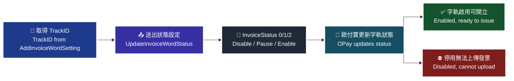

> ♿ 配色遵循 [`docs/accessibility.md`](../docs/accessibility.md)：WCAG AAA 對比 ≥7:1、Okabe-Ito 色盲安全色盤、16px 字體、直角連線、圖示＋文字雙編碼。

### 傳入參數（外層）

| 參數 | 參數名稱 | 型態 | 必填 | 說明 |
|---|---|---|---|---|
| PlatformID | 特約合作平台商代號 | String(10) | — | 1. 提供特約合作平台商向歐付寶申請開通後使用，一般廠商介接請放空值。<br>2. 平台商使用時，MerchantID(特店編號)欄位僅限帶入已綁定子廠商的特店編號，以免造成失敗。 |
| MerchantID | 特店編號 | String(10) | ✅ | 1. 測試環境合作特店編號 2. 正式環境金鑰取得 |
| RqHeader | 傳入資料 | — | — | 原文此列未標示星號 |
| └─ RqHeader.Timestamp | 傳入時間 | Number | ✅ | 歐付寶會利用此參數將當下的時間轉為 Unix TimeStamp 來驗證此次介接的時間區間。<br>注意事項：<br>1. 驗證時間區間暫訂為 10 分鐘內有效，若超過此驗證時間則此次訂單將無法建立，參考資料：http://www.epochconverter.com/ 。<br>2. 合作特店須進行主機「時間校正」，避免主機產生時差，延伸 API 無法正常運作。 |
| Data | 加密資料 | String | ✅ | 資料內容，此為加密過 JSON 格式的資料。加密方法說明 |

> ⚠️ 原文此表 `RqHeader` 未標示必填星號（其下的 `Timestamp` 有星號，且其他 API 的 `RqHeader` 均標示為必填）。原文未明確說明，介接前請向歐付寶確認。

外層範例：

```json
{
    "MerchantID": "2000123",
    "RqHeader": {
        "Timestamp": 1525168923
    },
    "Data": "…"
}
```

### 傳入 Data 參數（加密前的 JSON）

| 參數 | 參數名稱 | 型態 | 必填 | 說明 |
|---|---|---|---|---|
| MerchantID | 特店編號 | String(10) | ✅ | — |
| TrackID | 字軌號碼ID | String(10) | ✅ | 為新增字軌後取到的 TrackID |
| InvoiceStatus | 發票字軌狀態 | Int | ✅ | 0：停用，1：暫停，2：啟用<br>如狀態設定為停用，該字軌區間無法上傳發票 |

### 傳入 Data 範例

```json
{
    "MerchantID": "2000123",
    "TrackID": "1234567890",
    "InvoiceStatus": 2
}
```

### 回傳參數（外層）

| 參數 | 參數名稱 | 型態 | 說明 |
|---|---|---|---|
| PlatformID | 特約合作平台商代號 | String(10) | — |
| MerchantID | 特店編號 | String(10) | — |
| RpHeader | 回傳資料 | — | — |
| └─ RpHeader.Timestamp | 回傳時間 | Number | — |
| TransCode | 回傳代碼 | Int | 1 代表傳輸資料(MerchantID, RqHeader, Data)接收成功，其餘均為失敗 |
| TransMsg | 回傳訊息 | String(200) | 回傳訊息 |
| Data | 加密資料 | String | 資料內容，此為加密過 JSON 格式的資料。加密方法說明 |

外層範例：

```json
{
    "MerchantID": "2000123",
    "RpHeader": {
        "Timestamp": 1525169058
    },
    "TransCode": 1,
    "TransMsg": "",
    "Data": "…"
}
```

### 回傳 Data 參數

| 參數 | 參數名稱 | 型態 | 說明 |
|---|---|---|---|
| RtnCode | 回應代碼 | Int | 1 為成功，其餘為失敗。 |
| RtnMsg | 回應訊息 | String(200) | — |

### 回傳 Data 範例

```json
{
    "RtnCode": "1",
    "RtnMsg": "成功"
}
```

> ⚠️ 原文回傳 Data 表格將 `RtnCode` 型態標為 `Int`，但範例值為字串 `"1"`（原文如此）。原文未明確說明，介接前請向歐付寶確認。

### 注意事項

- 營業人(特店)新增字軌後，字軌的預設狀態皆為已審核且未啟用；在開立發票之前，必須先將已新增完成的字軌做狀態的設定。
- 發票字軌狀態 `InvoiceStatus` 如狀態設定為停用(0)，該字軌區間無法上傳發票。

---

## 4. 開立發票（一般開立發票） — `Issue`

- **來源**：i100 §7（一般開立發票）
- **用途**：歐付寶收到營業人(特店)傳送參數後會進行開立，歐付寶加值中心會於 48 小時內協助上傳財政部。應用場景：適用於即時開立發票。
- **HTTP Method**：POST（`Content-Type: application/json`）
- **測試環境**：`https://einvoice-stage.opay.tw/B2CInvoice/Issue`
- **正式環境**：`https://einvoice.opay.tw/B2CInvoice/Issue`

> 🧭 **純文字重述（螢幕閱讀器友善）**：原文此處為「一般開立發票情境流程圖」。流程為：消費者於特店完成交易 → 特店呼叫 Issue 傳送發票參數 → 歐付寶即時開立電子發票並回傳發票號碼、開立時間與隨機碼 → 歐付寶加值中心於 48 小時內協助上傳財政部。

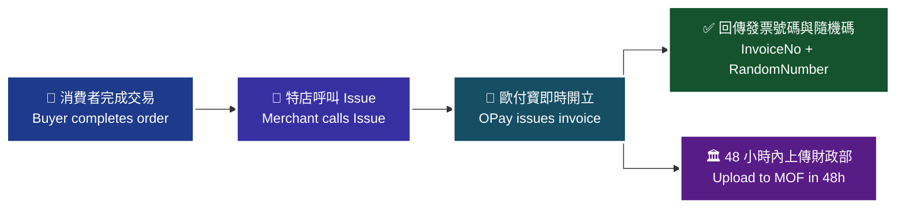

> ♿ 配色遵循 [`docs/accessibility.md`](../docs/accessibility.md)：WCAG AAA 對比 ≥7:1、Okabe-Ito 色盲安全色盤、16px 字體、直角連線、圖示＋文字雙編碼。

> 🖼️ 原文於流程圖後另有一張參考畫面截圖，說明文字為：「營業人可提供以下發票資料設定項目供買受人選擇(下圖為參考範例，營業人可自行設計)：」。該圖為 UI 參考範例，無流程語意，故不重繪。

### 傳入參數（外層）

| 參數 | 參數名稱 | 型態 | 必填 | 說明 |
|---|---|---|---|---|
| PlatformID | 特約合作平台商代號 | String(10) | — | 1. 提供特約合作平台商向歐付寶申請開通後使用，一般廠商介接請放空值。<br>2. 平台商使用時，MerchantID(特店編號)欄位僅限帶入已綁定子廠商的特店編號，以免造成失敗。 |
| MerchantID | 特店編號 | String(10) | ✅ | 1. 測試環境合作特店編號 2. 正式環境金鑰取得 |
| RqHeader | 傳入資料 | — | ✅ | — |
| └─ RqHeader.Timestamp | 傳入時間 | Number | ✅ | 歐付寶會利用此參數將當下的時間轉為 Unix TimeStamp 來驗證此次介接的時間區間。<br>注意事項：<br>1. 驗證時間區間暫訂為 10 分鐘內有效，若超過此驗證時間則此次訂單將無法建立，參考資料：http://www.epochconverter.com/ 。<br>2. 合作特店須進行主機「時間校正」，避免主機產生時差，延伸 API 無法正常運作。 |
| Data | 加密資料 | String | ✅ | 此為加密過 JSON 格式的資料。加密方法說明 |

外層範例：

```json
{
    "MerchantID": "2000132",
    "RqHeader": {
        "Timestamp": 1525168923
    },
    "Data": "…"
}
```

### 傳入 Data 參數（加密前的 JSON）

| 參數 | 參數名稱 | 型態 | 必填 | 說明 |
|---|---|---|---|---|
| MerchantID | 特店編號 | String(10) | ✅ | — |
| RelateNumber | 特店自訂編號 | String(30) | ✅ | 需為唯一值不可重複使用。<br>注意事項：建議勿使用特殊符號；大小寫英文視為相同 (e.g. 123abc456=123ABC456) |
| CustomerID | 客戶編號 | String(20) | — | 建議格式為『英文、數字、下底線』等字元。 |
| CustomerIdentifier | 統一編號 | String(8) | — | 格式為數字。為提供營業人更完善的發票開立服務，預計 2023 年 1 月 1 日起配合財政部更新統一編號檢查欄位邏輯由可被「10」整除改為可被「5」整除，以利營業人正確開立帶有統一編號之發票。調整說明如下：<br>依財政部財政資訊中心公告，統一編號檢核修改「檢查邏輯由可被『10』整除改為可被『5』整除」，詳細內容可參考財政部財政資訊中心營利事業統一編號檢查碼邏輯修正說明。<br>如未符合上述檢核邏輯，則開立發票、設定交易對象維護資料時將會失敗，請營業人務必提供正確的統一編號 |
| CustomerName | 客戶名稱 | String(60) | 條件 | 當列印註記[Print]=1(列印)時，為必填。當統一編號[CustomerIdentifier]有值時，此參數須填上客戶的公司名稱。建議格式為中、英文及數字等。 |
| CustomerAddr | 客戶地址 | String(100) | 條件 | 當列印註記[Print]=1(列印)時，為必填。 |
| CustomerPhone | 客戶手機號碼 | String(20) | 條件 | 當客戶電子信箱[CustomerEmail]為空字串時，為必填。格式為數字。 |
| CustomerEmail | 客戶電子信箱 | String(80) | 條件 | 當客戶手機號碼[CustomerPhone]為空字串時，為必填。需為有效的 Email 格式，且僅可填寫一組 Email。<br>注意事項：測試環境請勿帶入之真實電子信箱，避免個資外洩。測試環境僅作 API 串接測試使用，僅以 API 回覆成功或失敗；不提供發信測試，僅驗規則。 |
| ClearanceMark | 通關方式 | String(1) | 條件 | 當課稅類別[TaxType]=2(零稅率)時，為必填<br>1：非經海關出口<br>2：經海關出口 |
| Print | 列印註記 | String(1) | ✅ | 0：不列印　1：要列印<br>注意事項：<br>當捐贈註記[Donation]=1(要捐贈)時，此參數請帶 0<br>當統一編號[CustomerIdentifier]有值時，<br>a 載具類別[CarrierType]為空值時，此參數請帶 1<br>b 載具類別[CarrierType]=1 或 2 時，此參數請帶 0<br>c 載具類別[CarrierType]=3 時，此參數可帶 0 或 1 |
| Donation | 捐贈註記 | String(1) | ✅ | 0：不捐贈　1：要捐贈<br>注意事項：<br>當統一編號[CustomerIdentifier]有值時，此參數請帶 0<br>當載具類別[CarrierType]不為空字串且捐贈註記[Donation]=1 時，代表此張發票開立當下是存在載具內，之後消費者將此張發票進行捐贈成功，所以此張發票最終狀態是捐贈成功 |
| LoveCode | 捐贈碼 | String(7) | 條件 | 當捐贈註記[Donation]=1(要捐贈)時，為必填。格式為阿拉伯數字為限，最少三碼，最多七碼，首位可以為零。<br>注意事項：使用捐贈碼時，請先呼叫捐贈碼驗證進行檢核，避免輸入錯誤。 |
| CarrierType | 載具類別 | String(1) | — | 空字串：無載具<br>1：歐付寶電子發票載具<br>2：自然人憑證號碼<br>3：手機條碼載具<br>4：悠遊卡<br>5：icash<br>6：一卡通<br>7：金融卡<br>8：信用卡<br>注意事項：<br>當列印註記[Print]=1(要列印)時，請帶空字串<br>當列印註記[Print]=0(不列印)，且統一編號[CustomerIdentifier]有值時，此參數不可帶空字串。 |
| CarrierNum | 載具編號 | String(64) | 條件 | 當[CarrierType]="" 時，請帶空字串。<br>當[CarrierType]=1 時，請帶空字串，系統會自動帶入值，為客戶電子信箱或客戶手機號碼擇一(以客戶電子信箱優先)<br>[CarrierType]=2：請帶固定長度為 16 且格式為 2 碼大寫英文字母加上 14 碼數字。<br>[CarrierType]=3：請帶固定長度為 8 碼字元，第 1 碼為【/】；其餘 7 碼則由數字【0-9】、大寫英文【A-Z】與特殊符號【+】【-】【.】這 39 個字元組成的編號。<br>當[CarrierType]=4~8 必填，請帶入實體卡片的 &lt;隱碼id&gt;，不會檢核正確性<br>注意事項：<br>當[CarrierType]=4~8 代表載具類別號碼之隱碼<br>英文、數字、符號僅接受半形字元<br>手機條碼載具會進行格式檢核<br>若載具編號為手機條碼載具時，請先呼叫手機條碼驗證進行檢核<br>如何取得[CarrierType]=4~7 卡片隱碼(內碼)：您的設備需配備能讀取卡片的讀卡機，並確保該設備能讀取卡片內碼<br>[CarrierType]=8：請帶入信用卡加密卡號<br>查詢發票 API，當[CarrierType]=4~8，因有資安考量，不會回傳 &lt;隱碼id&gt; |
| CarrierNum2 | 第二載具編號 | String(64) | 條件 | 當[CarrierType]=4~7 必填，請帶入實體卡片的 &lt;顯碼id&gt;，以便發票查詢可以顯示用來識別不同的實體卡片，不會檢核正確性<br>當[CarrierType]=8 必填，請帶入刷卡日期(民國年月日共 7 碼)加刷卡交易金額(10 碼不足位左補 0)<br>當[CarrierType]不等於 4~8 時，此參數不須帶入。<br>注意事項：<br>當[CarrierType]=4~8 代表載具類別號碼之顯碼<br>英文、數字、符號僅接受半形字元，格式錯誤會造成開立失敗<br>當 CarrierType 數值為 1、2 或 3 時，請廠商無須填入此欄位，以避免系統阻擋。 |
| TaxType | 課稅類別 | String(1) | ✅ | 當字軌類別[InvType]為 07 時，則此欄位請填入 1、2、3 或 9；當字軌類別[InvType]為 08 時，則此欄位請填入 3 或 4<br>1：應稅。<br>2：零稅率。<br>3：免稅。<br>4：應稅（特種稅率）<br>9：混合應稅與免稅或零稅率時(限收銀機發票無法分辨時使用，且需通過申請核可)。 |
| ZeroTaxRateReason | 零稅率原因 | String(2) | 條件 | *預設 71：外銷貨物<br>(當課稅類別[TaxType]為 2(零稅率) 或 9(混合應稅與零稅率)時，零稅率原因為必填，若廠商回傳時無帶值，預設 71)<br>71：第一款 外銷貨物<br>72：第二款 與外銷有關之勞務，或在國內提供而在國外使用之勞務<br>73：第三款 依法設立之免稅商店銷售與過境或出境旅客之貨物<br>74：第四款 銷售與保稅區營業人供營運之貨物或勞務<br>75：第五款 國際間之運輸。但外國運輸事業在中華民國境內經營國際運輸業務者，應以各該國對中華民國國際運輸事業予以相等待遇或免徵類似稅捐者為限<br>76：第六款 國際運輸用之船舶、航空器及遠洋漁船<br>77：第七款 銷售與國際運輸用之船舶、航空器及遠洋漁船所使用之貨物或修繕勞務<br>78：第八款 保稅區營業人銷售與課稅區營業人未輸往課稅區而直接出口之貨物<br>79：第九款 保稅區營業人銷售與課稅區營業人存入自由港區事業或海關管理之保稅倉庫、物流中心以供外銷之貨物 |
| SpecialTaxType | 特種稅額類別 | Int | 條件 | 當課稅類別[TaxType]為 1/2/9 時，系統將會自動帶入數字【0】<br>當課稅類別[TaxType]為 3 時，則該參數必填，請填入數字【8】<br>當課稅類別[TaxType]為 4 時，則該參數必填，可填入數字【1-8】，並分別代表以下類別與稅率<br>1：代表酒家及有陪侍服務之茶室、咖啡廳、酒吧之營業稅稅率，稅率為 25%<br>2：代表夜總會、有娛樂節目之餐飲店之營業稅稅率，稅率為 15%<br>3：代表銀行業、保險業、信託投資業、證券業、期貨業、票券業及典當業之專屬本業收入(不含銀行業、保險業經營銀行、保險本業收入)之營業稅稅率，稅率為 2%<br>4：代表保險業之再保費收入之營業稅稅率，稅率為 1%<br>5：代表銀行業、保險業、信託投資業、證券業、期貨業、票券業及典當業之非專屬本業收入之營業稅稅率，稅率為 5%<br>6：代表銀行業、保險業經營銀行、保險本業收入之營業稅稅率(適用於民國 103 年 07 月以後銷售額)，稅率為 5%<br>7：代表銀行業、保險業經營銀行、保險本業收入之營業稅稅率(適用於民國 103 年 06 月以前銷售額)，稅率為 5%<br>8：代表空白為免稅或非銷項特種稅額之資料 |
| SalesAmount | 發票總金額(含稅) | Int | ✅ | 請帶整數，不可有小數點。僅限新台幣，金額不可為 0 元。 |
| InvoiceRemark | 發票備註 | String(200) | — | — |
| Items | 商品 | — | — | 可多筆，商品最多支援 200 項 |
| ├─ Items[].ItemSeq | 商品序號 | Int | — | — |
| ├─ Items[].ItemName | 商品名稱 | String(100) | ✅ | — |
| ├─ Items[].ItemCount | 商品數量 | Number | ✅ | 支援整數 8 位小數 2 位 |
| ├─ Items[].ItemWord | 商品單位 | String(6) | ✅ | — |
| ├─ Items[].ItemPrice | 商品單價 | Number | ✅ | 支援整數 8 位小數 7 位；若 vat=0(未稅)，商品金額需為未稅金額；若 vat=1(含稅)，商品金額需為含稅金額 |
| ├─ Items[].ItemTaxType | 商品課稅別 | String(1) | 條件 | 當課稅類別[TaxType] = 9 時，此欄位不可為空。<br>1：應稅　2：零稅率　3：免稅<br>注意事項：當課稅類別[TaxType] = 9 時，商品課稅類別只能 應稅+免稅 或 應稅+零稅率，免稅和零稅率發票不能同時開立。 |
| ├─ Items[].ItemAmount | 商品合計 | Number | ✅ | 支援整數 8 位小數 7 位 此為含稅小計金額 ItemAmount 各項總合並四捨五入=salesAmount(含稅)<br>注意事項：※ItemAmount 需統一為含稅金額，且商品金額需符合以下規則：<br>1. 當 vat = 1, 且 TaxType = 1 或 4：ItemPrice(含稅)*ItemCount = ItemAmount(含稅) ex: 500*5 = 2500<br>2. 當 vat = 0, 且 TaxType = 1(稅率5%)：ItemPrice(不含稅)*ItemCount*1.05 = ItemAmount(含稅) ex: 500*5*1.05 = 2625 |
| └─ Items[].ItemRemark | 商品備註 | String(40) | — | — |
| InvType | 字軌類別 | String(2) | ✅ | 該張發票的發票字軌類型。07：一般稅額　08：特種稅額 |
| vat | 商品單價是否含稅 | String(1) | — | 1：含稅(預設)　0：未稅 |

> ⚠️ 原文 `Items` 本身未標示星號，但其子欄位 `ItemName`／`ItemCount`／`ItemWord`／`ItemPrice`／`ItemAmount` 標示為必填。原文未明確說明 `Items` 是否可整個省略，介接前請向歐付寶確認。

### 傳入 Data 範例

```json
{
    "MerchantID": "2000132",
    "RelateNumber": "20181028000000001",
    "CustomerID": "",
    "CustomerIdentifier": "",
    "CustomerName": "歐付寶股份有限公司",
    "CustomerAddr": "106台北市南港區發票一街1號1樓",
    "CustomerPhone": "",
    "CustomerEmail": "test@opay.tw",
    "ClearanceMark": "1",
    "Print": "1",
    "Donation": "0",
    "LoveCode": "",
    "CarrierType": "",
    "CarrierNum": "",
    "TaxType": "1",
    "SalesAmount": 100,
    "InvoiceRemark": "發票備註",
    "InvType": "07",
    "vat": "1",
    "Items": [
        {
            "ItemSeq": 1,
            "ItemName": "item01",
            "ItemCount": 1,
            "ItemWord": "件",
            "ItemPrice": 50,
            "ItemTaxType": "1",
            "ItemAmount": 50,
            "ItemRemark": "item01_desc"
        },
        {
            "ItemSeq": 2,
            "ItemName": "item02",
            "ItemCount": 1,
            "ItemWord": "個",
            "ItemPrice": 20,
            "ItemTaxType": "1",
            "ItemAmount": 20,
            "ItemRemark": "item02_desc"
        },
        {
            "ItemSeq": 3,
            "ItemName": "item03",
            "ItemCount": 3,
            "ItemWord": "粒",
            "ItemPrice": 10,
            "ItemTaxType": "1",
            "ItemAmount": 30,
            "ItemRemark": "item03_desc"
        }
    ]
}
```

### 回傳參數（外層）

| 參數 | 參數名稱 | 型態 | 說明 |
|---|---|---|---|
| PlatformID | 特約合作平台商代號 | String(10) | — |
| MerchantID | 廠商編號 | String(10) | — |
| RpHeader | 回傳資料 | — | — |
| └─ RpHeader.Timestamp | 回傳時間 | Number | — |
| TransCode | 回傳代碼 | Int | 1 代表傳輸資料(MerchantID, RqHeader, Data)接收成功，其餘均為失敗 |
| TransMsg | 回傳訊息 | String(200) | — |
| Data | 加密資料 | String | 資料內容，此為加密過 JSON 格式的資料。加密方法說明 |

外層範例：

```json
{
    "MerchantID": "2000132",
    "RpHeader": {
        "Timestamp": 1525169058
    },
    "TransCode": 1,
    "TransMsg": "",
    "Data": "…"
}
```

### 回傳 Data 參數

| 參數 | 參數名稱 | 型態 | 說明 |
|---|---|---|---|
| RtnCode | 回應代碼 | Int | 1 為成功，其餘為失敗。 |
| RtnMsg | 回應訊息 | String(200) | — |
| InvoiceNo | 發票號碼 | String(10) | 若開立成功，則會回傳一組發票號碼；若開立失敗，則會回傳空值。 |
| InvoiceDate | 發票開立時間 | String(20) | 格式為「yyyy-MM-dd HH:mm:ss」 |
| RandomNumber | 隨機碼 | String(4) | — |

### 回傳 Data 範例

```json
{
    "RtnCode": 1,
    "RtnMsg": "開立發票成功",
    "InvoiceNo": "UV11100012",
    "InvoiceDate": "2019-09-17 17:17:31",
    "RandomNumber": "6866"
}
```

### 注意事項

- 歐付寶收到營業人(特店)傳送參數後會進行開立，歐付寶加值中心會於 48 小時內協助上傳財政部。
- **超商 KIOSK 事務機列印注意事項**（除須向業務申請開通外，請按以下需求帶入參數）：
  1. 要列印消費發票(ibon)：`Print=1`，`CarrierType=""`，`CustomerIdentifier=""`，`Donation=0`，只能列印一次(之後中獎也無法再次列印)
  2. 要列印中獎發票(ibon, FamiPort)：`Print=0`，`CarrierType=1`，`CustomerIdentifier=""`，`Donation=0`，只能列印一次
  3. 折讓後發票金額為 0 元，不可列印
- **推薦捐贈碼**：168001 OMG 關懷社會愛心基金會。成立於 2009 年，希望能集結網友族群的心意，將愛傳遞到社會的每一個角落。本基金會致力於：清寒學生及偏遠學校助學、流浪動物與動物保育議題、老人及弱勢團體、急難救助、人道救援、社會公益活動推廣及廣告贊助...等。
- ※注意事項：如果使用延遲開立發票 API，還會需要接收歐付寶呼叫貴司的請求，請放行 postgate.opay.com.tw TCP 443(正式環境)、postgate-stage.opay.com.tw TCP 443(測試環境)；如貴司防火牆需固定 IP，postgate IP 不須另外申請，請自行使用 ping 指令查詢 IP 位址。
- 使用捐贈碼時，請先呼叫捐贈碼驗證進行檢核，避免輸入錯誤；若載具編號為手機條碼載具時，請先呼叫手機條碼驗證進行檢核。
- 測試環境請勿帶入真實電子信箱，避免個資外洩；測試環境僅作 API 串接測試使用，僅以 API 回覆成功或失敗，不提供發信測試，僅驗規則。
- 統一編號檢核邏輯自 2023 年 1 月 1 日起由可被「10」整除改為可被「5」整除，如未符合檢核邏輯，開立發票、設定交易對象維護資料時將會失敗。

---

## 5. 開立發票（延遲開立發票／預約開立發票） — `DelayIssue`

- **來源**：i100 §7（延遲開立發票(預約開立發票)）
- **用途**：營業人(特店)可使用此功能先將開立發票參數傳送至歐付寶系統，由歐付寶暫存發票資料，待延遲開立時間到，系統會自動開立電子發票上傳財政部，並通知消費者(買家)電子發票已開立。
- **HTTP Method**：POST（`Content-Type: application/json`）
- **測試環境**：`https://einvoice-stage.opay.tw/B2CInvoice/DelayIssue`
- **正式環境**：`https://einvoice.opay.tw/B2CInvoice/DelayIssue`

應用場景（原文）：

- **預約開立發票**：特店可使用此功能先將開立發票參數傳送至歐付寶，由歐付寶暫存發票資料，待預約開立時間到，系統會自動開立發票。
- **觸發開立發票**：特店可使用此功能先將開立發票參數傳送至歐付寶，由歐付寶暫存發票資料，等待確認要開立時，再由特店進行觸發開立。

> 🧭 **純文字重述（螢幕閱讀器友善）**：原文此處為「延遲開立發票情境流程圖」。流程為：特店呼叫 DelayIssue 將發票參數送至歐付寶暫存並回傳交易單號(Tsr) → 若 DelayFlag=1(延遲開立)，待延遲天數到期，系統自動開立並上傳財政部、通知消費者；若 DelayFlag=2(觸發開立)，需特店另行呼叫 TriggerIssue 觸發，觸發後再依延遲天數開立 → 開立完成時歐付寶以 NotifyURL 通知特店系統，特店須回應 `1|OK`。

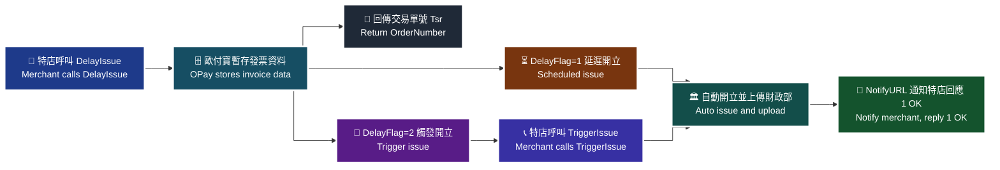

> ♿ 配色遵循 [`docs/accessibility.md`](../docs/accessibility.md)：WCAG AAA 對比 ≥7:1、Okabe-Ito 色盲安全色盤、16px 字體、直角連線、圖示＋文字雙編碼。

### 傳入參數（外層）

| 參數 | 參數名稱 | 型態 | 必填 | 說明 |
|---|---|---|---|---|
| PlatformID | 特約合作平台商代號 | String(10) | — | 1. 提供特約合作平台商向歐付寶申請開通後使用，一般廠商介接請放空值。<br>2. 平台商使用時，MerchantID(特店編號)欄位僅限帶入已綁定子廠商的特店編號，以免造成失敗。 |
| MerchantID | 特店編號 | String(10) | ✅ | 1. 測試環境合作特店編號 2. 正式環境金鑰取得 |
| RqHeader | 傳入資料 | — | ✅ | — |
| └─ RqHeader.Timestamp | 傳入時間 | Number | ✅ | 歐付寶會利用此參數將當下的時間轉為 Unix TimeStamp 來驗證此次介接的時間區間。<br>注意事項：<br>1. 驗證時間區間暫訂為 10 分鐘內有效，若超過此驗證時間則此次訂單將無法建立，參考資料：http://www.epochconverter.com/ 。<br>2. 合作特店須進行主機「時間校正」，避免主機產生時差，延伸 API 無法正常運作。 |
| Data | 加密資料 | String | ✅ | 資料內容，此為加密過 JSON 格式的資料。加密方法說明 |

外層範例：

```json
{
    "MerchantID": 2000132,
    "RqHeader": {
        "Timestamp": 1525168923
    },
    "Data": "…"
}
```

### 傳入 Data 參數（加密前的 JSON）

| 參數 | 參數名稱 | 型態 | 必填 | 說明 |
|---|---|---|---|---|
| MerchantID | 特店編號 | String(10) | ✅ | — |
| RelateNumber | 特店自訂編號 | String(30) | ✅ | 需為唯一值不可重複使用。<br>注意事項：請勿使用特殊符號；大小寫英文視為相同 (e.g. 123abc456=123ABC456) |
| CustomerID | 客戶編號 | String(20) | — | 該參數有值時，僅接受『英文、數字、下底線』等字元。 |
| CustomerIdentifier | 統一編號 | String(8) | — | 固定長度為數字 8 碼。為提供營業人更完善的發票開立服務，預計 2023 年 1 月 1 日起配合財政部更新統一編號檢查欄位邏輯由可被「10」整除改為可被「5」整除，以利營業人正確開立帶有統一編號之發票。調整說明如下：<br>依財政部財政資訊中心公告，統一編號檢核修改「檢查邏輯由可被『10』整除改為可被『5』整除」，詳細內容可參考財政部財政資訊中心營利事業統一編號檢查碼邏輯修正說明。<br>如未符合上述檢核邏輯，則開立發票、設定交易對象維護資料時將會失敗，請營業人務必提供正確的統一編號 |
| CustomerName | 客戶名稱 | String(60) | 條件 | 當列印註記[Print]=1(列印)時，為必填。當統一編號[CustomerIdentifier]有值時，此參數須填上客戶的公司名稱。格式為中、英文及數字等。 |
| CustomerAddr | 客戶地址 | String(100) | 條件 | 當列印註記[Print]=1(列印)時，為必填。 |
| CustomerPhone | 客戶手機號碼 | String(20) | 條件 | 當客戶電子信箱[CustomerEmail]為空字串時，為必填。格式為數字。 |
| CustomerEmail | 客戶電子信箱 | String(80) | 條件 | 當客戶手機號碼[CustomerPhone]為空字串時，為必填。需為有效的 Email 格式，且僅可填寫一組 Email。<br>注意事項：測試環境請勿帶入之真實電子信箱，避免個資外洩。測試環境僅作 API 串接測試使用，僅以 API 回覆成功或失敗；批次匯入功能/API 不提供發信測試，僅驗規則。 |
| ClearanceMark | 通關方式 | String(1) | 條件 | 若課稅類別[TaxType]=2(零稅率)時，為必填<br>1：非經海關出口<br>2：經海關出口。 |
| Print | 列印註記 | String(1) | ✅ | 0：不列印　1：要列印<br>注意事項：<br>當捐贈註記[Donation]=1(要捐贈)時，此參數請帶 0<br>當統一編號[CustomerIdentifier]有值時，<br>a 載具類別[CarrierType]為空值時，此參數請帶 1<br>b 載具類別[CarrierType]=1 或 2 時，此參數請帶 0<br>c 載具類別[CarrierType]=3 時，此參數可帶 0 或 1 |
| Donation | 捐贈註記 | String(1) | ✅ | 0：不捐贈　1：要捐贈<br>注意事項：<br>當統一編號[CustomerIdentifier]有值時，此參數請帶 0<br>當載具類別[CarrierType]不為空字串且捐贈註記[Donation]=1 時，代表此張發票開立當下是存在載具內，之後消費者將此張發票進行捐贈成功，所以此張發票最終狀態是捐贈成功 |
| LoveCode | 捐贈碼 | String(7) | 條件 | 當捐贈註記[Donation]=1(要捐贈)時，為必填。格式為阿拉伯數字為限，最少三碼，最多七碼，首位可以為零。<br>注意事項：使用捐贈碼時，請先呼叫捐贈碼驗證進行檢核，避免輸入錯誤。 |
| CarrierType | 載具類別 | String(1) | — | 空字串：無載具<br>1：歐付寶電子發票載具<br>2：自然人憑證號碼<br>3：手機條碼載具<br>4：悠遊卡<br>5：icash<br>6：一卡通<br>7：金融卡<br>8：信用卡<br>注意事項：<br>當列印註記[Print]=1(要列印)時，請帶空字串<br>當列印註記[Print]=0(不列印)，且統一編號[CustomerIdentifier]有值時，此參數不可帶空字串。 |
| CarrierNum | 載具編號 | String(64) | 條件 | 當[CarrierType]="" 時，請帶空字串。<br>當[CarrierType]=1 時，請帶空字串，系統會自動帶入值，為客戶電子信箱或客戶手機號碼擇一(以客戶電子信箱優先)<br>[CarrierType]=2：請帶固定長度為 16 且格式為 2 碼大寫英文字母加上 14 碼數字。<br>[CarrierType]=3：請帶固定長度為 8 碼字元，第 1 碼為【/】；其餘 7 碼則由數字【0-9】、大寫英文【A-Z】與特殊符號【+】【-】【.】這 39 個字元組成的編號。<br>當[CarrierType]=4~8 必填，請帶入實體卡片的 &lt;隱碼id&gt;，不會檢核正確性<br>注意事項：<br>當[CarrierType]=4~8 代表載具類別號碼之隱碼<br>英文、數字、符號僅接受半形字元<br>手機條碼載具會進行格式檢核<br>若載具編號為手機條碼載具時，請先呼叫手機條碼驗證進行檢核<br>如何取得[CarrierType]=4~7 卡片隱碼(內碼)：您的設備需配備能讀取卡片的讀卡機，並確保該設備能讀取卡片內碼<br>[CarrierType]=8：請帶入信用卡加密卡號<br>查詢發票 API，當[CarrierType]=4~8，因有資安考量，不會回傳 &lt;隱碼id&gt; |
| CarrierNum2 | 第二載具編號 | String(64) | 條件 | 當[CarrierType]=4~7 必填，請帶入實體卡片的 &lt;顯碼id&gt;，以便發票查詢可以顯示用來識別不同的實體卡片，不會檢核正確性<br>當[CarrierType]=8 必填，請帶入刷卡日期(民國年月日共 7 碼)加刷卡交易金額(10 碼不足位左補 0)<br>當[CarrierType]不等於 4~8 時，此參數不須帶入。<br>注意事項：<br>當[CarrierType]=4~8 代表載具類別號碼之顯碼<br>英文、數字、符號僅接受半形字元，格式錯誤會造成開立失敗<br>當 CarrierType 數值為 1、2 或 3 時，請廠商無須填入此欄位，以避免系統阻擋。 |
| TaxType | 課稅類別 | String(1) | ✅ | 當字軌類別[InvType]為 07 時，則此欄位請填入 1、2、3 或 9；當字軌類別[InvType]為 08 時，則此欄位請填入 3 或 4<br>1：應稅。<br>2：零稅率。<br>3：免稅。<br>4：應稅（特種稅率）<br>9：混合應稅與免稅或零稅率時(限收銀機發票無法分辨時使用，且需通過申請核可)。 |
| ZeroTaxRateReason | 零稅率原因 | String(2) | 條件 | *預設 71：外銷貨物<br>(當課稅類別[TaxType]為 2(零稅率) 或 9(混合應稅與零稅率)時，零稅率原因為必填，若廠商回傳時無帶值，預設 71)<br>71：第一款 外銷貨物<br>72：第二款 與外銷有關之勞務，或在國內提供而在國外使用之勞務<br>73：第三款 依法設立之免稅商店銷售與過境或出境旅客之貨物<br>74：第四款 銷售與保稅區營業人供營運之貨物或勞務<br>75：第五款 國際間之運輸。但外國運輸事業在中華民國境內經營國際運輸業務者，應以各該國對中華民國國際運輸事業予以相等待遇或免徵類似稅捐者為限<br>76：第六款 國際運輸用之船舶、航空器及遠洋漁船<br>77：第七款 銷售與國際運輸用之船舶、航空器及遠洋漁船所使用之貨物或修繕勞務<br>78：第八款 保稅區營業人銷售與課稅區營業人未輸往課稅區而直接出口之貨物<br>79：第九款 保稅區營業人銷售與課稅區營業人存入自由港區事業或海關管理之保稅倉庫、物流中心以供外銷之貨物 |
| SpecialTaxType | 特種稅額類別 | Int | 條件 | 當課稅類別[TaxType]為 1/2/9 時，系統將會自動帶入數字【0】<br>當課稅類別[TaxType]為 3 時，則該參數必填，請填入數字【8】<br>當課稅類別[TaxType]為 4 時，則該參數必填，可填入數字【1-8】，並分別代表以下類別與稅率<br>1：代表酒家及有陪侍服務之茶室、咖啡廳、酒吧之營業稅稅率，稅率為 25%<br>2：代表夜總會、有娛樂節目之餐飲店之營業稅稅率，稅率為 15%<br>3：代表銀行業、保險業、信託投資業、證券業、期貨業、票券業及典當業之專屬本業收入(不含銀行業、保險業經營銀行、保險本業收入)之營業稅稅率，稅率為 2%<br>4：代表保險業之再保費收入之營業稅稅率，稅率為 1%<br>5：代表銀行業、保險業、信託投資業、證券業、期貨業、票券業及典當業之非專屬本業收入之營業稅稅率，稅率為 5%<br>6：代表銀行業、保險業經營銀行、保險本業收入之營業稅稅率(適用於民國 103 年 07 月以後銷售額)，稅率為 5%<br>7：代表銀行業、保險業經營銀行、保險本業收入之營業稅稅率(適用於民國 103 年 06 月以前銷售額)，稅率為 5%<br>8：代表空白為免稅或非銷項特種稅額之資料 |
| SalesAmount | 發票總金額(含稅) | Int | ✅ | 請帶整數，不可有小數點 僅限新台幣，金額不可為 0 元 |
| InvoiceRemark | 發票備註 | String(200) | — | — |
| Items | 商品 | — | — | 商品最多支援 200 項 |
| ├─ Items[].ItemSeq | 商品序號 | Int | — | — |
| ├─ Items[].ItemName | 商品名稱 | String(100) | ✅ | — |
| ├─ Items[].ItemCount | 商品數量 | Number | ✅ | 支援整數 8 位小數 2 位 |
| ├─ Items[].ItemWord | 商品單位 | String(6) | ✅ | — |
| ├─ Items[].ItemPrice | 商品單價 | Number | ✅ | 支援整數 8 位小數 7 位；若 vat=0(未稅)，商品金額需為未稅金額；若 vat=1(含稅)，商品金額需為含稅金額 |
| ├─ Items[].ItemTaxType | 商品課稅別 | String(1) | — | 1：應稅　2：零稅率　3：免稅<br>注意事項：當課稅類別[TaxType] = 9 時，商品課稅類別只能 應稅+免稅 或 應稅+零稅率，免稅和零稅率發票不能同時開立。 |
| ├─ Items[].ItemAmount | 商品合計 | Number | ✅ | 支援整數 8 位小數 7 位 此為含稅小計金額 ItemAmount 各項總合並四捨五入=salesAmount(含稅)<br>注意事項：※ItemAmount 需統一為含稅金額，且商品金額需符合以下規則：<br>1. 當 vat = 1, 且 TaxType = 1 或 4：ItemPrice(含稅)*ItemCount = ItemAmount(含稅) ex: 500*5 = 2500<br>2. 當 vat = 0, 且 TaxType = 1(稅率5%)：ItemPrice(不含稅)*ItemCount*1.05 = ItemAmount(含稅) ex: 500*5*1.05 = 2625 |
| └─ Items[].ItemRemark | 商品備註 | String(40) | — | 原文延遲開立發票表格未列出此欄位說明文字，但範例含 `ItemRemark` |
| InvType | 字軌類別 | String(2) | ✅ | 該張發票的發票字軌類型。07：一般稅額　08：特種稅額 |
| DelayFlag | 延遲註記 | String(1) | ✅ | 可註記此張發票要延遲開立或觸發開立發票<br>1：延遲開立<br>2：觸發開立 |
| DelayDay | 延遲天數 | Int | ✅ | 若為延遲開立時，延遲天數須介於 1 至 15 天內；觸發開立時也可設定延遲天數，但須介於 0 至 15 天內<br>注意事項：開立當天 10 點後無法取消開立<br>EX1: DelayFlag=1(延遲) DelayDay=7(天數) 此為 7 天後自動開立<br>EX2: DelayFlag=2(觸發) DelayDay=2(天數) 此為被觸發後過 2 天才會開立，若此張發票都沒有被觸發，將不會被開立 |
| Tsr | 交易單號 | String(30) | ✅ | 用來呼叫付款完成觸發或延遲開立發票 API 的依據。均為唯一值不可重覆使用。 |
| PayType | 交易類別 | String(1) | ✅ | 請固定帶 '3' |
| PayAct | 交易類別名稱 | String(6) | ✅ | 請固定帶 'Opay' |
| NotifyURL | 開立完成時通知特店系統的網址 | String(200) | — | 注意事項：提醒您！使用測試環境時，不提供 NotifyURL 開立通知。請在收到開立成功結果通知後，請正確回應 `1\|OK` 給歐付寶。 |
| vat | 商品單價是否含稅 | String(1) | — | 1：含稅(預設)　0：未稅 |

> ⚠️ 原文延遲開立發票的 `Items` 子欄位表格中，`ItemRemark`(商品備註) 未列於表格內，但 Data 範例中有此欄位；此處依一般開立發票之定義 `String(40)` 補列。原文未明確說明，介接前請向歐付寶確認。

### 傳入 Data 範例

```json
{
    "MerchantID": 2000132,
    "RelateNumber": "20181028000000021",
    "CustomerID": "",
    "CustomerIdentifier": "53538851",
    "CustomerName": "歐付寶股份有限公司",
    "CustomerAddr": "106台北市南港區發票街1號1樓",
    "CustomerPhone": "",
    "CustomerEmail": "test@opay.tw",
    "ClearanceMark": "1",
    "Print": "1",
    "Donation": "0",
    "LoveCode": "",
    "CarrierType": "",
    "CarrierNum": "",
    "TaxType": "1",
    "SalesAmount": 100,
    "InvoiceRemark": "發票備註",
    "InvType": "07",
    "DelayFlag": "1",
    "DelayDay": 5,
    "Tsr": "1231000000",
    "PayType": "3",
    "PayAct": "Opay",
    "NotifyURL": "test@opay.tw",
    "Items": [
        {
            "ItemSeq": 1,
            "ItemName": "item01",
            "ItemCount": 1,
            "ItemWord": "件",
            "ItemPrice": 50,
            "ItemTaxType": "2",
            "ItemAmount": 50,
            "ItemRemark": "item01_desc"
        },
        {
            "ItemSeq": 2,
            "ItemName": "item02",
            "ItemCount": 1,
            "ItemWord": "個",
            "ItemPrice": 20,
            "ItemTaxType": "1",
            "ItemAmount": 20,
            "ItemRemark": "item02_desc"
        },
        {
            "ItemSeq": 3,
            "ItemName": "item03",
            "ItemCount": 3,
            "ItemWord": "粒",
            "ItemPrice": 10,
            "ItemTaxType": "2",
            "ItemAmount": 30,
            "ItemRemark": "item03_desc"
        }
    ]
}
```

### 回傳參數（外層）

| 參數 | 參數名稱 | 型態 | 說明 |
|---|---|---|---|
| PlatformID | 特約合作平台商代號 | String(10) | — |
| MerchantID | 廠商編號 | String(10) | — |
| RpHeader | 回傳資料 | — | — |
| └─ RpHeader.Timestamp | 回傳時間 | Number | — |
| TransCode | 回傳代碼 | Int | 1 代表傳輸資料(MerchantID, RqHeader, Data)接收成功，其餘均為失敗 |
| TransMsg | 回傳訊息 | String(200) | 回傳訊息 |
| Data | 加密資料 | String | 資料內容，此為加密過 JSON 格式的資料。加密方法說明 |

外層範例：

```json
{
    "MerchantID": 2000132,
    "RpHeader": {
        "Timestamp": 1525169058
    },
    "TransCode": 1,
    "TransMsg": "",
    "Data": "…"
}
```

### 回傳 Data 參數

| 參數 | 參數名稱 | 型態 | 說明 |
|---|---|---|---|
| RtnCode | 回應代碼 | Int | 1 為成功，其餘為失敗。 |
| RtnMsg | 回應訊息 | String(200) | — |
| OrderNumber | 交易單號 | String(30) | 若開立成功，則會回傳交易單號(Tsr)；若開立失敗，則會回傳空值。 |

### 回傳 Data 範例

```json
{
    "RtnCode": 1,
    "RtnMsg": "開立發票成功",
    "OrderNumber": "1231000000"
}
```

### NotifyURL 開立完成通知（歐付寶 → 特店）

NotifyURL 接收端 Http Header 設定：

```
Accept: text/html ;
Content-Type: application/x-www-form-urlencoded
```

| 參數 | 參數名稱 | 型態 | 說明 |
|---|---|---|---|
| inv_mer_id | 特店編號 | String(10) | — |
| od_sob | 商家自訂訂單編號 | String(30) | — |
| tsr | 交易單號 | String(30) | 若開立成功，才會回傳；若開立失敗，則會回傳空值。 |
| invoicedate | 發票日期 | String(10) | 若開立成功，才會回傳。 |
| invoicetime | 發票時間 | String(8) | 若開立成功，才會回傳。 |
| invoicenumber | 發票號碼 | String(10) | 若開立成功，才會回傳。 |
| invoicecode | 發票檢查碼 | String(8) | 若開立成功，才會回傳。 |
| inv_error | 錯誤代碼 | Int | — |

通知內容範例：

```
inv_mer_id=2000132&od_sob=20181028000000021&tsr=1231000000&invoicedate=2019-09-17&invoicetime=15:30:00&invoicenumber=UV11100012&invoicecode=12345678&inv_error=
```

### 注意事項

- 若為延遲開立(DelayFlag=1)，延遲天數須介於 1 至 15 天內；觸發開立(DelayFlag=2)也可設定延遲天數，但須介於 0 至 15 天內。若 DelayFlag=2 而該張發票都沒有被觸發，將不會被開立。
- 開立當天 10 點後無法取消開立。
- 提醒您！使用測試環境時，不提供 NotifyURL 開立通知。請在收到開立成功結果通知後，正確回應 `1|OK` 給歐付寶。
- ※注意事項：如果使用延遲開立發票 API，還會需要接收歐付寶呼叫貴司的請求，請放行 postgate.opay.com.tw TCP 443(正式環境)、postgate-stage.opay.com.tw TCP 443(測試環境)；如貴司防火牆需固定 IP，postgate IP 不須另外申請，請自行使用 ping 指令查詢 IP 位址。
- 交易單號 Tsr 均為唯一值不可重覆使用，為後續呼叫觸發開立(`TriggerIssue`)與取消延遲開立(`CancelDelayIssue`)的依據。
- 測試環境請勿帶入真實電子信箱，避免個資外洩；測試環境僅作 API 串接測試使用，僅以 API 回覆成功或失敗；批次匯入功能/API 不提供發信測試，僅驗規則。
- 統一編號檢核邏輯自 2023 年 1 月 1 日起由可被「10」整除改為可被「5」整除，如未符合檢核邏輯，開立發票、設定交易對象維護資料時將會失敗。

---

## 6. 觸發開立發票 — `TriggerIssue`

- **來源**：i100 §7（觸發開立發票）
- **用途**：營業人(特店)可使用此功能先將開立發票參數傳送至歐付寶，由歐付寶暫存發票資料，等待確認要開立時，再由營業人(特店)進行觸發開立，觸發先前暫存在歐付寶的發票資料，再依據先前所設定的延遲開立天數，待延遲開立時間到，系統會自動開立上傳財政部，並通知消費者(買家)電子發票已開立。（若未設定延遲開立天數，觸發後立即開立發票）
- **HTTP Method**：POST（`Content-Type: application/json`）
- **測試環境**：`https://einvoice-stage.opay.tw/B2CInvoice/TriggerIssue`
- **正式環境**：`https://einvoice.opay.tw/B2CInvoice/TriggerIssue`

應用場景（原文）：

- **觸發開立發票**：待消費者付款完成後會呼叫此 API，觸發先前暫存在歐付寶的參數開立發票。
- **觸發後延遲開立發票**：待消費者付款完成後會呼叫此 API，觸發先前暫存在歐付寶的參數開立發票，再依據先前所設定的延遲開立天數，待預約開立時間到，系統自動開立。

> 🧭 **純文字重述（螢幕閱讀器友善）**：原文此處為「觸發開立發票情境流程圖」。流程為：特店先以 DelayIssue 暫存發票資料（DelayFlag=2 觸發開立）→ 消費者付款完成 → 特店以交易單號 Tsr 呼叫 TriggerIssue → 若 DelayDay=0，立即開立發票（RtnCode 4000004）；若 DelayDay 大於 0，延後開立成功（RtnCode 4000003），待延遲天數到期系統自動開立並上傳財政部、通知消費者。

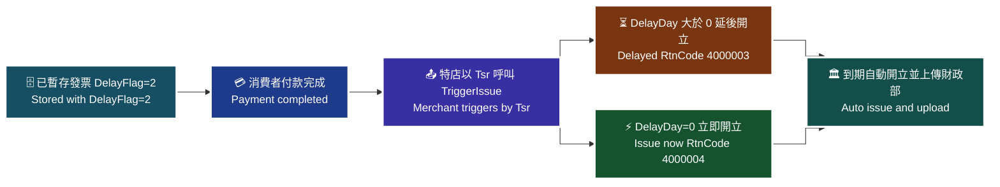

> ♿ 配色遵循 [`docs/accessibility.md`](../docs/accessibility.md)：WCAG AAA 對比 ≥7:1、Okabe-Ito 色盲安全色盤、16px 字體、直角連線、圖示＋文字雙編碼。

### 傳入參數（外層）

| 參數 | 參數名稱 | 型態 | 必填 | 說明 |
|---|---|---|---|---|
| PlatformID | 特約合作平台商代號 | String(10) | — | 1. 提供特約合作平台商向歐付寶申請開通後使用，一般廠商介接請放空值。<br>2. 平台商使用時，MerchantID(特店編號)欄位僅限帶入已綁定子廠商的特店編號，以免造成失敗。 |
| MerchantID | 特店編號 | String(10) | ✅ | 1. 測試環境合作特店編號 2. 正式環境金鑰取得 |
| RqHeader | 傳入資料 | — | — | 原文此列未標示星號 |
| └─ RqHeader.Timestamp | 傳入時間 | Number | ✅ | 歐付寶會利用此參數將當下的時間轉為 Unix TimeStamp 來驗證此次介接的時間區間。<br>注意事項：<br>1. 驗證時間區間暫訂為 10 分鐘內有效，若超過此驗證時間則此次訂單將無法建立，參考資料：http://www.epochconverter.com/ 。<br>2. 合作特店須進行主機「時間校正」，避免主機產生時差，延伸 API 無法正常運作。 |
| Data | 加密資料 | String | ✅ | 資料內容，此為加密過 JSON 格式的資料。加密方法說明 |

> ⚠️ 原文此表 `RqHeader` 未標示必填星號（其下的 `Timestamp` 有星號）。原文未明確說明，介接前請向歐付寶確認。

外層範例：

```json
{
    "MerchantID": 2000132,
    "RqHeader": {
        "Timestamp": 1525168923
    },
    "Data": "…"
}
```

### 傳入 Data 參數（加密前的 JSON）

| 參數 | 參數名稱 | 型態 | 必填 | 說明 |
|---|---|---|---|---|
| MerchantID | 特店編號 | String(10) | ✅ | — |
| Tsr | 交易單號 | String(30) | ✅ | 用來呼叫付款完成觸發或延遲開立發票的依據。均為唯一值不可重覆使用 |
| PayType | 交易類別 | String(1) | ✅ | 歐付寶請固定帶 '3' |

### 傳入 Data 範例

```json
{
    "MerchantID": "2000132",
    "Tsr": "201909170001",
    "PayType": "3"
}
```

### 回傳參數（外層）

| 參數 | 參數名稱 | 型態 | 說明 |
|---|---|---|---|
| PlatformID | 特約合作平台商代號 | String(10) | — |
| MerchantID | 廠商編號 | String(10) | — |
| RpHeader | 回傳資料 | — | — |
| └─ RpHeader.Timestamp | 回傳時間 | Number | — |
| TransCode | 回傳代碼 | Int | 1 代表傳輸資料(MerchantID, RqHeader, Data)接收成功，其餘均為失敗 |
| TransMsg | 回傳訊息 | String(200) | 回傳訊息 |
| Data | 加密資料 | String | 資料內容，此為加密過 JSON 格式的資料。加密方法說明 |

外層範例：

```json
{
    "MerchantID": "2000132",
    "RpHeader": {
        "Timestamp": 1525169058
    },
    "TransCode": 1,
    "TransMsg": "",
    "Data": "…"
}
```

### 回傳 Data 參數

| 參數 | 參數名稱 | 型態 | 說明 |
|---|---|---|---|
| RtnCode | 回應代碼 | Int | 當 DelayDay 設為大於 0 時，RtnCode 回傳結果為 4000003 是代表延後開立成功。<br>當 DelayDay 等於 0 時，RtnCode 回傳結果為 4000004 是代表開立發票成功。<br>當 RtnCode 非上述結果，則為失敗。 |
| RtnMsg | 回應訊息 | String(200) | — |
| Tsr | 交易單號 | String(20) | 若開立成功，則會回傳交易單號；若開立失敗，則會回傳空值。 |

### 回傳 Data 範例

```json
{
    "RtnCode": "4000003",
    "RtnMsg": "延後開立成功",
    "Tsr": "201909170001"
}
```

### 注意事項

- 注意事項：使用此 API 需先呼叫暫存開立發票 API 暫存發票資料，且延遲註記欄位為 2(觸發開立)。
- 若未設定延遲開立天數，觸發後立即開立發票。
- 回應代碼 4000003 = 延後開立成功、4000004 = 開立發票成功；非上述結果均為失敗。
- 傳入 Data 的交易單號 `Tsr` 型態為 String(30)，但回傳 Data 的 `Tsr` 型態原文標示為 String(20)（原文如此）。

---

## 7. 取消延遲開立發票 — `CancelDelayIssue`

- **來源**：i100 §7（取消延遲開立發票）
- **用途**：營業人(特店)可使用此功能將預約開立時間未到或尚未觸發開立之發票取消延遲開立。
- **HTTP Method**：POST（`Content-Type: application/json`）
- **測試環境**：`https://einvoice-stage.opay.tw/B2CInvoice/CancelDelayIssue`
- **正式環境**：`https://einvoice.opay.tw/B2CInvoice/CancelDelayIssue`

> 🧭 **純文字重述（螢幕閱讀器友善）**：原文此處為「取消延遲開立發票情境流程圖」。流程為：特店以交易單號 Tsr 呼叫 CancelDelayIssue → 歐付寶檢查該筆暫存發票是否仍為「預約開立時間未到」或「尚未觸發開立」 → 符合則取消延遲開立並回傳成功；若已開立或已過取消時限（開立當天 10 點後）則無法取消。

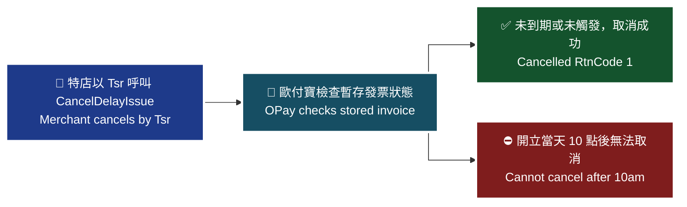

> ♿ 配色遵循 [`docs/accessibility.md`](../docs/accessibility.md)：WCAG AAA 對比 ≥7:1、Okabe-Ito 色盲安全色盤、16px 字體、直角連線、圖示＋文字雙編碼。

### 傳入參數（外層）

| 參數 | 參數名稱 | 型態 | 必填 | 說明 |
|---|---|---|---|---|
| PlatformID | 特約合作平台商代號 | String(10) | — | 1. 提供特約合作平台商向歐付寶申請開通後使用，一般廠商介接請放空值。<br>2. 平台商使用時，MerchantID(特店編號)欄位僅限帶入已綁定子廠商的特店編號，以免造成失敗。 |
| MerchantID | 特店編號 | String(10) | ✅ | 1. 測試環境合作特店編號 2. 正式環境金鑰取得 |
| RqHeader | 傳入資料 | — | ✅ | — |
| └─ RqHeader.Timestamp | 傳入時間 | Number | ✅ | 歐付寶會利用此參數將當下的時間轉為 Unix TimeStamp 來驗證此次介接的時間區間。<br>注意事項：<br>1. 驗證時間區間暫訂為 10 分鐘內有效，若超過此驗證時間則此次訂單將無法建立，參考資料：http://www.epochconverter.com/ 。<br>2. 合作特店須進行主機「時間校正」，避免主機產生時差，延伸 API 無法正常運作。 |
| Data | 加密資料 | String | ✅ | 資料內容，此為加密過 JSON 格式的資料。加密方法說明 |

外層範例：

```json
{
    "MerchantID": 2000132,
    "RqHeader": {
        "Timestamp": 1525168923
    },
    "Data": "…"
}
```

### 傳入 Data 參數（加密前的 JSON）

| 參數 | 參數名稱 | 型態 | 必填 | 說明 |
|---|---|---|---|---|
| MerchantID | 特店編號 | String(10) | ✅ | — |
| Tsr | 交易單號 | String(30) | ✅ | 用來呼叫付款完成觸發或延遲開立發票 API 的依據。均為唯一值不可重覆使用。 |

### 傳入 Data 範例

```json
{
    "MerchantID": 2000132,
    "Tsr": "1231000000"
}
```

### 回傳參數（外層）

| 參數 | 參數名稱 | 型態 | 說明 |
|---|---|---|---|
| PlatformID | 特約合作平台商代號 | String(10) | — |
| MerchantID | 廠商編號 | String(10) | — |
| RpHeader | 回傳資料 | — | — |
| └─ RpHeader.Timestamp | 回傳時間 | Number | — |
| TransCode | 回傳代碼 | Int | 1 代表傳輸資料(MerchantID, RqHeader, Data)接收成功，其餘均為失敗 |
| TransMsg | 回傳訊息 | String(200) | 回傳訊息 |
| Data | 加密資料 | String | 資料內容，此為加密過 JSON 格式的資料。加密方法說明 |

外層範例：

```json
{
    "MerchantID": 2000132,
    "RpHeader": {
        "Timestamp": 1525169058
    },
    "TransCode": 1,
    "TransMsg": "",
    "Data": "…"
}
```

### 回傳 Data 參數

| 參數 | 參數名稱 | 型態 | 說明 |
|---|---|---|---|
| RtnCode | 回應代碼 | Int | 1 為成功，其餘為失敗。 |
| RtnMsg | 回應訊息 | String(200) | — |

### 回傳 Data 範例

```json
{
    "RtnCode": 1,
    "RtnMsg": "取消開立發票成功"
}
```

> ⚠️ 原文範例於 `"RtnMsg": "取消開立發票成功",` 之後多一個逗號（非合法 JSON），應為原文誤植，此處已移除；值與欄位均未更動。

### 注意事項

- 僅能取消「預約開立時間未到」或「尚未觸發開立」之發票。
- 開立當天 10 點後無法取消開立（出自 §7 延遲開立發票之 `DelayDay` 說明）。
- 交易單號 `Tsr` 均為唯一值不可重覆使用。

## 8. 開立折讓－一般開立折讓（紙本開立）— `Allowance`

- **來源**：i100 §8
- **用途**：營業人（特店）可使用此功能將折讓開立參數傳送至歐付寶，由歐付寶暫存折讓資料。歐付寶於隔日將折讓資料上傳至財政部電子發票整合服務平台，並通知消費者（買家）折讓已開立。
- **HTTP Method**：POST（`Content-Type: application/json`）
- **測試環境**：`https://einvoice-stage.opay.tw/B2CInvoice/Allowance`
- **正式環境**：`https://einvoice.opay.tw/B2CInvoice/Allowance`

**應用場景**：若商品質量、規格等不符合消費者要求，特店同意在商品價格上給予減讓，可使用此 API 將開立折讓發票參數傳送至歐付寶，暫存折讓發票資料。歐付寶會於隔日，將折讓資料上傳至財政部電子發票整合服務平台。

> 🧭 **純文字重述（螢幕閱讀器友善）**：開立折讓情境流程圖。特店呼叫 `Allowance` 送出折讓開立參數；歐付寶接收後暫存折讓資料，並立即回傳折讓單號與折讓剩餘金額；歐付寶於隔日將折讓資料上傳至財政部電子發票整合服務平台；上傳後通知消費者（買家）折讓已開立。

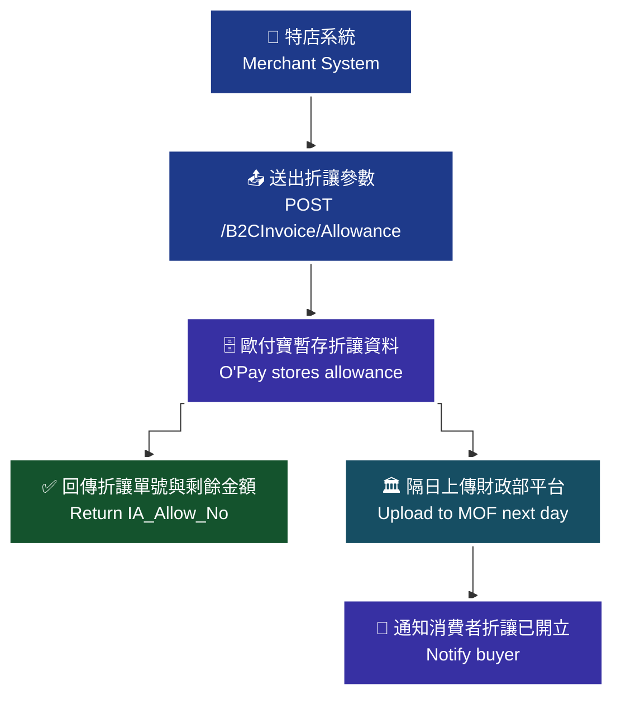

> ♿ 配色遵循 [`docs/accessibility.md`](../docs/accessibility.md)：WCAG AAA 對比 ≥7:1、Okabe-Ito 色盲安全色盤、16px 字體、直角連線、圖示＋文字雙編碼。

### 傳入參數（外層）

| 參數 | 參數名稱 | 型態 | 必填 | 說明 |
| --- | --- | --- | --- | --- |
| `PlatformID` | 特約合作平台商代號 | String(10) | — | 1. 提供特約合作平台商向歐付寶申請開通後使用，一般廠商介接請放空值。<br>2. 平台商使用時，MerchantID(特店編號)欄位僅限帶入已綁定子廠商的特店編號，以免造成失敗。 |
| `MerchantID` | 特店編號 | String(10) | ✅ | 1. 測試環境合作特店編號 2. 正式環境金鑰取得 |
| `RqHeader` | 傳入資料 | — | ✅ | — |
| `RqHeader.Timestamp` | 傳入時間 | Number | ✅ | 歐付寶會利用此參數將當下的時間轉為 Unix TimeStamp 來驗證此次介接的時間區間。注意事項：<br>1. 驗證時間區間暫訂為 10 分鐘內有效，若超過此驗證時間則此次訂單將無法建立，參考資料：http://www.epochconverter.com/。<br>2. 合作特店須進行主機「時間校正」，避免主機產生時差，延伸 API 無法正常運作。 |
| `Data` | 加密資料 | String | ✅ | 資料內容，此為加密過 JSON 格式的資料。加密方法說明 |

外層範例：

```json
{
    "MerchantID": "2000132",
    "RqHeader": {
        "Timestamp": 1525168923
    },
    "Data": "…"
}
```

### 傳入 Data 參數（加密前的 JSON）

| 參數 | 參數名稱 | 型態 | 必填 | 說明 |
| --- | --- | --- | --- | --- |
| `MerchantID` | 特店編號 | String(10) | ✅ | — |
| `InvoiceNo` | 發票號碼 | String(10) | ✅ | 長度固定為 10 碼 |
| `InvoiceDate` | 發票開立日期 | String(10) | ✅ | 格式為「yyyy-MM-dd」或「yyyy/MM/dd」 |
| `AllowanceNotify` | 通知類別 | String(1) | ✅ | 開立折讓後，寄送將相關發票折讓資訊通知消費者。<br>`S`：簡訊<br>`E`：電子郵件<br>`A`：皆通知時<br>`N`：皆不通知 |
| `CustomerName` | 客戶名稱 | String(60) | — | 格式建議為中、英文及數字等。 |
| `NotifyMail` | 通知電子信箱 | String(80) | 條件 | 若通知類別 [AllowanceNotify] 為電子郵件(E)，此欄位須有值；需為有效的 Email 格式；3. 將參數值做 UrlEncode；4. 可帶入多組 Email，並以分號區隔 ex: aa@aa.aa;bb@bb.bb |
| `NotifyPhone` | 通知手機號碼 | String(20) | 條件 | 若通知類別 [AllowanceNotify] 為簡訊方式(S)，此欄位須有值；格式為數字組成 |
| `AllowanceAmount` | 折讓單總金額(含稅) | Int | ✅ | — |
| `Items` | 商品 | — | — | — |
| `Items[].ItemSeq` | 商品序號 | Int | ✅ | 限定輸入 1-999 |
| `Items[].ItemName` | 商品名稱 | String(100) | ✅ | 不可為空字串 |
| `Items[].ItemCount` | 商品數量 | Number | ✅ | 支援整數 8 位小數 6 位 |
| `Items[].ItemWord` | 商品單位 | String(6) | ✅ | — |
| `Items[].ItemPrice` | 商品單價 | Number | ✅ | 支援整數 8 位小數 7 位 |
| `Items[].ItemTaxType` | 商品課稅別 | String(1) | — | `1`：應稅<br>`2`：零稅率<br>`3`：免稅 |
| `Items[].ItemAmount` | 商品合計 | Number | ✅ | 此為含稅小計金額，支援整數 8 位小數 7 位。注意事項：提醒您，依營業稅電子資料申報繳稅作業要點，電子發票銷貨退回、進貨退出或折讓證明單之「金額(不含稅之進貨額)」及「營業稅額」欄位須為整數，以利申報資料正確，建議此欄位請帶入整數 |

### 傳入 Data 範例

```json
{
    "MerchantID": "2000132",
    "InvoiceNo": "UV11100013",
    "InvoiceDate": "2019/09/17",
    "AllowanceNotify": "E",
    "CustomerName": "歐付寶股份有限公司",
    "NotifyMail": "test@opay.tw",
    "NotifyPhone": "0912345678",
    "AllowanceAmount": 50,
    "Items": [
        {
            "ItemSeq": 1,
            "ItemName": "item01",
            "ItemCount": 1,
            "ItemWord": "件",
            "ItemPrice": 50,
            "ItemTaxType": "2",
            "ItemAmount": 50
        }
    ]
}
```

### 回傳參數（外層）

| 參數 | 參數名稱 | 型態 | 說明 |
| --- | --- | --- | --- |
| `PlatformID` | 特約合作平台商代號 | String(10) | — |
| `MerchantID` | 廠商編號 | String(10) | — |
| `RpHeader` | 回傳資料 | — | — |
| `RpHeader.Timestamp` | 回傳時間 | Number | — |
| `TransCode` | 回傳代碼 | Int | 1 代表傳輸資料(MerchantID, RqHeader, Data)接收成功，其餘均為失敗 |
| `TransMsg` | 回傳訊息 | String(200) | 回傳訊息 |
| `Data` | 加密資料 | String | 資料內容，此為加密過 JSON 格式的資料。加密方法說明 |

外層回傳範例：

```json
{
    "MerchantID": "2000132",
    "RpHeader": {
        "Timestamp": 1525169058
    },
    "TransCode": 1,
    "TransMsg": "",
    "Data": "…"
}
```

### 回傳 Data 參數

| 參數 | 參數名稱 | 型態 | 說明 |
| --- | --- | --- | --- |
| `RtnCode` | 回應代碼 | Int | 1 為成功，其餘為失敗。 |
| `RtnMsg` | 回應訊息 | String(200) | — |
| `IA_Allow_No` | 折讓單號 | String(16) | 開立成功，會回傳折讓單號；開立失敗，則會回傳空值。 |
| `IA_Invoice_No` | 發票號碼 | String(10) | 開立成功，會回傳當初開立的發票號碼；開立失敗，則會回傳空值。 |
| `IA_Date` | 折讓時間 | String(20) | 開立成功，會回傳開立折讓時間，回傳格式為「yyyy-MM-dd HH:mm:ss」；開立失敗，則會回傳空值 |
| `IA_Remain_Allowance_Amt` | 折讓剩餘金額 | Int | 開立成功，會回傳開立折讓後剩餘金額；開立失敗，則會回傳空值 |

### 回傳 Data 範例

```json
{
    "IA_Allow_No": "2019091717363987",
    "IA_Invoice_No": "UV11100013",
    "IA_Date": "2019-09-17 17:36:18",
    "IA_Remain_Allowance_Amt": 50,
    "RtnCode": 1,
    "RtnMsg": "折讓單資料新增成功"
}
```

### 注意事項

- `RqHeader.Timestamp` 驗證時間區間暫訂為 10 分鐘內有效，若超過此驗證時間則此次訂單將無法建立（參考 http://www.epochconverter.com/ ）。
- 合作特店須進行主機「時間校正」，避免主機產生時差，延伸 API 無法正常運作。
- 平台商使用時，`MerchantID` 欄位僅限帶入已綁定子廠商的特店編號，以免造成失敗；一般廠商介接 `PlatformID` 請放空值。
- 通知類別 `AllowanceNotify` = `E` 時 `NotifyMail` 須有值；= `S` 時 `NotifyPhone` 須有值。
- `NotifyMail` 需為有效的 Email 格式、參數值須做 UrlEncode，可帶入多組 Email 並以分號區隔。
- `Items[].ItemAmount`：依營業稅電子資料申報繳稅作業要點，電子發票銷貨退回、進貨退出或折讓證明單之「金額(不含稅之進貨額)」及「營業稅額」欄位須為整數，以利申報資料正確，建議此欄位請帶入整數。

---

## 9. 開立折讓－線上開立折讓（通知開立）— `AllowanceByCollegiate`

- **來源**：i100 §8
- **用途**：營業人（特店）可使用此功能將折讓開立參數傳送至歐付寶，由歐付寶暫存折讓資料，並發折讓同意通知信給消費者，待消費者點選信件中的同意折讓後，歐付寶會即時通知營業人折讓單已開立並回傳折讓單號碼，並於隔日將折讓資料上傳至財政部電子發票整合服務平台，並通知消費者（買家）折讓已開立。
- **HTTP Method**：POST（`Content-Type: application/json`）
- **測試環境**：`https://einvoice-stage.opay.tw/B2CInvoice/AllowanceByCollegiate`
- **正式環境**：`https://einvoice.opay.tw/B2CInvoice/AllowanceByCollegiate`

**應用場景**：若商品質量、規格等不符合消費者要求，特店同意在商品價格上給予減讓，可使用此 API 將開立折讓發票參數傳送至歐付寶，暫存折讓發票資料。歐付寶會寄折讓同意通知信給買家，待買家同意折讓後，歐付寶會依發票折讓開立參數，開立發票折讓單並於隔日，將折讓資料上傳至財政部電子發票整合服務平台。

> 🧭 **純文字重述（螢幕閱讀器友善）**：開立折讓情境流程圖（線上折讓）。特店呼叫 `AllowanceByCollegiate` 送出折讓開立參數；歐付寶暫存折讓資料並回傳線上折讓時間與同意到期日；歐付寶寄出折讓同意通知信給消費者；消費者點選信件中的「同意折讓」後，歐付寶即時以幕後 Server POST 將結果送到特店的 `ReturnURL`，特店須回應 `1|OK`；歐付寶於隔日將折讓資料上傳至財政部電子發票整合服務平台並通知消費者折讓已開立。若消費者未於同意到期日前同意，折讓不會成立。

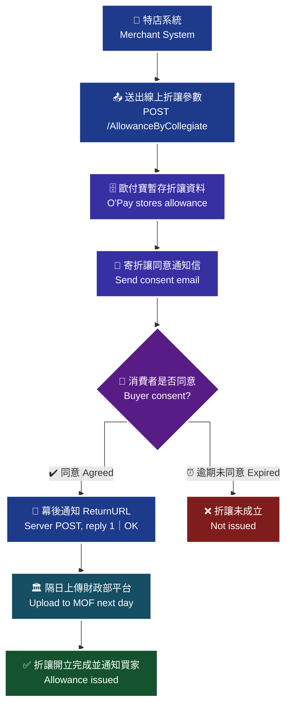

> ♿ 配色遵循 [`docs/accessibility.md`](../docs/accessibility.md)：WCAG AAA 對比 ≥7:1、Okabe-Ito 色盲安全色盤、16px 字體、直角連線、圖示＋文字雙編碼。

### 傳入參數（外層）

| 參數 | 參數名稱 | 型態 | 必填 | 說明 |
| --- | --- | --- | --- | --- |
| `PlatformID` | 特約合作平台商代號 | String(10) | — | 1. 提供特約合作平台商向歐付寶申請開通後使用，一般廠商介接請放空值。<br>2. 平台商使用時，MerchantID(特店編號)欄位僅限帶入已綁定子廠商的特店編號，以免造成失敗。 |
| `MerchantID` | 特店編號 | String(10) | ✅ | 1. 測試環境合作特店編號 2. 正式環境金鑰取得 |
| `RqHeader` | 傳入資料 | — | ✅ | — |
| `RqHeader.Timestamp` | 傳入時間 | Number | ✅ | 歐付寶會利用此參數將當下的時間轉為 Unix TimeStamp 來驗證此次介接的時間區間。注意事項：<br>1. 驗證時間區間暫訂為 10 分鐘內有效，若超過此驗證時間則此次訂單將無法建立，參考資料：http://www.epochconverter.com/。<br>2. 合作特店須進行主機「時間校正」，避免主機產生時差，延伸 API 無法正常運作。 |
| `Data` | 加密資料 | String | ✅ | 資料內容，此為加密過 JSON 格式的資料。加密方法說明 |

外層範例：

```json
{
    "MerchantID": 2000132,
    "RqHeader": {
        "Timestamp": 1525168923
    },
    "Data": "…"
}
```

### 傳入 Data 參數（加密前的 JSON）

| 參數 | 參數名稱 | 型態 | 必填 | 說明 |
| --- | --- | --- | --- | --- |
| `MerchantID` | 特店編號 | String(10) | ✅ | — |
| `InvoiceNo` | 發票號碼 | String(10) | ✅ | 長度固定為 10 碼 |
| `InvoiceDate` | 發票開立日期 | String(10) | ✅ | 格式為「yyyy-MM-dd」或「yyyy/MM/dd」 |
| `AllowanceNotify` | 通知類別 | String(1) | ✅ | 請固定填入 `E`：電子郵件 |
| `CustomerName` | 客戶名稱 | String(60) | — | 建議格式為中、英文及數字等。 |
| `NotifyMail` | 通知電子信箱 | String(80) | ✅ | 1. 需為有效的 Email 格式<br>2. 可帶入多組 Email，並以分號區隔 ex: aa@aa.aa;bb@bb.bb |
| `AllowanceAmount` | 折讓單總金額(含稅) | Int | ✅ | — |
| `Items` | 商品 | — | — | — |
| `Items[].ItemSeq` | 商品序號 | Int | — | — |
| `Items[].ItemName` | 商品名稱 | String(100) | ✅ | — |
| `Items[].ItemCount` | 商品數量 | Number | ✅ | 支援整數 8 位小數 6 位 |
| `Items[].ItemWord` | 商品單位 | String(6) | ✅ | — |
| `Items[].ItemPrice` | 商品單價 | Number | ✅ | 支援整數 8 位小數 7 位 |
| `Items[].ItemTaxType` | 商品課稅別 | String(1) | — | `1`：應稅<br>`2`：零稅率<br>`3`：免稅 |
| `Items[].ItemAmount` | 商品合計 | Number | ✅ | 支援整數 8 位小數 7 位。注意事項：提醒您，依營業稅電子資料申報繳稅作業要點，電子發票銷貨退回、進貨退出或折讓證明單之「金額(不含稅之進貨額)」及「營業稅額」欄位須為整數，以利申報資料正確，建議此欄位請帶入整數 |
| `ReturnURL` | 消費者同意後回傳網址 | String(200) | — | 當消費者點選同意後，歐付寶會將成功的結果參數以幕後(Server POST)回傳到該網址。注意事項：請在收到 Server 端折讓成功結果通知後，請正確回應 `1|OK` 給歐付寶。 |

### 傳入 Data 範例

```json
{
    "MerchantID": 2000132,
    "InvoiceNo": "UV11100015",
    "InvoiceDate": "2019/09/17",
    "AllowanceNotify": "E",
    "CustomerName": "歐付寶股份有限公司",
    "NotifyMail": "test@opay.tw",
    "NotifyPhone": "0912345678",
    "AllowanceAmount": 50,
    "Items": [
        {
            "ItemSeq": 1,
            "ItemName": "item01",
            "ItemCount": 1,
            "ItemWord": "件",
            "ItemPrice": 50,
            "ItemTaxType": "2",
            "ItemAmount": 50
        }
    ],
    "ReturnURL": "https://allowance.yoursite/Revice"
}
```

> ⚠️ 原文範例含 `NotifyPhone`，但本 API 的 Data 參數表未列出此欄位。原文未明確說明，介接前請向歐付寶確認。

### 回傳參數（外層）

| 參數 | 參數名稱 | 型態 | 說明 |
| --- | --- | --- | --- |
| `PlatformID` | 特約合作平台商代號 | String(10) | — |
| `MerchantID` | 廠商編號 | String(10) | — |
| `RpHeader` | 回傳資料 | — | — |
| `RpHeader.Timestamp` | 回傳時間 | Number | — |
| `TransCode` | 回傳代碼 | Int | 1 代表傳輸資料(MerchantID, RqHeader, Data)接收成功，其餘均為失敗 |
| `TransMsg` | 回傳訊息 | String(200) | 回傳訊息 |
| `Data` | 加密資料 | String | 資料內容，此為加密過 JSON 格式的資料。加密方法說明 |

外層回傳範例：

```json
{
    "MerchantID": 2000132,
    "RpHeader": {
        "Timestamp": 1525169058
    },
    "TransCode": 1,
    "TransMsg": "",
    "Data": "…"
}
```

### 回傳 Data 參數

| 參數 | 參數名稱 | 型態 | 說明 |
| --- | --- | --- | --- |
| `RtnCode` | 回應代碼 | Int | 1 為成功，其餘為失敗。注意事項：成功代表 API 呼叫成功，需消費者同意後才算開立折讓單成功 |
| `RtnMsg` | 回應訊息 | String(200) | — |
| `IA_Allow_No` | 折讓單號 | String(16) | 建立成功，回傳折讓單號；建立失敗，則會回傳空值。 |
| `IA_Invoice_No` | 發票號碼 | String(10) | 建立成功，會回傳當初開立的發票號碼；建立失敗，則會回傳空值。 |
| `IA_TempDate` | 線上折讓時間 | String(20) | 建立成功，會回傳線上折讓時間，回傳格式為「yyyy-MM-dd HH:mm:ss」；建立失敗，則會回傳空值 |
| `IA_TempExpireDate` | 線上折讓同意到期日 | String(20) | 建立成功，會回傳線上折讓同意到期日，回傳格式為「yyyy-MM-dd HH:mm:ss」；建立失敗，則會回傳空值 |
| `IA_Remain_Allowance_Amt` | 折讓剩餘金額 | int | 建立成功，會回傳開立折讓後剩餘金額；建立失敗，則會回傳空值 |

### 回傳 Data 範例

```json
{
    "RtnCode": 1,
    "RtnMsg": "折讓單資料新增成功",
    "IA_Allow_No": "1909181313013546",
    "IA_Invoice_No": "UV11100019",
    "IA_TempDate": "2019-09-18 13:13:23",
    "IA_TempExpireDate": "2019-09-21 13:13:23",
    "IA_Remain_Allowance_Amt": 0
}
```

### ReturnURL 幕後通知參數（消費者同意後 Server POST）

| 參數 | 參數名稱 | 型態 | 說明 |
| --- | --- | --- | --- |
| `RtnCode` | 回應代碼 | Int | 1 為成功，其餘為失敗。 |
| `RtnMsg` | 回應訊息 | String(200) | — |
| `IA_Allow_No` | 折讓單號 | String(16) | 開立成功，會回傳折讓單號；開立失敗，則會回傳空值。 |
| `IA_Invoice_No` | 發票號碼 | String(10) | 開立成功，會回傳當初開立的發票號碼；開立失敗，則會回傳空值。 |
| `IA_Date` | 折讓時間 | String(20) | 開立成功，會回傳開立折讓時間，回傳格式為「yyyy-MM-dd HH:mm:ss」或「yyyy/MM/dd HH:mm:ss」；開立失敗，則會回傳空值 |
| `IIS_Remain_Allowance_Amt` | 折讓剩餘金額 | Int | 開立成功，會回傳開立折讓後剩餘金額；開立失敗，則會回傳空值 |

ReturnURL 範例（表單編碼字串，非 JSON）：

```text
RtnCode=1&RtnMsg=&IA_Allow_No=1909181313013546&IA_Invoice_No=UV11100019&IA_Date=2019-09-18 13:13:23&IIS_Remain_Allowance_Amt=0
```

### 注意事項

- `RqHeader.Timestamp` 驗證時間區間暫訂為 10 分鐘內有效，若超過此驗證時間則此次訂單將無法建立（參考 http://www.epochconverter.com/ ）。
- 合作特店須進行主機「時間校正」，避免主機產生時差，延伸 API 無法正常運作。
- 平台商使用時，`MerchantID` 欄位僅限帶入已綁定子廠商的特店編號，以免造成失敗；一般廠商介接 `PlatformID` 請放空值。
- `AllowanceNotify` 請固定填入 `E`（電子郵件）。
- `ReturnURL`：當消費者點選同意後，歐付寶會將成功的結果參數以幕後(Server POST)回傳到該網址；請在收到 Server 端折讓成功結果通知後，正確回應 `1|OK` 給歐付寶。
- `RtnCode` = 1 僅代表 API 呼叫成功，需消費者同意後才算開立折讓單成功。
- `Items[].ItemAmount`：依營業稅電子資料申報繳稅作業要點，電子發票銷貨退回、進貨退出或折讓證明單之「金額(不含稅之進貨額)」及「營業稅額」欄位須為整數，以利申報資料正確，建議此欄位請帶入整數。

---

## 10. 作廢發票 — `Invalid`

- **來源**：i100 §9
- **用途**：營業人（特店）可使用此功能將發票作廢參數傳送至歐付寶，由歐付寶暫存發票作廢資料。歐付寶於隔日將作廢資料上傳至財政部電子發票整合服務平台，並通知消費者（買家）電子發票已作廢。
- **HTTP Method**：POST（`Content-Type: application/json`）
- **測試環境**：`https://einvoice-stage.opay.tw/B2CInvoice/Invalid`
- **正式環境**：`https://einvoice.opay.tw/B2CInvoice/Invalid`

**應用場景**：若商品質量、規格等不符合消費者要求，特店同意退貨，或發票開立錯誤…等，可使用此 API 將已開立發票作廢。此時會將作廢發票參數傳送至歐付寶暫存。歐付寶會於隔日，將作廢發票資訊上傳至財政部電子發票整合服務平台。

> 🧭 **純文字重述（螢幕閱讀器友善）**：作廢發票情境流程圖。特店呼叫 `Invalid` 送出發票號碼、開立日期與作廢原因；歐付寶接收後暫存發票作廢資料並回傳作廢結果；歐付寶於隔日將作廢資料上傳至財政部電子發票整合服務平台；上傳後通知消費者（買家）電子發票已作廢。

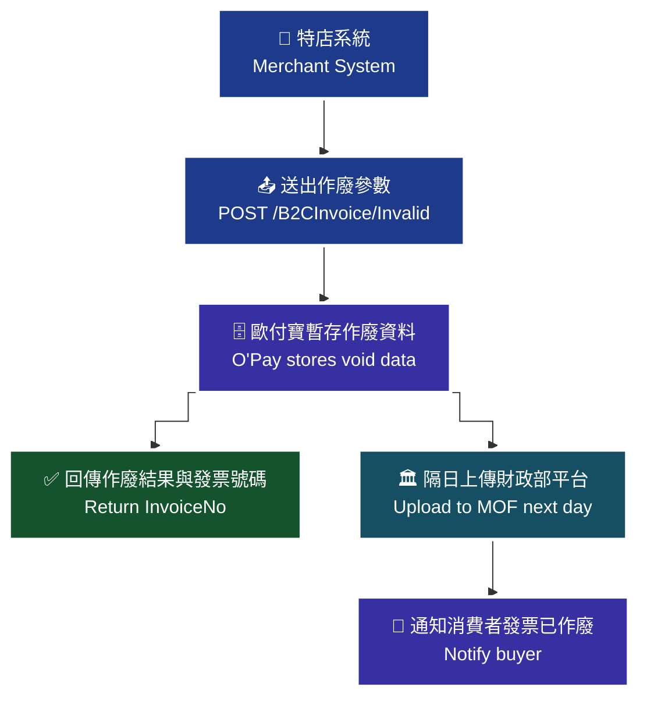

> ♿ 配色遵循 [`docs/accessibility.md`](../docs/accessibility.md)：WCAG AAA 對比 ≥7:1、Okabe-Ito 色盲安全色盤、16px 字體、直角連線、圖示＋文字雙編碼。

### 傳入參數（外層）

| 參數 | 參數名稱 | 型態 | 必填 | 說明 |
| --- | --- | --- | --- | --- |
| `PlatformID` | 特約合作平台商代號 | String(10) | — | 1. 提供特約合作平台商向歐付寶申請開通後使用，一般廠商介接請放空值。<br>2. 平台商使用時，MerchantID(特店編號)欄位僅限帶入已綁定子廠商的特店編號，以免造成失敗。 |
| `MerchantID` | 特店編號 | String(10) | ✅ | 1. 測試環境合作特店編號 2. 正式環境金鑰取得 |
| `RqHeader` | 傳入資料 | — | — | — |
| `RqHeader.Timestamp` | 傳入時間 | Number | ✅ | 歐付寶會利用此參數將當下的時間轉為 Unix TimeStamp 來驗證此次介接的時間區間。注意事項：<br>1. 驗證時間區間暫訂為 10 分鐘內有效，若超過此驗證時間則此次訂單將無法建立，參考資料：http://www.epochconverter.com/。<br>2. 合作特店須進行主機「時間校正」，避免主機產生時差，延伸 API 無法正常運作。 |
| `Data` | 加密資料 | String | ✅ | 資料內容，此為加密過 JSON 格式的資料。加密方法說明 |

外層範例：

```json
{
    "MerchantID": 2000132,
    "RqHeader": {
        "Timestamp": 1525168923
    },
    "Data": "…"
}
```

### 傳入 Data 參數（加密前的 JSON）

| 參數 | 參數名稱 | 型態 | 必填 | 說明 |
| --- | --- | --- | --- | --- |
| `MerchantID` | 特店編號 | String(10) | ✅ | — |
| `InvoiceNo` | 發票號碼 | String(10) | ✅ | 長度固定為 10 碼 |
| `InvoiceDate` | 發票開立日期 | String(10) | ✅ | 格式為「yyyy-MM-dd」或「yyyy/MM/dd」 |
| `Reason` | 作廢原因 | String(20) | ✅ | — |

### 傳入 Data 範例

```json
{
    "MerchantID": 2000132,
    "InvoiceNo": "AA123456",
    "InvoiceDate": "2019-09-17",
    "Reason": ""
}
```

### 回傳參數（外層）

| 參數 | 參數名稱 | 型態 | 說明 |
| --- | --- | --- | --- |
| `PlatformID` | 特約合作平台商代號 | String(10) | — |
| `MerchantID` | 廠商編號 | String(10) | — |
| `RpHeader` | 回傳資料 | — | — |
| `RpHeader.Timestamp` | 回傳時間 | Number | — |
| `TransCode` | 回傳代碼 | Int | 1 代表傳輸資料(MerchantID, RqHeader, Data)接收成功，其餘均為失敗 |
| `TransMsg` | 回傳訊息 | String(200) | 回傳訊息 |
| `Data` | 加密資料 | String | 資料內容，此為加密過 JSON 格式的資料。加密方法說明 |

外層回傳範例：

```json
{
    "MerchantID": 2000132,
    "RpHeader": {
        "Timestamp": 1525169058
    },
    "TransCode": 1,
    "TransMsg": "",
    "Data": "…"
}
```

### 回傳 Data 參數

| 參數 | 參數名稱 | 型態 | 說明 |
| --- | --- | --- | --- |
| `RtnCode` | 回應代碼 | Int | 1 為成功，其餘為失敗。 |
| `RtnMsg` | 回應訊息 | String(200) | — |
| `InvoiceNo` | 發票號碼 | String(10) | 若作廢成功，則會回傳發票號碼；若開立失敗，則會回傳空值。 |

### 回傳 Data 範例

```json
{
    "RtnCode": "1",
    "RtnMsg": "作廢發票成功",
    "InvoiceNo": "AA123456"
}
```

### 注意事項

- (1) 發票若已被折讓過，無法直接作廢發票，並請確認該發票所開立的折讓單是否全部已作廢。
- (2) 每年奇數月的 13 號 23:59:59 以後，因已申報至財政部，無法作廢前兩個月開立的發票。例如 3 月 14 號時，不能作廢 1、2 月所開立的發票。
- `RqHeader.Timestamp` 驗證時間區間暫訂為 10 分鐘內有效，若超過此驗證時間則此次訂單將無法建立（參考 http://www.epochconverter.com/ ）。
- 合作特店須進行主機「時間校正」，避免主機產生時差，延伸 API 無法正常運作。
- 平台商使用時，`MerchantID` 欄位僅限帶入已綁定子廠商的特店編號，以免造成失敗；一般廠商介接 `PlatformID` 請放空值。

---

## 11. 作廢折讓 — `AllowanceInvalid`

- **來源**：i100 §10
- **用途**：營業人（特店）可使用此功能將折讓作廢參數傳送至歐付寶，由歐付寶暫存折讓作廢資料。歐付寶於隔日將折讓作廢資料上傳至財政部電子發票整合服務平台，並通知消費者（買家）折讓發票已作廢。
- **HTTP Method**：POST（`Content-Type: application/json`）
- **測試環境**：`https://einvoice-stage.opay.tw/B2CInvoice/AllowanceInvalid`
- **正式環境**：`https://einvoice.opay.tw/B2CInvoice/AllowanceInvalid`

**應用場景**：若特店開立折讓後，想取消折讓、或開立折讓錯誤…等，可使用此 API 將已開立折讓的部分作廢（不是整張發票作廢喔！）。此時會將折讓作廢發票參數傳送至歐付寶暫存。歐付寶會於隔日，將折讓作廢發票資訊上傳至財政部電子發票整合服務平台。

> 🧭 **純文字重述（螢幕閱讀器友善）**：作廢折讓情境流程圖。特店呼叫 `AllowanceInvalid` 送出發票號碼、折讓編號與作廢原因；歐付寶接收後暫存折讓作廢資料並回傳結果；歐付寶於隔日將折讓作廢資料上傳至財政部電子發票整合服務平台；上傳後通知消費者（買家）折讓發票已作廢。作廢的只有該張折讓單，不是整張發票。

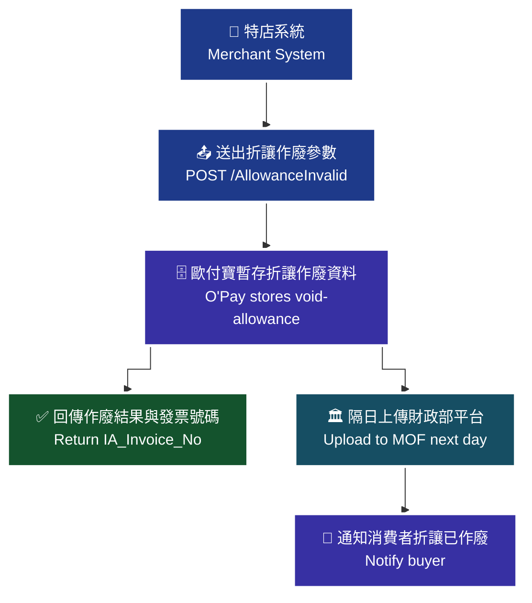

> ♿ 配色遵循 [`docs/accessibility.md`](../docs/accessibility.md)：WCAG AAA 對比 ≥7:1、Okabe-Ito 色盲安全色盤、16px 字體、直角連線、圖示＋文字雙編碼。

### 傳入參數（外層）

| 參數 | 參數名稱 | 型態 | 必填 | 說明 |
| --- | --- | --- | --- | --- |
| `PlatformID` | 特約合作平台商代號 | String(10) | — | 1. 提供特約合作平台商向歐付寶申請開通後使用，一般廠商介接請放空值。<br>2. 平台商使用時，MerchantID(特店編號)欄位僅限帶入已綁定子廠商的特店編號，以免造成失敗。 |
| `MerchantID` | 特店編號 | String(10) | ✅ | 1. 測試環境合作特店編號 2. 正式環境金鑰取得 |
| `RqHeader` | 傳入資料 | — | — | — |
| `RqHeader.Timestamp` | 傳入時間 | Number | ✅ | 歐付寶會利用此參數將當下的時間轉為 Unix TimeStamp 來驗證此次介接的時間區間。注意事項：<br>1. 驗證時間區間暫訂為 10 分鐘內有效，若超過此驗證時間則此次訂單將無法建立，參考資料：http://www.epochconverter.com/。<br>2. 合作特店須進行主機「時間校正」，避免主機產生時差，延伸 API 無法正常運作。 |
| `Data` | 加密資料 | String | ✅ | 資料內容，此為加密過 JSON 格式的資料。加密方法說明 |

外層範例：

```json
{
    "MerchantID": 2000132,
    "RqHeader": {
        "Timestamp": 1525168923
    },
    "Data": "…"
}
```

### 傳入 Data 參數（加密前的 JSON）

| 參數 | 參數名稱 | 型態 | 必填 | 說明 |
| --- | --- | --- | --- | --- |
| `MerchantID` | 特店編號 | String(10) | ✅ | — |
| `InvoiceNo` | 發票號碼 | String(10) | ✅ | — |
| `AllowanceNo` | 折讓編號 | String(16) | ✅ | — |
| `Reason` | 作廢原因 | String(20) | ✅ | — |

### 傳入 Data 範例

```json
{
    "MerchantID": 2000132,
    "InvoiceNo": "AA123456",
    "AllowanceNo": "2016022615195209",
    "Reason": ""
}
```

### 回傳參數（外層）

| 參數 | 參數名稱 | 型態 | 說明 |
| --- | --- | --- | --- |
| `PlatformID` | 特約合作平台商代號 | String(10) | — |
| `MerchantID` | 廠商編號 | String(10) | — |
| `RpHeader` | 回傳資料 | — | — |
| `RpHeader.Timestamp` | 回傳時間 | Number | — |
| `TransCode` | 回傳代碼 | Int | 1 代表傳輸資料(MerchantID, RqHeader, Data)接收成功，其餘均為失敗 |
| `TransMsg` | 回傳訊息 | String(200) | 回傳訊息 |
| `Data` | 加密資料 | String | 資料內容，此為加密過 JSON 格式的資料。加密方法說明 |

外層回傳範例：

```json
{
    "MerchantID": "2000132",
    "RpHeader": {
        "Timestamp": 1525169058
    },
    "TransCode": 1,
    "TransMsg": "",
    "Data": "…"
}
```

### 回傳 Data 參數

| 參數 | 參數名稱 | 型態 | 說明 |
| --- | --- | --- | --- |
| `RtnCode` | 回應代碼 | Int | 1 為成功，其餘為失敗。 |
| `RtnMsg` | 回應訊息 | String(200) | — |
| `IA_Invoice_No` | 發票號碼 | String(10) | 若作廢成功，則會回傳發票號碼；若作廢失敗，則會回傳空值。 |

### 回傳 Data 範例

```json
{
    "RtnCode": "1",
    "RtnMsg": "該折讓單已作廢",
    "IA_Invoice_No": "AA123456"
}
```

### 注意事項

- 每年奇數月的 13 號 23:59:59 以後，因已申報至財政部，無法作廢前兩個月開立的發票折讓。例如 3 月 14 號時，不能作廢 1、2 月所開立的發票折讓。
- `RqHeader.Timestamp` 驗證時間區間暫訂為 10 分鐘內有效，若超過此驗證時間則此次訂單將無法建立（參考 http://www.epochconverter.com/ ）。
- 合作特店須進行主機「時間校正」，避免主機產生時差，延伸 API 無法正常運作。
- 平台商使用時，`MerchantID` 欄位僅限帶入已綁定子廠商的特店編號，以免造成失敗；一般廠商介接 `PlatformID` 請放空值。

---

## 12. 取消線上折讓 — `AllowanceInvalidByCollegiate`

- **來源**：i100 §11
- **用途**：營業人（特店）可使用此功能將已申請線上折讓的發票進行取消，歐付寶收到後會將該筆折讓申請取消並返還額度至該發票可折讓金額。
- **HTTP Method**：POST（`Content-Type: application/json`）
- **測試環境**：`https://einvoice-stage.opay.tw/B2CInvoice/AllowanceInvalidByCollegiate`
- **正式環境**：`https://einvoice.opay.tw/B2CInvoice/AllowanceInvalidByCollegiate`

**應用場景**：若特店開立線上折讓後，想取消折讓，可使用此 API 將已開立線上折讓的部分取消（不是整張發票作廢喔！）。此時歐付寶會將該筆線上折讓申請取消，並將該筆折讓金額返還至該發票可折讓金額。

> 🧭 **純文字重述（螢幕閱讀器友善）**：取消線上折讓情境流程圖。特店呼叫 `AllowanceInvalidByCollegiate` 送出發票號碼、折讓編號與取消原因；歐付寶收到後將該筆線上折讓申請取消；歐付寶將該筆折讓金額返還至該發票的可折讓金額；並回傳取消結果與發票號碼給特店。

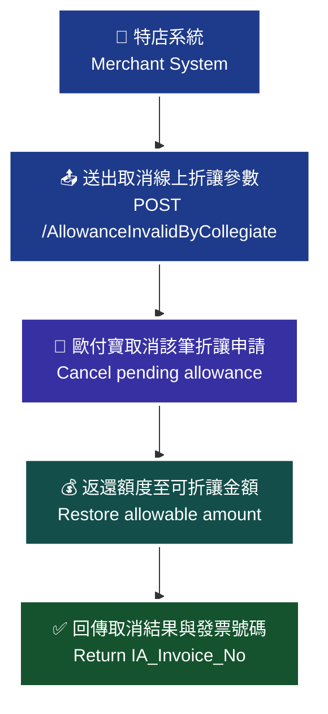

> ♿ 配色遵循 [`docs/accessibility.md`](../docs/accessibility.md)：WCAG AAA 對比 ≥7:1、Okabe-Ito 色盲安全色盤、16px 字體、直角連線、圖示＋文字雙編碼。

### 傳入參數（外層）

| 參數 | 參數名稱 | 型態 | 必填 | 說明 |
| --- | --- | --- | --- | --- |
| `PlatformID` | 特約合作平台商代號 | String(10) | — | 1. 提供特約合作平台商向歐付寶申請開通後使用，一般廠商介接請放空值。<br>2. 平台商使用時，MerchantID(特店編號)欄位僅限帶入已綁定子廠商的特店編號，以免造成失敗。 |
| `MerchantID` | 特店編號 | String(10) | ✅ | 1. 測試環境合作特店編號 2. 正式環境金鑰取得 |
| `RqHeader` | 傳入資料 | — | — | — |
| `RqHeader.Timestamp` | 傳入時間 | Number | ✅ | 歐付寶會利用此參數將當下的時間轉為 Unix TimeStamp 來驗證此次介接的時間區間。注意事項：<br>1. 驗證時間區間暫訂為 10 分鐘內有效，若超過此驗證時間則此次訂單將無法建立，參考資料：http://www.epochconverter.com/。<br>2. 合作特店須進行主機「時間校正」，避免主機產生時差，延伸 API 無法正常運作。 |
| `Data` | 加密資料 | String | ✅ | 資料內容，此為加密過 JSON 格式的資料。加密方法說明 |

外層範例：

```json
{
    "MerchantID": 2000132,
    "RqHeader": {
        "Timestamp": 1525168923
    },
    "Data": "…"
}
```

### 傳入 Data 參數（加密前的 JSON）

| 參數 | 參數名稱 | 型態 | 必填 | 說明 |
| --- | --- | --- | --- | --- |
| `MerchantID` | 特店編號 | String(10) | ✅ | — |
| `InvoiceNo` | 發票號碼 | String(10) | ✅ | — |
| `AllowanceNo` | 折讓編號 | String(16) | ✅ | — |
| `Reason` | 取消原因 | String(20) | ✅ | — |

### 傳入 Data 範例

```json
{
    "MerchantID": 2000132,
    "InvoiceNo": "AA123456",
    "AllowanceNo": "2016022615195209",
    "Reason": ""
}
```

### 回傳參數（外層）

| 參數 | 參數名稱 | 型態 | 說明 |
| --- | --- | --- | --- |
| `PlatformID` | 特約合作平台商代號 | String(10) | — |
| `MerchantID` | 廠商編號 | String(10) | — |
| `RpHeader` | 回傳資料 | — | — |
| `RpHeader.Timestamp` | 回傳時間 | Number | — |
| `TransCode` | 回傳代碼 | Int | 1 代表傳輸資料(MerchantID, RqHeader, Data)接收成功，其餘均為失敗 |
| `TransMsg` | 回傳訊息 | String(200) | 回傳訊息 |
| `Data` | 加密資料 | String | 資料內容，此為加密過 JSON 格式的資料。加密方法說明 |

外層回傳範例：

```json
{
    "MerchantID": "2000132",
    "RpHeader": {
        "Timestamp": 1525169058
    },
    "TransCode": 1,
    "TransMsg": "",
    "Data": "…"
}
```

### 回傳 Data 參數

| 參數 | 參數名稱 | 型態 | 說明 |
| --- | --- | --- | --- |
| `RtnCode` | 回應代碼 | Int | 1 為成功，其餘為失敗。 |
| `RtnMsg` | 回應訊息 | String(200) | — |
| `IA_Invoice_No` | 發票號碼 | String(10) | 若取消成功，則會回傳發票號碼；若取消失敗，則會回傳空值。 |

### 回傳 Data 範例

```json
{
    "RtnCode": "1",
    "RtnMsg": "取消成功",
    "IA_Invoice_No": "AA123456"
}
```

### 注意事項

- 本 API 僅取消「已申請的線上折讓」（消費者尚未同意者），並非整張發票作廢；取消後折讓金額會返還至該發票的可折讓金額。
- `RqHeader.Timestamp` 驗證時間區間暫訂為 10 分鐘內有效，若超過此驗證時間則此次訂單將無法建立（參考 http://www.epochconverter.com/ ）。
- 合作特店須進行主機「時間校正」，避免主機產生時差，延伸 API 無法正常運作。
- 平台商使用時，`MerchantID` 欄位僅限帶入已綁定子廠商的特店編號，以免造成失敗；一般廠商介接 `PlatformID` 請放空值。

---

## 13. 註銷重開 — `VoidWithReIssue`

- **來源**：i100 §12
- **用途**：歐付寶收到營業人（特店）傳送發票註銷重開參數後，同時通知消費者（買家）電子發票已註銷重開。並立即將發票註銷請求上傳財政部，待財政部回覆發票註銷成功後，重新上傳發票開立至財政部。
- **HTTP Method**：POST（`Content-Type: application/json`）
- **測試環境**：`https://einvoice-stage.opay.tw/B2CInvoice/VoidWithReIssue`
- **正式環境**：`https://einvoice.opay.tw/B2CInvoice/VoidWithReIssue`

**應用場景**：適用於發票註銷重開（發票號碼、自訂編號、開立時間不可更改）。

> 🧭 **純文字重述（螢幕閱讀器友善）**：註銷重開發票情境流程圖。特店呼叫 `VoidWithReIssue`，同時送出註銷資料 `VoidModel` 與開立資料 `IssueModel`；歐付寶收到後通知消費者（買家）電子發票已註銷重開，並立即將發票註銷請求上傳財政部；待財政部回覆發票註銷成功後，歐付寶重新上傳發票開立至財政部；最後回傳發票號碼、發票開立時間與隨機碼給特店。

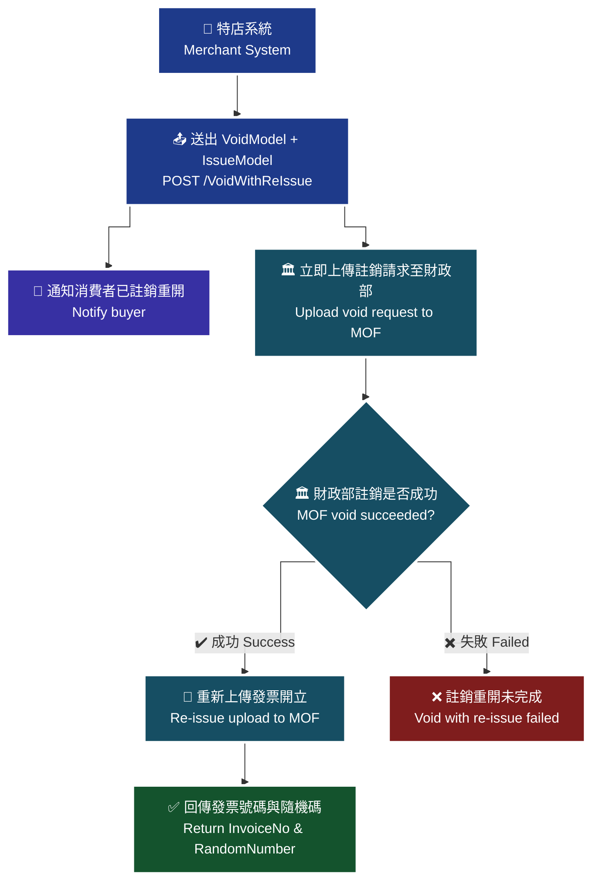

> ♿ 配色遵循 [`docs/accessibility.md`](../docs/accessibility.md)：WCAG AAA 對比 ≥7:1、Okabe-Ito 色盲安全色盤、16px 字體、直角連線、圖示＋文字雙編碼。

### 傳入參數（外層）

| 參數 | 參數名稱 | 型態 | 必填 | 說明 |
| --- | --- | --- | --- | --- |
| `PlatformID` | 特約合作平台商代號 | String(10) | — | 1. 提供特約合作平台商向歐付寶申請開通後使用，一般廠商介接請放空值。<br>2. 平台商使用時，MerchantID(特店編號)欄位僅限帶入已綁定子廠商的特店編號，以免造成失敗。 |
| `MerchantID` | 特店編號 | String(10) | ✅ | 1. 測試環境合作特店編號 2. 正式環境金鑰取得 |
| `RqHeader` | 傳入資料 | — | ✅ | — |
| `RqHeader.Timestamp` | 傳入時間 | Number | ✅ | 歐付寶會利用此參數將當下的時間轉為 Unix TimeStamp 來驗證此次介接的時間區間。注意事項：<br>1. 驗證時間區間暫訂為 10 分鐘內有效，若超過此驗證時間則此次訂單將無法建立，參考資料：http://www.epochconverter.com/。<br>2. 合作特店須進行主機「時間校正」，避免主機產生時差，延伸 API 無法正常運作。 |
| `Data` | 加密資料 | String | ✅ | 此為加密過 JSON 格式的資料。加密方法說明 |

外層範例：

```json
{
    "MerchantID": "2000132",
    "RqHeader": {
        "Timestamp": 1525168923
    },
    "Data": "…"
}
```

### 傳入 Data 參數（加密前的 JSON）

#### Data 頂層

| 參數 | 參數名稱 | 型態 | 必填 | 說明 |
| --- | --- | --- | --- | --- |
| `MerchantID` | 特店編號 | String(10) | ✅ | — |
| `VoidModel` | 註銷資料 | Json | ✅ | — |
| `IssueModel` | 開立資料 | Json | ✅ | — |

Data 頂層範例：

```json
{
    "MerchantID": "2000132",
    "VoidModel": "…",
    "IssueModel": "…"
}
```

#### `VoidModel`（註銷資料）

| 參數 | 參數名稱 | 型態 | 必填 | 說明 |
| --- | --- | --- | --- | --- |
| `VoidModel.InvoiceNo` | 發票號碼 | String(10) | ✅ | — |
| `VoidModel.VoidReason` | 註銷原因 | String(20) | ✅ | — |

VoidModel 範例：

```json
{
    "InvoiceNo": " MM00000000",
    "VoidReason": "Test"
}
```

#### `IssueModel`（開立資料）

| 參數 | 參數名稱 | 型態 | 必填 | 說明 |
| --- | --- | --- | --- | --- |
| `IssueModel.RelateNumber` | 特店自訂編號 | String(30) | ✅ | 需為唯一值不可重複使用。注意事項：建議勿使用特殊符號；大小寫英文視為相同 (e.g. 123abc456=123ABC456) |
| `IssueModel.InvoiceDate` | 發票開立時間 | String(20) | ✅ | 格式為「yyyy-MM-dd HH:mm:ss」或「yyyy/MM/dd HH:mm:ss」。發票開立時間需為先前開立發票的時間 |
| `IssueModel.CustomerID` | 客戶編號 | String(20) | — | 格式為『英文、數字、下底線』等字元。 |
| `IssueModel.CustomerIdentifier` | 統一編號 | String(8) | — | 格式為數字。為提供營業人更完善的發票開立服務，預計 2023 年 1 月 1 日起配合財政部更新統一編號檢查欄位邏輯由可被「10」整除改為可被「5」整除，以利營業人正確開立帶有統一編號之發票。調整說明如下：依財政部財政資訊中心公告，統一編號檢核修改「檢查邏輯由可被『10』整除改為可被『5』整除」，詳細內容可參考財政部財政資訊中心營利事業統一編號檢查碼邏輯修正說明。如未符合上述檢核邏輯，則開立發票、設定交易對象維護資料時將會失敗，請營業人務必提供正確的統一編號 |
| `IssueModel.CustomerName` | 客戶名稱 | String(60) | 條件 | 當列印註記 [Print]=1(列印) 時，為必填。當統一編號 [CustomerIdentifier] 有值時，此參數須填上客戶的公司名稱。建議格式為中、英文及數字等。 |
| `IssueModel.CustomerAddr` | 客戶地址 | String(100) | 條件 | 當列印註記 [Print]=1(列印) 時，為必填。 |
| `IssueModel.CustomerPhone` | 客戶手機號碼 | String(20) | 條件 | 當客戶電子信箱 [CustomerEmail] 為空字串時，為必填。格式為數字。 |
| `IssueModel.CustomerEmail` | 客戶電子信箱 | String(80) | 條件 | 當客戶手機號碼 [CustomerPhone] 為空字串時，為必填。需為有效的 Email 格式，且僅可填寫一組 Email。注意事項：測試環境請勿帶入之真實電子信箱，避免個資外洩。測試環境僅作 API 串接測試使用，僅以 API 回覆成功或失敗；不提供發信測試，僅驗規則。 |
| `IssueModel.ClearanceMark` | 通關方式 | String(1) | 條件 | 當課稅類別 [TaxType]=2(零稅率) 時，為必填。<br>`1`：非經海關出口<br>`2`：經海關出口 |
| `IssueModel.Print` | 列印註記 | String(1) | ✅ | `0`：不列印<br>`1`：要列印<br>注意事項：當捐贈註記 [Donation]=1(要捐贈) 時，此參數請帶 0。當統一編號 [CustomerIdentifier] 有值時，a 載具類別 [CarrierType] 為空值時，此參數請帶 1；b 載具類別 [CarrierType]=1 或 2 時，此參數請帶 0；c 載具類別 [CarrierType]=3 時，此參數可帶 0 或 1 |
| `IssueModel.Donation` | 捐贈註記 | String(1) | ✅ | `0`：不捐贈<br>`1`：要捐贈<br>注意事項：當統一編號 [CustomerIdentifier] 有值時，此參數請帶 0。當載具類別 [CarrierType] 不為空字串且捐贈註記 [Donation]=1 時，代表此張發票開立當下是存在載具內，之後消費者將此張發票進行捐贈成功，所以此張發票最終狀態是捐贈成功 |
| `IssueModel.LoveCode` | 捐贈碼 | String(7) | 條件 | 當捐贈註記 [Donation]=1(要捐贈) 時，為必填。格式為阿拉伯數字為限，最少三碼，最多七碼，首位可以為零。注意事項：使用捐贈碼時，請先呼叫捐贈碼驗證進行檢核，避免輸入錯誤。 |
| `IssueModel.CarrierType` | 載具類別 | String(1) | — | 空字串：無載具<br>`1`：歐付寶電子發票載具<br>`2`：自然人憑證號碼<br>`3`：手機條碼載具<br>`4`：悠遊卡<br>`5`：icash<br>`6`：一卡通<br>`7`：金融卡<br>`8`：信用卡<br>注意事項：當列印註記 [Print]=1(要列印) 時，請帶空字串。當列印註記 [Print]=0(不列印)，且統一編號 [CustomerIdentifier] 有值時，此參數不可帶空字串。 |
| `IssueModel.CarrierNum` | 載具編號 | String(64) | 條件 | 當 [CarrierType]="" 時，請帶空字串。當 [CarrierType]=1 時，請帶空字串，系統會自動帶入值，為客戶電子信箱或客戶手機號碼擇一(以客戶電子信箱優先)。[CarrierType]=2：請帶固定長度為 16 且格式為 2 碼大寫英文字母加上 14 碼數字。[CarrierType]=3：請帶固定長度為 8 碼字元，第 1 碼為【/】；其餘 7 碼則由數字【0-9】、大寫英文【A-Z】與特殊符號【+】【-】【.】這 39 個字元組成的編號。當 [CarrierType]=4~8 必填，請帶入實體卡片的 &lt;隱碼id&gt;，不會檢核正確性。注意事項：當 [CarrierType]=4~8 代表載具類別號碼之隱碼；英文、數字、符號僅接受半形字元；手機條碼載具會進行格式檢核；若載具編號為手機條碼載具時，請先呼叫手機條碼驗證進行檢核；如何取得 [CarrierType]=4~7 卡片隱碼(內碼)：您的設備需配備能讀取卡片的讀卡機，並確保該設備能讀取卡片內碼；[CarrierType]=8：請帶入信用卡加密卡號；查詢發票 API，當 [CarrierType]=4~8，因有資安考量，不會回傳 &lt;隱碼id&gt; |
| `IssueModel.CarrierNum2` | 第二載具編號 | String(64) | 條件 | 當 [CarrierType]=4~7 必填，請帶入實體卡片的 &lt;顯碼id&gt;，以便發票查詢可以顯示用來識別不同的實體卡片，不會檢核正確性。當 [CarrierType]=8 必填，請帶入刷卡日期(民國年月日共 7 碼)加刷卡交易金額(10 碼不足位左補 0)。當 [CarrierType] 不等於 4~8 時，此參數不須帶入。注意事項：當 [CarrierType]=4~8 代表載具類別號碼之顯碼；英文、數字、符號僅接受半形字元，格式錯誤會造成開立失敗；當 CarrierType 數值為 1、2 或 3 時，請廠商無須填入此欄位，以避免系統阻擋。 |
| `IssueModel.TaxType` | 課稅類別 | String(1) | ✅ | ⚠️ **原文此處為 1、2 或 9，與 §7 開立發票的「1、2、3 或 9」不一致（少了 3 免稅），已照原文保留，介接前請向歐付寶確認**。當字軌類別 [InvType] 為 07 時，則此欄位請填入 1、2 或 9；當字軌類別 [InvType] 為 08 時，則此欄位請填入 3 或 4。<br>`1`：應稅。<br>`2`：零稅率。<br>`3`：免稅。<br>`4`：應稅（特種稅率）<br>`9`：混合應稅與免稅或零稅率時(限收銀機發票無法分辨時使用，且需通過申請核可)。 |
| `IssueModel.ZeroTaxRateReason` | 零稅率原因 | String(2) | 條件 | \*預設 `71`：外銷貨物（當課稅類別 [TaxType] 為 2(零稅率) 或 9(混合應稅與零稅率) 時，零稅率原因為必填，若廠商回傳時無帶值，預設 71）<br>`71`：第一款 外銷貨物<br>`72`：第二款 與外銷有關之勞務，或在國內提供而在國外使用之勞務<br>`73`：第三款 依法設立之免稅商店銷售與過境或出境旅客之貨物<br>`74`：第四款 銷售與保稅區營業人供營運之貨物或勞務<br>`75`：第五款 國際間之運輸。但外國運輸事業在中華民國境內經營國際運輸業務者，應以各該國對中華民國國際運輸事業予以相等待遇或免徵類似稅捐者為限<br>`76`：第六款 國際運輸用之船舶、航空器及遠洋漁船<br>`77`：第七款 銷售與國際運輸用之船舶、航空器及遠洋漁船所使用之貨物或修繕勞務<br>`78`：第八款 保稅區營業人銷售與課稅區營業人未輸往課稅區而直接出口之貨物<br>`79`：第九款 保稅區營業人銷售與課稅區營業人存入自由港區事業或海關管理之保稅倉庫、物流中心以供外銷之貨物 |
| `IssueModel.SpecialTaxType` | 特種稅額類別 | Int | 條件 | 當課稅類別 [TaxType] 為 1/2/9 時，系統將會自動帶入數字【0】；當課稅類別 [TaxType] 為 3 時，則該參數必填，請填入數字【8】；當課稅類別 [TaxType] 為 4 時，則該參數必填，可填入數字【1-8】，並分別代表以下類別與稅率：<br>`1`：代表酒家及有陪侍服務之茶室、咖啡廳、酒吧之營業稅稅率，稅率為 25%<br>`2`：代表夜總會、有娛樂節目之餐飲店之營業稅稅率，稅率為 15%<br>`3`：代表銀行業、保險業、信託投資業、證券業、期貨業、票券業及典當業之專屬本業收入(不含銀行業、保險業經營銀行、保險本業收入)之營業稅稅率，稅率為 2%<br>`4`：代表保險業之再保費收入之營業稅稅率，稅率為 1%<br>`5`：代表銀行業、保險業、信託投資業、證券業、期貨業、票券業及典當業之非專屬本業收入之營業稅稅率，稅率為 5%<br>`6`：代表銀行業、保險業經營銀行、保險本業收入之營業稅稅率(適用於民國 103 年 07 月以後銷售額)，稅率為 5%<br>`7`：代表銀行業、保險業經營銀行、保險本業收入之營業稅稅率(適用於民國 103 年 06 月以前銷售額)，稅率為 5%<br>`8`：代表空白為免稅或非銷項特種稅額之資料 |
| `IssueModel.SalesAmount` | 發票總金額(含稅) | Int | ✅ | 請帶整數，不可有小數點。僅限新台幣，金額不可為 0 元。 |
| `IssueModel.InvoiceRemark` | 發票備註 | String(200) | — | — |
| `IssueModel.Items` | 商品 | — | — | 可多筆，商品最多支援 200 項 |
| `IssueModel.Items[].ItemSeq` | 商品序號 | Int | — | — |
| `IssueModel.Items[].ItemName` | 商品名稱 | String(100) | ✅ | — |
| `IssueModel.Items[].ItemCount` | 商品數量 | Number | ✅ | 支援整數 8 位小數 2 位 |
| `IssueModel.Items[].ItemWord` | 商品單位 | String(6) | ✅ | — |
| `IssueModel.Items[].ItemPrice` | 商品單價 | Number | ✅ | 支援整數 8 位小數 7 位。若 vat=0(未稅)，商品金額需為未稅金額；若 vat=1(含稅)，商品金額需為含稅金額 |
| `IssueModel.Items[].ItemTaxType` | 商品課稅別 | String(1) | 條件 | 當課稅類別 [TaxType] = 9 時，此欄位不可為空。<br>`1`：應稅<br>`2`：零稅率<br>`3`：免稅<br>注意事項：當課稅類別 [TaxType] = 9 時，商品課稅類別只能 應稅+免稅、應稅+零稅率，免稅和零稅率發票不能同時開立。 |
| `IssueModel.Items[].ItemAmount` | 商品合計 | Number | ✅ | 支援整數 8 位小數 7 位。此為含稅小計金額。ItemAmount 各項總合並四捨五入 = SalesAmount(含稅)。注意事項：※ItemAmount 需統一為含稅金額，且商品金額需符合以下規則：1. 當 vat = 1，且 TaxType = 1 或 4：ItemPrice(含稅)\*ItemCount = ItemAmount(含稅) ex: 500\*5 = 2500；2. 當 vat = 0，且 TaxType = 1(稅率 5%)：ItemPrice(不含稅)\*ItemCount\*1.05 = ItemAmount(含稅) ex: 500\*5\*1.05 = 2625 |
| `IssueModel.Items[].ItemRemark` | 商品備註 | String(40) | — | — |
| `IssueModel.InvType` | 字軌類別 | String(2) | ✅ | 該張發票的發票字軌類型。<br>`07`：一般稅額<br>`08`：特種稅額 |
| `IssueModel.vat` | 商品單價是否含稅 | String(1) | — | `1`：含稅(預設)<br>`0`：未稅 |

> 📌 **超商 KIOSK 事務機列印注意事項**（原文列於 `Print` 欄位之後；除須向業務申請開通外，請按以下需求帶入參數）
> 1. 要列印消費發票(ibon)：`Print=1`、`CarrierType=""`、`CustomerIdentifier=""`、`Donation=0`，只能列印一次（之後中獎也無法再次列印）
> 2. 要列印中獎發票(ibon, FamiPort)：`Print=0`、`CarrierType=1`、`CustomerIdentifier=""`、`Donation=0`，只能列印一次
> 3. 折讓後發票金額為 0 元，不可列印

> 📌 **推薦捐贈碼**（原文列於 `LoveCode` 欄位之後）：`168001` OMG 關懷社會愛心基金會。成立於 2009 年，希望能集結網友族群的心意，將愛傳遞到社會的每一個角落。本基金會致力於：清寒學生及偏遠學校助學、流浪動物與動物保育議題、老人及弱勢團體、急難救助、人道救援、社會公益活動推廣及廣告贊助…等。

### 傳入 Data 範例

IssueModel 範例：

```json
{
    "RelateNumber": "20181028000000001",
    "InvoiceDate": "2018-10-28 23:12:34",
    "CustomerID": "",
    "CustomerIdentifier": "",
    "CustomerName": "歐付寶股份有限公司",
    "CustomerAddr": "106台北市南港區發票一街1號1樓",
    "CustomerPhone": "",
    "CustomerEmail": "test@opay.tw",
    "ClearanceMark": "1",
    "Print": "1",
    "Donation": "0",
    "LoveCode": "",
    "CarrierType": "",
    "CarrierNum": "",
    "TaxType": "1",
    "SalesAmount": 100,
    "InvoiceRemark": "發票備註",
    "InvType": "07",
    "vat": "1",
    "Items": [
        {
            "ItemSeq": 1,
            "ItemName": "item01",
            "ItemCount": 1,
            "ItemWord": "件",
            "ItemPrice": 50,
            "ItemTaxType": "1",
            "ItemAmount": 50,
            "ItemRemark": "item01_desc"
        },
        {
            "ItemSeq": 2,
            "ItemName": "item02",
            "ItemCount": 1,
            "ItemWord": "個",
            "ItemPrice": 20,
            "ItemTaxType": "1",
            "ItemAmount": 20,
            "ItemRemark": "item02_desc"
        },
        {
            "ItemSeq": 3,
            "ItemName": "item03",
            "ItemCount": 3,
            "ItemWord": "粒",
            "ItemPrice": 10,
            "ItemTaxType": "1",
            "ItemAmount": 30,
            "ItemRemark": "item03_desc"
        }
    ]
}
```

### 回傳參數（外層）

| 參數 | 參數名稱 | 型態 | 說明 |
| --- | --- | --- | --- |
| `PlatformID` | 特約合作平台商代號 | String(10) | — |
| `MerchantID` | 廠商編號 | String(10) | — |
| `RpHeader` | 回傳資料 | — | — |
| `RpHeader.Timestamp` | 回傳時間 | Number | — |
| `TransCode` | 回傳代碼 | Int | 1 代表傳輸資料(MerchantID, RqHeader, Data)接收成功，其餘均為失敗 |
| `TransMsg` | 回傳訊息 | String(200) | — |
| `Data` | 加密資料 | String | 資料內容，此為加密過 JSON 格式的資料。加密方法說明 |

外層回傳範例：

```json
{
    "MerchantID": "2000132",
    "RpHeader": {
        "Timestamp": 1525169058
    },
    "TransCode": 1,
    "TransMsg": "",
    "Data": "…"
}
```

### 回傳 Data 參數

| 參數 | 參數名稱 | 型態 | 說明 |
| --- | --- | --- | --- |
| `RtnCode` | 回應代碼 | Int | 1 為成功，其餘為失敗。 |
| `RtnMsg` | 回應訊息 | String(200) | — |
| `InvoiceNo` | 發票號碼 | String(10) | 若開立成功，則會回傳一組發票號碼；若開立失敗，則會回傳空值。 |
| `InvoiceDate` | 發票開立時間 | String(20) | 格式為「yyyy-MM-dd HH:mm:ss」 |
| `RandomNumber` | 隨機碼 | String(4) | — |

### 回傳 Data 範例

```json
{
    "RtnCode": 1,
    "RtnMsg": "開立發票成功",
    "InvoiceNo": "20181028000000001",
    "InvoiceDate": "2018-10-28 23:12:34",
    "RandomNumber": "6866"
}
```

### 注意事項

- ※ 僅能於單月 13 日前註銷前一期的發票。
- 註銷重開時，發票號碼、自訂編號、開立時間不可更改；`IssueModel.InvoiceDate` 需為先前開立發票的時間。
- `RqHeader.Timestamp` 驗證時間區間暫訂為 10 分鐘內有效，若超過此驗證時間則此次訂單將無法建立（參考 http://www.epochconverter.com/ ）。
- 合作特店須進行主機「時間校正」，避免主機產生時差，延伸 API 無法正常運作。
- 平台商使用時，`MerchantID` 欄位僅限帶入已綁定子廠商的特店編號，以免造成失敗；一般廠商介接 `PlatformID` 請放空值。
- 統一編號檢核邏輯已由「可被 10 整除」改為「可被 5 整除」，未符合檢核邏輯將導致開立失敗。
- 使用捐贈碼時，請先呼叫捐贈碼驗證進行檢核；載具編號為手機條碼載具時，請先呼叫手機條碼驗證進行檢核。
- 測試環境請勿帶入真實電子信箱，避免個資外洩；測試環境僅作 API 串接測試使用，僅以 API 回覆成功或失敗，不提供發信測試，僅驗規則。
- 超商 KIOSK 事務機列印須向業務申請開通，並依上述參數組合帶值；折讓後發票金額為 0 元不可列印。
- 原文回傳 Data 範例中 `InvoiceNo` 值為 `"20181028000000001"`（與 `RelateNumber` 相同），與欄位定義的 String(10) 發票號碼不一致。
  > ⚠️ 原文未明確說明，介接前請向歐付寶確認。

---

## 14. 查詢發票明細 — `GetIssue`

- **來源**：i100 §13
- **用途**：特店可使用此 API 查詢已開立發票資訊，歐付寶會以回傳參數方式回覆該張發票資料。此方式可協助營業人將查詢發票機制整合至營業人網站，提供買受人可於營業人網站快速查詢。
- **HTTP Method**：POST（`Content-Type: application/json`）
- **測試環境**：`https://einvoice-stage.opay.tw/B2CInvoice/GetIssue`
- **正式環境**：`https://einvoice.opay.tw/B2CInvoice/GetIssue`

> 🧭 **純文字重述（螢幕閱讀器友善）**：查詢發票明細情境流程圖。買受人於營業人網站發起發票查詢；特店系統呼叫 `GetIssue`，可用情境一（以特店自訂編號 `RelateNumber` 查詢）或情境二（以發票號碼 `InvoiceNo` 加發票開立日期 `InvoiceDate` 查詢）；歐付寶查詢該張發票資料後，以加密的 `Data` 回傳完整發票明細（含 `IIS_*` 欄位與 `Items` 商品陣列）；特店系統將結果顯示給買受人。

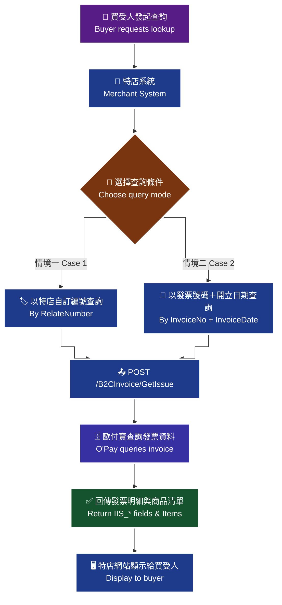

> ♿ 配色遵循 [`docs/accessibility.md`](../docs/accessibility.md)：WCAG AAA 對比 ≥7:1、Okabe-Ito 色盲安全色盤、16px 字體、直角連線、圖示＋文字雙編碼。

### 傳入參數（外層）

| 參數 | 參數名稱 | 型態 | 必填 | 說明 |
| --- | --- | --- | --- | --- |
| `PlatformID` | 特約合作平台商代號 | String(10) | — | 1. 提供特約合作平台商向歐付寶申請開通後使用，一般廠商介接請放空值。<br>2. 平台商使用時，MerchantID(特店編號)欄位僅限帶入已綁定子廠商的特店編號，以免造成失敗。 |
| `MerchantID` | 特店編號 | String(10) | ✅ | 1. 測試環境合作特店編號 2. 正式環境金鑰取得 |
| `RqHeader` | 傳入資料 | — | — | — |
| `RqHeader.Timestamp` | 傳入時間 | Number | ✅ | 歐付寶會利用此參數將當下的時間轉為 Unix TimeStamp 來驗證此次介接的時間區間。注意事項：<br>1. 驗證時間區間暫訂為 10 分鐘內有效，若超過此驗證時間則此次訂單將無法建立，參考資料：http://www.epochconverter.com/。<br>2. 合作特店須進行主機「時間校正」，避免主機產生時差，延伸 API 無法正常運作。 |
| `Data` | 加密資料 | String | ✅ | 資料內容，此為加密過 JSON 格式的資料。加密方法說明 |

外層範例：

```json
{
    "MerchantID": 2000132,
    "RqHeader": {
        "Timestamp": 1525168923
    },
    "Data": "…"
}
```

### 傳入 Data 參數（加密前的 JSON）

#### 情境一：以特店自訂編號 [RelateNumber] 做查詢

| 參數 | 參數名稱 | 型態 | 必填 | 說明 |
| --- | --- | --- | --- | --- |
| `MerchantID` | 特店編號 | String(10) | ✅ | — |
| `RelateNumber` | 特店自訂編號 | String(30) | ✅ | 需為唯一值不可重複使用。注意事項：請勿使用特殊符號 |

#### 情境二：以發票號碼 [InvoiceNo] 與發票開立日期 [InvoiceDate] 做查詢

| 參數 | 參數名稱 | 型態 | 必填 | 說明 |
| --- | --- | --- | --- | --- |
| `MerchantID` | 特店編號 | String(10) | ✅ | — |
| `InvoiceNo` | 發票號碼 | String(10) | ✅ | — |
| `InvoiceDate` | 發票開立日期 | String(10) | ✅ | 格式為「yyyy-MM-dd」或「yyyy/MM/dd」 |

### 傳入 Data 範例

情境一範例（原文逐字，含尾端逗號）：

```json
{
    "MerchantID": 2000132,
    "RelateNumber": "20181028000000020",
}
```

情境二範例：

```json
{
    "MerchantID": "2000132",
    "InvoiceNo": "AA123456",
    "InvoiceDate": "2018-10-28"
}
```

### 回傳參數（外層）

| 參數 | 參數名稱 | 型態 | 說明 |
| --- | --- | --- | --- |
| `PlatformID` | 特約合作平台商代號 | String(10) | — |
| `MerchantID` | 廠商編號 | String(10) | — |
| `RpHeader` | 回傳資料 | — | — |
| `RpHeader.Timestamp` | 回傳時間 | Number | — |
| `TransCode` | 回傳代碼 | Int | 1 代表傳輸資料(MerchantID, RqHeader, Data)接收成功，其餘均為失敗 |
| `TransMsg` | 回傳訊息 | String(200) | 回傳訊息 |
| `Data` | 加密資料 | String | 資料內容，此為加密過 JSON 格式的資料。加密方法說明 |

外層回傳範例：

```json
{
    "MerchantID": "2000132",
    "RpHeader": {
        "Timestamp": 1525169058
    },
    "TransCode": 1,
    "TransMsg": "",
    "Data": "…"
}
```

### 回傳 Data 參數

| 參數 | 參數名稱 | 型態 | 說明 |
| --- | --- | --- | --- |
| `RtnCode` | 回應代碼 | Int | 1 為成功，其餘為失敗。 |
| `RtnMsg` | 回應訊息 | String(200) | — |
| `IIS_Mer_ID` | 特店編號 | String(10) | — |
| `IIS_Number` | 發票號碼 | String(10) | — |
| `IIS_Relate_Number` | 特店自訂編號 | String(30) | 長度固定為 30 碼 |
| `IIS_Customer_ID` | 客戶編號 | String(20) | — |
| `IIS_Identifier` | 買方統編 | String(8) | `0000000000` 代表沒有統編 |
| `IIS_Customer_Name` | 客戶名稱 | String(60) | — |
| `IIS_Customer_Addr` | 客戶地址 | String(100) | — |
| `IIS_Customer_Phone` | 客戶電話 | String(20) | — |
| `IIS_Customer_Email` | 客戶電子信箱 | String(80) | — |
| `IIS_Clearance_Mark` | 通關方式 | String(1) | `1`：非經海關出口<br>`2`：經海關出口 |
| `IIS_Type` | 發票種類 | String(2) | `07`：一般稅額計算<br>`08`：特種稅額 |
| `IIS_Category` | 發票類別 | String(10) | `B2B`：表示開立發票時有含統編<br>`B2C`：表示開立發票時沒有含統編 |
| `IIS_Tax_Type` | 課稅別 | String(1) | `1`：應稅<br>`2`：零稅率<br>`3`：免稅<br>`4`：應稅(特種稅率)<br>`9`：若為混合應稅與免稅或零稅率 |
| `SpecialTaxType` | 特種稅額類別 | Int | 當課稅類別 [TaxType] 為 1/2/9 時，系統將會自動帶入數字【0】；當課稅類別 [TaxType] 為 3 時，則該參數必填，請填入數字【8】；當課稅類別 [TaxType] 為 4 時，則該參數必填，可填入數字【1-8】，並分別代表以下類別與稅率：<br>`1`：代表酒家及有陪侍服務之茶室、咖啡廳、酒吧之營業稅稅率，稅率為 25%<br>`2`：代表夜總會、有娛樂節目之餐飲店之營業稅稅率，稅率為 15%<br>`3`：代表銀行業、保險業、信託投資業、證券業、期貨業、票券業及典當業之專屬本業收入(不含銀行業、保險業經營銀行、保險本業收入)之營業稅稅率，稅率為 2%<br>`4`：代表保險業之再保費收入之營業稅稅率，稅率為 1%<br>`5`：代表銀行業、保險業、信託投資業、證券業、期貨業、票券業及典當業之非專屬本業收入之營業稅稅率，稅率為 5%<br>`6`：代表銀行業、保險業經營銀行、保險本業收入之營業稅稅率(適用於民國 103 年 07 月以後銷售額)，稅率為 5%<br>`7`：代表銀行業、保險業經營銀行、保險本業收入之營業稅稅率(適用於民國 103 年 06 月以前銷售額)，稅率為 5%<br>`8`：代表空白為免稅或非銷項特種稅額之資料 |
| `IIS_Tax_Rate` | 稅率 | Number | 小數點 3 位 |
| `IIS_Tax_Amount` | 稅金 | Int | 當發票有統編時，才會回傳稅金；當發票沒有統編時，稅金包含在發票金額內，不拆算稅金，故回傳值為 0 |
| `IIS_Sales_Amount` | 發票金額 | Int | — |
| `IIS_Check_Number` | 發票檢查碼 | String(4) | — |
| `IIS_Carrier_Type` | 載具類別 | String(1) | `1`：為歐付寶電子發票載具<br>`2`：為消費者自然人憑證<br>`3`：為消費者手機條碼<br>`4`：悠遊卡<br>`5`：icash<br>`6`：一卡通<br>`7`：金融卡<br>`8`：信用卡<br>※無載具，為空值。 |
| `IIS_Carrier_Num` | 載具編號 | String(64) | 若無載具為空值；歐付寶電子發票載具時，為客戶電子信箱或客戶手機號碼擇一(以客戶電子信箱優先)(RelateNumber)；消費者使用載具為自然人憑證，格式應為 2 碼大寫英文字母加上 14 碼數字(長度共 16 碼)；消費者使用載具為手機條碼時，目前總長度共為 8 碼，格式應為第 1 碼「/」加上由 7 碼數字及大寫英文字母及 +- 符號所組成。5. 當 IIS_Carrier_Type=4~8，由於實體載具的隱碼具有機密性，因此 IIS_Carrier_Num (載具編號)將回傳實體載具的「顯碼 id」，不會回傳實體載具的「隱碼 id」。 |
| `IIS_Love_Code` | 捐款單位捐贈碼 | String(7) | 財政部 - 查詢受捐贈機關或團體捐贈碼 https://www.einvoice.nat.gov.tw/APMEMBERVAN/XcaOrgPreserveCodeQuery/XcaOrgPreserveCodeQuery |
| `IIS_IP` | 發票開立 IP | String(20) | — |
| `IIS_Create_Date` | 發票開立時間 | String(20) | 格式為「yyyy-MM-dd HH:mm:ss」 |
| `IIS_Issue_Status` | 發票開立狀態 | String(1) | `1`：發票開立<br>`0`：發票註銷 |
| `IIS_Invalid_Status` | 發票作廢狀態 | String(1) | `1`：已作廢時<br>`0`：未作廢 |
| `IIS_Upload_Status` | 發票上傳狀態 | String(1) | `1`：已上傳<br>`0`：未上傳 |
| `IIS_Upload_Date` | 發票上傳時間 | String(20) | 格式為「yyyy-MM-dd HH:mm:ss」 |
| `IIS_Turnkey_Status` | 發票上傳後接收狀態 | String(1) | `C`：成功<br>`E`：失敗<br>`G`：處理中(待財政部回覆狀態)<br>`P`：處理中(上傳財政部中) |
| `IIS_Remain_Allowance_Amt` | 折讓剩餘金額 | Int | — |
| `IIS_Print_Flag` | 列印旗標 | String(1) | `1`：列印<br>`0`：不列印 |
| `IIS_Award_Flag` | 中獎期標 | String(1) | 空值：未對獎、不可對獎（如：捐贈之發票）<br>`0`：未中獎<br>`1`：已中獎<br>`X`：有統編之發票 |
| `IIS_Award_Type` | 中獎種類 | String(2) | `12`：雲端發票獎 800 元<br>`11`：雲端發票獎 500 元<br>`10`：雲端發票獎 100 萬元<br>`9`：雲端發票獎 2000 元<br>`8`：特別獎 一千萬<br>`7`：特獎 二百萬元<br>`1`：頭獎 二十萬元<br>`2`：二獎 四萬元<br>`3`：三獎 一萬元<br>`4`：四獎 四千元<br>`5`：五獎 一千元<br>`6`：六獎 二百元<br>`0`：未中獎 |
| `Items` | 商品 | — | — |
| `Items[].ItemSeq` | 商品序號 | Int | — |
| `Items[].ItemName` | 商品名稱 | String(100) | — |
| `Items[].ItemCount` | 商品數量 | Number | — |
| `Items[].ItemWord` | 商品單位 | String(6) | — |
| `Items[].ItemPrice` | 商品單價 | Number | 此為含稅單價金額 |
| `Items[].ItemTaxType` | 商品課稅別 | String(1) | `1`：應稅<br>`2`：零稅率<br>`3`：免稅<br>注意事項：預設為空字串，當課稅類別 [TaxType] = 9 時，此欄位不可為空。課稅類別為混合稅率時，需含二筆或以上的商品課稅別 [ItemTaxType]，且至少需有一筆商品課稅別為應稅及至少需有一筆商品課稅別為免稅或零稅率，即混稅發票只能 1. 應稅+免稅 2. 應稅+零稅率，免稅和零稅率發票不能同時開立。 |
| `Items[].ItemAmount` | 商品合計 | Number | 此為含稅小計金額 |
| `Items[].ItemRemark` | 商品備註說明 | String(40) | — |
| `IIS_Random_Number` | 隨機碼 | String(4) | 四碼的隨機數字(2014-01-01 起) |
| `InvoiceRemark` | 發票備註 | String(200) | — |
| `PosBarCode` | 顯示電子發票 BARCODE 用 | String(Max) | 用於顯示電子發票 BARCODE 用。(此回傳參數僅供 POS 廠商專用)。若 POS 廠商要自行開發發票版型，請與歐付寶提出申請方可使用。 |
| `QRCode_Left` | 顯示電子發票 QRCODE 左邊用 | String(Max) | 用於顯示電子發票 QRCODE 左邊用的，必須先在歐付寶設定密碼種子才會協助壓碼回傳。(此回傳參數僅供 POS 廠商專用)。若 POS 廠商要自行開發發票版型，請與歐付寶提出申請方可使用。 |
| `QRCode_Right` | 顯示電子發票 QRCODE 右邊用 | String(Max) | 用於顯示電子發票 QRCODE 右邊用的，必須先在歐付寶設定密碼種子才會協助壓碼回傳。(此回傳參數僅供 POS 廠商專用)。若 POS 廠商要自行開發發票版型，請與歐付寶提出申請方可使用。注意事項：為避免 QR Code 過於複雜無法辨識，QR Code 僅顯示前 2 個品項，完整品項請以上傳財政部內容為主 |
| `ZeroTaxRateReason` | 零稅率原因 | String(2) | `71`：第一款 外銷貨物<br>`72`：第二款 與外銷有關之勞務，或在國內提供而在國外使用之勞務<br>`73`：第三款 依法設立之免稅商店銷售與過境或出境旅客之貨物<br>`74`：第四款 銷售與保稅區營業人供營運之貨物或勞務<br>`75`：第五款 國際間之運輸。但外國運輸事業在中華民國境內經營國際運輸業務者，應以各該國對中華民國國際運輸事業予以相等待遇或免徵類似稅捐者為限<br>`76`：第六款 國際運輸用之船舶、航空器及遠洋漁船<br>`77`：第七款 銷售與國際運輸用之船舶、航空器及遠洋漁船所使用之貨物或修繕勞務<br>`78`：第八款 保稅區營業人銷售與課稅區營業人未輸往課稅區而直接出口之貨物<br>`79`：第九款 保稅區營業人銷售與課稅區營業人存入自由港區事業或海關管理之保稅倉庫、物流中心以供外銷之貨物 |

### 回傳 Data 範例

```json
{
    "IIS_Mer_ID": "2000132",
    "IIS_Number": "UV11100012",
    "IIS_Relate_Number": "20181028000000020",
    "IIS_Customer_ID": "",
    "IIS_Identifier": "0000000000",
    "IIS_Customer_Name": "歐付寶股份有限公司",
    "IIS_Customer_Addr": "106台北市南港區發票街1號1樓",
    "IIS_Customer_Phone": "",
    "IIS_Customer_Email": "test@opay.tw",
    "IIS_Clearance_Mark": "",
    "IIS_Type": "07",
    "IIS_Category": "B2C",
    "IIS_Tax_Type": "1",
    "IIS_Tax_Rate": 0.050,
    "IIS_Tax_Amount": 0,
    "IIS_Sales_Amount": 100,
    "IIS_Check_Number": "P",
    "IIS_Carrier_Type": "",
    "IIS_Carrier_Num": "",
    "IIS_Love_Code": "0",
    "IIS_IP": "0",
    "IIS_Create_Date": "2019-09-17 17:17:31",
    "IIS_Issue_Status": "1",
    "IIS_Invalid_Status": "0",
    "IIS_Upload_Status": "0",
    "IIS_Upload_Date": "",
    "IIS_Turnkey_Status": "",
    "IIS_Remain_Allowance_Amt": 0,
    "IIS_Print_Flag": "1",
    "IIS_Award_Flag": "",
    "IIS_Award_Type": "",
    "IIS_Random_Number": "6866",
    "IIS_Comment": "發票備註",
    "QRCode_Left": "UV111000121080917686600000000000000640000000011456006Sxys2hDhHuVVGnbc7XhCOg==:**********:2:3:1:item01:1:50:",
    "QRCode_Right": "**item02:1:20",
    "PosBarCode": "10810UV111000126866",
    "Items": [
        {
            "ItemSeq": 1,
            "ItemName": "item01",
            "ItemCount": 1,
            "ItemWord": "件",
            "ItemPrice": 50,
            "ItemTaxType": "1",
            "ItemAmount": 50,
            "ItemRemark": "item01_desc"
        },
        {
            "ItemSeq": 2,
            "ItemName": "item02",
            "ItemCount": 1,
            "ItemWord": "個",
            "ItemPrice": 20,
            "ItemTaxType": "1",
            "ItemAmount": 20,
            "ItemRemark": "item02_desc"
        },
        {
            "ItemSeq": 3,
            "ItemName": "item03",
            "ItemCount": 3,
            "ItemWord": "粒",
            "ItemPrice": 10,
            "ItemTaxType": "1",
            "ItemAmount": 30,
            "ItemRemark": "item03_desc"
        }
    ],
    "RtnCode": 1,
    "RtnMsg": "查詢成功"
}
```

> ⚠️ 原文回傳範例使用 `IIS_Comment` 承載發票備註，但回傳參數表列的欄位名稱為 `InvoiceRemark`；且範例未出現 `ZeroTaxRateReason`。原文未明確說明，介接前請向歐付寶確認。

**電子發票 QRCODE 示意圖說明**：原文此處附有一張電子發票證明聯的 QRCODE 版面示意圖（標示 `QRCode_Left`、`QRCode_Right`、`PosBarCode` 在發票證明聯上的相對位置），非流程圖，故以本行文字說明取代。

### 注意事項

- 查詢方式擇一：情境一以 `RelateNumber` 查詢；情境二以 `InvoiceNo` + `InvoiceDate` 查詢。
- `RelateNumber` 需為唯一值不可重複使用，請勿使用特殊符號。
- `IIS_Identifier` 回傳 `0000000000` 代表沒有統編。
- `IIS_Tax_Amount`：當發票有統編時才會回傳稅金；沒有統編時稅金包含在發票金額內，不拆算稅金，故回傳值為 0。
- 當 `IIS_Carrier_Type`=4~8，由於實體載具的隱碼具有機密性，`IIS_Carrier_Num` 將回傳實體載具的「顯碼 id」，不會回傳「隱碼 id」。
- `PosBarCode`、`QRCode_Left`、`QRCode_Right` 僅供 POS 廠商專用；`QRCode_Left`／`QRCode_Right` 必須先在歐付寶設定密碼種子才會協助壓碼回傳；若 POS 廠商要自行開發發票版型，請與歐付寶提出申請方可使用。
- 為避免 QR Code 過於複雜無法辨識，QR Code 僅顯示前 2 個品項，完整品項請以上傳財政部內容為主。
- `Items[].ItemTaxType` 預設為空字串；當課稅類別 [TaxType] = 9 時此欄位不可為空，混稅發票只能「應稅+免稅」或「應稅+零稅率」，免稅和零稅率發票不能同時開立。
- `RqHeader.Timestamp` 驗證時間區間暫訂為 10 分鐘內有效，若超過此驗證時間則此次訂單將無法建立（參考 http://www.epochconverter.com/ ）。
- 合作特店須進行主機「時間校正」，避免主機產生時差，延伸 API 無法正常運作。
- 平台商使用時，`MerchantID` 欄位僅限帶入已綁定子廠商的特店編號，以免造成失敗；一般廠商介接 `PlatformID` 請放空值。

## 15. 查詢折讓明細 — `GetAllowanceList`

- **來源**：i100 §14
- **用途**：可使用此 API 查詢已開立折讓之發票資訊，但不包含消費者尚未同意之線上折讓單。
- **HTTP Method**：POST（`Content-Type: application/json`）
- **測試環境**：`https://einvoice-stage.opay.tw/B2CInvoice/GetAllowanceList`
- **正式環境**：`https://einvoice.opay.tw/B2CInvoice/GetAllowanceList`

### 情境流程圖

> 🧭 **純文字重述（螢幕閱讀器友善）**：特店系統先把查詢條件（特店編號、查詢方式、折讓編號或發票號碼＋日期）組成 JSON，加密後放入 `Data`；以 POST 呼叫歐付寶 `GetAllowanceList`；歐付寶查詢折讓資料後，回傳加密的 `Data`；特店系統解密後即可取得折讓明細列表 `AllowanceInfo`。


> ♿ 配色遵循 [`docs/accessibility.md`](../docs/accessibility.md)：WCAG AAA 對比 ≥7:1、Okabe-Ito 色盲安全色盤、16px 字體、直角連線、圖示＋文字雙編碼。

> ⚠️ 原文此處僅擷取到圖說文字「查詢折讓明細情境流程圖」，圖內細節未能自官方文件的文字內容取得；上圖為依 API 語意重繪，實際流程請以官方文件圖片為準。

### 傳入參數（外層）

| 參數 | 參數名稱 | 型態 | 必填 | 說明 |
| --- | --- | --- | --- | --- |
| PlatformID | 特約合作平台商代號 | String(10) | — | 1. 提供特約合作平台商向歐付寶申請開通後使用，一般廠商介接請放空值。<br>2. 平台商使用時，MerchantID(特店編號)欄位僅限帶入已綁定子廠商的特店編號，以免造成失敗。 |
| MerchantID | 特店編號 | String(10) | ✅ | 1. 測試環境合作特店編號 2. 正式環境金鑰取得 |
| RqHeader | 傳入資料 | （物件） | — | （原文未填說明） |
| RqHeader.Timestamp | 傳入時間 | Number | ✅ | 歐付寶會利用此參數將當下的時間轉為 Unix TimeStamp 來驗證此次介接的時間區間。注意事項：<br>1. 驗證時間區間暫訂為10分鐘內有效，若超過此驗證時間則此次訂單將無法建立，參考資料：http://www.epochconverter.com/。<br>2. 合作特店須進行主機「時間校正」，避免主機產生時差，延伸 API 無法正常運作。 |
| Data | 加密資料 | String | ✅ | 資料內容，此為加密過 JSON 格式的資料。加密方法說明 |

**外層範例**：

```json
{
    "MerchantID": 2000132,
    "RqHeader": {
        "Timestamp": 1525168923
    },
    "Data": "…"
}
```

### 傳入 Data 參數（加密前的 JSON）

| 參數 | 參數名稱 | 型態 | 必填 | 說明 |
| --- | --- | --- | --- | --- |
| MerchantID | 特店編號 | String(10) | ✅ | （原文未填說明） |
| SearchType | 查詢方式 | String(1) | ✅ | 0: 折讓編號 查詢<br>1: 發票號碼+發票開立日期 查詢<br>2: 發票號碼+發票折讓日期 查詢 |
| AllowanceNo | 折讓編號 | String(16) | 條件 | 當查詢方式[SearchType]=0時, 此參數必填；其他值時, 此參數無效 |
| InvoiceNo | 發票號碼 | String(10) | 條件 | 當查詢方式[SearchType]=1,2時, 此參數必填；其他值時, 此參數無效 |
| Date | 日期 | String(10) | 條件 | 1.當查詢方式[SearchType]=1時, 請傳入發票開立日期 2.當查詢方式[SearchType]=2時, 請傳入發票折讓日期 3.格式為「yyyy-MM-dd」或「yyyy/MM/dd」 |

### 傳入 Data 範例

```json
{
    "MerchantID": 2000132,
    "SearchType": "0",
    "AllowanceNo": "2019091719477262"
}
```

### 回傳參數（外層）

| 參數 | 參數名稱 | 型態 | 說明 |
| --- | --- | --- | --- |
| PlatformID | 特約合作平台商代號 | String(10) | （原文未填說明） |
| MerchantID | 廠商編號 | String(10) | （原文未填說明） |
| RpHeader | 回傳資料 | （物件） | （原文未填說明） |
| RpHeader.Timestamp | 回傳時間 | Number | （原文未填說明） |
| TransCode | 回傳代碼 | Int | 1代表傳輸資料(MerchantID, RqHeader, Data)接收成功，其餘均為失敗 |
| TransMsg | 回傳訊息 | String(200) | 回傳訊息 |
| Data | 加密資料 | String | 資料內容，此為加密過 JSON 格式的資料。加密方法說明 |

**外層範例**：

```json
{
    "MerchantID": 2000132,
    "RpHeader": {
        "Timestamp": 1525169058
    },
    "TransCode": 1,
    "TransMsg": "",
    "Data": "…"
}
```

### 回傳 Data 參數

| 參數 | 參數名稱 | 型態 | 說明 |
| --- | --- | --- | --- |
| RtnCode | 回應代碼 | Int | 1為成功，其餘為失敗。 |
| RtnMsg | 回應訊息 | String(200) | （原文未填說明） |
| AllowanceInfo | 折讓資訊列表 | Array | （原文未填說明） |
| AllowanceInfo[].IA_Allow_No | 折讓單號 | String(16) | 長度固定為16碼 |
| AllowanceInfo[].IA_Check_Send_Mail | 折讓通知 | String(1) | S：簡訊 E：電子郵件 A：皆通知時 N：皆不通知 |
| AllowanceInfo[].IA_Date | 折讓時間 | String(20) | 格式為「yyyy-MM-dd HH:mm:ss」 |
| AllowanceInfo[].Items | 商品 | （陣列） | （原文未填說明） |
| AllowanceInfo[].Items[].ItemSeq | 商品序號 | Int | （原文未填說明） |
| AllowanceInfo[].Items[].ItemName | 商品名稱 | String(100) | （原文未填說明） |
| AllowanceInfo[].Items[].ItemCount | 商品數量 | Number | （原文未填說明） |
| AllowanceInfo[].Items[].ItemWord | 商品單位 | String(6) | （原文未填說明） |
| AllowanceInfo[].Items[].ItemPrice | 商品單價 | Number | （原文未填說明） |
| AllowanceInfo[].Items[].ItemRateAmt | 商品營業稅額 | Number | （原文未填說明） |
| AllowanceInfo[].Items[].ItemTaxType | 商品課稅別 | String(1) | 1：應稅 2：零稅率 3：免稅 注意事項： 預設為空字串，當課稅類別[TaxType] = 9時，此欄位不可為空。 課稅類別為混合稅率時，需含二筆或以上的商品課稅別[ItemTaxType]，且至少需有一筆商品課稅別為應稅及至少需有一筆商品課稅別為免稅或零稅率，即混稅發票只能 1.應稅+免稅 2.應稅+零稅率，免稅和零稅率發票不能同時開立。 |
| AllowanceInfo[].Items[].ItemAmount | 商品合計 | Number | 此為含稅小計金額 |
| AllowanceInfo[].IA_IP | 折讓IP | String(20) | （原文未填說明） |
| AllowanceInfo[].IA_Identifier | 買受人統編 | String(10) | 0000000000代表沒有統編 |
| AllowanceInfo[].IA_Invalid_Status | 折讓作廢狀態 | String(1) | 1：折讓單已作廢 0：折讓單未作廢 |
| AllowanceInfo[].IA_Invoice_Issue_Date | 發票開立時間 | String(20) | 格式為「yyyy-MM-dd HH:mm:ss」 |
| AllowanceInfo[].IA_Invoice_No | 發票號碼 | String(10) | 長度固定為10碼 |
| AllowanceInfo[].IA_Mer_ID | 特店代號 | String(10) | （原文未填說明） |
| AllowanceInfo[].IA_Send_Mail | 通知的MAIL | String(100) | 送出通知時，所送的 Email |
| AllowanceInfo[].IA_Send_Phone | 通知的手機號碼 | String(100) | 送出通知時，所送的手機號碼 |
| AllowanceInfo[].IA_Tax_Amount | 營業稅額合計 | Int | （原文未填說明） |
| AllowanceInfo[].IA_Tax_Type | 課稅別 | String(1) | 1：應稅 2：零稅率 3：免稅 4：應稅(特種稅率) |
| AllowanceInfo[].IA_Total_Amount | 金額合計(不含稅之進貨額) | Int | （原文未填說明） |
| AllowanceInfo[].IA_Total_Tax_Amount | 金額合計(含稅) | Int | （原文未填說明） |
| AllowanceInfo[].IA_Upload_Date | 上傳時間 | String(20) | 格式為「yyyy-MM-dd HH:mm:ss」 |
| AllowanceInfo[].IA_Upload_Status | 折讓上傳狀態 | String(1) | 1：已上傳 0：未上傳 |
| AllowanceInfo[].IIS_Customer_Name | 買受人姓名 | String(60) | （原文未填說明） |

### 回傳 Data 範例

```json
{
    "RtnCode": 1,
    "RtnMsg": "成功",
    "AllowanceInfo": [
        {…},
        {…}
    ]
}
```

`AllowanceInfo` 單一元素範例：

```json
{
    "IA_Allow_No": "2019091719477262",
    "IA_Check_Send_Mail": "E",
    "IA_Date": "2019-09-17 19:47:19",
    "IA_IP": "0",
    "IA_Identifier": "0000000000",
    "IA_Invalid_Status": "1",
    "IA_Invoice_Issue_Date": "2019-09-17 19:47:05",
    "IA_Invoice_No": "UV11100016",
    "IA_Mer_ID": "2000132",
    "IA_Send_Mail": "test@opay.tw",
    "IA_Send_Phone": "0912345678",
    "IA_Tax_Amount": 2,
    "IA_Tax_Type": "1",
    "IA_Total_Amount": 48,
    "IA_Total_Tax_Amount": 50,
    "IA_Upload_Date": "",
    "IA_Upload_Status": "0",
    "IIS_Customer_Name": "歐付寶股份有限公司",
    "Items": [
        {
            "ItemSeq": 1,
            "ItemName": "item01",
            "ItemCount": 1,
            "ItemWord": "件",
            "ItemPrice": 50,
            "ItemTaxType": "1",
            "ItemRateAmt": 2,
            "ItemAmount": 50
        }
    ]
}
```

### 注意事項

- 查詢結果**不包含消費者尚未同意之線上折讓單**。
- `RqHeader.Timestamp`：驗證時間區間暫訂為 10 分鐘內有效，若超過此驗證時間則此次訂單將無法建立（參考資料：http://www.epochconverter.com/ ）。
- `RqHeader.Timestamp`：合作特店須進行主機「時間校正」，避免主機產生時差，延伸 API 無法正常運作。
- `PlatformID`：提供特約合作平台商向歐付寶申請開通後使用，一般廠商介接請放空值；平台商使用時，`MerchantID` 欄位僅限帶入已綁定子廠商的特店編號，以免造成失敗。
- `SearchType`=0 時 `AllowanceNo` 必填、其他值無效；`SearchType`=1 或 2 時 `InvoiceNo` 必填、其他值無效。
- `Date`：`SearchType`=1 傳發票開立日期、`SearchType`=2 傳發票折讓日期，格式為「yyyy-MM-dd」或「yyyy/MM/dd」。
- `ItemTaxType` 預設為空字串；當課稅類別 `TaxType` = 9 時，此欄位不可為空。課稅類別為混合稅率時，需含二筆或以上的 `ItemTaxType`，且至少需有一筆為應稅、至少需有一筆為免稅或零稅率，即混稅發票只能 1. 應稅+免稅 2. 應稅+零稅率；免稅和零稅率發票不能同時開立。
- `IA_Identifier`（買受人統編）為 `0000000000` 代表沒有統編。

---

## 16. 查詢作廢發票明細 — `GetInvalid`

- **來源**：i100 §15
- **用途**：特店系統可使用此 API 查詢已作廢的發票資訊。
- **HTTP Method**：POST（`Content-Type: application/json`）
- **測試環境**：`https://einvoice-stage.opay.tw/B2CInvoice/GetInvalid`
- **正式環境**：`https://einvoice.opay.tw/B2CInvoice/GetInvalid`

### 情境流程圖

> 🧭 **純文字重述（螢幕閱讀器友善）**：特店系統以特店編號、特店自訂編號、發票號碼與發票開立日期組成 JSON，加密後放入 `Data`；以 POST 呼叫歐付寶 `GetInvalid`；歐付寶查詢該張發票的作廢紀錄後，回傳加密的 `Data`；特店系統解密後即可取得作廢時間、作廢原因與上傳狀態。


> ♿ 配色遵循 [`docs/accessibility.md`](../docs/accessibility.md)：WCAG AAA 對比 ≥7:1、Okabe-Ito 色盲安全色盤、16px 字體、直角連線、圖示＋文字雙編碼。

> ⚠️ 原文此處僅擷取到圖說文字「查詢作廢發票明細情境流程圖」，圖內細節未能自官方文件的文字內容取得；上圖為依 API 語意重繪，實際流程請以官方文件圖片為準。

### 傳入參數（外層）

| 參數 | 參數名稱 | 型態 | 必填 | 說明 |
| --- | --- | --- | --- | --- |
| PlatformID | 特約合作平台商代號 | String(10) | — | 1. 提供特約合作平台商向歐付寶申請開通後使用，一般廠商介接請放空值。<br>2. 平台商使用時，MerchantID(特店編號)欄位僅限帶入已綁定子廠商的特店編號，以免造成失敗。 |
| MerchantID | 特店編號 | String(10) | ✅ | 1. 測試環境合作特店編號 2. 正式環境金鑰取得 |
| RqHeader | 傳入資料 | （物件） | — | （原文未填說明） |
| RqHeader.Timestamp | 傳入時間 | Number | ✅ | 歐付寶會利用此參數將當下的時間轉為 Unix TimeStamp 來驗證此次介接的時間區間。注意事項：<br>1. 驗證時間區間暫訂為10分鐘內有效，若超過此驗證時間則此次訂單將無法建立，參考資料：http://www.epochconverter.com/。<br>2. 合作特店須進行主機「時間校正」，避免主機產生時差，延伸 API 無法正常運作。 |
| Data | 加密資料 | String | ✅ | 資料內容，此為加密過 JSON 格式的資料。加密方法說明 |

**外層範例**：

```json
{
    "MerchantID": 2000132,
    "RqHeader": {
        "Timestamp": 1525168923
    },
    "Data": "…"
}
```

### 傳入 Data 參數（加密前的 JSON）

| 參數 | 參數名稱 | 型態 | 必填 | 說明 |
| --- | --- | --- | --- | --- |
| MerchantID | 特店編號 | String(10) | ✅ | （原文未填說明） |
| RelateNumber | 特店自訂編號 | String(30) | ✅ | 需為唯一值不可重複使用。 注意事項： 請勿使用特殊符號 |
| InvoiceNo | 發票號碼 | String(10) | ✅ | （原文未填說明） |
| InvoiceDate | 發票開立日期 | String(10) | ✅ | 格式為「yyyy-MM-dd」或「yyyy/MM/dd」 |

### 傳入 Data 範例

```json
{
    "MerchantID": 2000132,
    "RelateNumber": "123456789",
    "InvoiceNo": "UV11100016",
    "InvoiceDate": "2018-10-28"
}
```

### 回傳參數（外層）

| 參數 | 參數名稱 | 型態 | 說明 |
| --- | --- | --- | --- |
| PlatformID | 特約合作平台商代號 | String(10) | （原文未填說明） |
| MerchantID | 廠商編號 | String(10) | （原文未填說明） |
| RpHeader | 回傳資料 | （物件） | （原文未填說明） |
| RpHeader.Timestamp | 回傳時間 | Number | （原文未填說明） |
| TransCode | 回傳代碼 | Int | 1代表傳輸資料(MerchantID, RqHeader, Data)接收成功，其餘均為失敗 |
| TransMsg | 回傳訊息 | String(200) | 回傳訊息 |
| Data | 加密資料 | String | 資料內容，此為加密過 JSON 格式的資料。加密方法說明 |

**外層範例**（逐字照抄自原文，含原文誤植的引號）：

```
{
    "MerchantID": 200013",
    "RpHeader": {
        "Timestamp": 1525169058
    },
    "TransCode": 1,
    "TransMsg": "",
    "Data": "…",
     "EncData": "…"
}
```

> ⚠️ 原文未明確說明，介接前請向歐付寶確認。原文外層範例出現 `EncData` 欄位，但「歐付寶Response回傳參數說明」表格並未列出此欄位；另 `"MerchantID": 200013"` 為原文誤植（缺少前引號）。

### 回傳 Data 參數

| 參數 | 參數名稱 | 型態 | 說明 |
| --- | --- | --- | --- |
| RtnCode | 回應代碼 | Int | 1為成功，其餘為失敗。 |
| RtnMsg | 回應訊息 | String(200) | （原文未填說明） |
| IIS_Mer_ID | 特店編號 | String(10) | （原文未填說明） |
| II_Invoice_No | 發票號碼 | String(10) | （原文未填說明） |
| II_Date | 作廢時間 | String(20) | 格式為「yyyy-MM-dd HH:mm:ss」 |
| II_Upload_Status | 上傳狀態 | String(1) | 1：已上傳 0：未上傳 |
| II_Upload_Date | 上傳時間 | String(20) | 格式為「yyyy-MM-dd HH:mm:ss」 |
| Reason | 作廢原因 | String(20) | （原文未填說明） |
| II_Seller_Identifier | 賣方統編 | String(10) | （原文未填說明） |
| II_Buyer_Identifier | 買方統編 | String(10) | 0000000000代表沒有統編 |

### 回傳 Data 範例

```json
{
    "IIS_Mer_ID": "2000132",
    "II_Invoice_No": "UV11100018",
    "II_Date": "2019-09-17 20:00:50",
    "II_Upload_Status": "0",
    "II_Upload_Date": "",
    "Reason": "Invalid_Reason",
    "II_Seller_Identifier": "11456006",
    "II_Buyer_Identifier": "0000000000",
    "RtnCode": 1,
    "RtnMsg": "查詢成功"
}
```

### 注意事項

- `RelateNumber`（特店自訂編號）需為唯一值不可重複使用，且**請勿使用特殊符號**。
- `RqHeader.Timestamp`：驗證時間區間暫訂為 10 分鐘內有效，若超過此驗證時間則此次訂單將無法建立（參考資料：http://www.epochconverter.com/ ）。
- `RqHeader.Timestamp`：合作特店須進行主機「時間校正」，避免主機產生時差，延伸 API 無法正常運作。
- `PlatformID`：提供特約合作平台商向歐付寶申請開通後使用，一般廠商介接請放空值；平台商使用時，`MerchantID` 欄位僅限帶入已綁定子廠商的特店編號，以免造成失敗。
- `II_Buyer_Identifier`（買方統編）為 `0000000000` 代表沒有統編。
- 原文回傳外層範例出現表格未列的 `EncData` 欄位。
  > ⚠️ 原文未明確說明，介接前請向歐付寶確認。

---

## 17. 查詢作廢折讓明細 — `GetAllowanceInvalid`

- **來源**：i100 §16
- **用途**：特店系統可使用此 API 查詢已作廢折讓明細資訊。
- **HTTP Method**：POST（`Content-Type: application/json`）
- **測試環境**：`https://einvoice-stage.opay.tw/B2CInvoice/GetAllowanceInvalid`
- **正式環境**：`https://einvoice.opay.tw/B2CInvoice/GetAllowanceInvalid`

### 情境流程圖

> 🧭 **純文字重述（螢幕閱讀器友善）**：特店系統以特店編號、發票號碼與折讓編號組成 JSON，加密後放入 `Data`；以 POST 呼叫歐付寶 `GetAllowanceInvalid`；歐付寶查詢該折讓單的作廢紀錄後，回傳加密的 `Data`；特店系統解密後即可取得作廢時間、作廢原因與上傳狀態。


> ♿ 配色遵循 [`docs/accessibility.md`](../docs/accessibility.md)：WCAG AAA 對比 ≥7:1、Okabe-Ito 色盲安全色盤、16px 字體、直角連線、圖示＋文字雙編碼。

> ⚠️ 原文此處僅擷取到圖說文字「查詢作廢折讓明細情境流程圖」，圖內細節未能自官方文件的文字內容取得；上圖為依 API 語意重繪，實際流程請以官方文件圖片為準。

### 傳入參數（外層）

| 參數 | 參數名稱 | 型態 | 必填 | 說明 |
| --- | --- | --- | --- | --- |
| PlatformID | 特約合作平台商代號 | String(10) | — | 1. 提供特約合作平台商向歐付寶申請開通後使用，一般廠商介接請放空值。<br>2. 平台商使用時，MerchantID(特店編號)欄位僅限帶入已綁定子廠商的特店編號，以免造成失敗。 |
| MerchantID | 特店編號 | String(10) | ✅ | 1. 測試環境合作特店編號 2. 正式環境金鑰取得 |
| RqHeader | 傳入資料 | （物件） | — | （原文未填說明） |
| RqHeader.Timestamp | 傳入時間 | Number | ✅ | 歐付寶會利用此參數將當下的時間轉為 Unix TimeStamp 來驗證此次介接的時間區間。注意事項：<br>1. 驗證時間區間暫訂為10分鐘內有效，若超過此驗證時間則此次訂單將無法建立，參考資料：http://www.epochconverter.com/。<br>2. 合作特店須進行主機「時間校正」，避免主機產生時差，延伸 API 無法正常運作。 |
| Data | 加密資料 | String | ✅ | 資料內容，此為加密過 JSON 格式的資料。加密方法說明 |

**外層範例**：

```json
{
    "MerchantID": 2000132,
    "RqHeader": {
        "Timestamp": 1525168923
    },
    "Data": "…"
}
```

### 傳入 Data 參數（加密前的 JSON）

| 參數 | 參數名稱 | 型態 | 必填 | 說明 |
| --- | --- | --- | --- | --- |
| MerchantID | 特店編號 | String(10) | ✅ | （原文未填說明） |
| InvoiceNo | 發票號碼 | String(10) | ✅ | （原文未填說明） |
| AllowanceNo | 折讓編號 | String(16) | ✅ | （原文未填說明） |

### 傳入 Data 範例

```json
{
    "MerchantID": 2000132,
    "InvoiceNo": "UV11100016",
    "AllowanceNo": "2019091719477262"
}
```

### 回傳參數（外層）

| 參數 | 參數名稱 | 型態 | 說明 |
| --- | --- | --- | --- |
| PlatformID | 特約合作平台商代號 | String(10) | （原文未填說明） |
| MerchantID | 廠商編號 | String(10) | （原文未填說明） |
| RpHeader | 回傳資料 | （物件） | （原文未填說明） |
| RpHeader.Timestamp | 回傳時間 | Number | （原文未填說明） |
| TransCode | 回傳代碼 | Int | 1代表傳輸資料(MerchantID, RqHeader, Data)接收成功，其餘均為失敗 |
| TransMsg | 回傳訊息 | String(200) | 回傳訊息 |
| Data | 加密資料 | String | 資料內容，此為加密過 JSON 格式的資料。加密方法說明 |

**外層範例**：

```json
{
    "MerchantID": 2000132,
    "RpHeader": {
        "Timestamp": 1525169058
    },
    "TransCode": 1,
    "TransMsg": "",
    "Data": "…"
}
```

### 回傳 Data 參數

| 參數 | 參數名稱 | 型態 | 說明 |
| --- | --- | --- | --- |
| RtnCode | 回應代碼 | Int | 1為成功，其餘為失敗。 |
| RtnMsg | 回應訊息 | String(200) | （原文未填說明） |
| AI_Allow_Date | 折讓單日期 | String(20) | 格式為「yyyy-MM-dd HH:mm:ss」 |
| AI_Allow_No | 折讓單號 | String(16) | （原文未填說明） |
| AI_Buyer_Identifier | 買方統編 | String(10) | 0000000000代表沒有統編 |
| AI_Date | 作廢時間 | String(20) | 格式為「yyyy-MM-dd HH:mm:ss」 |
| AI_Invoice_No | 發票號碼 | String(10) | （原文未填說明） |
| AI_Mer_ID | 特店代號 | String(10) | （原文未填說明） |
| Reason | 作廢原因 | String(20) | （原文未填說明） |
| AI_Seller_Identifier | 賣方統編 | String(10) | （原文未填說明） |
| AI_Upload_Date | 上傳時間 | String(20) | 格式為「yyyy-MM-dd HH:mm:ss」 |
| AI_Upload_Status | 上傳狀態 | String(1) | 1：已上傳 0：未上傳 |

### 回傳 Data 範例

```json
{
    "AI_Allow_Date": "2019-09-17 19:47:19",
    "AI_Allow_No": "2019091719477262",
    "AI_Buyer_Identifier": "0000000000",
    "AI_Date": "2019-09-17 19:52:58",
    "AI_Invoice_No": "UV11100016",
    "AI_Mer_ID": "2000132",
    "Reason": "Reson",
    "AI_Seller_Identifier": "11456006",
    "AI_Upload_Date": "",
    "AI_Upload_Status": "0",
    "RtnCode": 1,
    "RtnMsg": "查詢成功"
}
```

### 注意事項

- `RqHeader.Timestamp`：驗證時間區間暫訂為 10 分鐘內有效，若超過此驗證時間則此次訂單將無法建立（參考資料：http://www.epochconverter.com/ ）。
- `RqHeader.Timestamp`：合作特店須進行主機「時間校正」，避免主機產生時差，延伸 API 無法正常運作。
- `PlatformID`：提供特約合作平台商向歐付寶申請開通後使用，一般廠商介接請放空值；平台商使用時，`MerchantID` 欄位僅限帶入已綁定子廠商的特店編號，以免造成失敗。
- `AI_Buyer_Identifier`（買方統編）為 `0000000000` 代表沒有統編。
- 原文回傳 Data 範例中 `Reason` 值為 `"Reson"`（原文如此）。

---

## 18. 查詢字軌 — `GetInvoiceWordSetting`

- **來源**：i100 §17
- **用途**：特店系統可使用此 API 查詢字軌號碼以及字軌的使用情況。
- **HTTP Method**：POST（`Content-Type: application/json`）
- **測試環境**：`https://einvoice-stage.opay.tw/B2CInvoice/GetInvoiceWordSetting`
- **正式環境**：`https://einvoice.opay.tw/B2CInvoice/GetInvoiceWordSetting`

### 情境流程圖

> 🧭 **純文字重述（螢幕閱讀器友善）**：特店系統以特店編號、發票年度、發票期別、字軌使用狀態、發票類別等查詢條件組成 JSON，加密後放入 `Data`；以 POST 呼叫歐付寶 `GetInvoiceWordSetting`；歐付寶查詢字軌設定後，回傳加密的 `Data`；特店系統解密後即可取得字軌清單 `InvoiceInfo`，包含起訖號碼、目前已使用號碼與使用狀態。


> ♿ 配色遵循 [`docs/accessibility.md`](../docs/accessibility.md)：WCAG AAA 對比 ≥7:1、Okabe-Ito 色盲安全色盤、16px 字體、直角連線、圖示＋文字雙編碼。

> ⚠️ 原文此處僅擷取到圖說文字「查詢字軌情境流程圖」，圖內細節未能自官方文件的文字內容取得；上圖為依 API 語意重繪，實際流程請以官方文件圖片為準。

### 傳入參數（外層）

| 參數 | 參數名稱 | 型態 | 必填 | 說明 |
| --- | --- | --- | --- | --- |
| PlatformID | 特約合作平台商代號 | String(10) | — | 1. 提供特約合作平台商向歐付寶申請開通後使用，一般廠商介接請放空值。<br>2. 平台商使用時，MerchantID(特店編號)欄位僅限帶入已綁定子廠商的特店編號，以免造成失敗。 |
| MerchantID | 特店編號 | String(10) | ✅ | 1. 測試環境合作特店編號 2. 正式環境金鑰取得 |
| RqHeader | 傳入資料 | （物件） | — | （原文未填說明） |
| RqHeader.Timestamp | 傳入時間 | Number | ✅ | 歐付寶會利用此參數將當下的時間轉為 Unix TimeStamp 來驗證此次介接的時間區間。注意事項：<br>1. 驗證時間區間暫訂為10分鐘內有效，若超過此驗證時間則此次訂單將無法建立，參考資料：http://www.epochconverter.com/。<br>2. 合作特店須進行主機「時間校正」，避免主機產生時差，延伸 API 無法正常運作。 |
| Data | 加密資料 | String | ✅ | 資料內容，此為加密過 JSON 格式的資料。加密方法說明 |

**外層範例**：

```json
{
    "MerchantID": 2000132,
    "RqHeader": {
        "Timestamp": 1525168923
    },
    "Data": "…"
}
```

### 傳入 Data 參數（加密前的 JSON）

| 參數 | 參數名稱 | 型態 | 必填 | 說明 |
| --- | --- | --- | --- | --- |
| MerchantID | 特店編號 | String(10) | ✅ | （原文未填說明） |
| InvoiceYear | 發票年度 | String(3) | ✅ | 僅可查詢去年、當年與明年的發票年度，格式為民國年 ex:109 |
| InvoiceTerm | 發票期別 | Int | — | 0:全部(預設值) 1: 1-2月，2: 3-4月，3: 5-6月，4: 7-8月，5: 9-10月，6: 11-12月 |
| UseStatus | 字軌使用狀態 | Int | — | 0:全部(預設值) 1:未啟用，2:使用中，3:已停用，4:暫停中，5:待審核，6:審核不通過 |
| InvoiceCategory | 發票類別 | Int | ✅ | 1:B2C，請固定填寫為1，否則會查無資料 |
| InvType | 字軌類別 | String(2) | — | 07:一般稅額發票，08:特種稅額發票 |
| InvoiceHeader | 字軌名稱 | String(2) | — | （原文未填說明） |

### 傳入 Data 範例

```json
{
    "MerchantID": 2000132,
    "InvoiceTerm": 0,
    "InvoiceYear": "109",
    "UseStatus": 1,
    "InvoiceCategory": 1
}
```

### 回傳參數（外層）

| 參數 | 參數名稱 | 型態 | 說明 |
| --- | --- | --- | --- |
| PlatformID | 特約合作平台商代號 | String(10) | （原文未填說明） |
| MerchantID | 廠商編號 | String(10) | （原文未填說明） |
| RpHeader | 回傳資料 | （物件） | （原文未填說明） |
| RpHeader.Timestamp | 回傳時間 | Number | （原文未填說明） |
| TransCode | 回傳代碼 | Int | 1代表傳輸資料(MerchantID, RqHeader, Data)接收成功，其餘均為失敗 |
| TransMsg | 回傳訊息 | String(200) | 回傳訊息 |
| Data | 加密資料 | String | 資料內容，此為加密過 JSON 格式的資料。加密方法說明 |

**外層範例**：

```json
{
    "MerchantID": 2000132,
    "RpHeader": {
        "Timestamp": 1525169058
    },
    "TransCode": 1,
    "TransMsg": "",
    "Data": "…"
}
```

### 回傳 Data 參數

| 參數 | 參數名稱 | 型態 | 說明 |
| --- | --- | --- | --- |
| RtnCode | 回應代碼 | Int | 1為成功，其餘為失敗。 |
| RtnMsg | 回應訊息 | String(200) | （原文未填說明） |
| InvoiceInfo | 發票資訊 | Array | （原文未填說明） |
| InvoiceInfo[].TrackID | 字軌號碼ID | String(10) | （原文未填說明） |
| InvoiceInfo[].InvoiceYear | 發票年度 | String(3) | （原文未填說明） |
| InvoiceInfo[].InvoiceTerm | 發票期別 | Int | 1: 1-2月，2: 3-4月，3: 5-6月，4: 7-8月，5: 9-10月，6: 11-12月 |
| InvoiceInfo[].InvoiceCategory | 發票類別 | Int | 1:B2C |
| InvoiceInfo[].InvType | 字軌類別 | String(2) | 07:一般稅額發票，08:特種稅額發票 |
| InvoiceInfo[].InvoiceHeader | 字軌名稱 | String(2) | （原文未填說明） |
| InvoiceInfo[].InvoiceStart | 起始發票編號 | String(8) | （原文未填說明） |
| InvoiceInfo[].InvoiceEnd | 結束發票編號 | String(8) | （原文未填說明） |
| InvoiceInfo[].InvoiceNo | 目前已使用號碼 | String(8) | （原文未填說明） |
| InvoiceInfo[].UseStatus | 使用狀態 | Int | 1:未啟用，2:使用中，3:已停用，4:暫停中，5:待審核，6:審核不通過 |

### 回傳 Data 範例

原文範例逐字照抄（原文 JSON 語法有誤：`RtnMsg` 後缺逗號、`InvoiceInfo` 於表格中為 Array 但範例以物件形式書寫）：

```
{
  "RtnCode": 1,
    "RtnMsg": "查詢成功"
  "InvoiceInfo": {
        "TrackID": "1234567890",
        "InvoiceYear": "109",
        "InvoiceTerm": 1,
        "InvoiceCategory": 1,
        "InvType": "07",
        "InvoiceHeader": "AQ",
        "InvoiceStart": "10000000",
        "InvoiceEnd": "19999999",
        "InvoiceNo": "12345678",
        "UseStatus": 2
    },{
        "TrackID": "1234569870",
        "InvoiceYear": "109",
        "InvoiceTerm": 1,
        "InvoiceCategory": 1,
        "InvType": "07",
        "InvoiceHeader": "AQ",
        "InvoiceStart": "10000000",
        "InvoiceEnd": "19999999",
        "InvoiceNo": "12345678",
        "UseStatus": 2
    }
}
```

> ⚠️ 原文未明確說明，介接前請向歐付寶確認。原文範例的 JSON 語法有誤，`InvoiceInfo` 的實際序列化格式（Array 或 Object）請以歐付寶實測結果為準。

### 注意事項

- `InvoiceYear`（發票年度）僅可查詢**去年、當年與明年**的發票年度，格式為民國年（ex: 109）。
- `InvoiceCategory`（發票類別）請固定填寫為 `1`（B2C），否則會查無資料。
- 傳入 `InvoiceTerm` 與 `UseStatus` 皆有 `0:全部` 的預設值；回傳的 `InvoiceTerm` 與 `UseStatus` 則沒有 `0` 這個值。
- `InvType` 字軌類別：`07` 一般稅額發票、`08` 特種稅額發票。
- `RqHeader.Timestamp`：驗證時間區間暫訂為 10 分鐘內有效，若超過此驗證時間則此次訂單將無法建立（參考資料：http://www.epochconverter.com/ ）。
- `RqHeader.Timestamp`：合作特店須進行主機「時間校正」，避免主機產生時差，延伸 API 無法正常運作。
- `PlatformID`：提供特約合作平台商向歐付寶申請開通後使用，一般廠商介接請放空值；平台商使用時，`MerchantID` 欄位僅限帶入已綁定子廠商的特店編號，以免造成失敗。

---

## 19. 發送發票通知 — `InvoiceNotify`

> 原文章節標題為「發送發票通知(若不撰寫此 API，則可透過廠商後台功能處理)」。

- **來源**：i100 §18
- **用途**：特店系統可使用此 API 來發送電子發票通知。（若廠商後台 > 發票通知方式設定通知選項有開啟，除非有額外補送通知需求，否則不須再串接此 API，以免重複通知。）
- **HTTP Method**：POST（`Content-Type: application/json`）
- **測試環境**：`https://einvoice-stage.opay.tw/B2CInvoice/InvoiceNotify`
- **正式環境**：`https://einvoice.opay.tw/B2CInvoice/InvoiceNotify`

### 情境流程圖

> 🧭 **純文字重述（螢幕閱讀器友善）**：特店系統以特店編號、發票號碼（折讓通知另需折讓編號）、簡訊號碼或電子郵件、發送方式 `Notify`、發送內容類型 `InvoiceTag`、發送對象 `Notified` 組成 JSON，加密後放入 `Data`；以 POST 呼叫歐付寶 `InvoiceNotify`；歐付寶依 `Notify` 以簡訊或電子郵件發送通知給客戶或特店，並回傳加密的 `Data`；特店系統解密後可由 `RtnCode` 判斷是否發送成功。


> ♿ 配色遵循 [`docs/accessibility.md`](../docs/accessibility.md)：WCAG AAA 對比 ≥7:1、Okabe-Ito 色盲安全色盤、16px 字體、直角連線、圖示＋文字雙編碼。

> ⚠️ 原文此處僅擷取到圖說文字「發送發票通知情境流程圖」，圖內細節未能自官方文件的文字內容取得；上圖為依 API 語意重繪，實際流程請以官方文件圖片為準。

### 傳入參數（外層）

| 參數 | 參數名稱 | 型態 | 必填 | 說明 |
| --- | --- | --- | --- | --- |
| PlatformID | 特約合作平台商代號 | String(10) | — | 1. 提供特約合作平台商向歐付寶申請開通後使用，一般廠商介接請放空值。<br>2. 平台商使用時，MerchantID(特店編號)欄位僅限帶入已綁定子廠商的特店編號，以免造成失敗。 |
| MerchantID | 特店編號 | String(10) | ✅ | 1. 測試環境合作特店編號 2. 正式環境金鑰取得 |
| RqHeader | 傳入資料 | （物件） | — | （原文未填說明） |
| RqHeader.Timestamp | 傳入時間 | Number | ✅ | 歐付寶會利用此參數將當下的時間轉為 Unix TimeStamp 來驗證此次介接的時間區間。注意事項：<br>1. 驗證時間區間暫訂為10分鐘內有效，若超過此驗證時間則此次訂單將無法建立，參考資料：http://www.epochconverter.com/。<br>2. 合作特店須進行主機「時間校正」，避免主機產生時差，延伸 API 無法正常運作。 |
| Data | 加密資料 | String | ✅ | 資料內容，此為加密過 JSON 格式的資料。加密方法說明 |

**外層範例**：

```json
{
    "MerchantID": 2000132,
    "RqHeader": {
        "Timestamp": 1525168923
    },
    "Data": "…"
}
```

### 傳入 Data 參數（加密前的 JSON）

| 參數 | 參數名稱 | 型態 | 必填 | 說明 |
| --- | --- | --- | --- | --- |
| MerchantID | 特店編號 | String(10) | ✅ | （原文未填說明） |
| InvoiceNo | 發票號碼 | String(10) | ✅ | （原文未填說明） |
| AllowanceNo | 折讓編號 | String(16) | 條件 | 注意事項: 若發送內容類型[InvoiceTag]為 A(折讓開立)或 AI(折讓作廢)時為必填，否則會查無資料 |
| Phone | 發送簡訊號碼 | String(20) | 條件 | 此欄位可與客戶電子信箱只能擇一填寫，且如果[NotifyMail]未填，則此欄位必須有值。格式為數字 |
| NotifyMail | 發送電子郵件 | String(80) | 條件 | 此欄位可與客戶手機號碼只能擇一填寫，且如果[Phone]未填，則此欄位必須有值，且需為有效的 Email 格式<br>可帶入多組 Email，並以分號區隔 ex: aa@aa.aa;bb@bb.bb |
| Notify | 發送方式 | String(1) | ✅ | S:簡訊 E:電子郵件 A:皆通知時 |
| InvoiceTag | 發送內容類型 | String(2) | ✅ | I: 發票開立 II: 發票作廢 A: 折讓開立 AI: 折讓作廢 AW: 發票中獎 |
| Notified | 發送對象 | String(1) | ✅ | C: 發送通知給客戶 M: 發送通知給特店 A: 皆發送通知 注意事項: 若發送對象類型(Notified)為 A 時，請注意廠商後台設定是否接受通知 |

### 傳入 Data 範例

```json
{
    "MerchantID": 2000132,
    "InvoiceNo": "UV11100016",
    "AllowanceNo": "2019091719477262",
    "Phone": "0912345678",
    "NotifyMail": "test@opay.tw",
    "Notify": "E",
    "InvoiceTag": "I",
    "Notified": "A"
}
```

### 回傳參數（外層）

| 參數 | 參數名稱 | 型態 | 說明 |
| --- | --- | --- | --- |
| PlatformID | 特約合作平台商代號 | String(10) | （原文未填說明） |
| MerchantID | 廠商編號 | String(10) | （原文未填說明） |
| RpHeader | 回傳資料 | （物件） | （原文未填說明） |
| RpHeader.Timestamp | 回傳時間 | Number | （原文未填說明） |
| TransCode | 回傳代碼 | Int | 1代表傳輸資料(MerchantID, RqHeader, Data)接收成功，其餘均為失敗 |
| TransMsg | 回傳訊息 | String(200) | 回傳訊息 |
| Data | 加密資料 | String | 資料內容，此為加密過 JSON 格式的資料。加密方法說明 |

**外層範例**：

```json
{
    "MerchantID": 2000132,
    "RpHeader": {
        "Timestamp": 1525169058
    },
    "TransCode": 1,
    "TransMsg": "",
    "Data": "…"
}
```

### 回傳 Data 參數

| 參數 | 參數名稱 | 型態 | 說明 |
| --- | --- | --- | --- |
| RtnCode | 回應代碼 | Int | 1為成功，其餘為失敗。 |
| RtnMsg | 回應訊息 | String(200) | （原文未填說明） |
| MerchantID | 特店編號 | String(10) | （原文未填說明） |

### 回傳 Data 範例

```json
{
    "MerchantID": 2000132,
    "RtnMsg": "發送通知成功",
    "RtnCode": 1
}
```

### 注意事項

- ※注意事項 (1)：測試環境下歐付寶不會『主動』發送任何通知，需於廠商管理後臺使用『補發通知』，才會寄送通知信到指定信箱。
- ※注意事項 (2)：歐付寶系統會於奇數月份的 29 號核對中獎發票，廠商需先設定通知方式以便通知消費者。
- 若不撰寫此 API，則可透過廠商後台功能處理；若廠商後台 > 發票通知方式設定通知選項有開啟，除非有額外補送通知需求，否則不須再串接此 API，以免重複通知。
- `AllowanceNo`：若 `InvoiceTag` 為 `A`（折讓開立）或 `AI`（折讓作廢）時為必填，否則會查無資料。
- `Phone` 與 `NotifyMail` 只能擇一填寫；`NotifyMail` 未填時 `Phone` 必須有值，`Phone` 未填時 `NotifyMail` 必須有值。`Phone` 格式為數字；`NotifyMail` 需為有效的 Email 格式，可帶入多組 Email 並以分號區隔（ex: aa@aa.aa;bb@bb.bb）。
- `Notified` 為 `A`（皆發送通知）時，請注意廠商後台設定是否接受通知。
- `RqHeader.Timestamp`：驗證時間區間暫訂為 10 分鐘內有效，若超過此驗證時間則此次訂單將無法建立（參考資料：http://www.epochconverter.com/ ）。
- `RqHeader.Timestamp`：合作特店須進行主機「時間校正」，避免主機產生時差，延伸 API 無法正常運作。
- `PlatformID`：提供特約合作平台商向歐付寶申請開通後使用，一般廠商介接請放空值；平台商使用時，`MerchantID` 欄位僅限帶入已綁定子廠商的特店編號，以免造成失敗。

---

## 20. 發票列印 — `InvoicePrint`

- **來源**：i100 §19
- **用途**：特店可使用此 API 取得發票列印網址。
- **HTTP Method**：POST（`Content-Type: application/json`）
- **測試環境**：`https://einvoice-stage.opay.tw/B2CInvoice/InvoicePrint`
- **正式環境**：`https://einvoice.opay.tw/B2CInvoice/InvoicePrint`

### 情境流程圖

> 🧭 **純文字重述（螢幕閱讀器友善）**：特店系統以特店編號、發票號碼、發票開立日期與（選填的）列印格式 `PrintStyle` 組成 JSON，加密後放入 `Data`；以 POST 呼叫歐付寶 `InvoicePrint`；歐付寶產生發票列印頁面後，回傳加密的 `Data`；特店系統解密後取得 `InvoiceHtml` 發票列印網址，再導向或開啟該網址進行列印。


> ♿ 配色遵循 [`docs/accessibility.md`](../docs/accessibility.md)：WCAG AAA 對比 ≥7:1、Okabe-Ito 色盲安全色盤、16px 字體、直角連線、圖示＋文字雙編碼。

> ⚠️ 原文此處僅擷取到圖說文字「發票列印情境流程圖」，圖內細節未能自官方文件的文字內容取得；上圖為依 API 語意重繪，實際流程請以官方文件圖片為準。

### 傳入參數（外層）

| 參數 | 參數名稱 | 型態 | 必填 | 說明 |
| --- | --- | --- | --- | --- |
| PlatformID | 特約合作平台商代號 | String(10) | — | 1. 提供特約合作平台商向歐付寶申請開通後使用，一般廠商介接請放空值。<br>2. 平台商使用時，MerchantID(特店編號)欄位僅限帶入已綁定子廠商的特店編號，以免造成失敗。 |
| MerchantID | 特店編號 | String(10) | ✅ | 1. 測試環境合作特店編號 2. 正式環境金鑰取得 |
| RqHeader | 傳入資料 | （物件） | — | （原文未填說明） |
| RqHeader.Timestamp | 傳入時間 | Number | ✅ | 歐付寶會利用此參數將當下的時間轉為 Unix TimeStamp 來驗證此次介接的時間區間。注意事項：<br>1. 驗證時間區間暫訂為10分鐘內有效，若超過此驗證時間則此次訂單將無法建立，參考資料：http://www.epochconverter.com/。<br>2. 合作特店須進行主機「時間校正」，避免主機產生時差，延伸 API 無法正常運作。 |
| Data | 加密資料 | String | ✅ | 資料內容，此為加密過 JSON 格式的資料。加密方法說明 |

**外層範例**：

```json
{
    "MerchantID": "2000132",
    "RqHeader": {
        "Timestamp": 1525168923
    },
    "Data": "…"
}
```

### 傳入 Data 參數（加密前的 JSON）

| 參數 | 參數名稱 | 型態 | 必填 | 說明 |
| --- | --- | --- | --- | --- |
| MerchantID | 特店編號 | String(10) | ✅ | （原文未填說明） |
| InvoiceNo | 發票號碼 | String(10) | ✅ | 2碼字軌+8碼數字 |
| InvoiceDate | 發票開立日期 | String(20) | ✅ | 格式為「yyyy-MM-dd」或「yyyy/MM/dd」 |
| PrintStyle | 發票列印格式 | Int | — | 1：一般列印(單面)，預設 2：一般列印(雙面) 3：熱感應紙列印 |

> ⚠️ 原文 `InvoiceNo` 於表格中寫作「`* InvoiceNo`」（星號與名稱間有空格），本文件依星號判定為必填欄位。

### 傳入 Data 範例

```json
{
    "MerchantID": "2000132",
    "InvoiceNo": "UV11100016",
    "InvoiceDate": "2018-10-28"
}
```

### 回傳參數（外層）

| 參數 | 參數名稱 | 型態 | 說明 |
| --- | --- | --- | --- |
| PlatformID | 特約合作平台商代號 | String(10) | （原文未填說明） |
| MerchantID | 特店編號 | String(10) | （原文未填說明） |
| RpHeader | 回傳資料 | （物件） | （原文未填說明） |
| RpHeader.Timestamp | 回傳時間 | Number | （原文未填說明） |
| TransCode | 回傳代碼 | Int | 1代表傳輸資料(MerchantID, RqHeader, Data)接收成功，其餘均為失敗 |
| TransMsg | 回傳訊息 | String(200) | 回傳訊息 |
| Data | 加密資料 | String | 資料內容，此為加密過 JSON 格式的資料。加密方法說明 |

**外層範例**：

```json
{
    "MerchantID": "2000132",
    "RpHeader": {
        "Timestamp": 1525169058
    },
    "TransCode": 1,
    "TransMsg": "",
    "Data": "…",
    "EncData": "…"
}
```

> ⚠️ 原文未明確說明，介接前請向歐付寶確認。原文外層範例出現 `EncData` 欄位，但「歐付寶Response回傳參數說明」表格並未列出此欄位。

### 回傳 Data 參數

| 參數 | 參數名稱 | 型態 | 說明 |
| --- | --- | --- | --- |
| RtnCode | 回應代碼 | Int | 1為成功，其餘為失敗。 |
| RtnMsg | 回應訊息 | String(200) | （原文未填說明） |
| InvoiceHtml | 發票列印網址 | String(500) | （原文未填說明） |

### 回傳 Data 範例

```json
{
    "RtnCode": 1,
    "RtnMsg": "成功",
    "InvoiceHtml": "https://aa.aa.aa"
}
```

### 注意事項

- `PrintStyle`（發票列印格式）：`1` 一般列印(單面)（預設）、`2` 一般列印(雙面)、`3` 熱感應紙列印。
- `InvoiceNo` 為 2 碼字軌 + 8 碼數字。
- 特店若有自行列印電子發票之需求需申請密碼種子，請聯繫業務人員辦理。（i100 §1 注意事項）
- 如有超商 KIOSK 事務機列印需求，除須向業務人員申請外，請參照第七章「開立發票」列印相關參數特別說明。（i100 §1 注意事項；KIOSK 事務機列印之參數帶法規範於 §7，本章未重述）
  - §7 超商KIOSK事務機列印注意事項（除須向業務申請開通外，請按以下需求帶入參數）：
    1. 要列印消費發票(ibon)：`Print=1`，`CarrierType=""`，`CustomerIdentifier=""`，`Donation=0`，只能列印一次（之後中獎也無法再次列印）
    2. 要列印中獎發票(ibon, FamiPort)：`Print=0`，`CarrierType=1`，`CustomerIdentifier=""`，`Donation=0`，只能列印一次
    3. 折讓後發票金額為 0 元，不可列印
- `RqHeader.Timestamp`：驗證時間區間暫訂為 10 分鐘內有效，若超過此驗證時間則此次訂單將無法建立（參考資料：http://www.epochconverter.com/ ）。
- `RqHeader.Timestamp`：合作特店須進行主機「時間校正」，避免主機產生時差，延伸 API 無法正常運作。
- `PlatformID`：提供特約合作平台商向歐付寶申請開通後使用，一般廠商介接請放空值；平台商使用時，`MerchantID` 欄位僅限帶入已綁定子廠商的特店編號，以免造成失敗。

---

## 21. 手機條碼驗證 — `CheckBarcode`

- **來源**：i100 §20
- **用途**：特店系統可使用此 API 來驗證手機條碼是否存在。
- **HTTP Method**：POST（`Content-Type: application/json`）
- **測試環境**：`https://einvoice-stage.opay.tw/B2CInvoice/CheckBarcode`
- **正式環境**：`https://einvoice.opay.tw/B2CInvoice/CheckBarcode`

### 情境流程圖

> 🧭 **純文字重述（螢幕閱讀器友善）**：特店系統以特店編號與手機條碼 `BarCode` 組成 JSON，加密後放入 `Data`；以 POST 呼叫歐付寶 `CheckBarcode`；歐付寶向財政部系統查驗後回傳加密的 `Data`；特店系統先確認 `RtnCode` 是否為 1（代表呼叫作業成功），再依 `IsExist` 判斷手機條碼存在（Y）或不存在（N）。

```mermaid
%%{init: {'flowchart': {'curve':'step','htmlLabels':true,'useMaxWidth':true},'themeVariables': {'fontSize':'16px','fontFamily':'ui-sans-serif, system-ui, sans-serif'}}}%%
flowchart LR
    A["🏪 特店系統<br/>Merchant System"] --> B["🔐 帶入 BarCode 並加密<br/>Encrypt BarCode"]
    B --> C["📮 POST /B2CInvoice/CheckBarcode<br/>Call OPay API"]
    C --> D["🏛️ 歐付寶轉查財政部系統<br/>OPay Checks MOF System"]
    D --> E{"🔢 RtnCode = 1 ?<br/>Call Succeeded?"}
    E -->|"是 Yes"| F["✅ IsExist=Y 存在 / N 不存在<br/>Barcode Exists or Not"]
    E -->|"否 No"| G["❌ 呼叫失敗，例如 10000010 財政部維護中<br/>Call Failed"]
    classDef s1 fill:#1E3A8A,stroke:#FFFFFF,stroke-width:3px,color:#FFFFFF
    classDef s2 fill:#3730A3,stroke:#FFFFFF,stroke-width:3px,color:#FFFFFF
    classDef s3 fill:#164E63,stroke:#FFFFFF,stroke-width:3px,color:#FFFFFF
    classDef s4 fill:#581C87,stroke:#FFFFFF,stroke-width:3px,color:#FFFFFF
    classDef s5 fill:#1F2937,stroke:#FFFFFF,stroke-width:3px,color:#FFFFFF
    classDef ok fill:#14532D,stroke:#FFFFFF,stroke-width:3px,color:#FFFFFF
    classDef ng fill:#7F1D1D,stroke:#FFFFFF,stroke-width:3px,color:#FFFFFF
    class A s1
    class B s2
    class C s3
    class D s4
    class E s5
    class F ok
    class G ng
```

> ♿ 配色遵循 [`docs/accessibility.md`](../docs/accessibility.md)：WCAG AAA 對比 ≥7:1、Okabe-Ito 色盲安全色盤、16px 字體、直角連線、圖示＋文字雙編碼。

> ⚠️ 原文此處僅擷取到圖說文字「手機條碼驗證情境流程圖」，圖內細節未能自官方文件的文字內容取得；上圖為依 API 語意重繪，實際流程請以官方文件圖片為準。

### 傳入參數（外層）

| 參數 | 參數名稱 | 型態 | 必填 | 說明 |
| --- | --- | --- | --- | --- |
| PlatformID | 特約合作平台商代號 | String(10) | — | 1. 提供特約合作平台商向歐付寶申請開通後使用，一般廠商介接請放空值。<br>2. 平台商使用時，MerchantID(特店編號)欄位僅限帶入已綁定子廠商的特店編號，以免造成失敗。 |
| MerchantID | 特店編號 | String(10) | ✅ | 1. 測試環境合作特店編號 2. 正式環境金鑰取得 |
| RqHeader | 傳入資料 | （物件） | — | （原文未填說明） |
| RqHeader.Timestamp | 傳入時間 | Number | ✅ | 歐付寶會利用此參數將當下的時間轉為 Unix TimeStamp 來驗證此次介接的時間區間。注意事項：<br>1. 驗證時間區間暫訂為10分鐘內有效，若超過此驗證時間則此次訂單將無法建立，參考資料：http://www.epochconverter.com/。<br>2. 合作特店須進行主機「時間校正」，避免主機產生時差，延伸 API 無法正常運作。 |
| Data | 加密資料 | String | ✅ | 資料內容，此為加密過 JSON 格式的資料。加密方法說明 |

**外層範例**：

```json
{
    "MerchantID": 2000132,
    "RqHeader": {
        "Timestamp": 1525168923
    },
    "Data": "…"
}
```

### 傳入 Data 參數（加密前的 JSON）

| 參數 | 參數名稱 | 型態 | 必填 | 說明 |
| --- | --- | --- | --- | --- |
| MerchantID | 特店編號 | String(10) | ✅ | （原文未填說明） |
| BarCode | 手機條碼 | String(8) | ✅ | 格式應為8碼字元，第1碼為『/』; 其餘7碼則由數字【0-9】、大寫英文【A-Z】與特殊符號【+】【-】【.】這39個字元組成; 注意事項： 若手機條碼中有加號，可能在介接驗證時發生錯誤，請將加號改為空白字元，產生驗證碼。 英文、數字、符號僅接受半形字元 |

### 傳入 Data 範例

```json
{
    "MerchantID": 2000132,
    "BarCode": "/1234567"
}
```

### 回傳參數（外層）

| 參數 | 參數名稱 | 型態 | 說明 |
| --- | --- | --- | --- |
| PlatformID | 特約合作平台商代號 | String(10) | （原文未填說明） |
| MerchantID | 廠商編號 | String(10) | （原文未填說明） |
| RpHeader | 回傳資料 | （物件） | （原文未填說明） |
| RpHeader.Timestamp | 回傳時間 | Number | （原文未填說明） |
| TransCode | 回傳代碼 | Int | 1代表傳輸資料(MerchantID, RqHeader, Data)接收成功，其餘均為失敗 |
| TransMsg | 回傳訊息 | String(200) | 回傳訊息 |
| Data | 加密資料 | String | 資料內容，此為加密過 JSON 格式的資料。加密方法說明 |

**外層範例**：

```json
{
    "MerchantID": 2000132,
    "RpHeader": {
        "Timestamp": 1525169058
    },
    "TransCode": 1,
    "TransMsg": "",
    "Data": "…"
}
```

### 回傳 Data 參數

| 參數 | 參數名稱 | 型態 | 說明 |
| --- | --- | --- | --- |
| RtnCode | 回應代碼 | Int | 1為成功，其餘為失敗。 注意事項： 此欄位值代表呼叫交易作業結果，不代表手機條碼是否存在結果。 10000010 代表財政部系統目前維護中，無法驗證，請稍後再試 |
| RtnMsg | 回應訊息 | String(200) | （原文未填說明） |
| IsExist | 手機條碼是否存在 | String(1) | 若回應代碼[RtnCode]為1(成功)時，請再判斷此欄位值 Y：存在 N：不存在 |

### 回傳 Data 範例

```json
{
    "RtnCode": 1,
    "RtnMsg": "",
    "IsExist": "Y"
}
```

### 注意事項

- `RtnCode` 此欄位值代表**呼叫交易作業結果，不代表手機條碼是否存在結果**；`RtnCode` 為 1（成功）時，請再判斷 `IsExist`（`Y`：存在、`N`：不存在）。
- `RtnCode` = `10000010` 代表財政部系統目前維護中，無法驗證，請稍後再試。
- `BarCode` 格式應為 8 碼字元，第 1 碼為『/』；其餘 7 碼則由數字【0-9】、大寫英文【A-Z】與特殊符號【+】【-】【.】這 39 個字元組成。
- 若手機條碼中有加號，可能在介接驗證時發生錯誤，請將加號改為空白字元，產生驗證碼。
- 英文、數字、符號僅接受半形字元。
- `RqHeader.Timestamp`：驗證時間區間暫訂為 10 分鐘內有效，若超過此驗證時間則此次訂單將無法建立（參考資料：http://www.epochconverter.com/ ）。
- `RqHeader.Timestamp`：合作特店須進行主機「時間校正」，避免主機產生時差，延伸 API 無法正常運作。
- `PlatformID`：提供特約合作平台商向歐付寶申請開通後使用，一般廠商介接請放空值；平台商使用時，`MerchantID` 欄位僅限帶入已綁定子廠商的特店編號，以免造成失敗。

---

## 22. 捐贈碼驗證 — `CheckLoveCode`

- **來源**：i100 §21
- **用途**：特店系統可使用此 API 來驗證捐贈碼是否存在。
- **HTTP Method**：POST（`Content-Type: application/json`）
- **測試環境**：`https://einvoice-stage.opay.tw/B2CInvoice/CheckLoveCode`
- **正式環境**：`https://einvoice.opay.tw/B2CInvoice/CheckLoveCode`

### 情境流程圖

> 🧭 **純文字重述（螢幕閱讀器友善）**：特店系統以特店編號與受贈單位之捐贈碼 `LoveCode` 組成 JSON，加密後放入 `Data`；以 POST 呼叫歐付寶 `CheckLoveCode`；歐付寶向財政部系統查驗後回傳加密的 `Data`；特店系統先確認 `RtnCode` 是否為 1（代表呼叫作業成功），再依 `IsExist` 判斷捐贈碼存在（Y）或不存在（N）。

```mermaid
%%{init: {'flowchart': {'curve':'step','htmlLabels':true,'useMaxWidth':true},'themeVariables': {'fontSize':'16px','fontFamily':'ui-sans-serif, system-ui, sans-serif'}}}%%
flowchart LR
    A["🏪 特店系統<br/>Merchant System"] --> B["🔐 帶入 LoveCode 並加密<br/>Encrypt LoveCode"]
    B --> C["📮 POST /B2CInvoice/CheckLoveCode<br/>Call OPay API"]
    C --> D["🏛️ 歐付寶轉查財政部系統<br/>OPay Checks MOF System"]
    D --> E{"🔢 RtnCode = 1 ?<br/>Call Succeeded?"}
    E -->|"是 Yes"| F["✅ IsExist=Y 存在 / N 不存在<br/>Love Code Exists or Not"]
    E -->|"否 No"| G["❌ 呼叫失敗，例如 10000010 財政部維護中<br/>Call Failed"]
    classDef s1 fill:#1E3A8A,stroke:#FFFFFF,stroke-width:3px,color:#FFFFFF
    classDef s2 fill:#3730A3,stroke:#FFFFFF,stroke-width:3px,color:#FFFFFF
    classDef s3 fill:#164E63,stroke:#FFFFFF,stroke-width:3px,color:#FFFFFF
    classDef s4 fill:#581C87,stroke:#FFFFFF,stroke-width:3px,color:#FFFFFF
    classDef s5 fill:#1F2937,stroke:#FFFFFF,stroke-width:3px,color:#FFFFFF
    classDef ok fill:#14532D,stroke:#FFFFFF,stroke-width:3px,color:#FFFFFF
    classDef ng fill:#7F1D1D,stroke:#FFFFFF,stroke-width:3px,color:#FFFFFF
    class A s1
    class B s2
    class C s3
    class D s4
    class E s5
    class F ok
    class G ng
```

> ♿ 配色遵循 [`docs/accessibility.md`](../docs/accessibility.md)：WCAG AAA 對比 ≥7:1、Okabe-Ito 色盲安全色盤、16px 字體、直角連線、圖示＋文字雙編碼。

> ⚠️ 原文此處僅擷取到圖說文字「捐贈碼驗證情境流程圖」，圖內細節未能自官方文件的文字內容取得；上圖為依 API 語意重繪，實際流程請以官方文件圖片為準。

### 傳入參數（外層）

| 參數 | 參數名稱 | 型態 | 必填 | 說明 |
| --- | --- | --- | --- | --- |
| PlatformID | 特約合作平台商代號 | String(10) | — | 1. 提供特約合作平台商向歐付寶申請開通後使用，一般廠商介接請放空值。<br>2. 平台商使用時，MerchantID(特店編號)欄位僅限帶入已綁定子廠商的特店編號，以免造成失敗。 |
| MerchantID | 特店編號 | String(10) | ✅ | 1. 測試環境合作特店編號 2. 正式環境金鑰取得 |
| RqHeader | 傳入資料 | （物件） | — | （原文未填說明） |
| RqHeader.Timestamp | 傳入時間 | Number | ✅ | 歐付寶會利用此參數將當下的時間轉為 Unix TimeStamp 來驗證此次介接的時間區間。注意事項：<br>1. 驗證時間區間暫訂為10分鐘內有效，若超過此驗證時間則此次訂單將無法建立，參考資料：http://www.epochconverter.com/。<br>2. 合作特店須進行主機「時間校正」，避免主機產生時差，延伸 API 無法正常運作。 |
| Data | 加密資料 | String | ✅ | 資料內容，此為加密過 JSON 格式的資料。加密方法說明 |

**外層範例**：

```json
{
    "MerchantID": 2000132,
    "RqHeader": {
        "Timestamp": 1525168923
    },
    "Data": "…"
}
```

### 傳入 Data 參數（加密前的 JSON）

| 參數 | 參數名稱 | 型態 | 必填 | 說明 |
| --- | --- | --- | --- | --- |
| MerchantID | 特店編號 | String(10) | ✅ | （原文未填說明） |
| LoveCode | 受贈單位之捐贈碼 | String(7) | ✅ | 捐贈碼以阿拉伯數字為限，最少三碼，最多七碼。內容定位採「文字格式」，首位可以為零 |

### 傳入 Data 範例

```json
{
    "MerchantID": 2000132,
    "LoveCode": "1680000"
}
```

### 回傳參數（外層）

| 參數 | 參數名稱 | 型態 | 說明 |
| --- | --- | --- | --- |
| PlatformID | 特約合作平台商代號 | String(10) | （原文未填說明） |
| MerchantID | 廠商編號 | String(10) | （原文未填說明） |
| RpHeader | 回傳資料 | （物件） | （原文未填說明） |
| RpHeader.Timestamp | 回傳時間 | Number | （原文未填說明） |
| TransCode | 回傳代碼 | Int | 1代表傳輸資料(MerchantID, RqHeader, Data)接收成功，其餘均為失敗 |
| TransMsg | 回傳訊息 | String(200) | 回傳訊息 |
| Data | 加密資料 | String | 資料內容，此為加密過 JSON 格式的資料。加密方法說明 |

**外層範例**：

```json
{
    "MerchantID": 2000132,
    "RpHeader": {
        "Timestamp": 1525169058
    },
    "TransCode": 1,
    "TransMsg": "",
    "Data": "…"
}
```

### 回傳 Data 參數

| 參數 | 參數名稱 | 型態 | 說明 |
| --- | --- | --- | --- |
| RtnCode | 回應代碼 | Int | 1為成功，其餘為失敗。 注意事項： 此欄位值代表呼叫交易作業結果，不代表捐贈碼是否存在結果。 10000010 代表財政部系統目前維護中，無法驗證，請稍後再試 |
| RtnMsg | 回應訊息 | String(200) | （原文未填說明） |
| IsExist | 捐贈碼是否存在 | String(1) | 若回應代碼[RtnCode]為1(成功)時，請再判斷此欄位值 Y：存在 N：不存在 |

### 回傳 Data 範例

```json
{
    "RtnCode": 1,
    "RtnMsg": "",
    "IsExist": "Y"
}
```

### 注意事項

- `RtnCode` 此欄位值代表**呼叫交易作業結果，不代表捐贈碼是否存在結果**；`RtnCode` 為 1（成功）時，請再判斷 `IsExist`（`Y`：存在、`N`：不存在）。
- `RtnCode` = `10000010` 代表財政部系統目前維護中，無法驗證，請稍後再試。
- `LoveCode` 捐贈碼以阿拉伯數字為限，最少三碼，最多七碼；內容定位採「文字格式」，首位可以為零。
- `RqHeader.Timestamp`：驗證時間區間暫訂為 10 分鐘內有效，若超過此驗證時間則此次訂單將無法建立（參考資料：http://www.epochconverter.com/ ）。
- `RqHeader.Timestamp`：合作特店須進行主機「時間校正」，避免主機產生時差，延伸 API 無法正常運作。
- `PlatformID`：提供特約合作平台商向歐付寶申請開通後使用，一般廠商介接請放空值；平台商使用時，`MerchantID` 欄位僅限帶入已綁定子廠商的特店編號，以免造成失敗。

---

## 23. 統一編號驗證 — `GetCompanyNameByTaxID`

- **來源**：i100 §22
- **用途**：特店系統可使用此 API 來驗證統一編號是否存在，並回傳公司名稱。
- **HTTP Method**：POST（`Content-Type: application/json`）
- **測試環境**：`https://einvoice-stage.opay.tw/B2CInvoice/GetCompanyNameByTaxID`
- **正式環境**：`https://einvoice.opay.tw/B2CInvoice/GetCompanyNameByTaxID`

### 情境流程圖

> 🧭 **純文字重述（螢幕閱讀器友善）**：特店系統以特店編號與統一編號 `UnifiedBusinessNo` 組成 JSON，加密後放入 `Data`；以 POST 呼叫歐付寶 `GetCompanyNameByTaxID`；歐付寶查驗統一編號後回傳加密的 `Data`；特店系統解密後由 `RtnCode` 判斷成功與否，成功時可取得 `CompanyName` 公司名稱。

```mermaid
%%{init: {'flowchart': {'curve':'step','htmlLabels':true,'useMaxWidth':true},'themeVariables': {'fontSize':'16px','fontFamily':'ui-sans-serif, system-ui, sans-serif'}}}%%
flowchart LR
    A["🏪 特店系統<br/>Merchant System"] --> B["🔐 帶入統一編號並加密<br/>Encrypt UnifiedBusinessNo"]
    B --> C["📮 POST /B2CInvoice/GetCompanyNameByTaxID<br/>Call OPay API"]
    C --> D["🏢 歐付寶查驗統一編號<br/>OPay Validates Tax ID"]
    D --> E{"🔢 RtnCode = 1 ?<br/>Succeeded?"}
    E -->|"是 Yes"| F["✅ 取得 CompanyName 公司名稱<br/>Company Name Returned"]
    E -->|"否 No"| G["❌ 驗證失敗<br/>Validation Failed"]
    classDef s1 fill:#1E3A8A,stroke:#FFFFFF,stroke-width:3px,color:#FFFFFF
    classDef s2 fill:#3730A3,stroke:#FFFFFF,stroke-width:3px,color:#FFFFFF
    classDef s3 fill:#164E63,stroke:#FFFFFF,stroke-width:3px,color:#FFFFFF
    classDef s4 fill:#581C87,stroke:#FFFFFF,stroke-width:3px,color:#FFFFFF
    classDef s5 fill:#1F2937,stroke:#FFFFFF,stroke-width:3px,color:#FFFFFF
    classDef ok fill:#14532D,stroke:#FFFFFF,stroke-width:3px,color:#FFFFFF
    classDef ng fill:#7F1D1D,stroke:#FFFFFF,stroke-width:3px,color:#FFFFFF
    class A s1
    class B s2
    class C s3
    class D s4
    class E s5
    class F ok
    class G ng
```

> ♿ 配色遵循 [`docs/accessibility.md`](../docs/accessibility.md)：WCAG AAA 對比 ≥7:1、Okabe-Ito 色盲安全色盤、16px 字體、直角連線、圖示＋文字雙編碼。

> ⚠️ 原文此處僅擷取到圖說文字「統一編號驗證情境流程圖」，圖內細節未能自官方文件的文字內容取得；上圖為依 API 語意重繪，實際流程請以官方文件圖片為準。

### 傳入參數（外層）

| 參數 | 參數名稱 | 型態 | 必填 | 說明 |
| --- | --- | --- | --- | --- |
| PlatformID | 特約合作平台商代號 | String(10) | — | 1. 提供特約合作平台商向歐付寶申請開通後使用，一般廠商介接請放空值。<br>2. 平台商使用時，MerchantID(特店編號)欄位僅限帶入已綁定子廠商的特店編號，以免造成失敗。 |
| MerchantID | 特店編號 | String(10) | ✅ | 1. 測試環境合作特店編號 2. 正式環境金鑰取得 |
| RqHeader | 傳入資料 | （物件） | — | （原文未填說明） |
| RqHeader.Timestamp | 傳入時間 | Number | ✅ | 歐付寶會利用此參數將當下的時間轉為 Unix TimeStamp 來驗證此次介接的時間區間。注意事項：<br>1. 驗證時間區間暫訂為10分鐘內有效，若超過此驗證時間則此次訂單將無法建立，參考資料：http://www.epochconverter.com/。<br>2. 合作特店須進行主機「時間校正」，避免主機產生時差，延伸 API 無法正常運作。 |
| Data | 加密資料 | String | ✅ | 資料內容，此為加密過 JSON 格式的資料。加密方法說明 |

**外層範例**：

```json
{
    "MerchantID": 2000132,
    "RqHeader": {
        "Timestamp": 1525168923
    },
    "Data": "…"
}
```

### 傳入 Data 參數（加密前的 JSON）

| 參數 | 參數名稱 | 型態 | 必填 | 說明 |
| --- | --- | --- | --- | --- |
| MerchantID | 特店編號 | String(10) | ✅ | （原文未填說明） |
| UnifiedBusinessNo | 統一編號 | String(8) | ✅ | 僅限數字 |

### 傳入 Data 範例

```json
{
    "MerchantID": 2000132,
    "UnifiedBusinessNo": "16800009"
}
```

### 回傳參數（外層）

| 參數 | 參數名稱 | 型態 | 說明 |
| --- | --- | --- | --- |
| PlatformID | 特約合作平台商代號 | String(10) | （原文未填說明） |
| MerchantID | 廠商編號 | String(10) | （原文未填說明） |
| RpHeader | 回傳資料 | （物件） | （原文未填說明） |
| RpHeader.Timestamp | 回傳時間 | Number | （原文未填說明） |
| TransCode | 回傳代碼 | Int | 1代表傳輸資料(MerchantID, RqHeader, Data)接收成功，其餘均為失敗 |
| TransMsg | 回傳訊息 | String(200) | 回傳訊息 |
| Data | 加密資料 | String | 資料內容，此為加密過 JSON 格式的資料。加密方法說明 |

**外層範例**：

```json
{
    "MerchantID": 2000132,
    "RpHeader": {
        "Timestamp": 1525169058
    },
    "TransCode": 1,
    "TransMsg": "",
    "Data": "…"
}
```

### 回傳 Data 參數

| 參數 | 參數名稱 | 型態 | 說明 |
| --- | --- | --- | --- |
| RtnCode | 回應代碼 | Int | 1為成功，其餘為失敗。 |
| RtnMsg | 回應訊息 | String(200) | （原文未填說明） |
| CompanyName | 公司名稱 | String(60) | （原文未填說明） |

### 回傳 Data 範例

```json
{
    "RtnCode": 1,
    "RtnMsg": "",
    "CompanyName": "歐付寶電子支付股份有限公司"
}
```

### 注意事項

- `UnifiedBusinessNo`（統一編號）僅限數字，長度 String(8)。
- `RqHeader.Timestamp`：驗證時間區間暫訂為 10 分鐘內有效，若超過此驗證時間則此次訂單將無法建立（參考資料：http://www.epochconverter.com/ ）。
- `RqHeader.Timestamp`：合作特店須進行主機「時間校正」，避免主機產生時差，延伸 API 無法正常運作。
- `PlatformID`：提供特約合作平台商向歐付寶申請開通後使用，一般廠商介接請放空值；平台商使用時，`MerchantID` 欄位僅限帶入已綁定子廠商的特店編號，以免造成失敗。

## 24. 取得發票通知開關 — `GetInvoiceNotifySetting`

- **來源**：i100 §23
- **用途**：特店系統可使用此 API 來取得目前廠商後台的電子發票通知開關設定。
- **HTTP Method**：POST（`Content-Type: application/json`）
- **測試環境**：`https://einvoice-stage.opay.tw/B2CInvoice/GetInvoiceNotifySetting`
- **正式環境**：`https://einvoice.opay.tw/B2CInvoice/GetInvoiceNotifySetting`

**應用場景**：特店系統可使用此 API 來取得目前廠商後台的電子發票通知開關設定。

> 🧭 **純文字重述（螢幕閱讀器友善）**：取得發票通知開關情境流程圖。特店系統以加密後的 `Data` 呼叫 `GetInvoiceNotifySetting`；歐付寶讀取該特店在廠商後台的通知開關設定；成功時回傳 `RtnCode=1` 與 `CostomerSetting`／`SelfSetting`／`EmailSetting` 設定內容，失敗時回傳非 1 的 `RtnCode` 與 `RtnMsg`。

```mermaid
%%{init: {'flowchart': {'curve':'step','htmlLabels':true,'useMaxWidth':true},'themeVariables': {'fontSize':'16px','fontFamily':'ui-sans-serif, system-ui, sans-serif'}}}%%
flowchart TD
    A["🏬 特店系統<br/>Merchant System"] --> B["📤 送出查詢<br/>POST /B2CInvoice/GetInvoiceNotifySetting"]
    B --> C["🗄️ 歐付寶讀取後台通知設定<br/>O'Pay reads notify setting"]
    C --> D["✅ 回傳通知開關設定<br/>Return RtnCode=1 + settings"]
    C --> E["⛔ 回傳錯誤訊息<br/>Return RtnCode≠1 + RtnMsg"]

    classDef merchant fill:#1E3A8A,stroke:#FFFFFF,stroke-width:3px,color:#FFFFFF
    classDef opay fill:#3730A3,stroke:#FFFFFF,stroke-width:3px,color:#FFFFFF
    classDef ok fill:#14532D,stroke:#FFFFFF,stroke-width:3px,color:#FFFFFF
    classDef fail fill:#7F1D1D,stroke:#FFFFFF,stroke-width:3px,color:#FFFFFF
    class A,B merchant
    class C opay
    class D ok
    class E fail
```

> ♿ 配色遵循 [`docs/accessibility.md`](../docs/accessibility.md)：WCAG AAA 對比 ≥7:1、Okabe-Ito 色盲安全色盤、16px 字體、直角連線、圖示＋文字雙編碼。

### 傳入參數（外層）

| 參數 | 參數名稱 | 型態 | 必填 | 說明 |
| --- | --- | --- | --- | --- |
| `PlatformID` | 特約合作平台商代號 | String(10) | — | 1. 提供特約合作平台商向歐付寶申請開通後使用，一般廠商介接請放空值。<br>2. 平台商使用時，MerchantID(特店編號)欄位僅限帶入已綁定子廠商的特店編號，以免造成失敗。 |
| `MerchantID` | 特店編號 | String(10) | ✅ | 1. 測試環境合作特店編號 2. 正式環境金鑰取得 |
| `RqHeader` | 傳入資料 | — | — | — |
| `RqHeader.Timestamp` | 傳入時間 | Number | ✅ | 歐付寶會利用此參數將當下的時間轉為 Unix TimeStamp 來驗證此次介接的時間區間。注意事項：<br>1. 驗證時間區間暫訂為 10 分鐘內有效，若超過此驗證時間則此次訂單將無法建立，參考資料：http://www.epochconverter.com/。<br>2. 合作特店須進行主機「時間校正」，避免主機產生時差，延伸 API 無法正常運作。 |
| `Data` | 加密資料 | String | ✅ | 資料內容，此為加密過 JSON 格式的資料。加密方法說明 |

外層範例：

```json
{
    "MerchantID": 2000132,
    "RqHeader": {
        "Timestamp": 1525168923
    },
    "Data": "…"
}
```

### 傳入 Data 參數（加密前的 JSON）

| 參數 | 參數名稱 | 型態 | 必填 | 說明 |
| --- | --- | --- | --- | --- |
| `MerchantID` | 特店編號 | String(10) | ✅ | — |

### 傳入 Data 範例

```json
{
    "MerchantID": 2000132
}
```

### 回傳參數（外層）

| 參數 | 參數名稱 | 型態 | 說明 |
| --- | --- | --- | --- |
| `PlatformID` | 特約合作平台商代號 | String(10) | — |
| `MerchantID` | 廠商編號 | String(10) | — |
| `RpHeader` | 回傳資料 | — | — |
| `RpHeader.Timestamp` | 回傳時間 | Number | — |
| `TransCode` | 回傳代碼 | Int | 1 代表傳輸資料(MerchantID, RqHeader, Data)接收成功，其餘均為失敗 |
| `TransMsg` | 回傳訊息 | String(200) | 回傳訊息 |
| `Data` | 加密資料 | String | 資料內容，此為加密過 JSON 格式的資料。加密方法說明 |

外層範例：

```json
{
    "MerchantID": "2000132",
    "RpHeader": {
        "Timestamp": 1525169058
    },
    "TransCode": 1,
    "TransMsg": "",
    "Data": "…"
}
```

### 回傳 Data 參數

| 參數 | 參數名稱 | 型態 | 說明 |
| --- | --- | --- | --- |
| `RtnCode` | 回應代碼 | Int | 1 為成功，其餘為失敗。 |
| `RtnMsg` | 回應訊息 | String(200) | — |
| `CostomerSetting` | 發送通知給消費者 | Array[Object] | — |
| `CostomerSetting[].NotifyType` | 通知類別 | String(1) | 1:開立, 2:作廢, 3:折讓, 4:折讓作廢, 5:註銷, 6:中獎 |
| `CostomerSetting[].NotifySwitch` | 通知方式開關設定 | String(1) | 0：關閉<br>1：僅以 Email 通知<br>2：僅以簡訊通知<br>3：優先以 Email 通知 (無 Email 者自動改以簡訊通知)<br>4：優先以簡訊通知 (無手機號碼者自動改以 Email 通知)<br>5：Email 及簡訊皆通知 |
| `CostomerSetting[].NotifyName` | 通知名稱 | String | — |
| `SelfSetting` | 發送通知給自己 | Array[Object] | — |
| `SelfSetting[].NotifyType` | 通知類別 | String(1) | 通知類別<br>1:開立, 2:作廢, 3:折讓, 4:折讓作廢, 5:註銷, 6:中獎, 7:開立失敗, 8:消費者索取紙本 |
| `SelfSetting[].NotifySwitch` | 通知方式開關設定 | String(1) | 0:關閉, 1:開啟 |
| `SelfSetting[].NotifyName` | 通知名稱 | String | — |
| `EmailSetting` | 通知 Email | String | 發送通知給自己的通知 Email<br>※多組 email 請以半形分號(;)分隔 |

### 回傳 Data 範例

原文標示「範例：(待調整)」。

```json
{
    "RtnCode": 1,
    "RtnMsg": "",
    "CostomerSetting": [
        {
            "NotifyType": "1",
            "NotifySwitch": "1"
        }
    ],
    "SelfSetting": [
        {
            "NotifyType": "1",
            "NotifySwitch": "1",
            "NotifyName": "test"
        },
        {
            "NotifyType": "1",
            "NotifySwitch": "1",
            "NotifyName": "test"
        }
    ],
    "EmailSetting": "aa@aa.aa"
}
```

### 注意事項

- 欄位名稱原文即拼作 `CostomerSetting`（非 `CustomerSetting`），請照原文拼字介接。
- `EmailSetting`：※多組 email 請以半形分號(;)分隔。
- `CostomerSetting` 與 `SelfSetting` 的 `NotifyType` 列舉值不同：消費者通知只有 1～6；發送給自己另有 7:開立失敗、8:消費者索取紙本。
- `CostomerSetting[].NotifySwitch` 為 0～5 的「通知方式」代碼；`SelfSetting[].NotifySwitch` 僅有 0:關閉 / 1:開啟。
- 原文回傳 Data 範例標示「(待調整)」，且範例中的 `CostomerSetting` 未含 `NotifyName`，與參數表不完全一致。
  > ⚠️ 原文未明確說明，介接前請向歐付寶確認。
- `RqHeader.Timestamp` 驗證時間區間暫訂為 10 分鐘內有效；合作特店須進行主機「時間校正」，避免主機產生時差。

---

## 25. 設定發票通知開關 — `InvoiceNotifySetting`

- **來源**：i100 §24
- **用途**：特店系統可使用此 API 來設定廠商後台的電子發票通知。
- **HTTP Method**：POST（`Content-Type: application/json`）
- **測試環境**：`https://einvoice-stage.opay.tw/B2CInvoice/InvoiceNotifySetting`
- **正式環境**：`https://einvoice.opay.tw/B2CInvoice/InvoiceNotifySetting`

**應用場景**：特店系統可使用此 API 來設定廠商後台的電子發票通知。

> 🧭 **純文字重述（螢幕閱讀器友善）**：設定發票通知開關情境流程圖。特店系統以加密後的 `Data` 呼叫 `InvoiceNotifySetting`，帶入消費者通知設定、自己通知設定、字軌剩餘量提醒門檻與通知 Email；歐付寶將設定寫入廠商後台；成功時回傳 `RtnCode=1`，失敗時回傳非 1 的 `RtnCode` 與 `RtnMsg`。

```mermaid
%%{init: {'flowchart': {'curve':'step','htmlLabels':true,'useMaxWidth':true},'themeVariables': {'fontSize':'16px','fontFamily':'ui-sans-serif, system-ui, sans-serif'}}}%%
flowchart TD
    A["🏬 特店系統<br/>Merchant System"] --> B["📤 送出通知設定<br/>POST /B2CInvoice/InvoiceNotifySetting"]
    B --> C["🗄️ 歐付寶寫入後台通知設定<br/>O'Pay saves notify setting"]
    C --> D["✅ 設定成功<br/>Return RtnCode=1"]
    C --> E["⛔ 設定失敗<br/>Return RtnCode≠1 + RtnMsg"]

    classDef merchant fill:#1E3A8A,stroke:#FFFFFF,stroke-width:3px,color:#FFFFFF
    classDef opay fill:#3730A3,stroke:#FFFFFF,stroke-width:3px,color:#FFFFFF
    classDef ok fill:#14532D,stroke:#FFFFFF,stroke-width:3px,color:#FFFFFF
    classDef fail fill:#7F1D1D,stroke:#FFFFFF,stroke-width:3px,color:#FFFFFF
    class A,B merchant
    class C opay
    class D ok
    class E fail
```

> ♿ 配色遵循 [`docs/accessibility.md`](../docs/accessibility.md)：WCAG AAA 對比 ≥7:1、Okabe-Ito 色盲安全色盤、16px 字體、直角連線、圖示＋文字雙編碼。

### 傳入參數（外層）

| 參數 | 參數名稱 | 型態 | 必填 | 說明 |
| --- | --- | --- | --- | --- |
| `PlatformID` | 特約合作平台商代號 | String(10) | — | 1. 提供特約合作平台商向歐付寶申請開通後使用，一般廠商介接請放空值。<br>2. 平台商使用時，MerchantID(特店編號)欄位僅限帶入已綁定子廠商的特店編號，以免造成失敗。 |
| `MerchantID` | 特店編號 | String(10) | ✅ | 1. 測試環境合作特店編號 2. 正式環境金鑰取得 |
| `RqHeader` | 傳入資料 | — | — | — |
| `RqHeader.Timestamp` | 傳入時間 | Number | ✅ | 歐付寶會利用此參數將當下的時間轉為 Unix TimeStamp 來驗證此次介接的時間區間。注意事項：<br>1. 驗證時間區間暫訂為 10 分鐘內有效，若超過此驗證時間則此次訂單將無法建立，參考資料：http://www.epochconverter.com/。<br>2. 合作特店須進行主機「時間校正」，避免主機產生時差，延伸 API 無法正常運作。 |
| `Data` | 加密資料 | String | ✅ | 資料內容，此為加密過 JSON 格式的資料。加密方法說明 |

外層範例：

```json
{
    "MerchantID": 2000132,
    "RqHeader": {
        "Timestamp": 1525168923
    },
    "Data": "…"
}
```

### 傳入 Data 參數（加密前的 JSON）

| 參數 | 參數名稱 | 型態 | 必填 | 說明 |
| --- | --- | --- | --- | --- |
| `MerchantID` | 特店編號 | String(10) | ✅ | — |
| `CostomerSetting` | 發送通知給消費者 | Array[Object] | ✅ | — |
| `CostomerSetting[].NotifyType` | 通知類別 | String(1) | ✅ | 1:開立, 2:作廢, 3:折讓, 4:折讓作廢, 5:註銷, 6:中獎 |
| `CostomerSetting[].NotifySwitch` | 通知方式開關設定 | String(1) | ✅ | 0：關閉<br>1：僅以 Email 通知<br>2：僅以簡訊通知<br>3：優先以 Email 通知 (無 Email 者自動改以簡訊通知)<br>4：優先以簡訊通知 (無手機號碼者自動改以 Email 通知)<br>5：Email 及簡訊皆通知 |
| `SelfSetting` | 發送通知給自己 | Array[Object] | ✅ | — |
| `SelfSetting[].NotifyType` | 通知類別 | String(1) | ✅ | 通知類別<br>1:開立, 2:作廢, 3:折讓, 4:折讓作廢, 5:註銷, 6:中獎, 7:開立失敗, 8:消費者索取紙本 |
| `SelfSetting[].NotifySwitch` | 通知方式開關設定 | String(1) | ✅ | 0:關閉, 1:開啟 |
| `InvHeaderRemain` | 發票字軌剩餘多少數量要發提醒 | Int | ✅ | 發票字軌剩餘多少數量要發提醒<br>※預設為 20 |
| `RemainWord` | [InvHeaderRemain] 數量的單位 | Int | ✅ | 1：%<br>2：張<br>※預設為 2：張 |
| `EmailSetting` | 發送通知給自己 Email | String | ✅ | 發送通知給自己的通知 Email<br>※多組 email 請以半形分號(;)分隔 |
| `NotifyEmail` | 發送字軌配號剩餘量提醒通知 Email | String | ✅ | 發送字軌配號剩餘量提醒通知 Email<br>※多組 email 請以半形分號(;)分隔 |

### 傳入 Data 範例

原文標示「範例：(待調整)」，且原文此處的範例內容含有 `RtnCode`／`RtnMsg`（疑似文件誤植回傳範例）。以下逐字照抄原文：

```json
{
    "RtnCode": 1,
    "RtnMsg": "",
    "CostomerSetting": [
        {
            "NotifyType": "1",
            "NotifySwitch": "1"
        }
    ],
    "SelfSetting": [
        {
            "NotifyType": "1",
            "NotifySwitch": "1",
            "NotifyName": "test"
        }
    ],
    "InvHeaderRemain": 20,
    "RemainWord": 2,
    "EmailSetting": "aa@aa.aa",
    "NotifyEmail": "aa@aa.aa"
}
```

> ⚠️ 原文未明確說明，介接前請向歐付寶確認。（原文傳入 Data 範例含 `RtnCode`／`RtnMsg` 且缺少 `MerchantID`，`SelfSetting` 內出現參數表未列的 `NotifyName`。）

### 回傳參數（外層）

| 參數 | 參數名稱 | 型態 | 說明 |
| --- | --- | --- | --- |
| `PlatformID` | 特約合作平台商代號 | String(10) | — |
| `MerchantID` | 廠商編號 | String(10) | — |
| `RpHeader` | 回傳資料 | — | — |
| `RpHeader.Timestamp` | 回傳時間 | Number | — |
| `TransCode` | 回傳代碼 | Int | 1 代表傳輸資料(MerchantID, RqHeader, Data)接收成功，其餘均為失敗 |
| `TransMsg` | 回傳訊息 | String(200) | 回傳訊息 |
| `Data` | 加密資料 | String | 資料內容，此為加密過 JSON 格式的資料。加密方法說明 |

外層範例：

```json
{
    "MerchantID": 2000132,
    "RpHeader": {
        "Timestamp": 1525169058
    },
    "TransCode": 1,
    "TransMsg": "",
    "Data": "…"
}
```

### 回傳 Data 參數

| 參數 | 參數名稱 | 型態 | 說明 |
| --- | --- | --- | --- |
| `RtnCode` | 回應代碼 | Int | 1 為成功，其餘為失敗。 |
| `RtnMsg` | 回應訊息 | String(200) | — |

### 回傳 Data 範例

```json
{
    "RtnCode": 1,
    "RtnMsg": ""
}
```

### 注意事項

- 欄位名稱原文即拼作 `CostomerSetting`（非 `CustomerSetting`），請照原文拼字介接。
- `InvHeaderRemain`：※預設為 20。
- `RemainWord`：1：%、2：張；※預設為 2：張。
- `EmailSetting`：※多組 email 請以半形分號(;)分隔。
- `NotifyEmail`：※多組 email 請以半形分號(;)分隔。
- 本 API 的傳入 Data 參數表中，`CostomerSetting` 子欄位僅有 `NotifyType`、`NotifySwitch`，並無 §23（取得）回傳的 `NotifyName`。
- `RqHeader.Timestamp` 驗證時間區間暫訂為 10 分鐘內有效；合作特店須進行主機「時間校正」，避免主機產生時差。

---

## 26. 取得剩餘數量通知開關 — `GetRemainNotifySetting`

- **來源**：i100 §25
- **用途**：取得剩餘數量通知開關。
- **HTTP Method**：POST（`Content-Type: application/json`）
- **測試環境**：`https://einvoice-stage.opay.tw/B2CInvoice/GetRemainNotifySetting`
- **正式環境**：`https://einvoice.opay.tw/B2CInvoice/GetRemainNotifySetting`

**應用場景**：取得剩餘數量通知開關。

> 🧭 **純文字重述（螢幕閱讀器友善）**：取得剩餘數量通知開關情境流程圖。特店系統以加密後的 `Data` 呼叫 `GetRemainNotifySetting`；歐付寶讀取廠商後台的字軌剩餘量提醒設定；成功時回傳 `RtnCode=1` 與 `NotifyEmail`、`InvHeaderRemain`、`RemainWord`，失敗時回傳非 1 的 `RtnCode` 與 `RtnMsg`。

```mermaid
%%{init: {'flowchart': {'curve':'step','htmlLabels':true,'useMaxWidth':true},'themeVariables': {'fontSize':'16px','fontFamily':'ui-sans-serif, system-ui, sans-serif'}}}%%
flowchart TD
    A["🏬 特店系統<br/>Merchant System"] --> B["📤 送出查詢<br/>POST /B2CInvoice/GetRemainNotifySetting"]
    B --> C["🗄️ 歐付寶讀取剩餘量提醒設定<br/>O'Pay reads remain notify setting"]
    C --> D["✅ 回傳門檻與通知 Email<br/>Return RtnCode=1 + settings"]
    C --> E["⛔ 回傳錯誤訊息<br/>Return RtnCode≠1 + RtnMsg"]

    classDef merchant fill:#1E3A8A,stroke:#FFFFFF,stroke-width:3px,color:#FFFFFF
    classDef opay fill:#3730A3,stroke:#FFFFFF,stroke-width:3px,color:#FFFFFF
    classDef ok fill:#14532D,stroke:#FFFFFF,stroke-width:3px,color:#FFFFFF
    classDef fail fill:#7F1D1D,stroke:#FFFFFF,stroke-width:3px,color:#FFFFFF
    class A,B merchant
    class C opay
    class D ok
    class E fail
```

> ♿ 配色遵循 [`docs/accessibility.md`](../docs/accessibility.md)：WCAG AAA 對比 ≥7:1、Okabe-Ito 色盲安全色盤、16px 字體、直角連線、圖示＋文字雙編碼。

### 傳入參數（外層）

| 參數 | 參數名稱 | 型態 | 必填 | 說明 |
| --- | --- | --- | --- | --- |
| `PlatformID` | 特約合作平台商代號 | String(10) | — | 1. 提供特約合作平台商向歐付寶申請開通後使用，一般廠商介接請放空值。<br>2. 平台商使用時，MerchantID(特店編號)欄位僅限帶入已綁定子廠商的特店編號，以免造成失敗。 |
| `MerchantID` | 特店編號 | String(10) | ✅ | 1. 測試環境合作特店編號 2. 正式環境金鑰取得 |
| `RqHeader` | 傳入資料 | — | — | — |
| `RqHeader.Timestamp` | 傳入時間 | Number | ✅ | 歐付寶會利用此參數將當下的時間轉為 Unix TimeStamp 來驗證此次介接的時間區間。注意事項：<br>1. 驗證時間區間暫訂為 10 分鐘內有效，若超過此驗證時間則此次訂單將無法建立，參考資料：http://www.epochconverter.com/。<br>2. 合作特店須進行主機「時間校正」，避免主機產生時差，延伸 API 無法正常運作。 |
| `Data` | 加密資料 | String | ✅ | 資料內容，此為加密過 JSON 格式的資料。加密方法說明 |

外層範例：

```json
{
    "MerchantID": 2000132,
    "RqHeader": {
        "Timestamp": 1525168923
    },
    "Data": "…"
}
```

### 傳入 Data 參數（加密前的 JSON）

| 參數 | 參數名稱 | 型態 | 必填 | 說明 |
| --- | --- | --- | --- | --- |
| `MerchantID` | 特店編號 | String(10) | ✅ | — |

### 傳入 Data 範例

```json
{
    "MerchantID": 2000132
}
```

### 回傳參數（外層）

| 參數 | 參數名稱 | 型態 | 說明 |
| --- | --- | --- | --- |
| `PlatformID` | 特約合作平台商代號 | String(10) | — |
| `MerchantID` | 廠商編號 | String(10) | — |
| `RpHeader` | 回傳資料 | — | — |
| `RpHeader.Timestamp` | 回傳時間 | Number | — |
| `TransCode` | 回傳代碼 | Int | 1 代表傳輸資料(MerchantID, RqHeader, Data)接收成功，其餘均為失敗 |
| `TransMsg` | 回傳訊息 | String(200) | 回傳訊息 |
| `Data` | 加密資料 | String | 資料內容，此為加密過 JSON 格式的資料。加密方法說明 |

外層範例：

```json
{
    "MerchantID": 2000132,
    "RpHeader": {
        "Timestamp": 1525169058
    },
    "TransCode": 1,
    "TransMsg": "",
    "Data": "…"
}
```

### 回傳 Data 參數

| 參數 | 參數名稱 | 型態 | 說明 |
| --- | --- | --- | --- |
| `RtnCode` | 回應代碼 | Int | 1 為成功，其餘為失敗。 |
| `RtnMsg` | 回應訊息 | String(200) | — |
| `NotifyEmail` | 提醒通知 Email | String(200) | — |
| `InvHeaderRemain` | 發票字軌剩餘多少數量要發提醒 | Int | 發票字軌剩餘多少數量要發提醒※預設為 20 |
| `RemainWord` | [InvHeaderRemain] 數量的單位 | Int | 1：%<br>2：張<br>※預設為 2：張 |

### 回傳 Data 範例

原文標示「範例：(待調整)」。

```json
{
    "RtnCode": 1,
    "RtnMsg": "",
    "NotifyEmail": "aa@aa.aa",
    "InvHeaderRemain": 20,
    "RemainWord": 2
}
```

### 注意事項

- `InvHeaderRemain`：※預設為 20。
- `RemainWord`：1：%、2：張；※預設為 2：張。
- 原文回傳 Data 範例標示「(待調整)」。
- `RqHeader.Timestamp` 驗證時間區間暫訂為 10 分鐘內有效；合作特店須進行主機「時間校正」，避免主機產生時差。

---

## 27. 設定剩餘數量通知開關 — `RemainNotifySetting`

- **來源**：i100 §26
- **用途**：設定剩餘數量通知開關。
- **HTTP Method**：POST（`Content-Type: application/json`）
- **測試環境**：`https://einvoice-stage.opay.tw/B2CInvoice/RemainNotifySetting`
- **正式環境**：`https://einvoice.opay.tw/B2CInvoice/RemainNotifySetting`

**應用場景**：設定剩餘數量通知開關。

> 🧭 **純文字重述（螢幕閱讀器友善）**：設定剩餘數量通知開關情境流程圖。特店系統以加密後的 `Data` 呼叫 `RemainNotifySetting`，帶入提醒門檻 `InvHeaderRemain`、單位 `RemainWord` 與通知 Email；歐付寶將設定寫入廠商後台；成功時回傳 `RtnCode=1`，失敗時回傳非 1 的 `RtnCode` 與 `RtnMsg`。

```mermaid
%%{init: {'flowchart': {'curve':'step','htmlLabels':true,'useMaxWidth':true},'themeVariables': {'fontSize':'16px','fontFamily':'ui-sans-serif, system-ui, sans-serif'}}}%%
flowchart TD
    A["🏬 特店系統<br/>Merchant System"] --> B["📤 送出剩餘量提醒設定<br/>POST /B2CInvoice/RemainNotifySetting"]
    B --> C["🗄️ 歐付寶寫入剩餘量提醒設定<br/>O'Pay saves remain notify setting"]
    C --> D["✅ 設定成功<br/>Return RtnCode=1"]
    C --> E["⛔ 設定失敗<br/>Return RtnCode≠1 + RtnMsg"]

    classDef merchant fill:#1E3A8A,stroke:#FFFFFF,stroke-width:3px,color:#FFFFFF
    classDef opay fill:#3730A3,stroke:#FFFFFF,stroke-width:3px,color:#FFFFFF
    classDef ok fill:#14532D,stroke:#FFFFFF,stroke-width:3px,color:#FFFFFF
    classDef fail fill:#7F1D1D,stroke:#FFFFFF,stroke-width:3px,color:#FFFFFF
    class A,B merchant
    class C opay
    class D ok
    class E fail
```

> ♿ 配色遵循 [`docs/accessibility.md`](../docs/accessibility.md)：WCAG AAA 對比 ≥7:1、Okabe-Ito 色盲安全色盤、16px 字體、直角連線、圖示＋文字雙編碼。

### 傳入參數（外層）

| 參數 | 參數名稱 | 型態 | 必填 | 說明 |
| --- | --- | --- | --- | --- |
| `PlatformID` | 特約合作平台商代號 | String(10) | — | 1. 提供特約合作平台商向歐付寶申請開通後使用，一般廠商介接請放空值。<br>2. 平台商使用時，MerchantID(特店編號)欄位僅限帶入已綁定子廠商的特店編號，以免造成失敗。 |
| `MerchantID` | 特店編號 | String(10) | ✅ | 1. 測試環境合作特店編號 2. 正式環境金鑰取得 |
| `RqHeader` | 傳入資料 | — | — | — |
| `RqHeader.Timestamp` | 傳入時間 | Number | ✅ | 歐付寶會利用此參數將當下的時間轉為 Unix TimeStamp 來驗證此次介接的時間區間。注意事項：<br>1. 驗證時間區間暫訂為 10 分鐘內有效，若超過此驗證時間則此次訂單將無法建立，參考資料：http://www.epochconverter.com/。<br>2. 合作特店須進行主機「時間校正」，避免主機產生時差，延伸 API 無法正常運作。 |
| `Data` | 加密資料 | String | ✅ | 資料內容，此為加密過 JSON 格式的資料。加密方法說明 |

外層範例：

```json
{
    "MerchantID": 2000132,
    "RqHeader": {
        "Timestamp": 1525168923
    },
    "Data": "…"
}
```

### 傳入 Data 參數（加密前的 JSON）

| 參數 | 參數名稱 | 型態 | 必填 | 說明 |
| --- | --- | --- | --- | --- |
| `MerchantID` | 特店編號 | String(10) | ✅ | — |
| `InvHeaderRemain` | 發票字軌剩餘多少數量要發提醒 | Int | ✅ | 發票字軌剩餘多少數量要發提醒<br>※預設為 20 |
| `RemainWord` | [InvHeaderRemain] 數量的單位 | Int | ✅ | 1：%<br>2：張<br>※預設為 2：張 |
| `NotifyEmail` | 發送字軌配號剩餘量提醒通知 Email | String(200) | ✅ | 發送字軌配號剩餘量提醒通知 Email<br>※多組 email 請以半形分號(;)分隔 |

### 傳入 Data 範例

原文標示「範例：(待調整)」。

```json
{
    "MerchantID": 2000132,
    "NotifyEmail": "aa@aa.aa",
    "InvHeaderRemain": 20,
    "RemainWord": 2
}
```

### 回傳參數（外層）

| 參數 | 參數名稱 | 型態 | 說明 |
| --- | --- | --- | --- |
| `PlatformID` | 特約合作平台商代號 | String(10) | — |
| `MerchantID` | 廠商編號 | String(10) | — |
| `RpHeader` | 回傳資料 | — | — |
| `RpHeader.Timestamp` | 回傳時間 | Number | — |
| `TransCode` | 回傳代碼 | Int | 1 代表傳輸資料(MerchantID, RqHeader, Data)接收成功，其餘均為失敗 |
| `TransMsg` | 回傳訊息 | String(200) | 回傳訊息 |
| `Data` | 加密資料 | String | 資料內容，此為加密過 JSON 格式的資料。加密方法說明 |

外層範例：

```json
{
    "MerchantID": 2000132,
    "RpHeader": {
        "Timestamp": 1525169058
    },
    "TransCode": 1,
    "TransMsg": "",
    "Data": "…"
}
```

### 回傳 Data 參數

| 參數 | 參數名稱 | 型態 | 說明 |
| --- | --- | --- | --- |
| `RtnCode` | 回應代碼 | Int | 1 為成功，其餘為失敗。 |
| `RtnMsg` | 回應訊息 | String(200) | — |

### 回傳 Data 範例

```json
{
    "RtnCode": 1,
    "RtnMsg": ""
}
```

### 注意事項

- `InvHeaderRemain`：※預設為 20。
- `RemainWord`：1：%、2：張；※預設為 2：張。
- `NotifyEmail`：※多組 email 請以半形分號(;)分隔。
- 原文傳入 Data 範例標示「(待調整)」。
- `RqHeader.Timestamp` 驗證時間區間暫訂為 10 分鐘內有效；合作特店須進行主機「時間校正」，避免主機產生時差。

---

## 28. 查詢空白未使用發票 — `QueryBlankInvoiceList`

- **來源**：i100 §27
- **用途**：查詢空白未使用發票。
- **HTTP Method**：POST（`Content-Type: application/json`）
- **測試環境**：`https://einvoice-stage.opay.tw/B2CInvoice/QueryBlankInvoiceList`
- **正式環境**：`https://einvoice.opay.tw/B2CInvoice/QueryBlankInvoiceList`

**應用場景**：查詢空白未使用發票。

> 🧭 **純文字重述（螢幕閱讀器友善）**：查詢空白未使用發票情境流程圖。特店系統以加密後的 `Data` 呼叫 `QueryBlankInvoiceList`，帶入發票年度、期別與分頁條件；歐付寶查詢該特店的空白未使用發票字軌區間；成功時回傳 `RtnCode=1`、`TotalCount`、`IsAuth` 與 `BlankList` 明細，失敗時回傳非 1 的 `RtnCode` 與 `RtnMsg`。

```mermaid
%%{init: {'flowchart': {'curve':'step','htmlLabels':true,'useMaxWidth':true},'themeVariables': {'fontSize':'16px','fontFamily':'ui-sans-serif, system-ui, sans-serif'}}}%%
flowchart TD
    A["🏬 特店系統<br/>Merchant System"] --> B["📤 送出查詢條件<br/>POST /B2CInvoice/QueryBlankInvoiceList"]
    B --> C["🗄️ 歐付寶查詢空白未使用發票<br/>O'Pay queries blank invoices"]
    C --> D["✅ 回傳 BlankList 與授權狀態<br/>Return RtnCode=1 + BlankList"]
    C --> E["⛔ 回傳錯誤訊息<br/>Return RtnCode≠1 + RtnMsg"]

    classDef merchant fill:#1E3A8A,stroke:#FFFFFF,stroke-width:3px,color:#FFFFFF
    classDef opay fill:#3730A3,stroke:#FFFFFF,stroke-width:3px,color:#FFFFFF
    classDef ok fill:#14532D,stroke:#FFFFFF,stroke-width:3px,color:#FFFFFF
    classDef fail fill:#7F1D1D,stroke:#FFFFFF,stroke-width:3px,color:#FFFFFF
    class A,B merchant
    class C opay
    class D ok
    class E fail
```

> ♿ 配色遵循 [`docs/accessibility.md`](../docs/accessibility.md)：WCAG AAA 對比 ≥7:1、Okabe-Ito 色盲安全色盤、16px 字體、直角連線、圖示＋文字雙編碼。

### 傳入參數（外層）

| 參數 | 參數名稱 | 型態 | 必填 | 說明 |
| --- | --- | --- | --- | --- |
| `PlatformID` | 特約合作平台商代號 | String(10) | — | 1. 提供特約合作平台商向歐付寶申請開通後使用，一般廠商介接請放空值。<br>2. 平台商使用時，MerchantID(特店編號)欄位僅限帶入已綁定子廠商的特店編號，以免造成失敗。 |
| `MerchantID` | 特店編號 | String(10) | ✅ | 1. 測試環境合作特店編號 2. 正式環境金鑰取得 |
| `RqHeader` | 傳入資料 | — | — | — |
| `RqHeader.Timestamp` | 傳入時間 | Number | ✅ | 歐付寶會利用此參數將當下的時間轉為 Unix TimeStamp 來驗證此次介接的時間區間。注意事項：<br>1. 驗證時間區間暫訂為 10 分鐘內有效，若超過此驗證時間則此次訂單將無法建立，參考資料：http://www.epochconverter.com/。<br>2. 合作特店須進行主機「時間校正」，避免主機產生時差，延伸 API 無法正常運作。 |
| `Data` | 加密資料 | String | ✅ | 資料內容，此為加密過 JSON 格式的資料。加密方法說明 |

外層範例：

```json
{
    "MerchantID": 2000132,
    "RqHeader": {
        "Timestamp": 1525168923
    },
    "Data": "…"
}
```

### 傳入 Data 參數（加密前的 JSON）

| 參數 | 參數名稱 | 型態 | 必填 | 說明 |
| --- | --- | --- | --- | --- |
| `MerchantID` | 特店編號 | String(10) | ✅ | — |
| `InvoiceYear` | 發票年度 | String | ✅ | 發票年度，例如:112<br>※不可查當期，最多查詢 1 年 |
| `InvoiceTerm` | 發票期別 | Int | ✅ | 發票期別<br>1: 1-2月<br>2: 3-4月<br>3: 5-6月<br>4: 7-8月<br>5: 9-10月<br>6: 11-12月 |
| `PageNo` | 當前頁碼 | Int | ✅ | — |
| `PageSize` | 分頁筆數 | Int | ✅ | — |

### 傳入 Data 範例

原文標示「範例：(待調整)」；原文中的彎引號（Word 智慧引號）已還原為半形雙引號。

```json
{
    "MerchantID": "2000132",
    "InvoiceYear": "114",
    "InvoiceTerm": 1,
    "PageNo": 3,
    "PageSize": 10
}
```

### 回傳參數（外層）

| 參數 | 參數名稱 | 型態 | 說明 |
| --- | --- | --- | --- |
| `PlatformID` | 特約合作平台商代號 | String(10) | — |
| `MerchantID` | 廠商編號 | String(10) | — |
| `RpHeader` | 回傳資料 | — | — |
| `RpHeader.Timestamp` | 回傳時間 | Number | — |
| `TransCode` | 回傳代碼 | Int | 1 代表傳輸資料(MerchantID, RqHeader, Data)接收成功，其餘均為失敗 |
| `TransMsg` | 回傳訊息 | String(200) | 回傳訊息 |
| `Data` | 加密資料 | String | 資料內容，此為加密過 JSON 格式的資料。加密方法說明 |

外層範例：

```json
{
    "MerchantID": 2000132,
    "RpHeader": {
        "Timestamp": 1525169058
    },
    "TransCode": 1,
    "TransMsg": "",
    "Data": "…"
}
```

### 回傳 Data 參數

| 參數 | 參數名稱 | 型態 | 說明 |
| --- | --- | --- | --- |
| `RtnCode` | 回應代碼 | Int | 1 為成功，其餘為失敗。 |
| `RtnMsg` | 回應訊息 | String(200) | — |
| `TotalCount` | 總筆數 | Int | — |
| `IsAuth` | 是否於財政部授權歐付寶上傳空白未使用發票 | Int | 是否於財政部授權歐付寶上傳空白未使用發票<br>0：否<br>1：是 |
| `BlankList` | 空白清單 | Array[Object] | — |
| `BlankList[].BlankID` | 字軌空白發票識別碼(流水號) | Int | — |
| `BlankList[].InvoiceYear` | 發票年度 | String | 發票年度，例如:112 |
| `BlankList[].InvoiceTerm` | 發票期別 | Int | 發票期別<br>1: 1-2月<br>2: 3-4月<br>3: 5-6月<br>4: 7-8月<br>5: 9-10月<br>6: 11-12月 |
| `BlankList[].InvoiceHeader` | 字軌名稱 | String | — |
| `BlankList[].InvoiceStart` | 起始發票編號 | String | — |
| `BlankList[].InvoiceEnd` | 結束發票編號 | String | — |
| `BlankList[].InvoiceCategory` | 發票類別 | Int | 發票類別<br>1: 線上B2C<br>2: 線上B2B<br>3: 離線 |
| `BlankList[].InvType` | 字軌類別 | Int | 字軌類別<br>07: 一般稅額發票<br>08: 特種稅額發票 |
| `BlankList[].UploadStatus` | 上傳狀態 | Int | 0：未上傳<br>1：已上傳 |
| `BlankList[].UploadDate` | 上傳日期 | String | 上傳日期 yyyy-mm-dd |
| `BlankList[].IsAutoUpload` | 是否有設定自動上傳 | Int | 0：否<br>1：是 |
| `BlankList[].ChangeStatus` | 是否可異動 | Int | 0：否<br>1：是 |

### 回傳 Data 範例

```json
{
    "RtnCode": 1,
    "RtnMsg": "",
    "IsAuth": 1,
    "BlankList": [
        {
            "BlankID": 123,
            "InvoiceYear": "114",
            "InvoiceTerm": 2,
            "InvoiceHeader": "TQ",
            "InvoiceStart": "00000000",
            "InvoiceEnd": "10000000",
            "InvoiceCategory": 1,
            "InvType": 7,
            "UploadStatus": 0,
            "UploadDate": "2025-01-01",
            "IsAutoUpload": 0,
            "ChangeStatus": 1
        },
        {
            "BlankID": 123,
            "InvoiceYear": "114",
            "InvoiceTerm": 2,
            "InvoiceHeader": "TQ",
            "InvoiceStart": "00000000",
            "InvoiceEnd": "10000000",
            "InvoiceCategory": 1,
            "InvType": 7,
            "UploadStatus": 0,
            "UploadDate": "2025-01-01",
            "IsAutoUpload": 0,
            "ChangeStatus": 1
        },
        {
            "BlankID": 123,
            "InvoiceYear": "114",
            "InvoiceTerm": 2,
            "InvoiceHeader": "TQ",
            "InvoiceStart": "00000000",
            "InvoiceEnd": "10000000",
            "InvoiceCategory": 1,
            "InvType": 7,
            "UploadStatus": 0,
            "UploadDate": "2025-01-01",
            "IsAutoUpload": 0,
            "ChangeStatus": 1
        }
    ]
}
```

### 注意事項

- `InvoiceYear`：※不可查當期，最多查詢 1 年。
- `InvoiceTerm` 為雙月期別：1: 1-2月、2: 3-4月、3: 5-6月、4: 7-8月、5: 9-10月、6: 11-12月。
- `InvType` 參數表寫為 `07`（一般稅額發票）／`08`（特種稅額發票），但原文回傳範例中出現的是數值 `7`。
  > ⚠️ 原文未明確說明，介接前請向歐付寶確認。
- 原文回傳 Data 範例未包含 `TotalCount` 欄位，僅參數表有列。
  > ⚠️ 原文未明確說明，介接前請向歐付寶確認。
- 原文傳入 Data 範例標示「(待調整)」，且原文使用 Word 智慧引號（“ ”），實際介接請使用標準 JSON 半形雙引號。
- `RqHeader.Timestamp` 驗證時間區間暫訂為 10 分鐘內有效；合作特店須進行主機「時間校正」，避免主機產生時差。

---

## 29. 設定空白發票是否自動上傳 — `BlankInvAutoUploadSetting`

- **來源**：i100 §28
- **用途**：查詢空白未使用發票。適用時機：廠商有於財政部授權歐付寶可代上傳。
- **HTTP Method**：POST（`Content-Type: application/json`）
- **測試環境**：`https://einvoice-stage.opay.tw/B2CInvoice/BlankInvAutoUploadSetting`
- **正式環境**：`https://einvoice.opay.tw/B2CInvoice/BlankInvAutoUploadSetting`

**應用場景**：查詢空白未使用發票。適用時機:廠商有於財政部授權歐付寶可代上傳。

> 🧭 **純文字重述（螢幕閱讀器友善）**：設定空白發票是否自動上傳情境流程圖。特店系統先確認已於財政部授權歐付寶可代上傳；接著以加密後的 `Data` 呼叫 `BlankInvAutoUploadSetting`，帶入 `SettingList`（每筆含 `BlankID` 與 `IsAutoUpload`）；歐付寶寫入自動上傳設定；成功時回傳 `RtnCode=1`，失敗時回傳非 1 的 `RtnCode` 與 `RtnMsg`。

```mermaid
%%{init: {'flowchart': {'curve':'step','htmlLabels':true,'useMaxWidth':true},'themeVariables': {'fontSize':'16px','fontFamily':'ui-sans-serif, system-ui, sans-serif'}}}%%
flowchart TD
    A["🏛️ 已於財政部授權歐付寶代上傳<br/>Authorized at MOF"] --> B["🏬 特店系統<br/>Merchant System"]
    B --> C["📤 送出 SettingList<br/>POST /B2CInvoice/BlankInvAutoUploadSetting"]
    C --> D["🗄️ 歐付寶寫入自動上傳設定<br/>O'Pay saves auto-upload flag"]
    D --> E["✅ 設定成功<br/>Return RtnCode=1"]
    D --> F["⛔ 設定失敗<br/>Return RtnCode≠1 + RtnMsg"]

    classDef gov fill:#164E63,stroke:#FFFFFF,stroke-width:3px,color:#FFFFFF
    classDef merchant fill:#1E3A8A,stroke:#FFFFFF,stroke-width:3px,color:#FFFFFF
    classDef opay fill:#3730A3,stroke:#FFFFFF,stroke-width:3px,color:#FFFFFF
    classDef ok fill:#14532D,stroke:#FFFFFF,stroke-width:3px,color:#FFFFFF
    classDef fail fill:#7F1D1D,stroke:#FFFFFF,stroke-width:3px,color:#FFFFFF
    class A gov
    class B,C merchant
    class D opay
    class E ok
    class F fail
```

> ♿ 配色遵循 [`docs/accessibility.md`](../docs/accessibility.md)：WCAG AAA 對比 ≥7:1、Okabe-Ito 色盲安全色盤、16px 字體、直角連線、圖示＋文字雙編碼。

### 傳入參數（外層）

| 參數 | 參數名稱 | 型態 | 必填 | 說明 |
| --- | --- | --- | --- | --- |
| `PlatformID` | 特約合作平台商代號 | String(10) | — | 1. 提供特約合作平台商向歐付寶申請開通後使用，一般廠商介接請放空值。<br>2. 平台商使用時，MerchantID(特店編號)欄位僅限帶入已綁定子廠商的特店編號，以免造成失敗。 |
| `MerchantID` | 特店編號 | String(10) | ✅ | 1. 測試環境合作特店編號 2. 正式環境金鑰取得 |
| `RqHeader` | 傳入資料 | — | — | — |
| `RqHeader.Timestamp` | 傳入時間 | Number | ✅ | 歐付寶會利用此參數將當下的時間轉為 Unix TimeStamp 來驗證此次介接的時間區間。注意事項：<br>1. 驗證時間區間暫訂為 10 分鐘內有效，若超過此驗證時間則此次訂單將無法建立，參考資料：http://www.epochconverter.com/。<br>2. 合作特店須進行主機「時間校正」，避免主機產生時差，延伸 API 無法正常運作。 |
| `Data` | 加密資料 | String | ✅ | 資料內容，此為加密過 JSON 格式的資料。加密方法說明 |

外層範例：

```json
{
    "MerchantID": 2000132,
    "RqHeader": {
        "Timestamp": 1525168923
    },
    "Data": "…"
}
```

### 傳入 Data 參數（加密前的 JSON）

| 參數 | 參數名稱 | 型態 | 必填 | 說明 |
| --- | --- | --- | --- | --- |
| `MerchantID` | 特店編號 | String(10) | ✅ | — |
| `SettingList` | 設定清單 | Array[Object] | ✅ | 發票年度，例如:112<br>※不可查當期，最多查詢 1 年<br>（原文說明欄即為此內容） |
| `SettingList[].BlankID` | 字軌空白發票識別碼(流水號) | Int | — | — |
| `SettingList[].IsAutoUpload` | 是否自動上傳 | String | — | 0：否<br>1：是 |

### 傳入 Data 範例

```json
{
    "MerchantID": 2000132,
    "SettingList": [
        {
            "BlankID": 123456,
            "IsAutoUpload": 1
        },
        {
            "BlankID": 123456,
            "IsAutoUpload": 1
        },
        {
            "BlankID": 123456,
            "IsAutoUpload": 1
        }
    ]
}
```

### 回傳參數（外層）

| 參數 | 參數名稱 | 型態 | 說明 |
| --- | --- | --- | --- |
| `PlatformID` | 特約合作平台商代號 | String(10) | — |
| `MerchantID` | 廠商編號 | String(10) | — |
| `RpHeader` | 回傳資料 | — | — |
| `RpHeader.Timestamp` | 回傳時間 | Number | — |
| `TransCode` | 回傳代碼 | Int | 1 代表傳輸資料(MerchantID, RqHeader, Data)接收成功，其餘均為失敗 |
| `TransMsg` | 回傳訊息 | String(200) | 回傳訊息 |
| `Data` | 加密資料 | String | 資料內容，此為加密過 JSON 格式的資料。加密方法說明 |

外層範例：

```json
{
    "MerchantID": 2000132,
    "RpHeader": {
        "Timestamp": 1525169058
    },
    "TransCode": 1,
    "TransMsg": "",
    "Data": "…"
}
```

### 回傳 Data 參數

| 參數 | 參數名稱 | 型態 | 說明 |
| --- | --- | --- | --- |
| `RtnCode` | 回應代碼 | Int | 1 為成功，其餘為失敗。 |
| `RtnMsg` | 回應訊息 | String(200) | — |

### 回傳 Data 範例

```json
{
    "RtnCode": 1,
    "RtnMsg": ""
}
```

### 注意事項

- 適用時機：廠商有於財政部授權歐付寶可代上傳（可先以 §27 `QueryBlankInvoiceList` 的 `IsAuth` 確認授權狀態）。
- `SettingList[].IsAutoUpload` 參數表型態為 String，值為 0：否 / 1：是；但原文範例中送出的是數值 `1`（非字串 `"1"`）。
  > ⚠️ 原文未明確說明，介接前請向歐付寶確認。
- 原文 `SettingList` 的說明欄寫的是「發票年度，例如:112 ※不可查當期，最多查詢 1 年」，與欄位語意不符，疑為文件誤植。
  > ⚠️ 原文未明確說明，介接前請向歐付寶確認。
- `RqHeader.Timestamp` 驗證時間區間暫訂為 10 分鐘內有效；合作特店須進行主機「時間校正」，避免主機產生時差。

---

## 30. 下載空白發票清單 — `DownLoadBlankInvList`

- **來源**：i100 §29
- **用途**：下載空白發票清單。
- **HTTP Method**：POST（`Content-Type: application/json`）
- **測試環境**：`https://einvoice-stage.opay.tw/B2CInvoice/DownLoadBlankInvList`
- **正式環境**：`https://einvoice.opay.tw/B2CInvoice/DownLoadBlankInvList`

**應用場景**：下載空白發票清單。

> 🧭 **純文字重述（螢幕閱讀器友善）**：下載空白發票清單情境流程圖。特店系統先以 `QueryBlankInvoiceList` 取得各字軌區間的 `BlankID`；再以加密後的 `Data` 呼叫 `DownLoadBlankInvList`，帶入 `BlankList`（`BlankID` 陣列）；歐付寶處理下載請求；成功時回傳 `RtnCode=1`，失敗時回傳非 1 的 `RtnCode` 與 `RtnMsg`。

```mermaid
%%{init: {'flowchart': {'curve':'step','htmlLabels':true,'useMaxWidth':true},'themeVariables': {'fontSize':'16px','fontFamily':'ui-sans-serif, system-ui, sans-serif'}}}%%
flowchart TD
    A["🔍 取得 BlankID<br/>QueryBlankInvoiceList"] --> B["🏬 特店系統<br/>Merchant System"]
    B --> C["📤 送出 BlankList<br/>POST /B2CInvoice/DownLoadBlankInvList"]
    C --> D["🗄️ 歐付寶處理下載請求<br/>O'Pay handles download"]
    D --> E["✅ 處理成功<br/>Return RtnCode=1"]
    D --> F["⛔ 處理失敗<br/>Return RtnCode≠1 + RtnMsg"]

    classDef query fill:#581C87,stroke:#FFFFFF,stroke-width:3px,color:#FFFFFF
    classDef merchant fill:#1E3A8A,stroke:#FFFFFF,stroke-width:3px,color:#FFFFFF
    classDef opay fill:#3730A3,stroke:#FFFFFF,stroke-width:3px,color:#FFFFFF
    classDef ok fill:#14532D,stroke:#FFFFFF,stroke-width:3px,color:#FFFFFF
    classDef fail fill:#7F1D1D,stroke:#FFFFFF,stroke-width:3px,color:#FFFFFF
    class A query
    class B,C merchant
    class D opay
    class E ok
    class F fail
```

> ♿ 配色遵循 [`docs/accessibility.md`](../docs/accessibility.md)：WCAG AAA 對比 ≥7:1、Okabe-Ito 色盲安全色盤、16px 字體、直角連線、圖示＋文字雙編碼。

### 傳入參數（外層）

| 參數 | 參數名稱 | 型態 | 必填 | 說明 |
| --- | --- | --- | --- | --- |
| `PlatformID` | 特約合作平台商代號 | String(10) | — | 1. 提供特約合作平台商向歐付寶申請開通後使用，一般廠商介接請放空值。<br>2. 平台商使用時，MerchantID(特店編號)欄位僅限帶入已綁定子廠商的特店編號，以免造成失敗。 |
| `MerchantID` | 特店編號 | String(10) | ✅ | 1. 測試環境合作特店編號 2. 正式環境金鑰取得 |
| `RqHeader` | 傳入資料 | — | — | — |
| `RqHeader.Timestamp` | 傳入時間 | Number | ✅ | 歐付寶會利用此參數將當下的時間轉為 Unix TimeStamp 來驗證此次介接的時間區間。注意事項：<br>1. 驗證時間區間暫訂為 10 分鐘內有效，若超過此驗證時間則此次訂單將無法建立，參考資料：http://www.epochconverter.com/。<br>2. 合作特店須進行主機「時間校正」，避免主機產生時差，延伸 API 無法正常運作。 |
| `Data` | 加密資料 | String | ✅ | 資料內容，此為加密過 JSON 格式的資料。加密方法說明 |

外層範例：

```json
{
    "MerchantID": 2000132,
    "RqHeader": {
        "Timestamp": 1525168923
    },
    "Data": "…"
}
```

### 傳入 Data 參數（加密前的 JSON）

| 參數 | 參數名稱 | 型態 | 必填 | 說明 |
| --- | --- | --- | --- | --- |
| `MerchantID` | 特店編號 | String(10) | ✅ | — |
| `BlankList` | 字軌空白發票識別碼(流水號) | Array[Int] | ✅ | — |

### 傳入 Data 範例

```json
{
    "MerchantID": 2000132,
    "BlankList": [123411, 131546, 123146]
}
```

### 回傳參數（外層）

| 參數 | 參數名稱 | 型態 | 說明 |
| --- | --- | --- | --- |
| `PlatformID` | 特約合作平台商代號 | String(10) | — |
| `MerchantID` | 廠商編號 | String(10) | — |
| `RpHeader` | 回傳資料 | — | — |
| `RpHeader.Timestamp` | 回傳時間 | Number | — |
| `TransCode` | 回傳代碼 | Int | 1 代表傳輸資料(MerchantID, RqHeader, Data)接收成功，其餘均為失敗 |
| `TransMsg` | 回傳訊息 | String(200) | 回傳訊息 |
| `Data` | 加密資料 | String | 資料內容，此為加密過 JSON 格式的資料。加密方法說明 |

外層範例：

```json
{
    "MerchantID": 2000132,
    "RpHeader": {
        "Timestamp": 1525169058
    },
    "TransCode": 1,
    "TransMsg": "",
    "Data": "…"
}
```

### 回傳 Data 參數

| 參數 | 參數名稱 | 型態 | 說明 |
| --- | --- | --- | --- |
| `RtnCode` | 回應代碼 | Int | 1 為成功，其餘為失敗。 |
| `RtnMsg` | 回應訊息 | String(200) | — |

### 回傳 Data 範例

```json
{
    "RtnCode": 1,
    "RtnMsg": ""
}
```

### 注意事項

- `BlankList` 為 `Array[Int]`，直接帶入 §27 `QueryBlankInvoiceList` 回傳的 `BlankID` 陣列。
- 本 API 名為「下載」，但原文回傳 Data 參數僅有 `RtnCode`、`RtnMsg`，未定義任何檔案內容、檔名或下載連結欄位。
  > ⚠️ 原文未明確說明，介接前請向歐付寶確認。
- `RqHeader.Timestamp` 驗證時間區間暫訂為 10 分鐘內有效；合作特店須進行主機「時間校正」，避免主機產生時差。

# 附錄（i100）

## 附錄 1. 錯誤代碼

- **來源**：i100 附錄「錯誤代碼」

原文說明（逐字照抄）：

> 因錯誤代碼一直在新增，詳細的錯誤代碼，請到廠商後台->電子發票後台->系統開發管理->錯誤代碼查詢。

原文此處附有一張「廠商後台 → 電子發票後台 → 系統開發管理 → 錯誤代碼查詢」頁面的操作截圖，屬於後台畫面示意，無流程語意，故以本行文字說明取代。

> ⚠️ 原文未提供錯誤代碼清單，本文件亦不自行補寫錯誤碼表。請依上述路徑至廠商後台查詢最新錯誤代碼；若查詢不到，請向歐付寶確認。

---

## 附錄 2. URLEncode 轉換表

- **來源**：i100 附錄「URLEncode轉換表」

| 符號 | 編碼表 | .NET編碼(opay) |
| --- | --- | --- |
| `-` | `%2d` | `-` |
| `_` | `%5f` | `_` |
| `.` | `%2e` | `.` |
| `!` | `%21` | `!` |
| `~` | `%7e` | `%7e` |
| `*` | `%2a` | `*` |
| `(` | `%28` | `(` |
| `)` | `%29` | `)` |
| space 空格 | `%20` | `+` |
| `@` | `%40` | `%40` |
| `#` | `%23` | `%23` |
| `$` | `%24` | `%24` |
| `%` | `%25` | `%25` |
| `^` | `%5e` | `%5e` |
| `&` | `%26` | `%26` |
| `=` | `%3d` | `%3d` |
| `+` | `%2b` | `%2b` |
| `;` | `%3b` | `%3b` |
| `?` | `%3f` | `%3f` |
| `/` | `%2f` | `%2f` |
| `\` | `%5c` | `%5c` |
| `>` | `%3e` | `%3e` |
| `<` | `%3c` | `%3c` |
| `%` | `%25` | `%25` |
| `` ` `` | `%60` | `%60` |
| `[` | `%5b` | `%5b` |
| `]` | `%5d` | `%5d` |
| `{` | `%7b` | `%7b` |
| `}` | `%7d` | `%7d` |
| `:` | `%3a` | `%3a` |
| `'` | `%27` | `%27` |
| `"` | `%22` | `%22` |
| `,` | `%2c` | `%2c` |
| `\|` | `%7c` | `%7c` |

（共 34 列，與原文列數一致。原文中 `%` 一列出現兩次，此處照抄保留。）

### ※注意事項（逐字照抄）

> ※注意事項： 請確認您的語言的 UrlEncode function 轉換後的結果符合附錄 Urlencode 轉換表中的「.NET編碼(opay)」欄位值，若有不符合的字元，請用字元替換功能處理，以免無法符合檢查規則。
>
> 例如：PHP urlencode function 會將 `!` 字元編碼成 `%21`，不符合「.NET編碼(opay)」，所以在 PHP urlencode 後需用 str_replace function 將 `%21` 轉回 `!` 字元。以下僅以 PHP 轉換範例說明：

```php
$sMacValue = str_replace('%21', '!', $sMacValue);
$sMacValue = str_replace('%2a', '*', $sMacValue);
$sMacValue = str_replace('%28', '(', $sMacValue);
$sMacValue = str_replace('%29', ')', $sMacValue);
```

> 其它程式語言的轉換功能，請閱該程式語言的編碼轉換規則改寫。

---

## 附錄 3. 參數加密方式說明

- **來源**：i100 附錄「參數加密方式說明」

原文說明（逐字照抄）：

> 依提供 AES 加解密用的 Key及IV，請將要加密的資料做URL Encode編碼，再進行AES加密
>
> AES 加密的強度設定方式是 128 bit，CipherMode : CBC， PaddingMode:PKCS7

| 項目 | 設定值 |
| --- | --- |
| 演算法 | AES |
| 金鑰長度 | 128 bit |
| CipherMode | CBC |
| PaddingMode | PKCS7 |
| 順序 | 先 URLEncode，再進行 AES 加密 |

> 🧭 **純文字重述（螢幕閱讀器友善）**：參數加解密流程。加密方向：取得原始 Data JSON → 做 URLEncode 編碼 → 以 Key 與 IV 進行 AES-128-CBC/PKCS7 加密 → 得到 Base64 密文，放入 `Data` 欄位送出。解密方向：取得回傳的 `Data` 密文 → 以相同 Key 與 IV 進行 AES 解密 → 得到 URLEncode 字串 → 做 URLDecode 解碼 → 還原成原始 JSON。

```mermaid
%%{init: {'flowchart': {'curve':'step','htmlLabels':true,'useMaxWidth':true},'themeVariables': {'fontSize':'16px','fontFamily':'ui-sans-serif, system-ui, sans-serif'}}}%%
flowchart TD
    A["📄 原始 Data JSON<br/>Plain JSON"] --> B["🔗 URLEncode 編碼<br/>URL encode"]
    B --> C["🔐 AES-128-CBC / PKCS7 加密<br/>Encrypt with Key + IV"]
    C --> D["✅ Base64 密文放入 Data<br/>Ciphertext in Data field"]
    D --> E["🔓 AES 解密<br/>Decrypt with Key + IV"]
    E --> F["🔗 URLDecode 解碼<br/>URL decode"]
    F --> G["📄 還原原始 JSON<br/>Plain JSON restored"]

    classDef plain fill:#1F2937,stroke:#FFFFFF,stroke-width:3px,color:#FFFFFF
    classDef encode fill:#164E63,stroke:#FFFFFF,stroke-width:3px,color:#FFFFFF
    classDef crypto fill:#581C87,stroke:#FFFFFF,stroke-width:3px,color:#FFFFFF
    classDef ok fill:#14532D,stroke:#FFFFFF,stroke-width:3px,color:#FFFFFF
    class A,G plain
    class B,F encode
    class C,E crypto
    class D ok
```

> ♿ 配色遵循 [`docs/accessibility.md`](../docs/accessibility.md)：WCAG AAA 對比 ≥7:1、Okabe-Ito 色盲安全色盤、16px 字體、直角連線、圖示＋文字雙編碼。

### 加密範例

原文：`加密範例：MID=2000132，Key=ejCk326UnaZWKisg，IV=q9jcZX8Ib9LM8wYk`

| 項目 | 值 |
| --- | --- |
| MID | `2000132` |
| Key | `ejCk326UnaZWKisg` |
| IV | `q9jcZX8Ib9LM8wYk` |

**(1) 加密前 Data 資料：**

```json
{"Name":"Test","ID":"A123456789"}
```

**(2) URLEncode 編碼後結果：**

```text
%7B%22Name%22%3A%22Test%22%2C%22ID%22%3A%22A123456789%22%7D
```

**(3) AES 加密後結果：**

```text
uvI4yrErM37XNQkXGAgRgJAgHn2t72jahaMZzYhWL1HmvH4WV18VJDP2i9pTbC+tby5nxVExLLFyAkbjbS2Dvg==
```

### 解密範例

**(1) Data 密文：**

```text
uvI4yrErM37XNQkXGAgRgJAgHn2t72jahaMZzYhWL1HmvH4WV18VJDP2i9pTbC+tby5nxVExLLFyAkbjbS2Dvg==
```

**(2) AES 解密結果：**

```text
%7B%22Name%22%3A%22Test%22%2C%22ID%22%3A%22A123456789%22%7D
```

**(3) URLDecode 解碼後結果：**

```json
{"Name":"Test","ID":"A123456789"}
```

### 注意事項

- 加密順序不可顛倒：**先 URLEncode，再 AES 加密**；解密則為 **先 AES 解密，再 URLDecode**。
- URLEncode 的結果必須符合附錄 2「.NET編碼(opay)」欄位值，不符者請以字元替換功能處理（見附錄 2 的 PHP str_replace 範例）。
