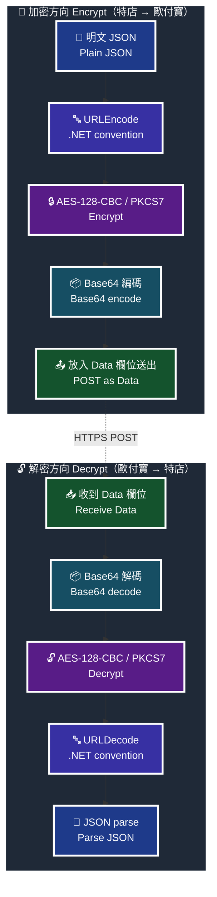

# 歐付寶電子發票 — AES 加解密規格

> **來源**：《歐付寶電子發票B2C介接技術文件》(opay_i100 V1.6.0) 附錄 3「參數加密方式說明」、附錄 2「URLEncode轉換表」；《歐付寶電子發票B2B介接技術文件》(opay_i200) 附錄 2；《歐付寶離線電子發票介接技術文件》(opay_i301) 附錄 2、附錄 3。三份文件的加密規格與測試向量**完全相同**，可共用同一份實作。
> 本文件為非官方整理，僅供開發參考；若與官方文件不一致，**一律以官方文件為準**。
> 文中標記為「本專案驗證」的內容，是用官方 Key/IV 實際跑過 Python / Node.js / PHP 三種實作交叉比對得到的結果，向量存於 [`test-vectors/aes-encryption.json`](../test-vectors/aes-encryption.json)。

---

## 0. 一句話總結

**明文 JSON → URLEncode → AES-128-CBC/PKCS7 → Base64**，反過來就是解密。順序錯了不會噴錯，只會永遠驗不過。

---

## 1. 演算法參數

| 項目 | 值 | 來源 |
|---|---|---|
| 演算法 | AES | i100 附錄 3 |
| 金鑰長度 | **128 bit**（HashKey 為 16 個 ASCII 字元，直接當作 16 bytes 使用，不做 hash、不做 base64 解碼） | i100 附錄 3「AES 加密的強度設定方式是 128 bit」 |
| CipherMode | **CBC** | i100 附錄 3 |
| PaddingMode | **PKCS7** | i100 附錄 3 |
| Key | 特店的 **HashKey**（測試環境一般特店：`ejCk326UnaZWKisg`） | i100 §3 前置準備事項 |
| IV | 特店的 **HashIV**（測試環境一般特店：`q9jcZX8Ib9LM8wYk`） | i100 §3 前置準備事項 |
| 輸出編碼 | Base64（標準字母表，含 `+` `/`，`=` 補齊） | i100 附錄 3 範例密文 |
| 傳輸欄位 | 請求與回應的 `Data` 欄位 | i100 各章「*Data 加密資料」 |

> **為什麼 Key/IV 是 16 字元**：AES-128 的 block size 與 key size 都是 16 bytes。歐付寶直接把 HashKey / HashIV 這兩個 16 字元的 ASCII 字串當成 raw bytes 用。**不要**先做 MD5、不要先 Base64 decode、不要補零到 32 bytes——那些是其他金流服務的慣例，套在這裡會得到「金鑰長度錯誤」或一堆亂碼。

---

## 2. 順序鐵律

> 🧭 **純文字重述（螢幕閱讀器友善）**：加密方向共四步——先把資料組成明文 JSON 字串，第二步用 .NET 慣例做 URLEncode，第三步用 AES-128-CBC/PKCS7 加密，第四步 Base64 編碼後放進 Data 欄位送出。解密方向是完全相反的四步——先 Base64 解碼，再 AES 解密，再 URLDecode，最後才 JSON parse。中間任何一步順序對調，程式都不會噴錯，只會安靜地得到錯誤結果。



> ♿ 配色遵循 [`docs/accessibility.md`](../docs/accessibility.md)：WCAG AAA 對比 ≥7:1、Okabe-Ito 色盲安全色盤、16px 字體、直角連線、圖示＋文字雙編碼。

**為什麼順序是最大的坑**：URLEncode 與 AES 兩步交換之後，程式一樣跑得完、一樣吐得出一串 Base64、長度也一樣合理。你只有把它送出去被歐付寶拒絕，或是拿官方測試向量比對，才會發現不對。**所以請務必先用 §4 的官方向量把實作釘住，再去接真實 API。**

同理，解密時若先 URLDecode 再 AES 解密，也會得到「看起來像密文但解不開」的東西。

---

## 3. .NET URLEncode 陷阱（這節請完整讀完）

歐付寶後端是 .NET 實作，`Data` 的 URLEncode 採 **.NET 的編碼慣例**，與各語言內建函式都**不完全相同**。官方在 i100 附錄 2 明寫：

> ※注意事項：請確認您的語言的 UrlEncode function 轉換後的結果符合附錄 Urlencode 轉換表中的「.NET編碼(opay)」欄位值，若有不符合的字元，請用字元替換功能處理，以免無法符合檢查規則。

### 3.1 規則本身

| 類別 | 字元 | 編碼結果 |
|---|---|---|
| 不編碼（安全集合） | `A-Z` `a-z` `0-9` `-` `_` `.` **`!`** **`*`** **`(`** **`)`** | 原樣輸出 |
| 半形空格 | ` ` | **`+`**（不是 `%20`） |
| 其餘所有字元 | 含 `~` `'` `+` `%` `/` `:` `,` `{` `}` 與所有中文 | UTF-8 位元組逐一編成 `%XX` |

完整逐字元對照請見 [`references/urlencode-table.md`](./urlencode-table.md)（i100 附錄 2 原表 34 列）。

### 3.2 十六進位大小寫

i100 附錄 2 的表格用**小寫**書寫（`%7b`、`%2a`…），但同一份文件附錄 3 的加密範例，URLEncode 結果寫的是**大寫**：

```
%7B%22Name%22%3A%22Test%22%2C%22ID%22%3A%22A123456789%22%7D
```

**本專案驗證**：只有用**大寫**才能重現官方公布的密文；用小寫算出來的 Base64 完全不同。因此本 Skill 一律採大寫。

> 補充（推論，非官方陳述）：標準的 percent-decoding 對十六進位大小寫不敏感（RFC 3986 §6.2.2.1），所以理論上伺服器端兩者解出來會一樣。但既然官方範例是大寫、且官方明說要「符合檢查規則」，就沒有理由賭。**照大寫做。**

### 3.3 各語言內建函式實測差異

**本專案驗證**（Python 3.11 / Node 22 / PHP 8.4，輸入 `!*()~ +%`）：

| 語言 / 函式 | `!` | `*` | `(` | `)` | `~` | 空格 | `'` | 需要校正？ |
|---|---|---|---|---|---|---|---|---|
| **目標**（.NET / opay） | `!` | `*` | `(` | `)` | `%7E` | `+` | `%27` | — |
| PHP `urlencode()` | `%21` | `%2A` | `%28` | `%29` | `%7E` ✅ | `+` ✅ | `%27` ✅ | 只需修 `!*()` |
| PHP `rawurlencode()` | `%21` | `%2A` | `%28` | `%29` | `~` ❌ | `%20` ❌ | `%27` | 要修 6 處 |
| Node `encodeURIComponent()` | `!` ✅ | `*` ✅ | `(` ✅ | `)` ✅ | `~` ❌ | `%20` ❌ | `'` ❌ | 修 `~` `空格` `'` |
| Python `urllib.parse.quote_plus()` | `%21` | `%2A` | `%28` | `%29` | `~` ❌ | `+` ✅ | `%27` ✅ | 修 `!*()` 與 `~` |
| Python `urllib.parse.quote()` | `%21` | `%2A` | `%28` | `%29` | `~` ❌ | `%20` ❌ | `%27` | 要修，且預設 `safe='/'` 會漏掉 `/` |

**每一種語言都各錯一半，沒有任何一個內建函式可以直接用。** 這就是為什麼官方文件要特別附一張表。

> ⚠️ Python 的 `quote()` 預設 `safe='/'`，`/` **不會**被編碼——但 opay 要求 `/` 編成 `%2F`。JSON 裡出現 `/` 很常見（網址、手機條碼載具開頭的 `/`），這個預設值會安靜地把你坑掉。若要用 `quote_plus`，請明確傳 `safe=`。

### 3.4 官方 PHP 校正範例（原文照抄）

> 例如：PHP urlencode function 會將 `!` 字元編碼成 `%21`，不符合「.NET編碼(opay)」，所以在 PHP urlencode 後需用 str_replace function 將 `%21` 轉回 `!` 字元。以下僅以 PHP 轉換範例說明：
> ```php
> $sMacValue = str_replace('%21', '!', $sMacValue);
> $sMacValue = str_replace('%2a', '*', $sMacValue);
> $sMacValue = str_replace('%28', '(', $sMacValue);
> $sMacValue = str_replace('%29', ')', $sMacValue);
> ```
> 其它程式語言的轉換功能，請閱該程式語言的編碼轉換規則改寫。

> ⚠️ **官方範例的 `%2a` 是小寫，但 PHP 8 的 `urlencode()` 實際輸出是大寫 `%2A`**，直接照抄會替換不到。請改用大寫，或用 `str_ireplace()`。（**本專案驗證**：PHP 8.4 `urlencode("*")` → `%2A`。）

---

## 4. 官方測試向量

逐字照抄自 i100 附錄 3（i200 附錄 2、i301 附錄 3 內容相同）：

| 項目 | 值 |
|---|---|
| MID | `2000132` |
| Key (HashKey) | `ejCk326UnaZWKisg` |
| IV (HashIV) | `q9jcZX8Ib9LM8wYk` |
| (1) 加密前 Data 資料 | `{"Name":"Test","ID":"A123456789"}` |
| (2) URLEncode 編碼後結果 | `%7B%22Name%22%3A%22Test%22%2C%22ID%22%3A%22A123456789%22%7D` |
| (3) AES 加密後結果 | `uvI4yrErM37XNQkXGAgRgJAgHn2t72jahaMZzYhWL1HmvH4WV18VJDP2i9pTbC+tby5nxVExLLFyAkbjbS2Dvg==` |

解密方向（同一組資料反向走）：

| 步驟 | 值 |
|---|---|
| (1) Data 密文 | `uvI4yrErM37XNQkXGAgRgJAgHn2t72jahaMZzYhWL1HmvH4WV18VJDP2i9pTbC+tby5nxVExLLFyAkbjbS2Dvg==` |
| (2) AES 解密結果 | `%7B%22Name%22%3A%22Test%22%2C%22ID%22%3A%22A123456789%22%7D` |
| (3) URLDecode 解碼後結果 | `{"Name":"Test","ID":"A123456789"}` |

> ✅ **這組向量已由本專案實際跑過驗證通過**（Python + pycryptodome、Node.js 內建 crypto、PHP openssl_encrypt 三種實作皆重現同一密文）。
> 另有 3 組本專案自行推導的補充向量（空格與 `!*()`、中文 UTF-8、`+` `~` `%`），用來釘住 .NET URLEncode 的邊界行為，見 [`test-vectors/aes-encryption.json`](../test-vectors/aes-encryption.json)。

> ⚠️ 上表的 Key/IV 是**測試環境**的公開測試金鑰，可以放心寫在文件與測試碼裡。正式環境的 HashKey / HashIV 絕對不可以。

---

## 5. 完整可執行實作

以下三段程式碼皆可直接執行，且都會輸出 §4 的官方密文。**本專案驗證**：三者輸出完全一致。

### 5.1 Python（pycryptodome）

```bash
pip install pycryptodome
```

```python
# -*- coding: utf-8 -*-
import base64
from Crypto.Cipher import AES

KEY = "ejCk326UnaZWKisg"   # HashKey，正式環境請從環境變數讀
IV  = "q9jcZX8Ib9LM8wYk"   # HashIV， 正式環境請從環境變數讀

# --- .NET 慣例的 URLEncode / URLDecode --------------------------------------
_SAFE = frozenset(
    "ABCDEFGHIJKLMNOPQRSTUVWXYZabcdefghijklmnopqrstuvwxyz0123456789-_.!*()"
)

def opay_urlencode(text: str) -> str:
    """逐位元組自己編，不依賴任何內建函式的預設安全集合。"""
    out = []
    for byte in text.encode("utf-8"):
        char = chr(byte)
        if char in _SAFE:
            out.append(char)
        elif char == " ":
            out.append("+")          # .NET 慣例：空格是 '+'，不是 '%20'
        else:
            out.append("%%%02X" % byte)   # 大寫十六進位
    return "".join(out)

def opay_urldecode(text: str) -> str:
    buf, i = bytearray(), 0
    while i < len(text):
        if text[i] == "+":
            buf.append(0x20); i += 1
        elif text[i] == "%":
            buf.append(int(text[i + 1:i + 3], 16)); i += 3
        else:
            buf.extend(text[i].encode("utf-8")); i += 1
    return buf.decode("utf-8")

# --- 用內建函式 + 校正的等價寫法（本專案驗證：全 ASCII + CJK 掃描結果一致）---
# import urllib.parse
# def opay_urlencode(text: str) -> str:
#     return urllib.parse.quote_plus(text, safe="!*()").replace("~", "%7E")

# --- PKCS7 -------------------------------------------------------------------
def _pad(data: bytes, block: int = 16) -> bytes:
    n = block - len(data) % block
    return data + bytes([n]) * n

def _unpad(data: bytes, block: int = 16) -> bytes:
    n = data[-1]
    if n < 1 or n > block or data[-n:] != bytes([n]) * n:
        raise ValueError("PKCS7 padding 不合法：多半是 HashKey/HashIV 錯了")
    return data[:-n]

# --- 對外 API ----------------------------------------------------------------
def opay_encrypt(plaintext: str, key: str = KEY, iv: str = IV) -> str:
    """明文 JSON -> URLEncode -> AES-128-CBC/PKCS7 -> Base64"""
    encoded = opay_urlencode(plaintext)
    cipher = AES.new(key.encode(), AES.MODE_CBC, iv.encode())
    return base64.b64encode(cipher.encrypt(_pad(encoded.encode("utf-8")))).decode("ascii")

def opay_decrypt(ciphertext_b64: str, key: str = KEY, iv: str = IV) -> str:
    """Base64 -> AES-128-CBC/PKCS7 -> URLDecode -> 明文 JSON"""
    cipher = AES.new(key.encode(), AES.MODE_CBC, iv.encode())
    raw = _unpad(cipher.decrypt(base64.b64decode(ciphertext_b64)))
    return opay_urldecode(raw.decode("utf-8"))

if __name__ == "__main__":
    plain = '{"Name":"Test","ID":"A123456789"}'
    ct = opay_encrypt(plain)
    print(ct)
    # uvI4yrErM37XNQkXGAgRgJAgHn2t72jahaMZzYhWL1HmvH4WV18VJDP2i9pTbC+tby5nxVExLLFyAkbjbS2Dvg==
    assert opay_decrypt(ct) == plain
```

### 5.2 Node.js（內建 `crypto`，無外部相依）

```javascript
'use strict';
const crypto = require('crypto');

const KEY = 'ejCk326UnaZWKisg';   // HashKey，正式環境請用 process.env
const IV  = 'q9jcZX8Ib9LM8wYk';   // HashIV， 正式環境請用 process.env

// --- .NET 慣例的 URLEncode / URLDecode --------------------------------------
const SAFE = new Set(
  'ABCDEFGHIJKLMNOPQRSTUVWXYZabcdefghijklmnopqrstuvwxyz0123456789-_.!*()'
);

function opayUrlencode(text) {
  let out = '';
  for (const byte of Buffer.from(text, 'utf8')) {
    const char = String.fromCharCode(byte);
    if (SAFE.has(char)) out += char;
    else if (char === ' ') out += '+';                       // 空格 -> '+'
    else out += '%' + byte.toString(16).toUpperCase().padStart(2, '0');
  }
  return out;
}

function opayUrldecode(text) {
  const bytes = [];
  for (let i = 0; i < text.length; ) {
    if (text[i] === '+') { bytes.push(0x20); i += 1; }
    else if (text[i] === '%') { bytes.push(parseInt(text.substr(i + 1, 2), 16)); i += 3; }
    else { bytes.push(...Buffer.from(text[i], 'utf8')); i += 1; }
  }
  return Buffer.from(bytes).toString('utf8');
}

// --- 用 encodeURIComponent + 校正的等價寫法 ----------------------------------
// 本專案驗證：對全部可列印 ASCII 與 CJK 字元，與上面的逐位元組版結果完全一致。
// encodeURIComponent 不編碼 !'()*-._~ ，所以要補三刀：
//   const opayUrlencode = s => encodeURIComponent(s)
//     .replace(/'/g, '%27')      // ' 要編
//     .replace(/~/g, '%7E')      // ~ 要編
//     .replace(/%20/g, '+');     // 空格改成 +
// 注意：!*() 本來就不編，剛好符合 .NET 慣例，不要多此一舉去編它們。

// --- 對外 API ----------------------------------------------------------------
function opayEncrypt(plaintext, key = KEY, iv = IV) {
  const encoded = opayUrlencode(plaintext);
  const cipher = crypto.createCipheriv('aes-128-cbc', Buffer.from(key, 'utf8'), Buffer.from(iv, 'utf8'));
  cipher.setAutoPadding(true);   // Node 的 auto padding 就是 PKCS7（PKCS#5 別名）
  return Buffer.concat([cipher.update(encoded, 'utf8'), cipher.final()]).toString('base64');
}

function opayDecrypt(ciphertextB64, key = KEY, iv = IV) {
  const decipher = crypto.createDecipheriv('aes-128-cbc', Buffer.from(key, 'utf8'), Buffer.from(iv, 'utf8'));
  decipher.setAutoPadding(true);
  const raw = Buffer.concat([
    decipher.update(Buffer.from(ciphertextB64, 'base64')),
    decipher.final(),
  ]).toString('utf8');
  return opayUrldecode(raw);
}

if (require.main === module) {
  const plain = '{"Name":"Test","ID":"A123456789"}';
  const ct = opayEncrypt(plain);
  console.log(ct);
  // uvI4yrErM37XNQkXGAgRgJAgHn2t72jahaMZzYhWL1HmvH4WV18VJDP2i9pTbC+tby5nxVExLLFyAkbjbS2Dvg==
  console.assert(opayDecrypt(ct) === plain);
}

module.exports = { opayUrlencode, opayUrldecode, opayEncrypt, opayDecrypt };
```

### 5.3 PHP（`openssl_encrypt`）

```php
<?php
declare(strict_types=1);

const OPAY_KEY = 'ejCk326UnaZWKisg';   // HashKey，正式環境請用 getenv()
const OPAY_IV  = 'q9jcZX8Ib9LM8wYk';   // HashIV， 正式環境請用 getenv()

/**
 * .NET 慣例的 URLEncode。
 * PHP 的 urlencode() 已經做對三件事：空格 -> '+'、'~' -> '%7E'、大寫十六進位，
 * 只差 ! * ( ) 這四個字元被多編了，補一次 str_replace 即可。
 * 本專案驗證：對全部可列印 ASCII 與 CJK 字元，結果與 Python / Node 實作完全一致。
 */
function opay_urlencode(string $text): string
{
    return str_replace(
        ['%21', '%2A', '%28', '%29'],   // 注意是大寫，PHP 8 的 urlencode() 輸出大寫
        ['!',   '*',   '(',   ')'],
        urlencode($text)
    );
}

function opay_urldecode(string $text): string
{
    return urldecode($text);   // urldecode 會把 '+' 還原成空格，正是這裡需要的
}

/** 明文 JSON -> URLEncode -> AES-128-CBC/PKCS7 -> Base64 */
function opay_encrypt(string $plaintext, string $key = OPAY_KEY, string $iv = OPAY_IV): string
{
    $cipher = openssl_encrypt(
        opay_urlencode($plaintext),
        'AES-128-CBC',
        $key,
        OPENSSL_RAW_DATA,   // 不加此旗標 openssl_encrypt 會自己再 base64 一次
        $iv
    );
    if ($cipher === false) {
        throw new RuntimeException('AES 加密失敗：' . openssl_error_string());
    }
    return base64_encode($cipher);
}

/** Base64 -> AES-128-CBC/PKCS7 -> URLDecode -> 明文 JSON */
function opay_decrypt(string $ciphertextB64, string $key = OPAY_KEY, string $iv = OPAY_IV): string
{
    $raw = openssl_decrypt(
        base64_decode($ciphertextB64),
        'AES-128-CBC',
        $key,
        OPENSSL_RAW_DATA,
        $iv
    );
    if ($raw === false) {
        throw new RuntimeException('AES 解密失敗（多半是 HashKey/HashIV 錯了）：' . openssl_error_string());
    }
    return opay_urldecode($raw);
}

// --- 驗證 -------------------------------------------------------------------
$plain = '{"Name":"Test","ID":"A123456789"}';
$ct = opay_encrypt($plain);
echo $ct, PHP_EOL;
// uvI4yrErM37XNQkXGAgRgJAgHn2t72jahaMZzYhWL1HmvH4WV18VJDP2i9pTbC+tby5nxVExLLFyAkbjbS2Dvg==
assert(opay_decrypt($ct) === $plain);
```

> PHP 的 `OPENSSL_RAW_DATA` 一定要帶。`openssl_encrypt` 預設會回傳已 base64 過的字串，你若再 `base64_encode` 一次就是雙重編碼——密文長度會變成約 4/3 倍，是很好辨認的症狀。
> PHP 的 `AES-128-CBC` 預設 padding 就是 PKCS7，不要傳 `OPENSSL_ZERO_PADDING`。

---

## 6. 常見錯誤與症狀對照表

| 症狀 | 可能原因 | 怎麼確認 / 怎麼修 |
|---|---|---|
| 歐付寶回 Data 解析失敗 / 參數錯誤，但本地 JSON 是合法的 | **忘記 URLEncode**，直接把 JSON 拿去 AES 加密 | 拿官方向量比對：明文 `{"Name":"Test",...}` 應先變成 `%7B%22Name%22...` 才加密 |
| 同上 | **順序顛倒**：先 AES 再 URLEncode | 檢查 §2 流程圖。這種錯本地完全不會噴例外 |
| 金鑰長度錯誤 / `Invalid key length` / `IV must be 16 bytes` | 用了 AES-256、或對 HashKey 做了 MD5/SHA/Base64 decode | HashKey、HashIV 各為 16 個 ASCII 字元，**原樣當 bytes 用**。演算法固定 `AES-128-CBC` |
| 解密後字串尾巴多出 `\0\0\0` | padding 用了 **zero padding**（如 PHP 的 `OPENSSL_ZERO_PADDING`、Java 的 `NoPadding` 自己補零） | 改回 **PKCS7**。zero padding 解不出正確的原始長度，且明文結尾若本來就有 `\0` 會被吃掉 |
| 解密時丟 `padding 不合法` / `bad decrypt` | HashKey 或 HashIV 錯（拿了測試環境的金鑰打正式環境，或反之）；或密文在傳輸中被改動 | 先用官方向量確認實作沒問題，再確認環境對應的金鑰 |
| 密文長度約為預期的 4/3 倍 | **雙重 Base64**：PHP 沒帶 `OPENSSL_RAW_DATA`、或 Python 把 `b64encode` 做了兩次 | 密文正常應為 `ceil((len+pad)/3)*4` 長度。官方向量密文長 88 字元 |
| 傳輸被截斷 / 對方收到的 Data 比送出的短 | Base64 輸出**帶了換行**（每 64 或 76 字元一個 `\n`），例如 PHP `chunk_split`、Python `base64.encodestring`、OpenSSL CLI 預設 | Base64 必須是**單行**。用 `base64.b64encode`（Python）/ `toString('base64')`（Node）/ `base64_encode`（PHP），都不會加換行 |
| 中文變亂碼 / 開立出來的商品名稱是問號 | 先轉成 Big5 或 ISO-8859-1 才 URLEncode | 必須 **UTF-8**：先 `text.encode('utf-8')` 再逐位元組編 `%XX` |
| 商品名稱裡的空格變成 `+` 出現在發票上 | 解密端沒有把 `+` 還原成空格（用了 RFC 3986 的 percent-decode 而非 form-decode） | 解碼要用會處理 `+` 的版本：Python 自寫版 / `unquote_plus`、PHP `urldecode`（不是 `rawurldecode`）、Node 需自行處理 |
| `1+1` 送出去變成 `1 1` | 明文裡真正的 `+` 沒被編成 `%2B` | 用了不完整的校正表。`+` 必須編成 `%2B`，見 [`urlencode-table.md`](./urlencode-table.md) |
| 只有含 `!` `*` `(` `)` 的資料才失敗 | 沒做官方要求的 `str_replace` 校正 | 見 §3.4；注意 PHP 8 輸出大寫 `%2A` |
| 只有含 `/` 的資料才失敗（例如手機條碼載具 `/ABC1234`） | Python 用了 `quote()` 且沒改 `safe` 參數（預設 `safe='/'`） | 傳 `safe="!*()"` 或用逐位元組版 |
| 本地測試都對，接上真實 API 才錯 | 加解密沒問題，是 `Timestamp`、`MerchantID`、字軌等業務層問題 | 看 [`error-handling.md`](./error-handling.md) 的 `TransCode` / `RtnCode` 兩層判讀 |

---

## 7. 金鑰安全

> ⚠️ **HashKey / HashIV 只能放 `.env`，嚴禁寫進前端 JS/HTML/CSS，嚴禁 commit 進 git。**
>
> 這不是本文件的建議，是官方 i100 §3 / i200 §2 的明文要求：
> 「請勿將金鑰資訊(HashKey、HashIV)存放或顯示於前端網頁內，如 Javascript、html、Css…等，避免金鑰被盜取使用造成損失及交易資料外洩。」
>
> 具體做法：
> - 金鑰只存在後端環境變數（`.env` / Secrets Manager / K8s Secret），`.env` 一定要進 `.gitignore`。
> - **加解密只在後端做。** 前端絕對不呼叫歐付寶 API，一律經過自家後端代理。
> - 不要把金鑰印進 log、error message、APM trace、或丟給 AI 助手的 prompt。
> - 測試環境金鑰（`ejCk326UnaZWKisg` / `q9jcZX8Ib9LM8wYk`）是官方文件公開的，可以寫在測試碼裡；**正式環境金鑰一個字元都不行**。
> - 若不慎 commit 過，改 git 歷史沒有用（已經散出去了），請直接向歐付寶申請更換金鑰。

---

## 8. 相關檔案

| 檔案 | 用途 |
|---|---|
| [`references/urlencode-table.md`](./urlencode-table.md) | i100 附錄 2 完整 34 列轉換表 + 三語言校正碼 |
| [`references/error-handling.md`](./error-handling.md) | `TransCode` / `RtnCode` 兩層判讀與重試策略 |
| [`test-vectors/aes-encryption.json`](../test-vectors/aes-encryption.json) | 測試向量 SSOT |
| [`test-vectors/verify.py`](../test-vectors/verify.py) | Python 驗證器 |
| [`test-vectors/verify-node.js`](../test-vectors/verify-node.js) | Node.js 驗證器 |
