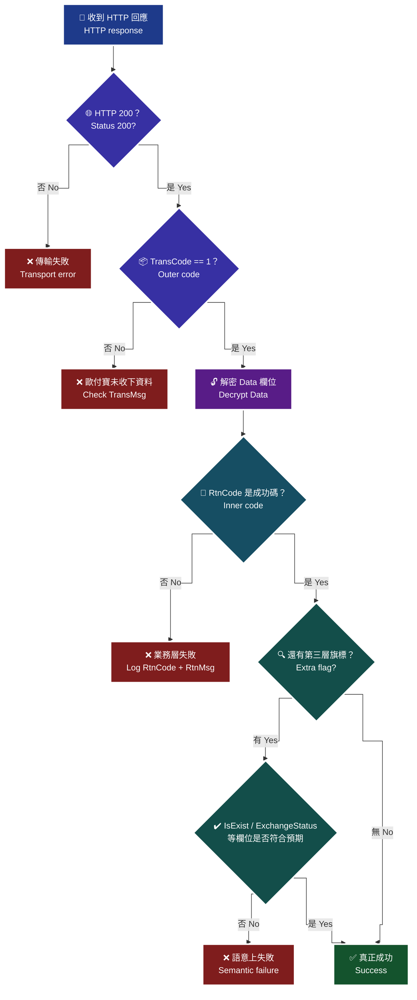
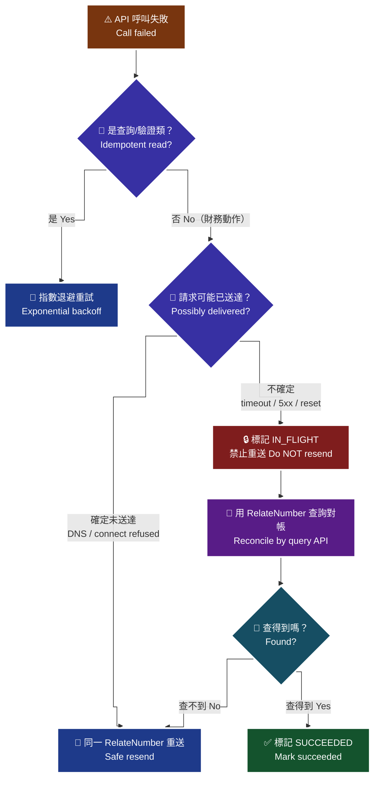

# 歐付寶電子發票 — 錯誤處理策略

> **來源**：《歐付寶電子發票B2C介接技術文件》(opay_i100 V1.6.0)、《歐付寶電子發票B2B介接技術文件》(opay_i200)、《歐付寶離線電子發票介接技術文件》(opay_i301 V1.3.0)。
> 本文件為非官方整理，僅供開發參考；若與官方文件不一致，**一律以官方文件為準**。

---

## 0. ⚠️ 先講最重要的一件事：官方沒有公開完整錯誤碼表

三份官方文件的「附錄 1」都只有一句話，沒有任何錯誤碼清單：

| 文件 | 附錄 | 原文 |
|---|---|---|
| i100 | 附錄 1 錯誤代碼 | 「因錯誤代碼一直在新增，詳細的錯誤代碼，請到**廠商後台 → 電子發票後台 → 系統開發管理 → 錯誤代碼查詢**。」 |
| i200 | 附錄 1 錯誤代碼 | 同上 |
| i301 | 附錄 1 交易狀態代碼表 | 「因錯誤代碼一直在新增，詳細的錯誤代碼，請到**廠商後台 → 系統開發管理 → 交易狀態代碼查詢**。」 |

> 🚫 **本 Skill 不得自行編造錯誤碼。**
> 如果你（或 AI 助手）看到一份「歐付寶電子發票錯誤碼對照表」宣稱有完整清單，它不是來自這三份官方文件。硬編一張猜測的錯誤碼表，會在正式環境出現「你的程式說是 A 錯誤，實際是 B 錯誤」的災難性誤導。

**正確做法**：

1. **要查特定錯誤碼的意義** → 登入廠商後台照上表路徑查。
   - 測試環境後台：`https://vendor-stage.opay.tw`（測試帳號 `stagetest` / `test1234`）
   - 正式環境後台：`https://vendor.opay.tw`
2. **程式裡怎麼寫** → 把 `RtnCode` 與 `RtnMsg` **原樣**記錄下來（log + 資料庫欄位），不要試圖翻譯或分類。
3. **要給使用者看的訊息** → 用你自己的通用文案（「發票開立失敗，請聯繫客服」），把 `RtnCode` / `RtnMsg` 放在只有客服看得到的地方。
4. 目前官方文件內**明確寫出意義的 `RtnCode`** 只有這四個，其餘一律當作「未知錯誤」：

| `RtnCode` | 意義 | 來源 |
|---|---|---|
| `1` | 成功（絕大多數 API） | i100 / i200 / i301 全篇 |
| `4000003` | **延後開立成功**（開立發票，`DelayDay > 0`） | i100 §7 |
| `4000004` | **開立發票成功**（開立發票，`DelayDay = 0`） | i100 §7 |
| `10000010` | 財政部系統目前維護中，無法驗證，請稍後再試（手機條碼驗證 / 捐贈碼驗證） | i100 §20 §21 |

---

## 1. 兩層回應碼：`TransCode`（外層）與 `RtnCode`（內層）

歐付寶所有 API 的回應都是兩層結構。**兩層都要檢查**。

| 層級 | 欄位 | 位置 | 成功值 | 官方定義 |
|---|---|---|---|---|
| 外層（傳輸層） | `TransCode` | 回應 JSON 的最上層，**未加密** | `1` | 「`1` 代表傳輸資料(`MerchantID`, `RqHeader`, `Data`)**接收成功**，其餘均為失敗」 |
| 內層（業務層） | `RtnCode` | 在 `Data` 欄位裡，**要先解密才看得到** | `1`（開立發票是 `4000003`/`4000004`） | 「`1` 為成功，其餘為失敗」 |

外層還有 `TransMsg`（String(200)），內層還有 `RtnMsg`（String(200)）。

### 1.1 判讀流程

> 🧭 **純文字重述（螢幕閱讀器友善）**：收到 HTTP 回應後要走四道關卡。第一關檢查 HTTP 狀態碼是否為 200；第二關檢查外層 TransCode 是否等於 1，代表歐付寶收到了你的傳輸資料；第三關把 Data 欄位解密並 parse 成 JSON；第四關檢查內層 RtnCode 是否為該支 API 的成功碼。四關全過才算成功。只檢查前一兩關就當成功，是最常見的「假成功」。部分 API 還有第五關，例如手機條碼驗證要再看 IsExist 欄位是 Y 還是 N。



> ♿ 配色遵循 [`docs/accessibility.md`](../docs/accessibility.md)：WCAG AAA 對比 ≥7:1、Okabe-Ito 色盲安全色盤、16px 字體、直角連線、圖示＋文字雙編碼。

### 1.2 三種最常見的「假成功」

| 假成功寫法 | 為什麼會出事 |
|---|---|
| `if (httpStatus === 200) return SUCCESS;` | HTTP 200 只代表 HTTP 層通了。`TransCode` 可能是失敗、`RtnCode` 可能是失敗，回應照樣是 200。 |
| `if (resp.TransCode === 1) return SUCCESS;` | `TransCode=1` 官方定義是「**接收成功**」——歐付寶收到了你的三個欄位而已。字軌沒啟用、金額對不上、統編不存在，通通還是 `TransCode=1`。 |
| `if (data.RtnCode === 1) return SUCCESS;` | 對**開立發票**是錯的。成功碼是 `4000004`（或延後開立的 `4000003`），`RtnCode=1` 反而不是開立成功。這個寫法會把成功判成失敗 → 觸發重試 → **同一筆訂單開出兩張發票**。 |

### 1.3 建議的判讀程式碼骨架

```python
SUCCESS_CODES = {
    # 一般 API
    "default": {1},
    # 開立發票：DelayDay=0 -> 4000004；DelayDay>0 -> 4000003（i100 §7）
    "/B2CInvoice/Issue": {4000003, 4000004},
}

def call(api_path: str, payload: dict) -> dict:
    resp = http_post(BASE_URL + api_path, json=payload, timeout=30)

    # 第 1 關：HTTP
    resp.raise_for_status()
    body = resp.json()

    # 第 2 關：外層 TransCode
    if body.get("TransCode") != 1:
        raise OpayTransportError(body.get("TransCode"), body.get("TransMsg"))

    # 第 3 關：解密
    data = json.loads(opay_decrypt(body["Data"]))   # 見 references/encryption-aes.md

    # 第 4 關：內層 RtnCode（注意每支 API 的成功碼不同）
    ok = SUCCESS_CODES.get(api_path, SUCCESS_CODES["default"])
    if data.get("RtnCode") not in ok:
        # 原樣保存，不要翻譯、不要分類、不要猜意義
        raise OpayBusinessError(data.get("RtnCode"), data.get("RtnMsg"), raw=data)

    return data
```

**第 5 關（部分 API 才有）**：`RtnCode` 成功不代表你要的答案是「是」。

| API | 還要看什麼 | 官方原文 |
|---|---|---|
| 手機條碼驗證（i100 §20） | `IsExist` = `Y` / `N` | 「若回應代碼 `RtnCode` 為 `1`(成功)時，**請再判斷此欄位值**」 |
| 捐贈碼驗證（i100 §21） | `IsExist` = `Y` / `N` | 同上 |
| 開立折讓（i100 §8） | 消費者是否同意 | 「成功代表 **API 呼叫成功**，需**消費者同意後**才算開立折讓單成功」 |
| B2B 各查詢（i200 §18–§27） | `ExchangeStatus` / `Upload_Status` | `Upload_Status=2` 是**上傳失敗**，見 [`enums.md` §7.5](./enums.md#75-️-upload_status-上傳狀態b2b三值) |
| 查詢財政部配號結果（i100 §4） | 清單是否為空 | 「如查無資料，可能的原因為取字軌號碼時**並未授權於歐付寶**，或**字軌尚未取號完成**」 |

---

## 2. 排錯表：症狀 → 可能原因 → 檢查什麼

> 以下每一列的「可能原因」都來自官方文件明寫的限制，並標註出處。**沒有出處的推測不放進這張表。**

### 2.1 連線／傳輸層

| 症狀 | 可能原因 | 檢查什麼 | 來源 |
|---|---|---|---|
| 連線逾時、無法連線 | 特店防火牆未放行歐付寶主機 | 歐付寶主機 **IP 不固定**，防火牆必須以 **FQDN** 設定：`einvoice.opay.tw` TCP 443（正式）、`einvoice-stage.opay.tw` TCP 443（測試） | i100 §3；i200 §2 |
| TLS handshake 失敗 | 用戶端 TLS 版本過舊 | 歐付寶串接服務**支援 TLS 1.2 以上**。舊版 .NET Framework、舊 OpenSSL、舊 Java 預設可能仍是 TLS 1.0/1.1 | i100 §3；i200 §2 |
| 連 http 被拒 | 只提供 HTTPS | 「呼叫歐付寶 API 連接 port **只提供 https(443 port)** 連線方式，並請使用合法的 DNS 進行介接」 | i100 §3；i200 §2 |
| 收不到歐付寶的回傳通知 | 特店伺服器防火牆擋住回傳；或 port 不對 | 「請確認特店伺服器 URL 連接 port 為 http 80 port 與 https 443 port」 | i100 §3；i200 §2 |
| 回傳網址帶中文導致失敗 | 不支援中文網址 | 「回傳網址不支援中文網址，網址參數請使用 **punycode** 編碼後的網址，例如 `中文.tw` 改成 `xn--fiq228c.tw`」 | i100 §3；i200 §2 |
| 參數送出去對方說收不到 | 用了 GET | 「請確認各項交易參數傳送時是使用 **Http POST** 方式傳送至歐付寶 API」 | i100 §3；i200 §2 |

### 2.2 `Timestamp` 與時間

| 症狀 | 可能原因 | 檢查什麼 | 來源 |
|---|---|---|---|
| 間歇性驗證失敗，重跑有時就好 | **主機時差** | 「合作特店須進行主機『**時間校正**』，避免主機產生時差，延伸 API 無法正常運作。」請確認 NTP 有在跑 | i100 / i200 / i301 各章 `RqHeader.Timestamp` 說明 |
| 訂單無法建立、提示時間相關錯誤 | `Timestamp` 超出**驗證區間** | 「驗證時間區間**暫訂為 10 分鐘內有效**，若超過此驗證時間則此次訂單將無法建立」 | 同上 |
| 全部請求都失敗 | `Timestamp` 用了**毫秒**而非秒 | `Timestamp` 是 **Unix TimeStamp**（秒）。JavaScript 的 `Date.now()` 是毫秒，要除以 1000 取整 | 同上（官方參考連結 `http://www.epochconverter.com/`） |
| 排程／批次作業失敗，即時作業正常 | 先組好 payload 排隊很久才送出 | `Timestamp` 要在**實際送出前**才產生，不要在建立佇列時就寫死 | 同上（10 分鐘區間） |

### 2.3 加解密

| 症狀 | 可能原因 | 檢查什麼 | 來源 |
|---|---|---|---|
| `Data` 解析失敗 / 參數錯誤，但本地 JSON 合法 | 忘記 URLEncode、或順序顛倒 | 用官方測試向量比對；順序必須是 JSON → URLEncode → AES → Base64 | i100 附錄 3；見 [`encryption-aes.md`](./encryption-aes.md) |
| 只有含 `!` `*` `(` `)` 或空格的資料才失敗 | 沒做 .NET URLEncode 校正 | 見 [`urlencode-table.md`](./urlencode-table.md) | i100 附錄 2 |
| 金鑰長度錯誤 | 用了 AES-256 或對 HashKey 做了 hash | 固定 **AES-128-CBC / PKCS7**，HashKey / HashIV 各 16 個 ASCII 字元原樣使用 | i100 附錄 3 |
| 解密後尾巴多出 `\0` | 用了 zero padding | 必須是 **PKCS7** | i100 附錄 3 |
| 傳輸被截斷 | Base64 帶了換行 | Base64 必須單行 | — |

完整對照表見 [`encryption-aes.md` §6](./encryption-aes.md#6-常見錯誤與症狀對照表)。

### 2.4 字軌（最常見的「開立失敗」來源）

| 症狀 | 可能原因 | 檢查什麼 | 來源 |
|---|---|---|---|
| 查詢財政部配號結果**查無資料** | 取字軌號碼時**並未授權於歐付寶**；或**字軌尚未取號完成** | 先到財政部電子發票整合服務平台完成授權，再確認取號狀態 | i100 §4；i301 §6 |
| 開立發票失敗，字軌相關 | 字軌**未啟用** | 新增字軌後預設狀態是「已審核且未啟用」，必須先呼叫「設定字軌號碼狀態」把 `InvoiceStatus` 設為 **`2`（啟用）** | i100 §6 |
| 同上 | 字軌**待審核 / 審核不通過** | 呼叫「查詢字軌」看 `UseStatus`：`5`=待審核、`6`=審核不通過 | i100 §17 |
| 同上 | 字軌已被**停用** | `InvoiceStatus=0`（停用）時「該字軌區間**無法上傳發票**」，且「**停用後無法再度啟用**」 | i100 §6；i200 §2 |
| 設定字軌狀態送出後行為與預期相反 | `InvoiceStatus` 值搞混 | `0`=停用、`1`=**暫停**、`2`=**啟用**。離線 §12 的 `InvoiceStatus` 是另一套（`1`=啟用、`2`=備用字軌） | 見 [`enums.md` §10.1](./enums.md#101-️-invoicestatus--三份文件兩套值) |
| 字軌查詢查無資料 | `InvoiceCategory` 填錯 | B2C **固定 `1`**（原文：「否則會查無資料」）、B2B 固定 `2`、離線固定 `4` | i100 §17；i200 §28；i301 §15 |
| 開立時提示期別錯誤 | **跨期別開立** | 離線 §12 明寫「**不可帶入小於當年期別**」。`InvoiceTerm` 必須對應開立日期所屬期別（1=1-2月…6=11-12月） | i301 §12 |
| 設定類 API 帶 `InvoiceTerm=0` 失敗 | `0`（全部）只在**查詢類** API 有意義 | 見 [`enums.md` §2.3](./enums.md#23-invoiceterm-發票期別) | i100 §17 §27 |

### 2.5 發票內容參數

| 症狀 | 可能原因 | 檢查什麼 | 來源 |
|---|---|---|---|
| 載具相關開立失敗 | **載具格式錯誤** | 自然人憑證：固定 16 碼（2 碼大寫英文 + 14 碼數字）；手機條碼：固定 8 碼，第 1 碼 `/`，其餘 7 碼取自 `0-9` `A-Z` `+` `-` `.` 共 39 個字元 | i100 §7 |
| 同上 | 手機條碼**未先驗證** | 「若載具編號為手機條碼載具時，**請先呼叫手機條碼驗證進行檢核**」（i100 §20），並記得 `RtnCode=1` 之後**還要看 `IsExist`** | i100 §7 §20 |
| 同上 | `CarrierNum2` 亂填 | 「當 `CarrierType` 數值為 `1`、`2` 或 `3` 時，**請廠商無須填入此欄位，以避免系統阻擋**」；`4~8` 則必填且「**格式錯誤會造成開立失敗**」 | i100 §7 |
| 同上 | 全形字元 | 「英文、數字、符號**僅接受半形字元**」 | i100 §7 |
| 列印 / 捐贈 / 統編組合被拒 | 連動規則違反 | `Donation=1` → `Print` 必須 `0`；有 `CustomerIdentifier` → `Donation` 必須 `0`；`Print=1` → `CarrierType` 必須空字串；`Print=0` 且有統編 → `CarrierType` 不可空 | i100 §7 |
| 零稅率開立失敗 | `ClearanceMark` 未填 | `TaxType=2`（零稅率）時 `ClearanceMark` **必填**（`1` 非經海關出口 / `2` 經海關出口） | i100 §7；i200 §7 |
| **2026 年起**零稅率突然開始失敗 | `ZeroTaxRateReason` 未填 | 「**自 115 年 1 月 1 日起**，當 `TaxType` 為 `2`（i301 另含 `9`）時，此欄位**必填**或廠商後台必須設定以便程式抓取，**否則將會開立失敗**」 | i200 §7；i301 §13 |
| 特種稅額開立失敗 | `SpecialTaxType` 未填或填錯 | `TaxType=3` → 必填 `8`；`TaxType=4` → 必填 `1`~`8`；`TaxType=1/2/9` → 系統自動帶 `0` | i100 §7 |
| 混稅發票被拒 | 免稅與零稅率同時出現 | `TaxType=9` 時只能「應稅＋免稅」或「應稅＋零稅率」，**免稅和零稅率不能同時開立**；且需二筆以上明細、`ItemTaxType` 不可為空 | i100 §7 |
| `TaxType` 與 `InvType` 不合 | 組合非法 | `InvType=07` → `TaxType` 帶 `1`/`2`/`3`/`9`；`InvType=08` → 帶 `3`/`4` | i100 §7 |
| `InvType` 被送成 `7` | 前導零掉了 | `InvType` 型態是 **String(2)**，必須是 `"07"` / `"08"` | i100 §4 |
| 明細排序相關錯誤 | `ItemSeq` 重複或超出範圍 | 「請帶 **1~999** 的整數值」「商品排序**不可重複**」 | i100 §7 |
| 自訂編號重複 | `RelateNumber` 撞號 | 「需為**唯一值不可重複使用**」「**大小寫英文視為相同**（`123abc456` = `123ABC456`）」「建議勿使用特殊符號」 | i100 §7 |

### 2.6 統一編號 / 交易對象

| 症狀 | 可能原因 | 檢查什麼 | 來源 |
|---|---|---|---|
| 統編驗證失敗 | 統編不存在或格式錯 | 先呼叫「統一編號驗證」（i100 §22 `GetCompanyNameByTaxID` / i200 §29），它會回傳公司名稱；注意 `RtnCode=1` 只代表**呼叫成功** | i100 §22；i200 §29 |
| B2B 統編相關全面失敗 | `Identifier` 格式 | 「固定長度為**數字 8 碼**、**註冊當下所使用的統一編號**、**設定後不可變更**」 | i200 §3 |
| 有統編卻要捐贈 | 業務規則衝突 | 有 `CustomerIdentifier` 時 `Donation` 必須 `0` | i100 §7 |

### 2.7 B2B 專屬

| 症狀 | 可能原因 | 檢查什麼 | 來源 |
|---|---|---|---|
| B2B 什麼都失敗 | **未在財政部完成授權歐付寶** | 「使用歐付寶電子發票加值中心前，請務必至**財政部電子發票整合服務平台完成授權歐付寶**」 | i200 §2 |
| 收不到對方開給你的進項發票 | **未完成接收設定**，或用了存證模式 | 「請務必至財政部電子發票整合服務平台**完成設定由歐付寶接收**」；且**存證模式僅適用於銷項發票**，加值中心**無法接收**其他營業人開立給你的電子發票 | i200 §2 §3 |
| 送作廢折讓通知收到「買/賣方錯誤」 | 存證模式的規則 | 「存證模式下，根據財政部文件規定**只允許買方開立作廢折讓**，因此以賣方角度使用 `5` 作廢折讓通知，會收到買/賣方錯誤，實際意義為**無須再另行通知**」 | i200 §4 |
| 查詢一直查不到 | `InvoiceCategory` 銷項/進項填反 | 查詢類 API 的 `InvoiceCategory`：`0`=銷項（你開給對方）、`1`=進項（對方開給你）。**與字軌章節的 `2`=B2B 是不同定義** | 見 [`enums.md` §10.3](./enums.md#103-️-invoicecategory--同一份-i200-文件內就兩套) |
| 發票狀態卡在「處理中」永遠不動 | `Upload_Status=2` 是**上傳失敗**不是處理中 | B2B 的 `Upload_Status` 有三值（`0`/`1`/`2`），B2C 只有兩值。輪詢邏輯要把 `2` 當終態失敗 | 見 [`enums.md` §10.6](./enums.md#106-️-上傳狀態家族--b2c-兩值b2b-三值) |
| `ExchangeStatus` 判斷不一致 | 存證與交換模式語意不同 | `ExchangeMode=0`（存證）時 `1`=完成；`ExchangeMode=1`（交換）時 `0`=開立等待確認、`1`=接收開立確認。**空值 = 未設定 ≠ `0`** | i200 §18 |

### 2.8 作廢 / 折讓 / 註銷的時間窗

這一組不是「錯誤」，是**業務上的硬性期限**，過期就真的做不到，只能改用其他流程處理。

| 限制 | 原文 | 來源 |
|---|---|---|
| 發票**已被折讓過**無法直接作廢 | 「發票若已被折讓過，無法直接作廢發票，並請確認該發票所開立的折讓單是否全部已作廢」 | i100 §9 |
| **奇數月 13 號 23:59:59 後**無法作廢前兩個月的發票 | 「每年奇數月的 13 號 23:59:59 以後，因已申報至財政部，無法作廢前兩個月開立的發票。例如 3 月 14 號時，不能作廢 1、2 月所開立的發票。」 | i100 §9 |
| 註銷重開**僅能於單月 13 日前**註銷前一期發票 | 「僅能於單月 13 日前註銷前一期的發票」 | i100 §12 |
| 註銷重開**不可更改**三個欄位 | 「適用於發票註銷重開（**發票號碼、自訂編號、開立時間不可更改**）」 | i100 §12 |
| 延遲開立**當天 10 點後無法取消** | 「開立當天 10 點後無法取消開立」；`DelayFlag=1` 時 `DelayDay` 須 1~15 天，`DelayFlag=2`（觸發）時 0~15 天 | i100 §7 |
| 觸發開立**未被觸發就不會開立** | 「若此張發票都沒有被觸發，**將不會被開立**」 | i100 §7 |
| 作廢／作廢折讓是**隔日**才上傳財政部 | 「由歐付寶暫存發票作廢資料。歐付寶於**隔日**將作廢資料上傳至財政部」 | i100 §9 §10 |
| 查詢空白未使用發票**不可查當期，最多查 1 年** | 「※不可查當期，最多查詢 1 年」 | i100 §27 §28 |

> 為什麼要放進錯誤處理文件：這些期限造成的失敗，`RtnMsg` 可能只寫一句籠統的訊息，開發者會誤以為是自己參數錯而不斷重試。**先確認是不是撞到時間窗，比翻參數快得多。**

---

## 3. 重試策略

### 3.1 分類：哪些能重試，哪些絕對不能

| 類別 | API | 冪等？ | 可否安全重試 |
|---|---|:---:|---|
| **查詢類** | 查詢財政部配號結果、查詢字軌、查詢發票明細、查詢折讓明細、查詢作廢發票明細、查詢作廢折讓明細、查詢空白未使用發票、下載空白發票清單、B2B 各 `Query*` | ✅ | ✅ **可安全重試**（建議指數退避 + 上限） |
| **驗證類** | 手機條碼驗證、捐贈碼驗證、統一編號驗證 | ✅ | ✅ **可安全重試**（`RtnCode=10000010` 財政部維護中，正是官方叫你「稍後再試」的情境） |
| **讀取設定類** | 取得發票通知開關、取得剩餘數量通知開關 | ✅ | ✅ 可安全重試 |
| **設定類（覆寫語意）** | 設定字軌號碼狀態、設定發票通知開關、設定剩餘數量通知開關、設定空白發票是否自動上傳 | ⚠️ 天然冪等（同值覆寫） | ⚠️ **可重試，但務必送相同的值**；不要在重試時重算狀態 |
| **建立類** | 字軌與配號設定、交易對象維護（`Add`）、管理發票機台（`ActionType=1`） | ❌ | ⚠️ **不可盲目重試**——會建出重複資料。重試前先查現況 |
| **🚫 財務動作類** | **`Issue` 開立發票**、**`OfflineIssue` 上傳開立發票**、**`Allowance` 開立折讓**、**`Invalid` 作廢發票**、`AllowanceInvalid` 作廢折讓、`InvalidAllowance`、`VoidWithReIssue` 註銷重開 | ❌ | 🚫 **絕對不可盲目重試** |

### 3.2 為什麼財務動作不能盲目重試

- **重複開立**：同一筆訂單開出兩張發票。發票號碼是財政部配給的稀缺資源，作廢還有時間窗（見 §2.8），而且會產生實質的稅務問題。
- **重複作廢**：作廢是不可逆的（「發票作廢是直接把原發票作廢然後**無法再使用**」，i100 §2 關鍵字表）。
- **重複折讓**：折讓額度會被重複扣減。
- **最惡毒的情況**：請求其實**成功了**，但回應在網路上遺失（timeout、connection reset、負載平衡器斷線）。你的程式看到的是「失敗」，但歐付寶那邊已經開好了。**這時候重試 100% 會重複開立。**
- **第二惡毒的情況**：`RtnCode=4000004` 被誤判成失敗（因為程式寫 `if RtnCode != 1`），然後重試。見 §1.2。

### 3.3 冪等做法：以特店自訂單號 + 本地狀態機

官方提供的冪等基礎是 **`RelateNumber`（特店自訂編號）**：

> 「需為**唯一值不可重複使用**。注意事項：建議勿使用特殊符號；**大小寫英文視為相同**（e.g. `123abc456` = `123ABC456`）」 — i100 §7、§8、§12（型態 `String(30)`；註銷重開的 `IssueModel` 為 `String(50)` 且「請帶入原發票自訂編號」）

**做法**：

1. **每筆業務事件產生一個穩定的 `RelateNumber`**，由你的訂單 ID 決定，**不含隨機成分**。
   - 例：`INV{orderId}`、`ALW{allowanceId}`。
   - ⚠️ 因為「大小寫視為相同」，`ORD-a1` 與 `ORD-A1` 會撞號 → **統一轉大寫再送**，並在本地也以大寫做唯一索引。
   - ⚠️ 30 字元上限，且「建議勿使用特殊符號」——UUID 帶連字號會超長，請先去掉連字號並截短，或用自己的短碼。

2. **本地建一張狀態表**，每個 `RelateNumber` 一列，狀態機如下：

   | 狀態 | 意義 | 允許的下一步 |
   |---|---|---|
   | `PENDING` | 已寫入本地、**尚未送出** | 送出 → `IN_FLIGHT` |
   | `IN_FLIGHT` | **已送出、結果未知** | 只能**查詢對帳**，🚫 不可重送 |
   | `SUCCEEDED` | 已確認成功（存下發票號碼、`RtnCode`、`RtnMsg`） | 終態 |
   | `FAILED_PERMANENT` | 業務層明確失敗（參數錯、時間窗過期） | 修正後**換一個** `RelateNumber` 重新走 |
   | `FAILED_RETRIABLE` | 傳輸層失敗且**確定沒送達**（DNS 解析失敗、TCP connect refused） | 可用**同一個** `RelateNumber` 重送 |

3. **關鍵規則：送出前先寫 `IN_FLIGHT`（含 DB commit），再發 HTTP 請求。**
   順序反了，程式在送出後、寫入前崩潰，你就永遠不知道那筆送出去了沒有。

4. **`IN_FLIGHT` 的收斂只能靠查詢，不能靠重送。**
   ```
   IN_FLIGHT 超過 N 分鐘
     → 呼叫「查詢發票明細」（i100 §13），用 RelateNumber 查
        → 查得到 → 狀態改 SUCCEEDED，記下發票號碼
        → 查不到 → 才可以用同一個 RelateNumber 重送
   ```
   查詢類 API 是冪等的，查一百次都沒關係。**用讀取來消解寫入的不確定性**，這是唯一安全的路。

5. **`FAILED_RETRIABLE` 的判定要保守。**
   只有在**確定請求沒有離開你的機器**時才算（DNS 失敗、connect refused、TLS handshake 失敗）。
   **HTTP timeout / connection reset / 502 / 504 一律當作 `IN_FLIGHT`**，因為請求很可能已經送達並處理了。

6. **重試參數建議**（查詢與驗證類）：指數退避（1s / 2s / 4s / 8s），上限 4~5 次，加入 jitter。注意 `Timestamp` 有 **10 分鐘**驗證區間，每次重試都要**重新產生 `Timestamp`**，不要沿用第一次的。

7. **記錄下來的東西**：`RelateNumber`、送出時間、`Timestamp`、`TransCode` / `TransMsg`、`RtnCode` / `RtnMsg` 原文、回傳的發票號碼。錯誤碼**原樣存**，因為官方未公開完整清單（§0），你日後查後台時需要原始值。

### 3.4 重試決策流程

> 🧭 **純文字重述（螢幕閱讀器友善）**：呼叫失敗後先問是不是查詢或驗證類 API，是的話直接指數退避重試即可。若是開立、作廢、折讓這類財務動作，絕對不能直接重送，必須先問「這個請求有沒有可能已經送達歐付寶」。若確定沒送達（DNS 或 TCP 連線就失敗），可以用同一個自訂單號重送。若不確定（逾時、連線中斷、5xx），必須先用查詢 API 依自訂單號對帳：查得到就標記成功，查不到才可以重送。



> ♿ 配色遵循 [`docs/accessibility.md`](../docs/accessibility.md)：WCAG AAA 對比 ≥7:1、Okabe-Ito 色盲安全色盤、16px 字體、直角連線、圖示＋文字雙編碼。

---

## 4. 檢查清單

上線前逐項確認：

- [ ] `TransCode` 與 `RtnCode` **兩層都檢查**，不是只看 HTTP 200。
- [ ] 開立發票的成功碼寫的是 `4000003` / `4000004`，不是 `1`。
- [ ] 驗證類 API 在 `RtnCode=1` 之後**還有檢查 `IsExist`**。
- [ ] B2B 輪詢邏輯把 `Upload_Status=2` 當**終態失敗**，不是「處理中」。
- [ ] `RtnCode` / `RtnMsg` **原樣**寫進 log 與資料庫，沒有被翻譯或分類。
- [ ] 程式裡**沒有**任何自己編的錯誤碼對照表。
- [ ] `Timestamp` 在**送出前**才產生，且是**秒**不是毫秒。
- [ ] NTP 時間校正已設定。
- [ ] 防火牆用 **FQDN** 而非 IP 放行 `einvoice.opay.tw` / `einvoice-stage.opay.tw` TCP 443。
- [ ] TLS **1.2 以上**。
- [ ] 每筆財務動作有穩定、**已轉大寫**、≤30 字元的 `RelateNumber`。
- [ ] 送出**前**已 commit `IN_FLIGHT` 狀態。
- [ ] timeout / 5xx / connection reset **不會**觸發自動重送，而是走查詢對帳。
- [ ] 重試時 `Timestamp` 有重新產生。
- [ ] HashKey / HashIV 只在 `.env`，沒有進 git、沒有進前端。

---

## 5. 相關檔案

| 檔案 | 用途 |
|---|---|
| [`references/encryption-aes.md`](./encryption-aes.md) | 加解密規格與加解密專屬的症狀對照表 |
| [`references/enums.md`](./enums.md) | 所有列舉值，含「同名不同義」陷阱 |
| [`references/urlencode-table.md`](./urlencode-table.md) | .NET URLEncode 轉換表 |
| [`test-vectors/`](../test-vectors/) | 加解密測試向量與雙語言驗證器 |
