# 離線電子發票 API Reference（`/B2CInvoice`）

> **來源**：歐付寶官方《離線電子發票介接技術文件》 **V1.3.0（2025-09-10）**
> 官方下載頁：<https://developers.opay.tw/Download/Document#invoice>
> **收錄範圍**：該文件第 5～15 章共 **12 支 API**，逐支列出全部傳入／回傳欄位、列舉值、範例與注意事項。
> **非官方**：本檔為個人整理，若與官方文件不一致，**以官方文件為準**。

## 離線發票是什麼、什麼時候用（AI 必讀）

離線電子發票適用於**已有實體發票機台（POS）的特店**：發票在**本機開立、本機列印**，之後才把資料**上傳**到歐付寶加值中心、再由加值中心上傳財政部。

| 面向 | 一般 B2C（`Issue`） | 離線（`OfflineIssue`） |
|---|---|---|
| 發票號碼從哪來 | 歐付寶開立時即時配發 | **特店先向歐付寶「取號」**（`GetOfflineInvoiceWordSetting*`），本機開立時使用 |
| 開立時機 | 呼叫 API 當下 | **本機先開立**，事後上傳 |
| 斷網可否開立 | 否 | **可以** —— 這是離線發票存在的理由 |
| 機台管理 | 無 | 需先註冊機台（`OfflineMerchantPosSetting`），每張發票帶 `MachineID` |
| 路徑前綴 | `/B2CInvoice` | **同樣是 `/B2CInvoice`**（不是 `/OfflineInvoice`） |

> ⚠️ **取號後就要負責**：號碼一旦取走即被視為已配發給該機台。取了不用、或用了不上傳，都會在財政部端造成「空白未使用發票」，需另行透過 B2C 的 `QueryBlankInvoiceList` / `DownLoadBlankInvList` 處理。

## 共通事項

| 項目 | 內容 |
|---|---|
| HTTP Method | `POST`（`application/json`） |
| 測試 host | `https://einvoice-stage.opay.tw` |
| 正式 host | `https://einvoice.opay.tw` |
| 外層固定欄位 | `MerchantID`、`RqHeader.Timestamp`、`Data` |
| `Data` 編碼 | 先 `URLEncode`，再 **AES-128-CBC / PKCS7**，最後 Base64。詳見 [`encryption-aes.md`](encryption-aes.md) |

### 測試環境參數（官方文件公開值）

| 欄位 | 值 |
|---|---|
| MerchantID | `2045501` |
| HashKey | `9XWzRmj7UJESChyn` |
| HashIV | `sriQzbe1llJqk67P` |
| 廠商後台 | `https://vendor-stage.opay.tw`（帳密 `shops01` / `qwert12345`） |

---

## 1. 查詢特店基本資料 — `GetOfflineMerchantInfo`

- **來源**：i301 §5
- **用途**：可透過 API 查詢特店基本資料，包含特店名稱與特店統一編號。
- **HTTP Method**：POST（`Content-Type: application/json`）
- **測試環境**：`https://einvoice-stage.opay.tw/B2CInvoice/GetOfflineMerchantInfo`
- **正式環境**：`https://einvoice.opay.tw/B2CInvoice/GetOfflineMerchantInfo`

> 🧭 **純文字重述（螢幕閱讀器友善）**：原文此處為「查詢特店基本資料情境流程圖」。流程為：特店系統組出僅含 `MerchantID` 的 Data、加密後 POST 至歐付寶 → 歐付寶驗證 `Timestamp` 與密文 → 歐付寶查出該特店的名稱與統一編號 → 加密後回傳 `MerchantName`、`MerchantIdentifier` 給特店。

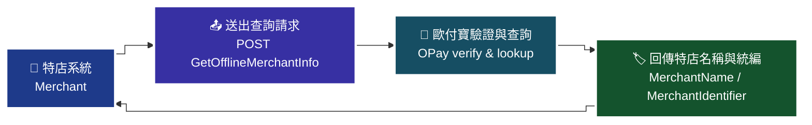

> ⚠️ 圖內細節未能自官方文件的文字內容取得，本圖依 API 語意重繪，請以官方文件圖片為準。

> ♿ 配色遵循 [`docs/accessibility.md`](../docs/accessibility.md)：WCAG AAA 對比 ≥7:1、Okabe-Ito 色盲安全色盤、16px 字體、直角連線、圖示＋文字雙編碼。

### 傳入參數（外層）

| 參數 | 參數名稱 | 型態 | 必填 | 說明 |
|---|---|---|---|---|
| MerchantID | 特店編號 | String(10) | ✅ | 特店編號 |
| RqHeader | 傳入資料 | — | ✅ | — |
| └─ RqHeader.Timestamp | 傳入時間 | Number | ✅ | 時間戳，格式為Unix timestamp<br>注意事項：<br>1. 驗證時間區間暫訂為 10 分鐘內有效，若超過此驗證時間則此次訂單將無法建立，參考資料：http://www.epochconverter.com/ 。<br>2. 合作特店須進行主機「時間校正」，避免主機產生時差，導致API無法正常運作。 |
| Data | 加密資料 | String | ✅ | 此為加密過JSON格式的資料。加密方法說明 |

外層範例：

```json
{
    "MerchantID": "2000132",
    "RqHeader": {
        "Timestamp": 1525168923
    },
    "Data": "…"
}
```

### 傳入 Data 參數（加密前的 JSON）

| 參數 | 參數名稱 | 型態 | 必填 | 說明 |
|---|---|---|---|---|
| MerchantID | 特店編號 | String(10) | ✅ | 特店編號 |

### 傳入 Data 範例

```json
{
    "MerchantID": "2000132"
}
```

### 回傳參數（外層）

| 參數 | 參數名稱 | 型態 | 說明 |
|---|---|---|---|
| MerchantID | 特店編號 | String(10) | — |
| RpHeader | 回傳資料 | — | — |
| └─ RpHeader.Timestamp | 回傳時間 | Number | 時間戳 Unix timestamp |
| TransCode | 回傳代碼 | Int | 1代表傳輸資料(MerchantID, RqHeader, Data)接收成功，其餘均為失敗 |
| TransMsg | 回傳訊息 | String(200) | — |
| Data | 加密資料 | String | 資料內容，此為加密過JSON格式的資料。加密方法說明 |

外層範例：

```json
{
"MerchantID": "2000132",
     "RpHeader": {
        "Timestamp": 1525169058
    },
     "TransCode": 1,
     "TransMsg": "",
     "Data": "…"
}
```

### 回傳 Data 參數

| 參數 | 參數名稱 | 型態 | 說明 |
|---|---|---|---|
| RtnCode | 回應代碼 | Int | 1為成功，其餘為失敗。 |
| RtnMsg | 回應訊息 | String(200) | — |
| MerchantName | 特店名稱 | String(20) | — |
| MerchantIdentifier | 特店統一編號 | String(8) | — |

### 回傳 Data 範例

```json
{
    "RtnCode": 1,
    "RtnMsg": "成功",
  "MerchantName": "歐付寶STAGE測試股份有限公司",
  "MerchantIdentifier": "53538851"
}
```

### 注意事項

- `RqHeader.Timestamp` 的驗證時間區間暫訂為 10 分鐘內有效，若超過此驗證時間則此次訂單將無法建立，參考資料：http://www.epochconverter.com/ 。
- 合作特店須進行主機「時間校正」，避免主機產生時差，導致 API 無法正常運作。
- 原文本章除上述 Timestamp 注意事項外，未另附 ※注意事項區塊。

---

## 2. 查詢財政部配號結果 — `GetGovInvoiceWordSetting`

- **來源**：i301 §6
- **用途**：特店可透過 API 查詢財政部整合服務平台授權於歐付寶之發票號碼配號結果。
- **HTTP Method**：POST（`Content-Type: application/json`）
- **測試環境**：`https://einvoice-stage.opay.tw/B2CInvoice/GetGovInvoiceWordSetting`
- **正式環境**：`https://einvoice.opay.tw/B2CInvoice/GetGovInvoiceWordSetting`

> 🧭 **純文字重述（螢幕閱讀器友善）**：原文此處為「查詢財政部配號結果情境流程圖」。流程為：特店以發票年度（民國年）送出查詢 → 歐付寶接收並驗證 → 歐付寶取出財政部整合服務平台已授權於歐付寶的配號結果 → 回傳配號清單（發票期別、字軌類別、發票字軌、起訖號碼、申請本數）給特店。若查無資料，代表取字軌號碼時未授權於歐付寶，或字軌尚未取號完成。

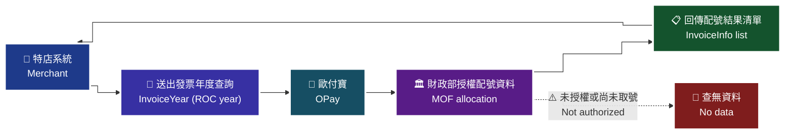

> ⚠️ 圖內細節未能自官方文件的文字內容取得，本圖依 API 語意重繪，請以官方文件圖片為準。

> ♿ 配色遵循 [`docs/accessibility.md`](../docs/accessibility.md)：WCAG AAA 對比 ≥7:1、Okabe-Ito 色盲安全色盤、16px 字體、直角連線、圖示＋文字雙編碼。

### 傳入參數（外層）

| 參數 | 參數名稱 | 型態 | 必填 | 說明 |
|---|---|---|---|---|
| MerchantID | 特店編號 | String(10) | ✅ | 特店編號 |
| RqHeader | 傳入資料 | — | ✅ | — |
| └─ RqHeader.Timestamp | 傳入時間 | Number | ✅ | 時間戳，格式為Unix timestamp<br>注意事項：<br>1. 驗證時間區間暫訂為 10 分鐘內有效，若超過此驗證時間則此次訂單將無法建立，參考資料：http://www.epochconverter.com/ 。<br>2. 合作特店須進行主機「時間校正」，避免主機產生時差，導致API無法正常運作。 |
| Data | 加密資料 | String | ✅ | 此為加密過JSON格式的資料。加密方法說明 |

外層範例：

```json
{
    "MerchantID": "2000132",
    "RqHeader": {
        "Timestamp": 1525168923
    },
    "Data": "…"
}
```

### 傳入 Data 參數（加密前的 JSON）

| 參數 | 參數名稱 | 型態 | 必填 | 說明 |
|---|---|---|---|---|
| MerchantID | 特店編號 | String(10) | ✅ | 特店編號 |
| InvoiceYear | 發票年度 | String(3) | ✅ | 僅可查詢去年、當年與明年的發票年度 格式為民國年 ex:110 |

### 傳入 Data 範例

```json
{
    "MerchantID": "2000132",
    "InvoiceYear": "110"
}
```

### 回傳參數（外層）

| 參數 | 參數名稱 | 型態 | 說明 |
|---|---|---|---|
| MerchantID | 特店編號 | String(10) | — |
| RpHeader | 回傳資料 | — | — |
| └─ RpHeader.Timestamp | 回傳時間 | Number | 時間戳 Unix timestamp |
| TransCode | 回傳代碼 | Int | 1代表傳輸資料(MerchantID, RqHeader, Data)接收成功，其餘均為失敗 |
| TransMsg | 回傳訊息 | String(200) | — |
| Data | 加密資料 | String | 資料內容，此為加密過JSON格式的資料。加密方法說明 |

外層範例：

```json
{
"MerchantID": "2000132",
     "RpHeader": {
        "Timestamp": 1525169058
    },
     "TransCode": 1,
     "TransMsg": "",
     "Data": "…"
}
```

### 回傳 Data 參數

| 參數 | 參數名稱 | 型態 | 說明 |
|---|---|---|---|
| RtnCode | 回應代碼 | Int | 1為成功，其餘為失敗。 |
| RtnMsg | 回應訊息 | String(200) | — |
| InvoiceInfo | 發票配號結果清單 | Array | — |
| └─ InvoiceInfo[].InvoiceTerm | 發票期別 | Int | 1: 1-2月 ,2: 3-4月 ,3: 5-6月 ,4: 7-8月 ,5: 9-10月 ,6: 11-12月 |
| └─ InvoiceInfo[].InvType | 字軌類別 | String(2) | 07:一般稅額發票　08:特種稅額發票 |
| └─ InvoiceInfo[].InvoiceHeader | 發票字軌 | String(2) | 發票字軌名稱　ex:KK |
| └─ InvoiceInfo[].InvoiceStart | 起始發票編號 | String(8) | 8碼發票號碼，尾數需為00或50。(例：10000000) |
| └─ InvoiceInfo[].InvoiceEnd | 結束發票編號 | String(8) | 8碼發票號碼，尾數需為49或99。(例：10000049) |
| └─ InvoiceInfo[].Number | 申請本數 | Int | 本數為特店向財政部申請字軌配號的單位。一本為50個發票號碼。 |

### 回傳 Data 範例

```json
{
    "RtnCode": 1,
    "RtnMsg": "成功",
    "InvoiceInfo": [{
        "InvoiceTerm": 1,
        "InvType": "07",
"InvoiceHeader": "KK",
"InvoiceStart": "10000000",
"InvoiceEnd": "10000049",
"Number": 1
    }]
}
```

### 注意事項

- ※注意事項：如查無資料，可能的原因為取字軌號碼時並未授權於歐付寶，或字軌尚未取號完成。
- `InvoiceYear` 僅可查詢去年、當年與明年的發票年度，格式為民國年（ex: 110）。
- `RqHeader.Timestamp` 驗證時間區間暫訂為 10 分鐘內有效，超過則無法建立；合作特店須進行主機「時間校正」。

---

## 3. 管理發票機台 — `OfflineMerchantPosSetting`

- **來源**：i301 §7
- **用途**：設定字軌前必須要先至歐付寶設定開立電子發票的機台資料。本 API 提供新增／修改／刪除發票機台 ID。
- **HTTP Method**：POST（`Content-Type: application/json`）
- **測試環境**：`https://einvoice-stage.opay.tw/B2CInvoice/OfflineMerchantPosSetting`
- **正式環境**：`https://einvoice.opay.tw/B2CInvoice/OfflineMerchantPosSetting`

> 🧭 **純文字重述（螢幕閱讀器友善）**：原文此處為「管理發票機台情境流程圖」。流程為：特店以 `ActionType`（1 新增、2 修改、3 刪除）與 `MachineID` 送出請求 → 歐付寶驗證；若該機台 ID 已設定過字軌配號，修改與刪除會被拒絕 → 驗證通過則寫入機台設定 → 回傳 `RtnCode` / `RtnMsg`。此步驟必須在「字軌與配號設定」之前完成。

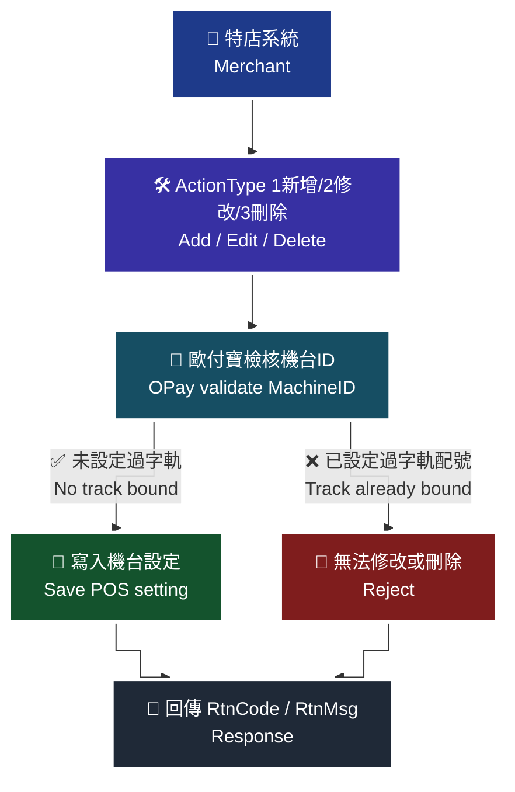

> ⚠️ 圖內細節未能自官方文件的文字內容取得，本圖依 API 語意重繪，請以官方文件圖片為準。

> ♿ 配色遵循 [`docs/accessibility.md`](../docs/accessibility.md)：WCAG AAA 對比 ≥7:1、Okabe-Ito 色盲安全色盤、16px 字體、直角連線、圖示＋文字雙編碼。

### 傳入參數（外層）

| 參數 | 參數名稱 | 型態 | 必填 | 說明 |
|---|---|---|---|---|
| MerchantID | 特店編號 | String(10) | ✅ | 特店編號 |
| RqHeader | 傳入資料 | — | ✅ | — |
| └─ RqHeader.Timestamp | 傳入時間 | Number | ✅ | 時間戳，格式為Unix timestamp<br>注意事項：<br>1. 驗證時間區間暫訂為 10 分鐘內有效，若超過此驗證時間則此次訂單將無法建立，參考資料：http://www.epochconverter.com/ 。<br>2. 合作特店須進行主機「時間校正」，避免主機產生時差，導致API無法正常運作。 |
| Data | 加密資料 | String | ✅ | 此為加密過JSON格式的資料。加密方法說明 |

外層範例：

```json
{
    "MerchantID": "2000132",
    "RqHeader": {
        "Timestamp": 1525168923
    },
    "Data": "…"
}
```

### 傳入 Data 參數（加密前的 JSON）

| 參數 | 參數名稱 | 型態 | 必填 | 說明 |
|---|---|---|---|---|
| ActionType | 管理功能類別 | Int | ✅ | 1:新增，2:修改，3:刪除 |
| MachineID | 發票機台ID | String(10) | ✅ | 廠商開立發票的機台ID;<br>當此ID已設定過字軌配號時，將無法進行修改ID與刪除。<br>注意事項:<br>請勿使用特殊符號作為機台ID |
| Remark | 備註 | String(100) | — | — |

> ⚠️ 原文本 API 的傳入 Data 表格未列出 `MerchantID`，範例中亦未帶。其他 API 的 Data 皆需帶 `MerchantID`，此處是否可省略，原文未明確說明，介接前請向歐付寶確認。

### 傳入 Data 範例

```json
{
    "ActionType": 1,
    "MachineID": "ABCD"
}
```

### 回傳參數（外層）

| 參數 | 參數名稱 | 型態 | 說明 |
|---|---|---|---|
| MerchantID | 特店編號 | String(10) | — |
| RpHeader | 回傳資料 | — | — |
| └─ RpHeader.Timestamp | 回傳時間 | Number | 時間戳 Unix timestamp |
| TransCode | 回傳代碼 | Int | 1代表傳輸資料(MerchantID, RqHeader, Data)接收成功，其餘均為失敗 |
| TransMsg | 回傳訊息 | String(200) | — |
| Data | 加密資料 | String | 資料內容，此為加密過JSON格式的資料。加密方法說明 |

外層範例：

```json
{
"MerchantID": "2000132",
     "RpHeader": {
        "Timestamp": 1525169058
    },
     "TransCode": 1,
     "TransMsg": "",
     "Data": "…"
}
```

### 回傳 Data 參數

| 參數 | 參數名稱 | 型態 | 說明 |
|---|---|---|---|
| RtnCode | 回應代碼 | Int | 1為成功，其餘為失敗。 |
| RtnMsg | 回應訊息 | String (200) | — |

### 回傳 Data 範例

```json
{
    "RtnCode": 1,
    "RtnMsg": "成功"
}
```

### 注意事項

- 設定字軌前必須要先至歐付寶設定開立電子發票的機台資料（本 API 或廠商後台）。
- `MachineID` 當此 ID 已設定過字軌配號時，將無法進行修改 ID 與刪除。
- **請勿使用特殊符號作為機台 ID。**
- `RqHeader.Timestamp` 驗證時間區間暫訂為 10 分鐘內有效，超過則無法建立；合作特店須進行主機「時間校正」。

---

## 4. 查詢發票機台 — `QueryOfflineMerchantPosSetting`

- **來源**：i301 §8
- **用途**：特店可查詢「管理發票機台 API」或廠商後台設定的發票機台資訊。
- **HTTP Method**：POST（`Content-Type: application/json`）
- **測試環境**：`https://einvoice-stage.opay.tw/B2CInvoice/QueryOfflineMerchantPosSetting`
- **正式環境**：`https://einvoice.opay.tw/B2CInvoice/QueryOfflineMerchantPosSetting`

> 🧭 **純文字重述（螢幕閱讀器友善）**：原文此處為「查詢發票機台情境流程圖」。流程為：特店以 `MerchantID` 送出查詢 → 歐付寶驗證後，取出該特店透過 API 或廠商後台設定的所有發票機台 → 回傳 `MachineIDList` 清單，每筆含機台 ID、建立時間與備註。


> ⚠️ 圖內細節未能自官方文件的文字內容取得，本圖依 API 語意重繪，請以官方文件圖片為準。

> ♿ 配色遵循 [`docs/accessibility.md`](../docs/accessibility.md)：WCAG AAA 對比 ≥7:1、Okabe-Ito 色盲安全色盤、16px 字體、直角連線、圖示＋文字雙編碼。

### 傳入參數（外層）

| 參數 | 參數名稱 | 型態 | 必填 | 說明 |
|---|---|---|---|---|
| MerchantID | 特店編號 | String(10) | ✅ | 特店編號 |
| RqHeader | 傳入資料 | — | ✅ | — |
| └─ RqHeader.Timestamp | 傳入時間 | Number | ✅ | 時間戳，格式為Unix timestamp<br>注意事項：<br>1. 驗證時間區間暫訂為 10 分鐘內有效，若超過此驗證時間則此次訂單將無法建立，參考資料：http://www.epochconverter.com/ 。<br>2. 合作特店須進行主機「時間校正」，避免主機產生時差，導致API無法正常運作。 |
| Data | 加密資料 | String | ✅ | 此為加密過JSON格式的資料。加密方法說明 |

外層範例：

```json
{
    "MerchantID": "2000132",
    "RqHeader": {
        "Timestamp": 1525168923
    },
    "Data": "…"
}
```

### 傳入 Data 參數（加密前的 JSON）

| 參數 | 參數名稱 | 型態 | 必填 | 說明 |
|---|---|---|---|---|
| MerchantID | 特店編號 | String(10) | ✅ | — |

（原文欄位名寫作 `* MerchantID`，星號與名稱間有一個空格，實際欄位名為 `MerchantID`。）

### 傳入 Data 範例

```json
{
  "MerchantID": "2000132"
}
```

### 回傳參數（外層）

| 參數 | 參數名稱 | 型態 | 說明 |
|---|---|---|---|
| MerchantID | 特店編號 | String(10) | — |
| RpHeader | 回傳資料 | — | — |
| └─ RpHeader.Timestamp | 回傳時間 | Number | 時間戳Unix timestamp |
| TransCode | 回傳代碼 | Int | 1代表傳輸資料(MerchantID, RqHeader, Data)接收成功，其餘均為失敗 |
| TransMsg | 回傳訊息 | String(200) | — |
| Data | 加密資料 | String | 資料內容，此為加密過JSON格式的資料。加密方法說明 |

外層範例：

```json
{
"MerchantID": "2000132",
     "RpHeader": {
        "Timestamp": 1525169058
    },
     "TransCode": 1,
     "TransMsg": "",
     "Data": "…"
}
```

### 回傳 Data 參數

| 參數 | 參數名稱 | 型態 | 說明 |
|---|---|---|---|
| RtnCode | 回應代碼 | Int | 1為成功，其餘為失敗。 |
| RtnMsg | 回應訊息 | String(200) | — |
| MachineIDList | 發票機台清單 | Array | — |
| └─ MachineIDList[].MachineID | 發票機台ID | String(10) | — |
| └─ MachineIDList[].CreateTime | 建立時間 | String(20) | yyyy/MM/dd HH:mm |
| └─ MachineIDList[].Remark | 備註 | String(100) | — |

### 回傳 Data 範例

```json
{
    "RtnCode": 1,
    "RtnMsg": "成功",
"MachineIDList": {
        "MachineID": "ABCD"
        "CreateTime": "2021/10/07 10:10:12"
        "Remark": ""
    },{
        "MachineID": "EFGH
        "CreateTime": "2021/10/0810:10:12"
        "Remark": ""
    }
}
```

> ⚠️ 原文範例語法瑕疵，已照原文保留。（缺少物件屬性間的逗號；`"EFGH` 少一個結束引號；`MachineIDList` 依欄位說明為 Array 卻以物件並列的形式書寫；`"2021/10/0810:10:12"` 日期與時間間缺空格，且 `CreateTime` 說明的格式為 `yyyy/MM/dd HH:mm` 但範例含秒數。實際回傳格式請以歐付寶為準。）

### 注意事項

- 本 API 查得的機台，來源包含「管理發票機台 API」與「廠商後台」兩種設定方式。
- `RqHeader.Timestamp` 驗證時間區間暫訂為 10 分鐘內有效，超過則無法建立；合作特店須進行主機「時間校正」。
- 原文本章未另附 ※注意事項區塊。

---

## 5. 字軌與配號設定 — `AddInvoiceWordSetting`

- **來源**：i301 §9
- **用途**：當營業人（特店）取得財政部的配號結果後，可建立當年度（含當月）或下個年度的字軌。在開立發票之前，必須先設定字軌區間，並且可設定多組。
- **HTTP Method**：POST（`Content-Type: application/json`）
- **測試環境**：`https://einvoice-stage.opay.tw/B2CInvoice/AddInvoiceWordSetting`
- **正式環境**：`https://einvoice.opay.tw/B2CInvoice/AddInvoiceWordSetting`

> 🧭 **純文字重述（螢幕閱讀器友善）**：原文此處為「新增字軌情境流程圖」。流程為：特店先向財政部取得配號結果（可用 `GetGovInvoiceWordSetting` 查詢）→ 特店以發票年度、期別、字軌類別、發票種類固定為 4（離線發票）、字軌、起訖號碼與機台 ID 呼叫本 API → 歐付寶建立字軌區間，狀態預設為「已審核通過」且會自動啟用一組字軌 → 回傳 `TrackID`，特店需留存此 ID，作為後續設定字軌號碼啟用狀態之用。

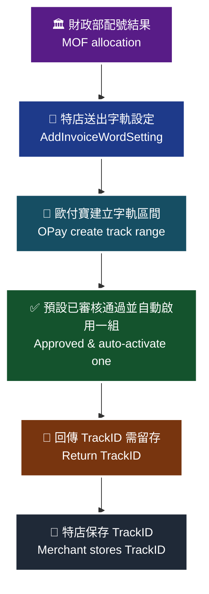

> ⚠️ 圖內細節未能自官方文件的文字內容取得，本圖依 API 語意重繪，請以官方文件圖片為準。

> ♿ 配色遵循 [`docs/accessibility.md`](../docs/accessibility.md)：WCAG AAA 對比 ≥7:1、Okabe-Ito 色盲安全色盤、16px 字體、直角連線、圖示＋文字雙編碼。

### 傳入參數（外層）

| 參數 | 參數名稱 | 型態 | 必填 | 說明 |
|---|---|---|---|---|
| MerchantID | 特店編號 | String(10) | ✅ | 特店編號 |
| RqHeader | 傳入資料 | — | ✅ | — |
| └─ RqHeader.Timestamp | 傳入時間 | Number | ✅ | 時間戳，格式為 Unix timestamp<br>注意事項：<br>1. 驗證時間區間暫訂為 10 分鐘內有效，若超過此驗證時間則此次訂單將無法建立，參考資料：http://www.epochconverter.com/ 。<br>2. 合作特店須進行主機「時間校正」，避免主機產生時差，導致API無法正常運作。 |
| Data | 加密資料 | String | ✅ | 資料內容，此為加密過JSON格式的資料。加密方法說明 |

外層範例：

```json
{
    "MerchantID": "2000132",
    "RqHeader": {
        "Timestamp": 1525168923
    },
    "Data": "…"
}
```

### 傳入 Data 參數（加密前的 JSON）

| 參數 | 參數名稱 | 型態 | 必填 | 說明 |
|---|---|---|---|---|
| MerchantID | 特店編號 | String(10) | ✅ | — |
| InvoiceTerm | 發票期別 | Int | ✅ | 1: 1-2月，2: 3-4月，3: 5-6月，4: 7-8月，5: 9-10月，6: 11-12月<br>注意事項:<br>不可帶入小於當年的期別 |
| InvoiceYear | 發票年度 | String(3) | ✅ | 僅可設定當年與明年 ex:109 |
| InvType | 字軌類別 | String(2) | ✅ | 07:一般稅額發票，08:特種稅額發票 |
| InvoiceCategory | 發票種類 | String(1) | ✅ | 請固定填寫4:離線發票。 |
| InvoiceHeader | 發票字軌 | String(2) | ✅ | — |
| InvoiceStart | 起始發票編號 | String(8) | ✅ | 請輸入8碼發票號碼，尾數需為00或50。(例：10000000) |
| InvoiceEnd | 結束發票編號 | String(8) | ✅ | 請輸入8碼發票號碼，尾數需為49或99。(例：10000049) |
| MachineID | 發票機台ID | String(10) | ✅ | — |

### 傳入 Data 範例

```json
{
    "MerchantID": "2000132",
    "InvoiceTerm": "1",
    "InvoiceYear": "109",
    "InvType": "07",
    "InvoiceCategory": "4",
    "InvoiceHeader": "TW",
    "InvoiceStart": "10000000",
    "InvoiceEnd": "10000049"
  "MachineID": "A123345",
}
```

> ⚠️ 原文範例語法瑕疵，已照原文保留。（`"InvoiceEnd"` 之後缺少逗號；`"MachineID"` 之後多一個逗號形成 trailing comma；另外 `InvoiceTerm` 欄位型態為 Int，範例卻以字串 `"1"` 表示。）

### 回傳參數（外層）

| 參數 | 參數名稱 | 型態 | 說明 |
|---|---|---|---|
| MerchantID | 特店編號 | String(10) | — |
| RpHeader | 回傳資料 | — | — |
| └─ RpHeader.Timestamp | 回傳時間 | Number | 時間戳Unix timestamp |
| TransCode | 回傳代碼 | Int | 1代表傳輸資料(MerchantID, RqHeader, Data)接收成功，其餘均為失敗 |
| TransMsg | 回傳訊息 | String(200) | 回傳訊息 |
| Data | 加密資料 | String | 資料內容，此為加密過JSON格式的資料。加密方法說明 |

外層範例：

```json
{
    "MerchantID": "2000132",
    "RpHeader": {
        "Timestamp": 1525169058
    },
    "TransCode": 1,
    "TransMsg": "",
    "Data": "…"
}
```

### 回傳 Data 參數

| 參數 | 參數名稱 | 型態 | 說明 |
|---|---|---|---|
| RtnCode | 回應代碼 | Int | 1為成功，其餘為失敗。 |
| RtnMsg | 回應訊息 | String(200) | — |
| TrackID | 字軌號碼ID | String(10) | 需留存TrackID作為設定字軌號碼啟用狀態用 |

### 回傳 Data 範例

```json
{
     "RtnCode": 1,
    "RtnMsg": "成功",
  "TrackID": "1234567890"
}
```

### 注意事項

- ※注意事項：新增字軌後，字軌狀態預設為已審核通過且會自動啟用一組字軌。
- 可建立當年度（含當月）或下個年度的字軌；`InvoiceYear` 僅可設定當年與明年。
- `InvoiceTerm` 不可帶入小於當年的期別。
- 在開立發票之前，必須先設定字軌區間，並且可設定多組。
- `InvoiceCategory` 請固定填寫 `4`（離線發票）。
- `InvoiceStart` 尾數需為 00 或 50；`InvoiceEnd` 尾數需為 49 或 99。
- 務必留存回傳的 `TrackID`，設定字軌號碼狀態（§10）需使用。
- `RqHeader.Timestamp` 驗證時間區間暫訂為 10 分鐘內有效，超過則無法建立；合作特店須進行主機「時間校正」。

---

## 6. 設定字軌號碼狀態 — `UpdateInvoiceWordStatus`

- **來源**：i301 §10
- **用途**：營業人（特店）新增字軌後，字軌的預設狀態皆為已審核且會自動啟用一組字軌。當特店需要停用、暫停或再次啟用字軌時可使用此 API 功能。
- **HTTP Method**：POST（`Content-Type: application/json`）
- **測試環境**：`https://einvoice-stage.opay.tw/B2CInvoice/UpdateInvoiceWordStatus`
- **正式環境**：`https://einvoice.opay.tw/B2CInvoice/UpdateInvoiceWordStatus`

> 🧭 **純文字重述（螢幕閱讀器友善）**：原文此處為「設定字軌號碼情境流程圖」。流程為：特店取出新增字軌時保存的 `TrackID` → 以 `InvoiceStatus`（0 停用、1 暫停、2 啟用）呼叫本 API → 歐付寶更新該字軌區間的狀態 → 回傳 `RtnCode` / `RtnMsg`。若狀態被設定為「停用」，該字軌區間即無法上傳發票。

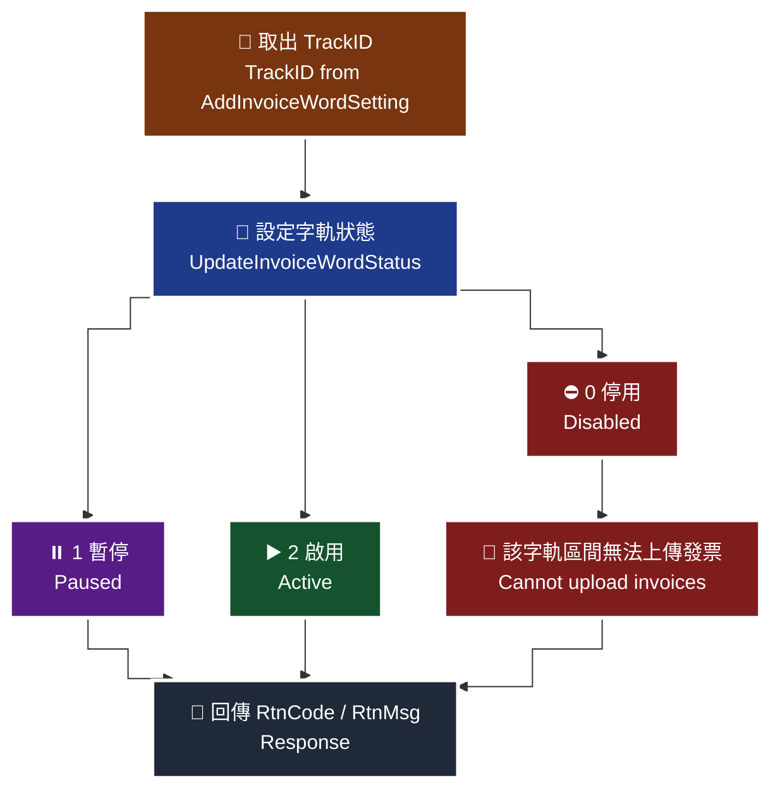

> ⚠️ 圖內細節未能自官方文件的文字內容取得，本圖依 API 語意重繪，請以官方文件圖片為準。

> ♿ 配色遵循 [`docs/accessibility.md`](../docs/accessibility.md)：WCAG AAA 對比 ≥7:1、Okabe-Ito 色盲安全色盤、16px 字體、直角連線、圖示＋文字雙編碼。

### 傳入參數（外層）

| 參數 | 參數名稱 | 型態 | 必填 | 說明 |
|---|---|---|---|---|
| MerchantID | 特店編號 | String(10) | ✅ | 特店編號 |
| RqHeader | 傳入資料 | — | — | 原文此列未標示紅色星號 |
| └─ RqHeader.Timestamp | 傳入時間 | Number | ✅ | 時間戳，格式為 Unix timestamp<br>注意事項：<br>1. 驗證時間區間暫訂為 10 分鐘內有效，若超過此驗證時間則此次訂單將無法建立，參考資料：http://www.epochconverter.com/ 。<br>2. 合作特店須進行主機「時間校正」，避免主機產生時差，導致API無法正常運作。 |
| Data | 加密資料 | String | ✅ | 資料內容，此為加密過JSON格式的資料。加密方法說明 |

> ⚠️ 原文自 §10 起的外層表格，`RqHeader` 本身未標星號，但其子欄位 `Timestamp` 標為必填、範例亦必帶 `RqHeader`。實務上仍應帶入 `RqHeader`；原文未明確說明，介接前請向歐付寶確認。

外層範例：

```json
{
    "MerchantID": "2000123",
    "RqHeader": {
        "Timestamp": 1525168923
    },
    "Data": "…"
}
```

### 傳入 Data 參數（加密前的 JSON）

| 參數 | 參數名稱 | 型態 | 必填 | 說明 |
|---|---|---|---|---|
| MerchantID | 特店編號 | String(10) | ✅ | — |
| TrackID | 字軌號碼ID | String(10) | ✅ | 為新增字軌後取到的TrackID |
| InvoiceStatus | 發票字軌狀態 | Int | ✅ | 0:停用, 1:暫停, 2:啟用<br>如狀態設定為停用，該字軌區間無法上傳發票 |

### 傳入 Data 範例

```json
{
    "MerchantID": "2000123",
    "TrackID": "1234567890",
     "InvoiceStatus": 2
}
```

### 回傳參數（外層）

| 參數 | 參數名稱 | 型態 | 說明 |
|---|---|---|---|
| MerchantID | 特店編號 | String(10) | — |
| RpHeader | 回傳資料 | — | — |
| └─ RpHeader.Timestamp | 回傳時間 | Number | 時間戳 Unix timestamp |
| TransCode | 回傳代碼 | Int | 1代表傳輸資料(MerchantID, RqHeader, Data)接收成功，其餘均為失敗 |
| TransMsg | 回傳訊息 | String(200) | 回傳訊息 |
| Data | 加密資料 | String | 資料內容，此為加密過JSON格式的資料。加密方法說明 |

外層範例：

```json
{
    "MerchantID": "2000123",
    "RpHeader": {
        "Timestamp": 1525169058
    },
    "TransCode": 1,
    "TransMsg": "",
    "Data": "…"
}
```

### 回傳 Data 參數

| 參數 | 參數名稱 | 型態 | 說明 |
|---|---|---|---|
| RtnCode | 回應代碼 | Int | 1為成功，其餘為失敗。 |
| RtnMsg | 回應訊息 | String(200) | — |

### 回傳 Data 範例

```json
{
    "RtnCode": "1",
    "RtnMsg": "成功"
}
```

> ⚠️ 原文範例語法瑕疵，已照原文保留。（`RtnCode` 欄位型態為 Int，範例卻以字串 `"1"` 表示。）

### 注意事項

- 新增字軌後，字軌的預設狀態皆為已審核且會自動啟用一組字軌。
- `InvoiceStatus` 若設定為 `0`（停用），該字軌區間無法上傳發票。
- `TrackID` 為新增字軌（§9 `AddInvoiceWordSetting`）後取到的值。
- **本 API 的 `InvoiceStatus` 列舉（0 停用／1 暫停／2 啟用）與 §12 取得字軌號碼 API 的 `InvoiceStatus` 列舉（1 啟用／2 備用字軌）、§15 查詢字軌的 `UseStatus` 列舉（1 未啟用／2 使用中／3 已停用／4 暫停中／5 待審核／6 審核不通過）三者定義不同，請勿混用。**
- `RqHeader.Timestamp` 驗證時間區間暫訂為 10 分鐘內有效，超過則無法建立；合作特店須進行主機「時間校正」。

---

## 7. 取得自動配發發票字軌號碼 — `GetOfflineInvoiceWordSettingWithAutoSplit`

- **來源**：i301 §11
- **用途**：營業人（特店）在開立發票前，必須先取得已啟用的發票字軌號碼。本 API 用以取得營業人於廠商後台設定之「自動配號」後的字軌號碼；回傳形式為一組發票號碼區間（含字軌、發票起訖號碼）。如果特店在開立發票時，只需要知道可開立的字軌號碼區間並且後續可自行組成電子發票內容，可選擇此 API 做串接。
- **HTTP Method**：POST（`Content-Type: application/json`）
- **測試環境**：`https://einvoice-stage.opay.tw/B2CInvoice/GetOfflineInvoiceWordSettingWithAutoSplit`
- **正式環境**：`https://einvoice.opay.tw/B2CInvoice/GetOfflineInvoiceWordSettingWithAutoSplit`

> 🧭 **純文字重述（螢幕閱讀器友善）**：原文此處為「取得自動配號發票字軌號碼區間情境流程圖」。流程為：特店先於廠商後台設定自動配號規則 → 特店以發票年度、期別、機台 ID 與字軌類別呼叫本 API → 歐付寶依後台設定的自動配號規則，自該機台已啟用的字軌中切分出一段區間 → 回傳 `InvoiceHeader`、`InvoiceStart`、`InvoiceEnd` → 特店據此自行開立發票。

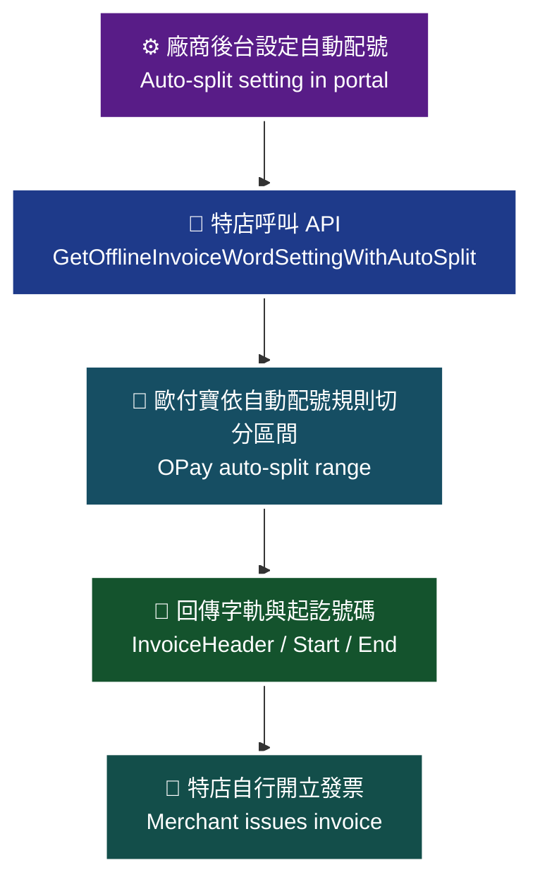

> ⚠️ 圖內細節未能自官方文件的文字內容取得，本圖依 API 語意重繪，請以官方文件圖片為準。

> ♿ 配色遵循 [`docs/accessibility.md`](../docs/accessibility.md)：WCAG AAA 對比 ≥7:1、Okabe-Ito 色盲安全色盤、16px 字體、直角連線、圖示＋文字雙編碼。

### 傳入參數（外層）

| 參數 | 參數名稱 | 型態 | 必填 | 說明 |
|---|---|---|---|---|
| MerchantID | 特店編號 | String(10) | ✅ | 特店編號 |
| RqHeader | 傳入資料 | — | — | 原文此列未標示紅色星號 |
| └─ RqHeader.Timestamp | 傳入時間 | Number | ✅ | 時間戳，格式為 Unix timestamp<br>注意事項：<br>1. 驗證時間區間暫訂為 10 分鐘內有效，若超過此驗證時間則此次訂單將無法建立，參考資料：http://www.epochconverter.com/ 。<br>2. 合作特店須進行主機「時間校正」，避免主機產生時差，導致API無法正常運作。 |
| Data | 加密資料 | String | ✅ | 資料內容，此為加密過JSON格式的資料。加密方法說明 |

外層範例：

```json
{
    "MerchantID": "2000132",
    "RqHeader": {
        "Timestamp": 1525168923
    },
    "Data": "…"
}
```

### 傳入 Data 參數（加密前的 JSON）

| 參數 | 參數名稱 | 型態 | 必填 | 說明 |
|---|---|---|---|---|
| MerchantID | 特店編號 | String(10) | ✅ | — |
| InvoiceYear | 發票年度 | String(3) | ✅ | 僅可設定當年與明年，ex:109 |
| InvoiceTerm | 發票期別 | Int | ✅ | 不可帶入小於當年期別 1: 1-2月，2: 3-4月，3: 5-6月，4: 7-8月，5: 9-10月，6: 11-12月 |
| MachineID | 發票機台ID | String(10) | ✅ | — |
| InvType | 字軌類別 | String(2) | ✅ | 07: 一般稅額發票 08: 特種稅額發票 |

### 傳入 Data 範例

```json
{
    "MerchantID": "2000132",
    "InvoiceYear": "109",
    "InvoiceTerm": 1,
"MachineID": "A123456"
}
```

> ⚠️ 原文範例語法瑕疵，已照原文保留。（範例缺少表格中標示為必填的 `InvType` 欄位；縮排亦不一致。實作時請依表格帶入 `InvType`。）

### 回傳參數（外層）

| 參數 | 參數名稱 | 型態 | 說明 |
|---|---|---|---|
| MerchantID | 特店編號 | String(10) | — |
| RpHeader | 回傳資料 | — | — |
| └─ RpHeader.Timestamp | 回傳時間 | Number | 時間戳 Unix timestamp |
| TransCode | 回傳代碼 | Int | 1代表傳輸資料(MerchantID, RqHeader, Data)接收成功，其餘均為失敗 |
| TransMsg | 回傳訊息 | String(200) | 回傳訊息 |
| Data | 加密資料 | String | 資料內容，此為加密過JSON格式的資料。加密方法說明 |

外層範例：

```json
{
    "MerchantID": "2000132",
    "RpHeader": {
        "Timestamp": 1525169058
    },
    "TransCode": 1,
    "TransMsg": "",
    "Data": "…"
}
```

### 回傳 Data 參數

| 參數 | 參數名稱 | 型態 | 說明 |
|---|---|---|---|
| RtnCode | 回應代碼 | Int | 1為成功，其餘為失敗。 |
| RtnMsg | 回應訊息 | String(200) | — |
| InvoiceHeader | 發票字軌 | String(2) | — |
| InvoiceStart | 起始發票編號 | String(8) | — |
| InvoiceEnd | 結束發票編號 | String(8) | — |

### 回傳 Data 範例

```json
{
    "RtnCode": 1,
    "RtnMsg": "成功",
    "InvoiceHeader": "AA",
    "InvoiceStart": "10000000 ",
    "InvoiceEnd": "10000049"
}
```

> ⚠️ 原文範例語法瑕疵，已照原文保留。（`"InvoiceStart": "10000000 "` 字串尾端多一個空白字元。）

### 注意事項

- 本 API 取得的號碼，來源是「營業人於廠商後台設定之自動配號」；使用前需先在廠商後台完成自動配號設定。
- `InvoiceYear` 僅可設定當年與明年；`InvoiceTerm` 不可帶入小於當年期別。
- 本 API 與 §12 的兩支取號 API 功能相近，特店擇一串接即可。
- 原文本章未另附 ※注意事項區塊；亦**未**說明自動配號的切分數量、區間長度或重複呼叫時的行為。
- > ⚠️ 原文未明確說明自動配號（auto split）的切分規則（每次配發幾號、是否可重複取號、取完後的行為），介接前請向歐付寶確認。

---

## 8. 取得發票字軌號碼（區間） — `GetOfflineInvoiceWordSetting`

- **來源**：i301 §12（12-1 取得發票字軌號碼區間）
- **用途**：營業人（特店）在開立發票前，必須先取得已啟用的發票字軌號碼。此 API 取得的發票字軌號碼，形式為回傳一組發票號碼區間，內容包含字軌、發票起訖號碼等。如果特店在開立發票時，只需要知道可開立的字軌號碼區間並且後續可自行組成電子發票內容，可選擇此 API 做串接。
- **HTTP Method**：POST（`Content-Type: application/json`）
- **測試環境**：`https://einvoice-stage.opay.tw/B2CInvoice/GetOfflineInvoiceWordSetting`
- **正式環境**：`https://einvoice.opay.tw/B2CInvoice/GetOfflineInvoiceWordSetting`

> 🧭 **純文字重述（螢幕閱讀器友善）**：原文此處為「取得發票字軌號碼區間情境流程圖」。流程為：特店以發票年度、期別、字軌狀態（1 啟用／2 備用字軌）與機台 ID 呼叫本 API → 歐付寶找出符合條件的字軌區間 → 回傳字軌、起訖號碼、字軌狀態與已取次數 `Times` → 特店自行組成電子發票內容並開立。歐付寶另提供 `GetOfflineInvoiceWordSettingNumber`（回傳含隨機碼與 AES 加密資料的清單），兩者功能相同但回傳內容有差異，特店擇一串接即可。

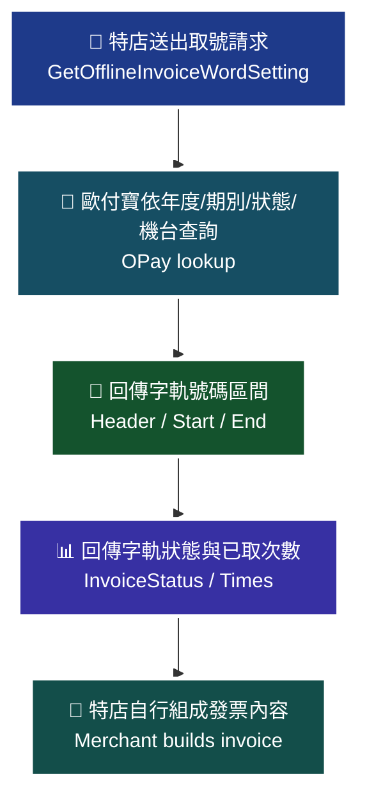

> ⚠️ 圖內細節未能自官方文件的文字內容取得，本圖依 API 語意重繪，請以官方文件圖片為準。

> ♿ 配色遵循 [`docs/accessibility.md`](../docs/accessibility.md)：WCAG AAA 對比 ≥7:1、Okabe-Ito 色盲安全色盤、16px 字體、直角連線、圖示＋文字雙編碼。

### 傳入參數（外層）

| 參數 | 參數名稱 | 型態 | 必填 | 說明 |
|---|---|---|---|---|
| MerchantID | 特店編號 | String(10) | ✅ | 特店編號 |
| RqHeader | 傳入資料 | — | — | 原文此列未標示紅色星號 |
| └─ RqHeader.Timestamp | 傳入時間 | Number | ✅ | 時間戳，格式為 Unix timestamp<br>注意事項：<br>1. 驗證時間區間暫訂為 10 分鐘內有效，若超過此驗證時間則此次訂單將無法建立，參考資料：http://www.epochconverter.com/ 。<br>2. 合作特店須進行主機「時間校正」，避免主機產生時差，導致API無法正常運作。 |
| Data | 加密資料 | String | ✅ | 資料內容，此為加密過JSON格式的資料。加密方法說明 |

外層範例：

```json
{
    "MerchantID": "2000132",
    "RqHeader": {
        "Timestamp": 1525168923
    },
    "Data": "…"
}
```

### 傳入 Data 參數（加密前的 JSON）

| 參數 | 參數名稱 | 型態 | 必填 | 說明 |
|---|---|---|---|---|
| MerchantID | 特店編號 | String(10) | ✅ | — |
| InvoiceYear | 發票年度 | String(3) | ✅ | 僅可設定當年與明年，ex:109 |
| InvoiceTerm | 發票期別 | Int | ✅ | 不可帶入小於當年期別 1: 1-2月，2: 3-4月，3: 5-6月，4: 7-8月，5: 9-10月，6: 11-12月 |
| InvoiceStatus | 發票字軌狀態 | Int | ✅ | 1:啟用，2:備用字軌 |
| MachineID | 發票機台ID | String(10) | ✅ | — |

### 傳入 Data 範例

```json
{
    "MerchantID": "2000132",
    "InvoiceYear": "109",
    "InvoiceTerm": 1,
    "InvoiceStatus": 1,
"MachineID": "A123456"
}
```

### 回傳參數（外層）

| 參數 | 參數名稱 | 型態 | 說明 |
|---|---|---|---|
| MerchantID | 特店編號 | String(10) | — |
| RpHeader | 回傳資料 | — | — |
| └─ RpHeader.Timestamp | 回傳時間 | Number | 時間戳 Unix timestamp |
| TransCode | 回傳代碼 | Int | 1代表傳輸資料(MerchantID, RqHeader, Data)接收成功，其餘均為失敗 |
| TransMsg | 回傳訊息 | String(200) | 回傳訊息 |
| Data | 加密資料 | String | 資料內容，此為加密過JSON格式的資料。加密方法說明 |

外層範例：

```json
{
    "MerchantID": "2000132",
    "RpHeader": {
        "Timestamp": 1525169058
    },
    "TransCode": 1,
    "TransMsg": "",
    "Data": "…"
}
```

### 回傳 Data 參數

| 參數 | 參數名稱 | 型態 | 說明 |
|---|---|---|---|
| RtnCode | 回應代碼 | Int | 1為成功，其餘為失敗。 |
| RtnMsg | 回應訊息 | String(200) | — |
| InvoiceHeader | 發票字軌 | String(2) | — |
| InvoiceStart | 起始發票編號 | String(8) | — |
| InvoiceEnd | 結束發票編號 | String(8) | — |
| InvoiceStatus | 發票字軌狀態 | Int | 1:啟用, 2:備用字軌 |
| Times | 已取次數 | Int | 相同字軌,已取用的次數 |

### 回傳 Data 範例

```json
{
    "RtnCode": 1,
    "RtnMsg": "成功",
    "InvoiceHeader": "AA",
    "InvoiceStart": "10000000 ",
    "InvoiceEnd": "10000049",
    "InvoiceStatus": 1,
    "Times": 1
}
```

> ⚠️ 原文範例語法瑕疵，已照原文保留。（`"InvoiceStart": "10000000 "` 字串尾端多一個空白字元。）

### 注意事項

- 歐付寶提供兩支取得發票字軌號碼 API（`GetOfflineInvoiceWordSetting` 與 `GetOfflineInvoiceWordSettingNumber`），功能相同但回傳內容有些許差異，特店請選擇其中一種方式串接即可。
- 本 API 適用於「特店只需知道可開立的字軌號碼區間，後續可自行組成電子發票內容（含自行產生 QRCode 所需的 AES 加密資料）」的情境。
- `InvoiceYear` 僅可設定當年與明年；`InvoiceTerm` 不可帶入小於當年期別。
- `InvoiceStatus` 在本 API 的列舉為 1:啟用、2:備用字軌（與 §10 `UpdateInvoiceWordStatus` 的 0/1/2 定義不同）。
- 原文本章未另附 ※注意事項區塊。

---

## 9. 取得發票字軌號碼（依數量／含隨機碼、加密資料） — `GetOfflineInvoiceWordSettingNumber`

- **來源**：i301 §12（12-2 取得發票字軌號碼清單(含隨機碼、加密資料)）
- **用途**：當營業人（特店）用來開立發票的裝置，無法產生出電子發票中 QRCode 所需要的 AES 加密資料時，就必須選擇此 API。API 回傳多筆發票資料，包含 4 碼隨機碼、發票號碼與 AES 加密資料。
- **HTTP Method**：POST（`Content-Type: application/json`）
- **測試環境**：`https://einvoice-stage.opay.tw/B2CInvoice/GetOfflineInvoiceWordSettingNumber`
- **正式環境**：`https://einvoice.opay.tw/B2CInvoice/GetOfflineInvoiceWordSettingNumber`

> 🧭 **純文字重述（螢幕閱讀器友善）**：原文此處為「取得發票字軌號碼清單情境流程圖」。流程為：特店的開立裝置無法自行產生 QRCode 所需的 AES 加密資料 → 特店以發票年度、期別、字軌狀態與機台 ID 呼叫本 API → 歐付寶取出可用發票號碼，逐筆產生 4 碼隨機碼，並以發票號碼 10 碼加隨機碼 4 碼合併後 AES 加密、Base64 編碼 → 回傳 `InvoiceInfo` 清單（`InvoiceNo`、`RandomNumber`、`EncryptData`）與已取次數 `Times` → 特店直接以這些資料印製發票與 QRCode。

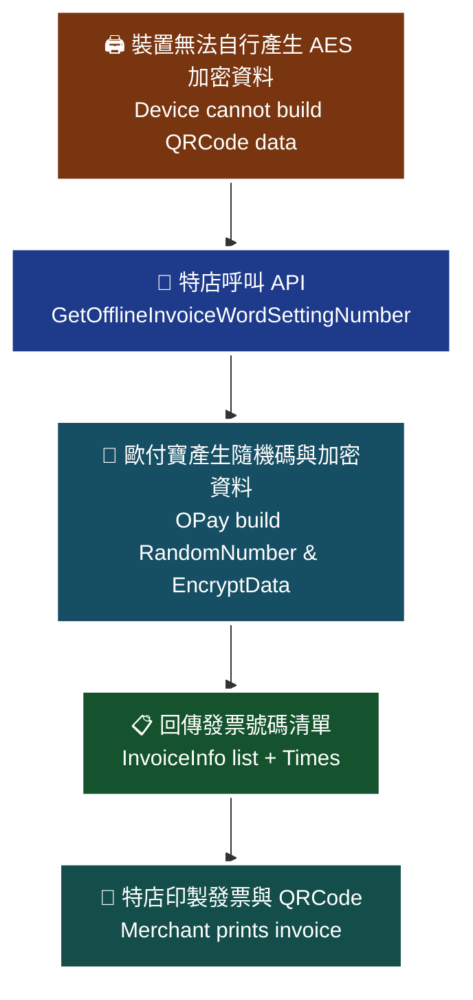

> ⚠️ 圖內細節未能自官方文件的文字內容取得，本圖依 API 語意重繪，請以官方文件圖片為準。

> ♿ 配色遵循 [`docs/accessibility.md`](../docs/accessibility.md)：WCAG AAA 對比 ≥7:1、Okabe-Ito 色盲安全色盤、16px 字體、直角連線、圖示＋文字雙編碼。

### 傳入參數（外層）

| 參數 | 參數名稱 | 型態 | 必填 | 說明 |
|---|---|---|---|---|
| MerchantID | 特店編號 | String(10) | ✅ | 特店編號 |
| RqHeader | 傳入資料 | — | — | 原文此列未標示紅色星號 |
| └─ RqHeader.Timestamp | 傳入時間 | Number | ✅ | 時間戳，格式為 Unix timestamp<br>注意事項：<br>1. 驗證時間區間暫訂為 10 分鐘內有效，若超過此驗證時間則此次訂單將無法建立，參考資料：http://www.epochconverter.com/ 。<br>2. 合作特店須進行主機「時間校正」，避免主機產生時差，導致API無法正常運作。 |
| Data | 加密資料 | String | ✅ | 資料內容，此為加密過JSON格式的資料。加密方法說明 |

外層範例：

```json
{
    "MerchantID": "2000132",
    "RqHeader": {
        "Timestamp": 1525168923
    },
    "Data": "…"
}
```

### 傳入 Data 參數（加密前的 JSON）

| 參數 | 參數名稱 | 型態 | 必填 | 說明 |
|---|---|---|---|---|
| MerchantID | 特店編號 | String(10) | ✅ | — |
| InvoiceYear | 發票年度 | String(3) | ✅ | 僅可設定當年與明年，ex:109 |
| InvoiceTerm | 發票期別 | Int | ✅ | 不可帶入小於當年期別 1: 1-2月，2: 3-4月，3: 5-6月，4: 7-8月，5: 9-10月，6: 11-12月 |
| InvoiceStatus | 發票字軌狀態 | Int | ✅ | 1:啟用，2:備用字軌 |
| MachineID | 發票機台ID | String(10) | ✅ | — |

> ⚠️ 本 API 中文標題雖為「依數量」取號，但原文傳入 Data 表格**未提供任何指定筆數／數量的參數**，亦未說明單次回傳筆數上限。原文未明確說明，介接前請向歐付寶確認。

### 傳入 Data 範例

```json
{
    "MerchantID": "2000132",
    "InvoiceYear": "109",
    "InvoiceTerm": 1,
    "InvoiceStatus": 1,
"MachineID": "A123456"
}
```

### 回傳參數（外層）

| 參數 | 參數名稱 | 型態 | 說明 |
|---|---|---|---|
| MerchantID | 特店編號 | String(10) | — |
| RpHeader | 回傳資料 | — | — |
| └─ RpHeader.Timestamp | 回傳時間 | Number | 時間戳 Unix timestamp |
| TransCode | 回傳代碼 | Int | 1代表傳輸資料(MerchantID, RqHeader, Data)接收成功，其餘均為失敗 |
| TransMsg | 回傳訊息 | String(200) | 回傳訊息 |
| Data | 加密資料 | String | 資料內容，此為加密過JSON格式的資料。加密方法說明 |

外層範例：

```json
{
    "MerchantID": "2000132",
    "RpHeader": {
        "Timestamp": 1525169058
    },
    "TransCode": 1,
    "TransMsg": "",
    "Data": "…"
}
```

### 回傳 Data 參數

| 參數 | 參數名稱 | 型態 | 說明 |
|---|---|---|---|
| RtnCode | 回應代碼 | Int | 1為成功，其餘為失敗。 |
| RtnMsg | 回應訊息 | String(200) | — |
| InvoiceInfo | 發票字軌號碼清單 | Array | — |
| └─ InvoiceInfo[].InvoiceNo | 發票號碼 | String(10) | — |
| └─ InvoiceInfo[].RandomNumber | 隨機碼 | String(4) | 電子發票證明聯內的4碼隨機碼。<br>相同的發票字軌如果重覆取號，會回傳不同的隨機碼。 |
| └─ InvoiceInfo[].EncryptData | 加密驗證資料 | String(24) | 發票號碼10碼+隨機碼4碼以字串方式合併後使用AES加密並採用Base64編碼轉換 |
| Times | 已取次數 | Int | 相同的發票字軌，已取用的字數 |

### 回傳 Data 範例

```json
{
    "RtnCode": 1,
    "RtnMsg": "成功",
    "InvoiceInfo": {
        "InvoiceNo": "TW12345678",
        "RandomNumber": "1095",
        "EncryptData": "encrypt data"
    },{
         "InvoiceNo": "TW12345677",
        "RandomNumber": "1125",
        "EncryptData": "encrypt data"
    },
    "Times": 1}
```

> ⚠️ 原文範例語法瑕疵，已照原文保留。（`InvoiceInfo` 依欄位說明為 Array，範例卻以物件並列書寫、缺少 `[` `]`；第二個物件後多一個逗號直接接 `"Times"`；結尾 `"Times": 1}` 括號位置異常。實際回傳格式請以歐付寶為準。）

### 注意事項

- 當開立發票的裝置無法自行產生電子發票 QRCode 所需的 AES 加密資料時，**必須**選擇此 API。
- 相同的發票字軌如果重覆取號，會回傳不同的隨機碼。
- `EncryptData` 為「發票號碼 10 碼 + 隨機碼 4 碼」以字串方式合併後使用 AES 加密並採用 Base64 編碼轉換。
- 上傳開立發票（§13）時，請上傳**實際開立發票**所使用的隨機碼；本 API 提供的隨機碼僅供參考使用。
- 歐付寶提供兩支取得發票字軌號碼 API，功能相同但回傳內容有些許差異，特店擇一串接即可。
- 原文本章未另附 ※注意事項區塊。

---

## 10. 上傳開立發票 — `OfflineIssue`

- **來源**：i301 §13
- **用途**：特店開立發票後，需將發票上傳至歐付寶並由歐付寶代為上傳至財政部電子發票平台。上傳發票的發票開立時間，不可超過下一期的 15 號（範例：當年 9-10 月的發票，不可超過當年 11 月 15 號上傳）。
- **HTTP Method**：POST（`Content-Type: application/json`）
- **測試環境**：`https://einvoice-stage.opay.tw/B2CInvoice/OfflineIssue`
- **正式環境**：`https://einvoice.opay.tw/B2CInvoice/OfflineIssue`

> 🧭 **純文字重述（螢幕閱讀器友善）**：原文此處為「上傳開立發票情境流程圖」。流程為：特店以先前取得的字軌號碼在自家機台開立發票 → 特店組出含發票號碼、開立日期、特店自訂編號、課稅類別、總金額、隨機碼、商品明細（最多 200 項）與載具／捐贈／列印等資訊的 Data → 加密後呼叫 `OfflineIssue` 上傳歐付寶 → 歐付寶驗證後代為上傳財政部電子發票平台 → 回傳 `InvoiceNo` 與 `RelateNumber`。上傳時限為發票所屬期別的下一期 15 號之前。

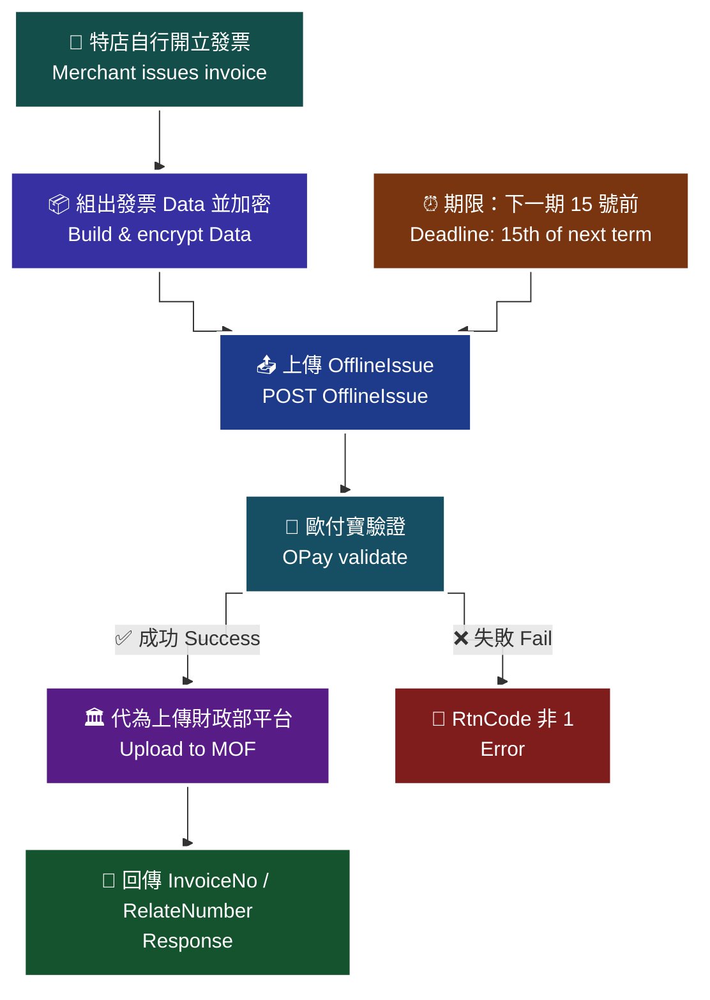

> ⚠️ 圖內細節未能自官方文件的文字內容取得，本圖依 API 語意重繪，請以官方文件圖片為準。

> ♿ 配色遵循 [`docs/accessibility.md`](../docs/accessibility.md)：WCAG AAA 對比 ≥7:1、Okabe-Ito 色盲安全色盤、16px 字體、直角連線、圖示＋文字雙編碼。

### 傳入參數（外層）

| 參數 | 參數名稱 | 型態 | 必填 | 說明 |
|---|---|---|---|---|
| MerchantID | 特店編號 | String(10) | ✅ | 特店編號 |
| RqHeader | 傳入資料 | — | — | 原文此列未標示紅色星號 |
| └─ RqHeader.Timestamp | 傳入時間 | Number | ✅ | 時間戳，格式為 Unix timestamp<br>注意事項：<br>1. 驗證時間區間暫訂為 10 分鐘內有效，若超過此驗證時間則此次訂單將無法建立，參考資料：http://www.epochconverter.com/ 。<br>2. 合作特店須進行主機「時間校正」，避免主機產生時差，導致API無法正常運作。 |
| Data | 加密資料 | String | ✅ | 資料內容，此為加密過JSON格式的資料。加密方法說明 |

外層範例：

```json
{
    "MerchantID": "2000132",
    "RqHeader": {
        "Timestamp": 1525168923
    },
    "Data": "…"
}
```

### 傳入 Data 參數（加密前的 JSON）

| 參數 | 參數名稱 | 型態 | 必填 | 說明 |
|---|---|---|---|---|
| MerchantID | 特店編號 | String(10) | ✅ | — |
| MachineID | 發票機台ID | String(10) | ✅ | — |
| InvoiceNo | 發票號碼 | String(10) | ✅ | 2碼字軌+8碼數字 |
| InvoiceDate | 發票開立日期 | String(20) | ✅ | yyyy-MM-dd HH:mm:ss<br>注意事項:<br>發票開立時間不可大於當下上傳發票的時間。 |
| RelateNumber | 特店自訂編號 | String(30) | ✅ | 需為唯一值不可重覆使用，且不可使用特殊符號 |
| TaxType | 課稅類別 | String(1) | ✅ | 1：應稅，2：零稅率，3：免稅，4：應稅(特種稅率)，<br>9：混合應稅與免稅或零稅率時(限收銀機發票無法分辨時使用，且需通過申請核可)。 |
| ZeroTaxRateReason | 零稅率原因 | String(2) | 條件 | 自115年1月1日起，當課稅類別[TaxType]為2(零稅率) 或9(混合應稅與零稅率)時，此欄位必填或廠商後台必須設定以便程式抓取，否則將會開立失敗，其值如下:<br>71：第一款 外銷貨物(預設值)<br>72：第二款 與外銷有關之勞務，或在國內提供而在國外使用之勞務<br>73：第三款 依法設立之免稅商店銷售與過境或出境旅客之貨物<br>74：第四款 銷售與保稅區營業人供營運之貨物或勞務<br>75：第五款 國際間之運輸。但外國運輸事業在中華民國境內經營國際運輸業務者，應以各該國對中華民國國際運輸事業予以相等待遇或免徵類似稅捐者為限<br>76：第六款 國際運輸用之船舶、航空器及遠洋漁船<br>77：第七款 銷售與國際運輸用之船舶、航空器及遠洋漁船所使用之貨物或修繕勞務<br>78：第八款 保稅區營業人銷售與課稅區營業人未輸往課稅區而直接出口之貨物<br>79：第九款 保稅區營業人銷售與課稅區營業人存入自由港區事業或海關管理之保稅倉庫、物流中心以供外銷之貨物 |
| SalesAmount | 發票總金額(含稅) | Int | ✅ | — |
| InvType | 字軌類別 | String(2) | ✅ | 07:一般稅額發票，08:特種稅額發票 |
| RandomNumber | 隨機碼 | String(4) | ✅ | 隨機碼是作為資訊的防偽，特店可自行制定隨機碼產生規則。建議產生隨機碼的規則為:每開立一萬張發票不可重覆，開立下一萬張票的隨機碼出現的次序不可重覆。<br>注意事項:<br>1.隨機碼只限使用數字，不可使用流水號。<br>2.請上傳實際開立發票的隨機碼，取得發票字軌號碼API提供的隨機碼僅供參考使用。 |
| Items | 商品 | （原文未填型態） | ✅ | 可多筆，商品最多支援200項 |
| └─ Items[].ItemSeq | 商品序號 | Int | — | — |
| └─ Items[].ItemName | 商品名稱 | String(100) | ✅ | — |
| └─ Items[].ItemCount | 商品數量 | Number | ✅ | — |
| └─ Items[].ItemWord | 商品單位 | String(6) | ✅ | — |
| └─ Items[].ItemPrice | 商品單價 | Number | ✅ | — |
| └─ Items[].ItemTaxType | 商品課稅別 | String(1) | — | — |
| └─ Items[].ItemAmount | 商品合計 | Number | ✅ | — |
| └─ Items[].ItemRemark | 商品備註 | String(40) | — | — |
| CustomerIdentifier | 統一編號 | String(8) | — | — |
| CustomerID | 客戶編號 | String(20) | — | — |
| CustomerAddr | 客戶地址 | String(100) | — | — |
| CustomerPhone | 客戶手機號碼 | String(20) | — | — |
| CustomerEmail | 客戶電子信箱 | String(80) | — | — |
| ClearanceMark | 通關方式 | String(1) | 條件 | 當課稅類別[TaxType]=2(零稅率)時，為必填<br>1：非經海關出口　2：經海關出口 |
| SpecialTaxType | 特種稅額類別 | String(1) | 條件 | 當課稅類別[TaxType]為 1/2/9 時，請帶入【0】。<br>當課稅類別[TaxType]為 3 時，則該參數必填，請填入數字【8】。<br>當課稅類別[TaxType]為 4 時，則該參數必填，可填入數字【1-8】， 並分別代表以下類別與稅率:<br>1：代表酒家及有陪侍服務之茶室、咖啡廳、酒吧之營業稅稅率，稅率為25%。<br>2：代表夜總會、有娛樂節目之餐飲店之營業稅稅率，稅率為15%。<br>3：代表銀行業、保險業、信託投資業、證券業、期貨業、票券業及典當業之專屬本業收入(不含銀行業、保險業經營銀行、保險本業收入)之營業稅稅率，稅率為2%。<br>4：代表保險業之再保費收入之營業稅稅率，稅率為 1%。<br>5：代表銀行業、保險業、信託投資業、證券業、期貨業、票券業及典當業之非專屬本業收入之營業稅稅率，稅率為 5%。<br>6：代表銀行業、保險業經營銀行、保險本業收入之營業稅稅率(適用於民國103年07月以後銷售額)，稅率為5%。<br>7：代表銀行業、保險業經營銀行、保險本業收入之營業稅稅率(適用於民國103年06月以前銷售額)，稅率為5%。<br>8：代表空白為免稅或非銷項特種稅額之資料。 |
| vat | 商品單價是否含稅 | String(1) | — | — |
| InvoiceRemark | 發票備註 | String(200) | — | — |
| CustomerName | 客戶名稱 | String(60) | — | 格式為中、英文及數字等字元。 |
| Print | 列印註記 | String(1) | ✅ | 0：不列印 捐贈註記[Donation]=1(捐贈) 時 載具類別[CarrierType] 有值時 1：要列印 統一編號[CustomerIdentifier]有值時 |
| Donation | 捐贈註記 | String(1) | ✅ | 0：不捐贈 統一編號[CustomerIdentifier]有值時 載具類別[CarrierType] 有值時 1：要捐贈 |
| LoveCode | 捐贈碼 | String(7) | 條件 | 當捐贈註記=1 時，為必填。 格式為阿拉伯數字為限，最少三碼，最多七碼，首位可以為零。 |
| CarrierType | 載具類別 | String(1) | — | 空字串：無載具<br>列印註記[Print] =1(列印發票) 時，統一編號[CustomerIdentifier]有值時<br>1：歐付寶電子發票載具　2：自然人憑證號碼　3：手機條碼載具　4：悠遊卡　5：icash　6：一卡通　7：金融卡　8：信用卡 |
| CarrierNum | 載具編號 | String(64) | — | 當[CarrierType]="" 時，請帶空字串。 當[CarrierType]=1時，請帶空字串，系統會自動帶入值，為客戶電子信箱或客戶手機號碼擇一(以客戶電子信箱優先) [CarrierType]=2：請帶固定長度為16且格式為2碼大寫英文字母加上14碼數字。 [CarrierType]=3：請帶固定長度為8碼字元，第1碼為【/】; 其餘7碼則由數字【0-9】、大寫英文【A-Z】與特殊符號【+】【-】【.】這39個字元組成的編號。 當[CarrierType]=4~8必填，請帶入實體卡片的 &lt;隱碼id&gt;，不會檢核正確性 注意事項： 當[CarrierType]=4~8代表載具類別號碼之隱碼 英文、數字、符號僅接受半形字元 手機條碼載具會進行格式檢核 若載具編號為手機條碼載具時，請先呼叫手機條碼驗證進行檢核 如何取得[CarrierType]=4~7卡片隱碼(內碼)：您的設備需配備能讀取卡片的讀卡機，並確保該設備能讀取卡片內碼 [CarrierType]=8：請帶入信用卡加密卡號 |
| CarrierNum2 | 第二載具編號 | String(64) | — | 當[CarrierType]=4~7必填，請帶入實體卡片的&lt;顯碼id&gt;，以便發票查詢可以顯示用來識別不同的實體卡片，不會檢核正確性 當[CarrierType]=8必填，請帶入刷卡日期(民國年月日共7碼)加刷卡交易金額(10碼不足位左補0) 當[CarrierType]=不等於4~8時，此參數不須帶入。 注意事項： 當[CarrierType]=4~8代表載具類別號碼之顯碼 英文、數字、符號僅接受半形字元，格式錯誤會造成開立失敗 當CarrierType數值為 1、2 或 3 時，請廠商無須填入此欄位，以避免系統阻擋。 |

（傳入 Data 共 35 個欄位，含 `Items` 陣列本身與其 8 個子欄位。）

#### 列舉值展開（自上表原文逐字整理，未新增任何值）

**`TaxType` 課稅類別（String(1)）**

| 值 | 說明 |
|---|---|
| `1` | 應稅 |
| `2` | 零稅率 |
| `3` | 免稅 |
| `4` | 應稅(特種稅率) |
| `9` | 混合應稅與免稅或零稅率時(限收銀機發票無法分辨時使用，且需通過申請核可)。 |

**`ZeroTaxRateReason` 零稅率原因（String(2)，自 115 年 1 月 1 日起，`TaxType`=2 或 9 時必填或後台須設定，否則開立失敗）**

| 值 | 說明 |
|---|---|
| `71` | 第一款 外銷貨物(預設值) |
| `72` | 第二款 與外銷有關之勞務，或在國內提供而在國外使用之勞務 |
| `73` | 第三款 依法設立之免稅商店銷售與過境或出境旅客之貨物 |
| `74` | 第四款 銷售與保稅區營業人供營運之貨物或勞務 |
| `75` | 第五款 國際間之運輸。但外國運輸事業在中華民國境內經營國際運輸業務者，應以各該國對中華民國國際運輸事業予以相等待遇或免徵類似稅捐者為限 |
| `76` | 第六款 國際運輸用之船舶、航空器及遠洋漁船 |
| `77` | 第七款 銷售與國際運輸用之船舶、航空器及遠洋漁船所使用之貨物或修繕勞務 |
| `78` | 第八款 保稅區營業人銷售與課稅區營業人未輸往課稅區而直接出口之貨物 |
| `79` | 第九款 保稅區營業人銷售與課稅區營業人存入自由港區事業或海關管理之保稅倉庫、物流中心以供外銷之貨物 |

**`ClearanceMark` 通關方式（String(1)，`TaxType`=2 零稅率時為必填）**

| 值 | 說明 |
|---|---|
| `1` | 非經海關出口 |
| `2` | 經海關出口 |

**`SpecialTaxType` 特種稅額類別（String(1)）**

| 情境 / 值 | 說明 |
|---|---|
| `TaxType` 為 1/2/9 | 請帶入【0】。 |
| `TaxType` 為 3 | 該參數必填，請填入數字【8】。 |
| `TaxType` 為 4 | 該參數必填，可填入數字【1-8】。 |
| `1` | 代表酒家及有陪侍服務之茶室、咖啡廳、酒吧之營業稅稅率，稅率為25%。 |
| `2` | 代表夜總會、有娛樂節目之餐飲店之營業稅稅率，稅率為15%。 |
| `3` | 代表銀行業、保險業、信託投資業、證券業、期貨業、票券業及典當業之專屬本業收入(不含銀行業、保險業經營銀行、保險本業收入)之營業稅稅率，稅率為2%。 |
| `4` | 代表保險業之再保費收入之營業稅稅率，稅率為 1%。 |
| `5` | 代表銀行業、保險業、信託投資業、證券業、期貨業、票券業及典當業之非專屬本業收入之營業稅稅率，稅率為 5%。 |
| `6` | 代表銀行業、保險業經營銀行、保險本業收入之營業稅稅率(適用於民國103年07月以後銷售額)，稅率為5%。 |
| `7` | 代表銀行業、保險業經營銀行、保險本業收入之營業稅稅率(適用於民國103年06月以前銷售額)，稅率為5%。 |
| `8` | 代表空白為免稅或非銷項特種稅額之資料。 |

**`InvType` 字軌類別（String(2)）**

| 值 | 說明 |
|---|---|
| `07` | 一般稅額發票 |
| `08` | 特種稅額發票 |

**`Print` 列印註記（String(1)）**

| 值 | 說明 | 原文並列之適用情境（欄位結構於純文字抽取時已合併） |
|---|---|---|
| `0` | 不列印 | 捐贈註記[Donation]=1(捐贈) 時；載具類別[CarrierType] 有值時 |
| `1` | 要列印 | 統一編號[CustomerIdentifier]有值時 |

**`Donation` 捐贈註記（String(1)）**

| 值 | 說明 | 原文並列之適用情境（欄位結構於純文字抽取時已合併） |
|---|---|---|
| `0` | 不捐贈 | 統一編號[CustomerIdentifier]有值時；載具類別[CarrierType] 有值時 |
| `1` | 要捐贈 | — |

**`CarrierType` 載具類別（String(1)）— V1.2.0 調整非共通性載具之顯碼／隱碼**

| 值 | 說明 |
|---|---|
| 空字串 `""` | 無載具（原文並列：列印註記[Print]=1(列印發票) 時、統一編號[CustomerIdentifier]有值時） |
| `1` | 歐付寶電子發票載具 |
| `2` | 自然人憑證號碼 |
| `3` | 手機條碼載具 |
| `4` | 悠遊卡 |
| `5` | icash |
| `6` | 一卡通 |
| `7` | 金融卡 |
| `8` | 信用卡 |

**`CarrierNum`（隱碼）／`CarrierNum2`（顯碼）對照**

| CarrierType | CarrierNum（隱碼 id） | CarrierNum2（顯碼 id） |
|---|---|---|
| `""` 無載具 | 請帶空字串。 | 此參數不須帶入。 |
| `1` 歐付寶電子發票載具 | 請帶空字串，系統會自動帶入值，為客戶電子信箱或客戶手機號碼擇一(以客戶電子信箱優先)。 | 請廠商無須填入此欄位，以避免系統阻擋。 |
| `2` 自然人憑證號碼 | 請帶固定長度為16且格式為2碼大寫英文字母加上14碼數字。 | 請廠商無須填入此欄位，以避免系統阻擋。 |
| `3` 手機條碼載具 | 請帶固定長度為8碼字元，第1碼為【/】; 其餘7碼則由數字【0-9】、大寫英文【A-Z】與特殊符號【+】【-】【.】這39個字元組成的編號。 | 請廠商無須填入此欄位，以避免系統阻擋。 |
| `4`~`7` 悠遊卡／icash／一卡通／金融卡 | 必填，請帶入實體卡片的 &lt;隱碼id&gt;，不會檢核正確性。 | 必填，請帶入實體卡片的 &lt;顯碼id&gt;，以便發票查詢可以顯示用來識別不同的實體卡片，不會檢核正確性。 |
| `8` 信用卡 | 必填，請帶入信用卡加密卡號。 | 必填，請帶入刷卡日期(民國年月日共7碼)加刷卡交易金額(10碼不足位左補0)。 |

（以上表格僅為上方原文欄位說明之重排，未新增任何官方未寫的規則。）

### 傳入 Data 範例

```json
{
    "MerchantID": "2000132",
  "MachineID": "12345678",
  "InvoiceNo": "KK12345678",
  "InvoiceDate": "2021-01-01 11:12:35",
    "RelateNumber": "20181028000000001",
    "CustomerID": "",
    "CustomerIdentifier": "",
    "CustomerName": "歐付寶科技股份有限公司",
    "CustomerAddr": "106台北市南港區發票一街1號1樓",
    "CustomerPhone": "",
    "CustomerEmail": "test@opay.com.tw",
    "ClearanceMark": "1",
    "Print": "1",
    "Donation": "0",
    "LoveCode": "",
    "CarrierType": "",
    "CarrierNum": "",
    "TaxType": "1",
    "SalesAmount": 100,
    "InvoiceRemark": "發票備註",
    "InvType": "07",
    "vat": "1",
    "Items": [
        {
            "ItemSeq": 1,
            "ItemName": "item01",
            "ItemCount": 1,
            "ItemWord": "件",
            "ItemPrice": 50,
            "ItemTaxType": "1",
            "ItemAmount": 50,
            "ItemRemark": "item01_desc"
        },
        {
            "ItemSeq": 2,
            "ItemName": "item02",
            "ItemCount": 1,
            "ItemWord": "個",
            "ItemPrice": 20,
            "ItemTaxType": "1",
            "ItemAmount": 20,
            "ItemRemark": "item02_desc"
        },
        {
            "ItemSeq": 3,
            "ItemName": "item03",
            "ItemCount": 3,
            "ItemWord": "粒",
            "ItemPrice": 10,
            "ItemTaxType": "1",
            "ItemAmount": 30,
            "ItemRemark": "item03_desc"
        }
    ]
}
```

> ⚠️ 原文範例語法瑕疵，已照原文保留。（JSON 語法本身正確，但範例缺少表格中標示為必填的 `RandomNumber`；另 `ClearanceMark` 帶 `"1"` 而 `TaxType` 為 `"1"`（應稅），與「`TaxType`=2 時才必填」的說明不一致。實作請以欄位表為準。）

### 回傳參數（外層）

| 參數 | 參數名稱 | 型態 | 說明 |
|---|---|---|---|
| MerchantID | 特店編號 | String(10) | — |
| RpHeader | 回傳資料 | — | — |
| └─ RpHeader.Timestamp | 回傳時間 | Number | 時間戳 Unix timestamp |
| TransCode | 回傳代碼 | Int | 1代表傳輸資料(MerchantID, RqHeader, Data)接收成功，其餘均為失敗 |
| TransMsg | 回傳訊息 | String(200) | 回傳訊息 |
| Data | 加密資料 | String | 資料內容，此為加密過JSON格式的資料。加密方法說明 |

外層範例：

```json
{
    "MerchantID": "2000132",
    "RpHeader": {
        "Timestamp": 1525169058
    },
    "TransCode": 1,
    "TransMsg": "",
    "Data": "…"
}
```

### 回傳 Data 參數

| 參數 | 參數名稱 | 型態 | 說明 |
|---|---|---|---|
| RtnCode | 回應代碼 | Int | 1為成功，其餘為失敗。 |
| RtnMsg | 回應訊息 | String(200) | — |
| InvoiceNo | 發票號碼 | String(10) | 2碼字軌+8碼數字 |
| RelateNumber | 特店自訂編號 | String(30) | — |

### 回傳 Data 範例

```json
{
    "RtnCode": 1,
    "RtnMsg": "成功",
  "InvoiceNo": "KK12345678",
    "RelateNumber": "1234567890"
}
```

### 注意事項

- 上傳發票的發票開立時間，不可超過下一期的 15 號。範例：當年 9-10 月的發票，不可超過當年 11 月 15 號上傳。
- `InvoiceDate` 的發票開立時間不可大於當下上傳發票的時間。
- `RelateNumber` 需為唯一值不可重覆使用，且不可使用特殊符號。
- `RandomNumber` 隨機碼注意事項：1. 隨機碼只限使用數字，不可使用流水號。2. 請上傳實際開立發票的隨機碼，取得發票字軌號碼 API 提供的隨機碼僅供參考使用。建議產生隨機碼的規則為：每開立一萬張發票不可重覆，開立下一萬張票的隨機碼出現的次序不可重覆。
- `Items` 可多筆，商品最多支援 200 項。
- `ZeroTaxRateReason`：自 115 年 1 月 1 日起，當 `TaxType` 為 2（零稅率）或 9（混合應稅與零稅率）時，此欄位必填或廠商後台必須設定以便程式抓取，否則將會開立失敗。
- `ClearanceMark`：當 `TaxType`=2（零稅率）時，為必填。
- `LoveCode`：當捐贈註記 `Donation`=1 時為必填；格式為阿拉伯數字為限，最少三碼，最多七碼，首位可以為零。
- `CarrierNum` 注意事項：當 `CarrierType`=4~8 代表載具類別號碼之隱碼；英文、數字、符號僅接受半形字元；手機條碼載具會進行格式檢核；若載具編號為手機條碼載具時，請先呼叫手機條碼驗證進行檢核；如何取得 `CarrierType`=4~7 卡片隱碼(內碼)：您的設備需配備能讀取卡片的讀卡機，並確保該設備能讀取卡片內碼。
- `CarrierNum2` 注意事項：當 `CarrierType`=4~8 代表載具類別號碼之顯碼；英文、數字、符號僅接受半形字元，格式錯誤會造成開立失敗；當 `CarrierType` 數值為 1、2 或 3 時，請廠商無須填入此欄位，以避免系統阻擋。
- `RqHeader.Timestamp` 驗證時間區間暫訂為 10 分鐘內有效，超過則無法建立；合作特店須進行主機「時間校正」。
- 原文本章未另附獨立的 ※注意事項表格區塊，上述各點皆取自欄位說明中的「注意事項」文字與章節開頭說明。

---

## 11. 上傳作廢發票 — `OfflineInvalid`

- **來源**：i301 §14
- **用途**：營業人（特店）可使用此功能將已作廢的發票傳送至歐付寶，由歐付寶將作廢資料上傳至財政部電子發票整合服務平台。
- **HTTP Method**：POST（`Content-Type: application/json`）
- **測試環境**：`https://einvoice-stage.opay.tw/B2CInvoice/OfflineInvalid`
- **正式環境**：`https://einvoice.opay.tw/B2CInvoice/OfflineInvalid`

> 🧭 **純文字重述（螢幕閱讀器友善）**：原文此處為「上傳作廢發票情境流程圖」。流程為：特店在自家系統將已開立的發票作廢 → 以發票號碼、發票開立日期、作廢原因與發票作廢時間呼叫 `OfflineInvalid` → 歐付寶接收作廢資料 → 歐付寶代為上傳財政部電子發票整合服務平台 → 作廢成功回傳該發票號碼；若開立失敗則回傳空值。發票作廢是直接把原發票作廢然後無法再使用。

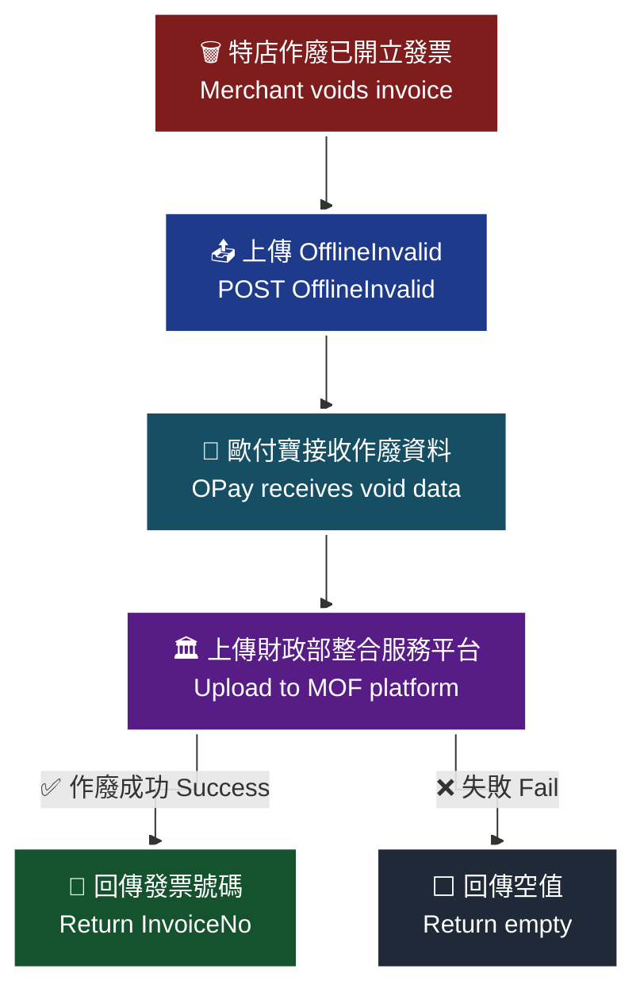

> ⚠️ 圖內細節未能自官方文件的文字內容取得，本圖依 API 語意重繪，請以官方文件圖片為準。

> ♿ 配色遵循 [`docs/accessibility.md`](../docs/accessibility.md)：WCAG AAA 對比 ≥7:1、Okabe-Ito 色盲安全色盤、16px 字體、直角連線、圖示＋文字雙編碼。

### 傳入參數（外層）

| 參數 | 參數名稱 | 型態 | 必填 | 說明 |
|---|---|---|---|---|
| MerchantID | 特店編號 | String(10) | ✅ | 特店編號 |
| RqHeader | 傳入資料 | — | — | 原文此列未標示紅色星號 |
| └─ RqHeader.Timestamp | 傳入時間 | Number | ✅ | 時間戳，格式為 Unix timestamp<br>注意事項：<br>1. 驗證時間區間暫訂為 10 分鐘內有效，若超過此驗證時間則此次訂單將無法建立，參考資料：http://www.epochconverter.com/ 。<br>2. 合作特店須進行主機「時間校正」，避免主機產生時差，導致API無法正常運作。 |
| Data | 加密資料 | String | ✅ | 資料內容，此為加密過JSON格式的資料。加密方法說明 |

外層範例：

```json
{
    "MerchantID": "2000132",
    "RqHeader": {
        "Timestamp": 1525168923
    },
   "Data": "…"
}
```

### 傳入 Data 參數（加密前的 JSON）

| 參數 | 參數名稱 | 型態 | 必填 | 說明 |
|---|---|---|---|---|
| MerchantID | 特店編號 | String(10) | ✅ | — |
| InvoiceNo | 發票號碼 | String(10) | ✅ | 長度固定為10碼，字軌+發票號碼 |
| InvoiceDate | 發票開立日期 | String(20) | ✅ | yyyy-MM-dd |
| Reason | 作廢原因 | String(20) | ✅ | — |
| CancelDate | 發票作廢時間 | String(20) | ✅ | yyyy-MM-dd HH:mm:ss |

### 傳入 Data 範例

```json
{
    "MerchantID": "2000132",
    "InvoiceNo": "UV11100016",
    "InvoiceDate": "2021-01-14",
    "Reason": "發票作廢",
    "CancelDate": "2021-01-15 15:12:03"
}
```

### 回傳參數（外層）

| 參數 | 參數名稱 | 型態 | 說明 |
|---|---|---|---|
| MerchantID | 特店編號 | String(10) | — |
| RpHeader | 回傳資料 | — | — |
| └─ RpHeader.Timestamp | 回傳時間 | Number | 時間戳 Unix timestamp |
| TransCode | 回傳代碼 | Int | 1代表傳輸資料(MerchantID, RqHeader, Data)接收成功，其餘均為失敗 |
| TransMsg | 回傳訊息 | String(200) | 回傳訊息 |
| Data | 加密資料 | String | 資料內容，此為加密過JSON格式的資料。加密方法說明 |

外層範例：

```json
{
    "MerchantID": "2000132",
    "RpHeader": {
        "Timestamp": 1525169058
    },
    "TransCode": 1,
    "TransMsg": "",
    "Data": "…",
      "EncData": "…"
}
```

> ⚠️ 原文範例語法瑕疵，已照原文保留。（範例多出一個 `"EncData"` 欄位，但回傳參數表格中並無此欄位，其他章節的回傳範例亦無此欄位。原文未明確說明，介接前請向歐付寶確認。）

### 回傳 Data 參數

| 參數 | 參數名稱 | 型態 | 說明 |
|---|---|---|---|
| RtnCode | 回應代碼 | Int | 1為成功，其餘為失敗。 |
| RtnMsg | 回應訊息 | String(200) | — |
| InvoiceNo | 發票號碼 | String(10) | 若作廢成功，則會回傳發票號碼 若開立失敗，則會回傳空值。 |

### 回傳 Data 範例

```json
{
    "RtnCode": 1,
    "RtnMsg": "成功",
  "InvoiceNo": "UV11100016"
}
```

### 注意事項

- 發票作廢是直接把原發票作廢然後無法再使用（見 §2 關鍵字一覽表）。
- `InvoiceNo` 長度固定為 10 碼（字軌 + 發票號碼）。
- `InvoiceDate` 格式為 `yyyy-MM-dd`（僅日期），`CancelDate` 格式為 `yyyy-MM-dd HH:mm:ss`（含時間），兩者格式不同請勿混用。
- 回傳 `InvoiceNo`：若作廢成功，則會回傳發票號碼；若開立失敗，則會回傳空值。
- `RqHeader.Timestamp` 驗證時間區間暫訂為 10 分鐘內有效，超過則無法建立；合作特店須進行主機「時間校正」。
- 原文本章未另附 ※注意事項區塊。

---

## 12. 查詢字軌 — `GetInvoiceWordSetting`

- **來源**：i301 §15
- **用途**：特店可使用此 API 查詢字軌號碼以及字軌的使用情況。
- **HTTP Method**：POST（`Content-Type: application/json`）
- **測試環境**：`https://einvoice-stage.opay.tw/B2CInvoice/GetInvoiceWordSetting`
- **正式環境**：`https://einvoice.opay.tw/B2CInvoice/GetInvoiceWordSetting`

> 🧭 **純文字重述（螢幕閱讀器友善）**：原文此處為「查詢字軌情境流程圖」。流程為：特店以發票年度、發票期別（0 為全部）、字軌使用狀態（0 全部／1 未啟用／2 使用中／3 已停用／4 暫停中／5 待審核／6 審核不通過）、發票類別固定為 4（離線發票），可選填字軌類別與發票字軌，呼叫本 API → 歐付寶查詢符合條件的字軌設定 → 回傳 `InvoiceInfo` 清單，每筆含字軌號碼 ID、年度、期別、發票類別、字軌類別、字軌、起訖號碼、目前已使用號碼、使用狀態與機台 ID。

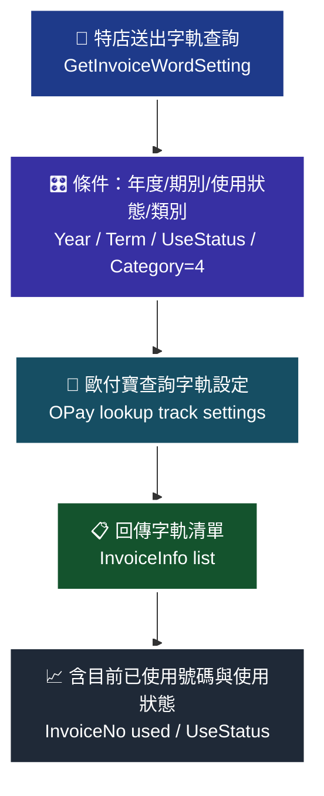

> ⚠️ 圖內細節未能自官方文件的文字內容取得，本圖依 API 語意重繪，請以官方文件圖片為準。

> ♿ 配色遵循 [`docs/accessibility.md`](../docs/accessibility.md)：WCAG AAA 對比 ≥7:1、Okabe-Ito 色盲安全色盤、16px 字體、直角連線、圖示＋文字雙編碼。

### 傳入參數（外層）

| 參數 | 參數名稱 | 型態 | 必填 | 說明 |
|---|---|---|---|---|
| MerchantID | 特店編號 | String(10) | ✅ | 特店編號 |
| RqHeader | 傳入資料 | — | — | 原文此列未標示紅色星號 |
| └─ RqHeader.Timestamp | 傳入時間 | Number | ✅ | 時間戳，格式為 Unix timestamp<br>注意事項：<br>1. 驗證時間區間暫訂為 10 分鐘內有效，若超過此驗證時間則此次訂單將無法建立，參考資料：http://www.epochconverter.com/ 。<br>2. 合作特店須進行主機「時間校正」，避免主機產生時差，導致API無法正常運作。 |
| Data | 加密資料 | String | ✅ | 資料內容，此為加密過JSON格式的資料。加密方法說明 |

外層範例：

```json
{
    "MerchantID": "2000132",
    "RqHeader": {
        "Timestamp": 1525168923,
        "Revision": "3.0.0"
    },
    "Data": "…"
}
```

> ⚠️ 原文範例語法瑕疵，已照原文保留。（範例的 `RqHeader` 多出 `"Revision": "3.0.0"` 欄位，但本文件所有外層參數表格均未定義 `Revision`，其他章節範例亦無此欄位。原文未明確說明，介接前請向歐付寶確認。）

### 傳入 Data 參數（加密前的 JSON）

| 參數 | 參數名稱 | 型態 | 必填 | 說明 |
|---|---|---|---|---|
| MerchantID | 特店編號 | String(10) | ✅ | — |
| InvoiceYear | 發票年度 | String(3) | ✅ | 僅可查詢去年、當年與明年的發票年度，格式為民國年 ex:109 |
| InvoiceTerm | 發票期別 | Int | ✅ | 0:全部，1: 1-2月，2: 3-4月，3: 5-6月，4: 7-8月，5: 9-10月，6: 11-12月 |
| UseStatus | 字軌使用狀態 | Int | ✅ | 0:全部，1:未啟用，2:使用中，3:已停用，4:暫停中，5:待審核，6:審核不通過 |
| InvoiceCategory | 發票類別 | Int | ✅ | 4:離線發票，請固定填寫為4 |
| InvType | 字軌類別 | String(2) | — | 07:一般稅額發票，08:特種稅額發票 |
| InvoiceHeader | 發票字軌 | String(2) | — | — |

### 傳入 Data 範例

```json
{
    "MerchantID": "2000132",
    "InvoiceTerm": 0,
    "InvoiceYear": "109",
    "UseStatus": 1,
    "InvoiceCategory": 4
}
```

### 回傳參數（外層）

| 參數 | 參數名稱 | 型態 | 說明 |
|---|---|---|---|
| MerchantID | 廠商編號 | String(10) | — |
| RpHeader | 回傳資料 | — | — |
| └─ RpHeader.Timestamp | 回傳時間 | Number | 時間戳 Unix timestamp |
| TransCode | 回傳代碼 | Int | 1代表傳輸資料(MerchantID, RqHeader, Data)接收成功，其餘均為失敗 |
| TransMsg | 回傳訊息 | String(200) | 回傳訊息 |
| Data | 加密資料 | String | 資料內容，此為加密過JSON格式的資料。加密方法說明 |

外層範例：

```json
{
    "MerchantID": "2000132",
    "RpHeader": {
        "Timestamp": 1525169058
    },
    "TransCode": 1,
    "TransMsg": "",
    "Data": "…"
}
```

### 回傳 Data 參數

| 參數 | 參數名稱 | 型態 | 說明 |
|---|---|---|---|
| RtnCode | 回應代碼 | Int | 1為成功，其餘為失敗。 |
| RtnMsg | 回應訊息 | String(200) | — |
| InvoiceInfo | 發票資訊 | Array | 格式為「yyyy-MM-dd HH:mm:ss」 |
| └─ InvoiceInfo[].TrackID | 字軌號碼ID | String(10) | — |
| └─ InvoiceInfo[].InvoiceYear | 發票年度 | String(3) | — |
| └─ InvoiceInfo[].InvoiceTerm | 發票期別 | Int | 1: 1-2月，2: 3-4月，3: 5-6月，4: 7-8月，5: 9-10月，6: 11-12月 |
| └─ InvoiceInfo[].InvoiceCategory | 發票類別 | Int | 4:離線發票 |
| └─ InvoiceInfo[].InvType | 字軌類別 | String(2) | 07:一般稅額發票，08:特種稅額發票 |
| └─ InvoiceInfo[].InvoiceHeader | 發票字軌 | String(2) | — |
| └─ InvoiceInfo[].InvoiceStart | 起始發票編號 | String(8) | — |
| └─ InvoiceInfo[].InvoiceEnd | 結束發票編號 | String(8) | — |
| └─ InvoiceInfo[].InvoiceNo | 目前已使用號碼 | String(8) | — |
| └─ InvoiceInfo[].UseStatus | 使用狀態 | Int | 1:未啟用，2:使用中，3:已停用，4:暫停中，5:待審核，6:審核不通過 |
| └─ InvoiceInfo[].MachineID | 發票機台ID | String(10) | — |

> ⚠️ 原文此回傳 Data 表格的欄位結構轉為純文字後有欄位錯位（「型態」欄重複兩次；`TrackID` 該列的名稱與型態欄位偏移）。上表已依語意對齊還原，型態值取自原文；`InvoiceInfo` 該列的說明欄原文寫作「格式為「yyyy-MM-dd HH:mm:ss」」，與 Array 型態不符，疑為表格錯位殘留，已照原文保留。原文未明確說明，介接前請向歐付寶確認。

### 回傳 Data 範例

```json
{
  "RtnCode": 1,
    "RtnMsg": "查詢成功"
  "InvoiceInfo": {
        "TrackID": "1234567890",
        "InvoiceYear": "109",
        "InvoiceTerm": 1,
        "InvoiceCategory": 4,
        "InvType": "07",
        "InvoiceHeader": "AQ",
        "InvoiceStart": "10000000",
        "InvoiceEnd": "19999999",
        "InvoiceNo": "12345678",
        "UseStatus": 2,
        "MachineID": "12345678"
    },{
        "TrackID": "1234569870",
        "InvoiceYear": "109",
        "InvoiceTerm": 1,
        "InvoiceCategory": 4,
        "InvType": "07",
        "InvoiceHeader": "AQ",
        "InvoiceStart": "10000000",
        "InvoiceEnd": "19999999",
        "InvoiceNo": "12345678",
        "UseStatus": 2,
        "MachineID": "12345688"
    }
}
```

> ⚠️ 原文範例語法瑕疵，已照原文保留。（`"RtnMsg": "查詢成功"` 之後缺少逗號；`InvoiceInfo` 依欄位說明為 Array，範例卻以物件並列書寫、缺少 `[` `]`。實際回傳格式請以歐付寶為準。）

### 注意事項

- `InvoiceYear` 僅可查詢去年、當年與明年的發票年度，格式為民國年（ex: 109）。
- `InvoiceCategory` 請固定填寫為 `4`（離線發票）。
- `InvoiceTerm` 與 `UseStatus` 皆支援 `0`（全部）作為查詢條件；但回傳的 `UseStatus` 僅有 1~6 六種值，無 `0`。
- **`UseStatus` 的列舉（1 未啟用／2 使用中／3 已停用／4 暫停中／5 待審核／6 審核不通過）與 §10 `UpdateInvoiceWordStatus` 的 `InvoiceStatus`（0 停用／1 暫停／2 啟用）、§12 取號 API 的 `InvoiceStatus`（1 啟用／2 備用字軌）三者定義不同，請勿混用。**
- `InvType` 與 `InvoiceHeader` 為選填的縮小查詢範圍條件。
- `RqHeader.Timestamp` 驗證時間區間暫訂為 10 分鐘內有效，超過則無法建立；合作特店須進行主機「時間校正」。
- 原文本章未另附 ※注意事項區塊。

---

## 附註：本檔與附錄的對應

- 前置章節（§1～§4）、交易狀態代碼表、URLEncode 轉換表、參數加密方式說明：見本檔後段[附錄與前置章節（i301 離線電子發票）](#附錄與前置章節i301-離線電子發票)。
- 全部 12 支 API 皆使用 `/B2CInvoice/` 路徑前綴（離線電子發票亦走 B2CInvoice 路徑）。

# 附錄與前置章節（i301 離線電子發票）

- **來源文件**：歐付寶《離線電子發票介接技術文件》i301，V1.3.0，2025-09-10
- **本檔涵蓋**：i301 §1～§4（簡介、關鍵字、前置準備、流程說明）與 附錄 1～3
- **API 章節（§5～§15）**：見本檔前段[離線電子發票 API Reference（`/B2CInvoice`）](#離線電子發票-api-referenceb2cinvoice)

---

## 0. Version History（逐字照抄）

| Version | Date | Content |
|---|---|---|
| V1.0.0 | 2023/01/01 | Create |
| V1.1.0 | 2024/10/15 | Update 新增發票字軌自動配號API 調整上傳開立發票API |
| V1.2.0 | 2025/05/12 | 調整非共通性載具_顯碼/隱碼 |
| V1.3.0 | 2025/09/10 | 上傳開立發票章節新增參數ZeroTaxRateReason 零稅率原因 |

---

## 1. 離線電子發票簡介

- **來源**：i301 §1

原文（逐字照抄）：

> 歐付寶離線電子發票服務對於有實體發票機台的特店，提供完整的電子發票功能。此規格提供管理發票機台、上傳特店自行開立的發票與查詢字軌等功能，特店可透過歐付寶提供的串接方式，實現離線作業與自行開立電子發票功能。

**給 AI 助手的重點**：離線電子發票的核心差異在於「發票由特店自己的機台開立」，歐付寶只負責 (1) 機台與字軌的登記管理、(2) 發放可用字軌號碼、(3) 代為將已開立／已作廢的發票上傳財政部。所有 API 皆走 `/B2CInvoice/` 路徑前綴。

---

## 2. 關鍵字一覽表

- **來源**：i301 §2（完整照抄，共 7 列）

| 名稱 | 參數說明 |
|---|---|
| 特店 | 指串接歐付寶電子發票服務的賣家 |
| 載具 | 存放電子發票的載體,如電子票證、信用卡/簽帳金融卡載具、手機條碼等 |
| 捐贈碼 | 捐贈機關或團體向財政部申請受捐贈電子發票的代表號碼 |
| 發票字軌 | 廠商向國稅局申請每期發票開立用的前2碼英文代碼 |
| 手機條碼 | 用手機號碼向財政部整合服務平台申請的共通性發票載具 |
| 隨機碼 | 電子發票證明聯內的4位隨機碼(ex: 1234) |
| 發票作廢 | 發票作廢是直接把原發票作廢然後無法再使用。 |

---

## 3. 前置準備事項

- **來源**：i301 §3

### ※注意事項（逐字照抄）

> ※注意事項：
> 以下為測試環境的資訊，請勿對正式環境做處理否則無法正常介接。
> 更換介接正式環境時，請將以下資訊更換成正式環境中特店所持有的相關資訊，請參考正式環境金鑰取得。

### 測試環境系統介接相關資訊

原文說明：請使用以下資訊在測試環境介接歐付寶電子發票服務

| 欄位說明 | 欄位內容 |
|---|---|
| 特店編號(MerchantID) | `2045501` |
| 廠商管理後台 登入帳號/密碼 | `shops01` / `qwert12345` |
| 身分證件末四碼/統一編號 | `40044335` |
| 廠商管理後台 測試環境 | https://vendor-stage.opay.tw 此網站可提供：1.電子發票查詢 2. 發票資料維護與管理 |
| 介接的HashKey | `9XWzRmj7UJESChyn` |
| 介接的HashIV | `sriQzbe1llJqk67P` |

（以上皆為官方公開之測試環境值，僅可用於 stage 環境。）

### ※注意事項（介接環境檢查，逐字照抄）

> ※注意事項：
> 接收傳送歐付寶API通知時，請特店開發人員確認下面事項，以利正常收到歐付寶發送的各項通知：
> 請確認特店伺服器是否有開通防火牆，以避免回傳通知被防火牆阻擋。
> 呼叫歐付寶API連接port只提供https(443 port)連線方式，並請使用合法的DNS(Domain Name System)進行介接。
> 請確認各項交易參數傳送時是使用Http POST方式傳送至歐付寶API。
> 請確認特店伺服器URL連接port為http 80 port與https 443 port。
> 請勿將金鑰資訊(HashKey、HashIV)存放或顯示於前端網頁內，如Javascript、html、Css…等，避免金鑰被盜取使用造成損失及交易資料外洩。
> 回傳網址不支援中文網址，網址參數請使用punycode編碼後的網址，例如中文.tw 改成xn--fiq228c.tw。
> 若您要使用電子發票服務，需與歐付寶提出申請方可使用。
> 為保障消費者權益與網路交易安全，歐付寶串接服務支援TLS 1.2以上之加密通訊協定。
> 特店若有自行列印電子發票之需求需申請密碼種子，請聯繫業務人員辦理。
> 如有超商KIOSK事務機列印需求, 除須向業務人員申請外, 請參照第七章開立發票列印相關參數特別說明
> 歐付寶主機 IP 不固定，如廠商防火牆需開通歐付寶 IP，請以 FQDN 方式設定以下 domain: einvoice.opay.tw TCP 443 (正式環境)、einvoice-stage.opay.tw TCP 443 (測試環境)

> ⚠️ 原文此注意事項中「請參照第七章開立發票列印相關參數特別說明」的章節編號，與本文件 §7（管理發票機台）不符，疑為引用自 B2C 文件之章節；介接前請向歐付寶確認。

---

## 4. 離線電子發票流程說明

- **來源**：i301 §4（完整轉寫，共 9 個流程步驟）

| 處理角色 | 流程名稱 | 處理說明 |
|---|---|---|
| 特店 | 1.管理發票機台 | 在使用離線電子發票之前，必須先透過API設定開立發票的機台ID，或至廠商後台進行設定。 |
| 歐付寶 | 2.設定發票機台 | 歐付寶設定特店上傳的發票機台ID。 |
| 特店 | 3.字軌與配號設定 | 特店取得財政部配號結果後，需至歐付寶設定字軌區間。 |
| 歐付寶 | 4.設定字軌 | 歐付寶設定特店上傳的字軌資料。 |
| 特店 | 5.取得發票字軌號碼 | 開立發票前，特店必須和歐付寶取得已啟用的字軌號碼。 |
| 歐付寶 | 6.取得發票字軌號碼 | 回傳特店已啟用的字軌號碼。 |
| 特店 | 7.開立發票 | 特店透過取到的字軌號碼，自行開立發票。 |
| 特店 | 8.上傳開立發票 | 特店已開立完成的發票，可透過API上傳至歐付寶。 |
| 歐付寶 | 9.發票上傳至財政部 | 歐付寶將特店已開立的發票資料，上傳至財政部。 |

### ※注意事項（逐字照抄）

> ※注意事項:
> (1) 特店使用離線發票規格的前置作業，詳細說明請參考電子發票加值中心操作手冊。

### 整體流程圖

> 🧭 **純文字重述（螢幕閱讀器友善）**：離線電子發票的完整流程共 9 步，角色在「特店」與「歐付寶」之間交替。第 1 步，特店呼叫 `OfflineMerchantPosSetting` 管理發票機台，設定開立發票的機台 ID（或至廠商後台設定）。第 2 步，歐付寶設定特店上傳的發票機台 ID。第 3 步，特店取得財政部配號結果後，呼叫 `AddInvoiceWordSetting` 至歐付寶設定字軌區間。第 4 步，歐付寶設定特店上傳的字軌資料。第 5 步，開立發票前，特店呼叫 `GetOfflineInvoiceWordSetting`／`GetOfflineInvoiceWordSettingNumber`／`GetOfflineInvoiceWordSettingWithAutoSplit` 取得已啟用的字軌號碼。第 6 步，歐付寶回傳特店已啟用的字軌號碼。第 7 步，特店以取得的字軌號碼在自家機台自行開立發票。第 8 步，特店呼叫 `OfflineIssue` 將已開立完成的發票上傳至歐付寶。第 9 步，歐付寶將發票資料上傳至財政部。若發票需作廢，特店另呼叫 `OfflineInvalid` 上傳作廢資料，由歐付寶代為上傳財政部。

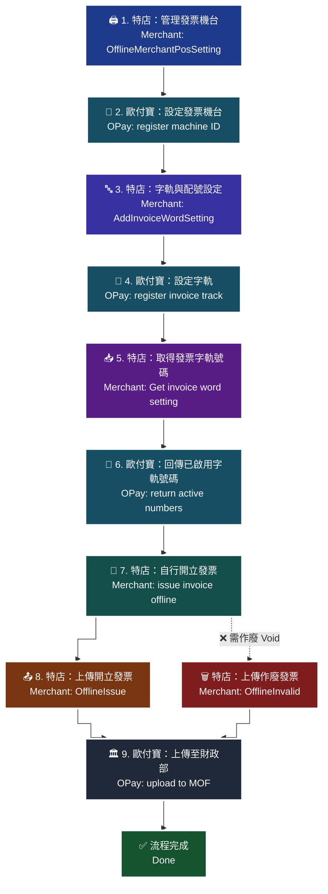

> ⚠️ 圖內細節未能自官方文件的文字內容取得，本圖依 API 語意重繪，請以官方文件圖片為準。（原文 §4 僅提供流程表格，未附圖；作廢分支為依 §14 `OfflineInvalid` 語意補繪。）

> ♿ 配色遵循 [`docs/accessibility.md`](../docs/accessibility.md)：WCAG AAA 對比 ≥7:1、Okabe-Ito 色盲安全色盤、16px 字體、直角連線、圖示＋文字雙編碼。

---

## 附錄 1. 交易狀態代碼表

- **來源**：i301 附錄 1「交易狀態代碼表」

原文說明（逐字照抄）：

> 因錯誤代碼一直在新增，詳細的錯誤代碼，請到廠商後台->系統開發管理->交易狀態代碼查詢。

> ⚠️ **原文此附錄的「交易狀態代碼表」本身是一張圖片（純文字中僅餘圖片佔位，位於原文第 1175 行），純文字抽取後**沒有任何表格列可供照抄**。原文本身也未以文字列出任何交易狀態代碼。**
>
> 因此本檔**無法**提供代碼清單，也**不自行補寫任何代碼**。請依上述路徑至廠商後台「系統開發管理 → 交易狀態代碼查詢」取得最新代碼表；若需離線清單，請向歐付寶索取。

**可從各 API 文字中確認的狀態語意（非完整代碼表，僅供對照）**：

| 欄位 | 值 | 語意（原文文字） |
|---|---|---|
| `TransCode` | `1` | 代表傳輸資料(MerchantID, RqHeader, Data)接收成功，其餘均為失敗 |
| `RtnCode` | `1` | 為成功，其餘為失敗。 |

---

## 附錄 2. URLEncode 轉換表

- **來源**：i301 附錄 2（完整照抄）

| 符號 | 編碼表 | .NET編碼(opay) |
|---|---|---|
| `-` | `%2d` | `-` |
| `_` | `%5f` | `_` |
| `.` | `%2e` | `.` |
| `!` | `%21` | `!` |
| `~` | `%7e` | `%7e` |
| `*` | `%2a` | `*` |
| `(` | `%28` | `(` |
| `)` | `%29` | `)` |
| space 空格 | `%20` | `+` |
| `@` | `%40` | `%40` |
| `#` | `%23` | `%23` |
| `$` | `%24` | `%24` |
| `%` | `%25` | `%25` |
| `^` | `%5e` | `%5e` |
| `&` | `%26` | `%26` |
| `=` | `%3d` | `%3d` |
| `+` | `%2b` | `%2b` |
| `;` | `%3b` | `%3b` |
| `?` | `%3f` | `%3f` |
| `/` | `%2f` | `%2f` |
| `\` | `%5c` | `%5c` |
| `>` | `%3e` | `%3e` |
| `<` | `%3c` | `%3c` |
| `%` | `%25` | `%25` |
| `` ` `` | `%60` | `%60` |
| `[` | `%5b` | `%5b` |
| `]` | `%5d` | `%5d` |
| `{` | `%7b` | `%7b` |
| `}` | `%7d` | `%7d` |
| `:` | `%3a` | `%3a` |
| `'` | `%27` | `%27` |
| `"` | `%22` | `%22` |
| `,` | `%2c` | `%2c` |
| &#124; | `%7c` | `%7c` |

（共 34 列，與原文列數一致；原文中 `%` 一列出現兩次，此處照抄保留。最後一列符號為半形直線 `|`。）

### ※注意事項（逐字照抄）

> ※注意事項：
> 請確認您的語言的UrlEncode function轉換後的結果符合附錄Urlencode轉換表中的「.NET編碼(opay)」欄位值，若有不符合的字元，請用字元替換功能處理，以免無法符合檢查規則。
> 例如：PHP urlencode function會將 ! 字元編碼成 %21，不符合「.NET編碼(opay)」，所以在PHP urlencode後需用 str_replace function 將%21轉回 ! 字元。以下僅以PHP轉換範例說明：

```php
$sMacValue = str_replace('%21', '!', $sMacValue);
$sMacValue = str_replace('%2a', '*', $sMacValue);
$sMacValue = str_replace('%28', '(', $sMacValue);
$sMacValue = str_replace('%29', ')', $sMacValue);
```

> 其它程式語言的轉換功能，請閱該程式語言的編碼轉換規則改寫。

---

## 附錄 3. 參數加密方式說明

- **來源**：i301 附錄 3

原文（逐字照抄）：

> 依提供AES加解密用的Key及IV，請將要加密的資料做URL Encode編碼，再進行AES加密
> AES加密的強度設定方式是128 bit, CipherMode:CBC, PaddingMode:PKCS7

### 加密流程

1. 將要加密的 Data（JSON 字串）做 **URLEncode**（需符合附錄 2 的「.NET編碼(opay)」欄位）。
2. 以 HashKey 為 Key、HashIV 為 IV，進行 **AES-128 / CBC / PKCS7** 加密。
3. 將密文（Base64）放入外層 `Data` 欄位送出。

### 解密流程

1. 取出回傳的外層 `Data` 密文。
2. 以 HashKey / HashIV 進行 **AES-128 / CBC / PKCS7** 解密。
3. 將解密結果做 **URLDecode**，即得 JSON。

### 官方範例（逐字照抄）

加密範例：Key=A123456789012345，IV=B123456789012345

(1) 加密前 Data 資料：

```
{"Name":"Test","ID":"A123456789"}
```

(2) URLEncode 編碼後結果：

```
%7B%22Name%22%3A%22Test%22%2C%22ID%22%3A%22A123456789%22%7D
```

(3) AES 加密後結果：

```
7woM9RorZKAtXJRVccAb0qhHYm+5lnlhBzyfh5EZdNck7PacNsRHgv/Jvp//ajJidqcQcs0UmAgPQVjXQHeziw==
```

解密範例：

(1) Data 密文：

```
7woM9RorZKAtXJRVccAb0qhHYm+5lnlhBzyfh5EZdNck7PacNsRHgv/Jvp//ajJidqcQcs0UmAgPQVjXQHeziw==
```

(2) AES 解密結果：

```
%7B%22Name%22%3A%22Test%22%2C%22ID%22%3A%22A123456789%22%7D
```

(3) URLDecode 解碼後結果：

```
{"Name":"Test","ID":"A123456789"}
```

> ⚠️ 上述範例的 Key/IV（`A123456789012345` / `B123456789012345`）為官方文件的示範值，**不是**測試環境金鑰；實際介接請使用 §3 的 HashKey / HashIV（測試環境）或正式環境金鑰。
